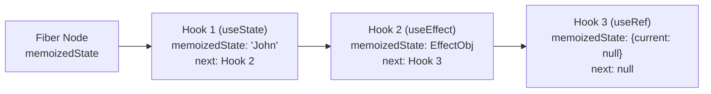
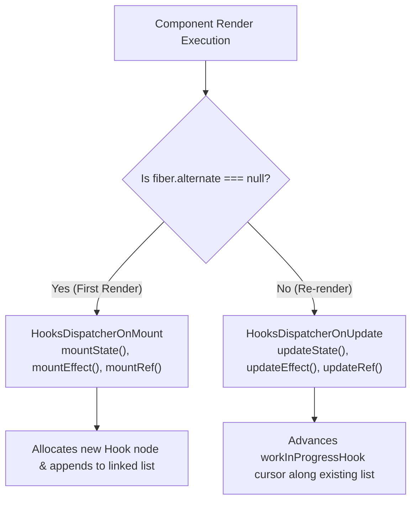
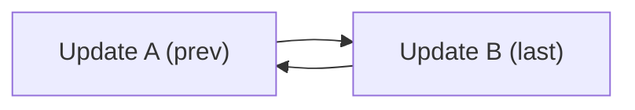

# 03. Hooks Internals, Linked Lists & State Mechanics

> "Hooks are not magic closures. In the React runtime, hooks are nodes in a singly-linked list attached directly to `fiber.memoizedState`. Understanding the dispatcher phase switches between `mount` and `update` is essential to mastering React state mechanics."  
> — *Referencing React Core Source Code (`ReactFiberHooks.js`) & Sophie Alpert's Hooks Deep Dive*

---

## 1. The Hook Linked List Topology

When a functional component executes, it has no `this` context. React attaches an internal linked list of **`Hook` objects** to the Fiber's `memoizedState` property:



### 1.1 The Internal `Hook` Node Structure
```typescript
interface Hook {
  memoizedState: any;           // The current state value (or effect object)
  baseState: any;               // The base state prior to pending updates
  baseQueue: Update<any> | null;// Pending updates that couldn't be processed due to lane priority
  queue: UpdateQueue<any> | null;// Circular singly-linked list of updates waiting to be processed
  next: Hook | null;            // Pointer to the next hook in the component
}
```

---

## 2. Dispatcher Phase Switching: Mount vs Update

React switches its internal global `ReactCurrentDispatcher` pointer depending on whether the component is mounting for the first time or re-rendering:



### Why Hooks Cannot Be Placed Inside `if` Statements:
During re-render (`HooksDispatcherOnUpdate`), React does **not** look up hooks by name. It simply walks the linked list by calling `workInProgressHook = currentHook.next`.
* If an `if` condition causes a hook to be skipped, the pointer alignment shifts by one.
* A `useState` hook will receive the memoized state of a `useEffect` hook, causing internal corruption and fatal runtime crashes!

---

## 3. Circular Linked List Update Queues in `useState`

When you call `setState(action)`, React does not mutate the state immediately. It appends the update to a **circular singly-linked list** (`hook.queue.pending`):


* **Why Circular?**: Holding a pointer to the *last* update allows React to find both the *first* update (`last.next`) and the *last* update in $O(1)$ time without traversing the list.

---

## 4. Do's, Don'ts & Production Gotchas

| Category | Rule | Deep Technical Rationale |
| :--- | :--- | :--- |
| **DON'T** | Never call Hooks conditionally, in loops, or nested functions. | Hooks rely on rigid index alignment along `fiber.memoizedState`. Skipping a hook desynchronizes the linked list pointer with the alternate tree. |
| **DO** | Use functional updates (`setCount(prev => prev + 1)`) when state depends on previous state. | Standard updates (`setCount(count + 1)`) capture the value of `count` from the closure of that specific render. In concurrent mode or batched event handlers, multiple updates will read stale closure values. |
| **GOTCHA** | `useState` initializers run on every render unless passed as a function. | `useState(computeExpensiveData())` evaluates the function on **every single re-render**, even though the result is discarded after mount! Use lazy initialization: `useState(() => computeExpensiveData())`. |
| **DON'T** | Do not mutate `useRef.current` during the render phase. | Mutating refs during the render body violates purity. Because Concurrent Mode can render a component and discard it without committing, the ref mutation will persist even if the render was abandoned. Only mutate refs in `useEffect` or event handlers. |
| **DO** | Pass primitive IDs rather than large objects into hook dependency arrays. | Passing `{ id: 10 }` creates a new object reference every frame, causing `useEffect` and `useMemo` to trigger unnecessarily on every render due to shallow reference comparison (`Object.is`). |
