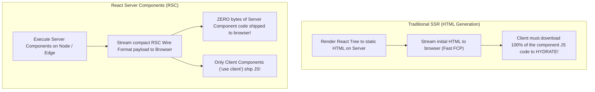
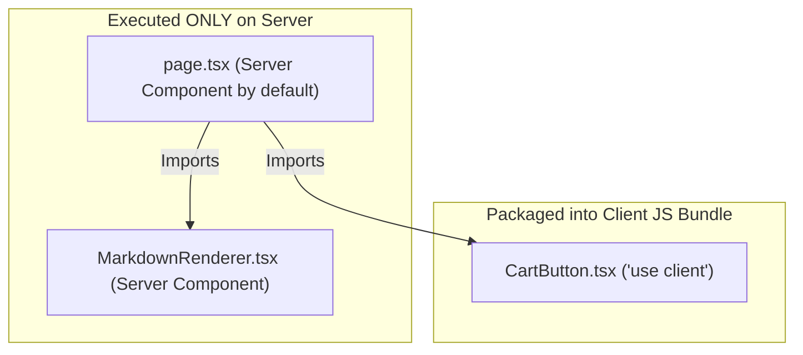

# 04. React Server Components (RSC) Architecture & Serialization

> "React Server Components (RSC) are not Server-Side Rendering (SSR). SSR converts a React tree into raw HTML text on initial load. RSC is a persistent dual-environment execution model where Server Components execute exclusively on the server and stream an intermediate JSON-like wire protocol to the client without shipping any JavaScript code."  
> — *Referencing React Server Components Specification & Sebastian Markbåge's RSC Architecture*

---

## 1. The Fundamental Distinction: SSR vs RSC



### Key Advantages of RSC:
1. **Zero-Bundle-Size Dependencies**: If a Server Component uses a 150 KB Markdown parser (`marked`), a syntax highlighter (`prismjs`), or date utilities (`date-fns`), **0 KB of that JavaScript is sent to the client browser**. Only the resulting virtual DOM tree is sent.
2. **Direct Backend Access**: Server Components can read local files, query PostgreSQL / MongoDB databases directly, and access internal microservices with zero API endpoints.

---

## 2. The RSC Wire Format Protocol

When a server renders an RSC tree, it emits a streaming, line-delimited format (Flight protocol):

```
M1:{"id":"./src/ProductCard.client.js","chunks":["client1"],"name":""}
J0:["$","div",null,{"className":"container","children":[["$","h1",null,{"children":"Products"}],["$","$L1",null,{"title":"Running Shoes","price":99}]]}]
```

* **`M1` (Module Reference Chunk)**: Informs the browser that a Client Component exists at `./src/ProductCard.client.js`, instructing the browser to asynchronously load that specific JavaScript bundle.
* **`J0` (JSON Tree Chunk)**: Represents the virtual DOM tree. Notice that `$L1` references the client module `M1`.
* **Slots & Holes**: Server Components define the layout skeleton, while Client Components fill the interactive slots.

---

## 3. The Client Boundary: Understanding `'use client'`

The directive `'use client'` does **not** mean "render only on the client".
* Client Components **still render on the server to generate initial HTML** during SSR!
* `'use client'` acts as a **module boundary declaration**: it instructs the compiler that this file and all its imported dependencies must be packaged into the client JavaScript bundle because they contain browser interactivity (hooks, state, event listeners).



---

## 4. Do's, Don'ts & Production Gotchas

| Category | Rule | Deep Technical Rationale |
| :--- | :--- | :--- |
| **DON'T** | Never use React state or lifecycle hooks (`useState`, `useEffect`, `useContext`) in Server Components. | Server Components execute once on the server and stream their result. They do not run in the browser and do not have an interactive lifecycle or event loop. Attempting to use `useState` triggers a compile error. |
| **DO** | Pass Server Components as `children` to Client Components to preserve zero-bundle-size benefits. | If a Client Component directly imports a Server Component, the compiler is forced to **downgrade the Server Component to a Client Component**, bundling all its dependencies into the client JS! Passing it as `children` allows the server to evaluate it in the server environment. |
| **DON'T** | Never import server-only code (e.g., database connection pools or secret API keys) into files with `'use client'`. | Any secret imported into a `'use client'` file is compiled into the public JavaScript bundle, exposing database credentials and API keys in client browser devtools. |
| **DO** | Guard server-only files with `import 'server-only'`. | Installing the `server-only` package throws a hard build-time error if another developer accidentally imports a database or secret utility into a Client Component. |
| **GOTCHA** | Props passed from Server Components to Client Components must be serializable. | Because props cross the network boundary via the RSC wire format, they cannot be functions, class instances, or symbols. They must be plain JSON-serializable types (strings, numbers, booleans, arrays, plain objects, or Promises). |
