# 05. Transitions, Server Actions & Form Status Primitives

> "React 19 elevates asynchronous state mutations to first-class language primitives. Instead of writing boilerplate `isSubmitting` flags, manual try/catch blocks, and custom abort controllers, React 19 introduces Server Actions, `useActionState`, `useFormStatus`, and `useOptimistic`."  
> — *Referencing React 19 Release Notes & React Server Actions RFC*

---

## 1. What are Server Actions?

A **Server Action** is an asynchronous function marked with the directive `'use server'` that executes securely on the server. It can be invoked directly from client-side forms or buttons without manually defining a REST or GraphQL endpoint:

```mermaid
flowchart LR
    ClientButton["Client Component (<form action={updateProfile}>)"] -->|"Automatic HTTP POST via Fetch"| NextServer["Next.js / Node Server"]
    NextServer -->|"Executes secure database mutation"| PostgreSQL["Database"]
    NextServer -->|"Returns updated RSC payload"| ClientButton
    ClientButton -->|"Automatic React revalidation"| ScreenUpdate["Screen re-renders with fresh data"]
```



---

## 2. Modern Form Mutation Primitives in React 19

React 19 introduces a triad of dedicated form hooks that work seamlessly across both client and server:

### 2.1 `useActionState`: Managing Asynchronous Mutation Lifecycle
Replaces manual loading, error, and response handling:
```tsx
'use client';
import { useActionState } from 'react';
import { updateShippingAddressAction } from '@/actions/checkout';

export function ShippingForm() {
  const [state, formAction, isPending] = useActionState(
    updateShippingAddressAction,
    { success: false, error: null }
  );

  return (
    <form action={formAction}>
      <input name="address" required placeholder="Enter street address" />
      <button type="submit" disabled={isPending}>
        {isPending ? 'Updating...' : 'Save Address'}
      </button>
      {state.error && <p className="error">{state.error}</p>}
      {state.success && <p className="success">Address saved!</p>}
    </form>
  );
}
```

### 2.2 `useFormStatus`: Context-Free Form Inspection
Allows deeply nested child components to know if their parent form is currently submitting, without passing props down:
```tsx
'use client';
import { useFormStatus } from 'react-dom';

export function SubmitButton({ label }: { label: string }) {
  const { pending } = useFormStatus();

  return (
    <button type="submit" disabled={pending} className={pending ? 'loading' : ''}>
      {pending ? 'Processing...' : label}
    </button>
  );
}
```

### 2.3 `useOptimistic`: Zero-Latency User Feedback
Instantly renders optimistic UI changes before the server response returns, automatically rolling back if the server action fails:
```tsx
'use client';
import { useOptimistic } from 'react';

export function CommentList({ comments, onAddComment }: { comments: string[]; onAddComment: (text: string) => Promise<void> }) {
  const [optimisticComments, addOptimisticComment] = useOptimistic(
    comments,
    (currentList, newCommentText: string) => [...currentList, newCommentText]
  );

  async function handleSubmit(formData: FormData) {
    const text = formData.get('comment') as string;
    addOptimisticComment(text); // Renders instantly on screen!
    await onAddComment(text);   // Replaced by authoritative server data
  }

  return (
    <div>
      {optimisticComments.map((c, i) => <p key={i}>{c}</p>)}
      <form action={handleSubmit}>
        <input name="comment" required />
        <button type="submit">Post Comment</button>
      </form>
    </div>
  );
}
```

---

## 3. Do's, Don'ts & Production Gotchas

| Category | Rule | Deep Technical Rationale |
| :--- | :--- | :--- |
| **DO** | Always validate and authorize inputs inside Server Actions using Zod. | Server Actions are **publicly exposed HTTP POST endpoints** under the hood. A malicious actor can inspect network calls and POST arbitrary JSON directly to the action endpoint. Never trust form parameters. |
| **DON'T** | Do not close over sensitive server secrets inside inline Server Actions in Client Components. | Inline Server Actions inside Client Components capture closures. If an action captures a server secret, that secret may be serialized into the client payload. Put Server Actions in dedicated `'use server'` files. |
| **GOTCHA** | `useFormStatus` must be rendered **inside** a `<form>`, not in the component defining the form. | `useFormStatus` reads its status from an internal React DOM context provided by the `<form>` tag. If called in the component that renders the `<form>`, the context is not yet available, and `pending` will always evaluate to `false`. |
| **DO** | Use `revalidatePath` or `revalidateTag` in Server Actions to purge stale server caches. | Mutating data in a Server Action without invalidating the Next.js Data Cache causes the client to display stale cached data upon subsequent page loads. |
| **DON'T** | Avoid using Server Actions for high-frequency keystroke events. | Server Actions perform network roundtrips over HTTP. Triggering them on every keydown in a search box will flood the server with network traffic. Use client state or debounce search queries. |
