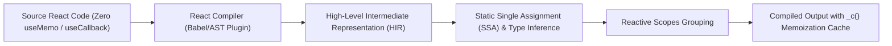
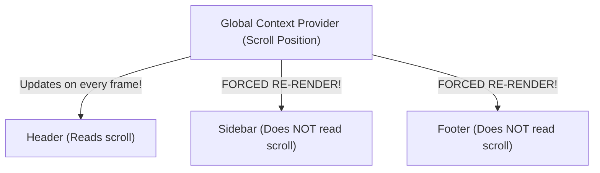

# 06. Performance Optimization, Memoization & Compiler Rules

> "For years, React developers spent hours littering codebases with `useMemo`, `useCallback`, and `React.memo` to prevent unnecessary re-renders. The React Compiler (formerly React Forget) changes the paradigm completely by automating fine-grained memoization at compile time through static code analysis."  
> — *Referencing React Compiler Architecture & React Performance Engineering*

---

## 1. How the React Compiler Works Under the Hood

The **React Compiler** is an optimizing compiler that operates as a Babel / Metro / Turbopack plugin. It inspects JavaScript ASTs and automatically inserts fine-grained memoization instructions:



### 1.1 Before vs After Compilation
Consider clean, idiomatic React code:
```tsx
// Source code written by developer
function OrderReceipt({ order, user }) {
  const formattedTotal = formatCurrency(order.total);
  return (
    <div>
      <h1>Receipt for {user.name}</h1>
      <p>Total: {formattedTotal}</p>
    </div>
  );
}
```

The React Compiler transforms this into cached reactive blocks using an internal cache array (`_c`):
```javascript
// Compiled output generated by React Compiler
function OrderReceipt(props) {
  const $ = _c(4); // Allocates a 4-slot memoization cache
  const { order, user } = props;
  
  let t0;
  if ($[0] !== order.total) {
    t0 = formatCurrency(order.total);
    $[0] = order.total;
    $[1] = t0;
  } else {
    t0 = $[1];
  }
  
  let t1;
  if ($[2] !== user.name || $[3] !== t0) {
    t1 = (
      <div>
        <h1>Receipt for {user.name}</h1>
        <p>Total: {t0}</p>
      </div>
    );
    $[2] = user.name;
    $[3] = t0;
  } else {
    t1 = $[3];
  }
  return t1;
}
```
Notice that **every single value and JSX element is memoized automatically** without manual boilerplate.

---

## 2. The Rules of React: Compiler Prerequisite

The compiler can only optimize code that obeys the **Rules of React**:
1. **Components and Hooks must be Pure**: Identical inputs must always produce identical outputs.
2. **Never Mutate State or Props Directly**: Mutating objects breaks the compiler's reactive scope inference.
3. **Hook Invariants**: Hooks must be called unconditionally at the top level.

---

## 3. Context Optimization: Avoiding the Global Re-render Trap

A common performance disaster in React is placing high-frequency state (e.g., scroll position, cursor coordinates, animated timers) inside a global React Context:



When a Context value changes, **every single component that calls `useContext()` will re-render**, even if the specific value it consumes hasn't changed!

### The Solution:
1. **Split Contexts**: Separate volatile state from stable state (`ThemeContext` vs `AuthContext`).
2. **Use Atomic State Managers**: Zustand or Jotai subscribe only to specific state slices.

---

## 4. Do's, Don'ts & Production Gotchas

| Category | Rule | Deep Technical Rationale |
| :--- | :--- | :--- |
| **DON'T** | Never create component definitions inside another component's render body. | Defining `function Child() { ... }` inside a parent component recreates the component's type definition on every single render. React sees a completely new component type, causing it to **destroy the entire DOM subtree and reset all child state**. Always declare components at the module top level. |
| **DO** | Colocate state as close to where it is used as possible. | Hoisting state up to a parent component causes the entire subtree to re-render whenever the state changes. Moving state down to the leaf node isolates re-renders to only the elements that visually change. |
| **GOTCHA** | Wrapping inline object literals in props (`style={{ marginTop: 10 }}`) breaks manual memoization. | In code without the React Compiler, `{ marginTop: 10 }` creates a new object reference in physical memory on every frame, immediately defeating `React.memo` on the child component. Use static constants outside the component or rely on Tailwind CSS classes. |
| **DO** | Leverage virtualization (`@tanstack/react-virtual`) for lists containing > 100 items. | Creating thousands of physical DOM nodes exhausts browser memory and causes layout recalculation thrashing. Virtualization renders only the DOM nodes currently visible within the viewport window. |
| **DON'T** | Do not wrap simple scalar operations in `useMemo`. | `useMemo(() => a + b, [a, b])` is an anti-pattern. Allocating the memoization closure, dependency array, and checking dependencies on every render costs more CPU cycles than simply re-adding two numbers! |
