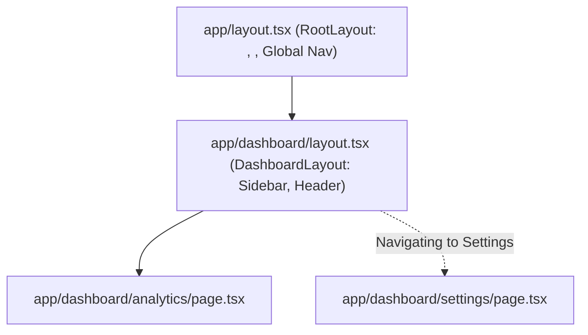
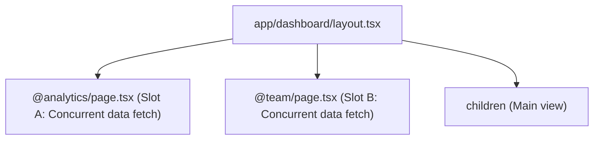

# 01. App Router Internals, Layouts & Server-Client Boundary

> "The Next.js App Router is built on top of React Server Components and nested route segments. Understanding how the layout tree preserves state across navigations, how parallel and intercepting routes operate, and how to position the Server-Client boundary is fundamental to architecting enterprise web applications."  
> — *Referencing Next.js 15 Documentation & Vercel Engineering Architecture*

---

## 1. Nested Layouts & Partial Rendering Mechanics

In the legacy Pages Router (`_app.js`), navigating between pages caused the entire page tree to unmount and remount from scratch, resetting scroll positions and form states.

In the **App Router**, layouts form a nested hierarchy that supports **Partial Rendering**:



### Partial Rendering Invariant:
When navigating from `/dashboard/analytics` to `/dashboard/settings`:
* `RootLayout` and `DashboardLayout` **do NOT re-render**.
* Their component state, open dropdowns, audio players, and DOM elements remain completely untouched.
* Only the innermost `page.tsx` segment is swapped out on the client.

---

## 2. Advanced Routing Patterns: Parallel & Intercepting Routes

Next.js provides declarative file-system conventions for complex modal overlays and multi-pane dashboards:



### 2.1 Parallel Routes (`@slot`)
Allows rendering multiple independent pages concurrently in the same view layout with independent loading and error boundaries:
```tsx
// app/dashboard/layout.tsx
export default function DashboardLayout({
  children,
  analytics,
  team,
}: {
  children: React.ReactNode;
  analytics: React.ReactNode;
  team: React.ReactNode;
}) {
  return (
    <div className="dashboard-grid">
      <main>{children}</main>
      <aside>{analytics}</aside>
      <aside>{team}</aside>
    </div>
  );
}
```

### 2.2 Intercepting Routes (`(.)photo/[id]`)
Allows intercepting a route segment to display it inside a modal (e.g., photo feed modal) when navigating client-side, while preserving a shareable direct URL (`/photo/123`) that renders a full standalone page on hard refresh.

---

## 3. Mastering the Server-Client Boundary

A common architectural error is marking an entire page with `'use client'`, throwing away the benefits of Server Components.

### The Interleaving Composition Pattern:
Client Components can wrap Server Components if the Server Components are passed as **`children`**:

```tsx
// 1. Client Component wrapper: Interactive Modal Container
'use client';
import { useState } from 'react';

export function InteractiveModal({ children }: { children: React.ReactNode }) {
  const [isOpen, setIsOpen] = useState(true);
  if (!isOpen) return null;

  return (
    <div className="modal-backdrop">
      <button onClick={() => setIsOpen(false)}>Close</button>
      {/* Server Component renders here with zero client JS! */}
      <div className="modal-content">{children}</div>
    </div>
  );
}
```

```tsx
// 2. Server Component Page: Fetches data directly and passes into modal
import { InteractiveModal } from '@/components/InteractiveModal';
import { HeavyDataView } from '@/components/HeavyDataView'; // Server Component!

export default async function Page() {
  const data = await db.orders.findMany(); // Direct SQL fetch!

  return (
    <InteractiveModal>
      <HeavyDataView data={data} />
    </InteractiveModal>
  );
}
```

---

## 4. Do's, Don'ts & Production Gotchas

| Category | Rule | Deep Technical Rationale |
| :--- | :--- | :--- |
| **DO** | Push `'use client'` down to the leaf nodes of your component tree. | The higher `'use client'` is placed in the tree, the more code and third-party dependencies are forced into the client JavaScript bundle. Keep layouts and pages as Server Components and only mark buttons, inputs, and modals as Client Components. |
| **DON'T** | Never use `window`, `document`, or `localStorage` directly in a Client Component during mount. | Client Components still render on the server during initial SSR. Accessing `window` during the render body or initial state evaluation will throw `ReferenceError: window is not defined` on the server! Access them only inside `useEffect`. |
| **GOTCHA** | Static route generation (`generateStaticParams`) must return an array of strings for all slug segments. | If an ID is a number (`id: 42`), passing `{ id: 42 }` will fail compilation or produce subtle 404s at runtime. Slugs must always be strings: `{ id: '42' }`. |
| **DO** | Use `loading.tsx` to automatically generate Suspense boundaries around page segments. | Next.js automatically wraps `page.tsx` in a React `<Suspense fallback={<Loading />}>`, enabling instant streaming navigation without blocking on slow backend queries. |
| **DON'T** | Avoid reading `cookies()` or `headers()` in root layouts unless dynamic rendering is strictly required. | Calling `cookies()` or `headers()` opts the **entire route tree into Dynamic Server Rendering**, disabling static optimization (SSG/ISR) and increasing server CPU costs. |
