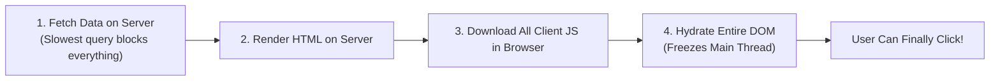
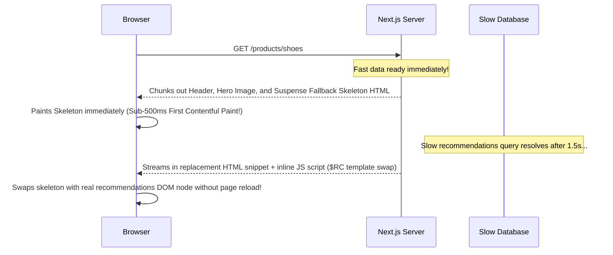

# 02. Streaming SSR, Progressive Hydration & Suspense

> "Monolithic SSR was an all-or-nothing bottleneck: a page could not show any HTML until the slowest database query resolved, and user inputs were completely dead until the entire client bundle finished hydrating. Streaming SSR with progressive hydration breaks the page into independent asynchronous chunks streamed over HTTP/2."  
> — *Referencing React 19 Streaming Architecture & Modern Web Vitals Engineering*

---

## 1. The Monolithic SSR Hydration Waterfall Problem

In traditional SSR, the user experience suffered from three sequential blocking bottlenecks:



If a product page had an instant hero image but a slow recommended products section (taking 2 seconds to query), the **entire page was blocked from showing anything for 2 full seconds**!

---

## 2. Streaming SSR Mechanics: Out-of-Order HTML Streaming

Next.js 15 uses **HTTP Chunked Transfer Encoding** (`Transfer-Encoding: chunked`) combined with React Suspense:



### The In-Flight DOM Replacement Script:
When the slow server component finishes rendering, React streams an inline `<template>` block and a micro-script that replaces the fallback DOM element in place:
```html
<div id="B:0">Loading recommendations skeleton...</div>

<!-- Later in the stream: -->
<template id="P:0"><div>Real recommended products list!</div></template>
<script>$RC("B:0", "P:0")</script>
```

---

## 3. Selective Progressive Hydration

Hydration no longer needs to wait for all JavaScript to download.
With React Suspense:
1. Components inside separate `<Suspense>` boundaries **hydrate independently**.
2. **User Interaction Prioritization**: If the user clicks on a button inside a component that hasn't hydrated yet, React **prioritizes that specific subtree's hydration immediately**, pausing other background hydrations to respond to the click with zero perceived latency.

---

## 4. Do's, Don'ts & Production Gotchas

| Category | Rule | Deep Technical Rationale |
| :--- | :--- | :--- |
| **DO** | Wrap slow third-party API calls and recommendation feeds in `<Suspense>`. | Putting independent `<Suspense>` boundaries around slow components allows the rest of the critical page content (hero, nav, pricing) to render and become interactive immediately. |
| **DON'T** | Avoid creating deeply nested, uncoordinated Suspense cascades. | Having 15 separate Suspense spinners popping in randomly across the screen produces severe **Cumulative Layout Shift (CLS)** and a jarring visual experience. Group related cards under a unified Suspense boundary. |
| **GOTCHA** | Hydration mismatch warnings occur when server and client outputs differ. | Rendering dynamic time (`new Date().toLocaleTimeString()`), randomized IDs (`Math.random()`), or checking `window.innerWidth` during initial render will cause React to flag a fatal hydration mismatch error because server HTML does not match client virtual DOM. Use `useId()` for unique IDs and set client-specific values in `useEffect`. |
| **DO** | Use Skeleton loaders that match the exact aspect ratio of the final content. | Mismatched skeleton heights cause layout shifts when replaced by the real data, penalizing Google Core Web Vitals (CLS score). |
| **DON'T** | Do not wrap components that fetch critical metadata (e.g. SEO tags) inside Suspense. | Search engine crawlers need immediate access to title, description, and canonical link tags in the `<head>` block before following links. |
