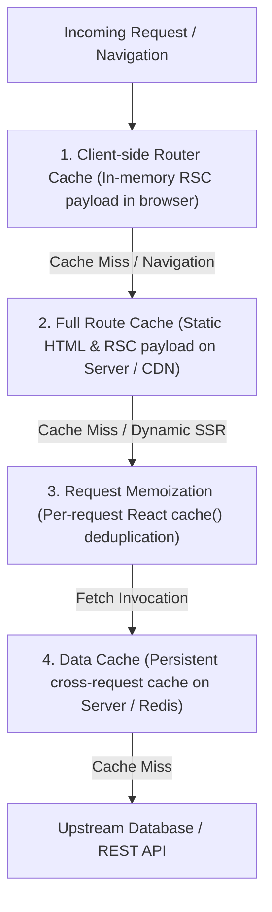

# 03. The Next.js 15 Multi-Tier Caching Pipeline

> "Next.js 15 completely overhauled its caching architecture to give developers explicit, predictable control over stale data. Understanding the four distinct caching layers—Request Memoization, Data Cache, Full Route Cache, and Router Cache—is essential to preventing stale data bugs and runaway server costs."  
> — *Referencing Next.js 15 Caching Architecture Documentation & Vercel Caching RFC*

---

## 1. The Four Caching Tiers: Comprehensive Topology

Next.js implements four separate, cooperative caching layers:



---

## 2. Deep Dive: Layer-by-Layer Mechanics

### Tier 1: Client-Side Router Cache (Browser In-Memory)
* **Location**: User's web browser RAM.
* **Duration**: Ephemeral (30 seconds for dynamic routes, 5 minutes for static routes).
* **Purpose**: Prevents re-fetching the layout or previously visited page segments when the user navigates back and forth between tabs.

### Tier 2: Full Route Cache (Server / CDN)
* **Location**: Server disk, Vercel Edge Network, or Cloudflare CDN.
* **Duration**: Persistent across user requests.
* **Purpose**: Generated at build time (Static Site Generation / SSG). Serves pre-computed HTML and RSC payloads with sub-50ms latency.

### Tier 3: Request Memoization (`React.cache`)
* **Location**: In-memory during a **single** server render request.
* **Duration**: Lifecycle of the single HTTP request.
* **Purpose**: If three separate Server Components in the same page call `getUserProfile(id)`, React memoizes the first invocation and reuses the Promise for the other two calls. **Zero redundant network roundtrips within the same request.**

### Tier 4: Persistent Data Cache (`fetch` with Cache Tags)
* **Location**: Persistent file system on the server or external distributed key-value store (e.g., Redis).
* **Duration**: Survives across multiple user requests and deployments until explicitly revalidated.
* **Next.js 15 Change**: In Next.js 15, `fetch` requests default to **`no-store`** unless explicitly configured, eliminating accidental stale data bugs from earlier versions!

---

## 3. Explicit Cache Invalidation: Tag-Based Revalidation

Instead of relying on rigid time-to-live (TTL) timers, enterprise architectures use **Tag-Based On-Demand Revalidation**:

```tsx
// 1. In Server Component Data Fetcher: Tag the request
export async function getProductCatalog() {
  const res = await fetch('https://api.enterprise.com/v1/products', {
    next: {
      tags: ['products-catalog'], // Associating cache tag
    },
  });
  return res.json();
}

// 2. In Server Action or Webhook: Purge cache instantly on mutation
'use server';
import { revalidateTag } from 'next/cache';

export async function updateProductPriceAction(productId: string, newPrice: number) {
  await db.products.update({ where: { id: productId }, data: { price: newPrice } });
  
  // Instantly invalidates all cached queries tagged with 'products-catalog'!
  revalidateTag('products-catalog');
}
```

---

## 4. Do's, Don'ts & Production Gotchas

| Category | Rule | Deep Technical Rationale |
| :--- | :--- | :--- |
| **DO** | Use `revalidateTag` rather than `revalidatePath` whenever possible. | `revalidatePath('/dashboard')` purges the cache for the entire route segment and all child pages. `revalidateTag` invalidates only the specific dataset across any page that uses it, maintaining maximum cache hit rates across your CDN. |
| **DON'T** | Never use `no-store` blindly across an entire application. | Setting `export const dynamic = 'force-dynamic'` everywhere turns off the Full Route Cache and Data Cache completely. Every incoming HTTP request will re-query your primary database, causing database connection exhaustion and high cloud compute bills. |
| **GOTCHA** | `React.cache()` only memoizes function calls with identical arguments using `Object.is`. | If you pass an object literal `{ id: 10 }` as an argument to a memoized function, a new object reference is created each time, completely defeating the memoization cache! Pass primitive strings or numbers instead. |
| **DO** | Use `export const revalidate = 3600` for content that changes predictably on a schedule. | Time-based Incremental Static Regeneration (ISR) serves cached pages instantly from CDN edge nodes, re-generating the page in the background only when the stale window expires. |
| **DON'T** | Do not mix personalized user data into statically cached pages. | Caching a page that displays user account numbers or email addresses in the Full Route Cache will leak one user's private data to other users through the CDN! Always fetch personalized user data in Client Components or dynamic non-cached segments. |
