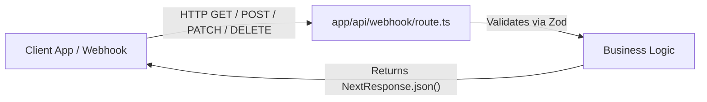
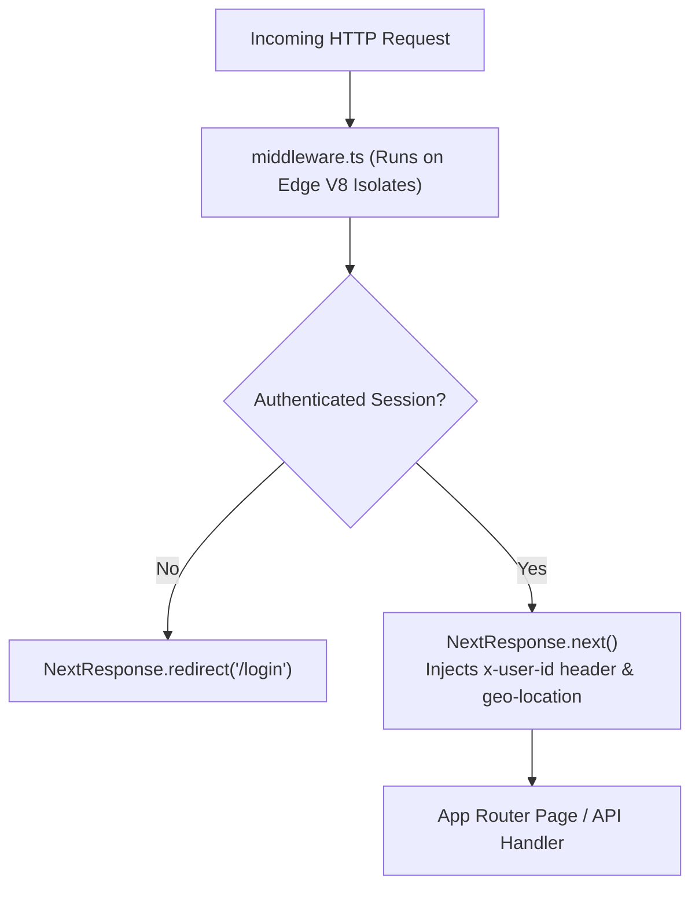

# 04. Route Handlers, Server Middleware & Edge Runtime

> "Next.js is not just a UI framework; it is a full-stack distributed compute platform. Route Handlers provide standard Web API HTTP endpoints, Middleware intercepts requests before they hit the cache or render tree, and the Edge Runtime provides ultra-low latency execution on lightweight V8 isolates."  
> — *Referencing Next.js Edge Architecture & V8 Isolate Cloud Topologies*

---

## 1. Route Handlers: Modern Web Standards API

Route Handlers (`route.ts`) replace legacy API Routes (`pages/api`). They are built on standard Web `Request` and `Response` objects:



### Production Route Handler with Strict Typing & Streaming (`app/api/stream/route.ts`):
```typescript
import { NextRequest, NextResponse } from 'next/server';

export const runtime = 'nodejs'; // or 'edge'

export async function GET(request: NextRequest) {
  const encoder = new TextEncoder();

  // Create an asynchronous readable stream (Server-Sent Events)
  const stream = new ReadableStream({
    async start(controller) {
      for (let i = 1; i <= 5; i++) {
        controller.enqueue(encoder.encode(`data: ${JSON.stringify({ tick: i })}\n\n`));
        await new Promise((resolve) => setTimeout(resolve, 1000));
      }
      controller.close();
    },
  });

  return new NextResponse(stream, {
    headers: {
      'Content-Type': 'text/event-stream',
      'Cache-Control': 'no-cache',
      Connection: 'keep-alive',
    },
  });
}
```

---

## 2. Server Middleware: Request Interception Pipeline

Next.js **Middleware** runs before any request hits the router cache, page layout, or API handler:



### Production Security & Rate-Limiting Middleware:
```typescript
import { NextResponse } from 'next/server';
import type { NextRequest } from 'next/server';

export function middleware(request: NextRequest) {
  const token = request.cookies.get('session_token')?.value;

  // Protect private routes
  if (request.nextUrl.pathname.startsWith('/dashboard')) {
    if (!token) {
      const loginUrl = new URL('/login', request.url);
      loginUrl.searchParams.set('redirect', request.nextUrl.pathname);
      return NextResponse.redirect(loginUrl);
    }
  }

  // Inject security headers and trace IDs
  const requestHeaders = new Headers(request.headers);
  requestHeaders.set('x-trace-id', crypto.randomUUID());

  return NextResponse.next({
    request: {
      headers: requestHeaders,
    },
  });
}

// Ensure middleware only runs on target paths, ignoring static images/fonts
export const config = {
  matcher: ['/((?!api|_next/static|_next/image|favicon.ico).*)'],
};
```

---

## 3. Node.js Runtime vs Edge Runtime

| Runtime Dimension | Node.js Runtime (Default) | Edge Runtime |
| :--- | :--- | :--- |
| **Underlying Engine** | Full Node.js environment | V8 Isolate sandbox (Web APIs only) |
| **Startup Latency** | Cold start: $200\text{ms} - 1000\text{ms}$ | Cold start: **$< 5\text{ms}$** |
| **Available APIs** | All Node.js built-ins (`fs`, `child_process`, `net`) | Web Standards (`fetch`, `crypto`, `ReadableStream`) |
| **Max Memory Limit** | Typically 512MB - 1024MB | Typically 128MB |
| **Ideal Production Use**| Complex ORMs (Prisma, TypeORM), heavy file manipulation | Auth checks, bot protection, geo-routing, header rewriting |

---

## 4. Do's, Don'ts & Production Gotchas

| Category | Rule | Deep Technical Rationale |
| :--- | :--- | :--- |
| **DON'T** | Never use Node.js specific modules (`fs`, `path`, `process.cwd()`) in Edge Runtime files. | The Edge Runtime executes inside lightweight V8 sandboxes that do not include Node.js C++ bindings. Importing `fs` will cause a build error or runtime failure. Use Web Crypto (`crypto.subtle`) and standard Web Streams. |
| **DO** | Configure strict `matcher` patterns in `middleware.ts`. | If the matcher is omitted or matches `/*`, middleware will execute on **every single static asset request** (every PNG image, CSS file, and font file), increasing server invocation counts and latency. |
| **GOTCHA** | Modifying headers in middleware requires passing modified headers to `NextResponse.next({ request: { headers } })`. | Setting headers directly on the response (`res.headers.set(...)`) sets response headers back to the browser, but does **not** pass them forward to subsequent Server Components! You must modify the request headers explicitly. |
| **DO** | Use Route Handlers for third-party webhooks (Stripe, GitHub, Twilio). | Webhooks require raw request payloads for signature verification. Server Actions cannot receive raw unparsed byte buffers. |
| **DON'T** | Do not call your own Route Handlers from Server Components via `fetch('/api/...')`. | Calling your own API routes from a Server Component creates an unnecessary HTTP network roundtrip to localhost! Call the underlying database or business function directly inside the Server Component. |
