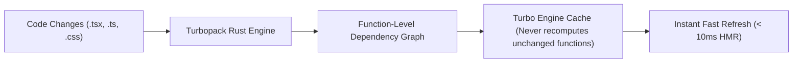

# 05. Enterprise Project Structure, Turbopack & Monorepo

> "As Next.js applications grow past 100,000 lines of code, maintaining a flat `/app` directory causes build slowdowns, module dependency tangle, and team collision. Production Next.js web applications are organized into domain-driven feature modules or multi-package monorepos powered by Turborepo and the Rust-based Turbopack bundler."  
> — *Referencing Next.js Enterprise Architecture & Vercel Turborepo Engineering*

---

## 1. Feature-First Directory Layout Architecture

In production, application code is partitioned into **Core Infrastructure** and **Autonomous Feature Modules**:

```
my-enterprise-nextjs-app/
├── app/                                        # Next.js 15 App Router (Routing Shell ONLY)
│   ├── (auth)/                                 # Route Group: Unauthenticated authentication flow
│   │   ├── login/page.tsx
│   │   └── register/page.tsx
│   ├── (dashboard)/                            # Route Group: Authenticated customer portal
│   │   ├── layout.tsx
│   │   ├── catalog/page.tsx
│   │   └── checkout/page.tsx
│   ├── api/                                    # Public Webhooks & External Route Handlers
│   │   └── webhooks/stripe/route.ts
│   ├── layout.tsx                              # Root HTML shell & Theme Providers
│   ├── loading.tsx                             # Top-level streaming skeleton
│   ├── error.tsx                               # Top-level client error boundary
│   └── not-found.tsx                           # Global 404 page
│
├── src/                                        # Core Application Code
│   ├── components/                             # Global Reusable Design System (Atomic UI)
│   │   ├── ui/
│   │   │   ├── Button.tsx
│   │   │   ├── Dialog.tsx
│   │   │   └── Input.tsx
│   │   └── LayoutShell.tsx
│   │
│   ├── features/                               # Domain-Driven Autonomous Feature Packages
│   │   ├── auth/                               # Feature: User Authentication
│   │   │   ├── actions/                        # Server Actions ('use server')
│   │   │   │   └── loginAction.ts
│   │   │   ├── components/                     # Feature-specific UI components
│   │   │   │   └── LoginForm.tsx
│   │   │   ├── hooks/                          # Custom Client Hooks
│   │   │   │   └── useSession.ts
│   │   │   ├── services/                       # Direct Database Services (Server only)
│   │   │   │   └── authService.ts
│   │   │   └── types/                          # Domain Zod schemas & TypeScript types
│   │   │       └── auth.types.ts
│   │   │
│   │   ├── catalog/                            # Feature: Product Catalog
│   │   │   ├── components/
│   │   │   ├── services/
│   │   │   └── types/
│   │   │
│   │   └── checkout/                           # Feature: Payment & Order Processing
│   │       ├── actions/
│   │       │   └── processCheckoutAction.ts
│   │       ├── components/
│   │       │   └── CheckoutPaymentSheet.tsx
│   │       └── services/
│   │           └── paymentService.ts
│   │
│   ├── lib/                                    # Shared Utilities & Infrastructure Singletons
│   │   ├── db/                                 # Database client (Prisma / Drizzle / Kysely)
│   │   │   └── client.ts
│   │   ├── env.ts                              # Type-safe environment variables via Zod
│   │   └── utils.ts                            # Class merge utilities (clsx, tailwind-merge)
│   │
│   └── middleware.ts                           # Server Middleware (Runs on Edge)
│
├── public/                                     # Static public assets (SVGs, favicon)
├── next.config.ts                              # Next.js compiler options (Turbopack, CSP)
├── tsconfig.json                               # Strict path aliases (@features/*, @lib/*)
└── tailwind.config.ts                          # Tailwind CSS design system tokens
```

---

## 2. Turbopack: The Rust-Based Incremental Engine

Next.js 15 uses **Turbopack** (the Rust successor to Webpack).



### Why Turbopack Outperforms Webpack:
1. **Memory-Mapped Rust Architecture**: Built with native Rust concurrency and memory safety.
2. **Function-Level Incremental Computation**: Webpack re-bundles entire file modules; Turbopack tracks dependencies down to individual JavaScript function AST nodes. If a helper function inside a file doesn't change, Turbopack reuses the cached compilation output.
3. **Lazy Compilation**: Turbopack only compiles the specific route the developer is actively viewing in their browser, keeping dev server cold start under 1 second even in codebases with 5,000 components.

---

## 3. Type-Safe Environment Variables with Zod (`src/lib/env.ts`)

A common production outage occurs when a developer forgets to set an environment variable in production, crashing the server during runtime.
Enterprise applications validate environment variables at startup:

```typescript
import { z } from 'zod';

const envSchema = z.object({
  NODE_ENV: z.enum(['development', 'test', 'production']).default('development'),
  DATABASE_URL: z.string().url(),
  STRIPE_SECRET_KEY: z.string().min(1),
  NEXT_PUBLIC_APP_URL: z.string().url(),
});

const parsed = envSchema.safeParse(process.env);

if (!parsed.success) {
  console.error('FATAL: Invalid environment variables detected:\n', parsed.error.format());
  process.exit(1);
}

export const env = parsed.data;
```

---

## 4. Do's, Don'ts & Production Gotchas

| Category | Rule | Deep Technical Rationale |
| :--- | :--- | :--- |
| **DO** | Keep `app/` strictly as a thin routing layer. | Do not place heavy business logic or state machines directly inside `app/`. Treat `app/` as pure routing controllers that simply import and assemble domain features from `src/features/*`. |
| **DON'T** | Never use relative import paths across feature boundaries (`../../features/auth/components`). | Deep relative imports create brittle refactoring headaches and break module boundaries. Always use strict TypeScript path aliases defined in `tsconfig.json` (`@features/auth/*`, `@components/*`). |
| **GOTCHA** | `next/image` requires explicit image domain whitelisting in `next.config.ts`. | Loading remote images from an S3 bucket or CDN will throw a runtime error unless the host domain is explicitly declared under `images.remotePatterns` in `next.config.ts`. |
| **DO** | Enable TypeScript strict mode and strict null checks (`strict: true`). | Prevents subtle `undefined is not an object` errors from slipping into production Server Actions. |
| **DON'T** | Avoid exporting default anonymous functions in page components (`export default () => ...`). | Anonymous component exports make React DevTools component trees unreadable, obfuscate error stack traces, and disable Fast Refresh optimization. Always use named functions (`export default function CheckoutPage()`). |
