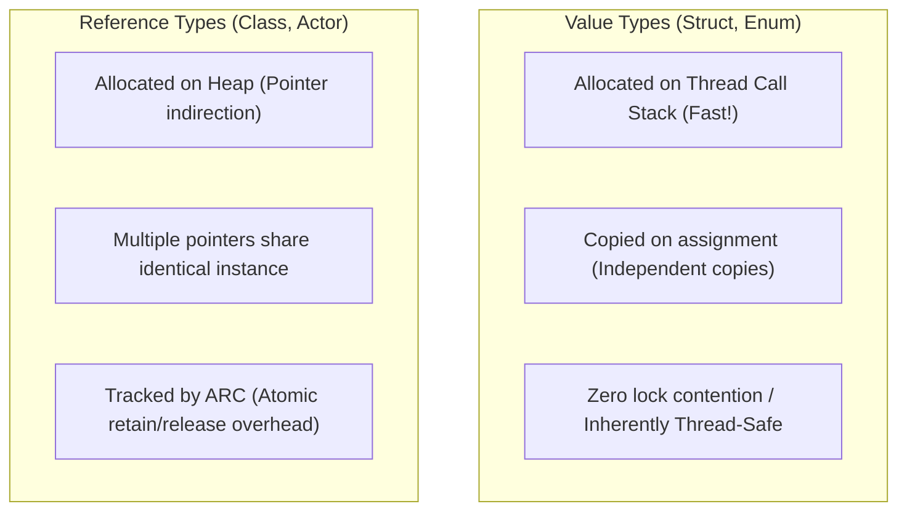
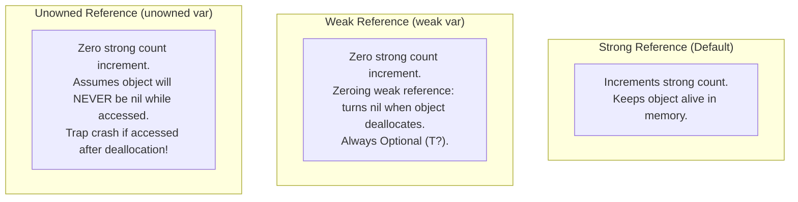
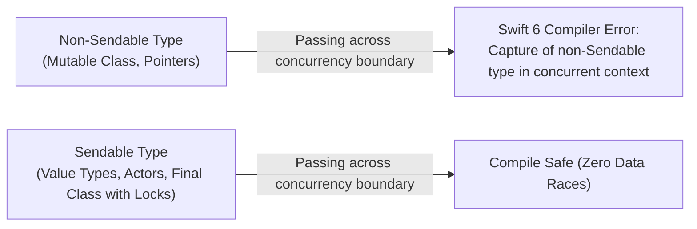

# 01. Swift 6 Language In-Depth, Type System & ARC Internals

> "Swift is a statically typed, value-oriented language designed for maximum performance, ergonomic safety, and compile-time correctness. With Swift 6, data-race safety is no longer a runtime debugging problem—it is enforced mathematically at compile time by the compiler's strict concurrency checker."  
> — *Referencing The Swift Programming Language (Apple) & Advanced Swift (Chris Eidhof)*

---

## 1. Value Types vs Reference Types & Copy-on-Write (COW)

Swift's type system makes a fundamental architectural distinction between **Value Types** (`struct`, `enum`, `Tuple`) and **Reference Types** (`class`, `actor`).



### 1.1 Copy-On-Write (COW) Optimization
Standard Swift collections (`Array`, `Dictionary`, `Set`, `String`) are value types with value semantics, but copying a 1,000,000-element array on every function call would destroy performance.
Swift solves this via **Copy-On-Write (COW)**:
* When an array is assigned to a new variable, both variables point to the **same underlying heap storage buffer**.
* A true physical memory copy is created **only if and when** one of the variables mutates the buffer.

### 1.2 Implementing Production Custom Copy-On-Write
Below is how to implement custom COW using Swift's `isKnownUniquelyReferenced`:

```swift
final class RawDataStorage<T> {
    var payload: T
    init(payload: T) { self.payload = payload }
}

struct FastBuffer<T> {
    private var storage: RawDataStorage<T>

    init(initial: T) {
        self.storage = RawDataStorage(payload: initial)
    }

    var value: T {
        get { storage.payload }
        set {
            // If more than one reference points to storage, clone before mutating!
            if !isKnownUniquelyReferenced(&storage) {
                storage = RawDataStorage(payload: newValue)
            } else {
                storage.payload = newValue
            }
        }
    }
}
```

---

## 2. Automatic Reference Counting (ARC) Internals

Swift does not use a tracing garbage collector like the JVM or Dart VM. It uses **Automatic Reference Counting (ARC)**:
* Every class instance maintains an internal reference count header (strong, unowned, weak).
* The compiler inserts `swift_retain` and `swift_release` instructions at compile time.
* When the strong reference count reaches zero, `deinit` executes immediately, and the memory is reclaimed without GC pause.



### 2.1 The Retain Cycle Trap & Closure Capture Lists
When two objects hold strong references to each other, neither reference count can reach zero, resulting in a **permanent memory leak**.
* **Closure Capture**: Closures in Swift are reference types that capture values from their surrounding scope.
```swift
class OrderService {
    var onComplete: (() -> Void)?
    var orderId: String = "ORD-991"

    func startTask() {
        // [weak self] breaks the retain cycle!
        onComplete = { [weak self] in
            guard let self else { return }
            print("Order completed: \(self.orderId)")
        }
    }
}
```

---

## 3. Swift 6 Compile-Time Data-Race Safety & `Sendable`

In Swift 6, data races are caught at compile time.



### 3.1 The `Sendable` Protocol
A type is `Sendable` if it can be safely transferred across concurrency domains (actors, tasks, threads):
* **Implicitly Sendable**: All Swift value types whose stored properties are Sendable (`Int`, `String`, structs of Sendable types).
* **Actors**: Implicitly Sendable because their state is protected by actor isolation.
* **Classes**: A class can only be `Sendable` if:
  1. It is marked `final`.
  2. All stored properties are immutable (`let`) and themselves `Sendable`.
  3. Or it manually synchronizes state using `@unchecked Sendable` with an internal OS lock (`os_unfair_lock`).

```swift
import os

// Production Thread-Safe Locked Cache marked @unchecked Sendable
final class ThreadSafeTokenCache: @unchecked Sendable {
    private var token: String?
    private var lock = os_unfair_lock_s()

    func setToken(_ value: String) {
        os_unfair_lock_lock(&lock)
        defer { os_unfair_lock_unlock(&lock) }
        token = value
    }

    func getToken() -> String? {
        os_unfair_lock_lock(&lock)
        defer { os_unfair_lock_unlock(&lock) }
        return token
    }
}
```

---

## 4. Generics, Protocols & Opaque Types (`some` vs `any`)

### 4.1 Opaque Return Types (`some Protocol`)
`some View` indicates a specific, concrete type chosen by the function implementation that is hidden from the caller. The compiler knows the exact underlying type, enabling compiler optimizations, inline layouts, and static dispatch.

### 4.2 Existential Containers (`any Protocol`)
`any Protocol` creates an **existential container** that can hold any type conforming to the protocol dynamically at runtime.
* **Performance Penalty**: Existential containers have a 3-word value buffer, a pointer to a value witness table (VWT), and a pointer to a protocol witness table (PWT). Large types require heap allocation and dynamic dispatch.
* **Swift 6 Best Practice**: Always prefer `some Protocol` for static compile-time dispatch unless heterogeneous collections (`[any PaymentMethod]`) are explicitly required.
