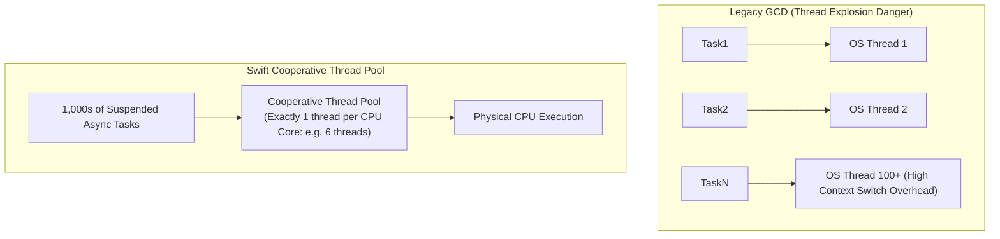
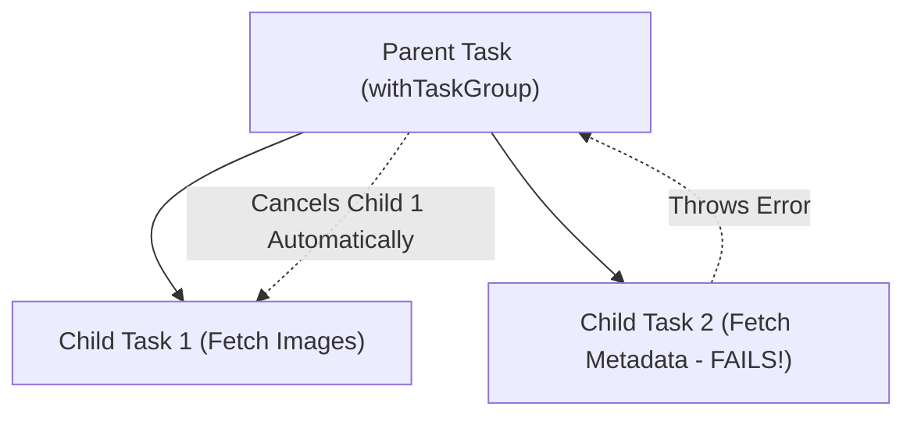
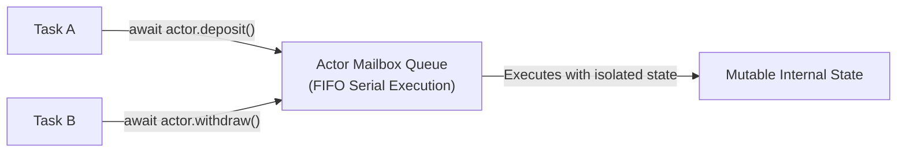

# 02. Swift Concurrency, Structured Concurrency & Actor Model

> "Swift Concurrency completely replaces legacy Grand Central Dispatch (GCD) queues with a cooperative thread pool, compiler-verified structured concurrency hierarchies, and the Actor Model. Threads are no longer spawned ad-hoc; the runtime limits active threads to the number of CPU cores, eliminating thread explosion and context-switching overhead."  
> — *Referencing Swift Concurrency by Example (Paul Hudson) & Swift 6 Language Evolution*

---

## 1. The Cooperative Thread Pool vs Legacy GCD

In legacy iOS development using Grand Central Dispatch (`DispatchQueue.global().async`), dispatching 100 concurrent tasks could spawn 100 separate kernel threads, causing **thread explosion**, memory exhaustion, and catastrophic CPU context-switching churn.



### 1.1 Suspension Points: `await`
When Swift encounters `await`:
* The currently executing function **yields** its thread back to the cooperative pool.
* The thread is free to execute other unrelated tasks immediately.
* When the awaited asynchronous work finishes, the Swift runtime schedules the continuation onto an available thread in the pool.

---

## 2. Structured Concurrency: Task Trees & Cancellation

Swift's structured concurrency guarantees that parent tasks cannot finish until all child tasks have completed or been cancelled:



### 2.1 Production Parallel Task Group Implementation
Below is a concurrent batch fetcher that fetches product reviews in parallel while respecting task cancellation:

```swift
struct ProductReview: Sendable, Decodable {
    let id: String
    let rating: Int
    let comment: String
}

final class ReviewEngine: Sendable {

    func fetchBatchReviews(reviewIds: [String]) async throws -> [ProductReview] {
        try await withThrowingTaskGroup(of: ProductReview.self) { group in
            for id in reviewIds {
                group.addTask {
                    // Check cancellation before initiating network request
                    try Task.checkCancellation()
                    return try await self.fetchSingleReview(id: id)
                }
            }

            var results: [ProductReview] = []
            results.reserveCapacity(reviewIds.count)

            for try await review in group {
                results.append(review)
            }

            return results
        }
    }

    private func fetchSingleReview(id: String) async throws -> ProductReview {
        let url = URL(string: "https://api.enterprise.com/reviews/\(id)")!
        let (data, response) = try await URLSession.shared.data(from: url)
        guard let http = response as? HTTPURLResponse, http.statusCode == 200 else {
            throw URLError(.badServerResponse)
        }
        return try JSONDecoder().decode(ProductReview.self, from: data)
    }
}
```

---

## 3. The Actor Model: Data-Race Free Mutable State

An **Actor** is a reference type that protects its own internal state from concurrent access through **actor isolation**:
* Only one task can execute code inside an actor instance at any given time.
* External callers must use `await` to access actor properties or call actor methods.



### 3.1 Global Actors & `@MainActor`
The `@MainActor` is a globally unique actor that synchronizes execution with the main UI thread (RunLoop).
* All SwiftUI UI mutations, ViewModels updating `@Observable` properties, and UIKit drawing calls must execute on `@MainActor`:
```swift
@MainActor
final class ProductViewModel: ObservableObject {
    @Published var items: [String] = []

    func loadData() async {
        // Runs in background cooperative thread pool
        let remoteData = await backgroundService.fetch()
        
        // Compiler guarantees this assignment runs on Main Thread!
        self.items = remoteData
    }
}
```

---

## 4. Production Actor-Based Atomic Cache Implementation

Below is an enterprise-grade, actor-isolated in-memory cache featuring TTL expiration and inflight request deduplication:

```swift
actor AtomicAsyncCache<Key: Hashable & Sendable, Value: Sendable> {
    private struct CacheEntry {
        let value: Value
        let expirationDate: Date
    }

    private var cache: [Key: CacheEntry] = [:]
    private var inFlightTasks: [Key: Task<Value, Error>] = [:]
    private let ttl: TimeInterval

    init(ttl: TimeInterval = 300) {
        self.ttl = ttl
    }

    func value(for key: Key, fallback: @Sendable @escaping () async throws -> Value) async throws -> Value {
        let now = Date()

        // 1. Check valid cached entry
        if let entry = cache[key], entry.expirationDate > now {
            return entry.value
        }

        // 2. Request deduplication: if identical task is already running, await it!
        if let ongoing = inFlightTasks[key] {
            return try await ongoing.value
        }

        // 3. Launch new task and store in flight map
        let task = Task { () throws -> Value in
            defer { inFlightTasks[key] = nil }
            return try await fallback()
        }

        inFlightTasks[key] = task

        do {
            let result = try await task.value
            cache[key] = CacheEntry(value: result, expirationDate: now.addingTimeInterval(ttl))
            return result
        } catch {
            throw error
        }
    }

    func clear() {
        cache.removeAll()
        inFlightTasks.values.forEach { $0.cancel() }
        inFlightTasks.removeAll()
    }
}
```
