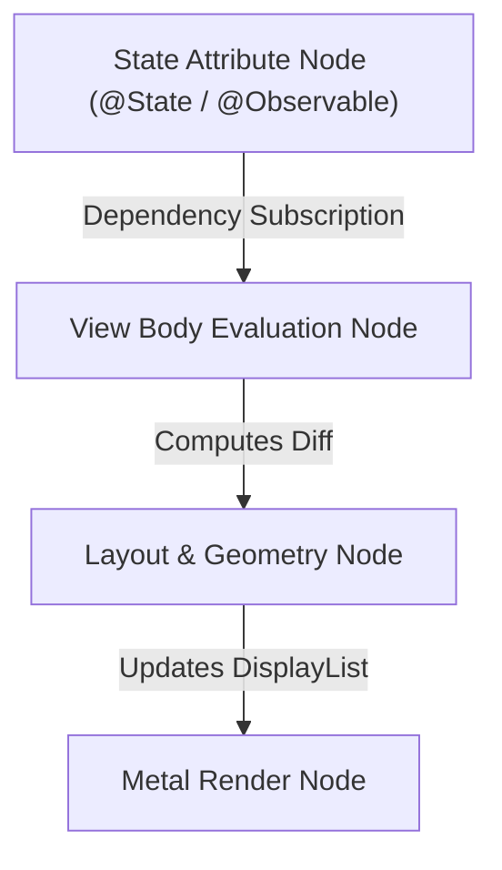
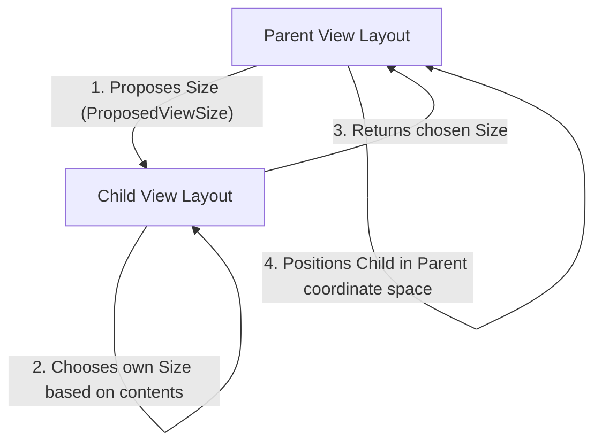

# 03. SwiftUI Compiler, AttributeGraph & Declarative Rendering Engine

> "SwiftUI is not a wrapper around UIKit. SwiftUI is a pure declarative layout and rendering pipeline powered by Swift Result Builders, an internal dependency graph called AttributeGraph, and direct hardware rasterization through Metal."  
> — *Referencing Thinking in SwiftUI (Florian Kugler & Chris Eidhof) & Apple SwiftUI Engineering Documentation*

---

## 1. Declarative UI: The View as a Pure Value Function

In SwiftUI, a `View` is not an object that persists in memory across frames. A `View` is a lightweight, immutable value type conforming to the `View` protocol:

```swift
public protocol View {
    associatedtype Body: View
    @ViewBuilder @MainActor var body: Self.Body { get }
}
```


Because `View` structs are value types, creating hundreds of them during state changes costs almost nothing. They exist temporarily on the stack to describe the UI configuration.

---

## 2. Under the Hood of `@ViewBuilder` (Result Builders)

When you write a SwiftUI hierarchy:
```swift
VStack {
    Text("Title")
    Image(systemName: "star")
}
```

The Swift compiler rewrites this using the `@resultBuilder` pattern into a concrete generic type:
```swift
TupleView<(Text, Image)>
```

If conditional statements are used:
```swift
if isPremium {
    GoldBadge()
} else {
    StandardBadge()
}
```
The compiler desugars this into an existential type:
```swift
_ConditionalContent<GoldBadge, StandardBadge>
```

This ensures the entire layout structure is encoded into static, strongly-typed generic metadata at compile time.

---

## 3. The `AttributeGraph` Dependency Engine

How does SwiftUI know which views to re-render when a piece of state changes?
At the core of the SwiftUI runtime is **`AttributeGraph`** (a private C++ dependency tracking engine):



### 3.1 Structural Identity vs Explicit Identity
1. **Explicit Identity**: Assigned manually via `.id(uniqueIdentifier)`. When the ID changes, SwiftUI discards all prior state and re-creates the view from scratch.
2. **Structural Identity**: SwiftUI identifies views based on their exact position in the static `TupleView` / `_ConditionalContent` hierarchy.
   * Modifying conditional view structures dynamically changes their structural identity, causing unwanted state resets.

---

## 4. The Three Phases of SwiftUI Layout Protocol



1. **Parent proposes size**: The parent offers an available size proposal (`ProposedViewSize`).
2. **Child chooses its size**: The child determines its own actual dimensions according to its contents.
3. **Parent positions child**: The parent sets the child's origin coordinates.

---

## 5. Production Custom Layout: Fluid Dynamic Masonry

Below is a production-grade custom SwiftUI layout conforming to the modern `Layout` protocol (iOS 16+):

```swift
import SwiftUI

struct MasonryGrid: Layout {
    var columns: Int = 2
    var spacing: CGFloat = 8

    func sizeThatFits(proposal: ProposedViewSize, subviews: Subviews, cache: inout ()) -> CGSize {
        guard let width = proposal.width, width > 0, columns > 0 else { return .zero }
        
        let totalSpacing = spacing * CGFloat(columns - 1)
        let columnWidth = (width - totalSpacing) / CGFloat(columns)
        var columnHeights = Array(repeating: CGFloat(0), count: columns)

        for subview in subviews {
            let shortestCol = columnHeights.indices.min(by: { columnHeights[$0] < columnHeights[$1] }) ?? 0
            let childProposal = ProposedViewSize(width: columnWidth, height: nil)
            let childSize = subview.sizeThatFits(childProposal)
            columnHeights[shortestCol] += childSize.height + spacing
        }

        let totalHeight = columnHeights.max() ?? 0
        return CGSize(width: width, height: max(0, totalHeight - spacing))
    }

    func placeSubviews(in bounds: CGRect, proposal: ProposedViewSize, subviews: Subviews, cache: inout ()) {
        guard bounds.width > 0, columns > 0 else { return }

        let totalSpacing = spacing * CGFloat(columns - 1)
        let columnWidth = (bounds.width - totalSpacing) / CGFloat(columns)
        var columnHeights = Array(repeating: bounds.minY, count: columns)

        for subview in subviews {
            let shortestCol = columnHeights.indices.min(by: { columnHeights[$0] < columnHeights[$1] }) ?? 0
            let x = bounds.minX + CGFloat(shortestCol) * (columnWidth + spacing)
            let y = columnHeights[shortestCol]

            let childProposal = ProposedViewSize(width: columnWidth, height: nil)
            let childSize = subview.sizeThatFits(childProposal)

            subview.place(at: CGPoint(x: x, y: y), proposal: childProposal)
            columnHeights[shortestCol] += childSize.height + spacing
        }
    }
}
```
