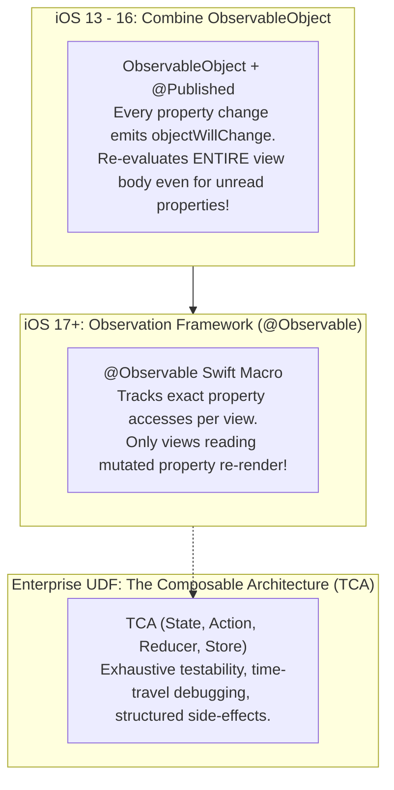
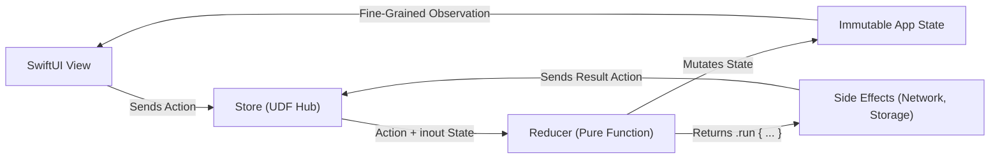

# 04. State Management Paradigms (@Observable, Combine & TCA)

> "Managing state in SwiftUI has evolved through three distinct paradigms: from Combine-based `ObservableObject` with full-view invalidation, to Swift 5.9's fine-grained `@Observable` macro, to mathematically rigorous Unidirectional Data Flow with The Composable Architecture (TCA)."  
> — *Referencing Point-Free TCA Architecture & Swift Observation Documentation*

---

## 1. The State Management Evolution in iOS



---

## 2. Under the Hood of the `@Observable` Macro

In iOS 17+, Apple introduced the `Observation` framework powered by Swift Macros.

When you annotate a class with `@Observable`:
```swift
@Observable
final class UserProfileModel {
    var name: String = "Alice"
    var score: Int = 100
}
```

The macro compiler generates an internal observation registrar and transforms property accessors:
```swift
final class UserProfileModel: Observation.Observable {
    private let _$observationRegistrar = Observation.ObservationRegistrar()

    var name: String = "Alice" {
        get {
            _$observationRegistrar.access(self, keyPath: \.name)
            return _name
        }
        set {
            _$observationRegistrar.withMutation(of: self, keyPath: \.name) {
                _name = newValue
            }
        }
    }
}
```

### 2.1 The Per-Property Invalidation Revolution
* In a view reading only `model.name`, mutating `model.score` **does not trigger re-evaluation of that view's body**!
* This completely eliminates unnecessary SwiftUI re-rendering without requiring manual `EquatableView` or `@StateObject` boilerplate.

---

## 3. The Composable Architecture (TCA) Pattern

For mission-critical applications (e.g. banking, healthcare, retail checkout), **The Composable Architecture (TCA)** provides mathematically sound state transitions:



---

## 4. Production TCA Implementation: Cart Checkout Reducer

Below is an enterprise-grade TCA-style state reducer in pure Swift:

```swift
import Foundation

// 1. State
struct CartFeatureState: Equatable, Sendable {
    var items: [CartItem] = []
    var isCheckingOut: Bool = false
    var errorMessage: String? = null
    var completedTransactionId: String? = null

    var totalPrice: Double {
        items.reduce(0.0) { $0 + ($1.unitPrice * Double($1.quantity)) }
    }
}

// 2. Actions
enum CartFeatureAction: Sendable {
    case itemAdded(CartItem)
    case itemRemoved(productId: String)
    case checkoutButtonTapped
    case checkoutResponse(Result<String, Error>)
    case dismissError
}

// 3. Reducer
@MainActor
final class CartStore: Observable {
    private(set) var state: CartFeatureState
    private let checkoutClient: CheckoutAPIClient

    init(initialState: CartFeatureState = CartFeatureState(), client: CheckoutAPIClient) {
        self.state = initialState
        self.checkoutClient = client
    }

    func send(_ action: CartFeatureAction) {
        switch action {
        case .itemAdded(let item):
            if let index = state.items.firstIndex(where: { $0.id == item.id }) {
                state.items[index].quantity += 1
            } else {
                state.items.append(item)
            }

        case .itemRemoved(let productId):
            state.items.removeAll { $0.id == productId }

        case .checkoutButtonTapped:
            guard !state.isCheckingOut, !state.items.isEmpty else { return }
            state.isCheckingOut = true
            state.errorMessage = nil

            let currentItems = state.items
            Task {
                do {
                    let txId = try await checkoutClient.executePayment(items: currentItems)
                    self.send(.checkoutResponse(.success(txId)))
                } catch {
                    self.send(.checkoutResponse(.failure(error)))
                }
            }

        case .checkoutResponse(.success(let transactionId)):
            state.isCheckingOut = false
            state.completedTransactionId = transactionId
            state.items.removeAll()

        case .checkoutResponse(.failure(let error)):
            state.isCheckingOut = false
            state.errorMessage = error.localizedDescription

        case .dismissError:
            state.errorMessage = nil
        }
    }
}

struct CartItem: Identifiable, Equatable, Sendable {
    let id: String
    let title: String
    var quantity: Int
    let unitPrice: Double
}

protocol CheckoutAPIClient: Sendable {
    func executePayment(items: [CartItem]) async throws -> String
}
```
