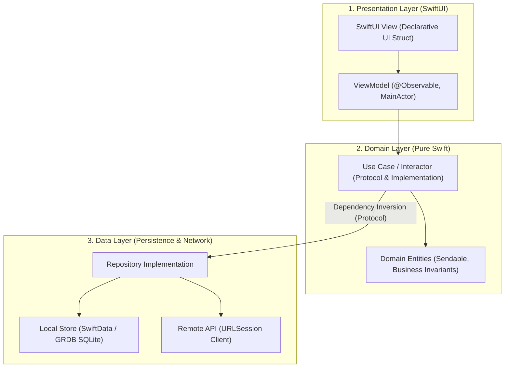

# 05. Modern iOS Architecture (MVVM, Clean Architecture & Modular SPM)

> "Clean Architecture in iOS separates volatile UI concerns from immutable business rules. By enforcing strict protocol boundaries and organizing the codebase into an explicit Directed Acyclic Graph (DAG) of Swift Package Manager (SPM) modules, teams achieve parallel compile times, isolation of side effects, and seamless unit testability."  
> — *Referencing Clean Architecture (Robert C. Martin) & Point-Free Modular Architecture*

---

## 1. Clean Architecture Layers in Swift



### Dependency Inversion Principle (DIP)
The Domain layer defines the repository protocol (`ProductRepository`). The Data layer implements it (`ProductRepositoryLive`). The presentation layer only knows about the Use Case. **The Domain layer imports zero UI or network frameworks.**

---

## 2. Production Clean Architecture Implementation: Product Subsystem

### 2.1 Domain Layer (`ProductDomain.swift`)
```swift
import Foundation

// Domain Entity with Business Invariants
public struct Product: Identifiable, Equatable, Sendable {
    public let id: String
    public let name: String
    public let priceCents: Int

    public init(id: String, name: String, priceCents: Int) {
        precondition(!id.isEmpty, "Product ID cannot be empty")
        precondition(priceCents >= 0, "Price cannot be negative")
        self.id = id
        self.name = name
        self.priceCents = priceCents
    }

    public var formattedPrice: String {
        let dollars = Double(priceCents) / 100.0
        return String(format: "$%.2f", dollars)
    }
}

// Domain Repository Protocol
public protocol ProductRepositoryProtocol: Sendable {
    func observeProducts() -> AsyncStream<[Product]>
    func refreshProducts() async throws
}

// Domain Use Case
public struct GetProductCatalogUseCase: Sendable {
    private let repository: any ProductRepositoryProtocol

    public init(repository: any ProductRepositoryProtocol) {
        self.repository = repository
    }

    public func execute() -> AsyncStream<[Product]> {
        repository.observeProducts()
    }

    public func refresh() async throws {
        try await repository.refreshProducts()
    }
}
```

### 2.2 Presentation Layer (`ProductCatalogViewModel.swift`)
```swift
import SwiftUI
import Observation

@Observable
@MainActor
public final class ProductCatalogViewModel {
    public enum ViewState: Equatable {
        case loading
        case loaded([Product])
        case error(String)
    }

    public private(set) var state: ViewState = .loading
    private let useCase: GetProductCatalogUseCase
    private var streamTask: Task<Void, Never>?

    public init(useCase: GetProductCatalogUseCase) {
        self.useCase = useCase
    }

    public func onAppear() {
        startObserving()
        Task { await refreshCatalog() }
    }

    public func refreshCatalog() async {
        do {
            try await useCase.refresh()
        } catch {
            if case .loaded = state {} else {
                state = .error("Failed to load catalog: \(error.localizedDescription)")
            }
        }
    }

    private func startObserving() {
        streamTask?.cancel()
        streamTask = Task { [weak self] in
            guard let self else { return }
            for await products in self.useCase.execute() {
                self.state = .loaded(products)
            }
        }
    }

    deinit {
        streamTask?.cancel()
    }
}
```

### 2.3 SwiftUI View Layer (`ProductCatalogView.swift`)
```swift
import SwiftUI

public struct ProductCatalogView: View {
    @State private var viewModel: ProductCatalogViewModel

    public init(viewModel: ProductCatalogViewModel) {
        _viewModel = State(initialValue: viewModel)
    }

    public var body: some View {
        NavigationStack {
            Group {
                switch viewModel.state {
                case .loading:
                    ProgressView("Loading products...")
                case .loaded(let products):
                    List(products) { product in
                        HStack {
                            Text(product.name)
                                .font(.headline)
                            Spacer()
                            Text(product.formattedPrice)
                                .font(.subheadline)
                                .foregroundStyle(.secondary)
                        }
                    }
                    .refreshable {
                        await viewModel.refreshCatalog()
                    }
                case .error(let message):
                    ContentUnavailableView("Error", systemImage: "exclamationmark.triangle", description: Text(message))
                }
            }
            .navigationTitle("Store Catalog")
            .onAppear {
                viewModel.onAppear()
            }
        }
    }
}
```
