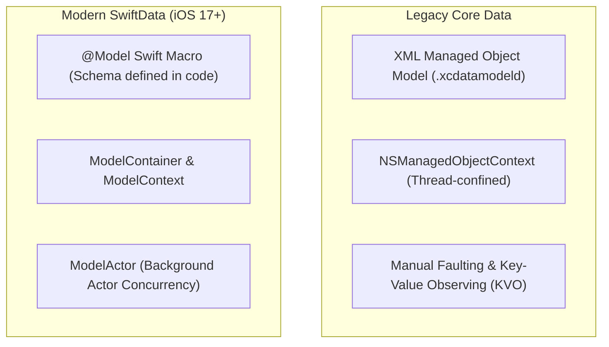

# 06. Local Persistence, SwiftData, CoreData & SQLite Engine

> "Client-side persistence on iOS has transitioned from legacy Core Data with its XML `.xcdatamodeld` mapping schemas and manual faulting, to SwiftData's macro-driven `@Model` schema system and `ModelActor` concurrency isolation."  
> — *Referencing Apple SwiftData Documentation & Modern Persistence Architecture*

---

## 1. SwiftData vs Core Data Architectural Comparison



### Key Differences:
1. **Zero XML Config**: Schemas are declared directly on standard Swift classes via `@Model`.
2. **First-Class SwiftUI Integration**: Automatically interacts with SwiftUI's `@Query` property wrapper for live reactive UI updates.
3. **Actor-Safe Background Processing**: The `ModelActor` protocol ensures database operations executed in the background are completely thread-safe without manual context merging.

---

## 2. Under the Hood of the `@Model` Macro

When you annotate a class with `@Model`:
```swift
@Model
final class ProductEntity {
    @Attribute(.unique) var id: String
    var title: String
    var priceCents: Int

    init(id: String, title: String, priceCents: Int) {
        self.id = id
        self.title = title
        self.priceCents = priceCents
    }
}
```

The macro expands into code that:
1. Conforms the class to `PersistentModel`.
2. Replaces stored properties with schema-backed accessors linked to `BackingData`.
3. Synthesizes a static metadata schema graph for the underlying SQLite table generation.

---

## 3. Production Background Persistence with `ModelActor`

Performing heavy database syncs on the main thread's `modelContext` causes SwiftUI frame drops.
SwiftData provides **`ModelActor`** to perform isolated database writes on a dedicated background actor:

```swift
import SwiftData
import Foundation

@ModelActor
actor BackgroundDataSyncActor {

    func upsertProducts(dtos: [ProductDTO]) throws {
        for dto in dtos {
            let targetId = dto.id
            var descriptor = FetchDescriptor<ProductEntity>(
                predicate: #Predicate { $0.id == targetId }
            )
            descriptor.fetchLimit = 1

            if let existing = try modelContext.fetch(descriptor).first {
                existing.title = dto.title
                existing.priceCents = dto.priceCents
            } else {
                let newEntity = ProductEntity(
                    id: dto.id,
                    title: dto.title,
                    priceCents: dto.priceCents
                )
                modelContext.insert(newEntity)
            }
        }

        // Save changes to disk on background thread
        try modelContext.save()
    }

    func purgeOldRecords(before date: Date) throws {
        try modelContext.delete(model: ProductEntity.self, where: #Predicate { _ in true })
        try modelContext.save()
    }
}

struct ProductDTO: Sendable, Decodable {
    let id: String
    let title: String
    let priceCents: Int
}
```

---

## 4. SQLite Engine Direct Access via GRDB

In high-throughput apps requiring raw SQLite performance, complex SQL joins, or full-text search (FTS5), **GRDB.swift** is the industry standard:
* Pure Swift zero-cost wrapper over the SQLite C API.
* Concurrency architecture: `DatabasePool` allows 1 background writer while $N$ readers query concurrently using Write-Ahead Logging (WAL).
* Database observation via `ValueObservation` emits reactive async streams when monitored tables mutate.
