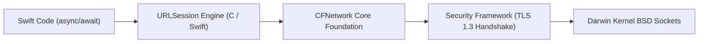

# 07. Enterprise Networking, URLSession & Actor-Based Resilient Clients

> "Enterprise mobile networking requires handling unstable wireless environments, atomic 401 token refresh loops, HTTP/2 multiplexing, HTTP/3 (QUIC) datagrams, and strict TLS certificate verification. In Swift 6, actors provide the ultimate synchronization primitive for thread-safe network auth managers."  
> — *Referencing Apple URLSession Engineering Guides & High Performance iOS Networking*

---

## 1. The Modern iOS Networking Stack

iOS network execution is powered by **`URLSession`**:



* **HTTP/2 & HTTP/3**: `URLSession` automatically handles HTTP/2 multiplexing and HTTP/3 QUIC connection migration (switching seamlessly between Wi-Fi and 5G cellular without resetting TCP handshakes).

---

## 2. Actor-Based Token Refresh Engine

When concurrent requests receive `401 Unauthorized`, an uncoordinated client triggers redundant refresh requests.
Using a Swift **Actor** guarantees that token refresh is performed atomically with zero race conditions:

```swift
import Foundation

actor NetworkAuthManager {
    private var accessToken: String?
    private var refreshToken: String?
    private var refreshTask: Task<String, Error>?

    init(accessToken: String? = nil, refreshToken: String? = nil) {
        self.accessToken = accessToken
        self.refreshToken = refreshToken
    }

    func validToken() async throws -> String {
        // If an ongoing refresh is in flight, await it!
        if let refreshTask {
            return try await refreshTask.value
        }

        if let accessToken {
            return accessToken
        }

        return try await performTokenRefresh()
    }

    func handleUnauthorized() async throws -> String {
        // If another thread already started refreshing, wait for it
        if let refreshTask {
            return try await refreshTask.value
        }

        return try await performTokenRefresh()
    }

    private func performTokenRefresh() async throws -> String {
        let task = Task { () throws -> String in
            defer { self.refreshTask = nil }

            guard let refreshToken = self.refreshToken else {
                throw URLError(.userAuthenticationRequired)
            }

            // Perform physical network request to auth server
            let url = URL(string: "https://api.enterprise.com/v1/auth/refresh")!
            var request = URLRequest(url: url)
            request.httpMethod = "POST"
            request.setValue("application/json", forHTTPHeaderField: "Content-Type")
            request.httpBody = try JSONEncoder().encode(["refresh_token": refreshToken])

            let (data, response) = try await URLSession.shared.data(for: request)
            guard let http = response as? HTTPURLResponse, http.statusCode == 200 else {
                self.accessToken = nil
                self.refreshToken = nil
                throw URLError(.userAuthenticationRequired)
            }

            let decoded = try JSONDecoder().decode(AuthTokensResponse.self, from: data)
            self.accessToken = decoded.accessToken
            self.refreshToken = decoded.refreshToken
            return decoded.accessToken
        }

        self.refreshTask = task
        return try await task.value
    }
}

struct AuthTokensResponse: Decodable, Sendable {
    let accessToken: String
    let refreshToken: String
}
```

---

## 3. SSL / TLS Certificate Pinning with `URLSessionDelegate`

To prevent Man-in-the-Middle (MitM) attacks via compromised Certificate Authorities, enterprise iOS clients pin the public key (SPKI) using `URLSessionDelegate`:

```swift
import Foundation
import CryptoKit
import Security

final class CertificatePinningDelegate: NSObject, URLSessionDelegate, Sendable {
    // SHA-256 Public Key Pin hashes
    private let pinnedHashes: Set<String> = [
        "A1B2C3D4E5F67890123456789ABCDEF01234567890ABCDEF1234567890ABCDEF"
    ]

    func urlSession(
        _ session: URLSession,
        didReceive challenge: URLAuthenticationChallenge
    ) async -> (URLSession.AuthChallengeDisposition, URLCredential?) {
        guard challenge.protectionSpace.authenticationMethod == NSURLAuthenticationMethodServerTrust,
              let serverTrust = challenge.protectionSpace.serverTrust else {
            return (.cancelAuthenticationChallenge, nil)
        }

        // 1. Evaluate Trust
        var error: CFError?
        let isTrusted = SecTrustEvaluateWithError(serverTrust, &error)
        guard isTrusted else {
            return (.cancelAuthenticationChallenge, nil)
        }

        // 2. Extract Public Key from Server Certificate
        guard let certificate = SecTrustGetCertificateAtIndex(serverTrust, 0),
              let publicKey = SecCertificateCopyKey(certificate),
              let publicKeyData = SecKeyCopyExternalRepresentation(publicKey, nil) as? Data else {
            return (.cancelAuthenticationChallenge, nil)
        }

        // 3. Compute SHA-256 Fingerprint
        let hash = SHA256.hash(data: publicKeyData)
        let hashString = hash.compactMap { String(format: "%02x", $0) }.joined().uppercased()

        if pinnedHashes.contains(hashString) {
            return (.useCredential, URLCredential(trust: serverTrust))
        } else {
            print("SECURITY ALERT: Public key mismatch for \(challenge.protectionSpace.host)!")
            return (.cancelAuthenticationChallenge, nil)
        }
    }
}
```
