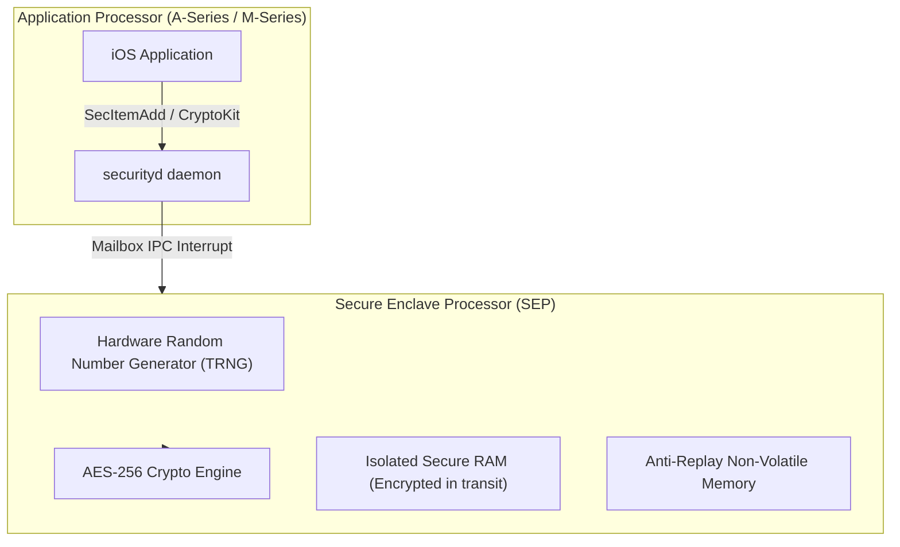

# 08. iOS Security Hardening, Keychain, CryptoKit & Secure Enclave

> "iOS security is anchored in silicon: the Apple Secure Enclave Processor (SEP). A production iOS application must never store encryption keys in plaintext memory where kernel jailbreak exploits or memory dumps can read them. Keys must be generated and operated on inside the Secure Enclave with biometric gating."  
> — *Referencing Apple Platform Security Documentation & NIST Cryptographic Guidelines*

---

## 1. Apple Hardware Security Architecture: The Secure Enclave



### Key Security Invariants
* **Hardware Isolation**: The SEP is a physically separate coprocessor running its own microkernel OS (sepOS). The main application processor running iOS has **no direct access to SEP memory**.
* **Unexportable Private Keys**: When a 256-bit elliptic curve private key (`SecureEnclave.P256.Signing.PrivateKey`) is generated, the private key never leaves the SEP. The application only receives a handle to sign or verify messages.

---

## 2. CryptoKit & Authenticated Encryption (AES-GCM)

CryptoKit provides hardware-accelerated cryptographic primitives. For symmetric encryption, modern iOS uses **AES-256-GCM** or **ChaCha20-Poly1305** (AEAD):

```swift
import CryptoKit
import Foundation

struct SecureEncryptionEngine {

    // Authenticated encryption with AES-GCM (Ciphertext + 128-bit Authentication Tag + Nonce)
    static func encrypt(data: Data, using key: SymmetricKey) throws -> Data {
        let sealedBox = try AES.GCM.seal(data, using: key)
        guard let combined = sealedBox.combined else {
            throw CryptoKitError.underlyingCoreCryptoError(error: -1)
        }
        return combined
    }

    static func decrypt(combinedData: Data, using key: SymmetricKey) throws -> Data {
        let sealedBox = try AES.GCM.SealedBox(combined: combinedData)
        return try AES.GCM.open(sealedBox, using: key)
    }
}
```

---

## 3. Biometric Keychain Integration (`SecAccessControl`)

Below is a complete, production-grade Keychain manager that protects sensitive credentials behind Apple **Face ID / Touch ID**:

```swift
import Foundation
import Security
import LocalAuthentication

final class BiometricKeychainManager: Sendable {
    private let serviceName = "com.enterprise.app.secure_keys"

    func storeSensitiveCredential(key: String, data: Data) throws {
        // Create Access Control requiring Biometric User Presence
        var error: Unmanaged<CFError>?
        guard let accessControl = SecAccessControlCreateWithFlags(
            kCFAllocatorDefault,
            kSecAttrAccessibleWhenUnlockedThisDeviceOnly,
            [.biometryAny, .userPresence],
            &error
        ) else {
            throw error!.takeRetainedValue() as Error
        }

        let query: [String: Any] = [
            kSecClass as String: kSecClassGenericPassword,
            kSecAttrService as String: serviceName,
            kSecAttrAccount as String: key,
            kSecValueData as String: data,
            kSecAttrAccessControl as String: accessControl
        ]

        SecItemDelete(query as CFDictionary) // Delete existing key if present
        let status = SecItemAdd(query as CFDictionary, nil)
        guard status == errSecSuccess else {
            throw NSError(domain: NSOSStatusErrorDomain, code: Int(status))
        }
    }

    func readSensitiveCredential(key: String, promptReason: String) async throws -> Data {
        let context = LAContext()
        context.localizedReason = promptReason

        let query: [String: Any] = [
            kSecClass as String: kSecClassGenericPassword,
            kSecAttrService as String: serviceName,
            kSecAttrAccount as String: key,
            kSecReturnData as String: true,
            kSecMatchLimit as String: kSecMatchLimitOne,
            kSecUseAuthenticationContext as String: context
        ]

        var item: CFTypeRef?
        let status = SecItemCopyMatching(query as CFDictionary, &item)

        guard status == errSecSuccess, let data = item as? Data else {
            throw NSError(domain: NSOSStatusErrorDomain, code: Int(status))
        }

        return data
    }
}
```

---

## 4. Jailbreak Detection & Dynamic Instrumentation Defense

```swift
import Foundation
import UIKit

enum SecurityIntegrityGuard {
    private static let knownJailbreakPaths = [
        "/Applications/Cydia.app",
        "/Library/MobileSubstrate/MobileSubstrate.dylib",
        "/bin/bash",
        "/usr/sbin/sshd",
        "/etc/apt",
        "/private/var/lib/apt/"
    ]

    static func isDeviceCompromised() -> Bool {
        #if targetEnvironment(simulator)
        return false // Disable checks in simulator
        #else
        // 1. Check filesystem for jailbreak files
        for path in knownJailbreakPaths {
            if FileManager.default.fileExists(atPath: path) { return true }
        }

        // 2. Check ability to write outside sandbox
        let testPath = "/private/jailbreak_sandbox_test.txt"
        do {
            try "test".write(toFile: testPath, atomically: true, encoding: .utf8)
            try FileManager.default.removeItem(atPath: testPath)
            return true // Sandbox violation! Device is jailbroken!
        } catch {
            return false
        }
        #endif
    }
}
```
