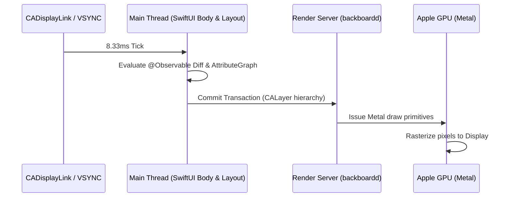

# 09. Performance Optimization, Instruments, Memory Profiling & XCTest

> "Production iOS apps must sustain 120 FPS on ProMotion displays and maintain a disciplined memory footprint to survive jetsam memory termination. Diagnosing performance bottlenecks requires mastering Xcode Instruments (Time Profiler, Allocations, Leaks, and SwiftUI Profiler) and modern asynchronous testing with XCTest and Swift Testing."  
> — *Referencing High Performance iOS Apps (Gaurav Vaish) & Apple Instruments Documentation*

---

## 1. Frame Rendering Budgets: 120 FPS ProMotion Displays

Apple's ProMotion displays adaptively refresh up to 120 Hz:
* **60 Hz Standard**: $16.66\text{ms}$ budget per frame.
* **120 Hz ProMotion**: **$8.33\text{ms}$ budget per frame.**



If the main thread takes longer than $8.33\text{ms}$ evaluating a view body or computing layouts, the system drops a frame, resulting in visual stutter (hitch).

---

## 2. Memory Leaks, Retain Cycles & The iOS Jetsam Daemon

When iOS physical RAM runs low, the kernel **Jetsam** daemon terminates background processes with `EXC_RESOURCE (RESOURCE_TYPE_MEMORY)`.
* Unlike desktop OSes, iOS has **no virtual memory disk swap space**.
* Memory leaks directly cause foreground app crashes and background termination.

### Diagnosing Retain Cycles in Xcode Instruments
1. **Allocations Instrument**: Shows heap growth over time and identifies high-watermark memory allocations.
2. **Leaks Instrument**: Automatically detects cyclic strong reference cycles where memory is unreachable by root pointers.
3. **SwiftUI View Body Instrument**: Visualizes how many times each SwiftUI view's body is re-evaluated per second.

---

## 3. Unit & Asynchronous Testing with Modern Swift Testing

In WWDC 2024, Apple introduced the **Swift Testing** framework (`import Testing`), replacing legacy XCTest with expressive macros, parallel test execution, and parameterized tests:

```swift
import Testing
@testable import EnterpriseApp

@Suite("Cart Subsystem Tests")
struct CartStoreTests {

    private struct MockCheckoutClient: CheckoutAPIClient {
        let shouldSucceed: Bool

        func executePayment(items: [CartItem]) async throws -> String {
            if shouldSucceed {
                return "TX_SUCCESS_9918"
            } else {
                throw URLError(.badServerResponse)
            }
        }
    }

    @Test("Adding an item increments total price correctly")
    func testItemAddition() async throws {
        let mockClient = MockCheckoutClient(shouldSucceed: true)
        let store = await CartStore(client: mockClient)

        let item = CartItem(id: "p1", title: "Shoes", quantity: 1, unitPrice: 50.0)
        await store.send(.itemAdded(item))

        let state = await store.state
        #expect(state.items.count == 1)
        #expect(state.totalPrice == 50.0)
    }

    @Test("Successful checkout clears the shopping cart", arguments: [true])
    func testSuccessfulCheckout(shouldSucceed: Bool) async throws {
        let mockClient = MockCheckoutClient(shouldSucceed: shouldSucceed)
        let store = await CartStore(client: mockClient)

        let item = CartItem(id: "p1", title: "Shoes", quantity: 2, unitPrice: 25.0)
        await store.send(.itemAdded(item))
        await store.send(.checkoutButtonTapped)

        // Give cooperative task time to resolve
        try await Task.sleep(nanoseconds: 10_000_000)

        let state = await store.state
        #expect(state.items.isEmpty)
        #expect(state.completedTransactionId == "TX_SUCCESS_9918")
        #expect(state.errorMessage == nil)
    }
}
```
