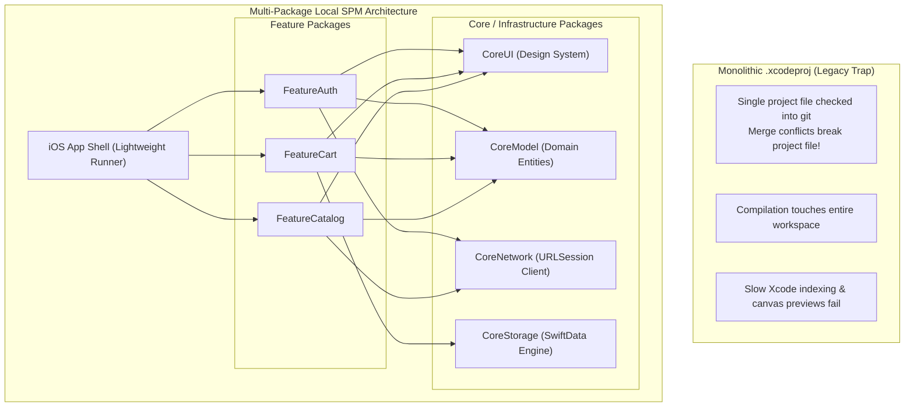

# 10. Production iOS Multi-Package Project Structure & CI-CD

> "In enterprise iOS development, a monolithic `.xcodeproj` file checked into Git leads to catastrophic merge conflicts, slow indexing, and fragile dependencies. Production iOS architecture relies on a lightweight Xcode project shell driving an explicit Directed Acyclic Graph (DAG) of local Swift Package Manager (SPM) modules with automated Fastlane release pipelines."  
> — *Referencing Point-Free Modular SPM Architecture & Apple Swift Package Manager Specification*

---

## 1. Monolithic Project vs Local SPM Modularization



---

## 2. Complete Enterprise iOS Directory Structure

Below is the standard repository structure used by Tier-1 iOS engineering teams:

```
my-enterprise-ios-app/
├── EnterpriseApp.xcodeproj/                    # Lightweight shell project (targets app bundle)
├── EnterpriseApp/                              # Application Target Source
│   ├── App/
│   │   ├── EnterpriseApp.swift                 # @main App struct
│   │   ├── AppDelegate.swift                   # Push notification lifecycle handling
│   │   └── AppEnvironment.swift                # Dependency container configuration
│   ├── Navigation/
│   │   └── AppCoordinatorView.swift            # Root NavigationStack routing across features
│   └── Resources/
│       ├── Assets.xcassets                     # App icons, accent color
│       ├── Info.plist                          # Bundle identifier, permissions
│       └── EnterpriseApp.entitlements          # Keychain access groups, push capabilities
│
├── Packages/                                   # Local Swift Package Manager DAG
│   │
│   ├── Core/                                   # Core Infrastructure
│   │   ├── CoreModel/                          # Domain Entities & Business Rules (Pure Swift)
│   │   │   ├── Package.swift
│   │   │   ├── Sources/CoreModel/
│   │   │   └── Tests/CoreModelTests/
│   │   │
│   │   ├── CoreUI/                             # Shared Design System, Typography, Colors
│   │   │   ├── Package.swift
│   │   │   ├── Sources/CoreUI/
│   │   │   └── Tests/CoreUITests/
│   │   │
│   │   ├── CoreNetwork/                        # URLSession, Codable, Actor Auth Manager
│   │   │   ├── Package.swift
│   │   │   ├── Sources/CoreNetwork/
│   │   │   └── Tests/CoreNetworkTests/
│   │   │
│   │   └── CoreStorage/                        # SwiftData ModelContainer, ModelActor, Keychain
│   │       ├── Package.swift
│   │       ├── Sources/CoreStorage/
│   │       └── Tests/CoreStorageTests/
│   │
│   └── Features/                               # Autonomous Feature Packages
│       ├── FeatureAuth/
│       │   ├── Package.swift
│       │   ├── Sources/FeatureAuth/
│       │   │   ├── AuthCoordinator.swift
│       │   │   ├── AuthView.swift
│       │   │   └── AuthViewModel.swift
│       │   └── Tests/FeatureAuthTests/
│       │
│       ├── FeatureCatalog/
│       │   ├── Package.swift
│       │   ├── Sources/FeatureCatalog/
│       │   │   ├── CatalogView.swift
│       │   │   └── CatalogViewModel.swift
│       │   └── Tests/FeatureCatalogTests/
│       │
│       └── FeatureCart/
│           ├── Package.swift
│           ├── Sources/FeatureCart/
│           │   ├── CartView.swift
│           │   ├── CartStore.swift
│           │   └── CartReducer.swift
│           └── Tests/FeatureCartTests/
│
├── fastlane/                                   # Automated Build & Release Engineering
│   ├── Appfile                                 # Apple ID, Team ID, Bundle ID
│   └── Fastfile                                # Lanes (test, beta, release)
│
├── Gemfile                                     # Fastlane & CocoaPods ruby dependencies
└── .github/
    └── workflows/
        └── ios-ci.yml                          # Continuous Integration workflow
```

---

## 3. Package Manifest Definition (`Package.swift`)

Here is an example of an autonomous feature package definition connecting to core packages:

```swift
// swift-tools-version: 6.0
import PackageDescription

let package = Package(
    name: "FeatureCart",
    platforms: [.iOS(.v17)],
    products: [
        .library(name: "FeatureCart", targets: ["FeatureCart"])
    ],
    dependencies: [
        .package(path: "../Core/CoreModel"),
        .package(path: "../Core/CoreUI"),
        .package(path: "../Core/CoreStorage")
    ],
    targets: [
        .target(
            name: "FeatureCart",
            dependencies: [
                "CoreModel",
                "CoreUI",
                "CoreStorage"
            ],
            swiftSettings: [
                .enableUpcomingFeature("StrictConcurrency")
            ]
        ),
        .testTarget(
            name: "FeatureCartTests",
            dependencies: ["FeatureCart"]
        )
    ]
)
```

---

## 4. Automated Release Pipeline with Fastlane

Below is a production `Fastfile` automating unit tests, code signing with Apple Developer Portal (via `match`), and uploading release `.ipa` builds to TestFlight:

```ruby
default_platform(:ios)

platform :ios do
  desc "Run all unit and package tests"
  lane :test do
    run_tests(
      workspace: "EnterpriseApp.xcworkspace",
      scheme: "EnterpriseApp",
      devices: ["iPhone 15 Pro"]
    )
  end

  desc "Build and upload build to TestFlight"
  lane :beta do
    # 1. Sync certificates & provisioning profiles securely
    sync_code_signing(
      type: "appstore",
      readonly: is_ci
    )

    # 2. Increment build number automatically based on TestFlight build count
    increment_build_number(
      build_number: latest_testflight_build_number + 1,
      xcodeproj: "EnterpriseApp.xcodeproj"
    )

    # 3. Compile and package .ipa
    build_app(
      workspace: "EnterpriseApp.xcworkspace",
      scheme: "EnterpriseApp",
      export_method: "app-store",
      output_directory: "./build/output"
    )

    # 4. Upload to Apple TestFlight
    upload_to_testflight(
      skip_waiting_for_build_processing: true,
      api_key_path: "./fastlane/app_store_connect_key.json"
    )
  end
end
```
