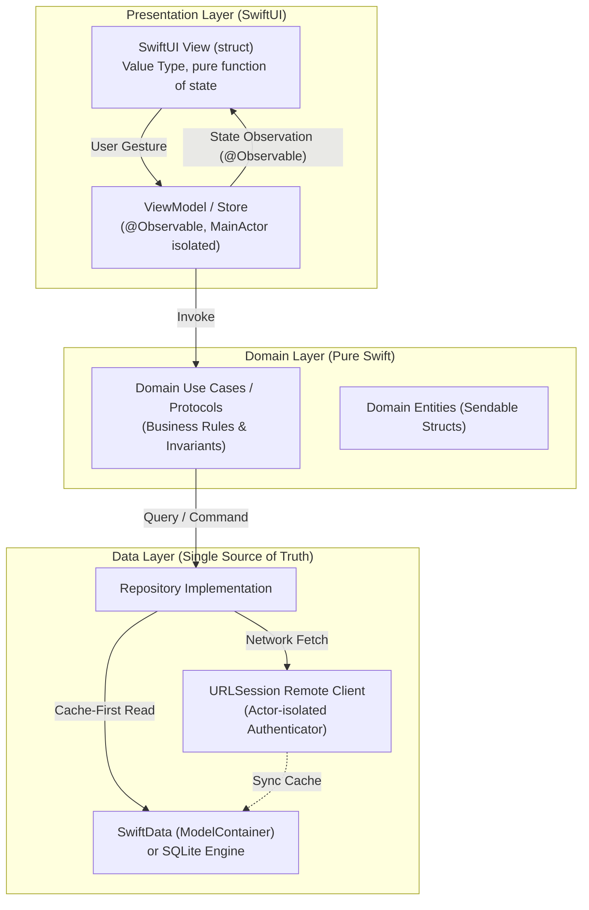

# Production iOS Engineering with Swift & SwiftUI

> "Modern iOS engineering has transitioned from legacy Objective-C runtimes and UIKit storyboards to expressive, type-safe Swift 6 with compile-time data-race safety, declarative SwiftUI rendering over Metal, strict Unidirectional Data Flow, Swift Concurrency (`async`/`await`, Actors, and Tasks), and enterprise multi-package modularization via Swift Package Manager."  
> — *Synthesized from The Swift Programming Language (Apple), Thinking in SwiftUI (Florian Kugler & Chris Eidhof), Advanced Swift (Chris Eidhof), and Apple Developer Documentation*

---

## 📚 Canonical Literature & Authoritative References
This curriculum is built directly upon the most respected literature, compiler specifications, and platform documentation in the Apple engineering ecosystem:
1. **The Swift Programming Language (Swift 6.0+)** (Apple Developer Publications / swift.org)
2. **Advanced Swift** (Chris Eidhof, Ole Begemann, Airspeed Velocity)
3. **Thinking in SwiftUI** (Florian Kugler & Chris Eidhof / objc.io)
4. **Swift Concurrency by Example & Pro Swift** (Paul Hudson)
5. **iOS System Architecture & Security Guides** (Apple Platform Security Documentation)
6. **Point-Free: Modern Swift Architecture & Composable Architecture (TCA)** (Brandon Williams & Stephen Celis)

---

## 🏛️ Comprehensive Curriculum Structure

```
Projects/Production-iOS-Development-Swift-and-SwiftUI/
├── README.md                                                 # Master Portal & Technology Comparison Matrix
├── 01. Swift 6 Language In-Depth, Type System & ARC Internals.md
├── 02. Swift Concurrency, Structured Concurrency & Actor Model.md
├── 03. SwiftUI Compiler, AttributeGraph & Declarative Rendering Engine.md
├── 04. State Management Paradigms (@Observable, Combine & TCA).md
├── 05. Modern iOS Architecture (MVVM, Clean Architecture & Modular SPM).md
├── 06. Local Persistence, SwiftData, CoreData & SQLite Engine.md
├── 07. Enterprise Networking, URLSession & Actor-Based Resilient Clients.md
├── 08. iOS Security Hardening, Keychain, CryptoKit & Secure Enclave.md
├── 09. Performance Optimization, Instruments, Memory Profiling & XCTest.md
└── 10. Production iOS Multi-Package Project Structure & CI-CD.md
```

---

## 📊 Core iOS Technology Dimension Matrix

| Architectural Dimension | Modern iOS Engineering Standard (Swift 6 & SwiftUI) | Legacy iOS Paradigm (Deprecated) |
| :--- | :--- | :--- |
| **Language & Safety** | Swift 6 (Strict Concurrency, Compile-Time Data-Race Safety) | Objective-C / Swift 4 (Manual pointers, data races) |
| **Memory Management** | Automatic Reference Counting (ARC), weak/unowned references | Manual retain/release (MRR) |
| **UI Paradigm** | SwiftUI (Declarative, View is a Value Type `struct`, AttributeGraph) | UIKit (Imperative, View is a Reference Type `UIView`, Storyboards) |
| **Concurrency** | Cooperative Thread Pool, `async`/`await`, Actors, Tasks | Grand Central Dispatch (GCD queues), Thread locks |
| **State Observation** | Observation Framework (`@Observable`), Macro expansions | Combine (`ObservableObject`, `@Published`), KVO |
| **Persistence** | SwiftData (Schema macros, ModelActor), SQLite via GRDB | Core Data (`.xcdatamodeld` XML, manual merge policies) |
| **Networking** | URLSession async/await, Codable, Actor token refresher | Alamofire completion handlers, SwiftyJSON |
| **Security Enclave** | Secure Enclave Processor (SEP), CryptoKit, Biometric Keychain | Plain UserDefaults, third-party OpenSSL wrappers |
| **Packaging & DI** | Swift Package Manager (SPM) Multi-package DAG | CocoaPods / Carthage monolithic workspaces |
| **Continuous Delivery** | Xcode Cloud, Fastlane, TestFlight, App Store Connect API | Manual Xcode archive exports |

---

## 🗺️ The Modern iOS Engineering Reference Architecture

```
===================================================================================================
                                MODERN iOS APPLICATION ARCHITECTURE
===================================================================================================

  [ UI / Presentation Layer ]
  └── SwiftUI Views (Value Types, Declarative Body, View Modifiers, NavigationStack)
           │
           ▼ (User Dispatches User Intent / Action)
  [ State Management & Presentation Logic ]
  └── Presentation Model (@Observable class / TCA Reducer / Actor-isolated ViewModel)
           │
           ▼ (Invokes Business Invariants)
  [ Domain Layer (Pure Swift) ]
  ├── Use Cases / Interactors (Zero UIKit/SwiftUI imports)
  └── Domain Entities (Sendable, Immutable Structs)
           │
           ▼ (Requests Data via Protocol Contracts)
  [ Data Layer & Offline-First Persistence ]
  ├── Repository Implementation (Reconciles Cache + Remote API)
  ├── Local Persistence:  SwiftData (ModelContainer) / Secure Keychain
  └── Remote Client:      URLSession HTTP/2 & HTTP/3 Engine with Actor-safe Auth
===================================================================================================
```


