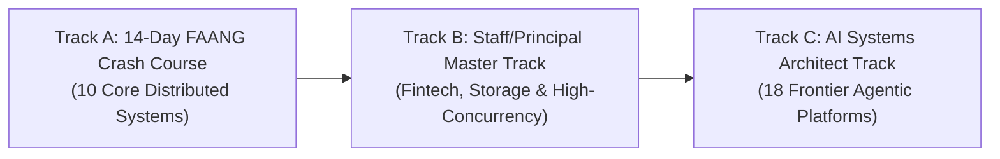

# System Design Interview - Alex Xu (Complete 3-Volume Master Guide)

> [!important] The Premier Staff/Principal System Design Curriculum
> This repository contains the complete, battle-tested 45-system curriculum across Volumes 1, 2, and 3. Every topic is packaged as an independent, modular **Chapter Hub** equipped with:
> 1. 📐 **Architectural Blueprint RFC** (Hyperscale sizing, data models, sequence diagrams, failure recovery).
> 2. 🎙️ **Interactive Interview Playbook** (45-minute live interview roleplay, sparring transcripts, trap cards, and L4/L5/L6 leveling).
> 3. 💡 **Deep Explainability Guide** (First-principles mental models, technology showdowns "Why X over Y?", and math derivations).
> 4. 🧪 **Executable Python Lab** (Production simulation engine with fault injection and benchmark test suites).

---

## 🧭 Curated Interview Prep Tracks



- 🟢 **Track A: The 14-Day FAANG Crash Course**: Focuses on the most frequently asked core distributed systems:
  - Rate Limiter, Consistent Hashing, Unique ID Generator, URL Shortener, Key-Value Store, News Feed, Chat System, Proximity Service, Payment System, S3 Object Storage.
- 🟡 **Track B: The Staff/Principal L6/L7 Master Curriculum**: Deep dives into mechanical sympathy, kernel bypass, financial invariants, and consensus:
  - Stock Exchange, Digital Wallet, Distributed Message Queue, Metrics Monitoring (TSDB), Google Maps (CCH), Hotel Reservation.
- 🟣 **Track C: The AI Infrastructure & Agent Systems Track**: Complete architectural blueprints for modern 2026 AI platforms:
  - LLM Gateway & Distributed KV-Cache, Test-Time Compute, Coding Agent Harnesses, Full-Duplex Voice, MCP Federation, Prompt Injection Defense Mesh.

---

## 📖 Volume 1: Core Distributed Systems Foundations (12 Systems)

> 🔗 **Volume 1 Dashboard**: [`Volume-1/README.md`](Volume-1/README.md)

| # | Topic | Difficulty | Chapter Hub | Architectural Blueprint | Interview Playbook | Deep Explainability | Runnable Lab |
|:---:|:---|:---:|:---|:---|:---|:---|:---|
| 01 | Distributed Rate Limiter | Medium-Hard | [`01-Rate-Limiter/`](Volume-1/01-Rate-Limiter/README.md) | [`Blueprint`](Volume-1/01-Rate-Limiter/01-Architectural-Blueprint.md) | [`Playbook`](Volume-1/01-Rate-Limiter/02-Interactive-Interview-Playbook.md) | [`Explainability`](Volume-1/01-Rate-Limiter/03-Deep-Explainability-Guide.md) | [`rate_limiter_lab.py`](Volume-1/01-Rate-Limiter/rate_limiter_lab.py) |
| 02 | Consistent Hashing | Medium | [`02-Consistent-Hashing/`](Volume-1/02-Consistent-Hashing/README.md) | [`Blueprint`](Volume-1/02-Consistent-Hashing/01-Architectural-Blueprint.md) | [`Playbook`](Volume-1/02-Consistent-Hashing/02-Interactive-Interview-Playbook.md) | [`Explainability`](Volume-1/02-Consistent-Hashing/03-Deep-Explainability-Guide.md) | [`consistent_hashing_lab.py`](Volume-1/02-Consistent-Hashing/consistent_hashing_lab.py) |
| 03 | Unique ID Generator | Medium | [`03-Unique-ID-Generator/`](Volume-1/03-Unique-ID-Generator/README.md) | [`Blueprint`](Volume-1/03-Unique-ID-Generator/01-Architectural-Blueprint.md) | [`Playbook`](Volume-1/03-Unique-ID-Generator/02-Interactive-Interview-Playbook.md) | [`Explainability`](Volume-1/03-Unique-ID-Generator/03-Deep-Explainability-Guide.md) | [`unique_id_service.py`](Volume-1/03-Unique-ID-Generator/unique_id_service.py) |
| 04 | URL Shortener | Easy-Med | [`04-URL-Shortener/`](Volume-1/04-URL-Shortener/README.md) | [`Blueprint`](Volume-1/04-URL-Shortener/01-Architectural-Blueprint.md) | [`Playbook`](Volume-1/04-URL-Shortener/02-Interactive-Interview-Playbook.md) | [`Explainability`](Volume-1/04-URL-Shortener/03-Deep-Explainability-Guide.md) | [`url_shortener_service.py`](Volume-1/04-URL-Shortener/url_shortener_service.py) |
| 05 | Web Crawler | Hard | [`05-Web-Crawler/`](Volume-1/05-Web-Crawler/README.md) | [`Blueprint`](Volume-1/05-Web-Crawler/01-Architectural-Blueprint.md) | [`Playbook`](Volume-1/05-Web-Crawler/02-Interactive-Interview-Playbook.md) | [`Explainability`](Volume-1/05-Web-Crawler/03-Deep-Explainability-Guide.md) | [`web_crawler_engine.py`](Volume-1/05-Web-Crawler/web_crawler_engine.py) |
| 06 | Distributed Key-Value Store | Hard | [`06-Key-Value-Store/`](Volume-1/06-Key-Value-Store/README.md) | [`Blueprint`](Volume-1/06-Key-Value-Store/01-Architectural-Blueprint.md) | [`Playbook`](Volume-1/06-Key-Value-Store/02-Interactive-Interview-Playbook.md) | [`Explainability`](Volume-1/06-Key-Value-Store/03-Deep-Explainability-Guide.md) | [`lsm_kv_engine.py`](Volume-1/06-Key-Value-Store/lsm_kv_engine.py) |
| 07 | Notification System | Medium | [`07-Notification-System/`](Volume-1/07-Notification-System/README.md) | [`Blueprint`](Volume-1/07-Notification-System/01-Architectural-Blueprint.md) | [`Playbook`](Volume-1/07-Notification-System/02-Interactive-Interview-Playbook.md) | [`Explainability`](Volume-1/07-Notification-System/03-Deep-Explainability-Guide.md) | [`notification_service.py`](Volume-1/07-Notification-System/notification_service.py) |
| 08 | News Feed System | Hard | [`08-News-Feed/`](Volume-1/08-News-Feed/README.md) | [`Blueprint`](Volume-1/08-News-Feed/01-Architectural-Blueprint.md) | [`Playbook`](Volume-1/08-News-Feed/02-Interactive-Interview-Playbook.md) | [`Explainability`](Volume-1/08-News-Feed/03-Deep-Explainability-Guide.md) | [`news_feed_engine.py`](Volume-1/08-News-Feed/news_feed_engine.py) |
| 09 | Real-Time Chat System | Hard | [`09-Chat-System/`](Volume-1/09-Chat-System/README.md) | [`Blueprint`](Volume-1/09-Chat-System/01-Architectural-Blueprint.md) | [`Playbook`](Volume-1/09-Chat-System/02-Interactive-Interview-Playbook.md) | [`Explainability`](Volume-1/09-Chat-System/03-Deep-Explainability-Guide.md) | [`chat_engine.py`](Volume-1/09-Chat-System/chat_engine.py) |
| 10 | Search Autocomplete | Hard | [`10-Search-Autocomplete/`](Volume-1/10-Search-Autocomplete/README.md) | [`Blueprint`](Volume-1/10-Search-Autocomplete/01-Architectural-Blueprint.md) | [`Playbook`](Volume-1/10-Search-Autocomplete/02-Interactive-Interview-Playbook.md) | [`Explainability`](Volume-1/10-Search-Autocomplete/03-Deep-Explainability-Guide.md) | [`autocomplete_engine.py`](Volume-1/10-Search-Autocomplete/autocomplete_engine.py) |
| 11 | YouTube & Video Streaming | Hard | [`11-YouTube/`](Volume-1/11-YouTube/README.md) | [`Blueprint`](Volume-1/11-YouTube/01-Architectural-Blueprint.md) | [`Playbook`](Volume-1/11-YouTube/02-Interactive-Interview-Playbook.md) | [`Explainability`](Volume-1/11-YouTube/03-Deep-Explainability-Guide.md) | [`video_streaming_engine.py`](Volume-1/11-YouTube/video_streaming_engine.py) |
| 12 | Google Drive Cloud Storage | Hard | [`12-Google-Drive/`](Volume-1/12-Google-Drive/README.md) | [`Blueprint`](Volume-1/12-Google-Drive/01-Architectural-Blueprint.md) | [`Playbook`](Volume-1/12-Google-Drive/02-Interactive-Interview-Playbook.md) | [`Explainability`](Volume-1/12-Google-Drive/03-Deep-Explainability-Guide.md) | [`cloud_storage_engine.py`](Volume-1/12-Google-Drive/cloud_storage_engine.py) |

---

## 📖 Volume 2: Advanced Hyperscale Production Systems (15 Systems)

> 🔗 **Volume 2 Dashboard**: [`Volume-2/README.md`](Volume-2/README.md)

| # | Topic | Difficulty | Chapter Hub | Architectural Blueprint | Interview Playbook | Deep Explainability | Runnable Lab |
|:---:|:---|:---:|:---|:---|:---|:---|:---|
| 01 | Proximity Service | Medium-Hard | [`01-Proximity-Service/`](Volume-2/01-Proximity-Service/README.md) | [`Blueprint`](Volume-2/01-Proximity-Service/01-Architectural-Blueprint.md) | [`Playbook`](Volume-2/01-Proximity-Service/02-Interactive-Interview-Playbook.md) | [`Explainability`](Volume-2/01-Proximity-Service/03-Deep-Explainability-Guide.md) | [`proximity_service.py`](Volume-2/01-Proximity-Service/proximity_service.py) |
| 02 | Nearby Friends | Hard | [`02-Nearby-Friends/`](Volume-2/02-Nearby-Friends/README.md) | [`Blueprint`](Volume-2/02-Nearby-Friends/01-Architectural-Blueprint.md) | [`Playbook`](Volume-2/02-Nearby-Friends/02-Interactive-Interview-Playbook.md) | [`Explainability`](Volume-2/02-Nearby-Friends/03-Deep-Explainability-Guide.md) | [`nearby_friends_engine.py`](Volume-2/02-Nearby-Friends/nearby_friends_engine.py) |
| 03 | Google Maps Navigation | Hard | [`03-Google-Maps/`](Volume-2/03-Google-Maps/README.md) | [`Blueprint`](Volume-2/03-Google-Maps/01-Architectural-Blueprint.md) | [`Playbook`](Volume-2/03-Google-Maps/02-Interactive-Interview-Playbook.md) | [`Explainability`](Volume-2/03-Google-Maps/03-Deep-Explainability-Guide.md) | [`maps_routing_engine.py`](Volume-2/03-Google-Maps/maps_routing_engine.py) |
| 04 | Distributed Message Queue | Hard | [`04-Distributed-Message-Queue/`](Volume-2/04-Distributed-Message-Queue/README.md) | [`Blueprint`](Volume-2/04-Distributed-Message-Queue/01-Architectural-Blueprint.md) | [`Playbook`](Volume-2/04-Distributed-Message-Queue/02-Interactive-Interview-Playbook.md) | [`Explainability`](Volume-2/04-Distributed-Message-Queue/03-Deep-Explainability-Guide.md) | [`distributed_queue_engine.py`](Volume-2/04-Distributed-Message-Queue/distributed_queue_engine.py) |
| 05 | Metrics Monitoring & TSDB | Hard | [`05-Metrics-Monitoring/`](Volume-2/05-Metrics-Monitoring/README.md) | [`Blueprint`](Volume-2/05-Metrics-Monitoring/01-Architectural-Blueprint.md) | [`Playbook`](Volume-2/05-Metrics-Monitoring/02-Interactive-Interview-Playbook.md) | [`Explainability`](Volume-2/05-Metrics-Monitoring/03-Deep-Explainability-Guide.md) | [`tsdb_metrics_engine.py`](Volume-2/05-Metrics-Monitoring/tsdb_metrics_engine.py) |
| 06 | Ad Click Event Aggregation | Hard | [`06-Ad-Click-Event-Aggregation/`](Volume-2/06-Ad-Click-Event-Aggregation/README.md) | [`Blueprint`](Volume-2/06-Ad-Click-Event-Aggregation/01-Architectural-Blueprint.md) | [`Playbook`](Volume-2/06-Ad-Click-Event-Aggregation/02-Interactive-Interview-Playbook.md) | [`Explainability`](Volume-2/06-Ad-Click-Event-Aggregation/03-Deep-Explainability-Guide.md) | [`ad_aggregation_engine.py`](Volume-2/06-Ad-Click-Event-Aggregation/ad_aggregation_engine.py) |
| 07 | Hotel Reservation System | Hard | [`07-Hotel-Reservation/`](Volume-2/07-Hotel-Reservation/README.md) | [`Blueprint`](Volume-2/07-Hotel-Reservation/01-Architectural-Blueprint.md) | [`Playbook`](Volume-2/07-Hotel-Reservation/02-Interactive-Interview-Playbook.md) | [`Explainability`](Volume-2/07-Hotel-Reservation/03-Deep-Explainability-Guide.md) | [`hotel_reservation_engine.py`](Volume-2/07-Hotel-Reservation/hotel_reservation_engine.py) |
| 08 | Distributed Email Service | Hard | [`08-Distributed-Email-Service/`](Volume-2/08-Distributed-Email-Service/README.md) | [`Blueprint`](Volume-2/08-Distributed-Email-Service/01-Architectural-Blueprint.md) | [`Playbook`](Volume-2/08-Distributed-Email-Service/02-Interactive-Interview-Playbook.md) | [`Explainability`](Volume-2/08-Distributed-Email-Service/03-Deep-Explainability-Guide.md) | [`email_platform_engine.py`](Volume-2/08-Distributed-Email-Service/email_platform_engine.py) |
| 09 | S3-like Object Storage | Very Hard | [`09-S3-Object-Storage/`](Volume-2/09-S3-Object-Storage/README.md) | [`Blueprint`](Volume-2/09-S3-Object-Storage/01-Architectural-Blueprint.md) | [`Playbook`](Volume-2/09-S3-Object-Storage/02-Interactive-Interview-Playbook.md) | [`Explainability`](Volume-2/09-S3-Object-Storage/03-Deep-Explainability-Guide.md) | [`object_storage_engine.py`](Volume-2/09-S3-Object-Storage/object_storage_engine.py) |
| 10 | Gaming Leaderboard | Medium-Hard | [`10-Gaming-Leaderboard/`](Volume-2/10-Gaming-Leaderboard/README.md) | [`Blueprint`](Volume-2/10-Gaming-Leaderboard/01-Architectural-Blueprint.md) | [`Playbook`](Volume-2/10-Gaming-Leaderboard/02-Interactive-Interview-Playbook.md) | [`Explainability`](Volume-2/10-Gaming-Leaderboard/03-Deep-Explainability-Guide.md) | [`gaming_leaderboard_engine.py`](Volume-2/10-Gaming-Leaderboard/gaming_leaderboard_engine.py) |
| 11 | Payment System | Very Hard | [`11-Payment-System/`](Volume-2/11-Payment-System/README.md) | [`Blueprint`](Volume-2/11-Payment-System/01-Architectural-Blueprint.md) | [`Playbook`](Volume-2/11-Payment-System/02-Interactive-Interview-Playbook.md) | [`Explainability`](Volume-2/11-Payment-System/03-Deep-Explainability-Guide.md) | [`payment_system_engine.py`](Volume-2/11-Payment-System/payment_system_engine.py) |
| 12 | Digital Wallet | Hard | [`12-Digital-Wallet/`](Volume-2/12-Digital-Wallet/README.md) | [`Blueprint`](Volume-2/12-Digital-Wallet/01-Architectural-Blueprint.md) | [`Playbook`](Volume-2/12-Digital-Wallet/02-Interactive-Interview-Playbook.md) | [`Explainability`](Volume-2/12-Digital-Wallet/03-Deep-Explainability-Guide.md) | [`digital_wallet_engine.py`](Volume-2/12-Digital-Wallet/digital_wallet_engine.py) |
| 13 | Stock Exchange | Very Hard | [`13-Stock-Exchange/`](Volume-2/13-Stock-Exchange/README.md) | [`Blueprint`](Volume-2/13-Stock-Exchange/01-Architectural-Blueprint.md) | [`Playbook`](Volume-2/13-Stock-Exchange/02-Interactive-Interview-Playbook.md) | [`Explainability`](Volume-2/13-Stock-Exchange/03-Deep-Explainability-Guide.md) | [`stock_exchange_engine.py`](Volume-2/13-Stock-Exchange/stock_exchange_engine.py) |
| 14 | Scalable Web Server & Framework | Medium-Hard | [`14-Web-Server-FastAPI/`](Volume-2/14-Web-Server-FastAPI/README.md) | [`Blueprint`](Volume-2/14-Web-Server-FastAPI/01-Architectural-Blueprint.md) | [`Playbook`](Volume-2/14-Web-Server-FastAPI/02-Interactive-Interview-Playbook.md) | [`Explainability`](Volume-2/14-Web-Server-FastAPI/03-Deep-Explainability-Guide.md) | [`web_server_framework_engine.py`](Volume-2/14-Web-Server-FastAPI/web_server_framework_engine.py) |
| 15 | Distributed Task Queue | Medium-Hard | [`15-Distributed-Task-Queue/`](Volume-2/15-Distributed-Task-Queue/README.md) | [`Blueprint`](Volume-2/15-Distributed-Task-Queue/01-Architectural-Blueprint.md) | [`Playbook`](Volume-2/15-Distributed-Task-Queue/02-Interactive-Interview-Playbook.md) | [`Explainability`](Volume-2/15-Distributed-Task-Queue/03-Deep-Explainability-Guide.md) | [`task_queue_engine.py`](Volume-2/15-Distributed-Task-Queue/task_queue_engine.py) |

---

## 📖 Volume 3: Frontier AI Platforms & Autonomous Agent Architectures (18 Systems)

> 🔗 **Volume 3 Dashboard**: [`Volume-3/README.md`](Volume-3/README.md)

| # | Topic | Difficulty | Chapter Hub | Architectural Blueprint | Interview Playbook | Deep Explainability | Runnable Lab |
|:---:|:---|:---:|:---|:---|:---|:---|:---|
| 01 | Global GitHub Code Search & RAG | Hard | [`01-Global-Code-Search-RAG/`](Volume-3/01-Global-Code-Search-RAG/README.md) | [`Blueprint`](Volume-3/01-Global-Code-Search-RAG/01-Architectural-Blueprint.md) | [`Playbook`](Volume-3/01-Global-Code-Search-RAG/02-Interactive-Interview-Playbook.md) | [`Explainability`](Volume-3/01-Global-Code-Search-RAG/03-Deep-Explainability-Guide.md) | [`github_code_search_engine.py`](Volume-3/01-Global-Code-Search-RAG/github_code_search_engine.py) |
| 02 | Agentic Trace Loop Learning | Very Hard | [`02-Agentic-Trace-Learning/`](Volume-3/02-Agentic-Trace-Learning/README.md) | [`Blueprint`](Volume-3/02-Agentic-Trace-Learning/01-Architectural-Blueprint.md) | [`Playbook`](Volume-3/02-Agentic-Trace-Learning/02-Interactive-Interview-Playbook.md) | [`Explainability`](Volume-3/02-Agentic-Trace-Learning/03-Deep-Explainability-Guide.md) | [`trace_learning_engine.py`](Volume-3/02-Agentic-Trace-Learning/trace_learning_engine.py) |
| 03 | Production Multi-Agent Platform | Hard | [`03-Multi-Agent-Orchestration/`](Volume-3/03-Multi-Agent-Orchestration/README.md) | [`Blueprint`](Volume-3/03-Multi-Agent-Orchestration/01-Architectural-Blueprint.md) | [`Playbook`](Volume-3/03-Multi-Agent-Orchestration/02-Interactive-Interview-Playbook.md) | [`Explainability`](Volume-3/03-Multi-Agent-Orchestration/03-Deep-Explainability-Guide.md) | [`multi_agent_orchestrator.py`](Volume-3/03-Multi-Agent-Orchestration/multi_agent_orchestrator.py) |
| 04 | Scalable Agentic Workflow Runner | Hard | [`04-Agentic-Workflow-Runner/`](Volume-3/04-Agentic-Workflow-Runner/README.md) | [`Blueprint`](Volume-3/04-Agentic-Workflow-Runner/01-Architectural-Blueprint.md) | [`Playbook`](Volume-3/04-Agentic-Workflow-Runner/02-Interactive-Interview-Playbook.md) | [`Explainability`](Volume-3/04-Agentic-Workflow-Runner/03-Deep-Explainability-Guide.md) | [`workflow_runner_engine.py`](Volume-3/04-Agentic-Workflow-Runner/workflow_runner_engine.py) |
| 05 | OpenClaw Autonomous Agent | Very Hard | [`05-OpenClaw-Autonomous-Agent/`](Volume-3/05-OpenClaw-Autonomous-Agent/README.md) | [`Blueprint`](Volume-3/05-OpenClaw-Autonomous-Agent/01-Architectural-Blueprint.md) | [`Playbook`](Volume-3/05-OpenClaw-Autonomous-Agent/02-Interactive-Interview-Playbook.md) | [`Explainability`](Volume-3/05-OpenClaw-Autonomous-Agent/03-Deep-Explainability-Guide.md) | [`openclaw_agent_engine.py`](Volume-3/05-OpenClaw-Autonomous-Agent/openclaw_agent_engine.py) |
| 06 | Coding Agent Harnesses | Very Hard | [`06-Coding-Agent-Harness/`](Volume-3/06-Coding-Agent-Harness/README.md) | [`Blueprint`](Volume-3/06-Coding-Agent-Harness/01-Architectural-Blueprint.md) | [`Playbook`](Volume-3/06-Coding-Agent-Harness/02-Interactive-Interview-Playbook.md) | [`Explainability`](Volume-3/06-Coding-Agent-Harness/03-Deep-Explainability-Guide.md) | [`coding_agent_harness.py`](Volume-3/06-Coding-Agent-Harness/coding_agent_harness.py) |
| 07 | Cloud & Remote Execution | Hard | [`07-Cloud-Remote-Execution/`](Volume-3/07-Cloud-Remote-Execution/README.md) | [`Blueprint`](Volume-3/07-Cloud-Remote-Execution/01-Architectural-Blueprint.md) | [`Playbook`](Volume-3/07-Cloud-Remote-Execution/02-Interactive-Interview-Playbook.md) | [`Explainability`](Volume-3/07-Cloud-Remote-Execution/03-Deep-Explainability-Guide.md) | [`remote_execution_engine.py`](Volume-3/07-Cloud-Remote-Execution/remote_execution_engine.py) |
| 08 | Enterprise AI Coworker Platform | Hard | [`08-Enterprise-AI-Coworker/`](Volume-3/08-Enterprise-AI-Coworker/README.md) | [`Blueprint`](Volume-3/08-Enterprise-AI-Coworker/01-Architectural-Blueprint.md) | [`Playbook`](Volume-3/08-Enterprise-AI-Coworker/02-Interactive-Interview-Playbook.md) | [`Explainability`](Volume-3/08-Enterprise-AI-Coworker/03-Deep-Explainability-Guide.md) | [`enterprise_coworker_engine.py`](Volume-3/08-Enterprise-AI-Coworker/enterprise_coworker_engine.py) |
| 09 | Multiplayer AI Teammate | Hard | [`09-Multiplayer-AI-Teammate/`](Volume-3/09-Multiplayer-AI-Teammate/README.md) | [`Blueprint`](Volume-3/09-Multiplayer-AI-Teammate/01-Architectural-Blueprint.md) | [`Playbook`](Volume-3/09-Multiplayer-AI-Teammate/02-Interactive-Interview-Playbook.md) | [`Explainability`](Volume-3/09-Multiplayer-AI-Teammate/03-Deep-Explainability-Guide.md) | [`multiplayer_teammate_engine.py`](Volume-3/09-Multiplayer-AI-Teammate/multiplayer_teammate_engine.py) |
| 10 | Context Engineering & ToolSearch | Hard | [`10-Context-Engineering/`](Volume-3/10-Context-Engineering/README.md) | [`Blueprint`](Volume-3/10-Context-Engineering/01-Architectural-Blueprint.md) | [`Playbook`](Volume-3/10-Context-Engineering/02-Interactive-Interview-Playbook.md) | [`Explainability`](Volume-3/10-Context-Engineering/03-Deep-Explainability-Guide.md) | [`context_engineering_engine.py`](Volume-3/10-Context-Engineering/context_engineering_engine.py) |
| 11 | Enterprise MCP Gateway | Hard | [`11-MCP-Gateway-Platform/`](Volume-3/11-MCP-Gateway-Platform/README.md) | [`Blueprint`](Volume-3/11-MCP-Gateway-Platform/01-Architectural-Blueprint.md) | [`Playbook`](Volume-3/11-MCP-Gateway-Platform/02-Interactive-Interview-Playbook.md) | [`Explainability`](Volume-3/11-MCP-Gateway-Platform/03-Deep-Explainability-Guide.md) | [`mcp_gateway_engine.py`](Volume-3/11-MCP-Gateway-Platform/mcp_gateway_engine.py) |
| 12 | Deep Research & Web Reasoning | Very Hard | [`12-Deep-Research-Agent/`](Volume-3/12-Deep-Research-Agent/README.md) | [`Blueprint`](Volume-3/12-Deep-Research-Agent/01-Architectural-Blueprint.md) | [`Playbook`](Volume-3/12-Deep-Research-Agent/02-Interactive-Interview-Playbook.md) | [`Explainability`](Volume-3/12-Deep-Research-Agent/03-Deep-Explainability-Guide.md) | [`deep_research_engine.py`](Volume-3/12-Deep-Research-Agent/deep_research_engine.py) |
| 13 | Computer-Use & OS Grounding | Very Hard | [`13-Computer-Use-Platform/`](Volume-3/13-Computer-Use-Platform/README.md) | [`Blueprint`](Volume-3/13-Computer-Use-Platform/01-Architectural-Blueprint.md) | [`Playbook`](Volume-3/13-Computer-Use-Platform/02-Interactive-Interview-Playbook.md) | [`Explainability`](Volume-3/13-Computer-Use-Platform/03-Deep-Explainability-Guide.md) | [`computer_use_grounding_engine.py`](Volume-3/13-Computer-Use-Platform/computer_use_grounding_engine.py) |
| 14 | Test-Time Compute & Search | Very Hard | [`14-Test-Time-Compute/`](Volume-3/14-Test-Time-Compute/README.md) | [`Blueprint`](Volume-3/14-Test-Time-Compute/01-Architectural-Blueprint.md) | [`Playbook`](Volume-3/14-Test-Time-Compute/02-Interactive-Interview-Playbook.md) | [`Explainability`](Volume-3/14-Test-Time-Compute/03-Deep-Explainability-Guide.md) | [`test_time_compute_engine.py`](Volume-3/14-Test-Time-Compute/test_time_compute_engine.py) |
| 15 | GraphRAG & Agent Memory | Hard | [`15-GraphRAG-Agent-Memory/`](Volume-3/15-GraphRAG-Agent-Memory/README.md) | [`Blueprint`](Volume-3/15-GraphRAG-Agent-Memory/01-Architectural-Blueprint.md) | [`Playbook`](Volume-3/15-GraphRAG-Agent-Memory/02-Interactive-Interview-Playbook.md) | [`Explainability`](Volume-3/15-GraphRAG-Agent-Memory/03-Deep-Explainability-Guide.md) | [`graphrag_memory_engine.py`](Volume-3/15-GraphRAG-Agent-Memory/graphrag_memory_engine.py) |
| 16 | Low-Latency Full-Duplex Voice | Very Hard | [`16-Full-Duplex-Voice/`](Volume-3/16-Full-Duplex-Voice/README.md) | [`Blueprint`](Volume-3/16-Full-Duplex-Voice/01-Architectural-Blueprint.md) | [`Playbook`](Volume-3/16-Full-Duplex-Voice/02-Interactive-Interview-Playbook.md) | [`Explainability`](Volume-3/16-Full-Duplex-Voice/03-Deep-Explainability-Guide.md) | [`voice_agent_engine.py`](Volume-3/16-Full-Duplex-Voice/voice_agent_engine.py) |
| 17 | LLM Gateway & Distributed KV-Cache | Very Hard | [`17-Distributed-KV-Cache/`](Volume-3/17-Distributed-KV-Cache/README.md) | [`Blueprint`](Volume-3/17-Distributed-KV-Cache/01-Architectural-Blueprint.md) | [`Playbook`](Volume-3/17-Distributed-KV-Cache/02-Interactive-Interview-Playbook.md) | [`Explainability`](Volume-3/17-Distributed-KV-Cache/03-Deep-Explainability-Guide.md) | [`kv_cache_gateway_engine.py`](Volume-3/17-Distributed-KV-Cache/kv_cache_gateway_engine.py) |
| 18 | AI Agent Defense Mesh | Very Hard | [`18-Agent-Defense-Mesh/`](Volume-3/18-Agent-Defense-Mesh/README.md) | [`Blueprint`](Volume-3/18-Agent-Defense-Mesh/01-Architectural-Blueprint.md) | [`Playbook`](Volume-3/18-Agent-Defense-Mesh/02-Interactive-Interview-Playbook.md) | [`Explainability`](Volume-3/18-Agent-Defense-Mesh/03-Deep-Explainability-Guide.md) | [`agent_defense_mesh_engine.py`](Volume-3/18-Agent-Defense-Mesh/agent_defense_mesh_engine.py) |

---

## ⏱️ The 45-Minute Staff/Principal Interview Framework

```
00:00 ────── 05:00 ────── 10:00 ────────────────── 25:00 ───────────── 38:00 ───── 45:00
  │            │            │                         │                   │          │
Scoping      Sizing     High-Level Architecture   Low-Level Deep Dive  Trap Cards  Wrap-up
& Traps      & SLAs     & Zero-to-Hero Evolution  & Storage / Kernels  & Chaos     & Monitoring
```

1. **Requirements Clarification (00:00 - 05:00)**: Negotiate boundaries (Edge vs API Gateway vs Sidecar), keying dimensions, and fail-open vs fail-closed policies.
2. **Back-of-the-Envelope Capacity Sizing (05:00 - 10:00)**: Derive QPS, network ingress/egress, RAM allocations, and identify the Centralization Bottleneck immediately.
3. **High-Level Design & Evolutionary Journey (10:00 - 25:00)**: Start with naive baseline v1, demonstrate where it fails under load, evolve to distributed partitioned topology.
4. **Low-Level Deep Dive & Tech Showdown (25:00 - 38:00)**: Defend technology choices ("Why Redis over Cassandra?"), explain kernel mechanics (`epoll`, `sendfile`, `O_DIRECT`, memory alignment).
5. **Interview Traps & Chaos Resilience (38:00 - 45:00)**: Handle cross-region speed-of-light traps, network partitions, and disaster recovery runbooks.
