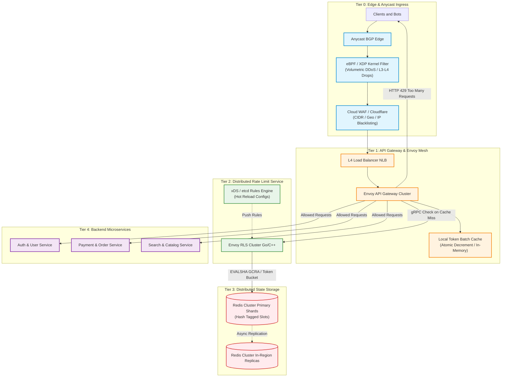
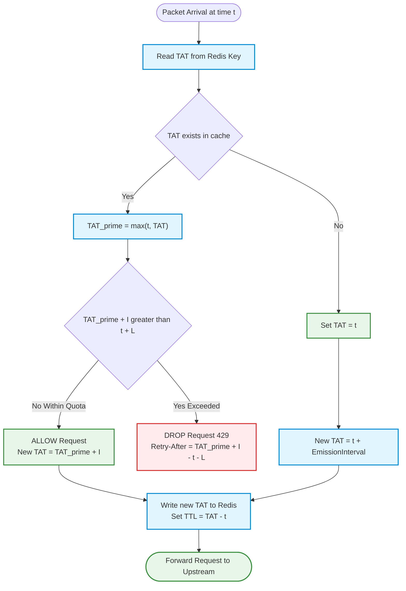
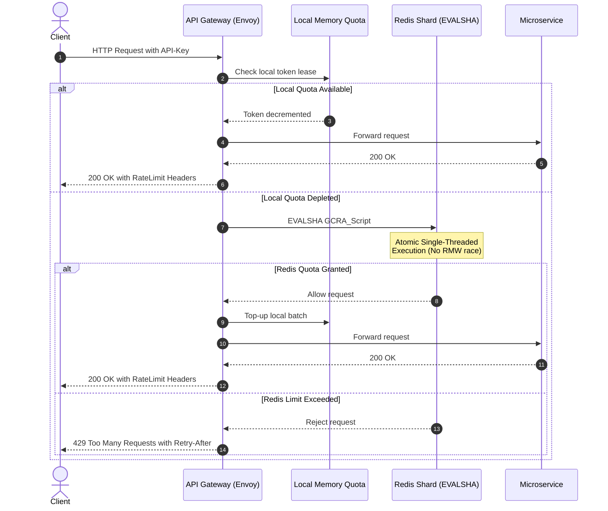
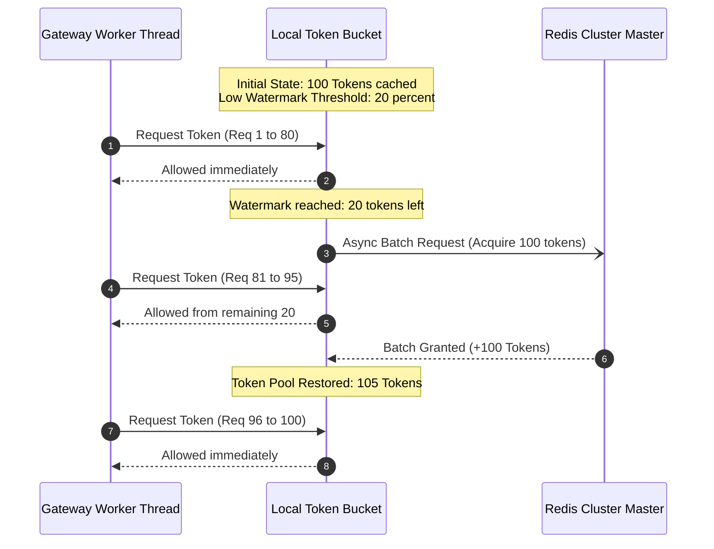
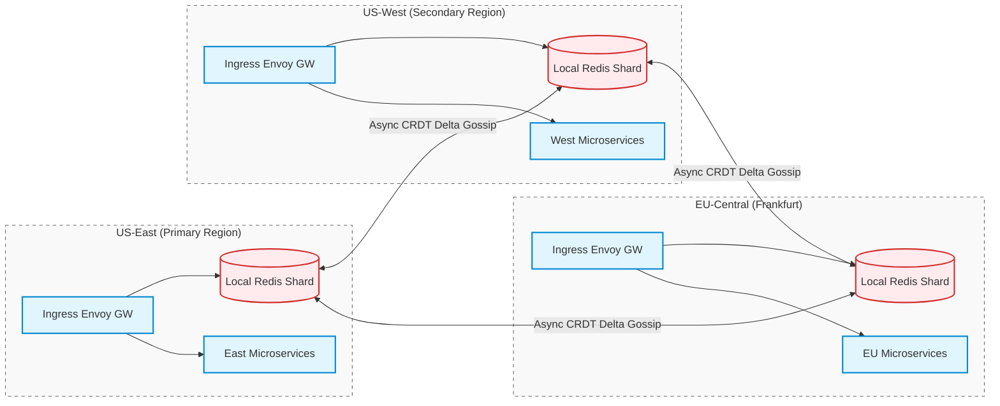
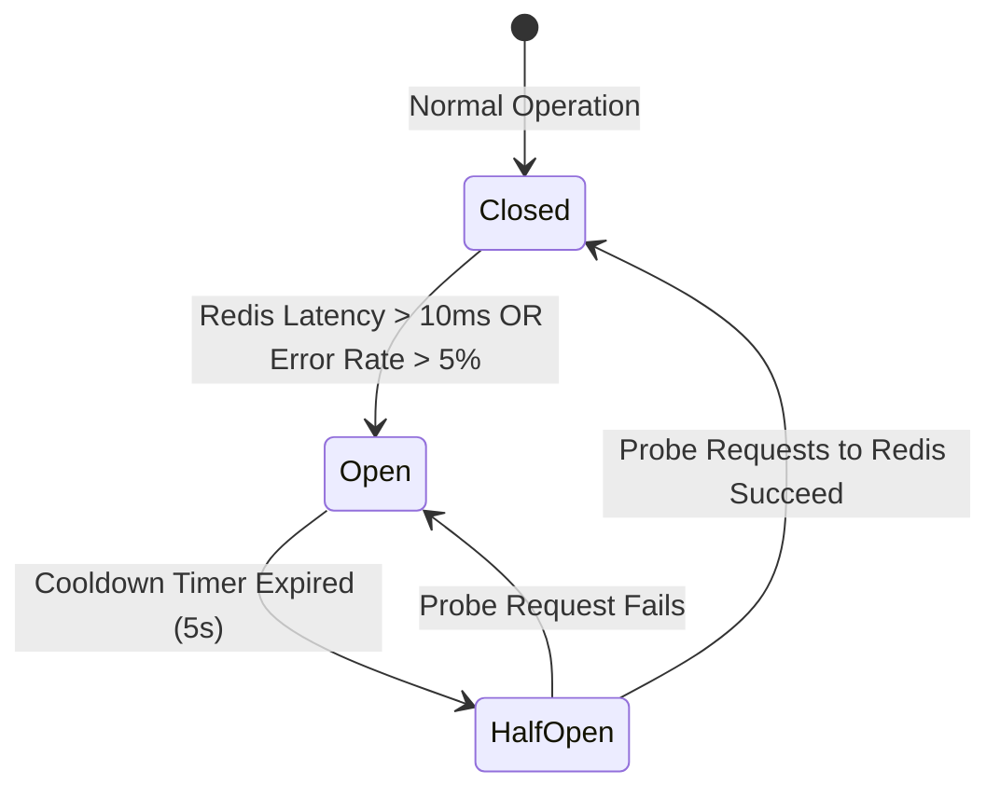

# Design a Distributed Rate Limiter & Traffic Shaper (Hyperscale Blueprint)

> [!tip] Staff/Principal Deep Walkthrough & Code Lab
> - **Interview Playbook**: [`Chapter 1 Staff/Principal Walkthrough Playbook`](02-Interactive-Interview-Playbook.md)
> - **Runnable Code Lab**: [`rate_limiter_lab.py`](rate_limiter_lab.py) (GCRA, Two-Tier Local Batching, Chaos Lab, 1.5M QPS benchmark)

## 1. Problem Statement & Motivation

A **rate limiter** controls the rate of traffic sent by a client or service. In HTTP/gRPC architectures, it caps the number of requests an entity can dispatch over a predefined time window. When traffic exceeds the configured threshold, excess calls are throttled, dropped, or queued.

```
Incoming Request Stream ──► [ Rate Limiter ] ──┬──► [ Allowed ] ──► Upstream Microservices
                                              └──► [ Throttled ] ─► HTTP 429 Too Many Requests
```

### Why Rate Limiting is Critical in Modern Microservices

1. **Denial of Service (DoS) & Bot Mitigation**: Prevents malicious actors, misconfigured microservices, or aggressive web scrapers from exhausting compute, memory, and database connection pools.
2. **Cascading Failure Protection (Resilience)**: Shields bottlenecked downstream dependencies (e.g., legacy relational databases, transactional mainframes, third-party payment gateways) from being overwhelmed during traffic spikes.
3. **Cost Governance & Resource Allocation**: In cloud environments with autoscaling, unmetered traffic triggers runaway compute provisioning ("Denial of Wallet" attacks). Rate limiting enforces hard budgetary fences.
4. **Multi-Tenant Fair Sharing**: Ensures "noisy neighbors" on shared multi-tenant SaaS platforms cannot monopolize thread pools and degrade latency for paying enterprise tenants.
5. **Monetization & API Tiering**: Enforces commercial contracts (e.g., Stripe, OpenAI, GitHub, AWS), where access tiers dictate throughput quotas (e.g., Free Tier: 60 req/min; Enterprise: 10,000 req/sec).

> [!note] Industry Hyperscale Benchmarks
> - **Stripe**: Employs Token Bucket algorithms with separate tiers for read (100 req/s) and write operations (25 req/s), backed by Redis clusters.
> - **GitHub**: Allocates 5,000 requests/hour for personal access tokens, while unauthenticated requests are throttled to 60/hour based on source IP.
> - **OpenAI**: Enforces multi-dimensional rate limits measuring both Requests Per Minute (RPM) and Tokens Per Minute (TPM) per AI model tier.
> - **Cloudflare**: Operates edge-based rate limiting via eBPF/XDP at Anycast edge PoPs, filtering volumetric layer-7 attacks at wire speed before traffic enters datacenter backbones.

---

## 2. Requirements Clarification & System Scope

### Candidate-Interviewer Alignment Dialog

**Candidate:** Are we designing an edge-level rate limiter (CDN/WAF), an API Gateway middleware, or an internal service mesh rate limiter?  
**Interviewer:** Focus on a distributed, centralized rate-limiting layer integrated into our API Gateway mesh, but flexible enough to protect both external public APIs and internal service-to-service gRPC calls.

**Candidate:** Which dimensions will we rate limit on? Just IP address, or authenticated identities?  
**Interviewer:** The system must support multi-dimensional limiting: IP address (for anonymous traffic), User ID / API Key (for authenticated clients), Route/Endpoint (e.g., `/checkout` vs `/search`), and Tenant Tier (Free vs Enterprise).

**Candidate:** What is the system's traffic scale and latency tolerance?  
**Interviewer:** Design for **500,000 peak QPS** across globally distributed data centers. The rate limiter sits directly on the critical request path, so latency overhead must be **under 1 ms at $P_{99}$**.

**Candidate:** In the event of rate limiter infrastructure failure (e.g., Redis outage or network partition), should we fail-open or fail-closed?  
**Interviewer:** Public APIs must **fail-open** to prioritize availability and user experience, but security-critical endpoints (e.g., `/v1/auth/login`, `/v1/payments`) must support configurable **fail-closed** policies.

### Functional Requirements (FR)

| ID | Requirement | Description |
|:---|:---|:---|
| **FR-1** | **Multi-Dimensional Keying** | Throttles traffic by client IP, authenticated User ID, API Key, Route, HTTP Verb, or composite descriptors (e.g., `user:1024 + POST /orders`). |
| **FR-2** | **Multi-Tier Quota Hierarchy** | Evaluates cascading quota tiers: Global Edge (IP/CIDR) $\to$ Tenant Tier $\to$ Route Limit $\to$ Downstream Service Capacity. |
| **FR-3** | **Standardized HTTP Responses** | Returns `HTTP 429 Too Many Requests` with RFC 6585 / IETF draft headers: `RateLimit-Limit`, `RateLimit-Remaining`, and `RateLimit-Reset`. |
| **FR-4** | **Dynamic Rule Hot-Reloading** | Allows DevOps and product teams to update limits via an administrative control plane without restarting gateway proxies or dropping connections. |
| **FR-5** | **Configurable Actions** | Supports hard rejection (drop immediately), soft throttling (log warning only), and traffic shaping (delaying requests via Leaky Bucket buffer). |

### Non-Functional Requirements (NFR)

| ID | Requirement | Target Metric | Architectural Strategy |
|:---|:---|:---|:---|
| **NFR-1** | **Ultra-Low Latency** | $< 1.0\text{ ms}$ overhead at $P_{99}$ | Local In-Memory Token Leases (Envoy batching) + Redis pipelined Lua. |
| **NFR-2** | **High Availability** | $99.999\%$ uptime ($< 5.26$ min downtime/yr) | Active-Active multi-DC deployment with local Redis shards + circuit breaker fallback. |
| **NFR-3** | **Distributed Consistency** | Bounded over-allowance $\le 3\%$ | Local token leasing with asynchronous batch replenishment; atomic Redis Lua scripts. |
| **NFR-4** | **Memory Efficiency** | $< 1\text{ GB}$ per 10M active quotas | Generic Cell Rate Algorithm (GCRA) using a single 64-bit integer timestamp per key. |
| **NFR-5** | **Fault Tolerance** | Resilient against Redis failure | Circuit breaker with automated Fail-Open fallback and local token degradation. |

---

## 3. Back-of-the-Envelope Capacity Planning & Sizing

### 3.1 Traffic Baselining

- **Daily Active Users (DAU)**: 100 Million
- **Average API Requests per User/Day**: 50 requests
- **Total Daily Requests**: $100\text{M} \times 50 = 5,000,000,000\text{ requests/day}$ ($5\text{ Billion}$)
- **Average Throughput**:
  $$\text{QPS}_{\text{avg}} = \frac{5 \times 10^9\text{ requests}}{86,400\text{ seconds}} \approx 57,870\text{ QPS}$$
- **Peak Throughput Multiplier**: $8\times - 10\times$ (accounting for flash sales, marketing campaigns, morning traffic bursts)
- **Peak Throughput ($\text{QPS}_{\text{peak}}$)**:
  $$\text{QPS}_{\text{peak}} \approx 500,000\text{ QPS}$$

### 3.2 Network & Redis Throughput Constraints (The Centralization Trap)

If every incoming request executes a synchronous remote call to a centralized Redis cluster:
- **Redis Query Load**: $500,000\text{ QPS}$.
- A standard single-threaded Redis instance tops out at **$100,000 - 120,000\text{ QPS}$** under optimal pipelining and basic keys.
- Handling $500,000\text{ QPS}$ would require a minimum of $5 - 8$ dedicated Redis primary master shards dedicated purely to rate limiting counters.
- **Cross-Region Latency Tax**: If an API Gateway in Frankfurt (`eu-central-1`) synchronously queries a Redis cluster in Virginia (`us-east-1`), every request incurs an unalterable speed-of-light network round-trip of **$75 - 85\text{ ms}$**, completely violating the $< 1\text{ ms}$ $P_{99}$ SLA!

```
Direct Redis Synchronous Check (Anti-Pattern at 500k QPS):
User Request ──► Ingress Gateway ──[ WAN: 75ms ]──► Remote Redis (500k QPS bottleneck!)
```

### 3.3 The Solution: Local Token Batching Math (Envoy / Stripe Architecture)

Instead of querying Redis on every single request, each API Gateway worker process acquires **Token Leases (Batches)** from Redis:
- **Batch Size ($B$)**: 100 tokens per allocation.
- **Local Cache Check**: Evaluated in-memory via atomic CPU registers ($< 5\ \mu\text{s}$).
- **Effective Redis QPS**:
  $$\text{Redis QPS} = \frac{\text{Global QPS}}{B} = \frac{500,000}{100} = 5,000\text{ QPS}$$
- **Result**: Global Redis load drops from $500,000\text{ QPS}$ to just **$5,000\text{ QPS}$**—easily handled by a single Redis primary node with $< 2\%$ CPU utilization!

### 3.4 Memory Footprint Estimation

We evaluate memory consumption under the **Generic Cell Rate Algorithm (GCRA)** vs. **Sliding Window Log**:

#### Approach A: Sliding Window Log (Naive ZSET)
- 100M daily users, average 50 req/window.
- Each request stores an 8-byte timestamp + 16-byte member UUID in a Redis Sorted Set (ZSET).
- Per-element overhead in ZSET (skiplist node + dict entry): $\approx 64\text{ bytes}$.
- Memory for 100M active keys:
  $$\text{Memory}_{\text{ZSET}} = 100\text{M users} \times 10\text{ concurrent reqs} \times 64\text{ bytes} \approx 64\text{ GB (Prohibitive!)}$$

#### Approach B: GCRA (Theoretical Arrival Time - TAT)
- Each rate-limited entity requires **exactly ONE key** containing an 8-byte integer timestamp (`int64`).
- Redis key naming: `rl:gcra:{tenant_id}:{user_id}` ($\approx 32\text{ bytes}$).
- Redis String internal structure (`robj` + `sds` header + `jemalloc` bin allocation): $\approx 48\text{ bytes}$ total per key.
- Active concurrent entities in any given 5-minute sliding window: $\approx 5,000,000$ active users.
- **Total Redis RAM Required**:
  $$\text{Active Memory} = 5 \times 10^6 \times 48\text{ bytes} \approx 240\text{ MB}$$
- Even with 50M keys cached with 1-hour TTLs: $50\text{M} \times 48\text{ bytes} \approx 2.4\text{ GB}$.
- **Fits comfortably in a single low-cost 8 GB Redis instance with 70% headroom.**

---

## 4. End-to-End System Architecture

The following diagram details the production multi-tier defense-in-depth rate limiting topology, spanning the Anycast network edge down to microservice clusters:



### Architectural Layer Breakdown

1. **Tier 0: Edge Anycast & Kernel BPF**:
   - Packets hit edge Point of Presence (PoP) routers.
   - eBPF/XDP drivers drop known volumetric attacks, SYN floods, and blacklisted CIDR blocks at line rate ($> 10\text{M pps}$) directly inside the network interface card (NIC) driver before allocating Linux kernel socket buffers (`sk_buff`).
2. **Tier 1: API Gateway (Envoy Proxy)**:
   - Performs TLS termination, JWT validation, and key extraction (`user_id`, `client_ip`, `route`).
   - Consults its local in-memory token reservoir. If tokens remain in the locally leased batch, the request passes immediately with zero network overhead ($< 10\ \mu\text{s}$).
3. **Tier 2: Distributed Rate Limit Service (Envoy RLS)**:
   - High-throughput, stateless Go/C++ service implementing the standard Envoy Rate Limit gRPC protocol (`envoy.service.ratelimit.v3.RateLimitService`).
   - Batches token requests and queries Redis via pipelined, pre-compiled Lua scripts (`EVALSHA`).
4. **Tier 3: State Storage (Redis Cluster)**:
   - Sharded Redis cluster utilizing consistent hash rings.
   - Keys use hash tags (e.g., `{tenant_1042}:user:501`) to ensure all rate limit counters for a single tenant reside on the same Redis shard, enabling multi-descriptor atomic Lua transactions.
5. **Dynamic Control Plane**:
   - External rules stored in `etcd` or git-managed YAML.
   - Pushed via Envoy's dynamic discovery service (xDS) or gRPC streaming to all RLS nodes in real time without restarting proxies.

---

## 5. Comprehensive Analysis of 6 Rate Limiting Algorithms

### 5.1 Token Bucket

The industry standard algorithm utilized by Amazon, Stripe, and Spring Cloud Gateway.

```
       Token Refill Rate: r tokens/sec
              │
              ▼
      ┌───────────────┐
      │  ● ● ● ● ● ●  │  Bucket Capacity = b
      │   (Tokens)    │
      └───────┬───────┘
              │  Request Arrives: Consumes 1 Token
              ▼
      [ Allow Request ] (If tokens >= 1)
              │
              ▼ (If bucket empty: 0 tokens)
      [ Reject HTTP 429 ]
```

#### Mathematical Specification
- **State**: Bucket contains $T$ tokens at time $t_{\text{last}}$, with capacity $b$ and refill rate $r$ tokens/second.
- **On Request Arrival at time $t_{\text{now}}$**:
  $$\Delta t = t_{\text{now}} - t_{\text{last}}$$
  $$T_{\text{refilled}} = \min(b, T + \Delta t \times r)$$
  $$\text{Decision} = \begin{cases} \text{ALLOW and } T_{\text{new}} = T_{\text{refilled}} - 1, & \text{if } T_{\text{refilled}} \ge 1 \\ \text{DROP (429)}, & \text{if } T_{\text{refilled}} < 1 \end{cases}$$
- **Pros**: Perfectly accommodates bursts (up to $b$ requests instantly); memory-efficient (stores only 2 numbers: float token count and timestamp).
- **Cons**: Tuning two interrelated parameters ($b, r$) requires load testing; burst traffic can temporarily cause downstream resource spikes.

---

### 5.2 Leaking Bucket (Traffic Shaping)

Whereas the Token Bucket allows bursts, the Leaking Bucket smooths traffic to a strictly constant egress rate.

```
Incoming Bursty Requests ──► [ ||||||||||| ] FIFO Buffer (Capacity: b)
                                    │
                                    ▼ Fixed Leak Rate (r req/sec)
                             [ Downstream API ]
```

- **Mechanism**: Implemented as a bounded FIFO queue. Requests enter the queue; if queue length $> b$, incoming requests are dropped immediately. Worker threads pull requests off the queue at a fixed rate of $r$ req/sec.
- **Pros**: Produces a perfectly smooth, predictable outflow rate. Ideal for feeding fragile legacy backends or rate-limited egress third-party APIs.
- **Cons**: High queueing delay for requests arriving during bursts. Increases client latency; old requests sit in the buffer while modern clients may have already timed out.

---

### 5.3 Fixed Window Counter

Divides the timeline into fixed, non-overlapping intervals (e.g., 1 minute: `12:00:00 - 12:01:00`).

```
Window 1 [12:00:00 - 12:01:00]       Window 2 [12:01:00 - 12:02:00]
     Counter: 100/100                      Counter: 100/100
             ▲                                     ▲
             │                                     │
      100 reqs at 12:00:59                  100 reqs at 12:01:01
      └────────────────────────────────────────────┘
      Critical Flaw: 200 requests within a 2-second interval! (2x Limit)
```

#### The Boundary Doubling Proof
- Let limit $L = 100\text{ req/minute}$.
- An attacker dispatches 100 requests at second `59` of Window 1. All 100 pass.
- At second `01` of Window 2, the counter resets to 0. The attacker dispatches another 100 requests. All 100 pass.
- **Observed Throughput**: 200 requests in a span of 2 seconds ($100\text{ req/sec}$ sustained), violating the intended SLA of $100\text{ req/min}$ by $60\times$!
- **Verdict**: Unacceptable for security-critical or strict resource-limited systems.

---

### 5.4 Sliding Window Log

Eliminates the boundary problem by recording an exact timestamp log for every single request.

- **Mechanism**:
  1. Store request timestamps in a sorted set (e.g., Redis ZSET).
  2. On request arrival at time $t_{\text{now}}$, execute `ZREMRANGEBYSCORE key 0 (now - window_size)`.
  3. Execute `ZCARD key`. If $\text{count} < \text{limit}$, execute `ZADD key now request_id`, allow request; else reject.
- **Pros**: 100% mathematical accuracy. Zero boundary anomalies.
- **Cons**: Severe memory overhead ($O(N)$ where $N$ is total requests in the window). A malicious actor flooding 50,000 req/sec forces the rate limiter to store 50,000 elements in RAM before rejecting!

---

### 5.5 Sliding Window Counter (Weighted Moving Average)

A hybrid that combines the low memory overhead of the Fixed Window Counter with the accuracy of the Sliding Window Log. Recommended by Cloudflare.

```
◄── Previous Window (12:00) ──►◄── Current Window (12:01) ──►
[    Count: 84 reqs           │   Count: 36 reqs            ]
                              │        ▲
                              │        │ Current Time: 12:01:15 (25% elapsed)
                              └────────┴─────────────────────
                              Overlap with Previous Window = 75%
```

#### Mathematical Formulation
$$\text{Weight}_{\text{prev}} = 1 - \frac{t_{\text{now}} - t_{\text{window\_start}}}{\text{Window Size}}$$
$$\text{Estimated Count} = \left(\text{Count}_{\text{prev}} \times \text{Weight}_{\text{prev}}\right) + \text{Count}_{\text{current}}$$
$$\text{Decision} = \begin{cases} \text{ALLOW and increment } \text{Count}_{\text{current}}, & \text{if } \text{Estimated Count} < \text{Limit} \\ \text{DROP (429)}, & \text{if } \text{Estimated Count} \ge \text{Limit} \end{cases}$$

#### Step-by-Step Numerical Example
- **Configuration**: Limit = 100 requests/minute. Window = 60 seconds.
- Previous window request count = 84 requests.
- Current window request count = 36 requests.
- Current time is 15 seconds into the current minute ($25\%$ elapsed).
- Overlap with previous window = $1 - 0.25 = 0.75$ ($75\%$).
- Estimated Count:
  $$\text{Estimated Count} = (84 \times 0.75) + 36 = 63 + 36 = 99\text{ requests}$$
- Since $99 < 100$, the request is **ALLOWED**, and current counter increments to 37.
- A request arriving 1 second later would yield $(84 \times 0.733) + 37 = 61.5 + 37 = 98.5 < 100$, also allowed.
- **Pros**: Only requires two integer counters in Redis (`curr_window`, `prev_window`). Smooths out boundary spikes.
- **Cons**: Assumes requests in the previous window were uniformly distributed (an approximation, but errors are bounded $< 5\%$ in practice).

---

### 5.6 Generic Cell Rate Algorithm (GCRA) — The Production Gold Standard

Originating in Asynchronous Transfer Mode (ATM) telecommunications, GCRA is the most space-efficient, mathematically rigorous rate-limiting algorithm in modern engineering (implemented in `redis-cell` and high-performance Envoy extensions).

#### Core Philosophy: Theoretical Arrival Time (TAT)
Instead of tracking token counts or logging timestamps, GCRA maintains **a single timestamp variable per rate limiter: the Theoretical Arrival Time (TAT)**.

- **Emission Interval ($I$)**: Time between permitted requests at sustained rate:
  $$I = \frac{\text{Period}}{\text{Rate Limit}}$$
- **Burst Tolerance ($L$)**: Maximum burst allowance expressed in time:
  $$L = \text{Burst Capacity} \times I$$
- **Rule**: If a request arrives, TAT is updated. If the next request arrives too early (before $\text{TAT} - L$), it is rejected.

#### GCRA State Transition Flowchart



#### Production Redis Lua Script for GCRA

```lua
-- KEYS[1]: Rate limit key (e.g., rl:gcra:tenant_1:user_42)
-- ARGV[1]: Emission Interval in milliseconds (I = period_ms / limit)
-- ARGV[2]: Burst Tolerance in milliseconds (L = burst * I)
-- ARGV[3]: Current timestamp in milliseconds (now)
-- ARGV[4]: Cost of current request (usually 1)

local key = KEYS[1]
local emission_interval = tonumber(ARGV[1])
local burst_tolerance = tonumber(ARGV[2])
local now = tonumber(ARGV[3])
local cost = tonumber(ARGV[4]) or 1

local increment = emission_interval * cost
local tat = redis.call("GET", key)

local new_tat
if not tat then
    new_tat = now + increment
else
    tat = tonumber(tat)
    local tat_prime = math.max(now, tat)
    if tat_prime + increment > now + burst_tolerance then
        -- Rate limit exceeded!
        local retry_after_ms = math.ceil(tat_prime + increment - now - burst_tolerance)
        return {0, retry_after_ms, 0} -- [allowed, retry_after_ms, remaining]
    end
    new_tat = tat_prime + increment
end

-- Save new TAT and calculate TTL (seconds)
local ttl = math.ceil((new_tat - now) / 1000)
if ttl > 0 then
    redis.call("SET", key, new_tat, "EX", ttl)
end

local remaining = math.floor((now + burst_tolerance - new_tat) / emission_interval)
return {1, 0, math.max(0, remaining)} -- [allowed, retry_after_ms, remaining]
```

### Algorithm Comparative Matrix

| Algorithm | State Size per Key | CPU Complexity | Eliminates Boundary Spikes? | Allows Bursts? | Production Suitability |
|:---|:---|:---|:---:|:---:|:---|
| **Token Bucket** | 16 bytes (hash: tokens + time) | $O(1)$ | Yes | Yes (up to $b$) | Excellent (Stripe, Envoy, AWS) |
| **Leaking Bucket** | Memory of FIFO queue | $O(1)$ | Yes | No (Strict egress) | Excellent for traffic shaping / queues |
| **Fixed Window** | 8 bytes (single integer) | $O(1)$ | No ($2\times$ spike) | Distorted | Poor (Vulnerable to boundary attacks) |
| **Sliding Window Log** | $O(N)$ bytes (all timestamps) | $O(\log N)$ | Yes | Yes | Terrible at scale (Memory explosion) |
| **Sliding Window Counter**| 16 bytes (2 integers) | $O(1)$ | Yes (bounded error) | Yes | High (Cloudflare, Akamai) |
| **GCRA** | **8 bytes (single int64 TAT)** | **$O(1)$** | **Yes** | **Yes** | **Gold Standard (`redis-cell`, Heroku)** |

---

## 6. Distributed Concurrency & The Read-Modify-Write Fallacy

### The Naive Concurrency Bug

In distributed systems, naive implementations that separate read and write commands cause phantom quota leakage:

```
Thread A (Gateway 1)                Redis Master                Thread B (Gateway 2)
        │                                 │                              │
        ├─── 1. GET key (Count: 99) ─────►│                              │
        │                                 │◄─── 1. GET key (Count: 99) ──┤
        │    (99 < 100 -> OK!)            │    (99 < 100 -> OK!)         │
        ├─── 2. INCR key (Count: 100) ───►│                              │
        │                                 │◄─── 2. INCR key (Count: 101)─┤
        ▼                                 ▼                              ▼
  Request ALLOWED                   Quota Exceeded!                Request ALLOWED
```

- Both threads read counter value `99`. Both observe that $99 < 100$. Both allow the request and increment the counter.
- Two requests passed when only one should have been permitted. Under high concurrency ($10,000\text{ req/sec}$ targeting the same key), over-admission can exceed $300\%$.

### The Staff-Level Solution: Pipelined Atomic Lua (`EVALSHA`)

Redis executes Lua scripts in a single-threaded, strictly atomic context. No intervening commands can execute while a Lua script evaluates.



### The `INCR` + `EXPIRE` Race Condition Fix
In legacy implementations:
```python
# BROKEN ANTI-PATTERN:
count = redis.incr(key)
if count == 1:
    redis.expire(key, 60) # CRITICAL BUG: If process crashes here, key lives forever without TTL!
```
**Fix**: Lua scripts execute both `INCR` and `EXPIRE` atomically. Alternatively, Redis 6.2+ supports `INCREX`:
```bash
SET key 1 EX 60 NX
```

---

## 7. Local Token Batching & Multi-Region Quota Mesh

To support $500,000\text{ QPS}$ with sub-millisecond latency across geographically separated datacenters without global locking, we employ **Local Token Batching with Low-Watermark Replenishment**.



### Multi-Region Active-Active Quota Synchronization

When deploying across multiple cloud regions (e.g., `us-east`, `us-west`, `eu-central`), synchronizing rate limiters presents a fundamental trade-off governed by the **CAP Theorem**:
- **Option A: Synchronous Global Consensus (Raft / Paxos)**: Strong linearizability. Every write coordinates across regions. Latency increases by $80 - 200\text{ ms}$. **Unusable for an API Gateway on the hot path.**
- **Option B: Local Shards with Asynchronous CRDT Reconciliation (AP)**: Each region operates a local Redis shard. Regional gateways decrement local counters. Background workers gossip delta counters between regions using Conflict-Free Replicated Data Types (**PN-Counters**).



#### Bounded Over-Allowance Math
In the event of total trans-Atlantic fiber cuts (network partition):
- Each region continues serving traffic locally using its apportioned quota fraction (e.g., US-East gets 50%, US-West 30%, EU 20%).
- Worst-case global over-allowance during cross-region sync lag ($\tau = 500\text{ ms}$) is strictly bounded:
  $$\text{Over-Allowance} \le \text{Global Limit} \times \frac{\tau}{\text{Window Duration}} \approx 100 \times \frac{0.5\text{s}}{60\text{s}} \approx 0.83\%$$
- This $< 1\%$ divergence is completely acceptable for DDoS and cost protection.

---

## 8. Micro-Architecture & Kernel-Level Acceleration

### 8.1 Wire-Speed eBPF/XDP Rate Limiting
For volumetric attacks ($> 1\text{ Gbps}$ or $> 1\text{M pps}$ of malformed requests), user-space rate limiting in Envoy or Go will crash due to context switching and `sk_buff` allocation overhead in the Linux networking stack.

```
Incoming NIC Packet ──► [ XDP Hook (Driver Layer) ] ──┬──► XDP_DROP (eBPF Token Bucket Drop)
                                                      └──► XDP_PASS ──► Linux Network Stack ──► Envoy
```

Using **eBPF (Extended Berkeley Packet Filter)** at the **XDP (eXpress Data Path)** driver level:
- Incoming packets are evaluated directly in the network card driver before OS memory allocation.
- BPF maps maintain an LRU token bucket per source IP CIDR.
- Malicious IPs are dropped in $< 10\text{ nanoseconds}$ per packet, allowing a single commodity Linux server to absorb $10\text{M+ packets/second}$.

### 8.2 Redis Memory Micro-Optimization
To prevent memory fragmentation and high pointer overhead in Redis:
1. **Short Key Names**: Instead of `rate_limit:generic_cell_rate_algorithm:user:12345`, use `rl:g:{u:12345}`.
2. **Small String Optimization (`embstr`)**: In Redis, if a string value is $\le 44\text{ bytes}$, Redis allocates the `robj` and `sds` headers in a single contiguous memory block via `jemalloc`. Keeping keys and values small ensures zero slab fragmentation.
3. **Hash Tags for Cluster Slot Colocation**: In Redis Cluster, operations affecting multiple keys fail with `CROSSSLOT Keys in request don't hash to the same slot`. By wrapping the tenant identifier in curly braces (`{tenant_102}:ip` and `{tenant_102}:user`), Redis hashes only the bracketed substring, guaranteeing that all descriptors for a tenant map to the identical Redis hash slot!

---

## 9. Failure Modes, SRE Resilience & Circuit Breakers

### Fail-Open vs. Fail-Closed Decision Matrix

| Endpoint Tier | Business Function | Strategy | Justification |
|:---|:---|:---:|:---|
| **Tier 1: Mission-Critical** | `/v1/checkout`, `/v1/orders` | **Fail-Open** | Dropping checkouts during a Redis glitch costs thousands of dollars per minute in lost GMV. |
| **Tier 2: High-Volume Read** | `/v1/search`, `/v1/catalog` | **Fail-Open** | Graceful degradation with local in-memory fallback limits. |
| **Tier 3: Security-Sensitive** | `/v1/auth/login`, `/v1/auth/reset` | **Fail-Closed** | Failing open allows brute-force credential stuffing and password spray attacks. |
| **Tier 4: Expensive Compute** | `/v1/reports/export`, `/v1/llm/infer` | **Fail-Closed** | Unmetered access crashes backend GPU workers and triggers Denial of Wallet. |

### Circuit Breaker & Adaptive Load Shedding

The API Gateway wraps all remote Redis/RLS calls in an active Circuit Breaker (Netflix Hystrix / Resilience4j pattern):



- **Closed State**: Normal operation. 100% of rate-limiting rules enforced against Redis + local cache.
- **Open State**: Redis latency exceeds $10\text{ ms}$ for $1\%$ of requests. The gateway trips the breaker. Remote calls cease. Gateways switch to autonomous local token buckets with conservative static limits (Adaptive Degradation).
- **Half-Open State**: Sends a $1\%$ canary probe of requests to Redis. If latency returns to $< 1\text{ ms}$, the breaker closes.

---

## 10. Standardized HTTP Headers & Rules Configuration

### 10.1 IETF Draft Standard RateLimit Headers

Modern hyperscale systems adhere to the IETF RateLimit Header Field standard:

```http
HTTP/1.1 200 OK
Content-Type: application/json
RateLimit-Limit: 100, 100;window=60;burst=20;policy="tier-enterprise"
RateLimit-Remaining: 57
RateLimit-Reset: 23
```

When throttled:

```http
HTTP/1.1 429 Too Many Requests
Content-Type: application/json
Retry-After: 15
RateLimit-Limit: 100
RateLimit-Remaining: 0
RateLimit-Reset: 15

{
  "error": {
    "code": "RATE_LIMIT_EXCEEDED",
    "message": "Quota of 100 requests per 60 seconds exceeded. Please retry after 15 seconds.",
    "retry_after_seconds": 15,
    "policy": "tenant_standard_tier"
  }
}
```

### 10.2 Production Declarative Rules Configuration (Lyft/Envoy Style)

Rules are defined in declarative YAML and loaded into `etcd` or Consul:

```yaml
domain: edge_api_gateway
descriptors:
  # Tier 0: Volumetric abuse protection by IP
  - key: remote_address
    rate_limit:
      unit: minute
      requests_per_unit: 1000

  # Tier 1: Per-Tenant Tiered Limits
  - key: tenant_tier
    value: free
    rate_limit:
      unit: minute
      requests_per_unit: 60
  - key: tenant_tier
    value: enterprise
    rate_limit:
      unit: second
      requests_per_unit: 5000

  # Tier 2: Expensive Route Protection
  - key: route
    value: /v1/ai/generate
    descriptors:
      - key: user_id
        rate_limit:
          unit: minute
          requests_per_unit: 5
```

---

## 11. Staff-Level Interview War Stories & Edge Cases

### Edge Case 1: IP Spoofing via `X-Forwarded-For`
- **The Attack**: Malicious clients forge `X-Forwarded-For: 8.8.8.8` to bypass IP-based rate limiting or frame legitimate Google DNS servers.
- **The Defense**: Never trust `X-Forwarded-For` from untrusted edges! Configure Envoy / Nginx `real_ip_header` and set `trusted_proxies` to your Cloudflare or AWS ALB CIDR blocks. The rate limiter must extract the **rightmost untrusted IP address** in the chain:
  $$\text{Client IP} = \text{Extract}(\text{X-Forwarded-For}[-(N + 1)])$$
  where $N$ is the exact count of internal reverse proxies traversed.

### Edge Case 2: The Batch API Exploit
- **The Attack**: An attacker rate-limited to 10 req/minute on `POST /v1/messages` calls the batch endpoint `POST /v1/messages/batch` with a payload of 1,000 messages in a single HTTP request!
- **The Defense**: Implement **Weight-Based Rate Limiting**. The rate limiter inspects the payload or runs a fast deserialization pass, consuming tokens proportional to batch cost:
  $$\text{Tokens Consumed} = \max(1, \text{len}(\text{request.items}))$$

### Edge Case 3: Thundering Herd on Global Window Reset
- **The Attack**: If 1,000,000 clients are capped at "1,000 requests per calendar hour", every client's window resets simultaneously at `XX:00:00`. At `00:01`, a massive synchronized traffic spike overwhelms backend databases.
- **The Defense**:
  1. Migrate from Fixed Windows to **GCRA or Sliding Window Counter**, which naturally spreads resets based on individual arrival times.
  2. If using Fixed Windows, apply **Entropy Jitter** to individual user TTLs:
     $$\text{Window Reset Time} = \text{Base Time} + \text{Hash}(\text{User ID}) \pmod{30\text{ seconds}}$$

---

## 12. Verification & Observability Metrics

| Metric Name | Type | Target SLA | Alert Condition | Action Required |
|:---|:---|:---|:---|:---|
| `ratelimit_check_duration_seconds` | Histogram | $P_{99} < 1.0\text{ ms}$ | $P_{99} > 5.0\text{ ms}$ for 2m | Scale RLS cluster; investigate Redis slowlog. |
| `ratelimit_eval_verdict_total{verdict="dropped"}` | Counter | Baseline $\approx 1 - 2\%$ | Spikes $> 15\%$ of total traffic | Investigate potential DDoS or misconfigured rule. |
| `ratelimit_circuit_breaker_state` | Gauge | `0` (Closed) | `1` (Open) | Redis outage! Check Redis primary health and Sentinel failover. |
| `ratelimit_redis_memory_fragmentation_ratio` | Gauge | $1.0 - 1.3$ | $> 1.5$ | Trigger Jemalloc active memory defragmentation (`MEMORY PURGE`). |
| `ratelimit_local_batch_hit_ratio` | Gauge | $> 90\%$ | $< 70\%$ | Increase batch size $B$ or rebalance Envoy worker threads. |

---

## 13. Summary Architecture Blueprint Cheat Sheet

```
Hyperscale Rate Limiter Blueprint:
  [x] Placement: Multi-tier (eBPF XDP Edge -> Envoy API Gateway -> Envoy RLS -> Redis Cluster)
  [x] Golden Algorithm: Generic Cell Rate Algorithm (GCRA) using Theoretical Arrival Time (TAT)
  [x] Memory Cost: Exactly 8-byte int64 per rate limit key (240 MB for 5M concurrent entities)
  [x] Scalability Mechanism: Local Token Batching (Stripe pattern) reducing Redis QPS by 100x (500k -> 5k QPS)
  [x] Distributed Concurrency: Atomic Lua scripts via EVALSHA (Zero Read-Modify-Write race conditions)
  [x] Multi-Region Topology: Active-Active local Redis shards with asynchronous CRDT delta gossip
  [x] Resiliency: Resilience4j Circuit Breaker with Fail-Open for checkout / Fail-Closed for auth
  [x] Standards Compliance: RFC 6585 (429) & IETF draft RateLimit-* headers with Retry-After
  [x] Security Defenses: Rightmost untrusted XFF extraction, batch item weight metering, window jittering
```

---

**Related Architectural Blueprints:**
- [`01-Architectural-Blueprint.md`](01-Architectural-Blueprint.md)
- [`01-Architectural-Blueprint.md`](01-Architectural-Blueprint.md)
- [[Distributed Caching with Redis]]
- [[CAP Theorem & Distributed Consensus]]
