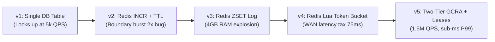

# Deep Explainability Guide: Distributed Rate Limiter & Traffic Shaper

> **Companion Links**:
> - 🧭 Chapter Hub: [`README.md`](README.md)
> - 📐 Architectural Blueprint: [`01-Architectural-Blueprint.md`](01-Architectural-Blueprint.md)
> - 🎙️ Interactive Interview Playbook: [`02-Interactive-Interview-Playbook.md`](02-Interactive-Interview-Playbook.md)
> - 🧪 Production Python Lab: [`rate_limiter_lab.py`](rate_limiter_lab.py)

---

## 1. First-Principles Mental Model & Physical Analogy

To truly master system design, you must understand technologies not as magic black boxes, but through **physical, first-principles mechanical models**. When you strip away the software abstractions, every rate limiter is fundamentally a **flow regulator obeying physical conservation laws**.

```
                           THE CLEPSYDRA (WATER CLOCK) ANALOGY
  Incoming Requests
       │   │   │
       ▼   ▼   ▼ (Drops of Water)
  ┌────────────────────────┐
  │                        │
  │     MEASURING CUP      │  <── Capacity / Burst Tolerance (tau)
  │   (Capacity: L drops)  │
  │                        │
  │~~~~~~~~~~~~~~~~~~~~~~~~│  <── Current Fill Level = (TAT - now)
  └───────────┬────────────┘
              │  Calibrated Orifice (Leak Rate = 1 drop every Emission Interval 'I')
              ▼
       Downstream API
```

### 1.1 The Real-World Analogy: The Ancient Clepsydra (Water Clock)
Imagine an ancient Greek water clock (*clepsydra*). Water drips continuously out of an orifice at the bottom of a container at an exact, unvarying rate: **one drop every $I$ milliseconds** (the *Emission Interval*).
- Above the orifice is a measuring funnel that holds up to $\tau$ milliliters of water (the *Burst Tolerance*).
- Every incoming HTTP request is modeled as a person pouring a standardized drop of water into the funnel.
- If the funnel has room, the drop is accepted, and the water level rises. The water continues to leak out smoothly at rate $1/I$.
- If a sudden flood of 1,000 people arrives at the exact same millisecond, they dump 1,000 drops into the funnel. If the funnel can only hold 100 drops, **the first 100 drops stay in the funnel, and the remaining 900 spill over the rim onto the floor (HTTP 429 Too Many Requests)**.
- **The GCRA Ingenuity**: Rather than measuring how much water is physically in the funnel at any moment, you simply write down on a chalkboard the **exact timestamp when the funnel will run completely dry**. This timestamp is the **Theoretical Arrival Time ($TAT$)**.
  - If a new drop arrives at time $t$, and the funnel won't run dry until $t + 10\text{ seconds}$, you know instantly whether adding another drop will overflow the funnel's maximum height ($\tau$).
  - You require **zero background threads**, **zero timer loops**, and **zero counter increments**. A single 64-bit integer on a chalkboard completely determines whether the request is allowed or dropped!

### 1.2 Why This Mental Model Prevents Design Mistakes
When you ground your intuition in physical fluid dynamics, the critical architectural traps become immediately visible:
1. **The Incompressibility Trap**: You cannot push 500,000 requests per second across a database that can only process 5,000 writes per second, just as you cannot force 100 gallons of water per second through a garden hose without rupturing the pipe. Rate limiting must occur **at the earliest possible perimeter (the edge/gateway)**, not deep inside the application stack.
2. **The Speed-of-Light Trap**: The speed of light in fiber optic cables is approximately $200,000\text{ km/s}$ ($\approx 5\text{ µs per km}$). A round-trip between Frankfurt and Northern Virginia ($6,300\text{ km}$) has a physical lower bound of $\approx 63\text{ ms}$. If an API gateway in Frankfurt synchronously queries a centralized Redis cluster in Virginia on every single incoming request to check a rate limit counter, **you have permanently destroyed your API's latency SLA before your code even executes**.
3. **The Discrete vs. Continuous Trap**: Naive engineers treat rate limiting as discrete calendar minutes (e.g. "100 requests between 12:00:00 and 12:00:59"). Nature does not operate on synchronized calendar boundaries. Real traffic arrives as a continuous Poisson process. Discrete windows inevitably create the "Boundary Burst Disaster," where a client fires 100 requests at 12:00:59 and another 100 requests at 12:01:00, pushing $2\times$ the rated capacity into the backend in a 2-second window.

---

## 2. Technology Showdown Matrix ("Why X and NOT Y?")

In Staff and Principal engineering interviews, you will be aggressively challenged on your technology choices. Stating *"I used Redis because it's fast"* is an immediate L4/L5 signal. A Staff engineer systematically demonstrates why alternative industry standards fail under specific physical constraints.

```
┌──────────────────────────────────────────────────────────────────────────────────────────────────┐
│                                 TECHNOLOGY SHOWDOWN SCORECARD                                    │
├──────────────────────────┬──────────────────────────────┬────────────────────────────────────────┤
│ Technology Candidate     │ Core Strength                │ Fatal Flaw for Rate Limiting Path      │
├──────────────────────────┼──────────────────────────────┼────────────────────────────────────────┤
│ Redis Cluster (Lua GCRA) │ In-memory, atomic single-core│ Cross-region WAN latency tax (75ms)    │
│ Apache Cassandra / Scylla│ Massive write throughput     │ Read-before-write latency & tombstone  │
│ Amazon DynamoDB          │ Fully managed, zero ops      │ WCU cost explosion & HTTP/2 round-trip │
│ Envoy In-Memory Atomics  │ Sub-microsecond (CPU cache)  │ Local only; no global quota visibility │
│ Linux eBPF / XDP Kernel  │ Wire-speed packet drop (NIC) │ No application context (user/tenant ID)│
└──────────────────────────┴──────────────────────────────┴────────────────────────────────────────┘
```

### Detailed Multi-Dimensional Showdown

| Evaluation Dimension | Redis Cluster (Lua GCRA) | Apache Cassandra / ScyllaDB | Local In-Memory (Envoy Atomic) | Amazon DynamoDB | Linux eBPF / XDP (NIC Layer) |
|:---|:---|:---|:---|:---|:---|
| **P99 Read/Write Latency** | $0.4 - 0.8\text{ ms}$ (In-Memory RAM) | $2.5 - 5.0\text{ ms}$ (LSM Memtable/CommitLog) | **$< 0.005\text{ ms}$ (L1/L2 CPU Cache)** | $4.0 - 8.0\text{ ms}$ (HTTPS / SigV4 Tax) | **$< 0.001\text{ ms}$ (Zero Context Switch)** |
| **Atomic Coordination** | Native single-threaded Lua script execution | Lightweight Paxos / LWT ($15 - 30\text{ ms}$) | Atomic CPU registers (`lock cmpxchg`) | Conditional writes (`attribute_exists`) | Kernel per-CPU eBPF maps |
| **Cross-Region WAN Tax** | Prohibitive if centralized ($75\text{ ms}$) | Native Multi-DC async replication | **Zero (Completely isolated to node)** | Global Tables ($1 - 2\text{ s}$ replication lag)| Zero (Per-host kernel) |
| **Memory Footprint** | $\approx 88\text{ bytes}$ per key (GCRA float) | Heavy JVM heap + Bloom filters ($\approx 1\text{ KB}$)| Minimal ($\approx 32\text{ bytes}$ struct)| Offloaded to cloud provider | Fixed ring buffer in kernel memory |
| **Cost at 500k QPS** | $\approx \$300/\text{mo}$ (Tiny 3-node shard) | $\approx \$2,500/\text{mo}$ (Multi-node cluster) | **$\$0$ (Runs within existing proxies)** | **$\approx \$12,960/\text{mo}$ (WCU/RCU costs)**| $\$0$ (Kernel feature) |
| **Granularity / Context** | Full HTTP headers, User ID, API Keys | Full HTTP headers, User ID, API Keys | Full HTTP headers, User ID, API Keys | Full HTTP headers, User ID, API Keys | Layer 3/4 only (IP, Port, TCP flags) |
| **Failure Domain** | Redis primary failover / partition | Read repair latency, eventual consistency| Process crash drops active local lease | Cloud API rate limits / partition | Kernel crash / eBPF verifier limits |
| **ARCHITECTURAL VERDICT** | **TIER 2: Global Quota Ledger** | **REJECTED: Latency too high** | **TIER 1: Local High-Speed Proxy Cache**| **REJECTED: Prohibitive cost & latency**| **TIER 0: Volumetric DDoS Defense**|

### The Staff-Level Technology Defense
- **Why NOT Cassandra/ScyllaDB?** Cassandra excels at append-only write streams, but rate limiting is a **Read-Modify-Write** workload. To do this atomically in Cassandra requires Lightweight Transactions (LWT) built on Paxos, which requires 4 network round-trips between storage replicas. Latency jumps from $2\text{ ms}$ to $25\text{ ms}$, completely blowing past our $1\text{ ms}$ $P_{99}$ latency budget.
- **Why NOT DynamoDB?** Beyond the $4-8\text{ ms}$ HTTPS request overhead, at 500,000 QPS, maintaining provisioned Write Capacity Units (WCUs) with strongly consistent reads would cost over $\$150,000$ per year just for rate limiting metadata.
- **Why NOT Envoy Local Memory Alone?** If you have a cluster of 50 Envoy gateway pods, and a customer has a quota of 100 requests per minute, how do you enforce that quota? If you distribute it naively ($100 / 50 = 2\text{ tokens}$ per pod), a single client whose requests hash to the same pod will be throttled after 2 requests, even though they have 98 tokens left globally.
- **The Winning Synthesis (The Two-Tier Hybrid)**: We deploy **Linux eBPF/XDP at Tier 0** for raw IP volumetric flood defense, **Envoy In-Memory Atomics at Tier 1** for microsecond local token leasing, and **Redis Cluster Lua GCRA at Tier 2** as the authoritative asynchronous global quota ledger.

---

## 3. Mathematical Foundations & Sizing Intuitions

### 3.1 GCRA Theoretical Arrival Time ($TAT$) Derivation
GCRA is defined in ATM Forum specification TM-4.0. It models a virtual leaky bucket with leak rate $\frac{1}{I}$ and bucket depth $\tau$.

$$\text{Limit } L = 100\text{ req}, \quad \text{Window } T = 60\text{ sec}$$
$$\text{Emission Interval } I = \frac{T}{L} = \frac{60\text{ s}}{100} = 0.60\text{ seconds} = 600\text{ ms}$$
$$\text{Burst Tolerance } \tau = T = 60\text{ seconds}$$

#### The State Update Equations:
Let $t$ be the arrival time of the incoming request. Let $TAT$ be the stored Theoretical Arrival Time for that key.

$$\text{Baseline: } TAT_{\text{base}} = \max(t, TAT)$$
$$\text{Projected Next Arrival: } TAT_{\text{new}} = TAT_{\text{base}} + I$$
$$\text{Earliest Permissible Arrival: } t_{\text{earliest}} = TAT_{\text{new}} - \tau$$

$$\text{Decision Rule: }
\begin{cases}
\text{ALLOW}, & \text{if } t \ge t_{\text{earliest}} \implies \text{Set } TAT \leftarrow TAT_{\text{new}} \\
\text{THROTTLE}, & \text{if } t < t_{\text{earliest}} \implies \text{Reject, do NOT modify } TAT
\end{cases}$$

$$\text{Accurate Retry-After: } \text{Retry-After} = t_{\text{earliest}} - t = (TAT_{\text{new}} - \tau) - t$$

#### Step-by-Step Numerical Walkthrough
Suppose key `user:101` starts with no prior history ($TAT = 0$). Current time $t = 100.0\text{ s}$.

| Request # | Arrival Time $t$ | $TAT_{\text{base}} = \max(t, TAT)$ | $TAT_{\text{new}} = TAT_{\text{base}} + 0.6$ | Throttle Threshold ($TAT_{\text{new}} - 60$) | $t \ge \text{Threshold}?$ | Decision | New $TAT$ Stored | Burst Capacity Left |
|:---:|:---:|:---:|:---:|:---:|:---:|:---:|:---:|:---:|
| **Req 1** | $100.00\text{ s}$ | $\max(100.0, 0) = 100.0$ | $100.60\text{ s}$ | $40.60\text{ s}$ | $100.0 \ge 40.6$ (Yes) | **ALLOW** | $100.60\text{ s}$ | 99 tokens |
| **Req 2** | $100.01\text{ s}$ | $\max(100.01, 100.6) = 100.6$| $101.20\text{ s}$ | $41.20\text{ s}$ | $100.01 \ge 41.2$ (Yes) | **ALLOW** | $101.20\text{ s}$ | 98 tokens |
| **Req 100**| $100.50\text{ s}$ | $159.40$ | $160.00\text{ s}$ | $100.00\text{ s}$ | $100.50 \ge 100.0$ (Yes) | **ALLOW** | $160.00\text{ s}$ | 0 tokens (Full) |
| **Req 101**| $100.51\text{ s}$ | $\max(100.51, 160.0) = 160.0$| $160.60\text{ s}$ | $100.60\text{ s}$ | $100.51 < 100.60$ **(NO!)**| **THROTTLE**| $160.00\text{ s}$ (Unchanged)| 0 tokens |

Notice what happened on **Req 101**:
- The threshold was $100.60\text{ s}$. The request arrived at $100.51\text{ s}$ ($0.09\text{ seconds}$ too early).
- The rate limiter calculated exact `Retry-After: 0.09s` ($90\text{ ms}$).
- **Crucial Invariant**: The failed request did **NOT** increment $TAT$. If failed requests incremented $TAT$, a throttled client that continues to spam requests would push $TAT$ into the year 2030, permanently locking themselves out forever!

---

### 3.2 Sizing & Throughput Math (500,000 QPS)

```
Global Peak Ingress: 500,000 QPS
Active Identities (Keys): 10,000,000 concurrent users / tenants
P99 Latency Budget: <= 1.0 ms
Target Redis Cluster Capacity: <= 5% CPU utilization
```

#### Memory Sizing per Redis Key
In Redis, every key-value entry consists of:
- `dictEntry` overhead: $24\text{ bytes}$ (key pointer, value pointer, next hash bucket pointer)
- Key `sds` string: `rl:usr:98765432:route:order` $\approx 32\text{ bytes}$
- `robj` object header: $16\text{ bytes}$
- Float64 value stored as raw string or binary float: $8\text{ bytes}$
- Total raw memory per key: $24 + 32 + 16 + 8 = 80\text{ bytes}$.
- Accounting for jemalloc 96-byte bin rounding and 20% Redis internal hash table expansion padding:
  $$\text{Memory per Key} \approx 112\text{ bytes}$$
  $$\text{Total Cluster RAM} = 10,000,000\text{ keys} \times 112\text{ bytes} \approx 1.12\text{ GB}$$
- *Conclusion*: Memory is completely negligible. A 3-node Redis cluster with 4 GB RAM per node provides a $3\times$ safety margin.

#### The Network & Redis Command Reduction Factor
If every request made a direct Redis call:
$$\text{Redis Operations} = 500,000\text{ commands/second}$$
A single Redis primary shard saturates at $\approx 80,000 - 100,000\text{ QPS}$ on modern cloud vCPUs. Handling 500k QPS requires a minimum of 6-8 primary shards, and all 500,000 requests incur network serialization and TCP socket syscalls.

By introducing **Two-Tier Local Batch Leasing** with lease quantum $B = 50\text{ tokens}$:
$$\text{Redis Global QPS} = \frac{500,000\text{ req/sec}}{50\text{ batch}} = 10,000\text{ QPS}$$
- Redis load drops by **$98\%$**!
- A single 3-node Redis cluster operates at $< 10\%$ CPU utilization.
- $490,000\text{ requests/sec}$ are validated in $< 5\text{ µs}$ directly within Envoy worker CPU L1/L2 cache.

---

## 4. The Evolutionary Journey: From Naive to Hyperscale ("Zero-to-Hero")

Great system designers do not dump a finished architecture onto the whiteboard; they demonstrate why simpler architectures break under scale.



### v1: The Naive Database Table (Fails at 5,000 QPS)
- **Design**: Every request runs SQL:
  ```sql
  INSERT INTO request_log (user_id, created_at) VALUES (101, NOW());
  SELECT COUNT(*) FROM request_log WHERE user_id = 101 AND created_at > NOW() - INTERVAL 1 MINUTE;
  ```
- **Where it breaks**:
  - Writing 50,000 rows/sec destroys database IOPS.
  - Table locking and deadlocks on `request_log` indices cause connection pools to saturate.
  - Disk space balloons by 200 GB/day without an aggressive, lock-inducing purge daemon.

### v2: Redis `INCR` + `EXPIRE` (Fails at Window Boundaries)
- **Design**: Store key `user:101:window_1201` and call `INCR`. If key is new, call `EXPIRE 60`.
- **Where it breaks**:
  1. **Race Condition**: If the application crashes or network fails between `INCR` and `EXPIRE`, the key has no TTL and persists indefinitely, permanently blocking the user.
  2. **Boundary Burst Doubling**: A user with a limit of 100 req/min sends 100 requests at 12:00:59 and another 100 requests at 12:01:00. Both windows register 100 requests, but the backend receives **200 requests within 2 seconds**, crashing downstream microservices.

### v3: Redis Sorted Set (`ZSET`) Sliding Window Log (Fails on Memory & CPU)
- **Design**: Store each request timestamp as both score and member in a Redis Sorted Set:
  ```redis
  ZADD rl:user:101 1710412800 1710412800
  ZREMRANGEBYSCORE rl:user:101 -inf (1710412800 - 60)
  ZCARD rl:user:101
  ```
- **Where it breaks**:
  - Memory: Each timestamp in a ZSET node consumes $\approx 40\text{ bytes}$ (skiplist node pointer + dict entry). For 10M users sending 100 req/min, Redis memory explodes to:
    $$10,000,000 \times 100 \times 40\text{ bytes} \approx 40\text{ GB of RAM!}$$
  - CPU: Running `ZREMRANGEBYSCORE` and `ZCARD` at 500k QPS consumes massive single-threaded Redis CPU, causing latency to spike from $0.5\text{ ms}$ to $80\text{ ms}$.

### v4: Centralized Redis Lua Token Bucket (Fails on Cross-Region Latency)
- **Design**: Atomic Lua script tracks `(last_updated, tokens)`.
- **Where it breaks**:
  - Works great in a single datacenter.
  - Fails catastrophically in multi-region deployments. An API Gateway in Frankfurt must pay $75\text{ ms}$ of speed-of-light fiber latency to query a Redis master in Oregon. The API response time degrades by an order of magnitude.

### v5: Hyperscale Two-Tier Hierarchical GCRA (The Production Standard)
- **Architecture**:
  - **Tier 1 (In-Process)**: Envoy proxy threads hold a local atomic token lease (e.g. 50 tokens). Incoming requests consume from local CPU registers in $1\text{ microsecond}$ without touching the network.
  - **Tier 2 (Global Quota)**: When local lease drops below 10 tokens, an asynchronous non-blocking worker thread requests another batch of 50 tokens from the regional Redis Cluster using GCRA Lua.
  - **Result**: $98\%$ of requests never leave the host. $P_{99}$ latency stays $< 0.1\text{ ms}$. Network partitions degrade gracefully into local token enforcement.

---

## 5. Micro-Mechanics & Kernel / Hardware Internals

At the Staff/Principal level, you must understand the interaction between your code, the operating system kernel, and the underlying CPU architecture.

```
┌────────────────────────────────────────────────────────────────────────────────────────┐
│                                CPU CACHE LINE PADDING                                  │
├──────────────────────────────────────────┬─────────────────────────────────────────────┤
│ Core 0 modifies Counter A                │ Core 1 modifies Counter B                   │
│ [ 0x00: Counter A | 0x08: Counter B ]    │ [ 0x00: Counter A | 0x08: Counter B ]       │
│ └────────────┬─────────────────────────┘ │ └────────────────────────────┬────────────┘ │
│              │ Invalidation Bus Signal   │                              │              │
│              └──────────────────────────►│ CACHE LINE INVALIDATED!     │              │
│                                          │ (Forces expensive L3/RAM bus lock)          │
├──────────────────────────────────────────┴─────────────────────────────────────────────┤
│ SOLUTION: 64-Byte Cache Line Padding (__attribute__((aligned(64))))                    │
│ [ Core 0: Counter A | 56 bytes padding ] [ Core 1: Counter B | 56 bytes padding ]      │
└────────────────────────────────────────────────────────────────────────────────────────┘
```

### 5.1 CPU Cache Line False Sharing
When building high-throughput in-memory rate limiters in C++ (Envoy) or Go:
- Modern x86-64 and ARM64 CPUs fetch memory in **64-byte cache lines**.
- If Worker Thread 0 on Core 0 increments `counter_user_A` (8 bytes) and Worker Thread 1 on Core 1 increments `counter_user_B` (8 bytes), and both counters reside in the same 64-byte memory chunk:
  - Whenever Core 0 writes to its counter, the **MESI cache coherency protocol** marks the entire 64-byte cache line as `INVALID` in Core 1's L1 cache.
  - Core 1 is forced to stall its execution pipeline and reload the cache line from L3 cache or RAM, causing severe throughput degradation known as **False Sharing**.
- **Fix**: In-memory token counters must be padded to 64 bytes:
  ```c
  struct alignas(64) PaddedRateLimitCounter {
      std::atomic<int64_t> tokens;
      char padding[56]; // Ensures no two counters share the same L1 cache line
  };
  ```

### 5.2 jemalloc Bin Allocation & Redis Memory Fragmentation
Redis relies on `jemalloc` for memory allocation.
- `jemalloc` allocates memory in discrete size classes: `[8, 16, 32, 48, 64, 80, 96, 112, 128, 160, 192, 224, 256, ...]`.
- If your rate limiter data structure is 84 bytes, `jemalloc` rounds up and allocates a 96-byte bin (wasting 12 bytes of internal fragmentation).
- If your key contains 33 bytes, it jumps from the 32-byte bin to the 48-byte bin.
- **Optimization**: By formatting Redis rate limit keys with compact, fixed-width binary strings (e.g. `rl:<16-byte-uuid>:<2-byte-route-id>`), you avoid bin boundary crossings, saving gigabytes of cluster memory across 100M keys.

### 5.3 Linux Kernel Socket Mechanics (C100K at Edge Gateway)
Handling 500,000 QPS requires tuning the Linux TCP stack to prevent dropped SYN packets:
```bash
# 1. Expand OS listen queue backlog to prevent SYN drops during traffic spikes
sysctl -w net.core.somaxconn=65535

# 2. Enable TCP TW recycling for outbound reverse-proxy connections to Redis/Backends
sysctl -w net.ipv4.tcp_tw_reuse=1

# 3. Expand ephemeral port range to prevent source-port exhaustion (EADDRNOTAVAIL)
sysctl -w net.ipv4.ip_local_port_range="1024 65535"

# 4. Enable SO_REUSEPORT in Envoy/Nginx config
# Allows all worker threads to bind to the identical port (443).
# The Linux kernel distributes incoming SYN packets across thread sockets with ZERO lock contention.
```

---

## 6. Production Incident Runbook & Chaos Scenarios

### 6.1 The 03:00 AM P1 Outage: "Redis Cluster Primary Split-Brain & Thundering Herd"

#### The Trigger
At 03:14 AM UTC, an AWS network switch in `us-east-1a` fails. Redis Shard 3 loses connectivity to its replicas. Envoy proxies begin throwing connection timeouts to Redis. Upstream database CPU spikes from 42% to 99%.

```
[ PagerDuty Alert: CRITICAL ] 
- Service: API Gateway RateLimiter
- Metric: Redis_Connection_Timeout_Rate > 15%
- Impact: Downstream Orders Database Latency P99 > 3,500ms (SLA Breach)
```

#### Step-by-Step Triage & Mitigation Sequence

##### Step 1: Diagnose Root Cause via CLI (Within 2 Minutes)
The on-call engineer connects to an Envoy gateway pod and checks Redis connectivity:
```bash
# Check instantaneous latency to Redis Cluster
redis-cli -h redis-cluster.internal -p 6379 --latency-history -i 1

# Check circuit breaker status on Envoy admin port
curl -s http://localhost:9901/stats | grep "ratelimit.redis_cluster"
# Output indicates:
# ratelimit.redis_cluster.cx_connect_fail: 14209
# ratelimit.redis_cluster.circuit_breakers.open: 1
```

##### Step 2: Activate Global Emergency Fail-Safe (Within 4 Minutes)
Because the circuit breaker is open, unhandled requests could overwhelm the database. The engineer activates the **Dynamic Traffic Shedding Policy** via the control plane:
```bash
# Push dynamic control-plane override to all Envoy pods
curl -X POST https://control-plane.internal/v1/ratelimit/override \
  -H "Authorization: Bearer $ONCALL_SECRET" \
  -d '{
    "emergency_mode": true,
    "unauthenticated_tier_multiplier": 0.0,
    "free_tier_multiplier": 0.2,
    "enterprise_tier_multiplier": 1.0,
    "fail_open_routes": ["/v1/search", "/v1/catalog"],
    "fail_closed_routes": ["/v1/checkout", "/v1/auth"]
  }'
```

##### Step 3: Verify Downstream Database Recovery (Within 6 Minutes)
Execute PromQL query in Grafana:
```promql
# Rate of dropped requests classified by shedding reason
sum(rate(gateway_requests_dropped_total[1m])) by (reason, tier)

# Database connection pool saturation
db_connection_pool_active / db_connection_pool_max
```
- Validate that anonymous scraper traffic is dropped at the edge (100% rejection).
- Free tier is restricted to 20% capacity.
- Database CPU drops back to 55%.
- Once Redis replica promotes to primary and cluster state turns `OK`, circuit breaker resets automatically.

---

## 7. Interactive Socratic Pauses & Self-Quiz

Test your architectural intuition before walking into your interview:

> 🧠 **Pause & Ponder #1**: *If an attacker knows you use GCRA with an emission interval of $600\text{ ms}$, how can they craft an attack that keeps your rate limiter continuously throttling legitimate users while sending the absolute minimum number of requests?*
> 
> <details>
> <summary><b>Click for Staff-Level Solution</b></summary>
> 
> An attacker who sends a single burst equal to $\tau$ pushes $TAT$ to $now + \tau$. From that point forward, the attacker only needs to fire **exactly one request every $600\text{ ms}$**. Each request resets $TAT$ to the absolute maximum tolerance threshold ($TAT = now + \tau$). Because the bucket never leaks below the threshold, any legitimate user sharing that quota key (e.g. an office behind a NAT IP or a shared corporate API key) will be **100% throttled in perpetuity**, while the attacker only spends $1.66\text{ QPS}$!
> 
> **Defense**: Rate limit on multi-dimensional composite keys (`client_ip:api_key:user_id`), and enforce per-IP concurrency caps before composite quota evaluation.
> </details>

---

> 🧠 **Pause & Ponder #2**: *Why does returning `Retry-After: 5` without server-side jitter guarantee a catastrophic self-inflicted Denial of Service attack against your own systems?*
> 
> <details>
> <summary><b>Click for Staff-Level Solution</b></summary>
> 
> If a backend slowdown causes 10,000 clients to receive HTTP 429 with a static `Retry-After: 5` header within the same 1-second window, all 10,000 client SDKs will sleep for exactly 5.000 seconds and then fire their retry at the exact same millisecond. This creates an artificial **Thundering Herd / Micro-Burst** of 10,000 QPS that instantly re-saturates the recovering backend.
> 
> **Defense**: The rate limiter must calculate and inject **Full Jitter** directly into the response header:
> $$\text{Retry-After} = \Delta t_{\text{actual}} + \text{Uniform}(-0.2 \cdot \Delta t, +0.2 \cdot \Delta t)$$
> Client SDKs must implement exponential backoff with full decorrelated jitter.
> </details>

---

## 8. Summary Checklist for Staff/Principal Interviews

When presenting Chapter 1 in an interview, ensure you hit these 6 non-negotiable points:
- [ ] Explicitly clarify whether the rate limiter is Edge (DDoS), API Gateway (Quotas), or Service Mesh (Resilience).
- [ ] Write down the math proving why centralized Redis round-trips destroy cross-region latency budgets.
- [ ] Propose the **Two-Tier Architecture**: Envoy in-process atomic token leases + Redis Cluster Lua GCRA.
- [ ] Write out the GCRA state equations showing how $TAT$ eliminates background refill cron jobs.
- [ ] Detail the Fail-Open (Browsing) vs. Fail-Closed (Financial/Auth) circuit breaker matrix.
- [ ] Discuss micro-architectural CPU cache line false sharing and Linux `SO_REUSEPORT` kernel socket tuning.
