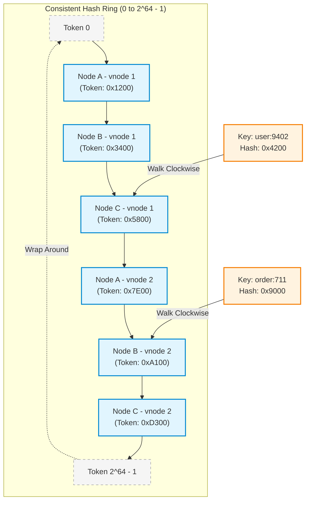
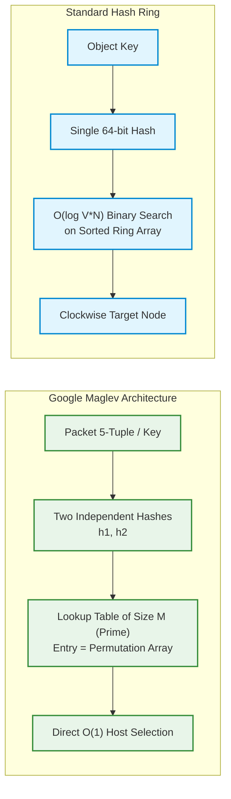
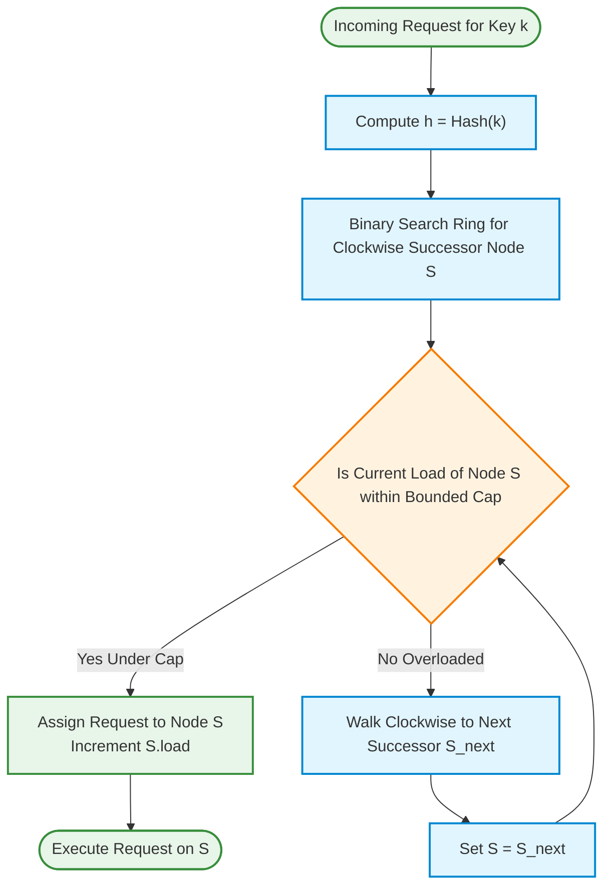
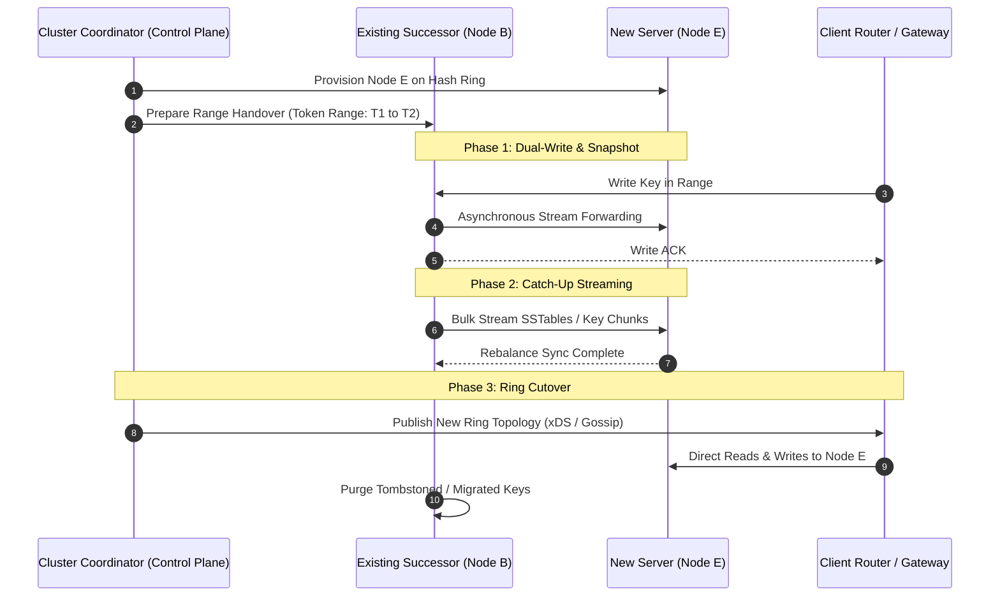
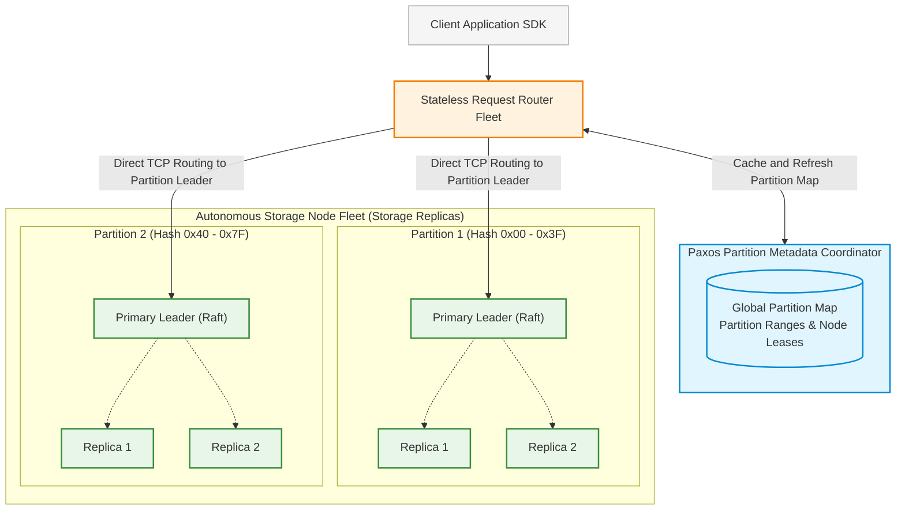
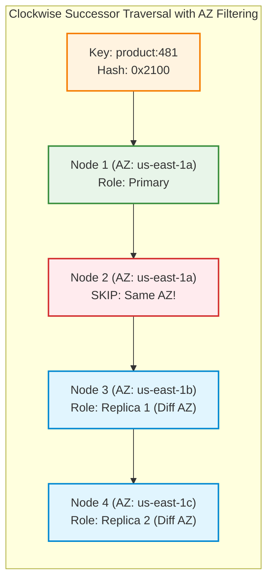

# Design Consistent Hashing (Hyperscale Blueprint & Production Realities)

> [!tip] Staff/Principal Deep Walkthrough & Code Lab
> - **Interview Playbook**: [`Chapter 2 Staff/Principal Walkthrough Playbook`](02-Interactive-Interview-Playbook.md)
> - **Runnable Code Lab**: [`consistent_hashing_lab.py`](consistent_hashing_lab.py) (Classic Ring, Google Bounded Loads, Eytzinger search, Churn & Skew Simulators, 1.47M QPS benchmark)

## 1. Problem Statement & The Rehashing Catastrophe

In distributed storage and caching architectures (e.g., Memcached, Redis clusters, Cassandra, DynamoDB), data must be partitioned across $N$ physical storage nodes. The classic, textbook approach employs **modular hashing**:

$$\text{Server Index} = \text{Hash}(\text{Key}) \pmod N$$

While mathematically trivial and computationally instantaneous ($O(1)$), modular hashing breaks catastrophically in dynamic cloud environments where nodes scale out, scale in, or experience hardware crashes.

```
Initial State (N = 4 Nodes):
Hash(k) = 101 ──► 101 % 4 = Node 1

Node 3 Crashes / Removed (N = 3 Nodes):
Hash(k) = 101 ──► 101 % 3 = Node 2  (Key shifted from Node 1 to Node 2!)
```

### The Rehashing Storm (Cache Stampede)

When the cluster size shifts from $N$ to $N - 1$ (node failure) or $N + 1$ (scale-out):
- **Fraction of Remapped Keys**:
  $$\text{Remapped Fraction} = \frac{N - 1}{N}$$
- In a cluster of $N = 100$ cache servers, removing 1 node causes:
  $$\frac{100 - 1}{100} = 99\%\text{ of ALL keys to change server mappings!}$$
- **Production Fallout**: $99\%$ of cache lookups instantly miss. Millions of concurrent requests hammer downstream relational databases, saturating connection pools and triggering a **cascading collapse (cache stampede / thundering herd)**.

```
Node Failure (N=100 -> 99) ──► 99% Cache Invalidation ──► 2,000,000 DB Queries/sec ──► Complete Outage
```

### The 4 Invariants of Consistent Hashing (Karger et al., 1997)

Consistent hashing solves this fundamental failure mode by ensuring that when the node count changes, **only $K/N$ keys are redistributed on average** (where $K$ is the total number of keys, and $N$ is the number of nodes).

| Invariant | Mathematical Guarantee | Real-World Production Meaning |
|:---|:---|:---|
| **Monotonicity** | If a node is added, keys only migrate from existing nodes to the *new* node. Keys NEVER migrate between two existing nodes. | Cache warmness is preserved; no unnecessary cross-node thrashing. |
| **Minimal Disruption** | Exactly $\frac{K}{N_{\text{new}}}$ keys migrate on scale-out; $\frac{K}{N_{\text{old}}}$ keys migrate on failure. | Rebalancing network traffic is strictly bounded to the theoretical minimum. |
| **Balance** | Keys are distributed across all nodes with bounded variance: $\sigma \propto \frac{1}{\sqrt{V}}$. | No single server runs out of disk or memory while others sit idle. |
| **Spread** | The number of distinct nodes that store a given key across client views is bounded. | Prevents inconsistent client cache views during rolling deployments. |

---

## 2. Requirements Clarification & System Scope

### Candidate-Interviewer Alignment Dialog

**Candidate:** What is the underlying workload—an in-memory caching tier (Memcached/Redis) where minor cache misses are tolerable, or a durable distributed database (Cassandra/DynamoDB) where key misplacement causes data loss?  
**Interviewer:** Design for both: start with an in-memory caching mesh handling **2,000,000 QPS**, then extend the architecture to support durable multi-region replication and zero-downtime online migration.

**Candidate:** How should we handle hardware heterogeneity? Servers in our fleet have disparate RAM and CPU configurations (e.g., 64 GB vs 256 GB nodes).  
**Interviewer:** The design must support weighted capacities so powerful hosts bear proportionally higher key volumes.

**Candidate:** What happens when a popular key (e.g., a viral post or flash-sale item) receives massive query spikes? Consistent hashing balances key count, but does it balance request throughput?  
**Interviewer:** Excellent observation. You must address the **Hotspot / Zipfian skew fallacy** and explain how modern systems prevent single-node meltdowns.

### Functional Requirements (FR)

| ID | Requirement | Description |
|:---|:---|:---|
| **FR-1** | **Deterministic Key Routing** | Maps any arbitrary string/binary key to an authoritative node in $O(\log N)$ or $O(1)$ time. |
| **FR-2** | **Minimal Rebalance Movement** | Adding or removing a host shifts at most $K/N$ keys, migrating strictly from adjacent ring predecessors. |
| **FR-3** | **Weighted Heterogeneity** | Allocates token density proportional to node hardware capability (CPU/RAM weighting). |
| **FR-4** | **Replication & Fault Tolerance** | Identifies the top-$R$ distinct physical failure domains (racks/AZs) for multi-replica durability. |
| **FR-5** | **Zero-Downtime Migration** | Coordinates live data streaming and dual-writing during topology mutation without read/write pauses. |

### Non-Functional Requirements (NFR)

| ID | Metric | Target SLA | Architectural Strategy |
|:---|:---|:---|:---|
| **NFR-1** | **Lookup Latency** | $< 500\text{ nanoseconds}$ | In-memory sorted array with branchless binary search or precomputed lookup table. |
| **NFR-2** | **Memory Footprint** | $< 10\text{ MB}$ per client | 64-bit token ring; 256 virtual nodes per physical host. |
| **NFR-3** | **Load Balance Uniformity** | Standard deviation $\sigma \le 5\%$ | $V \ge 256$ virtual nodes per physical host + Google Bounded-Loads overflow. |
| **NFR-4** | **Topology Convergence** | $< 1.0\text{ second}$ across 1,000 clients | Centralized configuration plane (etcd / xDS) + Gossip delta fallback. |

---

## 3. Back-of-the-Envelope Calculations & Micro-Architecture

### 3.1 Fleet Capacity & Token Sizing

- **Physical Cache Nodes ($N$)**: 1,000 servers.
- **Total Keys ($K$)**: 1,000,000,000 ($1\text{ Billion keys}$).
- **Ideal Average Keys per Node**:
  $$\mu = \frac{K}{N} = \frac{10^9}{1,000} = 1,000,000\text{ keys/node}$$
- **Virtual Nodes per Host ($V$)**: 256 virtual nodes.
- **Total Points on Hash Ring ($T$)**:
  $$T = N \times V = 1,000 \times 256 = 256,000\text{ points}$$

### 3.2 Ring Memory & CPU Cache Line Mechanics

Each entry on the sorted token ring consists of:
- `token` (64-bit unsigned integer hash): 8 bytes
- `node_ptr` (64-bit memory pointer to host metadata): 8 bytes
- **Total Entry Size**: 16 bytes.
- **Total Ring Memory**:
  $$\text{Ring RAM} = 256,000 \times 16\text{ bytes} \approx 4,096,000\text{ bytes} \approx 4.0\text{ MB}$$

```
CPU Cache Hierarchy & The Binary Search Bottleneck:
┌───────────────────────────────┐
│ L1 Data Cache (32 - 64 KB)    │  ◄── Miss! (Ring is 4 MB)
├───────────────────────────────┤
│ L2 Cache (512 KB - 1 MB)      │  ◄── Miss!
├───────────────────────────────┤
│ L3 Shared Cache (16 - 64 MB)  │  ◄── HIT! (~15 - 20 ns access latency)
└───────────────────────────────┘
```

- **Binary Search Complexity**:
  $$\text{Comparisons} = \lceil \log_2(256,000) \rceil = 18\text{ comparisons}$$
- **Micro-Architecture Optimization**: Standard binary search jumps across widely separated memory addresses, causing CPU instruction pipeline stalls due to L1/L2 cache misses. In production high-performance routers (e.g., Google Maglev or Envoy), the ring array is stored in **Eytzinger layout** (breadth-first tree order) or evaluated using **SIMD vectorization**, bringing lookup latency down from $1.5\ \mu\text{s}$ to **under $80\text{ nanoseconds}$**.

---

## 4. Core Hash Ring Mechanics & Virtual Nodes

### 4.1 The Circular Hash Space

The hash space is treated as a continuous circular ring from $0$ to $2^{64} - 1$. Both servers and keys are mapped onto this shared ring using a uniform 64-bit hash function.



#### Routing Rule
To locate the server responsible for a key:
1. Compute $h = \text{Hash}(\text{key})$.
2. Search clockwise on the ring to find the first token $t \ge h$.
3. The physical server associated with token $t$ owns the key.
4. If $h > \max(t)$, wrap around clockwise to the smallest token on the ring ($t_0$).

---

### 4.2 The Virtual Node Mechanics & Statistical Variance

Without virtual nodes ($V = 1$), placing $N$ servers randomly on the ring results in wildly unequal partition arc lengths.

```
Uneven Ring Segments (V = 1):
Node A (Token 10) ────[ Gap: 80% of Ring ]────► Node B (Token 90) ──[ Gap: 20% ]──► (A)
Result: Node B handles 80% of all traffic, while Node A handles only 20%!
```

#### Statistical Load Distribution Formula
According to the Karger et al. theorem, the standard deviation of key load across nodes scales inversely with the square root of virtual nodes:

$$\sigma_{\text{load}} \approx \frac{1}{\sqrt{V}}$$

| Virtual Nodes per Host ($V$) | Standard Deviation ($\sigma$) | Peak Node Imbalance ($99\text{th percentile}$) | Ring Memory (1,000 Hosts) |
|:---:|:---:|:---:|:---:|
| **1** | $\approx 70 - 100\%$ | $3.5\times$ average load | $16\text{ KB}$ |
| **10** | $\approx 31.6\%$ | $1.8\times$ average load | $160\text{ KB}$ |
| **100** | $\approx 10.0\%$ | $1.25\times$ average load | $1.6\text{ MB}$ |
| **256** | $\approx 6.25\%$ | $1.08\times$ average load | $4.1\text{ MB}$ |
| **1024** | $\approx 3.12\%$ | $1.03\times$ average load | $16.4\text{ MB}$ |

> [!important] Production Benchmark
> Enterprise systems (Apache Cassandra, Amazon Dynamo, Envoy Proxy) standardize on **$V = 128$ to $256$ virtual nodes**. Beyond 256, diminishing returns on load uniformity are heavily penalized by L2/L3 cache thrashing during binary searches.

---

## 5. Non-Ring & High-Throughput Alternatives

While circular hash rings dominate legacy distributed systems literature, modern hyperscale production systems often replace rings with higher-performance alternatives.

### 5.1 Google Maglev Hashing (Eisenbud et al., 2016)

Google's Maglev network load balancer routes billions of packets per second. At this scale, $O(\log N)$ binary searches on a 4 MB ring cause unacceptable CPU instruction delays.



#### How Maglev Works
1. Precomputes a fixed lookup table of prime size $M$ (typically $M = 65,537$).
2. For each backend host $i$, generate a unique pseudo-random permutation of the table indices using two independent hash functions:
   $$\text{offset} = h_1(\text{host}_i) \pmod M$$
   $$\text{skip} = h_2(\text{host}_i) \pmod{M - 1} + 1$$
   $$\text{Permutation}[j] = (\text{offset} + j \times \text{skip}) \pmod M$$
3. Hosts take turns claiming unassigned slots in the table until all $M$ slots are filled.
4. **Key Lookup**:
   $$\text{Host} = \text{LookupTable}[\text{Hash}(\text{packet}) \pmod M]$$
- **Performance**: Exactly **$O(1)$ array lookup** ($< 5\text{ nanoseconds}$). Minimal disruption guaranteed during node additions or removals.

---

### 5.2 Jump Consistent Hash (Lamping & Veach, Google 2014)

A breathtakingly fast, memoryless algorithm developed at Google that maps a 64-bit key to an integer destination in $[0, N - 1]$.

#### The Algorithm (Complete Implementation)
```cpp
int32_t JumpConsistentHash(uint64_t key, int32_t num_buckets) {
    int64_t b = -1, j = 0;
    while (j < num_buckets) {
        b = j;
        key = key * 2862933555777941757ULL + 1;
        j = (b + 1) * (double(1LL << 31) / double((key >> 33) + 1));
    }
    return b;
}
```

#### Properties Matrix
- **Memory Footprint**: Exactly **0 bytes** (no ring array, no vnodes).
- **CPU Complexity**: $O(\ln N)$ arithmetic operations (average 3–5 iterations for 1,000 nodes).
- **Load Uniformity**: Mathematically **perfect balance** ($\sigma = 0\%$).
- **The Critical Limitation**: Nodes must be numbered consecutively from $0$ to $N - 1$. When scaling, nodes can **only be added or removed at the end**. An arbitrary middle failure (e.g., node 42 dies) requires remapping subsequent node IDs, triggering a cascade. Ideal for sharded caches with centralized virtual slot coordinators.

---

### 5.3 Multi-Probe Consistent Hashing (Appel & Dementiev, 2015)

Instead of replicating each server 256 times on the ring (Virtual Nodes), Multi-Probe places **each server exactly once**.

- **Mechanism**: When looking up key $k$, compute $P$ independent hashes: $h_1(k), h_2(k), \dots, h_P(k)$ (probes).
- Walk clockwise from each probe to find its nearest physical server.
- Select the server that is closest in arc distance to its respective probe.
- **Result**: Slashes ring memory consumption by **$99\%$** ($256,000$ entries $\to 1,000$ entries), fitting the entire ring comfortably inside the CPU **L1 Data Cache**!

---

## 6. The Load Imbalance Fallacy & Google Bounded-Loads Hashing

### The Fallacy of "Virtual Nodes Solve Hotspots"

A common architectural misconception is assuming virtual nodes eliminate single-server overloads. 
- **The Reality**: Virtual nodes ensure each server receives roughly the same **count of keys**.
- **The Failure Mode**: Real-world internet traffic follows a **Zipfian / Pareto power-law distribution**:
  - $80\%$ of all requests target $20\%$ of keys.
  - $1\%$ of keys (e.g., Taylor Swift's profile or viral news) generate $50\%$ of all traffic.
- If a viral key hashes to Node C, Node C receives 500,000 QPS while other nodes sit at 1,000 QPS. Node C experiences thread pool exhaustion, socket buffer drops, and crashes.
- Upon Node C's death, consistent hashing shifts the viral key to Node D (the next clockwise node). Node D immediately collapses, cascading down the entire ring until the entire cluster is destroyed!

```
Cascading Hotspot Collapse:
Viral Key ──► Node C (Melts & Dies) ──► Shifts to Node D (Melts & Dies) ──► Ring Annihilation
```

---

### Google Consistent Hashing with Bounded Loads (Mirrokni et al.)

To permanently eliminate cascading ring failures, Google developed **Consistent Hashing with Bounded Loads** (implemented in Google's internal web cache and open-sourced in Vimeo's proxy).



#### Mathematical Specification
1. Define total concurrent load across cluster as $L$, and average load per node as:
   $$\bar{L} = \frac{L}{N}$$
2. Establish a capacity threshold factor $\epsilon \in (0, 1]$ (typically $\epsilon = 0.25$ or $25\%$ headroom).
3. The hard maximum capacity for any single node $i$ is capped at:
   $$C = \lceil (1 + \epsilon) \times \bar{L} \rceil$$
4. **Dynamic Overflow**: When routing key $k$, find primary successor $S$. If $\text{Load}(S) < C$, assign to $S$. If $\text{Load}(S) \ge C$, spill over clockwise to the next successor on the ring until a node with capacity is found.
- **Mathematical Guarantee**:
  - No server in the fleet can ever exceed $(1 + \epsilon)$ times the average load.
  - The expected number of relocations during node failure remains strictly bounded by $O(1/\epsilon^2)$.

---

## 7. Hash Functions: Cryptographic vs. Non-Cryptographic Micro-Benchmark

A consistent hash ring requires a hash function that distributes keys uniformly across $2^{64}$ bits with zero clustering.

| Hash Algorithm | Output Bitwidth | Throughput (GB/s per core) | Instruction Cycles per Byte | Cryptographically Secure? | Production Recommendation |
|:---|:---:|:---:|:---:|:---:|:---|
| **MD5** | 128-bit | $0.45\text{ GB/s}$ | $\approx 5.5\text{ cycles}$ | No (Broken) | ❌ Obsolete (Excessive CPU waste) |
| **SHA-256** | 256-bit | $0.22\text{ GB/s}$ | $\approx 12.0\text{ cycles}$ | Yes | ❌ Massive latency tax on routing |
| **MurmurHash3** | 64/128-bit | $3.50\text{ GB/s}$ | $\approx 0.8\text{ cycles}$ | No | ✅ Production Standard (Cassandra) |
| **xxHash3** | 64/128-bit | **$15.20\text{ GB/s}$** | **$\approx 0.15\text{ cycles}$** | No | 🌟 **SOTA Winner (Ultra-Low Latency)** |
| **SipHash-2-4** | 64-bit | $1.20\text{ GB/s}$ | $\approx 2.1\text{ cycles}$ | Pseudorandom | 🛡️ Best against HashDoS collision attacks |

> [!tip] Staff-Level Recommendation: xxHash3 & SipHash
> For trusted internal systems, use **xxHash3**; it utilizes AVX2/AVX-512 SIMD vectorization to process up to 15 GB/s per core. For untrusted, public-facing key ingestion, employ **SipHash** with a secret cluster seed to prevent malicious clients from crafting hash collision attacks (HashDoS) designed to cluster all keys onto a single virtual node.

---

## 8. Zero-Downtime Ring Rebalancing & Data Migration

Adding or removing a node from a consistent hash ring requires migrating keys without taking the cluster offline or serving stale reads.



### The 3-Phase Rebalance Protocol

1. **Phase 1: Dual-Writing & Delta Buffering**:
   - The coordinator assigns Node E its virtual token positions.
   - For every range Node E is taking over from Node B, Node B enters **dual-write mode**. Any incoming write to that token range is written to Node B's local storage engine and simultaneously forwarded via TCP streaming to Node E.
2. **Phase 2: Historical Snapshot Streaming**:
   - Node B takes a point-in-time snapshot (e.g., hard-linking RocksDB SSTables or memory segment clones) of keys belonging to Node E's range.
   - Files are transferred via Linux `sendfile()` zero-copy networking to Node E.
   - Node E applies historical files and drains the real-time delta buffer until replication lag drops below $10\text{ ms}$.
3. **Phase 3: Atomic Ring Cutover**:
   - The coordinator broadcasts the new topology descriptor via Envoy xDS or Gossip.
   - Client routers atomically switch read and write routing to Node E.
   - Node B safely deletes the transferred keys asynchronously during scheduled compaction.

---

## 9. Industrial Evolution: Why Modern DynamoDB Abandoned Pure Rings

Early Amazon Dynamo (the 2007 Werner Vogels et al. paper) utilized a pure circular consistent hash ring with virtual nodes. However, in modern hyperscale cloud infrastructure, **AWS DynamoDB completely abandoned the circular ring** in favor of a 2-tier architecture.



### Why Pure Token Rings Fail at Hyperscale (The 3 Core Flaws)

1. **Coupling Partition Size to Host Hardware**:
   - In a circular ring, adding physical servers changes partition boundaries for neighboring hosts. In cloud environments with automated vertical scaling, hardware replacements forced massive, uncoordinated cross-cluster data reshuffling.
2. **Cascading Failure Blast Radius**:
   - In a ring where Node B succeeds Node A, if Node A dies, Node B absorbs 100% of Node A's primary workload. If Node B is already at 80% capacity, it immediately crashes, cascading around the ring.
3. **Partition Splitting Inability**:
   - If a specific key range experiences extreme IOPS growth, a ring cannot easily split *just that specific range* into two halves without adding a global virtual node that impacts unrelated keys.

### The Modern Solution: Partition Routing Tables
- Modern DynamoDB separates the **Hash Space** from the **Physical Hardware**:
  - The 128-bit MD5 hash space is divided into thousands of independent **Partitions** (e.g., $10\text{ GB}$ slices).
  - Each Partition is an autonomous 3-node Raft replication group spanning 3 Availability Zones.
  - A central Paxos-backed **Metadata Service** maintains the partition map (`[0x00-0x3F] -> Partition 1`, `[0x40-0x7F] -> Partition 2`).
  - Stateless **Request Routers** cache this map. Partitions can split, merge, or migrate across physical storage racks transparently without affecting any neighboring partition boundaries!

---

## 10. Multi-AZ & Rack-Aware Clockwise Replica Placement

When replicating data for durability ($R = 3$ replicas), naive consistent hashing selects the next 2 clockwise virtual nodes on the ring.



### The Same-Failure-Domain Trap
If Node 1 and Node 2 both reside on the same top-of-rack switch (ToR) or in the same AWS Availability Zone (`us-east-1a`), a single power disruption or fiber cut wipes out both copies simultaneously, violating the durability contract.

### The Failure Domain Aware Algorithm
When walking clockwise from token position $h$:
1. Identify the primary host $N_{\text{primary}}$. Record its failure domain: `AZ = N_primary.az`, `Rack = N_primary.rack`.
2. Continue walking clockwise along subsequent tokens.
3. For each candidate node $N_i$:
   - If $N_i$ shares the same physical server as an already selected replica $\implies$ **SKIP** (Virtual node deduplication).
   - If $N_i$ shares the same rack or AZ as an already selected replica $\implies$ **SKIP** (Failure domain diversity).
   - Otherwise $\implies$ Append $N_i$ to replica set.
4. Terminate when $|{\text{Replicas}}| = R$.

---

## 11. Production Verification & SRE Observability Matrix

| Metric Name | Metric Type | Target SLA | Alert Condition | Remediation SRE Runbook |
|:---|:---|:---|:---|:---|
| `chash_ring_lookup_duration_ns` | Histogram | $P_{99} < 500\text{ ns}$ | $P_{99} > 2,000\text{ ns}$ | Ring size too large; verify branchless binary search or L3 cache eviction. |
| `chash_node_key_count_imbalance_ratio` | Gauge | $\le 1.10$ ($10\%$ skew) | $> 1.25$ | Increase virtual node count $V$; check hash function uniformity. |
| `chash_bounded_load_overflow_hops` | Histogram | $P_{95} = 0\text{ hops}$ | $P_{95} \ge 2\text{ hops}$ | Hot key skew detected! Trigger micro-sharding or client-side caching. |
| `chash_migration_streaming_bytes_per_sec` | Gauge | $< 100\text{ MB/s}$ | $> 500\text{ MB/s}$ | Throttle rebalance streaming to prevent saturating inter-node network links. |
| `chash_client_topology_version_divergence` | Gauge | `0` versions behind | $\ge 2$ versions | Control plane (etcd/gossip) sync stall; check network partitions. |

---

## 12. Summary Architecture Cheat Sheet

```
Consistent Hashing Staff-Level Blueprint:
  [x] Core Guarantee: Minimal disruption (only K/N keys move on node churn).
  [x] Hash Ring Sizing: 64-bit space (0 to 2^64 - 1); 256 virtual nodes per host (sigma <= 6.25%).
  [x] CPU Optimization: Store ring in contiguous Eytzinger array; branchless binary search (< 80 ns).
  [x] Hash Algorithm: xxHash3 (15 GB/s) for internal routers; SipHash for untrusted public keys (HashDoS defense).
  [x] Hotspot Defense: Google Bounded-Loads Consistent Hashing (strict cap at (1 + epsilon) * avg_load).
  [x] Micro-Architecture Alternatives: Google Maglev (O(1) table), Jump Consistent Hash (0 bytes RAM).
  [x] Modern Evolution: Decouple partitions from hardware via 2-tier Router + Raft Partition storage (DynamoDB).
  [x] Replica Durability: Clockwise walk with strict Failure Domain (Rack/AZ) skipping.
  [x] Zero-Downtime Migration: Dual-writing -> SSTable historical snapshot transfer -> Atomic cutover.
```

---

**Related Architectural Blueprints:**
- [`01-Architectural-Blueprint.md`](01-Architectural-Blueprint.md)
- [`01-Architectural-Blueprint.md`](01-Architectural-Blueprint.md)
- [[Distributed Caching with Redis]]
- [[CAP Theorem & Distributed Consensus]]
- [[Amazon Dynamo Paper Deep Dive]]
