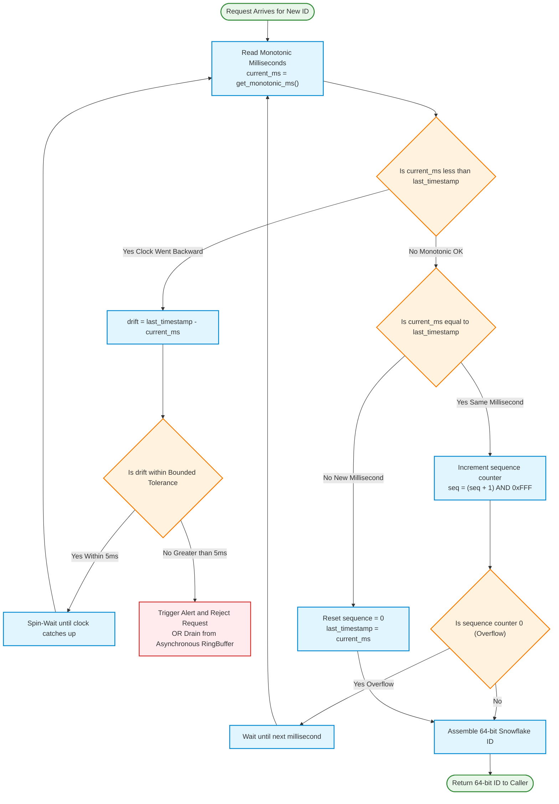
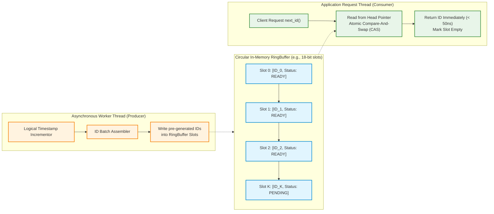
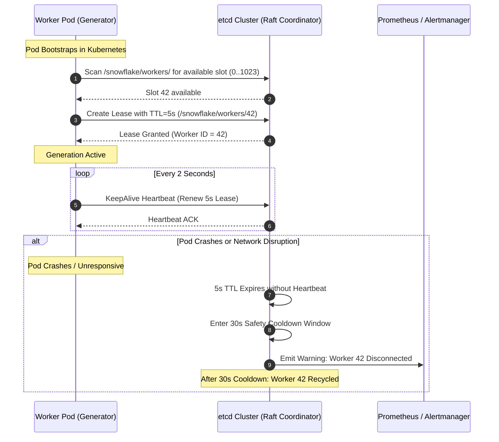
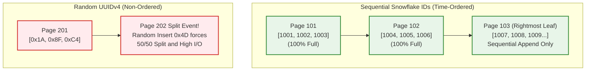
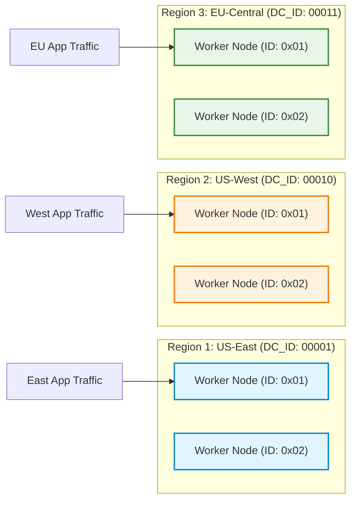

# Design a Globally Unique, Time-Sortable ID Generator (Hyperscale Blueprint)

> [!tip] Staff/Principal Deep Walkthrough & Production Service
> - **Interview Playbook**: [`Chapter 3 Staff/Principal Walkthrough Playbook`](02-Interactive-Interview-Playbook.md)
> - **Production Engine & Service**: [`unique_id_service.py`](unique_id_service.py) (64-bit Snowflake, RFC 9562 UUIDv7, HTTP daemon with /metrics, real SQLite B+Tree disk benchmark)

## 1. Problem Statement & The Distributed ID Trilemma

In modern large-scale distributed architectures, generating globally unique primary keys is a foundational prerequisite for databases, messaging backbones, and event stores. The classical, monolithic approach utilizes relational database `AUTO_INCREMENT` primary keys (e.g., MySQL InnoDB or PostgreSQL sequences).

```
Single MySQL DB (AUTO_INCREMENT) ──► Hard SPOF & Bottleneck (< 10,000 QPS)
Multi-Master (auto_increment by N) ──► Brittle, breaks on scaling, zero cross-DC coordination
UUIDv4 (128-bit Random)            ──► Destroys B+Tree clustered index performance via page splits
```

### The Golden Trilemma of Distributed IDs

Any distributed ID generator must navigate three competing tensions:

```
                      Global Uniqueness (Zero Collisions)
                                     ▲
                                    / \
                                   /   \
                                  /     \
                                 /       \
  Rough Temporal Sortability ◄──────────────► Zero Runtime Coordination
  (B+Tree Clustered Locality)                 (Sub-Microsecond Latency)
```

1. **Global Uniqueness**: Zero duplicate IDs across hundreds of distributed nodes spanning multiple cloud regions.
2. **Temporal Sortability**: IDs must be roughly monotonically increasing ($t_1 < t_2 \implies \text{ID}_1 < \text{ID}_2$) to prevent catastrophic B+Tree page splits in database clustered indexes.
3. **Zero Runtime Coordination**: Nodes must generate IDs autonomously in-memory without synchronous cross-node network hops (no Paxos/Raft on the critical generation path), achieving throughput $> 1,000,000\text{ IDs/sec}$ per node.

---

## 2. Requirements Clarification & System Scope

### Candidate-Interviewer Alignment Dialog

**Candidate:** What is the required bit-width and format? Must it fit within a signed 64-bit integer, or are 128-bit strings (UUIDs) acceptable?  
**Interviewer:** It must be a **numeric 64-bit signed integer** (`BIGINT`), compatible with standard database indexes and programming language integers without precision truncation in JSON (e.g., JavaScript `Number.MAX_SAFE_INTEGER` is $2^{53} - 1$, so IDs exceeding 53 bits are transmitted as strings over HTTP, but stored as 64-bit ints in databases).

**Candidate:** What is the target generation throughput and latency SLA?  
**Interviewer:** The global system must support **500,000 sustained QPS** with peak spikes to **1,000,000 QPS**. Latency must be **under 100 microseconds ($P_{99}$)** for network-based calls, and **under 50 nanoseconds** for in-process library generation.

**Candidate:** How strictly ordered must the IDs be? Does $t_1 < t_2$ strictly guarantee $\text{ID}_1 < \text{ID}_2$ across all machines?  
**Interviewer:** "Roughly time-ordered" (within tens of milliseconds) is acceptable. Strict global linearizability across separate physical servers is impossible without cross-node synchronization or atomic hardware clocks (e.g., Google TrueTime).

### Functional Requirements (FR)

| ID | Requirement | Description |
|:---|:---|:---|
| **FR-1** | **Deterministic Uniqueness** | Guaranteed zero duplicate IDs across 1,024 independent worker nodes over a 70-year lifespan. |
| **FR-2** | **Temporal Monotonicity** | High-order bits contain timestamp data, ensuring chronological sorting in database indexes. |
| **FR-3** | **64-bit Integer Representation** | Encoded within an 8-byte integer (`int64`), with the most significant bit (MSB) reserved as 0. |
| **FR-4** | **Multi-Datacenter Isolation** | Datacenter and Worker bitfields isolate failure domains, preventing cross-DC collisions. |
| **FR-5** | **Batch Extraction & Parsing** | Provides utility APIs to parse timestamp, datacenter, and machine identity directly from any ID. |

### Non-Functional Requirements (NFR)

| ID | Requirement | Target Metric | Architectural Strategy |
|:---|:---|:---|:---|
| **NFR-1** | **Generation Latency** | $< 50\text{ ns}$ (in-process) / $< 100\ \mu\text{s}$ (sidecar) | Pure bitwise arithmetic + atomic CPU registers; zero network I/O. |
| **NFR-2** | **Cluster Throughput** | $\ge 500,000\text{ IDs/sec}$ global sustained | 12-bit sequence counter allocating up to $4,096,000\text{ IDs/sec}$ per node. |
| **NFR-3** | **High Availability** | $99.9999\%$ uptime | Fully decentralized, autonomous generation with etcd startup leasing. |
| **NFR-4** | **Clock Anomaly Resilience** | Bounded tolerance to NTP skew | Spin-wait for backward drift $< 5\text{ ms}$; asynchronous RingBuffer for larger skews. |

---

## 3. Back-of-the-Envelope Capacity Planning & Bitfield Layouts

### 3.1 Fleet Capacity & Bit Allocation Economics

A standard 64-bit integer bitfield is partitioned into functional segments. We analyze the **Canonical Twitter Snowflake layout**:

```
 0 | 00000000 00000000 00000000 00000000 00000000 0 | 00000 | 00000 | 000000000000
───┼─────────────────────────────────────────────┼───────┼───────┼─────────────
 ▲ │                      ▲                      │   ▲   │   ▲   │      ▲
 │ │                      │                      │   │   │   │   │      │
 1 │              41 Timestamp Bits              │ 5 Bits│ 5 Bits│   12 Bits
Bit│             (Milliseconds Delta)            │ DC ID │Node ID│   Sequence
```

| Segment | Bit Width | Binary Range | Decimal Capacity | Purpose |
|:---|:---:|:---:|:---:|:---|
| **Sign Bit** | 1 bit | `0` | Always 0 | Guarantees positive signed integer across Java/PostgreSQL `BIGINT`. |
| **Timestamp** | 41 bits | $0$ to $2^{41} - 1$ | $2,199,023,255,551\text{ ms}$ | **$69.73\text{ years}$** of millisecond granularity from custom epoch. |
| **Datacenter ID** | 5 bits | `00000` to `11111` | 32 Datacenters | Identifies geographic failure domain (e.g., AWS regions). |
| **Worker Node ID** | 5 bits | `00000` to `11111` | 32 Nodes per DC | Up to 1,024 total physical nodes ($32\text{ DCs} \times 32\text{ Nodes}$). |
| **Sequence Counter** | 12 bits | $0$ to $2^{12} - 1$ | 4,096 IDs per ms | Handles concurrent requests within the identical millisecond. |

### 3.2 Throughput Ceiling Calculations

- **Maximum Throughput per Single Node**:
  $$\text{Capacity}_{\text{node}} = 4,096\text{ IDs/ms} \times 1,000\text{ ms/s} = 4,096,000\text{ IDs/sec}$$
- **Maximum Throughput for Fleet of 1,024 Nodes**:
  $$\text{Capacity}_{\text{global}} = 1,024 \times 4,096,000 = 4,194,304,000\text{ IDs/sec} \approx 4.19\text{ Billion IDs/sec}$$
- **Throughput Headroom**: At our target scale of $500,000\text{ IDs/sec}$, the fleet operates at **$0.012\%$** of theoretical capacity, providing immense headroom for black-swan traffic spikes.

### 3.3 Storage Sizing for Downstream Databases

- Each ID consumes 8 bytes of storage.
- At $500,000\text{ IDs/sec}$ sustained write volume:
  $$\text{Daily Primary Key Footprint} = 500,000 \times 86,400\text{ s} \times 8\text{ bytes} \approx 345.6\text{ GB/day}$$

---

## 4. End-to-End System Architecture

The following diagram illustrates the deployment topology, contrasting in-process zero-latency generation with centralized sidecar microservices, coordinated by an external consensus plane (etcd):

```mermaid
flowchart TD
    subgraph ClientLayer["Client & Ingress Layer"]
        App1["Microservice Pod A"] --> LocalGen1["In-Process Snowflake Engine"]
        App2["Microservice Pod B"] --> LocalGen2["In-Process Snowflake Engine"]
        App3["External / Web Client"] --> API["API Gateway"]
        API --> Sidecar["Leaf / Snowflake Service Cluster"]
    end

    subgraph Coordination["Dynamic Worker Coordination Plane"]
        etcd[("etcd / ZooKeeper Cluster<br/>Dynamic Leases & TTL Heartbeats")]
    end

    LocalGen1 <-->|Claim and Heartbeat Lease| etcd
    LocalGen2 <-->|Claim and Heartbeat Lease| etcd
    Sidecar <-->|Claim and Heartbeat Lease| etcd

    subgraph StorageLayer["Downstream Storage Engine"]
        LocalGen1 -->|64-bit Time-Ordered BIGINT| DB1[("MySQL InnoDB / PostgreSQL<br/>Sequential B+Tree Append")]
        Sidecar -->|64-bit Time-Ordered BIGINT| DB2[("Distributed NoSQL / Cassandra")]
    end

    classDef client fill:#e1f5fe,stroke:#0288d1,stroke-width:2px;
    classDef coord fill:#fff3e0,stroke:#f57c00,stroke-width:2px;
    classDef db fill:#e8f5e9,stroke:#388e3c,stroke-width:2px;

    class App1,App2,App3,API,LocalGen1,LocalGen2,Sidecar client;
    class etcd coord;
    class DB1,DB2 db;
```



### Architectural Deployment Patterns

1. **Mode A: In-Process Library (The Ultra-High Performance Path)**:
   - Embedded directly as an SDK dependency inside Java/Go microservices.
   - Generates IDs using local CPU registers in $< 50\text{ nanoseconds}$. Zero network hops, zero serialization overhead.
   - Pods dynamically acquire a 10-bit Worker ID from `etcd` upon container boot.
2. **Mode B: Centralized Microservice Mesh (The Multi-Language Path)**:
   - Deployed as an Envoy sidecar or dedicated Kubernetes service exposing gRPC (`GenerateID`, `GenerateBatch`).
   - Ideal for legacy environments, frontend edge proxies, and heterogeneous programming stacks.

---

## 5. The Clock Synchronization Trap & Production Mitigations

### The Fallacy of Monotonic Wall Clocks

Standard system wall clocks (`CLOCK_REALTIME`) are not strictly monotonic:
1. **NTP Stepping vs. Slewing**: While `ntpd -x` or `chrony` attempts to "slew" (gradually drift) the clock by at most $0.5\text{ ms/s}$, NTP servers can execute a **Step Adjustment** (abrupt backwards jump) of several milliseconds or seconds if clock drift exceeds configured limits.
2. **Virtual Machine Hypervisor Pauses**: During cloud VM live migration (e.g., AWS EC2 or Google Cloud hypervisor updates), a guest VM can be frozen for $50 - 200\text{ ms}$. Upon resumption, the OS clock suddenly jumps forward, and subsequent NTP synchronization can step the clock backwards.
3. **Leap Seconds**: Insertion of a leap second ($23:59:60$) causes clocks without proper smearing (Google TrueTime smear / AWS Leap Second smear) to repeat second 59, generating duplicate timestamps.

> [!danger] The Disaster Scenario
> If the system clock steps backwards by even $2\text{ milliseconds}$, a naive generator will repeat timestamps. If the sequence counter resets to 0, it will generate **identical 64-bit IDs**, causing primary key collisions, transactional rollback storms, and corrupted data!

---

### The Production Mitigation Flowchart



---

### Decoupling Physical Time: The Asynchronous RingBuffer (Baidu UidGenerator)

To achieve absolute immunity from NTP clock backward shifts, high-throughput systems (such as Baidu's UidGenerator) decouple request serving from wall-clock checks via an **Asynchronous RingBuffer**:



- **Mechanism**:
  1. A background producer thread pre-allocates millions of unique IDs into an in-memory RingBuffer using a strictly monotonically incrementing counter.
  2. Consumer threads consume IDs by incrementing a cursor using lock-free atomic `Compare-And-Swap` (CAS).
  3. If physical wall-clock time jumps backward, the producer simply continues incrementing its internal logical timestamp without querying OS time.
  4. Latency drops to **$< 20\text{ nanoseconds}$**, completely eliminating lock contention and OS syscall overhead!

---

## 6. Dynamic Worker ID Lifecycle in Ephemeral Container Fleets

In legacy on-premise environments, a static 5-bit Datacenter ID and 5-bit Machine ID were manually assigned via config files. In modern Kubernetes cloud environments with auto-scaling, pods are frequently terminated, rescheduled, and replaced.

```
Ephemeral Kubernetes Problem:
Pod-1 (Worker 5) crashes ──► Pod-2 spins up on new node ──► Statically assigned Worker 5?
Race condition: If Pod-1 is still draining inflight IDs, duplicate IDs will occur!
```

### The etcd Lease Allocation Protocol



### The Safety Cooldown Window (Zombie Worker Defense)
When a pod crashes or loses network connectivity:
1. Its etcd lease expires after 5 seconds.
2. **Critical Rule**: etcd does **not** immediately reassign Worker ID 42 to a new pod!
3. etcd places Worker ID 42 into a **30-second Quarantine Cooldown Window** ($\ge 2\times \text{maximum clock drift}$).
4. This guarantees that if the old pod was suffering from a long Stop-The-World GC pause or hypervisor freeze, it will be completely killed by Kubernetes liveness probes before any new node can emit IDs under Worker ID 42!

---

## 7. Storage Engine Micro-Architecture: B+Tree Page Split Realities

The choice between a **time-ordered 64-bit ID (Snowflake)** and a **random 128-bit ID (UUIDv4)** has a profound impact on database storage engine performance.



### Why UUIDv4 Degrades MySQL InnoDB & PostgreSQL Clustered Indexes

1. **Random Insertion Points**:
   - In MySQL InnoDB, tables are clustered around the Primary Key B+Tree.
   - When using UUIDv4, hash values are randomly distributed across the entire key space.
   - An insert requires loading a random leaf page from NVMe disk into the InnoDB Buffer Pool, causing continuous random I/O and cache thrashing.
2. **The 50/50 Page Split Penalty**:
   - When a random page becomes full, InnoDB must allocate a new page and move half the records over (a **Page Split**).
   - Each page split writes two full 16 KB pages to the Write-Ahead Log (WAL / doublewrite buffer), inducing severe write amplification.
   - Result: B+Tree leaf pages settle at only **$\approx 50\%$ page fill factor**, doubling on-disk storage size!
3. **The Snowflake Sequential Advantage**:
   - Snowflake IDs are strictly increasing. Every insert targets the **rightmost leaf page**.
   - InnoDB utilizes sequential page append mode, achieving **$93.75\%$ (15/16) page fill factor**.
   - Zero page splits. Disk writes are purely sequential WAL appends, yielding up to **$10\times$ higher write throughput** than UUIDv4!

---

## 8. Modern Distributed ID Formats Benchmark (2026 Landscape)

| Format | Bit Width | Sortable? | Encoding | Lifetime / Range | Concurrency per ms | Primary Production Use Case |
|:---|:---:|:---:|:---:|:---:|:---:|:---|
| **Twitter Snowflake** | 64 bits | Yes (ms) | Numeric `int64` | 69 years | 4,096 per node | Relational DB primary keys, low-latency queues |
| **Sonyflake** | 64 bits | Yes (10ms) | Numeric `int64` | 174 years | 256 per node | Long-lifespan IoT, high node count (65k nodes) |
| **UUIDv7 (RFC 9562)** | 128 bits | Yes (ms) | Hex / String | Indefinite | Bounded 12-bit | Modern web APIs, PostgreSQL 17+, microservices |
| **ULID** | 128 bits | Yes (ms) | Crockford Base32 | ~10,889 AD | $2^{80}$ randomness | URL-safe external identifiers, logging systems |
| **Meituan Leaf-Segment**| 64 bits | Yes (Batch) | Numeric `int64` | Configurable | Unlimited | Enterprise ERP, high-throughput financial orders |
| **MongoDB ObjectId** | 96 bits | Yes (sec) | 24 hex characters| ~136 years | $2^{24}$ per process | Document databases, NoSQL stores |

### Spotlight: The New IETF Standard — UUIDv7 (RFC 9562, May 2024)
For architectures that require a 128-bit string representation rather than 64-bit integer, **UUIDv7** has officially superseded UUIDv1 and UUIDv4:
- **Bits 0–47**: 48-bit Big-Endian Unix Timestamp in milliseconds.
- **Bits 48–51**: 4-bit Version (`0111` for v7).
- **Bits 52–63**: 12-bit Counter / Sub-millisecond sequence.
- **Bits 64–65**: 2-bit Variant (`10`).
- **Bits 66–127**: 62 bits of cryptographic pseudo-random entropy.
- **Why it matters**: Provides the exact index-friendly sequential append characteristics of Snowflake, while conforming to standard 128-bit UUID database columns!

---

## 9. Multi-Region Active-Active Topology & Disaster Recovery

When deploying an ID generation system across global cloud datacenters (e.g., `us-east`, `us-west`, `eu-central`), cross-region coordination introduces unalterable speed-of-light WAN latency ($70 - 150\text{ ms}$).



### Complete Cross-Region Autonomy
- By reserving 5 bits for `datacenter_id`, nodes in `us-east` (`00001`) and `eu-central` (`00011`) generate IDs across completely non-overlapping numeric domains.
- **Zero Cross-Region Network Calls**: ID generation runs strictly within regional VPC boundaries.
- **Disaster Recovery Failover**: If `us-east` experiences total regional blackout, DNS / Anycast load balancers instantly redirect application traffic to `us-west`. The `us-west` generators seamlessly emit IDs under DC ID `00010`, ensuring zero conflict with previously generated IDs from `us-east`!

---

## 10. Production Verification & SRE Observability Matrix

| Metric Name | Type | Target SLA | Alert Condition | Remediation Runbook |
|:---|:---|:---|:---|:---|
| `uid_clock_skew_milliseconds` | Gauge | $< 1.0\text{ ms}$ | $> 5.0\text{ ms}$ | Inspect host NTP daemon; check hypervisor steal time on VM. |
| `uid_sequence_overflow_wait_total`| Counter | $0\text{ events/min}$ | $> 100\text{ events/min}$| Worker approaching 4,096 IDs/ms saturation; scale out worker nodes. |
| `uid_lease_renew_duration_ms` | Histogram| $P_{99} < 10\text{ ms}$ | $P_{99} > 1,000\text{ ms}$| etcd cluster slow; investigate disk I/O latency or consensus leader stalls. |
| `uid_generator_allocated_worker_ids`| Gauge | $< 800\text{ active}$ | $> 950\text{ active}$ | Approaching 1,024 ceiling; trigger zombie worker cleanup or bitfield re-sharding. |
| `uid_generation_duration_ns` | Histogram| $P_{99} < 50\text{ ns}$ | $P_{99} > 200\text{ ns}$ | CPU cache thrashing or thread context switching on generator process. |

---

## 11. Summary Architecture Cheat Sheet

```
Distributed Unique ID Generator Blueprint:
  [x] Bit Allocation: 1 sign bit + 41 timestamp bits + 5 DC bits + 5 worker bits + 12 sequence bits.
  [x] Lifetime & Scale: 69.7 years from custom epoch; 4,096,000 IDs/sec per node; 1,024 global nodes.
  [x] Clock Drift Protection: Monotonic clock checks; spin-wait on < 5ms drift; async RingBuffer pre-allocation.
  [x] Dynamic Node Orchestration: Ephemeral etcd/ZooKeeper leases with 5s TTL and 30s quarantine cooldown.
  [x] Storage Engine Synergy: Sequential append on rightmost B+Tree page (93.75% fill factor vs 50% for UUIDv4).
  [x] Cloud-Native Modern Standard: UUIDv7 (RFC 9562) for 128-bit sortable strings; Snowflake for 64-bit numeric BIGINTs.
  [x] Multi-Region Independence: Autonomous regional DC bits; zero cross-region network calls on the critical path.
```

---

**Related Architectural Blueprints:**
- [`01-Architectural-Blueprint.md`](01-Architectural-Blueprint.md)
- [`01-Architectural-Blueprint.md`](01-Architectural-Blueprint.md)
- [`01-Architectural-Blueprint.md`](01-Architectural-Blueprint.md)
- [[CAP Theorem & Distributed Consensus]]
- [[Clock Synchronization & TrueTime]]
