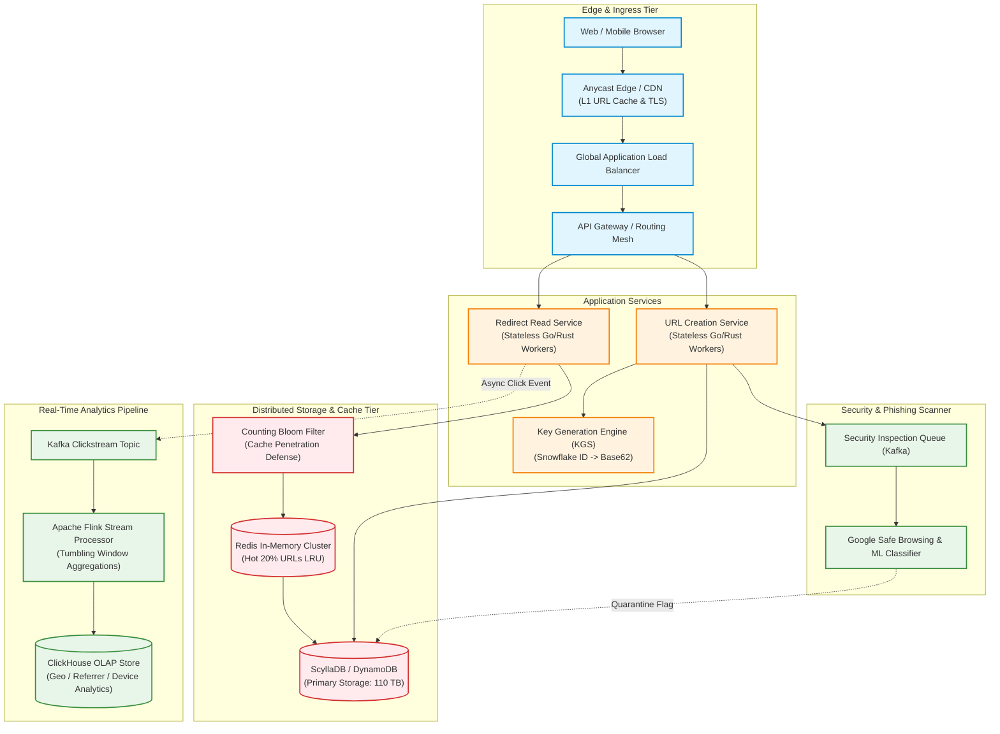
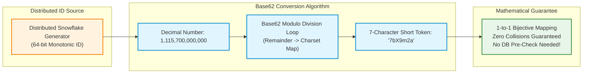
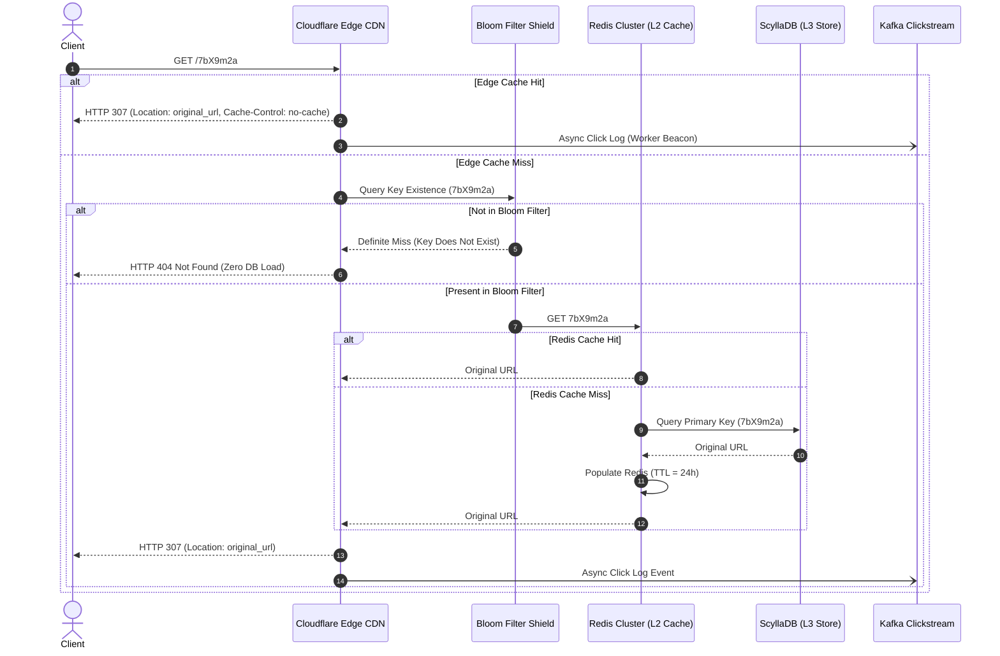
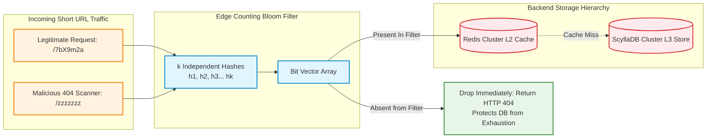
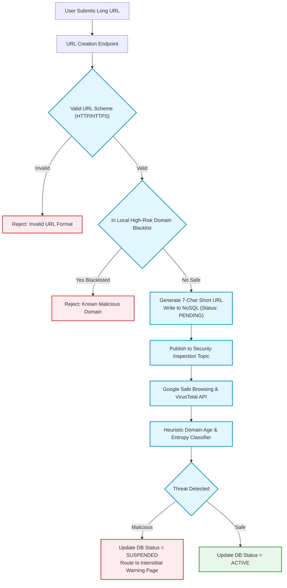
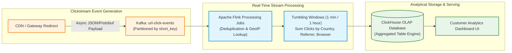

# Design a Scalable URL Shortener & Click Analytics Platform (Hyperscale Blueprint)

> [!tip] Staff/Principal Deep Walkthrough & Production Service
> - **Interview Playbook**: [`Chapter 4 Staff/Principal Walkthrough Playbook`](02-Interactive-Interview-Playbook.md)
> - **Production Engine & Service**: [`url_shortener_service.py`](url_shortener_service.py) (Base62 Bijective Codec, In-Memory Bloom Filter Shield, SQLite WAL Store, Async Clickstream Queue)

## 1. Problem Statement & Motivation

A **URL Shortener** (e.g., TinyURL, Bitly, Twitter's `t.co`) translates a lengthy web address (e.g., `https://www.example.com/products/electronics/item-491028491?campaign=spring_sale&ref=social`) into a compact, human-readable alias (e.g., `https://tiny.one/7bX9m2a`). When a user navigates to the shortened alias, the service intercepts the request and issues an HTTP redirect to the original destination.

```
Long URL (150+ chars)  ──► [ URL Creation Service ] ──► Short URL: https://tiny.one/7bX9m2a
Short URL Clicked      ──► [ Edge Redirect Service ] ──► HTTP 307 Redirect ──► Long Destination
```

### Why URL Shortening is Deceptively Complex at Hyperscale

While trivial to implement on a single server, building a global URL shortening platform handling **hundreds of thousands of requests per second** reveals subtle distributed systems challenges:

1. **The Hash Collision Retry Fallacy**:
   - Naive designs hash the long URL (MD5/SHA-256), take the first 7 characters, check the database for collisions, and append salt upon collisions. Under high write concurrency ($5,000\text{ writes/sec}$), this **Read-Before-Write** pattern induces severe database locking, race conditions, and exponential latency spikes.
2. **The HTTP 301 vs 302/307 Redirect Dilemma (Telemetry Poisoning)**:
   - Returning `HTTP 301 Moved Permanently` causes modern web browsers to aggressively cache the redirect locally on client devices. Subsequent clicks **never hit your servers**, completely destroying business-critical analytics (click counting, referrer tracking, geographic attribution).
3. **The 404 Cache Penetration Attack**:
   - Attackers scan random 7-character strings (`/aaaaaaa`, `/aaaaaab`) to discover active links or probe for vulnerabilities. Because non-existent keys are absent from cache, **100% of malicious requests bypass Redis and hammer the database disk**, leading to database connection exhaustion.
4. **Synchronous Analytics Bottleneck**:
   - Executing `UPDATE urls SET click_count = click_count + 1` directly inside the redirect path destroys database throughput at $150,000\text{ QPS}$. Analytics ingestion must be decoupled via asynchronous streaming pipelines.
5. **Malware & Phishing Concealment**:
   - URL shorteners are the primary attack vector for cybercriminals masking malicious malware downloads and phishing portals behind trusted short domains. An enterprise platform requires automated security quarantine funnels.

---

## 2. Requirements Clarification & System Scope

### Candidate-Interviewer Alignment Dialog

**Candidate:** What is the ratio between reads (redirects) and writes (new URL shortenings)?  
**Interviewer:** Assume a **100:1 read-to-write ratio**. The service generates **100 million new URLs per day**, while handling **10 billion redirect clicks per day**.

**Candidate:** How long should shortened URLs remain active? Do they expire?  
**Interviewer:** URLs should persist for a default TTL of **5 years**, unless explicitly created with an earlier expiration timestamp or manually deleted by the creator.

**Candidate:** How short must the generated alias be? Can users define custom aliases?  
**Interviewer:** The alias should be as short as mathematically feasible while guaranteeing zero collision over 5 years. Users must be able to specify custom vanity aliases (e.g., `tiny.one/my-brand`).

**Candidate:** What is our latency SLA on the redirect path?  
**Interviewer:** Redirect latency is mission-critical. The $P_{99}$ latency for an HTTP redirect must be **under 15 milliseconds** globally.

### Functional Requirements (FR)

| ID | Requirement | Description |
|:---|:---|:---|
| **FR-1** | **Deterministic URL Shortening** | Accepts any valid HTTP/HTTPS URL and generates a compact 7-character Base62 alias. |
| **FR-2** | **Custom Vanity Aliases** | Allows authenticated users to request custom slugs (e.g., `/black-friday-2026`) with atomic uniqueness enforcement. |
| **FR-3** | **Low-Latency Redirection** | Redirects short URL visitors to the target destination via HTTP 307 with appropriate cache headers. |
| **FR-4** | **Configurable Expiration & Deletion** | Supports automatic TTL expiration and immediate soft-deletion (tombstoning) by the URL owner. |
| **FR-5** | **Real-Time Clickstream Analytics** | Ingests and aggregates click counts, geographic location (GeoIP), referrer headers, and user-agent metadata. |
| **FR-6** | **Malware & Phishing Defense** | Automatically inspects target domains against threat intelligence feeds before activating links. |

### Non-Functional Requirements (NFR)

| ID | Metric | Target SLA | Architectural Strategy |
|:---|:---|:---|:---|
| **NFR-1** | **Redirect Latency** | $P_{99} < 15\text{ ms}$ | Anycast Edge CDN + Local In-Memory Redis caching + Bloom filter shield. |
| **NFR-2** | **Read Availability** | $99.999\%$ uptime | Active-Active multi-region replication of NoSQL datastores. |
| **NFR-3** | **Write Scalability** | $\ge 5,000\text{ QPS}$ write peak | Bijective Base62 ID mapping; zero collision checks required on write. |
| **NFR-4** | **Cache Penetration Defense** | $0\%$ DB queries for non-existent keys | Edge Counting Bloom Filter rejecting invalid keys in $< 1\ \mu\text{s}$. |
| **NFR-5** | **Analytics Isolation** | Zero redirect latency penalty | Asynchronous Kafka clickstream ingestion + Apache Flink streaming aggregation. |

---

## 3. Back-of-the-Envelope Capacity Planning & Sizing

### 3.1 Traffic Baselining

- **Write Volume (New URLs Created)**:
  $$\text{Writes/Day} = 100,000,000\text{ URLs/day}$$
  $$\text{QPS}_{\text{write, avg}} = \frac{100,000,000}{86,400} \approx 1,157\text{ writes/sec}$$
  $$\text{QPS}_{\text{write, peak}} \approx 1,157 \times 4 \approx 4,600\text{ writes/sec} \approx 5,000\text{ writes/sec}$$

- **Read Volume (Redirect Clicks, 100:1 Ratio)**:
  $$\text{Reads/Day} = 100\text{M} \times 100 = 10,000,000,000\text{ redirects/day} \ (10\text{ Billion/day})$$
  $$\text{QPS}_{\text{read, avg}} = \frac{10,000,000,000}{86,400} \approx 115,740\text{ redirects/sec}$$
  $$\text{QPS}_{\text{read, peak}} \approx 115,740 \times 2.5 \approx 289,350\text{ redirects/sec} \approx 300,000\text{ redirects/sec}$$

---

### 3.2 Base62 Character Space & Token Length Derivation

To make the alias URL-safe and compact, we employ **Base62 encoding** using the alphanumeric character set:
$$\Sigma = [0-9, a-z, A-Z] \implies 10 + 26 + 26 = 62\text{ characters}$$

| Slug Length ($L$) | Mathematical Permutations ($62^L$) | Capacity | 5-Year Feasibility (182.5B URLs needed) |
|:---:|:---:|:---:|:---|
| **5 characters** | $62^5 = 916,132,832$ | $\approx 916\text{ Million}$ | ❌ Exhausted in 9 days! |
| **6 characters** | $62^6 = 56,800,235,584$ | $\approx 56.8\text{ Billion}$ | ❌ Exhausted in 1.5 years. |
| **7 characters** | $62^7 = 3,521,614,606,208$ | **$\approx 3.52\text{ Trillion}$** | ✅ **Optimal (Lasts 96.4 years at 100M/day!)** |
| **8 characters** | $62^8 = 218,340,105,584,896$ | $\approx 218\text{ Trillion}$ | Overkill; adds unnecessary character length. |

> [!important] Architectural Decision
> We standardize on **7-character Base62 tokens**. A 7-character token provides over **3.52 Trillion unique URLs**, comfortably holding 19 times our 5-year requirement ($182.5\text{ Billion}$).

---

### 3.3 Storage Sizing (5-Year Horizon)

- **Total URLs over 5 Years**:
  $$100\text{M URLs/day} \times 365\text{ days} \times 5\text{ years} = 182,500,000,000\text{ URLs} \ (182.5\text{ Billion})$$

- **Record Schema & Byte Footprint**:
  - `short_key` (VARCHAR 7, ASCII): 7 bytes
  - `long_url` (VARCHAR 512, UTF-8): $\approx 500$ bytes average
  - `user_id` (BIGINT, 64-bit): 8 bytes
  - `created_at` (INT64 millisecond timestamp): 8 bytes
  - `expires_at` (INT64 millisecond timestamp): 8 bytes
  - `status` (TINYINT: Active, Expired, Suspended): 1 byte
  - B+Tree / LSM-tree node pointer overhead: $\approx 18$ bytes
  - **Total per Record**: $\approx 550\text{ bytes}$

- **Total Storage Needed**:
  $$\text{Storage}_{\text{5yr}} = 182.5 \times 10^9 \times 550\text{ bytes} \approx 100,375,000,000,000\text{ bytes} \approx 100.4\text{ TB}$$
  With replication factor $R = 3$ across storage nodes:
  $$\text{Raw Disk Footprint} = 100.4\text{ TB} \times 3 \approx 301.2\text{ TB}$$

---

### 3.4 In-Memory Caching Sizing (Pareto 80/20 Rule)

According to the Pareto principle, **$80\%$ of redirect traffic targets $20\%$ of hot URLs** (viral campaigns, breaking news, marketing links).
- Daily read queries: $10\text{ Billion}$.
- Active unique URLs queried per day: $\approx 50,000,000$ unique links.
- Top $20\%$ hot set:
  $$\text{Hot URL Count} = 50,000,000 \times 20\% = 10,000,000\text{ URLs}$$
- **Cache Memory Required**:
  $$\text{RAM}_{\text{cache}} = 10,000,000 \times 550\text{ bytes} \approx 5.5\text{ GB}$$
- Even if we generously cache **200 Million URLs** (covering days of trailing traffic):
  $$\text{Extended Cache RAM} = 200,000,000 \times 550\text{ bytes} \approx 110\text{ GB}$$
- **Easily accommodated in a 3-node Redis cluster (each node allocated 64 GB RAM) with 40% memory headroom!**

---

## 4. End-to-End System Architecture

The following diagram details the hyperscale URL shortening and click analytics platform, separating the high-volume read path from asynchronous security and analytics pipelines:



---

## 5. Bijective Base62 ID Mapping vs. The KGS Architecture

### The Fallacy of Hash Truncation (MD5 + Collision Retries)

Classic literature often describes generating short URLs by computing an MD5 hash of the original URL, truncating it to 7 characters, and appending salt if a collision exists in the database.

```
Long URL ──► MD5 Hash ──► Take 7 chars ──► Query DB: SELECT short_url FROM urls WHERE ...
                                                   │
                ┌──────────────────────────────────┴──────────────────────────────────┐
                ▼ (Found = Collision!)                                                ▼ (Not Found)
        Append salt & Rehash (Retry loop!)                                    INSERT INTO urls ...
```

#### Why This Breaks at Scale
1. **Unbounded Latency**: Under peak traffic ($5,000\text{ writes/sec}$), checking the database before writing introduces a synchronous disk read roundtrip. As the database grows to 100 Billion rows, hash collisions increase (Birthday Paradox), triggering recursive retry loops.
2. **Race Conditions**: Two concurrent write workers hashing two different URLs that collide on the same 7-character prefix will both observe "Not Found", and both attempt an insert, causing one to fail on a unique constraint violation.

---

### The Production Solution: Bijective Base62 ID Conversion

Instead of hashing the long URL string, we convert a **globally unique 64-bit integer ID** (generated via Snowflake or Meituan Leaf) directly into Base62.



#### The Bijective Mapping Algorithm (C++ / Go Pseudocode)

```go
const Base62Alphabet = "0123456789abcdefghijklmnopqrstuvwxyzABCDEFGHIJKLMNOPQRSTUVWXYZ"

// EncodeBase62 converts a 64-bit integer ID into a fixed-length 7-character string.
func EncodeBase62(id uint64) string {
    var sb [7]byte
    for i := 6; i >= 0; i-- {
        sb[i] = Base62Alphabet[id%62]
        id /= 62
    }
    return string(sb[:])
}

// DecodeBase62 converts a 7-character short URL back into its 64-bit integer ID.
func DecodeBase62(token string) uint64 {
    var id uint64 = 0
    for i := 0; i < len(token); i++ {
        c := token[i]
        var val uint64
        if c >= '0' && c <= '9' {
            val = uint64(c - '0')
        } else if c >= 'a' && c <= 'z' {
            val = uint64(c - 'a' + 10)
        } else if c >= 'A' && c <= 'Z' {
            val = uint64(c - 'A' + 36)
        }
        id = id*62 + val
    }
    return id
}
```

- **Mathematical Guarantee**: Because the mapping between integer ID space $[0, 62^7 - 1]$ and 7-character Base62 string space is **bijective (one-to-one and onto)**:
  $$\forall \ \text{ID}_a \ne \text{ID}_b \implies \text{Base62}(\text{ID}_a) \ne \text{Base62}(\text{ID}_b)$$
- **Zero Collision Guarantee**: No two URLs can ever produce the identical short token. **Zero database collision pre-checks are required.** Writes execute as blazing-fast blind inserts!

---

## 6. Read Path, Redirection & Cache Penetration Defense

### 6.1 The HTTP 301 vs. 307 Redirection Decision

| Status Code | Standard Definition | Client Browser Behavior | Analytics Impact | Production Recommendation |
|:---:|:---|:---|:---|:---:|
| **HTTP 301** | *Moved Permanently* | Browser caches destination on disk forever. Future clicks bypass our servers entirely. | ❌ Catastrophic: Click counts and telemetry are permanently lost. | Never use for analytics-backed links. |
| **HTTP 302** | *Found (Temporary)* | Browser does not cache. Sends all future clicks to our server. | Historical standard. May alter HTTP POST to GET. | Acceptable for simple GET redirects. |
| **HTTP 307** | *Temporary Redirect* | Strictly preserves request method. Enforces server re-contact on every visit. | ✅ **Perfect: Every click hits our gateway for logging.** | **SOTA Standard (RFC 9110)** |

#### Standard Response Headers
```http
HTTP/1.1 307 Temporary Redirect
Location: https://www.example.com/target-landing-page
Cache-Control: private, max-age=0, no-cache, no-store, must-revalidate
Pragma: no-cache
Date: Sun, 12 Sep 2026 14:20:00 GMT
```

---

### 6.2 End-to-End Read Flow Sequence Diagram



---

### 6.3 Edge Counting Bloom Filter (Cache Penetration Shield)

When malicious actors or automated bot scanners attempt dictionary scans of non-existent short links (`GET /zzzzzzz`), a standard caching tier fails:
- Key `/zzzzzzz` is not in Redis cache.
- Gateway queries ScyllaDB disk storage.
- Storage confirms row does not exist, returns 404.
- At $50,000\text{ malicious QPS}$, the database storage engine suffers severe disk I/O exhaustion.



#### Bloom Filter Mathematics & Sizing
To filter $n = 200,000,000$ active keys with a target false positive probability $p = 0.01$ ($1\%$):
- **Optimal Bit Array Size ($m$)**:
  $$m = -\frac{n \ln p}{(\ln 2)^2} = -\frac{2 \times 10^8 \times \ln(0.01)}{(0.6931)^2} \approx 1,917,000,000\text{ bits} \approx 228\text{ MB RAM}$$
- **Optimal Hash Functions Count ($k$)**:
  $$k = \frac{m}{n} \ln 2 \approx \frac{1.917 \times 10^9}{2 \times 10^8} \times 0.6931 \approx 6.6 \implies 7\text{ hash functions}$$
- **Result**: In just **$228\text{ MB}$ of memory** hosted at each edge gateway, $99\%$ of all non-existent malicious requests are dropped in $< 1\ \mu\text{s}$ without generating a single database read query!

---

## 7. Phishing, Malware & Security Pipeline

Because short links conceal destination URLs, malicious actors weaponize URL shorteners to bypass email spam filters and spread ransomware. An enterprise shortener must incorporate an active defense mesh:



### Security Defenses Breakdown
1. **Synchronous Fast Path**:
   - Rejects non-HTTP(S) schemes (blocks `javascript:`, `data:`, `file:` payload injection).
   - Validates destination host against an in-memory Bloom filter / Trie of known phishing domains (updated via threat feeds).
2. **Asynchronous Deep Path (Safe Browsing & ML)**:
   - Worker threads consume URLs from Kafka and invoke the **Google Safe Browsing API v4** and **VirusTotal**.
   - A lightweight ML model scores domain entropy, registrar age ($< 24\text{ hours}$ old is high risk), and redirection loops.
   - If marked `SUSPENDED`, attempts to access the link trigger an **Interstitial Warning Page** advising the user that the destination contains malicious content.

---

## 8. Real-Time Clickstream Analytics Funnel

Redirect workers cannot synchronously write click counts to the primary database. Instead, every redirect asynchronously emits a lightweight telemetry event to a distributed streaming pipeline.



### Telemetry Event Schema (Protobuf)
```protobuf
message ClickEvent {
    string short_key = 1;
    int64 timestamp_ms = 2;
    string client_ip = 3;
    string user_agent = 4;
    string referrer = 5;
    string country_code = 6;
}
```

### Stream Processing & Storage (ClickHouse)
- **Apache Flink**:
  - Enriches IP with MaxMind GeoIP database (resolves Country, City).
  - Groups clicks by `(short_key, country, device_type)` in 1-minute tumbling windows.
- **ClickHouse Columnar Storage**:
  - Uses the `SummingMergeTree` table engine.
  - Automatically merges identical dimension rows, reducing storage by $95\%$ while providing instantaneous analytical queries (`SELECT sum(clicks) FROM stats WHERE short_key = '7bX9m2a' GROUP BY country`).

---

## 9. Database Schema & Clustered Partition Key Design

For the primary transactional store, we employ a distributed wide-column NoSQL database (**ScyllaDB / Apache Cassandra / Amazon DynamoDB**) optimized for single-key point lookups at petabyte scale.

### Primary URL Mapping Table (CQL)

```sql
CREATE KEYSPACE url_shortener WITH replication = {
    'class': 'NetworkTopologyStrategy',
    'us-east-1': 3,
    'eu-central-1': 3
};

CREATE TABLE url_shortener.urls (
    short_key       VARCHAR,          -- 7-char Base62 Token (Partition Key)
    long_url        VARCHAR,          -- Original Target URL
    user_id         BIGINT,           -- Owner ID (Foreign key reference)
    created_at      TIMESTAMP,        -- Creation Unix Epoch
    expires_at      TIMESTAMP,        -- Expiration Unix Epoch
    status          TINYINT,          -- 1: ACTIVE, 2: EXPIRED, 3: SUSPENDED
    PRIMARY KEY (short_key)
) WITH default_time_to_live = 157680000 -- 5-year default TTL auto-purge
  AND compaction = {'class': 'LeveledCompactionStrategy'};
```

### Custom Vanity Slugs Conflict Resolution
When a user requests a custom slug (`POST /api/v1/shorten` with `"custom_alias": "spring-sale"`):
```sql
INSERT INTO url_shortener.urls (short_key, long_url, user_id, created_at, status)
VALUES ('spring-sale', 'https://...', 10482, toTimestamp(now()), 1)
IF NOT EXISTS;
```
- The `IF NOT EXISTS` clause leverages **Lightweight Transactions (LWT)** via Paxos. If the alias is already claimed, the database atomically rejects the write and returns an `HTTP 409 Conflict` error to the client.

---

## 10. Production Verification & SRE Observability Matrix

| Metric Name | Type | Target SLA | Alert Condition | Remediation Runbook |
|:---|:---|:---|:---|:---|
| `url_redirect_duration_ms` | Histogram | $P_{99} < 15\text{ ms}$ | $P_{99} > 50\text{ ms}$ for 2m | Scale Redirect worker pods; verify Redis cluster hit ratio. |
| `url_redis_cache_hit_ratio` | Gauge | $> 85\%$ | $< 70\%$ | Cache eviction spike; check Redis maxmemory policy or memory leaks. |
| `url_bloom_filter_rejection_rate` | Counter | Baseline $\approx 2 - 5\%$ | Spikes $> 25\%$ | Active 404 dictionary scanning attack; engage Cloudflare WAF challenge. |
| `clickstream_kafka_consumer_lag` | Gauge | $< 10,000\text{ msgs}$ | $> 500,000\text{ msgs}$ | Flink stream processor backlog; scale Flink TaskManagers. |
| `url_safe_browsing_flagged_total` | Counter | Expected $< 0.1\%$ | Sudden spike $> 1\%$ | Coordinated spam wave; review newly created accounts and enforce CAPTCHA. |

---

## 11. Summary Architecture Blueprint Cheat Sheet

```
URL Shortener & Analytics Staff-Level Blueprint:
  [x] Token Space: 7-character Base62 (3.52 Trillion permutations, 96.4 years lifetime at 100M/day).
  [x] Token Generation: Bijective Base62 conversion of 64-bit Snowflake IDs (Zero collision checks).
  [x] Redirection Semantics: HTTP 307 with Cache-Control: no-cache (Preserves clickstream telemetry).
  [x] Cache Penetration Defense: Edge Counting Bloom Filter (228 MB RAM, drops 99% of 404 scans).
  [x] Storage Tier: ScyllaDB / DynamoDB (Partition key: short_key) with 5-year LeveledCompaction TTL.
  [x] Analytics Architecture: Asynchronous Kafka clickstream -> Apache Flink tumbling windows -> ClickHouse OLAP.
  [x] Cyber Security: Google Safe Browsing API + ML classifier quarantine + Interstitial warning page.
  [x] Custom Slugs: Paxos-backed Conditional Writes (INSERT IF NOT EXISTS) for atomic vanity creation.
```

---

**Related Architectural Blueprints:**
- [`01-Architectural-Blueprint.md`](01-Architectural-Blueprint.md)
- [`01-Architectural-Blueprint.md`](01-Architectural-Blueprint.md)
- [[Distributed Caching with Redis]]
- [`01-Architectural-Blueprint.md`](01-Architectural-Blueprint.md)
- [[ClickHouse & Real-Time OLAP Systems]]
