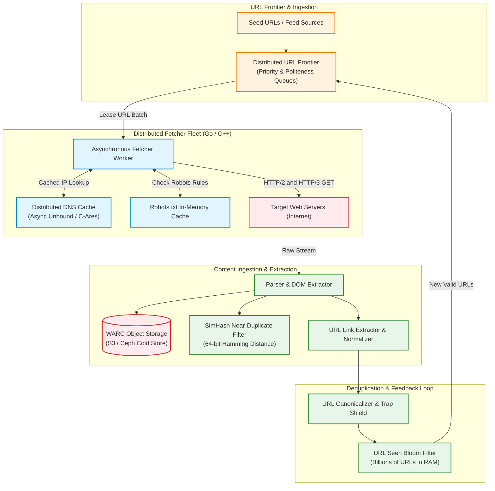
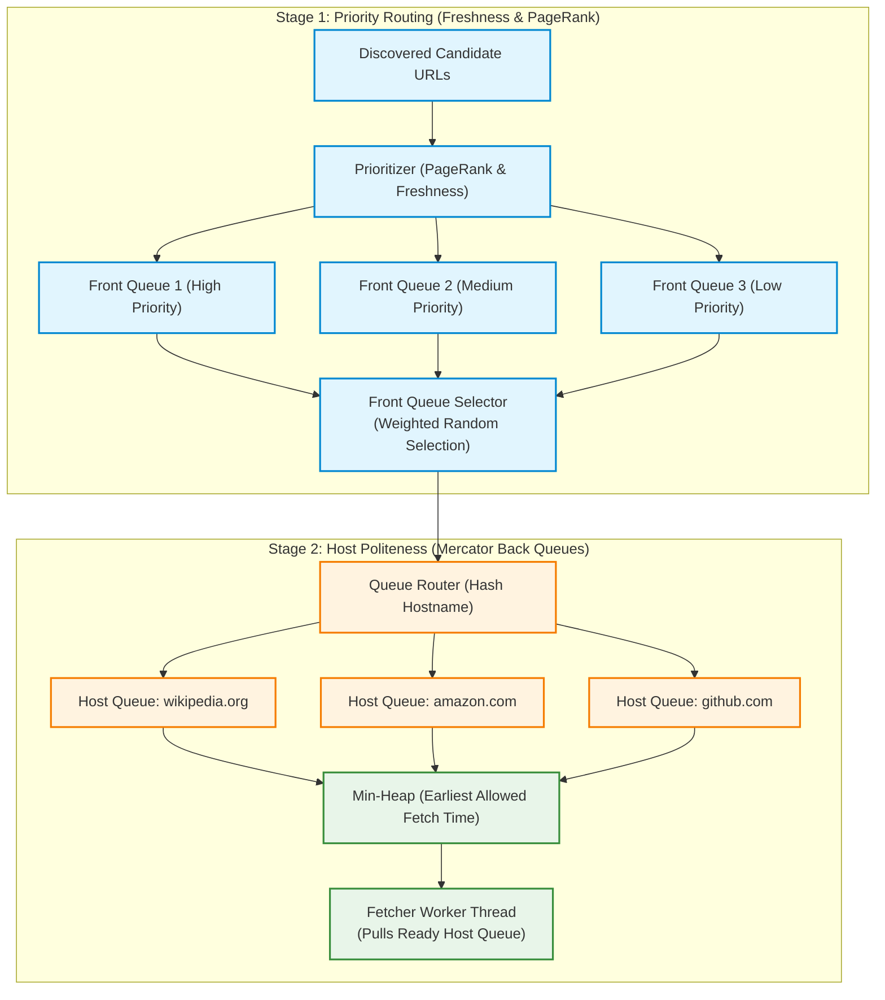
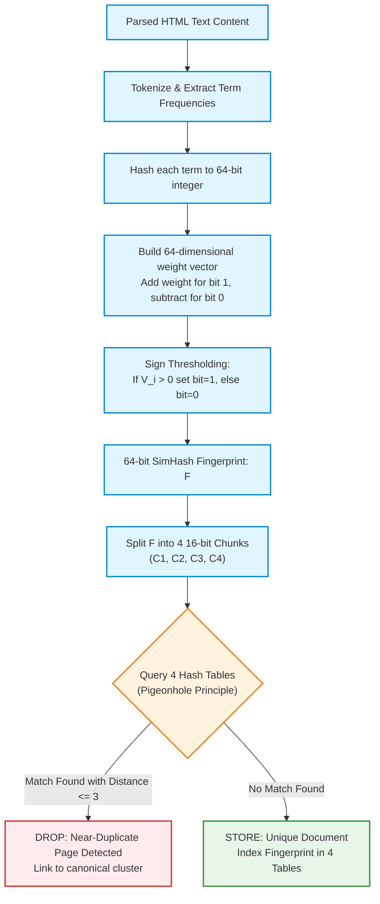
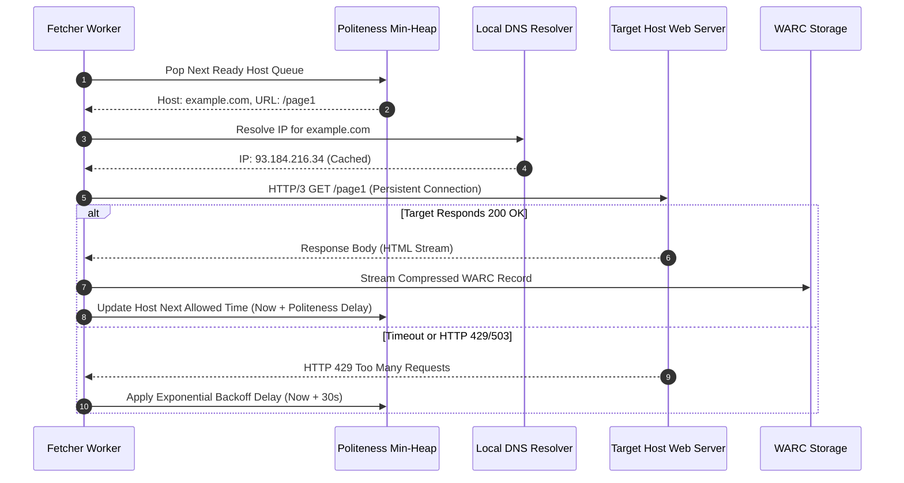
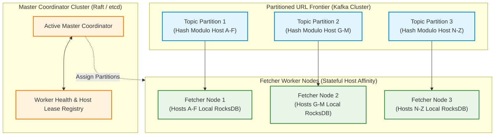

# Design a Distributed Web Crawler at Hyperscale (Mercator & Search Indexing Blueprint)

> [!tip] Staff/Principal Deep Walkthrough & Production Engine
> - **Interview Playbook**: [`Chapter 5 Staff/Principal Walkthrough Playbook`](02-Interactive-Interview-Playbook.md)
> - **Production Crawler Engine**: [`web_crawler_engine.py`](web_crawler_engine.py) (Mercator Two-Tier Frontier, 64-bit SimHash 4-table LSH, robots.txt Manager, ISO 28500 WARC Storage)

## 1. Problem Statement & Motivation

A **Web Crawler** (also known as a spider, bot, or harvester) is an autonomous distributed software system that systematically traverses the directed graph of the World Wide Web. Beginning from a set of seed URLs, it downloads web documents, extracts hyperlinks, indexes content, and recursively enqueues newly discovered addresses.

```
Seed URLs ──► [ URL Frontier ] ──► [ Fetcher Workers ] ──► [ Parser & Link Extractor ]
                     ▲                                                    │
                     └────────────── [ Deduplication & Normalization ] ───┘
```

### Hyperscale Use Cases & Industry Benchmarks

- **Search Engine Indexing (Googlebot / Bingbot)**: Continuous crawling of the surface web to feed inverted indexes and PageRank scoring engines.
- **Large Language Model (LLM) Pre-training (Common Crawl / Gemini)**: Massive extraction of clean text tokens, removing boilerplate and near-duplicates to build multi-terabyte pre-training corpora.
- **Web Archival (Internet Archive / Wayback Machine)**: Preserving immutable historical snapshots of public web pages in standard ISO WARC formats.
- **Enterprise Security & SEO Intelligence (Ahrefs / VirusTotal)**: Real-time discovery of backlink networks, malicious domain cloaking, and expired domains.

---

### The 4 Distributed Systems Fallacies of Web Crawling

1. **The Naive BFS / Politeness Fallacy**:
   - A textbook Breadth-First Search (BFS) queue traverses links as they are discovered. In practice, a web page contains dozens of internal links to the same host. A naive FIFO queue bombards a single web server with hundreds of concurrent requests per second, effectively launching an accidental **Distributed Denial of Service (DDoS)** attack and resulting in immediate IP blacklisting.
2. **The Synchronous DNS Bottleneck**:
   - Resolving hostnames via standard OS `getaddrinfo()` calls takes $20 - 150\text{ ms}$ over the network. At a target scale of $20,000\text{ pages/sec}$, synchronous DNS resolution would exhaust thread pools and cripple crawl throughput.
3. **The Duplicate Content Explosion (Near-Duplicates)**:
   - Approximately **$30\% - 40\%$ of the web consists of near-duplicate content** (e.g., syndicated news articles, mirrored pages, identical content with varying timestamps, dynamic session IDs, or localized footer navigation). Cryptographic checksums (MD5/SHA-256) fail completely because a single differing timestamp byte yields a completely different hash!
4. **Spider Traps & Infinite Graph Loops**:
   - Malicious or dynamically generated websites create infinite virtual directories (`/dir/dir/dir/...`), infinite calendars (`?date=2099-01-01`), or endless query parameter permutations designed to trap scrapers in infinite storage and bandwidth loops.

---

## 2. Requirements Clarification & System Scope

### Candidate-Interviewer Alignment Dialog

**Candidate:** What is the crawl volume and refresh cycle? Are we building a focused crawler or a general-purpose web crawler?  
**Interviewer:** Design a general-purpose web crawler capable of ingesting **1 billion pages per month** as a baseline, but architecturally designed to scale to **50 billion pages per month** (Google/Bing tier). The entire crawl cycle should refresh monthly, with hot news feeds recrawled hourly.

**Candidate:** What data types are we downloading and storing?  
**Interviewer:** Focus primarily on **HTML web pages**. Support media metadata extraction (images, videos, PDFs), but do not download large video binaries.

**Candidate:** How strict are our politeness and compliance constraints?  
**Interviewer:** Absolute compliance with **`robots.txt`** and HTTP response headers (e.g., `429 Too Many Requests`, `Retry-After`). The crawler must enforce configurable per-host request rate limits.

**Candidate:** How should we handle pages that require JavaScript execution (Single Page Applications)?  
**Interviewer:** Standard HTML parsing covers $> 95\%$ of static content. Headless browser rendering (e.g., Playwright / Chromium) is prohibitively expensive at scale; discuss it as a selective, tiered add-on for high-value domains.

### Functional Requirements (FR)

| ID | Requirement | Description |
|:---|:---|:---|
| **FR-1** | **Graph Traversal & Extraction** | Recursively traverses web pages starting from seed URLs, parsing HTML to discover new hyperlinks. |
| **FR-2** | **Politeness & Rate Governance** | Enforces host-level politeness delays; strictly respects `robots.txt` directives (`User-agent`, `Disallow`, `Crawl-delay`). |
| **FR-3** | **URL Normalization & Traps Defense** | Canonicalizes URLs, removes session/tracking parameters, and detects recursive spider traps. |
| **FR-4** | **Dual Deduplication** | Employs edge Bloom filters for URL deduplication and 64-bit SimHash for near-duplicate document elimination. |
| **FR-5** | **WARC Archive Storage** | Stores raw HTML payloads, response headers, and metadata in standard ISO 28500 compressed WARC format. |

### Non-Functional Requirements (NFR)

| ID | Metric | Target Metric | Architectural Strategy |
|:---|:---|:---|:---|
| **NFR-1** | **Throughput Scalability** | $\ge 20,000\text{ pages/sec}$ peak | Asynchronous non-blocking network I/O (`epoll` / `io_uring`) + persistent HTTP/2 & HTTP/3 connection pools. |
| **NFR-2** | **Politeness Compliance** | Zero host overload | Mercator dual-queue architecture (Priority Front Queues $\to$ Politeness Back Queues with Min-Heap scheduling). |
| **NFR-3** | **DNS Lookup Latency** | $< 1\text{ ms}$ average | In-memory asynchronous DNS caching (C-Ares) with proactive pre-resolution. |
| **NFR-4** | **Fault Tolerance** | Resilient worker failures | Partitioned URL Frontier backed by Kafka with stateful host affinity and checkpointed RocksDB offsets. |
| **NFR-5** | **Storage Efficiency** | $< 100\text{ KB}$ per page | Brotli/Gzip compression within streaming WARC chunks written directly to distributed object storage. |

---

## 3. Back-of-the-Envelope Capacity Planning & Sizing

### 3.1 Throughput Sizing (Dual-Tier Baselining)

#### Tier A: Baseline Sizing (1 Billion Pages / Month)
$$\text{Pages/Day} = \frac{1,000,000,000}{30} \approx 33,333,333\text{ pages/day}$$
$$\text{QPS}_{\text{avg}} = \frac{33,333,333}{86,400} \approx 386\text{ pages/sec}$$
$$\text{QPS}_{\text{peak}} \approx 386 \times 2.5 \approx 1,000\text{ pages/sec}$$

#### Tier B: Hyperscale Search Engine Sizing (50 Billion Pages / Month)
$$\text{Pages/Day} = \frac{50,000,000,000}{30} \approx 1,666,666,666\text{ pages/day}$$
$$\text{QPS}_{\text{avg}} = \frac{1,666,666,666}{86,400} \approx 19,290\text{ pages/sec}$$
$$\text{QPS}_{\text{peak}} \approx 19,290 \times 2.0 \approx 40,000\text{ pages/sec}$$

---

### 3.2 Network Ingress Bandwidth Math

- **Average Raw HTML Size**: $\approx 300\text{ KB}$.
- **Compressed Page Size (Gzip/Brotli)**: $\approx 100\text{ KB}$.
- **Sustained Ingress Bandwidth at 20,000 pages/sec**:
  $$\text{Bandwidth}_{\text{sustained}} = 20,000\text{ pages/sec} \times 100\text{ KB} = 2,000,000\text{ KB/sec} = 2.0\text{ GB/sec} = 16\text{ Gbps}$$
- **Peak Ingress Bandwidth at 40,000 pages/sec**:
  $$\text{Bandwidth}_{\text{peak}} = 40,000\text{ pages/sec} \times 100\text{ KB} = 4.0\text{ GB/sec} = 32\text{ Gbps}$$

---

### 3.3 Storage Sizing & Object Retention (50B Pages / Month)

- **Monthly Raw Web Archive (WARC)**:
  $$\text{Storage}_{\text{monthly}} = 50 \times 10^9 \times 100\text{ KB} = 5,000,000,000\text{ KB} \approx 5.0\text{ Petabytes/month}$$
- **Annual Ingested Storage**:
  $$\text{Storage}_{\text{annual}} = 5\text{ PB/month} \times 12\text{ months} = 60\text{ Petabytes/year}$$
- **Storage Strategy**: Stream compressed WARC records in 1 GB segment files directly into Ceph / Amazon S3 Glacier Flexible Retrieval tiers.

---

### 3.4 URL Seen Bloom Filter Memory Sizing

To track $N = 10,000,000,000$ ($10\text{ Billion}$) discovered URLs with a false positive probability $p = 0.001$ ($0.1\%$):
- **Optimal Bit Array Size ($m$)**:
  $$m = -\frac{N \ln p}{(\ln 2)^2} = -\frac{10^{10} \times \ln(0.001)}{(0.6931)^2} \approx \frac{10^{10} \times (-6.9077)}{0.4804} \approx 143,800,000,000\text{ bits}$$
  $$\text{Memory Required} = \frac{1.438 \times 10^{11}\text{ bits}}{8 \times 1024^3} \approx 16.74\text{ GB RAM}$$
- **Optimal Hash Functions Count ($k$)**:
  $$k = \frac{m}{N} \ln 2 \approx 14.38 \times 0.6931 \approx 10\text{ hash functions}$$
- **Verdict**: A 10-billion URL frontier deduplicator requires only **$16.8\text{ GB}$ of RAM**, fitting comfortably inside a single modern server or partitioned across a Redis cluster!

---

## 4. End-to-End System Architecture

The following diagram illustrates the complete hyperscale web crawling infrastructure, highlighting the decoupled pipeline between the Mercator frontier, network fetcher workers, deduplication stages, and downstream archival storage:



---

## 5. The Mercator URL Frontier: Dual-Queue Governance

The industry gold standard for URL frontier design is the **Mercator Crawl Architecture** (Heydon & Najork, Compaq SRC). It resolves the conflict between **Priority (what should be crawled first)** and **Politeness (preventing server overload)** using a two-stage queue hierarchy.



### 5.1 Stage 1: Priority Management (Front Queues)
- Incoming URLs are scored based on historical PageRank, domain authority, and freshness needs (e.g., news homepages refreshed hourly vs archival blogs refreshed monthly).
- The **Front Queue Selector** samples from front queues using **biased random selection** (e.g., Queue 1 selected 60% of the time, Queue 2 30%, Queue 3 10%).

### 5.2 Stage 2: Politeness Management (Back Queues)
- Every Back Queue is strictly bound to a **single distinct hostname** (e.g., `amazon.com`).
- A **Min-Heap (Priority Queue)** tracks the state of all back queues:
  $$\text{Heap Entry} = (\tau_{\text{ready}}, \text{HostQueueID})$$
  where $\tau_{\text{ready}} = \tau_{\text{last\_fetch}} + \Delta_{\text{politeness}}$.
- **Worker Execution Loop**:
  1. A worker queries the Min-Heap for the root node $(\tau_{\text{ready}}, \text{HostQueueID})$.
  2. If $\tau_{\text{ready}} > \text{Current Time}$, the worker sleeps until $\tau_{\text{ready}}$ or queries an idle host queue.
  3. The worker pops the next URL from that host's back queue and dispatches the fetch.
  4. Upon completion (or timeout), the worker updates:
     $$\tau_{\text{ready}} = \text{now}() + \max(\text{CrawlDelay}, 1000\text{ ms})$$
     and re-inserts the host entry into the Min-Heap.
- **Disk-Spillover Architecture**: When a single host back-queue accumulates $> 5,000$ URLs, excess links spill from in-memory ring buffers onto local NVMe **RocksDB SSTable segments**, preventing memory exhaustion.

---

## 6. SimHash & Near-Duplicate Detection at Scale

On the public internet, identical news articles, press releases, and mirrored pages appear under thousands of different URLs with minor variations (timestamps, tracking IDs, sidebar ads). Cryptographic hashing (MD5) cannot detect these.

We utilize **Charikar’s SimHash (64-bit fingerprint)**, which exhibits the property that the **Hamming Distance** between two fingerprints is directly proportional to the semantic edit distance of the underlying documents.



### The 4-Table Pigeonhole Lookup Algorithm
To determine if an incoming fingerprint $F$ is a near-duplicate of any of the $1\text{ Billion}$ existing pages, we search for any existing fingerprint with **Hamming Distance $d \le 3$**:

1. Divide the 64-bit fingerprint into $k = 4$ independent 16-bit blocks: $A, B, C, D$.
2. **Pigeonhole Principle Guarantee**: If two 64-bit integers differ by at most 3 bits, then across 4 partitions, **at least one 16-bit partition must have exactly 0 differences (100% bitwise identical)**!
3. Maintain 4 separate hash tables, each indexed by one 16-bit chunk:
   - `Table 1: Key = Chunk A -> List[Fingerprints]`
   - `Table 2: Key = Chunk B -> List[Fingerprints]`
   - `Table 3: Key = Chunk C -> List[Fingerprints]`
   - `Table 4: Key = Chunk D -> List[Fingerprints]`
4. **Query Performance**: Instead of scanning all 1 Billion fingerprints ($O(N)$), the system probes only the entries sharing an identical 16-bit slice ($\approx \frac{10^9}{2^{16}} \approx 15,000$ candidates). Evaluating bitwise XOR on 15,000 integers takes **$< 100\ \mu\text{s}$**, achieving a $99.998\%$ pruning efficiency!

---

## 7. Fetcher Worker Lifecycle & Asynchronous Kernel I/O



### 7.1 High-Performance Network Stack Optimization
1. **Asynchronous I/O (`io_uring` / `epoll`)**:
   - Worker processes in Go/C++ utilize non-blocking asynchronous event loops. A single worker thread concurrently monitors $5,000$ active HTTP sockets, eliminating thread-per-connection context switching overhead.
2. **DNS Prefetching & Multi-IP Connection Multiplexing**:
   - Host IP addresses are resolved asynchronously using `c-ares` and cached in memory with a default TTL of 24 hours.
   - For hyperscale CDNs (Cloudflare, Akamai), DNS records contain multiple A/AAAA records. Fetchers rotate across IP endpoints to distribute egress bandwidth evenly.
3. **HTTP/2 and HTTP/3 (QUIC) Connection Reuse**:
   - Persistent TCP/TLS connections are maintained in an LRU connection pool per target host. Subsequent fetches for the same domain avoid the 3-way TCP handshake and TLS 1.3 negotiation roundtrips ($2\text{ RTTs} \approx 60 - 150\text{ ms}$ saved per page).

---

## 8. URL Canonicalization & Spider Trap Defenses

```mermaid
flowchart LR
    RawURL["Raw Extracted URL"] --> Lowercase["1. Lowercase Protocol and Host"]
    Lowercase --> StripPort["2. Remove Default Ports 80 and 443"]
    StripPort --> NormalizePath["3. Resolve Relative Path Dots"]
    NormalizePath --> StripFragment["4. Strip Fragment Identifiers"]
    StripFragment --> SortQuery["5. Remove Tracking Params and Sort Query"]
    SortQuery --> CleanURL["Canonicalized Clean URL"]

    classDef raw fill:#ffebee,stroke:#d32f2f,stroke-width:2px;
    classDef step fill:#e1f5fe,stroke:#0288d1,stroke-width:2px;
    classDef clean fill:#e8f5e9,stroke:#388e3c,stroke-width:2px;

    class RawURL raw;
    class Lowercase,StripPort,NormalizePath,StripFragment,SortQuery step;
    class CleanURL clean;
```



### 8.1 URL Normalization Rules
1. **Case Normalization**: Scheme and host are lowercased (`HTTP://EXAMPLE.COM` $\to$ `http://example.com`).
2. **Port Scrubbing**: Default ports are stripped (`example.com:80/` $\to$ `example.com/`).
3. **Path Resolution**: Relative segments (`/a/b/../c/./d`) are resolved to `/a/c/d`.
4. **Fragment Dropping**: Anchor fragments (`#section-1`) are removed since servers serve the same document regardless of fragment.
5. **Query Parameter Sorting & Sanitization**: Tracking parameters (`utm_source`, `utm_medium`, `gclid`, `fbclid`, `sessionid`) are stripped, and remaining query parameters are sorted alphabetically (`?b=2&a=1` $\to$ `?a=1&b=2`).

### 8.2 Spider Trap Defense Matrix

| Trap Type | Attack Pattern | Mitigation Strategy |
|:---|:---|:---|
| **Subdirectory Repetition** | `/dir/dir/dir/dir/...` | Regex detection rejecting paths with $> 3$ identical repeating directory segments. |
| **Path Length Exploitation** | URL path exceeds 500 characters | Hard limit: Drop any URL whose path depth $> 16$ or length $> 256$ characters. |
| **Infinite Calendar / Date Trap** | `/calendar?year=2035&month=12` | Heuristic query filter capping calendar navigation $> 6$ months in advance. |
| **Symlink Loops on FTP/HTTP** | Directory structures pointing to parent | Inode and file hash cycle detection. |
| **Volumetric Domain DoS** | Single domain spawning millions of dynamic links | **Domain Quota Limiter**: Cap crawl budget to max 100,000 pages per domain per cycle unless authorized. |

---

## 9. Distributed Coordination & State Partitioning

To coordinate hundreds of fetcher machines without global lock contention, the URL Frontier is partitioned across an Apache Kafka cluster using **Host-Affinity Partitioning**.



### Stateful Host Affinity Architecture
- URLs are assigned to Kafka partitions via:
  $$\text{Partition ID} = \text{MurmurHash3}(\text{URL.Host}) \pmod{\text{NumPartitions}}$$
- **Why This is Critical**: All URLs belonging to `wikipedia.org` are guaranteed to arrive at the identical fetcher node. The fetcher node maintains its Mercator back-queues and Min-Heap **purely in local memory**, completely eliminating the need for expensive distributed locks or cross-node synchronization!

---

## 10. Production Verification & SRE Observability Matrix

| Metric Name | Type | Target SLA | Alert Condition | Remediation Runbook |
|:---|:---|:---|:---|:---|
| `crawler_pages_fetched_per_sec` | Gauge | $\ge 20,000\text{ QPS}$ | $< 10,000\text{ QPS}$ | Network pipe saturation; inspect DNS resolver latency or worker crashes. |
| `crawler_fetch_duration_seconds` | Histogram | $P_{99} < 1.5\text{ s}$ | $P_{99} > 5.0\text{ s}$ | High timeout rate; tune socket read timeouts and drop slow tarpit hosts. |
| `crawler_dns_cache_hit_ratio` | Gauge | $> 98\%$ | $< 90\%$ | Local DNS cache eviction storm; scale C-Ares in-memory cache size. |
| `crawler_near_duplicate_drop_ratio`| Counter | Expected $30 - 40\%$ | $< 10\%$ or $> 60\%$ | SimHash threshold misconfiguration or crawler trapped in duplicate mirror site. |
| `crawler_host_politeness_backlog` | Gauge | $< 5,000\text{ URLs/host}$ | $> 50,000\text{ URLs/host}$ | Single domain flooding frontier; activate domain quota cap and spillover. |

---

## 11. Summary Architecture Blueprint Cheat Sheet

```
Hyperscale Web Crawler Blueprint:
  [x] Frontier Topology: Mercator Dual-Queue (Priority Front Queues -> Host Politeness Back Queues with Min-Heap).
  [x] Frontier Partitioning: Kafka topic partitioned by MurmurHash3(Host), ensuring zero distributed locking.
  [x] Deduplication Shield: 16.8 GB Edge Counting Bloom Filter for 10B URLs; 64-bit SimHash with 4-table lookup for text near-duplicates.
  [x] Network Acceleration: Asynchronous non-blocking sockets (io_uring/epoll), local DNS cache, persistent HTTP/2 & HTTP/3 connection pools.
  [x] Spider Trap Armor: Path depth limits (<= 16), subdirectory loop detection, query parameter sanitization, per-domain crawl quotas.
  [x] Archival Storage: Compressed ISO 28500 WARC segment files streamed directly to Ceph / S3 object storage.
  [x] Dynamic Rendering: Fast C++ parser (Lexbor) on primary path; headless Chromium sidecar reserved for top 5% dynamic JS domains.
```

---

**Related Architectural Blueprints:**
- [`01-Architectural-Blueprint.md`](01-Architectural-Blueprint.md)
- [`01-Architectural-Blueprint.md`](01-Architectural-Blueprint.md)
- [`01-Architectural-Blueprint.md`](01-Architectural-Blueprint.md)
- [`01-Architectural-Blueprint.md`](01-Architectural-Blueprint.md)
- [[Distributed Caching with Redis]]
