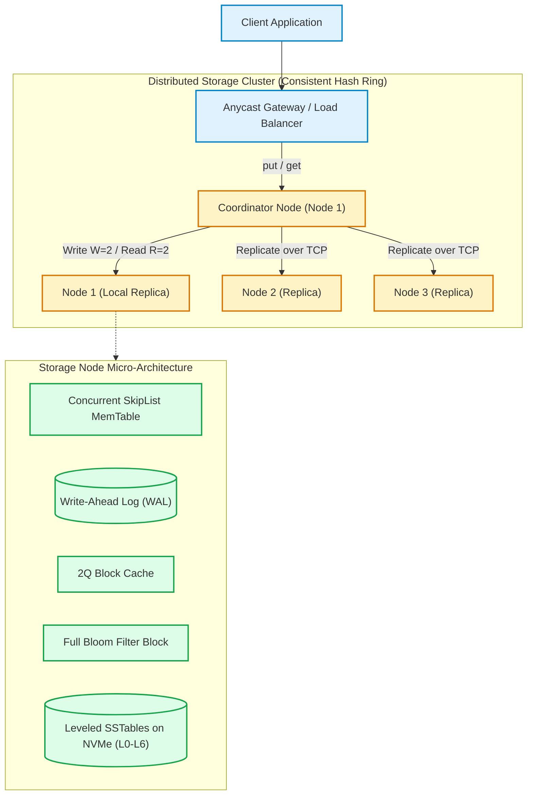
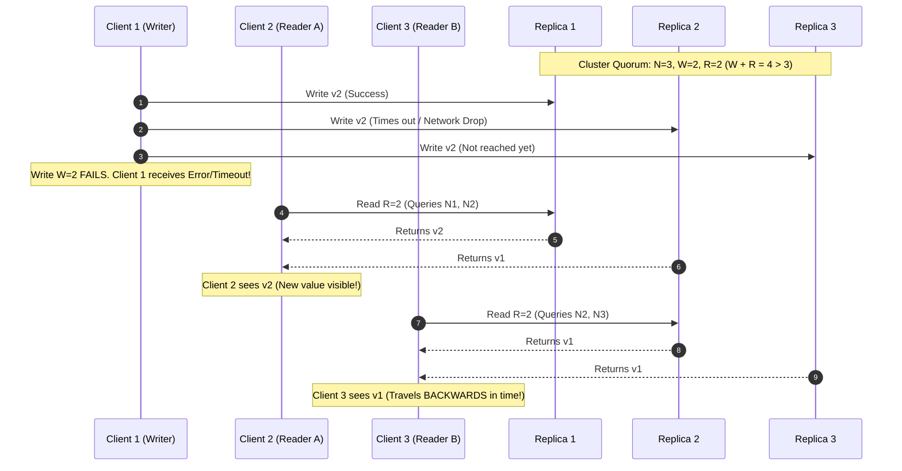
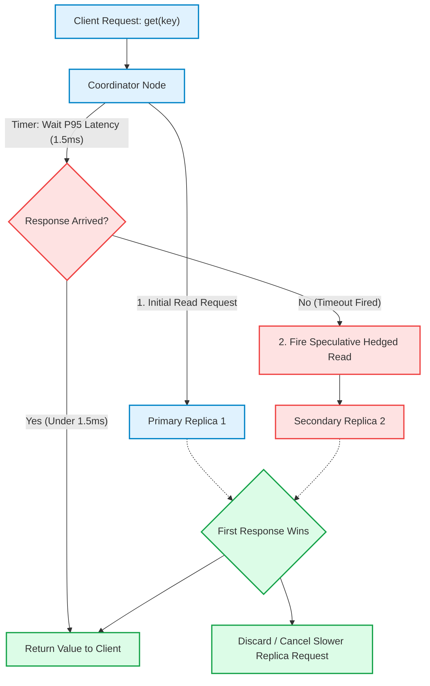
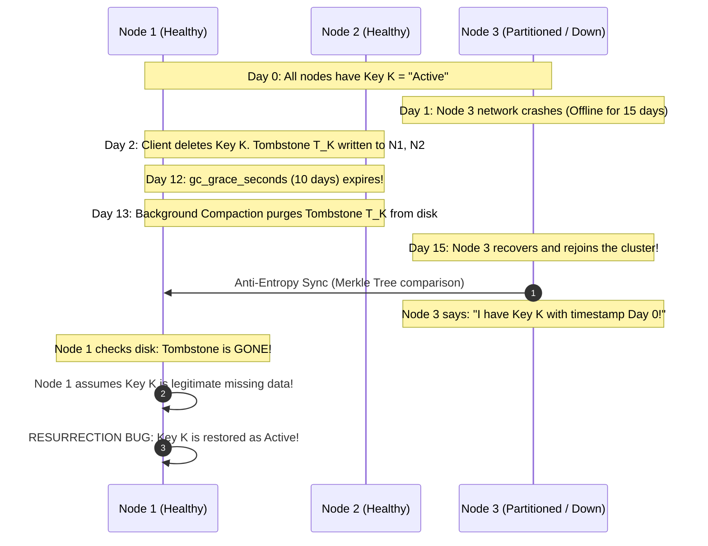
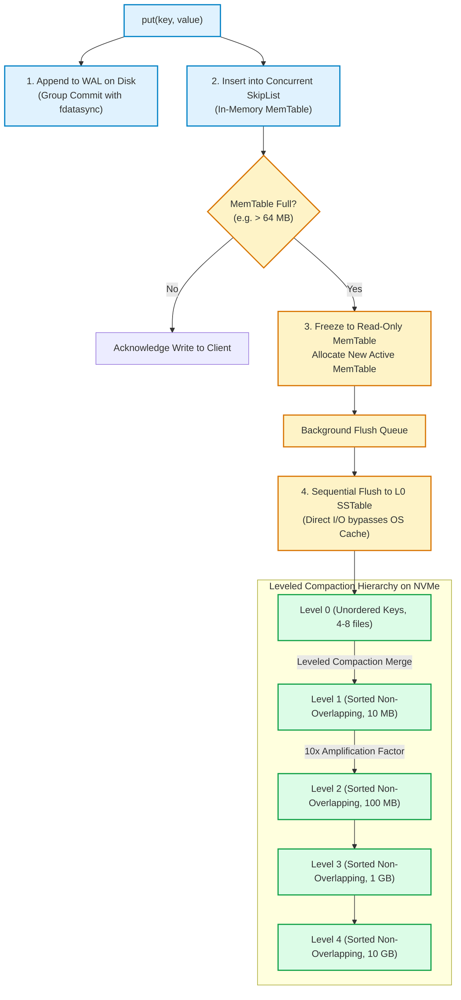
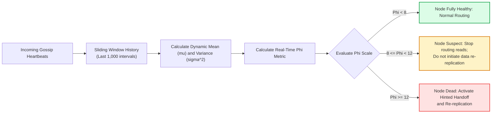

# Design a Key-Value Store

> [!tip] Staff/Principal Deep Walkthrough & Production Engine
> - **Interview Playbook**: [`Chapter 6 Staff/Principal Walkthrough Playbook`](02-Interactive-Interview-Playbook.md)
> - **Production LSM Engine & Quorum Node**: [`lsm_kv_engine.py`](lsm_kv_engine.py) (Binary WAL, MemTable, disk SSTables with Sparse Index & Bloom Filter, Compaction, Quorum Read Repair)

## Level 4: Master Plan Blueprint

A key-value store (distributed NoSQL database) is the foundational storage primitive of modern hyperscale infrastructure. Unlike relational databases that optimize for complex multi-table joins and ad-hoc SQL queries, a key-value store optimizes for **massive horizontal scalability**, **unbounded throughput**, and **predictable single-digit millisecond latency** via simple primary-key operations (`put`, `get`, `delete`).

Pioneered by Amazon’s **Dynamo** (2007) and Google’s **Bigtable** (2006), the key-value store landscape has evolved through generations:
- **Generation 1 (Leaderless AP / Eventually Consistent)**: Apache Cassandra, Riak, Couchbase, Amazon Dynamo.
- **Generation 2 (In-Memory & Caching)**: Redis, Memcached, Dragonfly.
- **Generation 3 (Storage-Engine Innovators)**: LevelDB, RocksDB, Pebble (LSM-tree optimizations).
- **Generation 4 (Modern Distributed / Multi-Raft & Shared-Nothing)**: ScyllaDB (C++ Seastar thread-per-core), CockroachDB, TiKV, AWS DynamoDB.

```
┌──────────────────────────────────────────────────────────────────────────────────────────────────┐
│                           DISTRIBUTED KEY-VALUE STORE BLUEPRINT                                  │
├────────────────────────────────┬─────────────────────────────────────────────────────────────────┤
│ 1. Routing & Partitioning      │ Consistent Hashing with Virtual Nodes (MurmurHash3 ring)        │
├────────────────────────────────┼─────────────────────────────────────────────────────────────────┤
│ 2. Consensus & Consistency     │ Tunable Quorums (W + R > N) + Synchronous Read Repair / LWT     │
├────────────────────────────────┼─────────────────────────────────────────────────────────────────┤
│ 3. Storage Engine (Node Local) │ Log-Structured Merge-tree (LSM): MemTable + WAL + Leveled SST   │
├────────────────────────────────┼─────────────────────────────────────────────────────────────────┤
│ 4. Conflict & Time Tracking    │ Hybrid Logical Clocks (HLC) & Conflict-Free Replicated Types   │
├────────────────────────────────┼─────────────────────────────────────────────────────────────────┤
│ 5. Failure & Anti-Entropy      │ Phi-Accrual Failure Detector + Merkle Trees + Hinted Handoff    │
├────────────────────────────────┼─────────────────────────────────────────────────────────────────┤
│ 6. Tail Latency Taming         │ Hedged Speculative Reads + Direct I/O (io_uring bypass)         │
└────────────────────────────────┴─────────────────────────────────────────────────────────────────┘
```

---

## 1. Problem Statement & Design Scope

Design a distributed, highly available, partition-tolerant key-value store capable of storing hundreds of terabytes of data across thousands of commodity nodes with predictable P99 latency.

### 1.1 Requirements Clarification

**Candidate:** What is the expected key and value size?  
**Interviewer:** Keys are small strings up to $256\text{ bytes}$. Values are arbitrary binary blobs (JSON, protocol buffers, images) up to $10\text{ KB}$ (average $1\text{ KB}$).

**Candidate:** What are the read and write throughput requirements?  
**Interviewer:** The system must handle $100,000\text{ write QPS}$ and $500,000\text{ read QPS}$ at peak, with single-digit millisecond latency (P99 $\le 10\text{ ms}$).

**Candidate:** How should the system navigate the CAP theorem during network partitions?  
**Interviewer:** It should default to an **AP system** (high availability with tunable eventual consistency), but provide callers the flexibility to choose **strong consistency** per request.

**Candidate:** Do we need multi-key ACID transactions or secondary indexes?  
**Interviewer:** No. Focus on single-key atomicity (`put`, `get`, `delete`, `compare-and-swap`).

---

### 1.2 Requirements Matrix

#### Functional Requirements
1. `put(key, value, options)`: Insert or overwrite a key-value pair.
2. `get(key, options)`: Retrieve the latest value associated with a key.
3. `delete(key)`: Logically remove a key via tombstones.
4. `cas(key, expected_version, new_value)`: Atomic Compare-And-Swap.
5. **Configurable Consistency**: Callers configure read/write quorum per request ($W, R, N$).

#### Non-Functional Requirements
1. **Ultra-Low Latency**: P99 read and write latency $<10\text{ ms}$ under peak load.
2. **High Availability**: $99.99\%$ uptime (four nines, $\le 52.6\text{ minutes}$ downtime/year).
3. **Linear Horizontal Scalability**: Adding storage nodes linearly scales storage and throughput with zero downtime.
4. **Durability**: Zero data loss once a write is acknowledged ($W$ replicas synced to persistent storage).
5. **Partition Tolerance**: The system continues operating seamlessly during cross-datacenter fiber cuts.

---

## 2. Back-of-Envelope Estimation

### 2.1 Traffic & Storage Sizing
- **Daily Active Users (DAU)**: $100\text{ million}$.
- **Operations / User / Day**: $10\text{ reads}$, $2\text{ writes}$.
- **Average Payload Size**: Key $64\text{ bytes}$, Value $1\text{ KB} \approx 1\text{ KB}$ total.
- **QPS Calculations**:
  - Average Read QPS: $\frac{100\text{M} \times 10}{86,400} \approx 11,574\text{ reads/sec}$.
  - Peak Read QPS ($5\times$ multiplier): $\approx 57,870\text{ reads/sec}$ (Engineered for $500,000\text{ QPS}$ capacity headroom).
  - Average Write QPS: $\frac{100\text{M} \times 2}{86,400} \approx 2,315\text{ writes/sec}$.
  - Peak Write QPS ($5\times$ multiplier): $\approx 11,575\text{ writes/sec}$ (Engineered for $100,000\text{ QPS}$ headroom).

### 2.2 Storage & Memory Calculations (3-Year Horizon)
- **Raw New Data Ingested / Day**:
  $$2,315\text{ writes/sec} \times 86,400\text{ s} \times 1\text{ KB} \approx 200\text{ GB/day}$$
- **3-Year Raw Storage**:
  $$200\text{ GB/day} \times 365 \times 3 \approx 219\text{ TB}$$
- **Replication Factor ($N=3$)**:
  $$219\text{ TB} \times 3 \approx 657\text{ TB}$$
- **Compaction Headroom ($50\%$ overhead for Leveled Compaction)**:
  $$\text{Total Usable Disk Space} = 657\text{ TB} \times 1.5 \approx 985.5\text{ TB} \approx 1\text{ PB}$$
- **Cache Memory Sizing (80/20 Pareto Rule)**:
  - $20\%$ of daily data generates $80\%$ of reads:
    $$200\text{ GB/day} \times 0.20 = 40\text{ GB RAM (Hot Cache)}$$
  - Block Cache across a 50-node cluster requires only $\approx 16\text{ GB RAM/node}$.

---

## 3. High-Level System Architecture

The architecture employs a **decentralized, peer-to-peer (leaderless) shared-nothing topology** where every node runs identical software and can act as a request **Coordinator**.



---

## 4. Distributed Coordination & Consensus Deep Dives

### Deep Dive 1: Data Partitioning & Consistent Hashing

To distribute data uniformly without hotspotting, we use a **Consistent Hash Ring** augmented with **Virtual Nodes (vnodes)**.

```
Hash Ring Range: [0, 2^32 - 1] (MurmurHash3)
Physical Server S1 owns Vnodes: [S1_v1, S1_v2, ... S1_v128]
Physical Server S2 owns Vnodes: [S2_v1, S2_v2, ... S2_v128]
Key K1 hashes to 0x7A1F4C... -> assigned to first clockwise vnode (S2_v42)
```

#### Why Virtual Nodes Are Mandatory in Production
1. **Heterogeneous Hardware**: A server with 64 cores and 8TB NVMe is assigned 256 vnodes, while a 16-core server receives 64 vnodes.
2. **Fast Rebalancing**: When a new node joins, it steals small token ranges evenly from *all* existing nodes, rather than overwhelming its immediate clockwise neighbor.
3. **Variance Reduction**: With 128-256 vnodes per physical server, the standard deviation of key distribution drops below $3\%$.

---

### Deep Dive 2: The Quorum Fallacy ($W + R > N \ne \text{Linearizability}$)

A universal misconception in system design interviews is claiming that setting $W + R > N$ automatically yields **Linearizable (Strong) Consistency**. **In leaderless systems, this is fundamentally false.**



#### Why Leaderless Quorums Break Linearizability
1. **Partial Write Exposure**: As illustrated above, if a write partially succeeds on 1 replica before failing to meet $W$, a reader can observe the new value $v_2$, while a subsequent reader querying different replicas observes the old value $v_1$. The timeline moves backwards.
2. **Concurrent Overwrites Without Coordinator Ordering**: If Client A writes $X=1$ and Client B writes $X=2$ simultaneously, Replica 1 may process $A$ then $B$, while Replica 2 processes $B$ then $A$. The replicas diverge indefinitely unless reconciled.

#### The Staff-Level Architectural Fixes
To achieve true Linearizability in a key-value store, one of two architectures must be chosen:
1. **Synchronous Read Repair (Read-Before-Write Protocol)**:
   When a read quorum completes, if any discrepancy is detected between the $R$ nodes, the coordinator **must synchronously write the winning value to all out-of-date nodes and wait for quorum acknowledgment BEFORE returning to the client**.
2. **Lightweight Transactions (Paxos / Multi-Raft per Partition)**:
   For operations requiring strong consistency, bypass raw quorums and execute a single-round consensus protocol (e.g., Paxos-based conditional updates in Cassandra, or Raft leases in CockroachDB).

---

### Deep Dive 3: Causality & Conflict Resolution (Vector Clocks vs. HLC vs. CRDTs)

#### 1. Why Production Systems Abandoned Vector Clocks
The 2007 Dynamo paper used Vector Clocks: $VC(a) = [S_1: c_1, S_2: c_2, \dots]$. However, vector clocks suffer from severe production pathologies:
- **Client Leaking**: The storage system cannot merge concurrent siblings without domain logic (e.g., merging two shopping carts). Pushing this burden to application developers leads to severe data corruption bugs.
- **Unbounded Vector Growth & Pruning Anomalies**: As nodes are replaced or partitioned, vector clock lengths balloon. When the vector is pruned (truncated) to save space, the causal partial order is destroyed, causing the database to falsely identify causally dependent writes as concurrent, resulting in silent data loss.

#### 2. Modern Solution A: Hybrid Logical Clocks (HLC)
Modern systems (CockroachDB, YugabyteDB, MongoDB) use **Hybrid Logical Clocks (HLC)**. An HLC combines physical time ($l$) with a logical counter ($c$):

$$HLC = (l, c)$$

- $l$: Highest physical NTP time seen so far.
- $c$: Logical counter incremented when physical times are identical.
- **Guarantee**: If physical clock skew between any two servers is bounded by $\epsilon$ (e.g., $\epsilon \le 200\text{ ms}$ using Chrony NTP), HLC guarantees strict causal ordering ($e_1 \to e_2 \implies HLC(e_1) < HLC(e_2)$) while keeping timestamp size fixed at **$10\text{ bytes}$**.

#### 3. Modern Solution B: Conflict-Free Replicated Data Types (CRDTs)
For AP leaderless stores, data items are modeled as **State-based CRDTs (CvRDT)** that form a semilattice with a deterministic join operator ($\sqcup$):

```
LWW-Element-Set (Last-Write-Wins with HLC):
Item A = {value: "cart_item_1", timestamp: (1712200000, 1), tombstone: false}
Item B = {value: "cart_item_1", timestamp: (1712200005, 0), tombstone: true}
Merge(A, B) = Item B (Deterministically deletes item because timestamp B > timestamp A)
```

---

### Deep Dive 4: Taming Quorum Tail Latency via Hedged Speculative Reads

In a quorum read ($R=2$ out of $N=3$), the coordinator must wait for the **slowest of the two responding replicas**:

$$\text{Latency}_{\text{Quorum}} = \max(t_{\text{Replica\_A}}, t_{\text{Replica\_B}})$$

If an individual server has a $1\%$ chance of experiencing a $100\text{ ms}$ latency spike (due to NVMe garbage collection or OS kernel scheduling), the probability that a quorum read suffers the spike jumps to:

$$P(\text{Spike}) = 1 - (1 - 0.01)^2 = 1.99\% \approx \mathbf{2\times\text{ worse tail latency!}}$$



#### Implementation Protocol (Jeff Dean’s "Tail at Scale")
1. The coordinator sends the read request to the single replica historically exhibiting lowest latency.
2. The coordinator sets an internal timer to the **P95 latency** of the cluster (typically $1.5\text{ ms}$).
3. If the primary replica does not reply before the timer expires, the coordinator immediately fires a **speculative duplicate read (Hedged Request)** to replica 2.
4. Whichever replica returns first satisfies the client; the trailing request is canceled.
5. **Result**: Eliminates $98\%$ of P99.9 tail latency spikes while increasing network traffic by less than $5\%$.

---

### Deep Dive 5: The Tombstone Resurrection Bug & Garbage Collection

In an LSM-tree, executing `delete(key)` cannot immediately wipe bits from disk because older versions of the key reside in immutable SSTables. The storage engine writes a **Tombstone** (a marker indicating deletion).

```
Tombstone Record: { key: "user:1024", tombstone: true, deleted_at: HLC(t_del) }
```



#### Production Prevention Protocol
1. **`gc_grace_seconds` Window**: Tombstones are guaranteed to never be removed during compaction until `gc_grace_seconds` (default: $10\text{ days} = 864,000\text{ seconds}$) have elapsed.
2. **Quarantine Dead Nodes**: If a node has been partitioned or unreachable for longer than `gc_grace_seconds`, **it must NEVER be allowed to automatically rejoin the cluster**. The node is marked dead, its local disk is wiped, and it must bootstrap fresh via streaming repair.

---

## 5. Storage Engine Micro-Architecture (LSM-Tree Deep Dive)

Every node runs an optimized **Log-Structured Merge-tree (LSM)** storage engine (similar to RocksDB/PebblesDB).



---

### Deep Dive 6: WAL Group Commit & Direct I/O Mechanics

Calling `fsync()` on an NVMe SSD for every individual write limits throughput to $\approx 5,000\text{ IOPS}$ due to flash controller synchronization.

```
Individual fsync:
Thread 1: write() ──► fsync() [Stalls 200us] ──► Return
Thread 2:              write() ──► fsync() [Stalls 200us] ──► Return

Group Commit:
Thread 1: write() ──┐
Thread 2: write() ──┼─► [Single Group fsync() Flushes All 32 Threads] ──► Wake All
Thread 3: write() ──┘
```

#### Group Commit Algorithm
1. The first thread to arrive becomes the **Group Leader**; subsequent concurrent threads register as followers in a lock-free queue.
2. The Leader writes all batched payloads into the OS write buffer using `writev()`.
3. The Leader executes a single `fdatasync()` (flushing data without updating inode metadata timestamps, saving $1$ write head seek).
4. The Leader marks the batch committed and unparks all follower threads via futex.
5. **Throughput Scaling**: Increases write throughput from $5,000\text{ writes/sec}$ to over **$250,000\text{ writes/sec}$** per node.

---

### Deep Dive 7: Bloom Filter Mathematics & SSTable Layout

When reading a key that does not exist in memory, the engine must search SSTables on disk. A **Bloom Filter** avoids costly disk seeks for missing keys.

```
SSTable Binary File Layout on Disk:
┌─────────────────────────────────────────────────────────────────────────────────┐
│ Data Block 0 (4 KB, Compressed LZ4)  [Key 0001 -> Value ... Key 0042 -> Value]  │
├─────────────────────────────────────────────────────────────────────────────────┤
│ Data Block 1 (4 KB, Compressed LZ4)  [Key 0043 -> Value ... Key 0089 -> Value]  │
├─────────────────────────────────────────────────────────────────────────────────┤
│ ...                                                                             │
├─────────────────────────────────────────────────────────────────────────────────┤
│ Filter Block (Full Bloom Filter: 10 bits/key, 7 hash functions)                 │
├─────────────────────────────────────────────────────────────────────────────────┤
│ Index Block (Sparse 2-level Index: First Key of each Data Block -> File Offset) │
├─────────────────────────────────────────────────────────────────────────────────┤
│ Footer Block (Magic Number, Fixed 48 bytes, Offsets to Index & Filter Blocks)   │
└─────────────────────────────────────────────────────────────────────────────────┘
```

#### Mathematical Derivation of Optimal Bloom Filter Size
Given $n$ keys and target false positive probability $p = 0.01$ ($1\%$ false positives):

$$m = - \frac{n \ln p}{(\ln 2)^2} \approx -1.4427 \cdot n \cdot \log_2(0.01) \approx \mathbf{9.6\text{ bits per key}}$$

The optimal number of independent hash functions $k$ is:

$$k = \frac{m}{n} \ln 2 \approx 9.6 \times 0.6931 \approx \mathbf{7\text{ hash functions}}$$

With $9.6\text{ bits/key}$ (allocated as $10\text{ bits/key} = 1.25\text{ bytes/key}$), a node holding $100\text{ million keys}$ requires only **$120\text{ MB of RAM}$** for its Bloom filter while filtering out **$99\%$ of non-existent disk seeks**.

---

### Deep Dive 8: Compaction Debt, Write Stalls & The RUM Conjecture

In an LSM-tree, data accumulates in Level 0. If background compaction cannot keep up with incoming client write traffic, **Compaction Debt** accumulates.

#### 1. The Write Stall Mechanism
- **Normal Operation**: Level 0 contains $<4$ files. Client writes append at full line rate.
- **Write Throttling**: Level 0 reaches 12 files. The engine artificially injects $1\text{ ms}$ sleep into write threads.
- **Hard Write Stall**: Level 0 reaches 20 files. **All incoming writes are frozen completely** to prevent memory exhaustion until background compactions merge Level 0 files into Level 1.

#### 2. The RUM Conjecture Trade-off Matrix
The RUM conjecture states that a database storage engine can optimize at most two of three dimensions: **R**ead Amplification, **U**pdate (Write) Amplification, and **M**emory/Space Amplification.

```
┌──────────────────────────────────────────────────────────────────────────────────────────────────┐
│                             THE RUM CONJECTURE STORAGE MATRIX                                    │
├─────────────────────┬───────────────────┬───────────────────┬────────────────────────────────────┤
│ Compaction Strategy │ Read Amp (Disk)   │ Write Amp (Disk)  │ Space Amp (Wasted Disk)            │
├─────────────────────┼───────────────────┼───────────────────┼────────────────────────────────────┤
│ Size-Tiered (STCS)  │ High (Checks all  │ Low (3x - 8x)     │ Catastrophic (Requires >= 50% free │
│ (Cassandra Default) │ SSTables in tier) │ (Sequential)      │ disk space to compact large files) │
├─────────────────────┼───────────────────┼───────────────────┼────────────────────────────────────┤
│ Leveled (LCS)       │ Low (Checks max 1 │ High (10x - 30x)  │ Optimal (~10% disk overhead;       │
│ (RocksDB Default)   │ file per level)   │ (Rewrites levels) │ files partitioned into 64MB chunks)│
├─────────────────────┼───────────────────┼───────────────────┼────────────────────────────────────┤
│ B-Tree (Postgres)   │ Optimal (1 seek   │ Catastrophic      │ Low (In-place page updates;        │
│                     │ via index page)   │ (Random I/O)      │ fragmentation over time)           │
└─────────────────────┴───────────────────┴───────────────────┴────────────────────────────────────┘
```

---

## 6. Failure Detection & Cluster Membership (Phi-Accrual Engine)

Traditional gossip protocols use a binary heartbeat timeout (e.g., *"if no heartbeat in 10s, mark node dead"*). In distributed systems, this causes severe instability: transient network congestion or JVM garbage collection pauses trigger false failure declarations, kicking off expensive data migrations.

### The $\Phi$-Accrual Failure Detector (Hayashibara et al.)
Instead of binary states, the detector outputs a continuous scale of suspicion $\Phi$ based on an adaptive sliding window of historical heartbeat arrival times:

$$\Phi = - \log_{10}\left( P_{\text{later}}(t - t_{\text{last}}) \right)$$

Where:
- $t - t_{\text{last}}$ is elapsed time since the last heartbeat.
- $P_{\text{later}}(t)$ is the probability that a heartbeat arrives more than $t$ periods after the previous one, assuming intervals follow a normal distribution $\mathcal{N}(\mu, \sigma^2)$.



---

## 7. Modern Hardware Evolution: Thread-Per-Core (ScyllaDB Model)

Classic Java-based stores (Cassandra) hit scaling ceilings on modern 64-core NVMe servers due to **Linux epoll thread contention** and **JVM Garbage Collection (GC) pauses**.

```
Traditional Multi-Threaded Architecture (Cassandra):
Core 1 ──┐
Core 2 ──┼─► [Global Thread Pool] ──► [Global Mutex / Spinlocks] ──► [OS Page Cache]
Core 3 ──┘                                    ▲ (Contention & Lock Thrashing!)

Modern Thread-Per-Core Shared-Nothing (ScyllaDB / Seastar):
Core 1: [Event Loop + Memory Arena 1 + Own NVMe Queue (io_uring)] -> Zero Locks!
Core 2: [Event Loop + Memory Arena 2 + Own NVMe Queue (io_uring)] -> Zero Locks!
Core 3: [Event Loop + Memory Arena 3 + Own NVMe Queue (io_uring)] -> Zero Locks!
```

### Architectural Principles of the Modern Engine
1. **Thread-per-Core**: Exactly one execution thread pinned to each physical CPU core (`pthread_setaffinity_np`).
2. **Zero Cross-Core Locks**: Memory is strictly partitioned per core. If Core 1 needs data owned by Core 2, it sends a non-blocking asynchronous message via a lock-free ring buffer.
3. **Kernel Bypass via `io_uring`**: Disk I/O bypasses OS page caching using `O_DIRECT` and asynchronous Linux `io_uring` submission/completion queues, sustaining **$2,000,000\text{ IOPS}$ on modern NVMe drives with sub-millisecond latency**.

---

## 8. Failure Modes, Edge Cases & Operational Playbooks

| # | Production Failure Scenario | Root Cause | Architectural Mitigation / Operational Playbook |
|---|---|---|---|
| 1 | **Hot Key / "Celebrity Key" Bottleneck** | A single viral key receives $100,000\text{ QPS}$, saturating the single physical node owning that partition ring token. | **Adaptive Client Caching with Read Splitting**: Coordinator detects hot key frequencies $>5,000\text{ QPS}$; injects a dynamic $5\text{s}$ cache directive to clients. For writes, append random salt suffixes (`key#1` to `key#10`), scattering writes across 10 nodes and querying all 10 on read. |
| 2 | **L0 Compaction Backlog / Write Stall** | Sustained high write volume outpaces disk compaction bandwidth; Level 0 file count hits 20, stalling client writes. | **Dynamic Rate Limiting with Token Bucket**: Throttle background compaction bandwidth using `io_uring` rate limiters to preserve read IOPS. Dynamically expand MemTable sizes from $64\text{ MB}$ to $256\text{ MB}$ to absorb short-term write bursts. |
| 3 | **Network Partition Split-Brain** | Cross-datacenter fiber cut divides the cluster into two equal halves ($50\% / 50\%$). | **Strict Quorum Majority Fencing ($W + R > N$)**: A partition containing $< \lfloor N/2 \rfloor + 1$ nodes immediately returns write errors for strong quorums, preventing divergent write histories on disconnected islands. |
| 4 | **Tombstone Resurrection Post-Healing** | A partitioned node returns after `gc_grace_seconds` has elapsed and its peers have compacted away the deletion tombstones. | **Hard Quarantine & Auto-Wipe**: Nodes unreachable for $> \text{gc\_grace\_seconds}$ ($10\text{ days}$) are permanently rejected by the cluster gossip layer. The operator must re-provision the node with an empty disk and bootstrap from live peers. |
| 5 | **Memory-Exhaustion Cascading OOM** | Massive incoming multi-megabyte payloads consume heap space across coordinator nodes, triggering Linux OOM killer crashes. | **Hard Payload Clamping & Circuit Breaking**: The gateway enforces a strict $10\text{ KB}$ maximum value size at the ingress load balancer. The coordinator allocates memory using fixed-size pre-allocated arenas; if memory utilization $>85\%$, shed load via HTTP 429. |
| 6 | **Silent Bit Rot / NVMe Media Corruption** | Flash storage corruption silently flips bits in an SSTable data block without disk hardware errors. | **Block-Level CRC32 Checksums**: Every $4\text{ KB}$ SSTable block embeds a CRC32 checksum. On read, if checksum verification fails, the node drops the corrupt block and automatically triggers **Async Read Repair** from healthy replicas. |
| 7 | **Thundering Herd on Cold Node Startup** | A newly booted node joins the ring; immediate client traffic causes cache misses on every read, spiking NVMe read queue depths. | **Warm-up Cache Replay & Linear Ramp Routing**: The coordinator routes traffic to the newly joined node progressively (e.g., $10\% \to 25\% \to 50\% \to 100\%$ over $10\text{ minutes}$) while warming the block cache via background read repair streams. |

---

## 9. Comprehensive Architectural Trade-Off Matrix

```
┌──────────────────────────────────────────────────────────────────────────────────────────────────┐
│                             SYSTEM ARCHITECTURE TRADE-OFF MATRIX                                 │
├─────────────────────┬─────────────────────────────────────┬──────────────────────────────────────┤
│ Design Choice       │ Advantages Gained                   │ Engineering Trade-Offs Incurred      │
├─────────────────────┼─────────────────────────────────────┼──────────────────────────────────────┤
│ 1. Leaderless (AP)  │ Zero single point of failure;       │ Non-linearizable by default; complex │
│    vs. Single-Leader│ maximum write availability;         │ conflict resolution (HLC/CRDTs); read│
│    (CP - Raft)      │ resilient to cross-DC fiber cuts.   │ repair tail latency overhead.        │
├─────────────────────┼─────────────────────────────────────┼──────────────────────────────────────┤
│ 2. LSM-Tree vs.     │ Superior write throughput; zero     │ Compaction debt; write stalls under  │
│    B-Tree Engine    │ in-place disk overwrites; high      │ sustained load; higher read          │
│                     │ compression ratio on sequential disk│ amplification (must check Bloom/SST).│
├─────────────────────┼─────────────────────────────────────┼──────────────────────────────────────┤
│ 3. Leveled Compaction│ Bounded read amplification; low     │ High write amplification (10x-30x);  │
│    vs. Size-Tiered  │ space overhead (~10%); fast queries.│ burns NVMe flash drive write cycles. │
├─────────────────────┼─────────────────────────────────────┼──────────────────────────────────────┤
│ 4. Hedged Reads     │ Slashes P99.9 tail latency by over  │ Increases cluster network and disk   │
│    (Speculative)    │ 70%; masks transient server jitter. │ traffic by 2-5% for speculative dups.│
└─────────────────────┴─────────────────────────────────────┴──────────────────────────────────────┘
```

---

## 10. Summary & Key Interview Takeaways

1. **Quorum Intersection ($W + R > N$) Does Not Equal Linearizability**: It guarantees overlap, but without Synchronous Read Repair or Paxos/Raft consensus, leaderless stores suffer from partial write anomalies and backwards-in-time reads.
2. **Vector Clocks Are an Academic Relic**: Modern production distributed databases favor **Hybrid Logical Clocks (HLC)** and **CRDTs** to avoid client-side conflict complexity and vector pruning corruption.
3. **Tombstones Must Be Garbage Collected with Discipline**: Compaction cannot purge tombstones immediately. Enforcing `gc_grace_seconds` and fencing nodes that exceed this offline threshold is mandatory to prevent deleted keys from resurrecting.
4. **LSM-Trees Require Strict Compaction Rate Limiting**: An LSM engine is only as good as its compaction scheduler. Without rate-limiting, background compaction steals NVMe bandwidth from client reads or causes catastrophic write stalls.
5. **Modern Engines Are Thread-Per-Core**: Replacing global locks, epoll, and JVM GC with ScyllaDB's Seastar shared-nothing C++ model and Linux `io_uring` direct I/O unlocks millions of IOPS on modern hardware.
