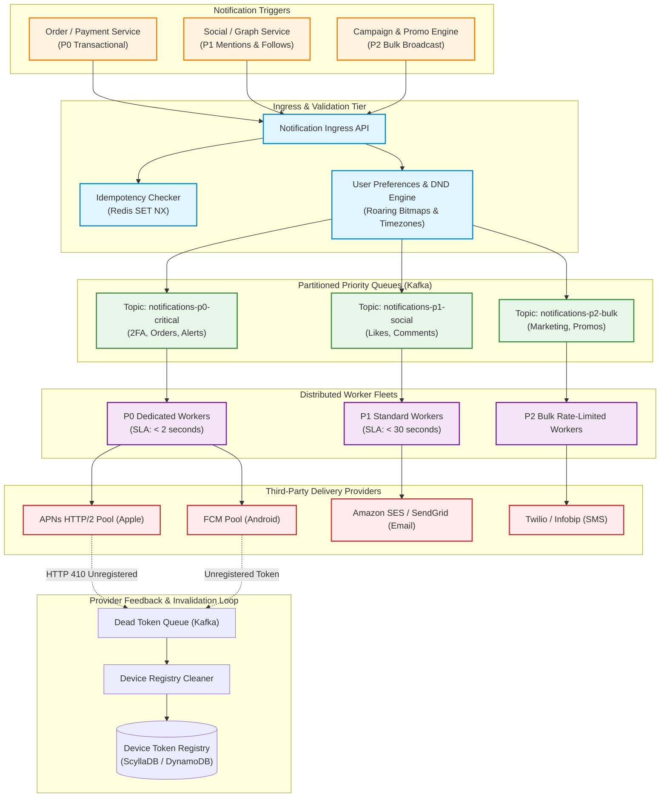
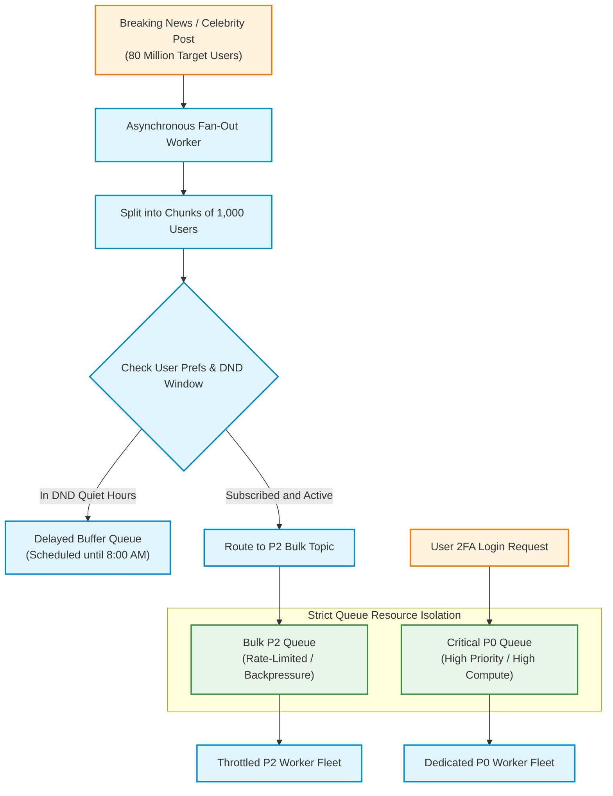
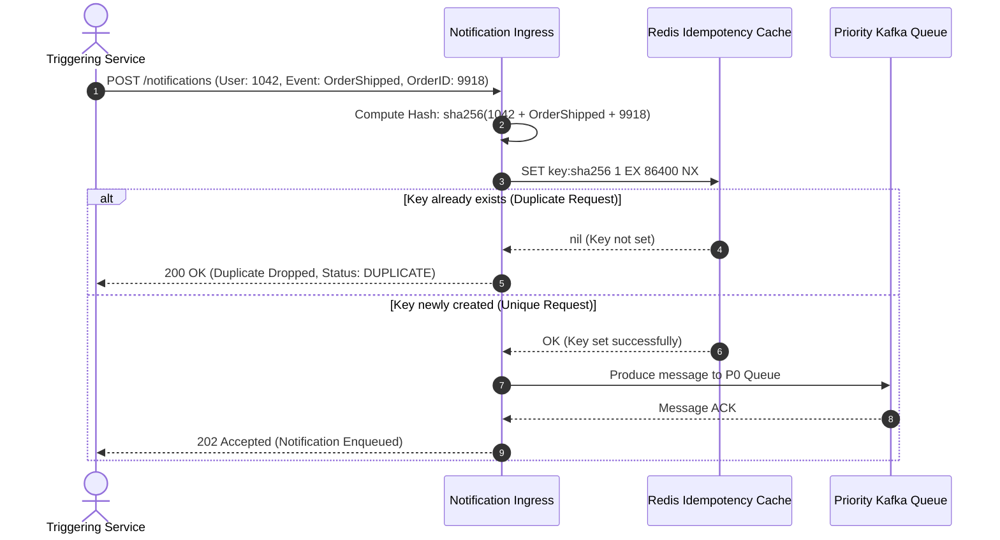
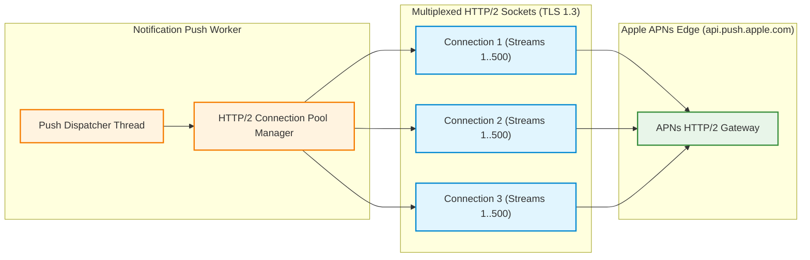
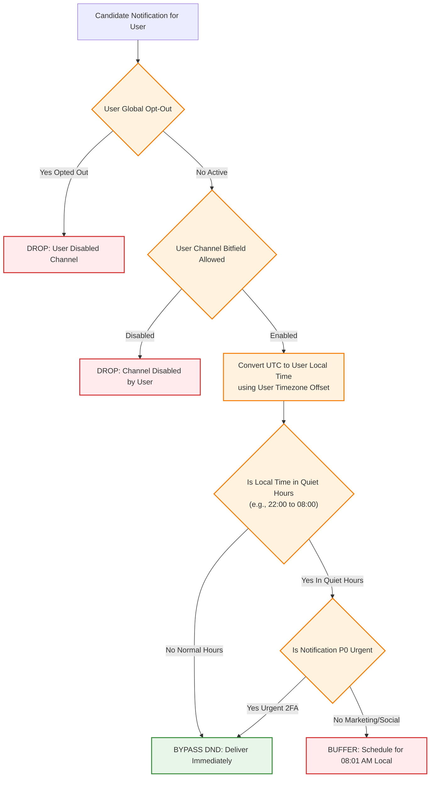
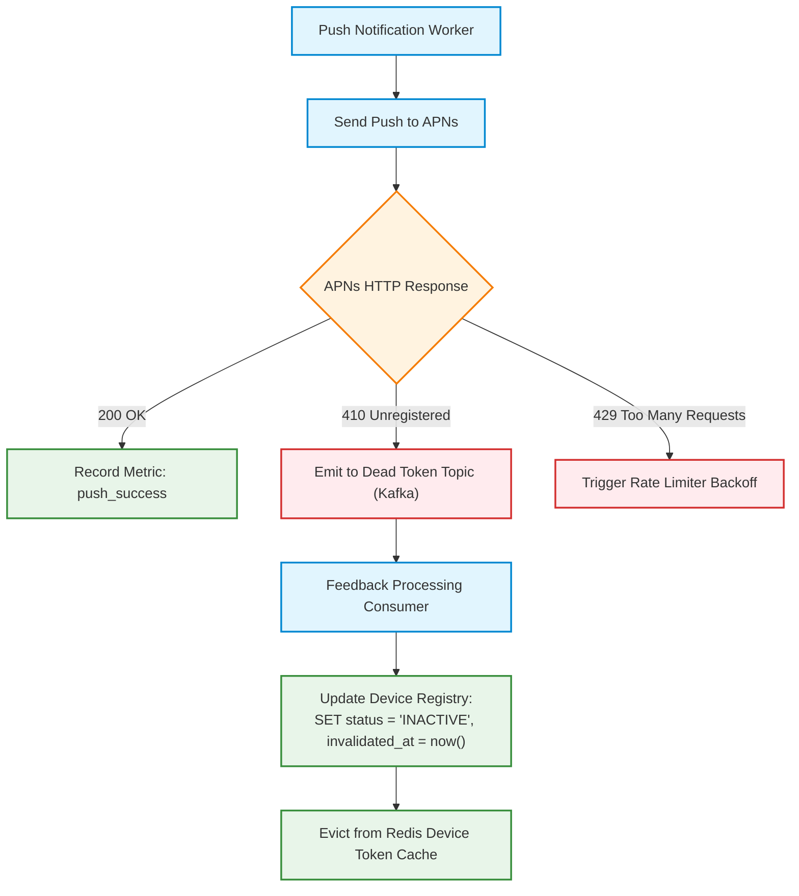

# Design a Multi-Channel Notification Platform at Hyperscale (Push, SMS, Email)

> [!tip] Staff/Principal Deep Walkthrough & Production Service
> - **Interview Playbook**: [`Chapter 7 Staff/Principal Walkthrough Playbook`](02-Interactive-Interview-Playbook.md)
> - **Production Notification Engine & Daemon**: [`notification_service.py`](notification_service.py) (3-Tier Priority Queue, Atomic Idempotency Guard, Timezone DND Scheduler, Provider Circuit Breakers)

## 1. Problem Statement & Motivation

A **Notification Platform** is a mission-critical infrastructure tier responsible for delivering timely, personalized messages to hundreds of millions of users across diverse physical and digital communication channels:
- **Mobile Push Notifications**: Apple Push Notification service (APNs for iOS/macOS) and Firebase Cloud Messaging (FCM for Android).
- **Transactional & Marketing Email**: High-deliverability SMTP/API pipelines (Amazon SES, SendGrid, Mailgun).
- **Short Message Service (SMS) & Messaging Apps**: Telecommunications aggregators (Twilio, Infobip, Sinch, WhatsApp Business API).
- **In-App & WebSockets**: Ephemeral real-time notifications for active desktop/mobile browser sessions.

```
Trigger Event ──► [ Ingress Gateway ] ──► [ Priority Queues ] ──► [ Worker Fleets ] ──► [ Providers (APNs/FCM/SES) ] ──► User Device
```

### The 4 Hyperscale Distributed Systems Fallacies

1. **The Fan-Out Avalanche & Priority Inversion**:
   - When a major breaking news alert or a celebrity post (e.g., 80 million followers) triggers a broadcast, naive systems enqueue millions of marketing messages into shared queues. These low-priority messages starve **mission-critical P0 transactional alerts** (e.g., 2FA verification codes, password reset tokens, fraud detection notices), leading to catastrophic business SLA violations.
2. **The Provider Throttling & Connection Dropping Trap**:
   - Upstream third-party providers enforce strict throughput and connection limits. For example, Apple's APNs requires persistent **HTTP/2 multiplexed connections**. Opening and tearing down a new TLS connection for every push notification results in Apple actively terminating sockets and blacklisting sender IP ranges.
3. **The At-Least-Once Duplicate Notification Disaster**:
   - Message brokers (Kafka, RabbitMQ, SQS) provide **at-least-once delivery guarantees**. During worker crashes or network blips, re-delivered messages can trigger duplicate 2FA codes, repeated credit card charge alerts, or spammy marketing notifications, permanently degrading user trust.
4. **The Stale Device Token Leak**:
   - Users frequently uninstall mobile applications, switch phones, or revoke notification permissions. Continuing to dispatch push payloads to dead device tokens wastes millions of dollars in compute/network egress and triggers **reputation score penalties from Apple and Google**.

---

## 2. Requirements Clarification & System Scope

### Candidate-Interviewer Alignment Dialog

**Candidate:** What is the daily notification volume across our communication channels?  
**Interviewer:** Baseline for **500 million Daily Active Users (DAU)**. The system must process **500 million mobile push notifications**, **50 million emails**, and **10 million SMS messages** per day, with peak spikes during breaking events.

**Candidate:** What latency SLAs must we maintain for different message categories?  
**Interviewer:** Enforce strict priority tiers:
- **P0 Critical (Transactional/Security)**: $P_{99} < 2\text{ seconds}$ delivery latency (2FA codes, payment receipts, account takeovers).
- **P1 Social (Direct Interactions)**: $P_{99} < 30\text{ seconds}$ (direct messages, comment mentions, follower alerts).
- **P2 Bulk (Marketing/Promotions)**: Soft real-time (can be delayed hours, respecting local timezone quiet hours).

**Candidate:** How should we handle user notification preferences and privacy opt-outs?  
**Interviewer:** Users must be able to fine-tune preferences per channel and category (e.g., "Allow SMS for security, but disable marketing push"). Additionally, the system must enforce **Do-Not-Disturb (DND) quiet hours** based on each user's local timezone.

### Functional Requirements (FR)

| ID | Requirement | Description |
|:---|:---|:---|
| **FR-1** | **Multi-Channel Orchestration** | Dispatches messages across APNs (iOS), FCM (Android), Email (SES), SMS (Twilio), and WebSockets. |
| **FR-2** | **Strict Priority Isolation** | Separates traffic into isolated P0 (Critical), P1 (Social), and P2 (Bulk) queues to prevent head-of-line blocking. |
| **FR-3** | **Idempotent Delivery** | Deduplicates incoming trigger events via distributed Redis locks, guaranteeing zero duplicate deliveries. |
| **FR-4** | **Timezone-Aware DND Scheduling** | Evaluates user local time and defers non-critical notifications outside the 08:00–22:00 active window. |
| **FR-5** | **Dynamic Template Interpolation** | Ingests localized templates with parameter substitution and rich media attachment support. |
| **FR-6** | **Provider Feedback Cleanup** | Drains provider failure responses (e.g., APNs 410 Unregistered) to prune dead tokens from the device registry. |

### Non-Functional Requirements (NFR)

| ID | Metric | Target Metric | Architectural Strategy |
|:---|:---|:---|:---|
| **NFR-1** | **Peak Throughput** | $\ge 50,000\text{ QPS}$ sustained peak | Partitioned Apache Kafka message queues + stateless horizontal worker pods. |
| **NFR-2** | **Critical Delivery SLA** | $P_{99} < 2.0\text{ seconds}$ for P0 | Dedicated un-throttled P0 worker pools with pre-warmed HTTP/2 connections. |
| **NFR-3** | **High Availability** | $99.999\%$ uptime | Multi-region active-active deployment with automatic provider failover (e.g., Twilio $\to$ Infobip). |
| **NFR-4** | **Data Durability** | Zero lost critical notifications | Disk-backed Kafka commit logs + transactional dead-letter queues (DLQ). |

---

## 3. Back-of-the-Envelope Capacity Planning & Sizing

### 3.1 Daily Notification Volume & Throughput

- **Total Daily Notifications**:
  $$\text{Total Daily} = 500\text{M Push} + 50\text{M Email} + 10\text{M SMS} = 560,000,000\text{ notifications/day}$$
- **Average Global Throughput**:
  $$\text{QPS}_{\text{avg}} = \frac{560,000,000}{86,400\text{ seconds}} \approx 6,481\text{ notifications/sec}$$
- **Peak Throughput Multiplier**: $8\times - 10\times$ (accounting for morning wake-up alerts, flash sales, breaking global events):
  $$\text{QPS}_{\text{peak}} \approx 6,481 \times 8 \approx 51,850\text{ notifications/sec} \approx 50,000 - 100,000\text{ QPS}$$

---

### 3.2 Payload & Egress Bandwidth Math

| Channel | Daily Count | Average Payload Size | Daily Data Egress | Peak Egress Bandwidth |
|:---|:---:|:---:|:---:|:---:|
| **Push (APNs/FCM)** | $500,000,000$ | $2.0\text{ KB}$ (JSON + Rich Image URL) | $1,000\text{ GB/day}$ | $45,000\text{ QPS} \times 2\text{ KB} \approx 90\text{ MB/s}$ ($720\text{ Mbps}$) |
| **Email (SES)** | $50,000,000$ | $50.0\text{ KB}$ (HTML Body + CSS) | $2,500\text{ GB/day}$ | $4,500\text{ QPS} \times 50\text{ KB} \approx 225\text{ MB/s}$ ($1.8\text{ Gbps}$) |
| **SMS (Twilio)** | $10,000,000$ | $0.2\text{ KB}$ (160 ASCII characters) | $2\text{ GB/day}$ | $900\text{ QPS} \times 0.2\text{ KB} \approx 0.18\text{ MB/s}$ ($1.4\text{ Mbps}$) |
| **Total Fleet** | **$560,000,000$** | **—** | **$\approx 3.5\text{ TB/day}$** | **$\approx 315\text{ MB/s}$ ($\approx 2.52\text{ Gbps}$)** |

---

### 3.3 Storage Sizing (1-Year Audit Log)

Every dispatched notification records an audit log row for billing, compliance, and user history:
- Schema fields: `notification_id` (8B), `user_id` (8B), `channel` (1B), `status` (1B), `provider_id` (16B), `timestamp` (8B), `metadata_json` (250B) $\approx 300\text{ bytes}$.
- **Annual Audit Storage**:
  $$\text{Annual Storage} = 560\text{M/day} \times 365\text{ days} \times 300\text{ bytes} \approx 61.32\text{ TB/year}$$
- With $R = 3$ replication: **$\approx 184\text{ TB}$** in ScyllaDB or Amazon DynamoDB with automated 90-day TTL data tiering to S3 Parquet.

---

## 4. End-to-End System Architecture

The following diagram illustrates the complete hyperscale notification infrastructure, highlighting the strict separation between ingestion, prioritization, rate governance, worker execution, and provider feedback loops:



---

## 5. Priority Queue Isolation & Massive Fan-Out Architecture

When a celebrity with 80 million followers publishes a post, a single trigger event must fan out to 80 million individual devices. In naive architectures, this event dumps 80 million messages into a single queue, starving authentication and payment alerts.



### The 3-Tier Priority SLA Model

| Priority Tier | Typical Workloads | Delivery Target SLA | Compute Resource Allocation | Backpressure Policy |
|:---:|:---|:---:|:---|:---|
| **P0 (Critical)** | 2FA OTP, Password Reset, Payment Alerts, Fraud Warnings | **$< 2\text{ seconds}$** | **$40\%$ of global worker pool**; autoscales aggressively on queue depth $> 100$. | Zero throttling allowed; direct circuit bypass. |
| **P1 (Social)** | Direct Messages, Comments, Mentions, Follower Activity | **$< 30\text{ seconds}$** | **$35\%$ of global worker pool**; autoscales on lag $> 10,000$. | Soft rate limiting per user (max 10 pushes/min). |
| **P2 (Bulk/Promo)**| Marketing, Flash Sales, Weekly Digests, Re-engagement | **$< 4\text{ hours}$** | **$25\%$ of global worker pool**; strict token bucket throttling. | Hard backpressure; buffers non-urgent messages during peak traffic. |

---

## 6. Idempotency & Deduplication Engine

To eliminate duplicate notifications caused by client retries or message queue re-deliveries, every notification passes through an **Atomic Idempotency Engine**.



### Deterministic Idempotency Key Composition
For event-driven notifications, keys are derived deterministically:
$$\text{IdempotencyKey} = \text{SHA256}(\text{UserID} \mathbin{\Vert} \text{NotificationType} \mathbin{\Vert} \text{EntityID} \mathbin{\Vert} \text{TimeBucket})$$
- **Example**: `SHA256("1042:ORDER_SHIPPED:9918:2026-09-12")`
- **Redis Atomicity**: The gateway evaluates:
  ```bash
  SET idemp:sha256_hash 1 EX 86400 NX
  ```
- If the key exists (`nil` return), the request is identified as an in-flight duplicate and is discarded immediately with an HTTP 200/202 status code to satisfy the upstream caller without irritating the user.

---

## 7. Provider Integrations & Kernel HTTP/2 Connection Pooling

### 7.1 Apple Push Notification service (APNs) HTTP/2 Pooling

Apple's APNs endpoint (`api.push.apple.com:443`) mandates HTTP/2 over TLS 1.3 with JWT provider authentication. Creating new TCP/TLS connections per notification destroys throughput due to crypto handshakes.



#### Micro-Architecture Mechanics
- **Multiplexed Streams**: A single persistent TCP connection to APNs supports up to **$500$ concurrent bidirectional HTTP/2 streams**.
- **Worker Socket Pool**: Each push worker node maintains a warm pool of 20 persistent HTTP/2 connections per APNs gateway.
- **Throughput Capacity per Node**:
  $$\text{Capacity} = 20\text{ connections} \times 500\text{ concurrent streams} = 10,000\text{ in-flight pushes/node}$$

---

### 7.2 SMS Aggregator Rate Limits & Regulatory Compliance (A2P 10DLC)

SMS delivery is heavily constrained by telecommunication carriers (AT&T, Verizon, T-Mobile):
- **A2P 10DLC Throughput Caps**: Standard 10-digit long codes are capped at **$1 - 10\text{ Transactions Per Second (TPS)}$**. Short codes support up to **$100\text{ TPS}$**.
- **Provider Redundancy & Active Failover**:
  - The SMS dispatcher maintains active sessions with multiple providers (e.g., Primary: Twilio; Secondary: Infobip; Tertiary: MessageBird).
  - If Twilio returns `503 Service Unavailable` or error rates spike $> 5\%$, the circuit breaker trips, instantly re-routing SMS traffic to Infobip within $< 500\text{ ms}$.

---

## 8. User Preferences, Roaring Bitmaps & Timezone DND Scheduling

Querying a relational SQL table (`SELECT * FROM preferences WHERE user_id = ?`) for 80 million users during a broadcast generates unmanageable database load.



### High-Performance In-Memory Preference Bitfields
User preferences are encoded as an 8-bit bitfield cached in Redis:
- `Bit 0`: Push Allowed (`1` = yes, `0` = no)
- `Bit 1`: Email Allowed
- `Bit 2`: SMS Allowed
- `Bit 3`: Marketing / Promos Allowed
- `Bit 4`: Social Alerts Allowed
- `Bit 5`: Transactional Allowed (Mandatory `1`)
- **Lookup Cost**: Evaluated via single Redis `GETBIT` or in-process Roaring Bitmap in $< 1\ \mu\text{s}$.

### Timezone Quiet Hours Algorithm
1. Retrieve user's IANA timezone (e.g., `America/New_York` or `Asia/Tokyo`) from local cache.
2. Compute `CurrentLocalHour = (now_utc + tz_offset)`.
3. If `CurrentLocalHour < 8` or `CurrentLocalHour >= 22`:
   - If Priority is **P0 (Critical)**: Bypass DND immediately.
   - If Priority is **P1 or P2**: Delay delivery. Compute seconds until 08:01 AM local time and push to a **Delayed SQS / Redis ZSET queue**.

---

## 9. Provider Feedback & Device Token Invalidation



### The APNs / FCM Feedback Service
When an app is deleted, APNs returns:
```http
HTTP/2 410 Gone
Content-Type: application/json
{
  "reason": "Unregistered",
  "timestamp": 1743782400000
}
```
- The worker emits the dead token to the `dead-tokens-invalidation` Kafka topic.
- Dedicated consumer workers batch updates to the **Device Registry** (ScyllaDB), setting `status = 'UNREGISTERED'`.
- Subsequent sends skip this token, preserving sender reputation and eliminating wasted compute.

---

## 10. Database Schema & Device Registry Design

### Device Tokens Registry (ScyllaDB / Cassandra)

```sql
CREATE KEYSPACE notification_service WITH replication = {
    'class': 'NetworkTopologyStrategy',
    'us-east-1': 3,
    'eu-central-1': 3
};

CREATE TABLE notification_service.user_devices (
    user_id         BIGINT,           -- Partition Key
    device_token    VARCHAR,          -- Clustering Key
    platform        VARCHAR,          -- 'IOS', 'ANDROID', 'WEB'
    app_version     VARCHAR,
    timezone        VARCHAR,          -- e.g., 'America/New_York'
    status          VARCHAR,          -- 'ACTIVE', 'INACTIVE'
    last_active_at  TIMESTAMP,
    PRIMARY KEY ((user_id), device_token)
);

CREATE TABLE notification_service.notification_logs (
    user_id         BIGINT,
    notification_id TIMEUUID,
    channel         VARCHAR,          -- 'PUSH', 'SMS', 'EMAIL'
    priority        VARCHAR,          -- 'P0', 'P1', 'P2'
    status          VARCHAR,          -- 'ENQUEUED', 'DELIVERED', 'FAILED'
    provider_id     VARCHAR,
    created_at      TIMESTAMP,
    PRIMARY KEY ((user_id), notification_id)
) WITH CLUSTERING ORDER BY (notification_id DESC)
  AND default_time_to_live = 7776000; -- 90-day automatic TTL purge
```

---

## 11. Production Verification & SRE Observability Matrix

| Metric Name | Type | Target SLA | Alert Condition | Remediation Runbook |
|:---|:---|:---|:---|:---|
| `notif_p0_end_to_end_latency_seconds` | Histogram | $P_{99} < 2.0\text{ s}$ | $P_{99} > 5.0\text{ s}$ | P0 queue backlog; autoscale P0 dedicated worker pods immediately. |
| `notif_provider_error_rate_total{provider="apns"}` | Counter | $< 0.1\%$ | $> 2.0\%$ | APNs connection pool exhaustion or expired Apple APNs TLS certificate. |
| `notif_idempotency_duplicate_drops_total` | Counter | Baseline tracking | Sudden spike $> 1,000/\text{s}$ | Upstream caller retry storm; verify upstream service timeouts. |
| `notif_kafka_consumer_lag{topic="p0"}` | Gauge | $< 100\text{ msgs}$ | $> 1,000\text{ msgs}$ | P0 consumer thread lockup or unhandled exception loop. |
| `notif_dead_token_purge_rate` | Counter | Steady rate | Drops to $0$ for 6h | Feedback service consumer stalled; check dead token Kafka topic. |

---

## 12. Summary Architecture Blueprint Cheat Sheet

```
Hyperscale Notification Platform Blueprint:
  [x] Priority Isolation: 3 distinct Kafka topics (P0 Critical < 2s, P1 Social < 30s, P2 Bulk < 4h).
  [x] Fan-Out Decoupling: Batch chunking (1,000 users/chunk) with backpressure to prevent P0 queue starvation.
  [x] Zero Duplicate Delivery: Atomic Redis SET NX idempotency lock based on SHA256(user+event+entity+window).
  [x] Connection Performance: Long-lived HTTP/2 multiplexed socket pools (20 connections x 500 streams/node) for APNs.
  [x] Preference Governance: In-memory Roaring Bitmaps for instant opt-in checks + timezone-aware DND quiet hours buffer.
  [x] Feedback Loop: Asynchronous Kafka consumer draining APNs 410 / FCM unregistered tokens to purge dead device records.
  [x] Provider Redundancy: Multi-aggregator circuit breakers (Twilio -> Infobip, SES -> SendGrid) with 500ms failover.
```

---

**Related Architectural Blueprints:**
- [`01-Architectural-Blueprint.md`](01-Architectural-Blueprint.md)
- [`01-Architectural-Blueprint.md`](01-Architectural-Blueprint.md)
- [`01-Architectural-Blueprint.md`](01-Architectural-Blueprint.md)
- [`01-Architectural-Blueprint.md`](01-Architectural-Blueprint.md)
- [[Distributed Systems Observability & SRE]]
