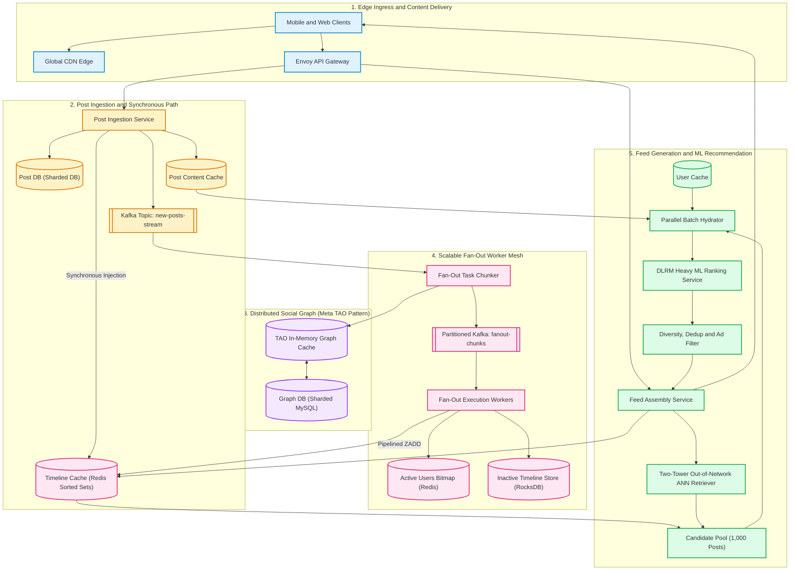
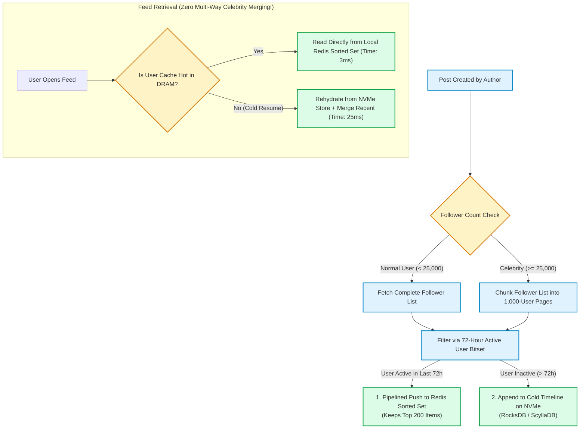
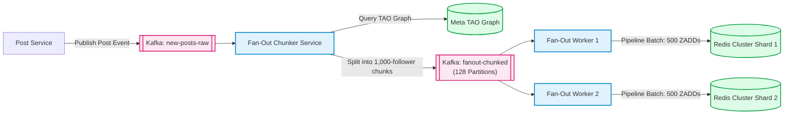
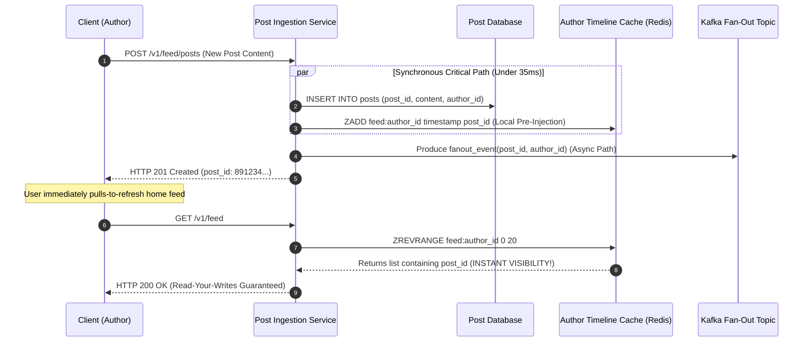
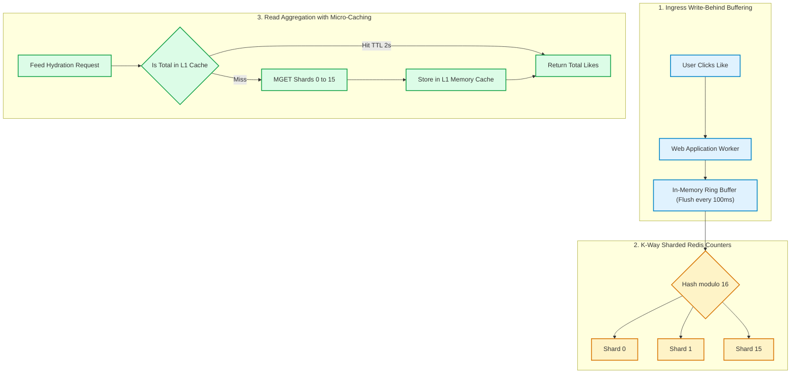
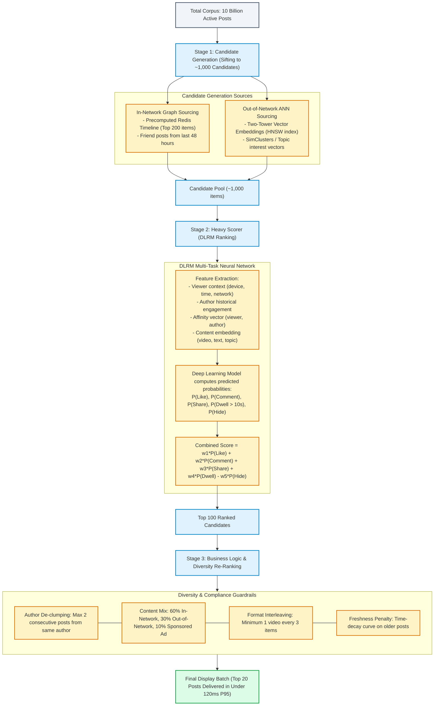
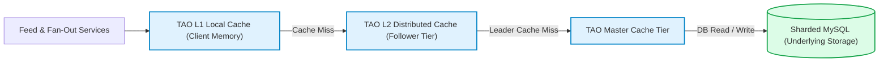

# Design a News Feed System

> [!tip] Staff/Principal Deep Walkthrough & Production Engine
> - **Interview Playbook**: [`Chapter 8 Staff/Principal Walkthrough Playbook`](02-Interactive-Interview-Playbook.md)
> - **Production Hybrid Engine & Daemon**: [`news_feed_engine.py`](news_feed_engine.py) (Hybrid Fan-Out, Celebrity Pull, Read-Your-Writes Injection, K-Way Heap Merge, 3-Stage ML Funnel)

## Level 4: Master Plan Blueprint

A **News Feed** is the personalized, real-time algorithmic stream of content displayed on the homepage of modern social networks (e.g., Meta/Facebook, Instagram, X/Twitter, LinkedIn, TikTok). It aggregates status updates, photos, videos, social activities, and sponsored content from friends, followed entities, and global recommendation graphs.

At hyperscale ($500\text{M+ Daily Active Users}$), a news feed system is among the most demanding distributed architectures in computing:
- **Massive Fan-Out Write Amplification**: A single post published by an account with $500$ followers creates $500$ distinct timeline mutations. Across $50,000\text{ posts/sec}$, the system must sustain **$25,000,000\text{ fan-out writes/sec}$** into cache.
- **The Celebrity Dilemma**: High-follower accounts (celebrities with $10\text{M}-100\text{M}$ followers) break naive fan-out-on-write models, while users who follow hundreds of celebrities break naive fan-out-on-read models.
- **The Real-Time Recommendation Pipeline**: Users no longer accept purely reverse-chronological feeds. Systems must sift through billions of candidates to surface the top 20 items in under $150\text{ ms}$ using a **Multi-Stage Machine Learning Recommendation Funnel** (Candidate Sourcing $\to$ DLRM Heavy Ranking $\to$ Diversity Re-ranking).

```
┌──────────────────────────────────────────────────────────────────────────────────────────────────┐
│                         HYPERSCALE NEWS FEED SYSTEM BLUEPRINT (500M DAU)                         │
├────────────────────────────────┬─────────────────────────────────────────────────────────────────┤
│ 1. Ingress & Media Pipeline    │ Envoy Gateway + Resumable Chunked S3 Uploads + CDN Edge         │
├────────────────────────────────┼─────────────────────────────────────────────────────────────────┤
│ 2. Fan-Out & Materialization   │ Tiered Active-Follower Push (72h active) + Chunked Kafka Workers│
├────────────────────────────────┼─────────────────────────────────────────────────────────────────┤
│ 3. Social Graph Engine         │ Meta TAO Pattern (Chunked Adjacency Lists & In-Memory Graph)   │
├────────────────────────────────┼─────────────────────────────────────────────────────────────────┤
│ 4. Consistency Engine          │ Synchronous Author Timeline Injection (Read-Your-Writes SLA)    │
├────────────────────────────────┼─────────────────────────────────────────────────────────────────┤
│ 5. Timeline Storage Hierarchy  │ Active Users: Redis Sorted Sets (Top 200 items in DRAM)         │
│                                │ Inactive Users: NVMe-backed RocksDB/ScyllaDB (Lazy Pull)        │
├────────────────────────────────┼─────────────────────────────────────────────────────────────────┤
│ 6. High-Frequency Counters     │ K-Way Sharded Redis Counters + Write-Behind Aggregation Buffers │
├────────────────────────────────┼─────────────────────────────────────────────────────────────────┤
│ 7. ML Recommendation Funnel    │ Two-Tower ANN Retrieval -> DLRM Heavy Ranker -> Diversity Filter │
└────────────────────────────────┴─────────────────────────────────────────────────────────────────┘
```

---

## 1. Problem Statement & Design Scope

### 1.1 Requirements Clarification

**Candidate:** What is the operational scale of the system?  
**Interviewer:** Assume **$500\text{ million Daily Active Users (DAU)}$** and $1\text{ billion}$ registered accounts globally.

**Candidate:** What is the feed composition? Is it purely chronological, or algorithmically ranked?  
**Interviewer:** The default view is **algorithmically ranked** based on user affinity, engagement likelihood, and content freshness. However, the system must support a fallback **reverse-chronological mode** for compliance and user preference.

**Candidate:** How should we handle the celebrity problem (accounts with tens of millions of followers)?  
**Interviewer:** The architecture must seamlessly handle accounts with up to $100\text{ million}$ followers without degrading system throughput or causing thundering herd latency spikes.

**Candidate:** What is the latency service level objective (SLO)?  
**Interviewer:** Feed retrieval latency must achieve **P95 $\le 120\text{ ms}$** and **P99 $\le 200\text{ ms}$** globally.

---

### 1.2 Requirements Matrix

#### Functional Requirements
1. **Feed Publishing**: A user can publish posts containing text, images, and videos.
2. **Feed Retrieval**: A user can view a personalized, ranked feed with infinite scroll (cursor-based pagination).
3. **Friendship & Follow Graph**: Support both bidirectional friendships (Facebook-style) and unidirectional follows (Twitter/Instagram-style).
4. **Social Interactions**: Real-time likes, comments, and share counters.
5. **Read-Your-Writes Consistency**: When an author creates a post, it must appear immediately on their own profile and home feed upon refresh.

#### Non-Functional Requirements
1. **High Availability**: $99.99\%$ availability (four nines). Feed generation must degrade gracefully during downstream failures.
2. **Sub-200ms P99 Latency**: Rapid feed assembly combining precomputed caches and real-time ML ranking.
3. **Partition & Scale Resilience**: Scale to $25,000,000\text{ fan-out writes/sec}$ and $500,000\text{ read QPS}$ at peak.
4. **Data Durability**: Zero post data loss once acknowledged; media assets geo-replicated across multiple regions.

---

## 2. Back-of-Envelope Estimation (Hyperscale 500M DAU)

### 2.1 Traffic & QPS Calculations
- **Daily Active Users (DAU)**: $500\text{ million}$.
- **Read Behavior**: Each user opens/refreshes their feed $12\text{ times/day}$.
  $$\text{Total Daily Feed Reads} = 500\text{M} \times 12 = 6,000,000,000\text{ reads/day}$$
  $$\text{Average Read QPS} = \frac{6\times 10^9}{86,400} \approx 69,444\text{ QPS}$$
  $$\text{Peak Read QPS (3x multiplier)} \approx \mathbf{210,000\text{ QPS (Designed for 500,000 QPS)}}$$

- **Write Behavior**: Each user publishes an average of $0.2\text{ posts/day}$ ($1\text{ post}$ every 5 days).
  $$\text{Total Daily Post Creations} = 500\text{M} \times 0.2 = 100,000,000\text{ posts/day}$$
  $$\text{Average Write QPS} = \frac{100\times 10^6}{86,400} \approx 1,157\text{ posts/sec}$$
  $$\text{Peak Write QPS (burst events, e.g. New Year / World Cup)} \approx \mathbf{10,000\text{ to }50,000\text{ posts/sec}}$$

- **Fan-Out Write Amplification**:
  - Average follower count per user: $500\text{ followers}$.
  $$\text{Average Fan-Out Writes/sec} = 1,157 \times 500 \approx 578,500\text{ writes/sec}$$
  $$\text{Peak Fan-Out Writes/sec} = 50,000 \times 500 = \mathbf{25,000,000\text{ writes/sec to Timeline Cache!}}$$

---

### 2.2 Storage & Memory Capacity Sizing
- **Post Metadata Sizing**:
  - `post_id` ($8\text{ bytes}$), `user_id` ($8\text{ bytes}$), `content` ($280\text{ chars} \approx 300\text{ bytes}$), media URLs ($200\text{ bytes}$), timestamps ($8\text{ bytes}$) $\approx 600\text{ bytes/post}$.
  $$\text{Daily Post Metadata} = 100\text{M posts} \times 600\text{ bytes} \approx 60\text{ GB/day}$$
  $$\text{3-Year Metadata Storage} = 60\text{ GB} \times 365 \times 3 \approx 65.7\text{ TB}$$

- **Media Storage (Images & Videos)**:
  - $20\%$ of posts contain images ($200\text{ KB}$ average compressed):
    $$100\text{M} \times 0.20 \times 200\text{ KB} = 4\text{ TB/day}$$
  - $5\%$ of posts contain video ($10\text{ MB}$ average transcode):
    $$100\text{M} \times 0.05 \times 10\text{ MB} = 50\text{ TB/day}$$
  $$\text{Total Daily Media Ingest} \approx 54\text{ TB/day} \approx \mathbf{20\text{ PB/year}}$$

- **Timeline Cache DRAM Sizing (Active Users Only)**:
  - Storing 800 items for all 500M users requires $500\text{M} \times 800 \times 8\text{ bytes} \approx 3.2\text{ TB DRAM}$.
  - **Optimized Tiered Model**: Only store the **top 200 post IDs** in Redis for **Active Users** (users active in last 72 hours $\approx 250\text{M users}$):
    $$\text{Timeline DRAM} = 250\text{M} \times 200\text{ items} \times 8\text{ bytes (post_id)} \approx \mathbf{400\text{ GB RAM}}$$
  - With Redis Sorted Set overhead ($+50\%$ for pointer structures and ziplists): $\approx \mathbf{600\text{ GB RAM}}$ (comfortably fits on a 10-node Redis Cluster).

---

## 3. High-Level System Architecture



---

## 4. Core Architectural Deep Dives

### Deep Dive 1: The "Celebrity Hybrid" Fallacy & Active-Follower Push

Standard textbooks teach a naive binary rule: *"Push for normal users; pull on read for celebrities with $\ge 10,000$ followers."*  
**Why this breaks in real production:**  
A typical social media user follows **$300\text{ to }500$ celebrities, public figures, news outlets, and sports teams**. If celebrity posts are not pushed to timeline caches:
1. When the user opens their feed, the system must execute **500 parallel queries** across 500 celebrity post stores.
2. The feed worker must perform an in-memory **501-way merge sort** across all returned candidate lists.
3. If even one database shard experiences an NVMe I/O stutter, the user's feed load stalls, causing widespread P99 latency degradation ($>1.5\text{ seconds}$).



#### The Production Solution: Tiered Active-Follower Push
Instead of pulling on read, modern production architectures (Meta, X) use **Tiered Active-Follower Push**:
1. Every user has an entry in a global **Active User Bitset** (stored in Redis/shared memory). A bit is set to `1` when the user opens the app, expiring after $72\text{ hours}$.
2. When a celebrity publishes, their follower list is evaluated against the Active User Bitset.
3. The post is pushed **only to followers who are currently active**.
4. If a celebrity has $50\text{M followers}$, but only $4\text{M}$ have logged in during the last 3 days, write amplification drops from $50\text{M}$ down to $4\text{M}$ writes!
5. When an inactive user opens the app after 2 weeks, their feed is hydrated on-demand via a **Lazy Background Cold Reconstructor**.

---

### Deep Dive 2: The 25M Writes/Sec Kafka Pipelined Fan-Out Mesh

Writing 25 million records per second to Redis requires eliminating per-command network round-trip overhead:

```
Individual Redis ZADD:
Worker 1: ZADD feed:user_1 1712200000 post_42 ──► TCP Round Trip (0.5ms)
Worker 2: ZADD feed:user_2 1712200000 post_42 ──► TCP Round Trip (0.5ms)

Pipelined Batching:
Worker: [ZADD feed:user_1 ... ZADD feed:user_500] ──► Single TCP Payload (1.2ms for 500 writes!)
```



#### The Chunked Fan-Out Protocol
1. For an author with $N$ followers, the Chunker divides the follower array into discrete pages:
   `fanout_task(post_id, author_id, follower_page_index, [follower_ids_0_to_1000])`.
2. Tasks are published across 128 partitioned Kafka queues keyed by `hash(follower_page_id)`.
3. Fan-out workers read chunks, group writes by the destination Redis cluster shard, and issue pipelined `ZADD` commands in batches of 500.
4. Each worker enforces a **sliding timeline window**:
   ```redis
   PIPELINE START
   ZADD feed:{user_id} {timestamp} {post_id}
   ZREMRANGEBYRANK feed:{user_id} 0 -201  -- Keep only the newest 200 items
   PIPELINE EXECUTE
   ```

---

### Deep Dive 3: Read-Your-Writes Consistency (Synchronous Pre-Injection)

In standard asynchronous fan-out, when an author posts a message, the message travels through Kafka before landing in their own feed. If the user refreshes immediately, the post is missing.



---

### Deep Dive 4: Tombstone Scrubbing & Deletion Protocol

When a post is deleted, how do we remove it from millions of followers' Redis Sorted Sets without corrupting pagination?

```
The Problem with Lazy Deletion:
Follower Feed Cache: [Post 1, Post 2 (Deleted), Post 3 (Deleted), Post 4, Post 5]
Client requests LIMIT 2 -> Service fetches Post 1 & 2 -> Discards Post 2 -> Returns only 1 post!
Result: Broken pagination contracts and erratic latency.
```

#### The Production Dual-Stage Deletion Architecture
1. **Synchronous Invalidation (Immediate Privacy Enforcement)**:
   - Mark the post record in `PostDB` as `is_deleted = true`.
   - Update the post's Redis hash (`post:{post_id}`) with field `deleted: 1`.
   - Any read in flight that attempts to hydrate this post immediately discards it.
2. **Asynchronous Batched Eviction (Tombstone Scrubbing)**:
   - Post Service enqueues a `delete_event(post_id, author_id)` onto a low-priority Kafka topic.
   - Fan-out workers read the author's follower list and issue pipelined `ZREM feed:{follower_id} {post_id}` across the cluster.
   - This eliminates dead tombstones from memory, keeping feed caches pristine.

---

### Deep Dive 5: High-Frequency Real-Time Sharded Counters

A viral post (e.g., breaking news or celebrity announcement) can receive over $50,000\text{ likes/second}$. Storing this counter in a single Redis key (`counters:post_123`) causes CPU core saturation and cache stampedes.



#### Counter Sharding Protocol
- **Write Path**: Each post counter is partitioned across $K=16$ keys: `counters:{post_id}:{shard_id}` where $\text{shard\_id} = \text{hash}(\text{user\_id}) \pmod{16}$. Writes distribute evenly across 16 independent Redis cluster nodes.
- **Read Path**: The feed service fetches all 16 shards via `MGET`, sums them, and caches the aggregate result in a local in-memory cache with a **$2\text{-second TTL}$**.
- **Result**: Absorbs $100,000\text{ writes/sec}$ while maintaining sub-millisecond read latency.

---

### Deep Dive 6: The Modern 3-Stage ML Recommendation Funnel

Modern social platforms use deep learning models to rank posts. Running a 100-layer transformer over billions of posts at read time is computationally impossible. Platforms employ a **Multi-Stage Recommendation Funnel**:



---

### Deep Dive 7: Social Graph Storage (Meta TAO Pattern)

Storing social relationships in a relational database with `JOIN` queries collapses under billions of edges. The industry-standard architecture is **Meta's TAO (The Associations and Objects store)**:

```
Objects: Users, Posts, Comments (Typed Nodes)
Assocs:  Friend, Follows, Authored, Liked (Directed Weighted Edges)
```



#### TAO In-Memory Adjacency List Format
For any `user_id`, the association list of followers is stored as a contiguous, time-sorted array:
`assoc_list(user_id, "FOLLOWS") -> [{id: 42, time: 1712200000}, {id: 89, time: 1712199000}, ...]`
- Chunked into pages of **1,000 edges**.
- Reads require **zero SQL joins** and hit in-memory RAM in under $1\text{ ms}$.

---

## 5. Production Database Schema & Cursor Pagination

### 5.1 Relational & NoSQL Schema Architecture

```sql
-- 1. Sharded Post Table (Partitioned by user_id)
CREATE TABLE posts (
    post_id         BIGINT NOT NULL, -- 64-bit Snowflake ID (Time-sortable)
    author_id       BIGINT NOT NULL,
    content_text    VARCHAR(2000),
    media_metadata  JSONB,           -- Array of {type: 'video'|'image', url: '...', s3_key: '...'}
    created_at      TIMESTAMPTZ NOT NULL DEFAULT NOW(),
    is_deleted      BOOLEAN NOT NULL DEFAULT FALSE,
    like_count      BIGINT NOT NULL DEFAULT 0,
    comment_count   BIGINT NOT NULL DEFAULT 0,
    PRIMARY KEY (author_id, post_id)
);
CREATE INDEX idx_author_created ON posts (author_id, created_at DESC);

-- 2. Social Graph Adjacency Table (TAO Persistent Layer)
CREATE TABLE entity_associations (
    from_id         BIGINT NOT NULL,
    assoc_type      VARCHAR(32) NOT NULL, -- 'FOLLOWS', 'FRIEND_OF'
    to_id           BIGINT NOT NULL,
    created_at      TIMESTAMPTZ NOT NULL DEFAULT NOW(),
    PRIMARY KEY (from_id, assoc_type, to_id)
);
CREATE INDEX idx_from_assoc_time ON entity_associations (from_id, assoc_type, created_at DESC);

-- 3. Cold Inactive Timeline Ledger (ScyllaDB / Cassandra Wide-Column)
-- Used when an inactive user opens the app after 72h
CREATE TABLE user_cold_timelines (
    user_id         BIGINT,
    post_id         BIGINT,
    author_id       BIGINT,
    publish_time    TIMESTAMPTZ,
    PRIMARY KEY (user_id, publish_time, post_id)
) WITH CLUSTERING ORDER BY (publish_time DESC);
```

---

### 5.2 Deterministic Cursor-Based Pagination API

Offset pagination (`OFFSET 200 LIMIT 20`) causes skipped posts and duplicates as new items arrive at the top of the feed. The system uses an **Opaque Cursor** encoding `(score, post_id)`:

```
GET /v1/feed?limit=20&cursor=ZXlKMGVYQWlPaUpLVjFRaUxDSnBi...
Authorization: Bearer <JWT>
```

#### Decoded Cursor Format:
```json
{
  "last_score": 0.89421,
  "last_post_id": "7189362041958400042",
  "generated_at": 1712200000
}
```

```sql
-- Feed Query Evaluation with Cursor
SELECT post_id, author_id, content_text, media_metadata, created_at 
FROM posts
WHERE (score < :last_score) 
   OR (score = :last_score AND post_id < :last_post_id)
ORDER BY score DESC, post_id DESC
LIMIT 20;
```

---

## 6. Failure Modes, Edge Cases & Operational Playbooks

| # | Production Failure Scenario | Root Cause | Architectural Mitigation / Operational Playbook |
|---|---|---|---|
| 1 | **Celebrity Live Event Fan-Out Spike** | A celebrity with 80M followers publishes a surprise wedding photo; Kafka ingestion queue surges to 80M tasks, creating worker backpressure. | **Dynamic Active-Follower Clamping & Priority Queues**: Isolate celebrity fan-out into dedicated Kafka priority partitions (`"fanout-celebrity-high"`). Fan out only to followers currently holding active WebSocket/SSE connections; push to remaining active users over a 5-minute ramp. |
| 2 | **Redis Timeline Cluster Shard Failure** | A primary Redis shard holding 25 million user feed caches crashes without clean Sentinel failover. | **Dual-Read Waterfall Fallback**: If Redis returns a connection timeout ($>15\text{ ms}$), Feed Service cascades: Tier 1 (Redis) $\to$ Tier 2 (Local RocksDB Timeline on NVMe) $\to$ Tier 3 (On-demand pull-on-read from friends). Return unranked chronological fallback within $80\text{ ms}$. |
| 3 | **ML Ranking Service Outage / Latency Spike** | GPU inference cluster (DLRM) experiences CUDA driver crash or thermal throttling, spiking inference time from $30\text{ ms}$ to $2,000\text{ ms}$. | **Automated Circuit Breaker Fallback**: Envoy gateway tracks DLRM P99 latency. If latency exceeds $60\text{ ms}$ for $>1\%$, open circuit breaker. Serve raw precomputed timeline sorted strictly by reverse chronological timestamp. Users see fresh posts with zero downtime. |
| 4 | **Pagination Drift / Duplicate Feed Loops** | Infinite scroll returns duplicate posts or jumps backwards when real-time ranking dynamically reorders candidate scores. | **Session-Pinned Cursor Freezing**: When a user begins a feed session, the top 100 candidate IDs are pinned in an ephemeral Redis session key (`session_feed:{user_id}`) with a $10\text{-minute TTL}$. Subsequent cursor pagination reads from the pinned snapshot. |
| 5 | **Viral Post Counter Melting (Cache Stampede)** | Global breaking news receives $80,000\text{ likes/sec}$; counter keys saturate single Redis CPU threads. | **K-Way Counter Sharding with Write-Behind Batching**: Partition counter into 16 shards: `counters:{post_id}:shard_{k}`. Local web workers buffer likes in memory and flush batched increments every $100\text{ ms}$. Reads compute sum across shards with a $2\text{s}$ local cache. |
| 6 | **Tombstone Pollution in Feed Caches** | High deletion rate causes Redis sorted sets to accumulate thousands of deleted post IDs, breaking `LIMIT 20` page contracts. | **Dual-Action Deletion**: Synchronously mark `deleted: true` in Post Cache (blocks read visibility instantly). Asynchronously issue pipelined `ZREM feed:{follower_id} {post_id}` via background workers to scrub dead references. |
| 7 | **Network Partition Across Global Datacenters** | Transatlantic fiber cut severs US-East from EU-West; EU users cannot reach US post primary database. | **Multi-Master Local Edge Reads**: Replicate posts asynchronously across global regions. EU users read from local EU Redis and EU Post DB replicas. Local likes and comments buffer in local Kafka; reconcile bi-directionally post-partition healing using CRDTs. |

---

## 7. Comprehensive Architectural Trade-Off Matrix

```
┌──────────────────────────────────────────────────────────────────────────────────────────────────┐
│                             SYSTEM ARCHITECTURE TRADE-OFF MATRIX                                 │
├─────────────────────┬─────────────────────────────────────┬──────────────────────────────────────┤
│ Design Choice       │ Advantages Gained                   │ Engineering Trade-Offs Incurred      │
├─────────────────────┼─────────────────────────────────────┼──────────────────────────────────────┤
│ 1. Tiered Active    │ Eliminates 80% of wasted fan-out    │ Cold start latency penalty (25ms)    │
│    Follower Push    │ writes to inactive users; bounds    │ when an inactive user resumes        │
│                     │ timeline DRAM costs to 600 GB.      │ activity and triggers reconstruction.│
├─────────────────────┼─────────────────────────────────────┼──────────────────────────────────────┤
│ 2. 3-Stage ML       │ Maximizes user engagement; handles  │ Complex GPU serving infrastructure;  │
│    Recommendation   │ out-of-network viral discovery;     │ requires robust fallback circuit     │
│    Funnel           │ sifts billions of items in <120ms.  │ breakers to chronological mode.      │
├─────────────────────┼─────────────────────────────────────┼──────────────────────────────────────┤
│ 3. Meta TAO Graph   │ Single-millisecond adjacency list   │ Cache invalidation complexity;       │
│    Cache Hierarchy  │ traversals; eliminates SQL joins;   │ requires leader/follower cache tiers │
│                     │ scales to 50M+ follower graphs.     │ to prevent stale graph reads.        │
├─────────────────────┼─────────────────────────────────────┼──────────────────────────────────────┤
│ 4. K-Way Sharded    │ Prevents hot-key CPU core melting;  │ Read path requires MGET across 16    │
│    Counters         │ scales linearly with viral likes    │ keys and summing values; slight      │
│                     │ (up to 100k+ updates/sec).          │ eventual consistency delay on totals.│
└─────────────────────┴─────────────────────────────────────┴──────────────────────────────────────┘
```

---

## 8. Summary & Key Interview Takeaways

1. **The Pure Push vs. Pure Pull Debate is Obsolete**: Hyperscale social platforms rely on **Tiered Active-Follower Push**. You push writes only to followers who are currently active (within $72\text{ hours}$), and lazily reconstruct feeds for dormant accounts.
2. **Beware the 500-Celebrity Read Explosion**: Suggesting "pull on read for celebrities" without considering users who follow 500 celebrities is an immediate red flag in Staff interviews. The N-way merge-sort latency collapse kills the read path.
3. **Read-Your-Writes is a First-Class Requirement**: Asynchronous fan-out over message queues breaks the author's user experience unless the Post Service **synchronously pre-injects** the new `post_id` into the author's own timeline cache before returning HTTP 201.
4. **Feeds are Machine Learning Recommendation Engines**: Pure reverse-chronological feeds are a tiny fraction of the challenge. The core intellectual difficulty is the **3-Stage Recommendation Funnel**: Two-Tower ANN Retrieval $\to$ DLRM Multi-Task Heavy Ranking $\to$ Diversity & Compliance Re-ranking.
5. **Protect Caches from Tombstone Poisoning and Counter Stampedes**: Deleted posts must be actively scrubbed from Redis Sorted Sets via asynchronous `ZREM` pipelines, and viral likes must be partitioned across sharded counter keys to prevent single-shard meltdown.
