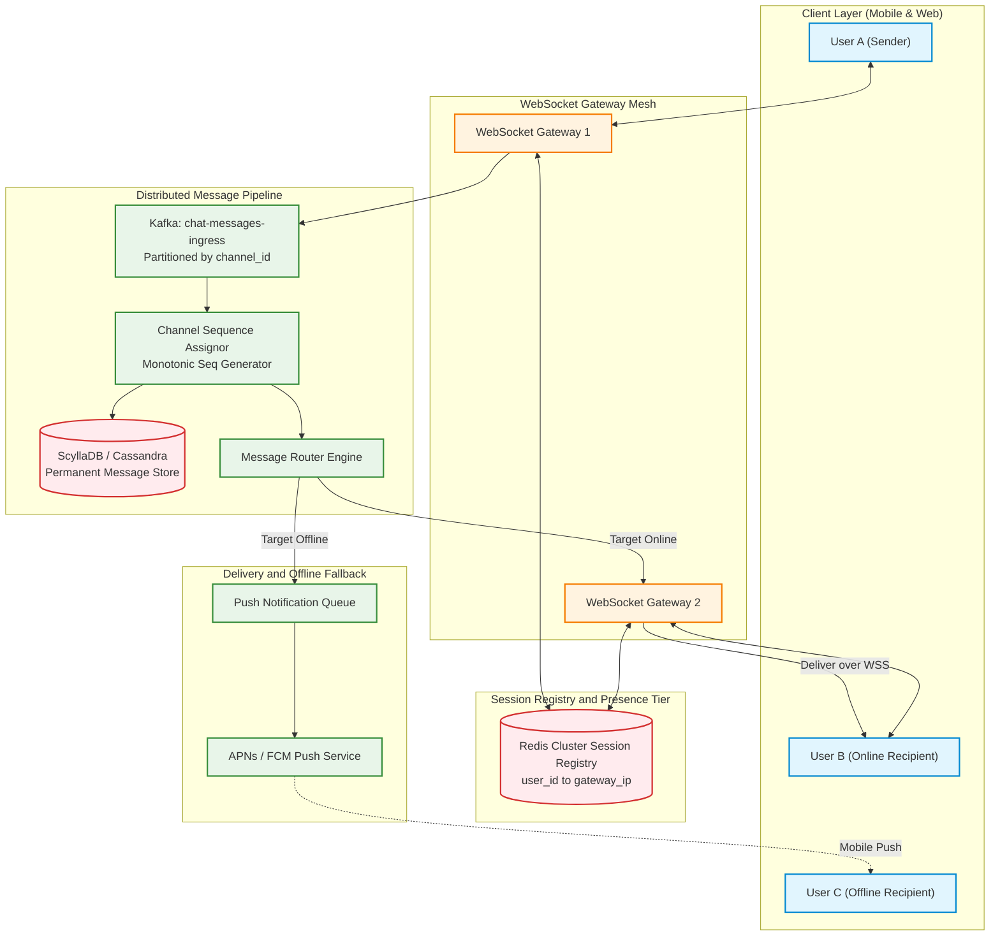
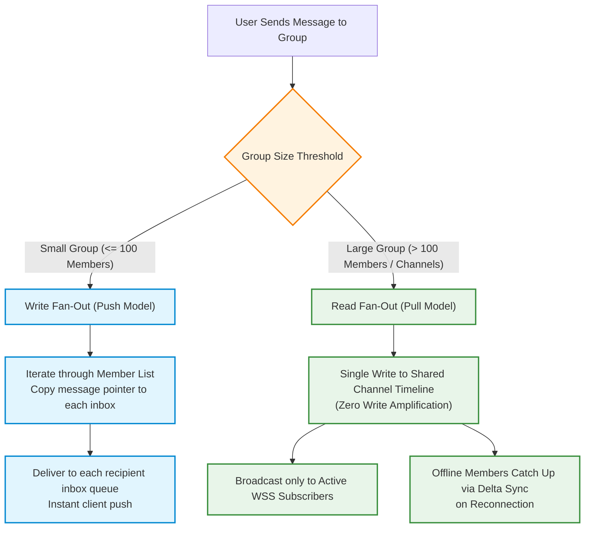
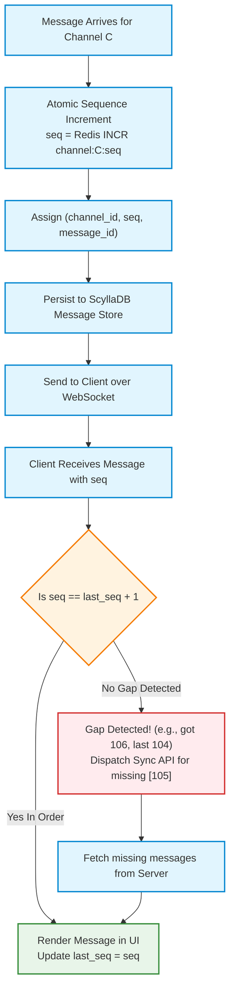
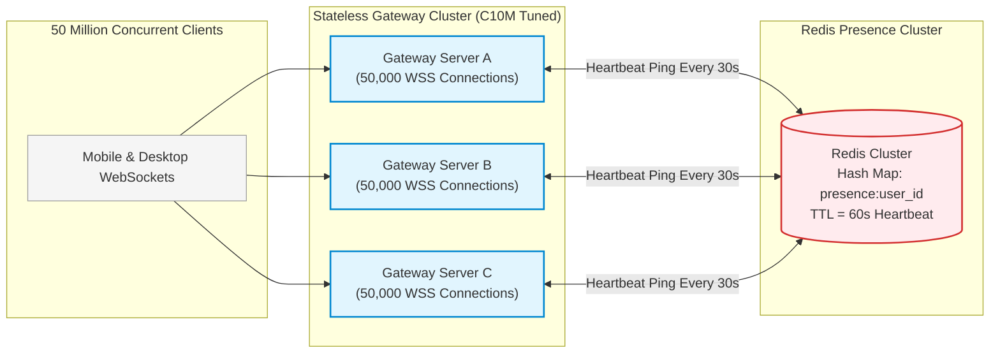
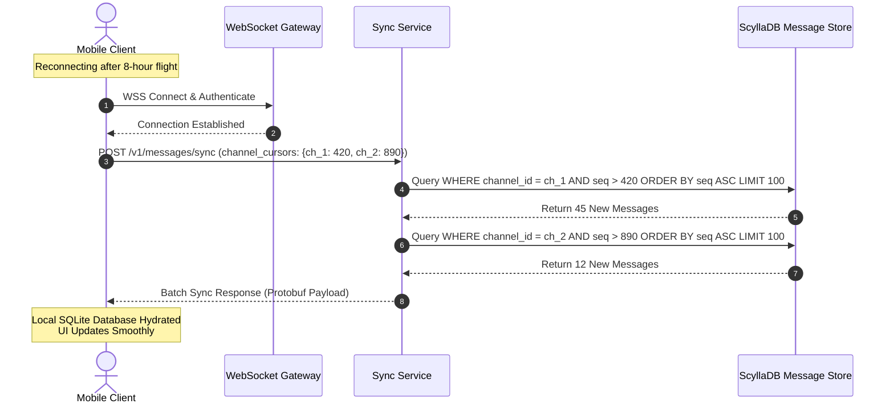
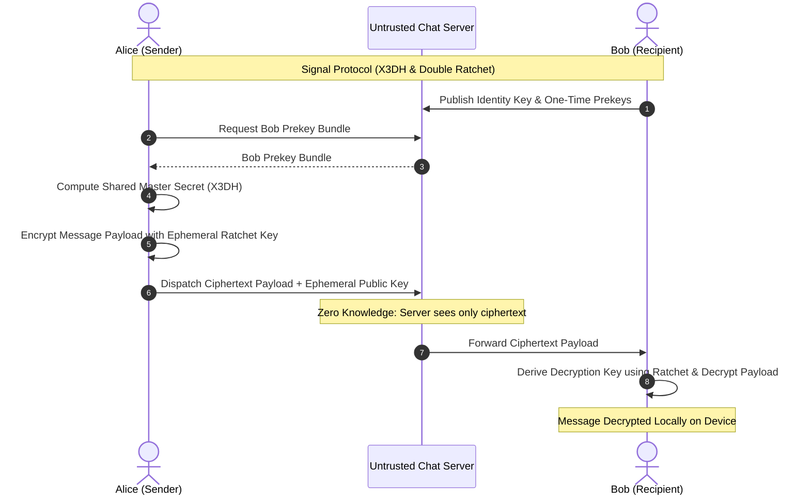

# Design a Hyperscale Real-Time Chat System (WhatsApp & Discord Architecture)

> [!tip] Staff/Principal Deep Walkthrough & Production Engine
> - **Interview Playbook**: [`Chapter 9 Staff/Principal Walkthrough Playbook`](02-Interactive-Interview-Playbook.md)
> - **Production Chat Gateway & Engine**: [`chat_engine.py`](chat_engine.py) (RFC 6455 WebSockets, Monotonic Seq Assignor, Hybrid Fan-Out, Presence Leases, and Delta Sync)

## 1. Problem Statement & Motivation

A **Real-Time Chat Platform** is a distributed communications backbone capable of routing text, media metadata, typing indicators, and presence states with sub-100ms latency across hundreds of millions of concurrent users. The platform must seamlessly support three distinct conversation topologies:
- **1-on-1 Direct Messaging (DM)**: Bidirectional, private, and end-to-end encrypted (WhatsApp/Signal style).
- **Small Group Chats**: Collaborative groups ($\le 100$ members) with read receipts and delivery acks.
- **Large Public Channels / Supergroups**: Massive community channels ($1,000$ to $250,000+$ members in Discord, Telegram, and Twitch).

```
User A (Sender) ──► [ WebSocket Gateway ] ──► [ Message Pipeline ] ──► [ WebSocket Gateway ] ──► User B (Recipient)
                                                      │
                                                      └──► [ Offline Push ] ──► APNs / FCM ──► User C (Offline)
```

### The 4 Hyperscale Distributed Systems Fallacies

1. **The Group Chat Fan-Out Avalanche (Write Amplification)**:
   - Classic naive architectures copy every message into an inbox queue for every recipient. In a Discord server or Telegram supergroup with **100,000 members**, a single message requires **100,000 database writes and message copies**, resulting in an unmanageable $100,000\times$ write amplification that crashes storage engines.
2. **The Message Ordering & Clock Skew Fallacy**:
   - Relying on wall-clock timestamps (`created_at`) from client devices or servers breaks conversational ordering. In distributed systems, clock drift (NTP skew) causes out-of-order replies (e.g., an answer appearing above the question).
3. **The C10M WebSocket Connection Saturation**:
   - Maintaining **50 million persistent, bidirectional WebSocket connections** stresses Linux kernel memory, file descriptors, and ephemeral ports. Without kernel tuning and distributed session registries, connection storms crash gateway clusters.
4. **The Synchronous Presence & Typing Indicator Trap**:
   - Persisting ephemeral events (e.g., "User is typing..." or heartbeat pings every 30s) to disk databases induces massive I/O overhead. Ephemeral signaling must bypass disk storage entirely.

---

## 2. Requirements Clarification & System Scope

### Candidate-Interviewer Alignment Dialog

**Candidate:** What is the daily active scale, and how many concurrent users must the system support?  
**Interviewer:** Design for **500 million Daily Active Users (DAU)**. The system must support **50 million concurrent connected WebSocket sessions** and process **50 billion messages per day**.

**Candidate:** What is the maximum group size?  
**Interviewer:** We must support two tiers: standard private groups up to **100 members**, and large public community channels up to **100,000 members** (Discord style).

**Candidate:** What are the latency and delivery guarantees?  
**Interviewer:** For online recipients, delivery latency must be **under 100 milliseconds ($P_{99}$)**. Messages must **never be lost**, and conversation history must maintain **strict monotonic ordering per channel**.

**Candidate:** Is End-to-End Encryption (E2EE) required?  
**Interviewer:** Yes. 1:1 direct messages must support the **Signal Protocol (Double Ratchet)** with zero-knowledge server routing.

### Functional Requirements (FR)

| ID | Requirement | Description |
|:---|:---|:---|
| **FR-1** | **1-on-1 & Group Messaging** | Real-time text delivery for 1:1 direct messages, small groups ($\le 100$), and supergroups ($\le 100,000$). |
| **FR-2** | **Strict Channel Message Ordering** | Every channel maintains a strictly increasing monotonic sequence ID ($1, 2, 3\dots$) with client gap detection. |
| **FR-3** | **Offline Delta Catch-Up** | Clients reconnecting after being offline pull missed message ranges via cursor-based delta synchronization. |
| **FR-4** | **Ephemeral Presence & Typing** | In-memory online/offline presence status and typing indicators with low latency and zero disk I/O. |
| **FR-5** | **Offline Push Notifications** | Automatically triggers APNs/FCM push notifications when a message recipient is disconnected. |
| **FR-6** | **End-to-End Encryption (E2EE)** | 1:1 chats utilize the Signal Protocol (X3DH + Double Ratchet); servers route ciphertext only. |

### Non-Functional Requirements (NFR)

| ID | Metric | Target Metric | Architectural Strategy |
|:---|:---|:---|:---|
| **NFR-1** | **Online Delivery Latency** | $P_{99} < 100\text{ ms}$ | Stateful WebSocket Gateway mesh + Redis in-memory session routing. |
| **NFR-2** | **Concurrent Connections** | $\ge 50,000,000\text{ WSS}$ | C10M-tuned Linux kernel sockets + horizontal gateway cluster (100k sockets/node). |
| **NFR-3** | **Peak Throughput** | $\ge 1,500,000\text{ msg/sec}$ | Partitioned Kafka message pipeline + ScyllaDB wide-column message storage. |
| **NFR-4** | **Message Durability** | $99.9999999\%$ (Zero loss) | Quorum writes ($W = 2, R = 2$) on ScyllaDB with WAL group commit. |

---

## 3. Back-of-the-Envelope Capacity Planning & Sizing

### 3.1 Message Throughput & Bandwidth

- **Daily Message Volume**:
  $$\text{Daily Messages} = 500,000,000\text{ DAU} \times 100\text{ messages/day} = 50,000,000,000\text{ messages/day} \ (50\text{ Billion})$$
- **Average Global Message QPS**:
  $$\text{QPS}_{\text{avg}} = \frac{50,000,000,000}{86,400\text{ seconds}} \approx 578,700\text{ messages/sec}$$
- **Peak Message QPS ($2.5\times$ multiplier)**:
  $$\text{QPS}_{\text{peak}} \approx 578,700 \times 2.5 \approx 1,446,750\text{ messages/sec} \approx 1.5\text{ Million QPS}$$

---

### 3.2 Storage Sizing (Text & Metadata)

- **Message Schema Size**:
  - `message_id` (Snowflake int64): 8 bytes
  - `channel_id` (UUIDv7): 16 bytes
  - `sender_id` (int64): 8 bytes
  - `sequence_id` (int64): 8 bytes
  - `payload_ciphertext` (Text average): $\approx 150$ bytes
  - `created_at` (int64 timestamp): 8 bytes
  - Row overhead in ScyllaDB / Cassandra: $\approx 22$ bytes
  - **Total per Message**: $\approx 220\text{ bytes}$
- **Daily Storage**:
  $$\text{Daily Storage} = 50\text{B} \times 220\text{ bytes} \approx 11,000,000,000,000\text{ bytes} \approx 11.0\text{ TB/day}$$
- **Annual Storage (with $R = 3$ Replication)**:
  $$\text{Annual Storage} = 11\text{ TB/day} \times 365\text{ days} \times 3 \approx 12.0\text{ Petabytes/year}$$

---

### 3.3 The C10M WebSocket Connection & Kernel Memory Math

- **Peak Concurrent Connections**: $10\%$ of 500M DAU = **$50,000,000$ active concurrent WebSockets**.
- **Kernel Socket Buffer Footprint**:
  - TCP Receive buffer (`rmem` default): $4\text{ KB}$
  - TCP Send buffer (`wmem` default): $4\text{ KB}$
  - Kernel socket structure (`struct sock` + `sk_buff` overhead): $\approx 3\text{ KB}$
  - **Memory per Connection**: $\approx 11\text{ KB}$
- **Total Fleet Kernel Memory**:
  $$\text{Kernel RAM} = 50,000,000 \times 11\text{ KB} \approx 550\text{ GB RAM across gateway fleet}$$
- **Gateway Node Sizing**:
  - Each gateway server (64 GB RAM, 16 vCPUs) handles **$100,000$ concurrent WebSockets** ($\approx 1.1\text{ GB}$ kernel memory + $3\text{ GB}$ application state).
  - **Gateway Fleet Size**:
    $$\text{Nodes Required} = \frac{50,000,000}{100,000} = 500\text{ Gateway Nodes globally}$$

---

## 4. End-to-End System Architecture

The following diagram illustrates the complete hyperscale chat architecture, highlighting the separation between stateful WebSocket connection gateways, session registries, message sequencing pipelines, and storage engines:



---

## 5. The Hybrid Fan-Out Architecture: Push vs. Pull Model

To prevent the write amplification catastrophe in channels with tens of thousands of members, we employ a **Hybrid Fan-Out Protocol**:



### Comparative Analysis of Fan-Out Mechanics

| Dimension | Small Group Push Model ($\le 100$ members) | Large Channel Pull Model ($> 100$ to $100\text{k}$ members) |
|:---|:---|:---|
| **Write Cost** | $O(N)$ writes (copies message pointer to $N$ recipient inboxes). | **$O(1)$ write** (written once to shared channel timeline). |
| **Storage Overhead** | Moderate for small groups (pointers are 16 bytes). | **Zero amplification**; storage is identical to 1:1 chat. |
| **Real-Time Delivery** | Push directly to each recipient's open WebSocket connection. | Gateway maintains channel subscriber list; publishes to active sockets. |
| **Offline Handling** | Inboxes pre-populated while user is offline. | User pulls missed sequence ranges upon reconnecting via Delta Sync. |
| **Production Analogy** | WhatsApp group chat / Slack Direct Messages. | Discord servers / Telegram supergroups / Twitch live chat. |

---

## 6. Channel-Scoped Monotonic Sequence Generation & Gap Detection

Relying on wall-clock timestamps (`created_at`) from client devices fails due to clock skew, leap seconds, and mobile network jitter. Messages must be ordered deterministically using **Channel-Scoped Monotonic Sequence IDs**.



### Mathematical Guarantee & Gap Repair
- Every message in channel $C$ is assigned a contiguous integer $\text{seq} \in [1, 2, 3\dots]$.
- **Client Invariant**:
  $$\text{ExpectedSeq} = \text{last\_rendered\_seq} + 1$$
- If a client currently displaying message `104` receives message `106` over its WebSocket:
  - It immediately recognizes that message `105` was dropped due to packet loss or Wi-Fi handoff.
  - The client buffers message `106` without rendering it, and dispatches an asynchronous call:
    `GET /v1/channels/{id}/messages?from=105&to=105`.
  - Once message `105` arrives, both `105` and `106` render sequentially in perfect order, completely eliminating out-of-order conversational glitches!

---

## 7. Connection Gateway Fleet & Redis Presence Mesh



### 7.1 Linux Kernel C10M Socket Optimization
To sustain 100,000 active connections per gateway node without memory exhaustion or socket drops, the following Linux kernel parameters are enforced:

```ini
# /etc/sysctl.conf
fs.file-max = 2097152                 # Maximum system-wide file descriptors
net.core.somaxconn = 65535            # Max TCP listen backlog queue
net.ipv4.tcp_max_syn_backlog = 65535  # Max half-open SYN requests
net.ipv4.tcp_fin_timeout = 15         # Fast reclamation of closed sockets
net.ipv4.ip_local_port_range = 1024 65535 # Ephemeral port range for outbound proxies
net.ipv4.tcp_rmem = 4096 87380 16777216   # Auto-tuning TCP read buffer (min, default, max)
net.ipv4.tcp_wmem = 4096 65536 16777216   # Auto-tuning TCP write buffer
```

### 7.2 Session Registry & Ephemeral Presence Heartbeats
- **Session Registry (Redis Cluster)**:
  - Maps active users to their respective gateway node:
    `HSET session:user_1042 gateway_ip "10.0.4.12" session_id "sess_9918" connected_at 1743782400`
  - When User A sends a message to User B, the router queries `session:user_B`, identifies Gateway Node `10.0.4.12`, and forwards the message internally via gRPC.
- **Heartbeat & Presence Leases**:
  - Connected mobile clients emit a heartbeat ping every 30 seconds.
  - Gateway updates Redis with a 60-second TTL:
    `SET presence:user_1042 "ONLINE" EX 60`
  - If a user loses connection (e.g. subway tunnel) and misses two consecutive heartbeats, the Redis key expires automatically, transitioning the user to "OFFLINE" without requiring active polling!

---

## 8. Offline Synchronization & Delta Catch-Up Protocol

When a mobile user turns on their device after an 8-hour flight, downloading all message history is slow and bandwidth-intensive. The **Delta Sync Protocol** ensures that only missing messages are transferred:



### Sync Payload Specification (Protobuf)
```protobuf
message SyncRequest {
    map<string, int64> channel_cursors = 1; // Map of channel_id -> last_known_seq
    int32 batch_size = 2;                   // Default 100
}

message SyncResponse {
    repeated ChannelDelta deltas = 1;
    bool has_more = 2;
}

message ChannelDelta {
    string channel_id = 1;
    int64 latest_channel_seq = 2;
    repeated ChatMessage messages = 3;
}
```

---

## 9. End-to-End Encryption (E2EE): Signal Protocol Integration

For 1:1 direct messaging, the server must be treated as an **untrusted relay** (Zero-Knowledge Architecture). We implement the **Signal Protocol**, utilizing **Extended Triple Diffie-Hellman (X3DH)** for asynchronous session setup and the **Double Ratchet Algorithm** for forward-secret message exchange:



### Cryptographic Guarantees
1. **Confidentiality & Authenticity**: Message payloads are encrypted client-side using AES-256-GCM or ChaCha20-Poly1305. The server only sees arbitrary ciphertext.
2. **Forward Secrecy**: The Double Ratchet continuously derives new ephemeral symmetric keys for every single message. If an attacker compromises a client's device key today, they **cannot decrypt past messages**.
3. **Break-in Recovery (Post-Compromise Security)**: Even if a ratchet key is leaked, the subsequent Diffie-Hellman ratchet exchange immediately re-establishes a fresh, secure shared secret.

---

## 10. Database Schema & Storage Engine Design

We employ **ScyllaDB (distributed C++ wide-column store)** as our primary persistent message store. ScyllaDB delivers predictable sub-millisecond read/write latencies via a thread-per-core, shared-nothing architecture.

### Channel Messages Table (ScyllaDB CQL)

```sql
CREATE KEYSPACE chat_platform WITH replication = {
    'class': 'NetworkTopologyStrategy',
    'us-east-1': 3,
    'eu-central-1': 3
};

-- Primary Message Store: Partitioned by channel, clustered by sequence
CREATE TABLE chat_platform.channel_messages (
    channel_id      TIMEUUID,         -- Partition Key
    seq             BIGINT,           -- Clustering Key (Monotonic sequence)
    message_id      BIGINT,           -- Snowflake ID
    sender_id       BIGINT,
    payload_cipher  BLOB,             -- E2EE Ciphertext
    media_url       VARCHAR,
    created_at      TIMESTAMP,
    PRIMARY KEY ((channel_id), seq)
) WITH CLUSTERING ORDER BY (seq ASC)
  AND compaction = {'class': 'TimeWindowCompactionStrategy'};

-- User Channel Membership & Last Read Cursor
CREATE TABLE chat_platform.user_channel_memberships (
    user_id         BIGINT,           -- Partition Key
    channel_id      TIMEUUID,         -- Clustering Key
    role            VARCHAR,          -- 'ADMIN', 'MEMBER'
    last_read_seq   BIGINT,           -- Read Receipt pointer
    joined_at       TIMESTAMP,
    PRIMARY KEY ((user_id), channel_id)
);
```

---

## 11. Production Verification & SRE Observability Matrix

| Metric Name | Type | Target SLA | Alert Condition | Remediation Runbook |
|:---|:---|:---|:---|:---|
| `chat_wss_message_latency_seconds` | Histogram | $P_{99} < 100\text{ ms}$ | $P_{99} > 300\text{ ms}$ for 2m | Inspect gateway CPU load and Redis session registry latency. |
| `chat_active_websocket_connections` | Gauge | Monitored | Sudden drop $> 20\%$ | Major ISP routing disruption or gateway crash storm; check ELB health. |
| `chat_seq_gap_detected_total` | Counter | Baseline $< 0.1\%$ | Spikes $> 1.0\%$ | Network packet drops or Redis sequence assignor transaction failures. |
| `chat_redis_presence_heartbeat_qps` | Gauge | Expected $\approx 1.6\text{M}$ | Drops $> 30\%$ | Client heartbeat degradation or Redis cluster shard saturation. |
| `chat_offline_push_fallback_rate` | Counter | Tracks offline ratio | Spikes $> 50\%$ | Users disconnecting; investigate widespread mobile network disruptions. |

---

## 12. Summary Architecture Blueprint Cheat Sheet

```
Hyperscale Real-Time Chat Blueprint:
  [x] Connection Fleet: 500 C10M-tuned Gateway Nodes hosting 50M concurrent WebSockets (100k sockets/node).
  [x] Hybrid Fan-Out: Write Fan-Out (Push) for groups <= 100; Read Fan-Out (Pull / Timeline) for channels > 100.
  [x] Message Ordering: Channel-Scoped Monotonic Sequence IDs (INCR channel:id:seq) with client-side gap detection.
  [x] Session & Presence: In-memory Redis Cluster registry (user -> gateway_ip) with 60s auto-expiring heartbeat leases.
  [x] Offline Catch-Up: Delta Sync API using cursor-based sequence ranges (seq > last_read_seq) over Protobuf.
  [x] Ephemeral Signaling: Typing indicators and voice presence bypass disk storage, streaming directly over WSS.
  [x] E2EE Security: Signal Protocol (X3DH + Double Ratchet) client-side encryption; zero-knowledge server routing.
  [x] Primary Datastore: ScyllaDB wide-column store partitioned by channel_id and clustered by seq ASC.
```

---

**Related Architectural Blueprints:**
- [`01-Architectural-Blueprint.md`](01-Architectural-Blueprint.md)
- [`01-Architectural-Blueprint.md`](01-Architectural-Blueprint.md)
- [`01-Architectural-Blueprint.md`](01-Architectural-Blueprint.md)
- [`01-Architectural-Blueprint.md`](01-Architectural-Blueprint.md)
- [[C10M Network Socket Architecture]]
