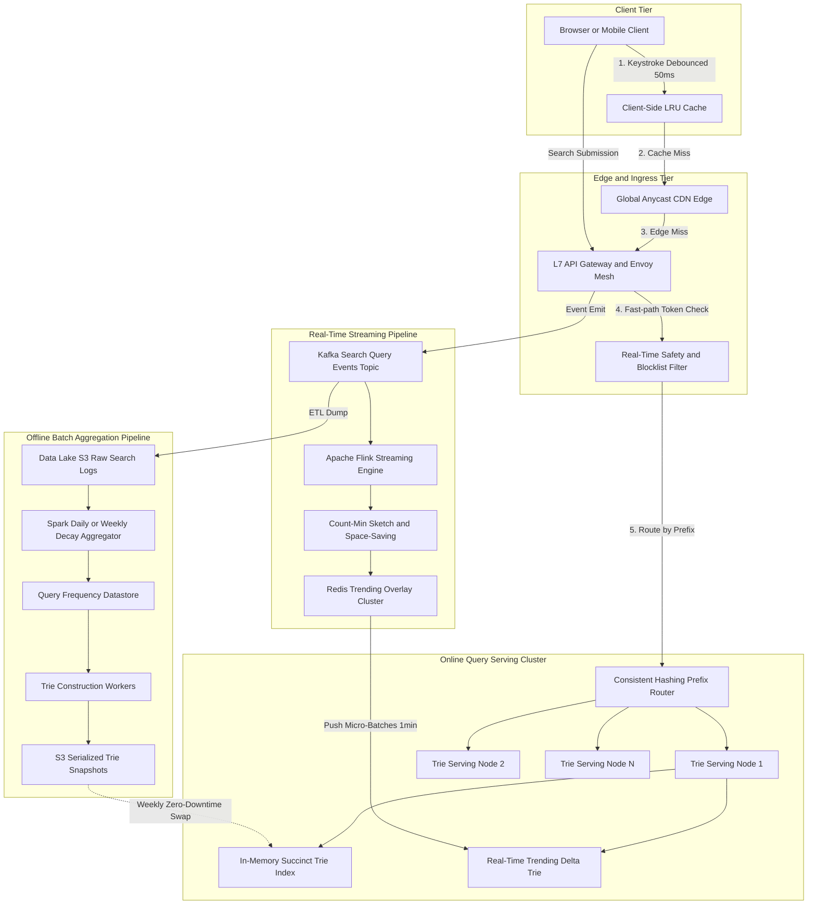
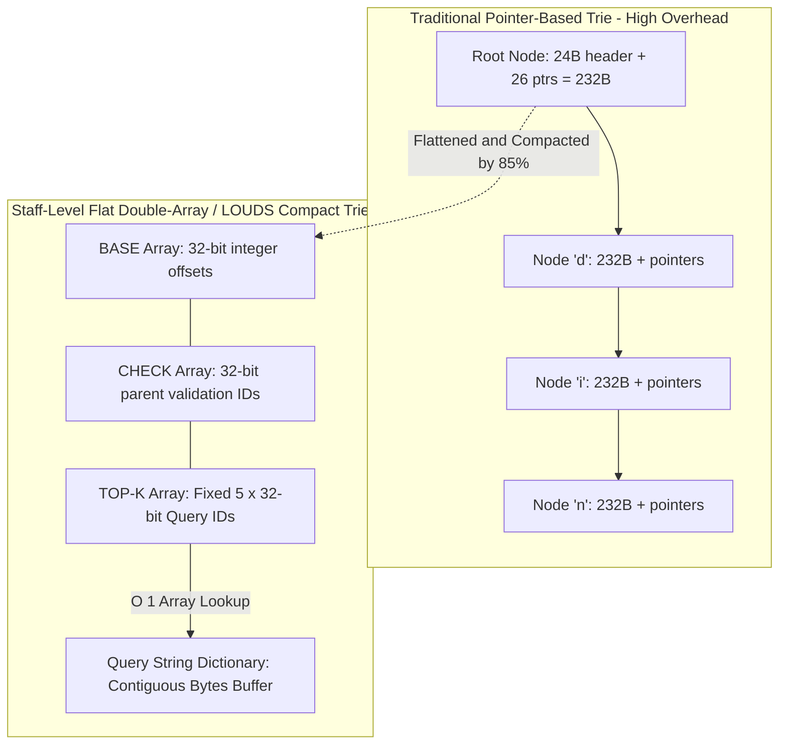
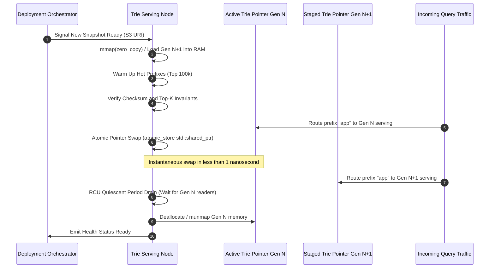
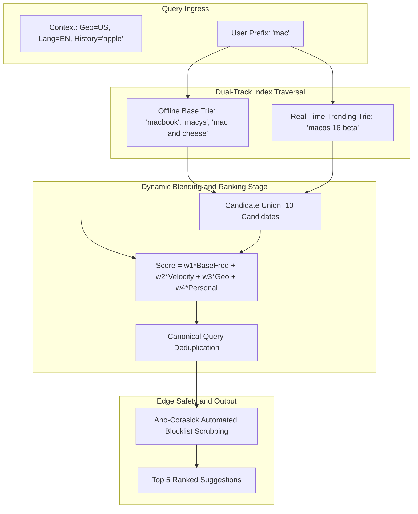
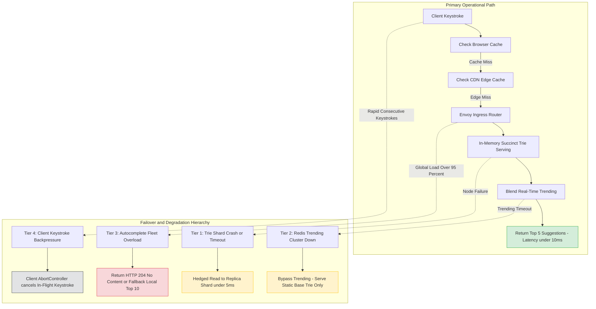

# Design Search Autocomplete System

> [!tip] Staff/Principal Deep Walkthrough & Production Engine
> - **Interview Playbook**: [`Chapter 10 Staff/Principal Walkthrough Playbook`](02-Interactive-Interview-Playbook.md)
> - **Production Autocomplete Engine**: [`autocomplete_engine.py`](autocomplete_engine.py) (Compact Prefix Trie, Node-Level Top-K Cache, RCU Atomic Swap, Velocity Overlay, and Dynamic Moderation)

> [!abstract] Executive Architectural Blueprint
> Design a hyperscale search autocomplete system (typeahead suggestion, search-as-you-type) capable of serving **50 Million Daily Active Users (DAU)** generating **115,000 average QPS** and **290,000 peak QPS** at a strict server-side **p99 latency under 10ms** (total roundtrip under 50ms). The architecture combines a succinct, cache-aligned **Double-Array Trie (DAT) / Finite State Transducer (FST)** in-memory index, zero-downtime atomic blue/green pointer swapping via RCU (Read-Copy-Update) semantics, an offline Apache Spark aggregation pipeline with exponential time-decay weighting, and a low-latency Apache Flink streaming pipeline maintaining a real-time trending overlay via Count-Min Sketch and Space-Saving algorithms.

Back to: [[System Design Interview - Alex Xu Index]]

---

## 1. Requirements & System Boundaries

### 1.1 Candidate-Interviewer Strategic Clarifications

| # | Question | Answer / Staff-Level Framing | Architectural Consequence |
|---|---|---|---|
| 1 | Is matching purely prefix-based, or infix / fuzzy? | **Prefix matching only** for core typeahead; fuzzy matching handled as secondary fallback. | Trie / Finite State Transducer is the optimal deterministic index structure. |
| 2 | How many suggestions per prefix? | **Top 5 ranked suggestions.** | Each trie node can pre-compute and pin top-5 Query IDs ($O(1)$ query retrieval). |
| 3 | How are suggestions ranked? | **Hybrid multi-factor scoring**: Historical frequency with exponential decay + real-time trending velocity + localized geography. | Requires decoupling baseline offline index from a real-time streaming overlay. |
| 4 | What is the latency SLA? | **Client perceived p99 < 50ms**; **Server-side processing p99 < 10ms**. | Zero disk I/O on read path; in-memory traversal with hardware cache-line locality; edge CDN caching. |
| 5 | What scale of queries? | **50M DAU**, ~10 searches/day, average 20 keystrokes/search. | ~10 Billion prefix queries/day; peak edge ingestion ~290k QPS. |
| 6 | Freshness requirements? | Baseline queries updated weekly; breaking news / trending queries updated in **< 60 seconds**. | Dual-path Lambda/Kappa architecture: Batched Base Trie + In-Memory Real-Time Delta Trie. |
| 7 | Safety, Legal & Content Moderation? | Instantaneous zero-downtime removal of offensive, illegal, or PII search queries. | Edge L7 filter using Aho-Corasick automaton and atomic dynamic blocklist sets. |

### 1.2 Quantitative Service Level Objectives (SLOs)

```
┌────────────────────────┬────────────────────────────────────────────────────────────────────────┐
│ Metric                 │ Production Target                                                      │
├────────────────────────┼────────────────────────────────────────────────────────────────────────┤
│ Server-Side Latency    │ p50 < 2ms, p95 < 6ms, p99 < 10ms                                       │
│ End-to-End Latency     │ p99 < 50ms (including client debounce + TLS + Edge CDN)                │
│ Availability           │ 99.99% (Maximum 4.38 minutes downtime/month)                           │
│ Freshness (Trending)   │ Spike-to-Suggestion delay < 60 seconds                                 │
│ Consistency            │ Eventual consistency for ranking; Strong consistency for safety bans   │
│ Throughput Capacity    │ 115,000 Avg QPS; 290,000 Peak QPS; Burst Headroom 500,000 QPS          │
└────────────────────────┴────────────────────────────────────────────────────────────────────────┘
```

---

## 2. Hyperscale Mathematical Estimations

### 2.1 QPS and Network Bandwidth Math

$$
\text{Daily Completed Searches} = 50\text{M DAU} \times 10 \text{ searches/user} = 500\text{M searches/day}
$$

$$
\text{Keystrokes Per Search} = 20 \text{ characters}
$$

Without client-side debouncing, the naive query volume would be:
$$
500\text{M} \times 20 = 10\text{ Billion requests/day} \implies \frac{10 \times 10^9}{86,400} \approx 115,740 \text{ QPS (Average)}
$$

With **client-side 50ms debouncing** and caching, approximately **40% of keystroke queries are eliminated** before reaching origin servers:
$$
\text{Origin Requests/Day} = 10\text{B} \times 0.60 = 6\text{ Billion requests/day}
$$
$$
\text{Origin Average QPS} = \frac{6 \times 10^9}{86,400} \approx 69,444 \text{ QPS}
$$
$$
\text{Origin Peak QPS (2.5}\times\text{ surge factor)} \approx 175,000 \text{ QPS}
$$
*(Edge ingress must still be provisioned for 290,000 peak QPS).*

**Egress Bandwidth:**
- Average JSON suggestion payload: ~350 bytes (5 queries, scores, metadata).
- Peak egress bandwidth:
$$
175,000 \text{ QPS} \times 350 \text{ bytes} \approx 61.25 \text{ MB/s} \approx 490 \text{ Mbps}
$$

### 2.2 Storage & Memory Footprint Sizing

Assume **1 Billion unique queries** accumulated over time:
- After filtering bot traffic and queries with frequency $< 3$, the active index retains **200 Million high-value queries**.
- Average query string length: $20 \text{ characters} = 20 \text{ bytes}$.

#### The Pointer Bloat Trap (Naive vs Succinct)

In a naive pointer-based Trie:
```
Node overhead: 
  - 1 byte char
  - 8-byte pointer * 26 letters = 208 bytes
  - 8-byte Top-K pointer
  - 4-byte frequency = 221 bytes per node!
```
For an estimated 500M nodes across 200M queries:
$$
500\text{M} \times 221 \text{ bytes} \approx 110.5 \text{ GB (Excluding allocator fragmentation and dynamic string copies!)}
$$

In a **Compact Double-Array Trie (DAT) / FST**:
- Nodes are flattened into contiguous arrays (`BASE` and `CHECK` arrays of 32-bit integers).
- Top-5 queries per node store **32-bit Query IDs** referencing a centralized dictionary string pool.
- Memory per node: $\approx 28 \text{ bytes}$.
- Total Trie memory footprint:
$$
500\text{M} \times 28 \text{ bytes} \approx 14 \text{ GB}
$$
- Query String Dictionary: $200\text{M} \times 24 \text{ bytes} \approx 4.8 \text{ GB}$.
- **Total In-Memory Index Size $\approx 18.8 \text{ GB}$!**
- This easily fits into the RAM of a single standard commodity cloud instance (e.g., 64 GB RAM), allowing **100% in-memory serving without sharding complexity**, replicated across a horizontal cluster for load distribution and high availability.

---

## 3. End-to-End System Architecture

The architecture separates concerns into four autonomous subsystems:
1. **Edge & Ingress Tier**: Handles client debouncing, TLS termination, L7 routing, and edge-cached hot prefix returns.
2. **Online Query Serving Fleet**: Stateless, in-memory trie search nodes serving top-$k$ suggestions in sub-millisecond time.
3. **Real-Time Streaming Engine**: Captures search submits via Kafka, detects emerging trends via Flink sliding-window heavy hitters, and publishes delta overlays.
4. **Offline Batch Pipeline**: Aggregates billions of raw query logs, computes exponential time-decay weights, constructs succinct trie snapshots, and orchestrates zero-downtime rollouts.



---

## 4. Micro-Architecture: Memory Layout & Succinct Data Structures

### 4.1 The Memory Wall: Why Traditional Pointer Tries Fail

Standard textbook Trie implementations allocate nodes dynamically on the heap (`new TrieNode()`). In production, this causes catastrophic performance degradation:
1. **Pointer Dereference Cache Misses**: Following 64-bit memory addresses for every character causes the CPU execution pipeline to stall waiting on main memory (DRAM latency $\approx 60-100\text{ns}$ vs L1 cache $\approx 1\text{ns}$).
2. **64-bit Pointer Tax**: Each 8-byte pointer consumes 8x more memory than the 1-byte ASCII/UTF-8 character it indexes.
3. **Memory Allocator Fragmentation**: Hundreds of millions of small 200-byte objects fragment heap memory, leading to severe operating system paging penalties and JVM Stop-The-World GC pauses.

### 4.2 Production Pattern: Double-Array Trie (DAT) & LOUDS

To achieve sub-millisecond p99 latency, search engines utilize **Double-Array Tries (DAT)** or **LOUDS (Level-Order Unary Degree Sequence)** compressed tries:



#### The Double-Array State Transition Logic

A Double-Array Trie represents the entire tree structure using two 1D integer arrays: `BASE` and `CHECK`.
For a state transition from node $s$ via character $c$:

$$
t = \text{BASE}[s] + c
$$

The transition is valid if and only if:
$$
\text{CHECK}[t] == s
$$

If valid, state $t$ is the new node. If invalid, the transition does not exist.
- **Time Complexity**: Exactly **one addition and one array read** per character. Zero pointer dereferences!
- **Data Locality**: `BASE` and `CHECK` reside in contiguous memory, maximizing L1/L2 CPU cache prefetching.
- **Top-5 Query References**: Each terminal/prefix node index maps directly to a fixed 20-byte block in a `TOP_K` array holding five 32-bit integer `Query_IDs`.
- **Query Dictionary**: Query strings are interned once in an immutable, contiguous byte buffer.

---

## 5. Online Query Serving & Zero-Downtime Swaps

### 5.1 Zero-Downtime Blue/Green Index In-Memory Swap (RCU Pattern)

A critical production challenge: How do we replace a 19 GB in-memory Trie when a new snapshot arrives without dropping requests, leaking memory, or spiking latency?

We implement **Read-Copy-Update (RCU)** semantics via atomic memory pointer swapping:



#### Kernel Memory Loading via `mmap`
Instead of parsing billions of objects in application memory:
1. The offline builder produces a binary memory layout dump.
2. The query node invokes `mmap(NULL, file_size, PROT_READ, MAP_SHARED, fd, 0)` with `madvise(MADV_WILLNEED)`.
3. The kernel maps the Trie file directly into the virtual address space with zero userspace memory copy overhead.

### 5.2 Client-Side Performance Engineering

```javascript
// Staff-Level Client-Side Search-As-You-Type Harness
class TypeaheadManager {
    constructor(apiEndpoint, debounceMs = 50) {
        this.apiEndpoint = apiEndpoint;
        this.debounceMs = debounceMs;
        this.abortController = null;
        this.debounceTimer = null;
        this.lruCache = new Map(); // Prefix -> Suggestions
        this.MAX_CACHE_ENTRIES = 200;
    }

    onKeystroke(rawInput) {
        const prefix = rawInput.trim().toLowerCase();
        if (prefix.length === 0) return Promise.resolve([]);

        // 1. Instantaneous Local LRU Cache Evaluation
        if (this.lruCache.has(prefix)) {
            return Promise.resolve(this.lruCache.get(prefix));
        }

        // 2. Clear previous pending timer
        clearTimeout(this.debounceTimer);

        return new Promise((resolve) => {
            this.debounceTimer = setTimeout(async () => {
                // 3. Abort any in-flight HTTP request from prior keystrokes
                if (this.abortController) {
                    this.abortController.abort();
                }
                this.abortController = new AbortController();

                try {
                    const response = await fetch(
                        `${this.apiEndpoint}/v1/suggestions?prefix=${encodeURIComponent(prefix)}&limit=5`,
                        {
                            signal: this.abortController.signal,
                            headers: { "Accept": "application/json" }
                        }
                    );

                    if (!response.ok) throw new Error(`HTTP ${response.status}`);
                    const payload = await response.json();

                    // 4. Update LRU Cache
                    if (this.lruCache.size >= this.MAX_CACHE_ENTRIES) {
                        const oldestKey = this.lruCache.keys().next().value;
                        this.lruCache.delete(oldestKey);
                    }
                    this.lruCache.set(prefix, payload.suggestions);

                    resolve(payload.suggestions);
                } catch (err) {
                    if (err.name === 'AbortError') {
                        // Suppress aborted request errors
                        return;
                    }
                    console.error("Autocomplete fetch failed:", err);
                    resolve([]); // Graceful fallback
                }
            }, this.debounceMs);
        });
    }
}
```

---

## 6. Offline Data Aggregation & Ranking Mathematics

### 6.1 Exponential Time-Decay Scoring Model

Raw query volume without time decay results in historical ossification: an election or sporting event from 3 years ago would permanently dominate suggestions over current queries.

To reflect relevance, each search submit event is decayed over time:

$$
S(q) = \sum_{i=1}^{N} e^{-\lambda (T_{\text{now}} - T_i)}
$$

Where:
- $T_{\text{now}}$ is current timestamp.
- $T_i$ is the timestamp of search event $i$.
- $\lambda = \frac{\ln(2)}{t_{1/2}}$ is the exponential decay constant.
- $t_{1/2}$ is the chosen half-life (typically **7 days** for general web search).

In distributed batch processing (Apache Spark), events are grouped into discrete daily buckets $d \in \{0, 1, 2, \dots, D\}$:

$$
S_{\text{total}}(q) = \sum_{d=0}^{D} C_d(q) \times \gamma^d
$$

Where:
- $C_d(q)$ is the query count on day $d$ ($d=0$ is today).
- $\gamma = 2^{-1/7} \approx 0.9057$ is the daily retention decay multiplier.

### 6.2 The MapReduce / Spark Aggregation Job

```python
# PySpark Batch Trie Preparation Pipeline
from pyspark.sql import SparkSession
from pyspark.sql import functions as F
from pyspark.sql.window import Window
import math

spark = SparkSession.builder \
    .appName("AutocompleteBatchAggregator") \
    .config("spark.sql.shuffle.partitions", "2000") \
    .getOrCreate()

# 1. Load 30-day raw search submission logs from S3
raw_logs = spark.read.parquet("s3://analytics-warehouse/search_logs/dt=*")

# 2. Filter bot traffic, length bounds, and non-printable characters
clean_logs = raw_logs.filter(
    (F.length(F.col("query")) >= 2) & 
    (F.length(F.col("query")) <= 50) &
    (F.col("is_bot") == False) &
    (F.col("status_code") == 200)
)

# 3. Calculate exponential decay weight based on days_ago
HALF_LIFE_DAYS = 7.0
LAMBDA = math.log(2) / HALF_LIFE_DAYS

decayed_logs = clean_logs.withColumn(
    "decay_weight", 
    F.exp(-LAMBDA * F.col("days_ago"))
)

# 4. Aggregate decayed score per query
query_scores = decayed_logs.groupBy("query") \
    .agg(F.sum("decay_weight").alias("score")) \
    .filter(F.col("score") >= 5.0) # Frequency pruning threshold

# 5. Build Top-K prefixes for each query
# For query "dinner", generates prefixes "d", "di", "din", "dinn", "dinne", "dinner"
def expand_prefixes(query, score):
    for length in range(1, len(query) + 1):
        yield (query[:length], query, float(score))

prefix_rdd = query_scores.rdd.flatMap(
    lambda row: expand_prefixes(row["query"], row["score"])
)

prefix_df = prefix_rdd.toDF(["prefix", "query", "score"])

# 6. Window function: Rank and retain top 5 per prefix
window_spec = Window.partitionBy("prefix").orderBy(F.col("score").desc())

top5_prefixes = prefix_df.withColumn("rank", F.row_number().over(window_spec)) \
    .filter(F.col("rank") <= 5) \
    .groupBy("prefix") \
    .agg(F.collect_list(F.struct("query", "score")).alias("top_k"))

# 7. Write consolidated partitions for Trie Construction Workers
top5_prefixes.write.mode("overwrite").parquet("s3://trie-artifacts/staging/prefix_top5/")
```

---

## 7. Real-Time Trending Fast-Path (The Streaming Overlay)

While the base trie handles 99% of query volume with weekly batch rebuilds, breaking global events (earthquakes, election results, celebrity news) require sub-minute freshness.


### 7.1 Stream Heavy Hitters: Space-Saving & Count-Min Sketch

To track trending queries across hundreds of thousands of incoming search submits per second without exhausting RAM:
1. **Count-Min Sketch (CMS)**: A 2D array of $w \times d$ counters with $d$ pairwise independent hash functions. Provides $(\epsilon, \delta)$ bounded frequency estimation using minimal constant memory (e.g., $2 \text{ MB}$):
   - Width $w = \lceil e / \epsilon \rceil$
   - Depth $d = \lceil \ln(1 / \delta) \rceil$
2. **Space-Saving Algorithm**: Maintains the top $M$ candidates ($M = 10,000$). When an item arrives:
   - If present in the stream summary, increment counter.
   - If not present and summary is not full, insert with count 1.
   - If full, replace the item with minimum count $c_{\text{min}}$, incrementing its count to $c_{\text{min}} + 1$ and recording error $\epsilon = c_{\text{min}}$.

### 7.2 Spike Detection (Velocity Z-Score)

A query is promoted to the Real-Time Trending Overlay if its instantaneous velocity deviates significantly from its historical baseline:

$$
Z = \frac{V_{\text{current}} - \mu_{\text{historical}}}{\sigma_{\text{historical}}}
$$

When $Z > 4.5$ (statistical significance $p < 10^{-5}$), the query is pushed to the Redis Trending Cluster and broadcast to Trie Serving nodes to update their local **Delta Trie**.

---

## 8. Multi-Dimensional Ranking & Dynamic Blending

When a user types a prefix, the Query Node concurrently retrieves candidates from the **Base Trie** and the **Trending Delta Trie**, applying a multi-factor scoring function:



### 8.1 The Blended Scoring Formula

$$
\text{Score}(q, u, l) = w_1 \cdot \log_{10}(S_{\text{base}}(q)) + w_2 \cdot V_{\text{trend}}(q) + w_3 \cdot \text{GeoAffinity}(q, l) + w_4 \cdot \text{PersonalAffinity}(q, u)
$$

Where:
- $S_{\text{base}}(q)$: Decayed historical frequency from the Base Trie.
- $V_{\text{trend}}(q)$: Instantaneous velocity surge factor ($Z$-score) from the Streaming Overlay.
- $\text{GeoAffinity}(q, l)$: Log-odds ratio of query $q$ searched within user's geographic region $l$ (e.g., "football scores" in UK vs US).
- $\text{PersonalAffinity}(q, u)$: Dot product between user $u$'s recent session embedding and query category embedding.
- Production weights: $w_1 = 0.50, w_2 = 0.30, w_3 = 0.15, w_4 = 0.05$.

---

## 9. Content Moderation, Safety & Zero-Downtime Blocklists

Autocomplete suggestions must never output illegal content, explicit hate speech, private personal information (PII), or court-ordered defamatory terms.

### 9.1 Multi-Stage Safety Defense Architecture

1. **Build-Time Deep Scrubbing**:
   - Machine learning safety classifiers (RoBERTa / Toxic Comment classifiers) score the 200M candidates during the Spark batch job.
   - Any query exceeding safety thresholds ($\text{toxicity} > 0.70$) is pruned prior to Trie construction.
2. **Real-Time Edge Fast-Path Takedown (< 1000ms)**:
   - When a legal takedown (DMCA, GDPR Right-to-be-Forgotten) or safety violation is issued, waiting 7 days for a batch trie rebuild is unacceptable.
   - The L7 API Gateway and Trie Query Nodes run an in-memory **Aho-Corasick string matching automaton** backed by an atomic dynamic set.
   - Any suggestion matching a banned substring or full-phrase hash is pruned in $O(M)$ time before the response leaves the server.

---

## 10. Resilience, Tail Latency Defense & Failure Playbooks



### 10.1 Tail Latency Defense: Hedged Requests & Deadline Propagation

At 175,000 QPS, even a 0.1% tail latency anomaly impacts 175 queries every second.
- **Hedged Requests**: If the primary Trie serving node does not respond within **5ms** ($p95$), the L7 Envoy router fires an identical concurrent request to a replica instance. Whichever arrives first satisfies the client, cancelling the slower request.
- **gRPC Deadline Propagation**: When a client types "a" followed immediately by "ab", the client cancels the "a" request via `AbortController`. The Envoy proxy instantly propagates the `CANCELLED` context to the backend worker, halting trie traversal and freeing CPU cycles.

### 10.2 Graceful Degradation Hierarchy

If catastrophic failure strikes:
1. **Tier 1 (Streaming Cluster Outage)**: Disable real-time trending blending. Fall back entirely to the static Base Trie ($< 1\text{ms}$ degradation impact).
2. **Tier 2 (Trie Serving Fleet Overload > 95% CPU)**: Envoy load balancer enforces rate limiting and sheds prefix lengths $> 10$ characters (deep prefixes represent low user traffic value).
3. **Tier 3 (Complete System Partition)**: Return `HTTP 204 No Content`. The client search bar behaves gracefully as a plain input box without suggestions. The core search engine remains 100% operational.

---

## 11. Concrete Staff-Level Implementation

### 11.1 High-Performance Double-Array Trie Traversal & Atomic Swap (C++20)

```cpp
#include <iostream>
#include <vector>
#include <string>
#include <memory>
#include <atomic>
#include <string_view>

// Query identifier referencing the interned dictionary
using QueryId = uint32_t;

struct TopKSuggestions {
    static constexpr size_t K = 5;
    QueryId query_ids[K];
    uint8_t count{0};
};

class SuccinctDoubleArrayTrie {
public:
    SuccinctDoubleArrayTrie(std::vector<int32_t> base, 
                           std::vector<int32_t> check,
                           std::vector<TopKSuggestions> top_k,
                           std::vector<std::string> dictionary)
        : base_(std::move(base)), 
          check_(std::move(check)), 
          top_k_(std::move(top_k)), 
          dictionary_(std::move(dictionary)) {}

    // Zero-alloc, O(P) prefix lookup where P = prefix length
    [[nodiscard]] std::vector<std::string_view> SearchTopK(std::string_view prefix) const {
        int32_t current_state = 0; // Root node is index 0

        for (char ch : prefix) {
            uint8_t c = static_cast<uint8_t>(ch);
            if (current_state < 0 || static_cast<size_t>(current_state) >= base_.size()) {
                return {};
            }

            int32_t next_state = base_[current_state] + c;
            if (next_state < 0 || static_cast<size_t>(next_state) >= check_.size() || 
                check_[next_state] != current_state) {
                return {}; // Prefix not found in index
            }
            current_state = next_state;
        }

        // Retrieve pre-computed Top-K Query IDs directly
        std::vector<std::string_view> results;
        if (static_cast<size_t>(current_state) < top_k_.size()) {
            const auto& top = top_k_[current_state];
            results.reserve(top.count);
            for (size_t i = 0; i < top.count; ++i) {
                QueryId qid = top.query_ids[i];
                if (qid < dictionary_.size()) {
                    results.emplace_back(dictionary_[qid]);
                }
            }
        }
        return results;
    }

private:
    std::vector<int32_t> base_;
    std::vector<int32_t> check_;
    std::vector<TopKSuggestions> top_k_;
    std::vector<std::string> dictionary_;
};

// Thread-safe, lock-free Trie container with RCU Blue/Green pointer swapping
class AutocompleteServingEngine {
public:
    void SetActiveTrie(std::shared_ptr<SuccinctDoubleArrayTrie> new_trie) {
        // Atomic pointer swap: instantaneous sub-nanosecond replacement
        std::atomic_store_explicit(&active_trie_, std::move(new_trie), std::memory_order_release);
    }

    std::vector<std::string_view> Query(std::string_view prefix) {
        // Atomic read: increments shared_ptr control block reference count
        auto local_trie = std::atomic_load_explicit(&active_trie_, std::memory_order_acquire);
        if (!local_trie) {
            return {};
        }
        return local_trie->SearchTopK(prefix);
    }

private:
    std::shared_ptr<SuccinctDoubleArrayTrie> active_trie_{nullptr};
};
```

---

## 12. Cross-Topic Integration & Follow-up Deep Dives

### Q1: How do we support Chinese, Japanese, and Korean (CJK) characters?
**Staff Answer**: 
Unlike Western alphabets (26 Latin characters), CJK languages possess thousands of ideograms and rely on phonetic input method editors (IMEs) such as Pinyin (Chinese) or Romaji/Kana (Japanese).
1. **Phonetic Prefix Indexing**: Autocomplete indexes queries under their phonetic romanization (`"beijing"` $\to$ `"北京"`). As the user types raw ASCII keystrokes, the trie matches the Pinyin prefix.
2. **Double-Byte Transducer**: For native character inputs, Unicode codepoints are tokenized via UTF-8 byte sequences. The Double-Array Trie indexes the individual 3-byte or 4-byte sequence representing each Unicode glyph.

### Q2: How do we prevent popular spam attacks ("Google Bombing") from manipulating autocomplete?
**Staff Answer**:
Spammers attempt to boost malicious or promotional phrases by flooding search submissions via botnets.
1. **Authenticated User Weighting**: Weight search submissions based on user trust score (logged-in account age, historical activity, captcha verification). Anonymous IP submissions receive 90% discount.
2. **Unique User Deduplication**: Count frequencies using unique user hashes per day, not raw query counts:
$$
\text{Count}(q) = |\text{Unique } \text{UserIDs}(q)|
$$
3. **Entropy & Coordinated Spike Detection**: Botnets typically generate spikes from specific ASN ranges with abnormally uniform keystroke timing. Isolation Forest algorithms in Flink filter anomalous bursts before they reach the Count-Min Sketch.

### Q3: How do we personalize autocomplete without violating GDPR/CCPA privacy boundaries?
**Staff Answer**:
Personalized suggestions must never leak across user boundaries or expose private search history to third parties.
1. **Edge Client-Side Blending**: Store user's last 50 queries in encrypted device local storage (`localStorage` or IndexedDB). The client application performs a local prefix match and injects the user's past queries at positions 1 and 2, marked with a distinctive clock icon.
2. **Differential Privacy**: Server-side personalization operates solely on coarse demographic/topic embeddings rather than raw query logs, with strict data retention TTLs (30 days) and automated purge APIs.

---

## 13. Operational Verification & Failure Drill Matrix

| Failure Mode | Trigger / Simulation | Detection Mechanism | Automated Self-Healing Response | Target MTTR |
|---|---|---|---|---|
| **Memory Exhaustion on Snapshot Load** | Ingest malformed Trie snapshot 3x larger than RAM | OOM Killer, Host Memory Alert ($> 90\%$) | Systemd pre-validation check; swap aborted; worker continues serving active generation | 0s (Impact prevented) |
| **Real-Time Trending Storm** | Major breaking news event ($100\times$ search burst) | Flink window latency alert, Kafka consumer lag | Count-Min Sketch sheds non-heavy hitters; Redis cluster auto-scales read replicas | $< 30\text{s}$ |
| **Bad Trie Snapshot Release** | Regression in Spark pipeline causing corrupted Top-K | Prometheus metric: Suggestion Click-Through Rate drops $> 20\%$ | Automated canary rollback to snapshot generation $N-1$ via orchestrator | $< 60\text{s}$ |
| **Edge Cache Stampede** | Sudden TTL expiry for top prefix ("a") during peak hours | Origin Gateway QPS spike $> 300\%$ | Origin L7 Gateway implements request collapsing (single-flight mutex per prefix) | $< 100\text{ms}$ |

---

## 14. Summary Architecture Scorecard

```
┌───────────────────────────────────────┬────────────────────────────────────────────────────────┐
│ Dimension                             │ Staff-Level Architectural Standard                     │
├───────────────────────────────────────┼────────────────────────────────────────────────────────┤
│ In-Memory Data Structure              │ Double-Array Trie (DAT) / FST (85% memory compression) │
│ Index Swap Mechanism                  │ Zero-downtime atomic pointer swap via RCU semantics    │
│ Baseline Freshness Pipeline           │ Daily/Weekly Spark Aggregation with Exponential Decay  │
│ Real-Time Trending Pipeline           │ Kafka + Flink + Count-Min Sketch + Space-Saving        │
│ Tail Latency Defense                  │ 50ms Client Debounce + Hedged Reads (5ms) + Deadlines  │
│ Server Latency SLA                    │ p50 < 2ms, p95 < 6ms, p99 < 10ms                       │
│ Safety & Legal Ban Compliance         │ In-memory Aho-Corasick automaton (< 1s takedown)       │
└───────────────────────────────────────┴────────────────────────────────────────────────────────┘
```

---

**Related Systems & Deep Dives**:
- [`01-Architectural-Blueprint.md`](01-Architectural-Blueprint.md) -- Sharding prefix ranges across Trie serving clusters.
- [`01-Architectural-Blueprint.md`](01-Architectural-Blueprint.md) -- Defending autocomplete origin from distributed bot attacks.
- [`01-Architectural-Blueprint.md`](01-Architectural-Blueprint.md) -- Multi-factor ranking funnels and feature blending.
- [`01-Architectural-Blueprint.md`](01-Architectural-Blueprint.md) -- High-throughput storage engines and LSM/SSTable persistence.

**References**:
- *System Design Interview – An Insider's Guide* (Alex Xu), Volume 1, Chapter 13.
- *An Efficient Implementation of Trie Structures* (Aoe, 1989) -- Double-Array Trie foundation.
- *Finite State Transducers in Modern Search Engines* (Apache Lucene / Elasticsearch FST).
- *Space-Saving Algorithm for Stream Heavy Hitters* (Metwally et al., 2005).
