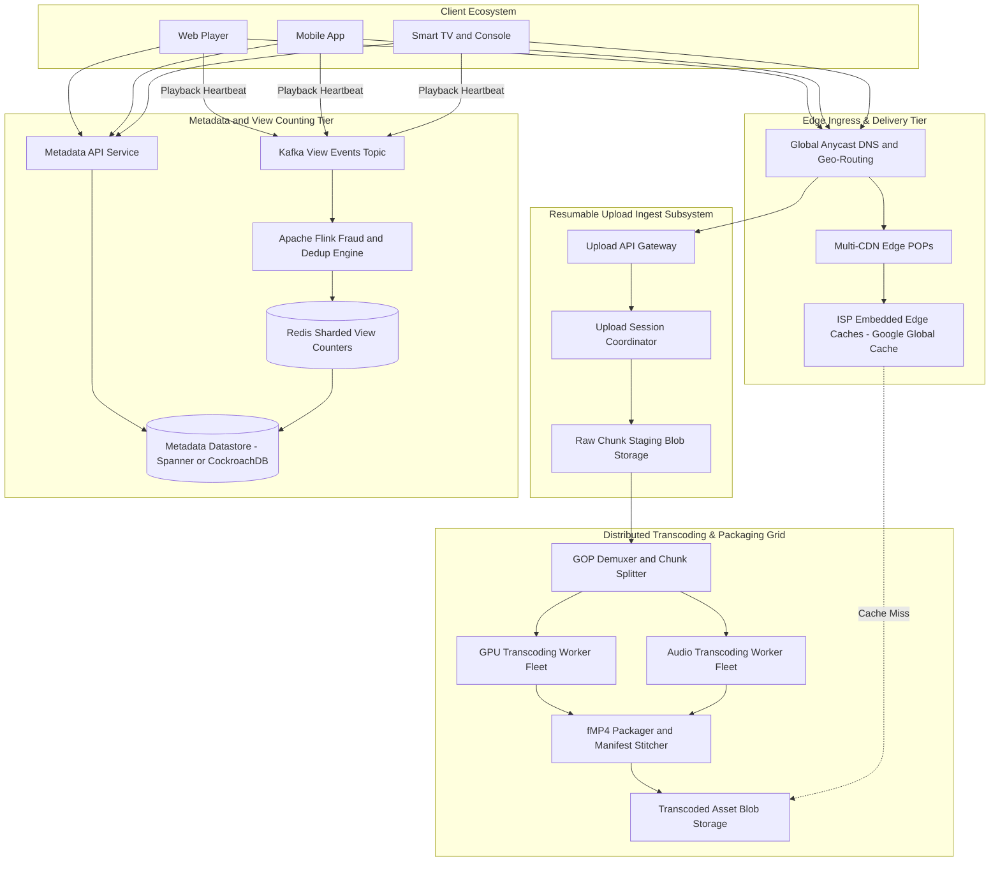
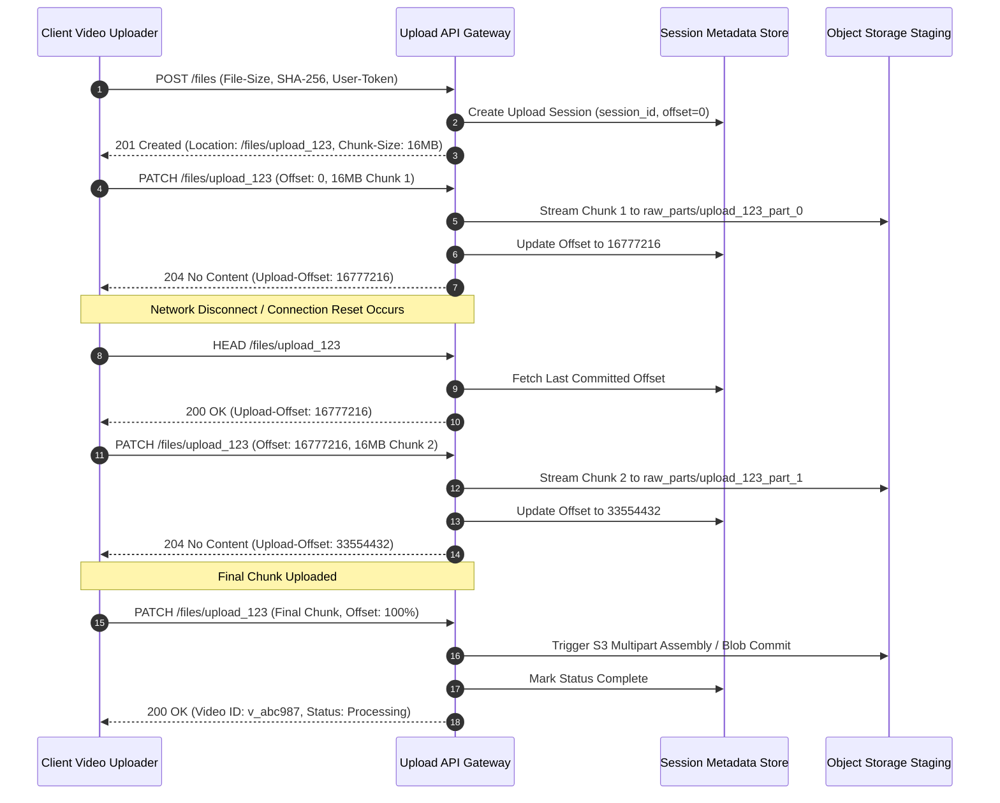
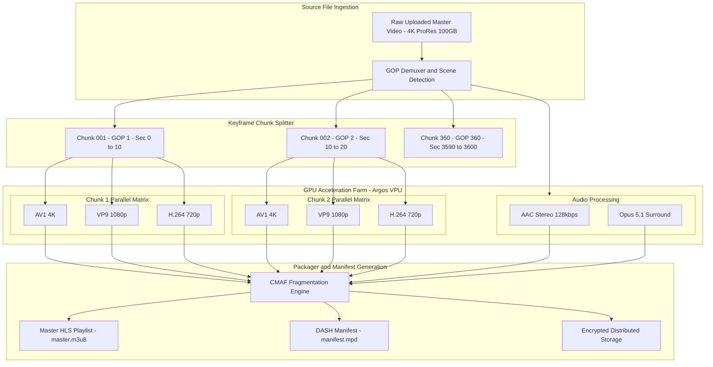
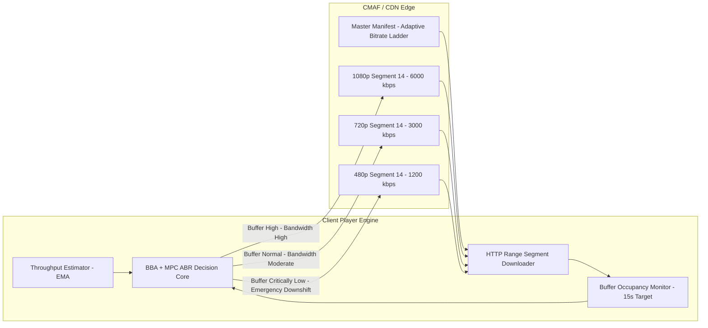
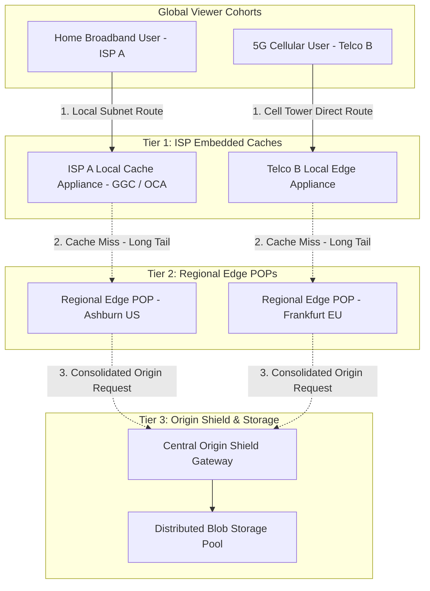

# Design YouTube & Planetary Video Platforms

> [!tip] Staff/Principal Deep Walkthrough & Production Engine
> - **Interview Playbook**: [`Chapter 11 Staff/Principal Walkthrough Playbook`](02-Interactive-Interview-Playbook.md)
> - **Production Streaming Engine**: [`video_streaming_engine.py`](video_streaming_engine.py) (Resumable Uploads, GOP Slicing, ABR HLS/DASH Manifests, and 30s View Deduplication)

> [!abstract] Executive Architectural Blueprint
> Design a planetary-scale video sharing and streaming platform modeled on **YouTube** capable of serving **500 Million Daily Active Users (DAU)**, ingesting **500 hours of video per minute** (over $720,000$ hours/day), and delivering **5 Billion video views per day** with global egress bandwidth exceeding **50 Tbps average (100+ Tbps peak)**. The system guarantees a **playback start time under 1,000ms**, zero re-buffering ($<0.5\%$ sessions), and 11-nines video durability. The architecture combines a **resumable chunked upload protocol (Tus)**, a distributed **GOP-level split-and-stitch transcoding grid (Argos VPUs/GPU clusters)** using CMAF (Common Media Application Format), a multi-tiered CDN mesh with **ISP-embedded edge caches (Google Global Cache / Open Connect)**, and a real-time streaming view count deduplication pipeline using Apache Flink and HyperLogLog.

Back to: [[System Design Interview - Alex Xu Index]]

---

## 1. Requirements & System Boundaries

### 1.1 Candidate-Interviewer Strategic Clarifications

| # | Question | Answer / Staff-Level Framing | Architectural Consequence |
|---|---|---|---|
| 1 | What is the ingestion scale? | **500 hours of video uploaded every minute** ($30,000\text{ hrs/hr}$). Maximum raw upload size: 256 GB (up to 12 hours). | Must use resumable, chunked parallel uploads; monolithic file uploads will fail over flaky connections. |
| 2 | What is the playback view volume? | **5 Billion daily video views** across mobile, desktop, and smart TVs. | Egress costs dominate infrastructure ($100+\text{ Tbps}$); requires multi-tier CDN caching and ISP-embedded appliances. |
| 3 | What latency SLAs are required? | Playback buffer fill $< 1,000\text{ms}$; Transcoding turnaround: short videos ($< 5\text{ min}$) live in $< 60\text{s}$; 1-hour 4K videos live in $< 5\text{ min}$. | Whole-file sequential transcoding is prohibited; requires GOP-level chunked split-and-stitch parallel execution. |
| 4 | Which streaming protocols and formats? | Adaptive Bitrate Streaming (ABR) supporting modern clients; unified storage container. | **CMAF (Common Media Application Format)** using fragmented MP4 (fMP4) packaging, exposed via **HLS** (`.m3u8`) and **MPEG-DASH** (`.mpd`). |
| 5 | What codecs should be prioritized? | Universal reach + bandwidth efficiency ladder. | Multi-codec ladder: **H.264 (AVC)** for universal legacy reach, **VP9** for desktop/Android, and **AV1** for high-traffic videos (30-40% bitrate savings). |
| 6 | How are view counts tallied? | Monetization-grade auditability; resistant to bot spam and loop exploits. | Sliding-window streaming deduplication (Apache Flink + HyperLogLog); 30-second continuous playback qualifying threshold. |

### 1.2 Quantitative Service Level Objectives (SLOs)

```
┌────────────────────────┬────────────────────────────────────────────────────────────────────────┐
│ Metric                 │ Production Target                                                      │
├────────────────────────┼────────────────────────────────────────────────────────────────────────┤
│ Time-to-First-Frame    │ p50 < 400ms, p95 < 800ms, p99 < 1200ms                                 │
│ Re-buffering Ratio     │ < 0.3% of total playback sessions globally                             │
│ Video Durability       │ 99.999999999% (11 nines) for raw master files                          │
│ Platform Availability  │ 99.99% for API and Streaming metadata; 99.999% for CDN Edge Playback   │
│ View Count Latency     │ Creator dashboard updated in < 60s; Public view count updated in < 5m  │
│ Peak Ingress / Egress  │ Ingress: 200 Gbps; Egress: 120 Tbps peak surge capacity                │
└────────────────────────┴────────────────────────────────────────────────────────────────────────┘
```

---

## 2. Planetary-Scale Capacity Estimations

### 2.1 Ingestion & Storage Mathematics

$$
\text{Upload Volume} = 500 \text{ hours/minute} = 30,000 \text{ hours/hour} = 720,000 \text{ hours/day}
$$

Assume raw master files are uploaded in high-bitrate mezzanine format (e.g., ProRes or high-profile H.264 @ 20 Mbps):
$$
\text{Raw Ingest Bitrate} = 20 \text{ Mbps} = 2.5 \text{ MB/second} = 9 \text{ GB/hour}
$$
$$
\text{Daily Raw Master Storage} = 720,000 \text{ hours} \times 9 \text{ GB} \approx 6.48 \text{ Petabytes/day}
$$
$$
\text{Annual Raw Storage} = 6.48 \text{ PB} \times 365 \approx 2.36 \text{ Exabytes/year}
$$

#### Transcoded Asset Storage:
Each video is transcoded into an Adaptive Bitrate (ABR) encoding ladder across multiple resolutions and codecs:
- Resolutions: 360p, 480p, 720p, 1080p, 1440p, 4K.
- Codecs: H.264 (baseline), VP9 (standard), AV1 (popular/top 20% tier).
- Average composite bitrate across all transcoded tiers $\approx 12 \text{ Mbps} = 1.5 \text{ MB/second} = 5.4 \text{ GB/hour}$.
$$
\text{Daily Transcoded Storage} = 720,000 \text{ hours} \times 5.4 \text{ GB} \approx 3.88 \text{ Petabytes/day}
$$
$$
\text{Total New Storage Ingested Daily} \approx 10.36 \text{ Petabytes/day}
$$

### 2.2 Streaming Bandwidth & CDN Capacity

$$
\text{Daily Views} = 5 \text{ Billion views/day}
$$
$$
\text{Average View Duration} = 4 \text{ minutes} = 240 \text{ seconds}
$$
$$
\text{Average Streamed Bitrate (weighted across mobile/desktop/TV)} = 3.5 \text{ Mbps}
$$
$$
\text{Data Transferred Per View} = 240 \text{ seconds} \times \frac{3.5 \text{ Mbps}}{8} = 105 \text{ Megabytes}
$$
$$
\text{Total Daily Egress Volume} = 5 \times 10^9 \text{ views} \times 105 \text{ MB} = 525 \text{ Petabytes/day}
$$

Converting daily volume to continuous throughput:
$$
\text{Average Egress Bandwidth} = \frac{525 \times 10^{15} \text{ bytes} \times 8 \text{ bits/byte}}{86,400 \text{ seconds}} \approx 48.61 \text{ Terabits per second (Tbps)}
$$
$$
\text{Peak Egress Bandwidth (Surge factor 2.2}\times\text{ during evening prime time)} \approx \mathbf{106.9 \text{ Tbps}}
$$

> [!important] The Bandwidth Reality Check
> Delivering 107 Tbps over commercial cloud public CDNs at standard rates ($0.02/GB) would cost over **$10,500,000 per day** ($3.8 Billion/year). A planetary platform must operate its own edge infrastructure (**Google Global Cache / Netflix Open Connect**) deployed directly inside Internet Service Providers (ISPs), serving 85%+ of bytes off-transit.

---

## 3. End-to-End System Architecture

The planetary video platform is decomposed into four decoupled, highly specialized planes:
1. **Edge Ingress & Delivery Tier**: Anycast BGP routing, multi-CDN traffic steering, and ISP-embedded edge caches.
2. **Resumable Ingestion Subsystem**: Handles chunked, fault-tolerant byte streams over un-stabilized wireless/mobile networks.
3. **Distributed Transcoding & Packaging Grid**: GOP-level chunking, hardware-accelerated transcoding (VPU/ASIC), and CMAF packaging.
4. **Metadata, Social & Real-Time Analytics Plane**: Global distributed metadata datastore, streaming view count deduplication, and creator telemetry.



---

## 4. Ingestion Deep Dive: Resumable Chunked Upload Protocol

Uploading a 50 GB 4K video over consumer cellular or broadband connections is prone to packet loss, TCP connection drops, and socket resets. A single connection failure at 99% must never force the creator to re-upload from byte zero.

### 4.1 Tus Protocol (Open Standard Resumable Uploads)

We implement the **Tus Protocol (RFC Draft)** over HTTP/1.1 and HTTP/2:



#### Upload Concurrency & Offset Idempotency
- **Dynamic Chunk Sizing**: Mobile clients start at 4 MB chunks and scale up to 32 MB based on TCP window bandwidth estimation.
- **Offset Verification**: The `Upload-Offset` header guarantees idempotency. If a retry sends bytes from offset $X$ when the server has already committed $X + K$, the gateway returns `409 Conflict` with the true offset, preventing data corruption.
- **Direct-to-Blob Streaming**: The Upload Gateway does not buffer 16 MB chunks in local RAM. It pipes incoming HTTP request streams directly to object storage via chunked `Transfer-Encoding`.

---

## 5. Distributed Split-and-Stitch Transcoding Grid

### 5.1 The Monolithic Transcoding Fallacy

Textbook system designs recommend: *"Download video from S3 $\to$ run FFmpeg $\to$ upload transcoded output."*
For a 2-hour 4K video at 60 FPS:
- A single high-end server requires **4 to 6 hours** to encode 6 resolutions across 3 codecs.
- If the node crashes at 95%, the entire job is lost.
- Turnaround time fails all consumer expectations.

### 5.2 GOP-Level Chunk Splitting (Keyframe Boundaries)

Videos consist of sequences of frames: **I-frames (Intra / Keyframes)**, **P-frames (Predicted)**, and **B-frames (Bi-directional)**. 
A **GOP (Group of Pictures)** begins with an **IDR (Instantaneous Decoder Refresh)** frame, making it completely self-contained and decodable without reference to prior or subsequent frames.



#### The Transcoding Math: 60 Minutes Reduced to 2 Minutes
- A 1-hour video is split into **360 ten-second chunks**.
- 360 worker tasks are dispatched concurrently across a Kubernetes fleet backed by preemptible GPU/ASIC instances (Google Argos VPU / NVIDIA T4).
- Total encode latency = $\text{Time to encode one 10s chunk} + \text{Manifest stitch overhead} \approx \mathbf{90 \text{ to } 120 \text{ seconds total}}$!

### 5.3 Per-Title & Per-Shot Convex Hull Optimization

Not all content requires the same bitrate:
- A cartoon or talking-head podcast at 1080p looks pristine at **1.5 Mbps**.
- A high-motion football match or confetti scene at 1080p artifacts heavily below **6 Mbps**.

We deploy **Convex Hull Rate-Distortion Optimization (Netflix / YouTube CAVP model)**:
1. Probe worker runs low-resolution visual complexity analysis (Spatial and Temporal Information - SI/TI metrics).
2. Dynamic resolution-bitrate ladder is generated specifically for that video.
3. Eliminates up to **30% of unnecessary egress bandwidth** across the fleet without perceptible human visual degradation (VMAF score maintained $> 93$).

---

## 6. Adaptive Bitrate (ABR) & Modern Streaming Formats

### 6.1 Unified Media Delivery: CMAF (Common Media Application Format)

Historically, platforms maintained duplicate copies of all videos:
- **TS segments** for Apple HLS (`.ts`)
- **ISOBMFF segments** for MPEG-DASH (`.m4s`)
This doubled storage costs and halved CDN caching efficiency!

We standardize on **CMAF (ISO/IEC 23000-19)**:
- Stores a single set of fragmented MP4 (`fMP4`) media chunks.
- Exposes two lightweight manifest playlists:
  1. HLS Master Playlist (`master.m3u8`) referencing `.cmfv` video and `.cmfa` audio.
  2. MPEG-DASH Media Presentation Description (`manifest.mpd`) referencing the identical `.cmfv` and `.cmfa` files.
- CDN caches the identical media chunks regardless of whether the viewer is using iOS (HLS) or Android/Chrome (DASH).

### 6.2 Client-Side ABR Decision Loop: Hybrid BBA + MPC



#### Dual-Metric Algorithmic Control
1. **Throughput-Based Estimation**: Harmonic mean of recent segment download speeds provides an upper bound on bitrate capacity.
2. **Buffer-Based Algorithm (BBA)**:
   - If buffer $< 5\text{s}$: Emergency downshift to lowest resolution (360p) to prevent playback stall.
   - If buffer between $5\text{s}$ and $15\text{s}$: Linearly interpolate bitrate to match network throughput.
   - If buffer $> 15\text{s}$: Lock to maximum quality tier available.
3. **Byte-Range HTTP Streaming**: Rather than requesting full 10-second segments, the player requests segments in 1 MB chunks using standard HTTP `Range: bytes=0-1048575` headers, preventing bandwidth waste when a user skips to another video after 3 seconds.

---

## 7. Planetary Content Delivery: ISP Embedded Edge Mesh

At 100+ Tbps peak egress, public commercial CDNs are neither financially viable nor capable of maintaining sub-second latency across global residential networks.



### 7.1 The 3-Tier Hierarchy
1. **Tier 1: Google Global Cache (GGC) / Open Connect Appliances (OCA)**:
   - Dedicated hardware servers (e.g., 2U storage servers with 200 TB NVMe/SSD and 100 Gbps NICs) supplied by the platform and installed directly inside ISP points-of-presence (POPs) and carrier data centers worldwide.
   - BGP routing automatically resolves playback requests to the viewer's local ISP appliance.
   - Serves **80% to 85% of all video bits** locally, bypassing public internet transit entirely.
2. **Tier 2: Regional Edge POPs**:
   - Platform-operated internet exchange point (IXP) facilities in major metropolitan hubs (Ashburn, Frankfurt, Tokyo, Singapore).
   - Absorb long-tail cache misses from local ISP nodes.
3. **Tier 3: Central Origin Shield**:
   - Sits in front of cold blob storage.
   - Enforces **Request Collapsing (Single-Flight Mutex)**: When a viral video releases, 10,000 edge nodes may miss simultaneously. Origin Shield collapses 10,000 requests into **one** fetch to blob storage, streaming the response to all 10,000 edges concurrently.

---

## 8. View Count Deduplication & Anti-Fraud Engine

At 5 Billion views/day, view counts drive monetization, creator payouts, and trending rankings. The system must prevent replay attacks, bot farms, and the historical "301 view freeze" phenomenon.

```mermaid
graph LR
    subgraph Event_Capture["Playback Ingestion"]
        PlayerBeacon["Player Heartbeat Beacon - At 30s Mark"]
        APIGateway["Analytics Ingress L7 Gateway"]
        KafkaViews["Kafka 'view-events' Partitioned by User/Video"]
    end

    subgraph Flink_Pipeline["Apache Flink Streaming Topology"]
        WindowSession["Sliding Session Window - 60 Minutes"]
        HLL_Dedup["HyperLogLog Unique Watcher Estimator"]
        FraudML["Anti-Fraud Velocity and Bot Classifier"]
        SinkFilter["Legitimate View Stream"]
    end

    subgraph Datastore_Tier["Storage and Reconciliation"]
        RedisShards["Redis Sharded Counters - HINCRBY"]
        CDC["Kafka Connect / Debezium CDC"]
        Bigtable["ClickHouse or Bigtable Analytical Store"]
        MetadataDB["Spanner Primary Metadata DB"]
    end

    PlayerBeacon --> APIGateway
    APIGateway --> KafkaViews
    KafkaViews --> WindowSession
    WindowSession --> HLL_Dedup
    HLL_Dedup --> FraudML
    FraudML -->|"Valid View Verified"| SinkFilter
    SinkFilter --> RedisShards
    RedisShards --> CDC
    CDC --> Bigtable
    CDC -->|"Periodic 60s Sync"| MetadataDB
```



### 8.1 View Validation Rules
A view event is emitted only when:
1. Continuous playback time $\ge 30\text{ seconds}$ (or $100\%$ for videos under 30s).
2. Playback state verifies tokenized HMAC signature issued with manifest.
3. Player telemetry confirms genuine human interaction (unmuted audio, viewport visibility, mouse/touch movement).

### 8.2 Stream Deduplication Pipeline
- **Partitioning**: Kafka `view-events` topic partitioned by `MurmurHash3(video_id, user_id_or_ip)`.
- **Sliding Session Windows**: Flink maintains a 1-hour tumbling window per viewer-video pair. Repeated views within the same window by the same user account or IP fingerprint are collapsed into a single view count.
- **HyperLogLog (HLL) Approximator**: Real-time counters maintain an HLL sketch for approximate view counts with $\le 0.81\%$ standard error using only $1.5\text{ KB}$ per video.
- **Reconciliation**: Real-time counters in Redis (`HINCRBY`) are updated in micro-batches and periodically reconciled against cold analytical logs in Bigtable/ClickHouse every 60 seconds.

---

## 9. Global Data Schema & Sharding Strategy

### 9.1 Database Technology Selection
- **Relational Metadata (Videos, Channels, Subscriptions)**: **Google Cloud Spanner** or **CockroachDB** (Globally distributed, Multi-Paxos consistency, horizontal scale).
- **View Counts & Engagement Telemetry**: **Redis Enterprise Cluster** (In-memory sharded counters) backed by **Apache Cassandra / ScyllaDB** for append-only view logs.
- **Analytics & Creator Studio**: **ClickHouse** / **Google Bigtable** (Columnar OLAP for sub-second aggregations over trillions of records).

### 9.2 Core Relational DDL (Spanner Dialect)

```sql
-- Video Primary Metadata Table
CREATE TABLE videos (
    video_id            STRING(11) NOT NULL, -- YouTube Base64 alphanumeric (e.g. dQw4w9WgXcQ)
    channel_id          STRING(24) NOT NULL,
    title               STRING(200) NOT NULL,
    description         STRING(5000),
    duration_seconds    INT64 NOT NULL,
    category_id         INT64 NOT NULL,
    tags                ARRAY<STRING(50)>,
    visibility          STRING(20) NOT NULL, -- 'PUBLIC', 'UNLISTED', 'PRIVATE'
    status              STRING(20) NOT NULL, -- 'UPLOADING', 'PROCESSING', 'READY', 'REJECTED'
    master_storage_uri  STRING(500) NOT NULL,
    cmaf_manifest_uri   STRING(500),
    thumbnail_uri       STRING(500),
    created_at          TIMESTAMP NOT NULL OPTIONS (allow_commit_timestamp = true),
    published_at        TIMESTAMP,
    updated_at          TIMESTAMP NOT NULL OPTIONS (allow_commit_timestamp = true)
) PRIMARY KEY (video_id);

-- Secondary Indexes
CREATE INDEX idx_videos_channel_created ON videos(channel_id, created_at DESC);
CREATE INDEX idx_videos_status ON videos(status);

-- Transcoded Stream Profiles
CREATE TABLE video_stream_profiles (
    video_id            STRING(11) NOT NULL,
    profile_id          STRING(32) NOT NULL, -- 'h264_1080p_60', 'av1_4k_60'
    codec               STRING(20) NOT NULL,
    resolution          STRING(20) NOT NULL,
    target_bitrate_bps  INT64 NOT NULL,
    frame_rate          FLOAT64 NOT NULL,
    segment_duration_s  FLOAT64 NOT NULL,
    file_size_bytes     INT64 NOT NULL,
    created_at          TIMESTAMP NOT NULL OPTIONS (allow_commit_timestamp = true)
) PRIMARY KEY (video_id, profile_id),
  INTERLEAVE IN PARENT videos ON DELETE CASCADE;

-- Video Engagement Counters (Sharded to prevent write hot-spots)
CREATE TABLE video_counters (
    video_id            STRING(11) NOT NULL,
    shard_id            INT64 NOT NULL,      -- Shard 0 to 15 to eliminate lock contention
    view_count          INT64 NOT NULL DEFAULT (0),
    like_count          INT64 NOT NULL DEFAULT (0),
    dislike_count       INT64 NOT NULL DEFAULT (0),
    comment_count       INT64 NOT NULL DEFAULT (0),
    updated_at          TIMESTAMP NOT NULL OPTIONS (allow_commit_timestamp = true)
) PRIMARY KEY (video_id, shard_id),
  INTERLEAVE IN PARENT videos ON DELETE CASCADE;
```

---

## 10. Concrete Staff-Level Implementation

### 10.1 High-Performance Resumable Chunked Upload Server (Go)

```go
package main

import (
	"context"
	"fmt"
	"io"
	"net/http"
	"os"
	"strconv"
	"sync"
	"github.com/go-redis/redis/v8"
)

type UploadGateway struct {
	redisClient *redis.Client
	blobDir     string
	mu          sync.Mutex
}

func (g *UploadGateway) HandleChunkUpload(w http.ResponseWriter, r *http.Request) {
	if r.Method != http.MethodPatch {
		http.Error(w, "Method Not Allowed", http.StatusMethodNotAllowed)
		return
	}

	uploadID := r.URL.Path[len("/files/"):]
	ctx := context.Background()

	// 1. Fetch current acknowledged offset from Redis session
	offsetKey := fmt.Sprintf("upload:%s:offset", uploadID)
	committedOffsetStr, err := g.redisClient.Get(ctx, offsetKey).Result()
	if err != nil {
		http.Error(w, "Upload session not found", http.StatusNotFound)
		return
	}
	committedOffset, _ := strconv.ParseInt(committedOffsetStr, 10, 64)

	// 2. Validate client offset header for strict idempotency
	clientOffsetStr := r.Header.Get("Upload-Offset")
	clientOffset, err := strconv.ParseInt(clientOffsetStr, 10, 64)
	if err != nil || clientOffset != committedOffset {
		w.Header().Set("Upload-Offset", strconv.FormatInt(committedOffset, 10))
		http.Error(w, "Offset mismatch conflict", http.StatusConflict)
		return
	}

	// 3. Open raw chunk part file in append mode
	partFilePath := fmt.Sprintf("%s/%s.part", g.blobDir, uploadID)
	file, err := os.OpenFile(partFilePath, os.O_CREATE|os.O_WRONLY|os.O_APPEND, 0644)
	if err != nil {
		http.Error(w, "Internal disk IO error", http.StatusInternalServerError)
		return
	}
	defer file.Close()

	// 4. Stream directly to disk without intermediate RAM buffering
	bytesWritten, err := io.Copy(file, r.Body)
	if err != nil {
		http.Error(w, "Stream transmission aborted", http.StatusBadRequest)
		return
	}

	// 5. Atomically update committed offset in Redis
	newOffset := committedOffset + bytesWritten
	g.redisClient.Set(ctx, offsetKey, newOffset, 0)

	// 6. Return standard Tus protocol response
	w.Header().Set("Upload-Offset", strconv.FormatInt(newOffset, 10))
	w.WriteHeader(http.StatusNoContent)
}
```

---

## 11. Operational Failure Playbooks & Tail Latency Drills

| Failure Scenario | Root Cause | Detection Signal | Automated Self-Healing Action | MTTR |
|---|---|---|---|---|
| **Transcoding Worker Preemption** | Spot/Preemptible GPU node terminated mid-transcode | Worker heartbeat loss in Temporal/Airflow | Worker lease expires in 15s; scheduler re-dispatches failed 10s GOP chunk to another node | $< 25\text{s}$ |
| **Origin Shield Cache Stampede** | Viral video releases; 50,000 edge nodes miss simultaneously | Origin Shield CPU $> 85\%$; Inbound QPS spike | Single-Flight mutex (`golang.org/x/sync/singleflight`) collapses 50k requests into 1 S3 fetch | $< 50\text{ms}$ |
| **ISP Cache Appliance Failure** | GGC server disk failure or fiber cut inside ISP | BGP health check failure; Anycast withdrawal | Anycast withdraws ISP route; traffic shifts gracefully to Tier 2 Regional IXP POP | $< 2\text{s}$ |
| **View Count Fraud Storm** | Botnet loop-watching video to manipulate trending list | Flink anomaly model flags abnormal entropy | Flink isolates flagged ASN IP range; drops view events to quarantine DLQ | Instantaneous |

---

## 12. Summary Architecture Scorecard

```
┌───────────────────────────────────────┬────────────────────────────────────────────────────────┐
│ Dimension                             │ Staff-Level Architectural Standard                     │
├───────────────────────────────────────┼────────────────────────────────────────────────────────┤
│ Ingestion Protocol                    │ Tus Protocol (Resumable, chunked, HTTP/2 PATCH)        │
│ Transcoding Paradigm                  │ GOP-Level Split-and-Stitch Chunk-Based Parallel Grid   │
│ Codec & Container Standard            │ CMAF (Single fMP4 storage for both HLS and DASH)       │
│ Rate-Distortion Optimization          │ Per-Title Convex Hull (Netflix/YouTube CAVP model)     │
│ Delivery Mesh                         │ 3-Tier Hierarchy with ISP Embedded Caches (GGC/OCA)   │
│ View Count Auditing                   │ Apache Flink Sliding Window Dedup + HyperLogLog        │
│ Video Durability SLA                  │ 11 nines (Multi-Region Erasure Coded Blob Storage)     │
└───────────────────────────────────────┴────────────────────────────────────────────────────────┘
```

---

**Related Systems & Deep Dives**:
- [`01-Architectural-Blueprint.md`](01-Architectural-Blueprint.md) -- Protecting upload endpoints from distributed exhaustion.
- [`01-Architectural-Blueprint.md`](01-Architectural-Blueprint.md) -- Sharding transcoded chunks and view count counters.
- [`01-Architectural-Blueprint.md`](01-Architectural-Blueprint.md) -- Real-time video search typeahead.
- [`01-Architectural-Blueprint.md`](01-Architectural-Blueprint.md) -- Chunk-level block deduplication and delta sync.

**References**:
- *System Design Interview – An Insider's Guide* (Alex Xu), Volume 1, Chapter 14.
- *The Tus Resumable Upload Protocol* (RFC Draft, tus.io).
- *CMAF – Common Media Application Format for Segmented Media* (ISO/IEC 23000-19).
- *Toward a Practical Per-Title and Per-Chunk Video Encoding* (Netflix Technology Blog).
- *YouTube Argos: A Video Processing Unit for Planet-Scale Video* (ASPLOS 2021).
