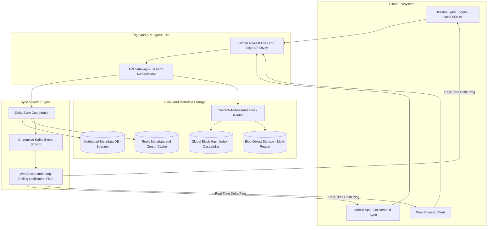
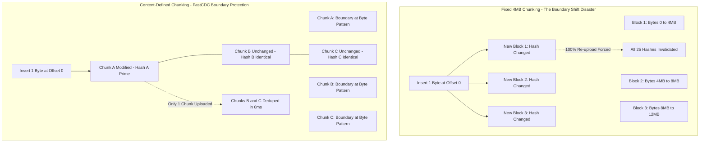
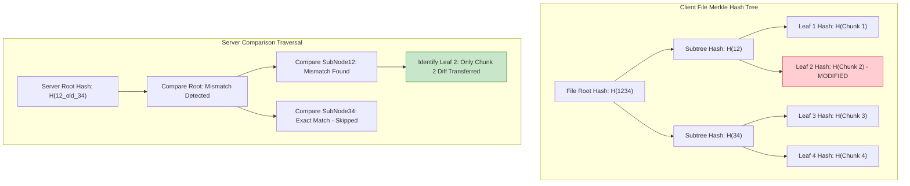
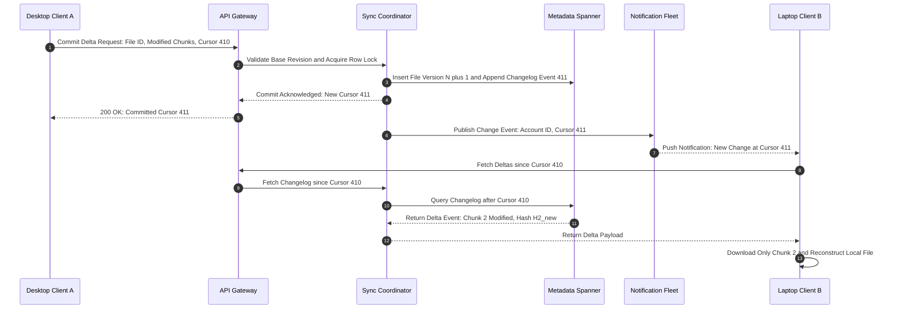
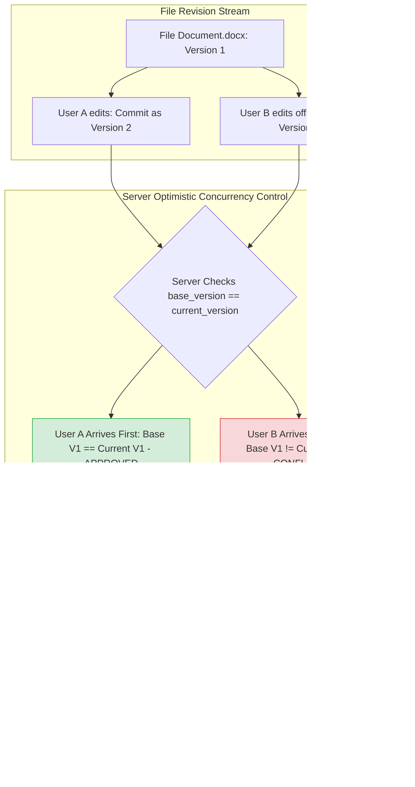
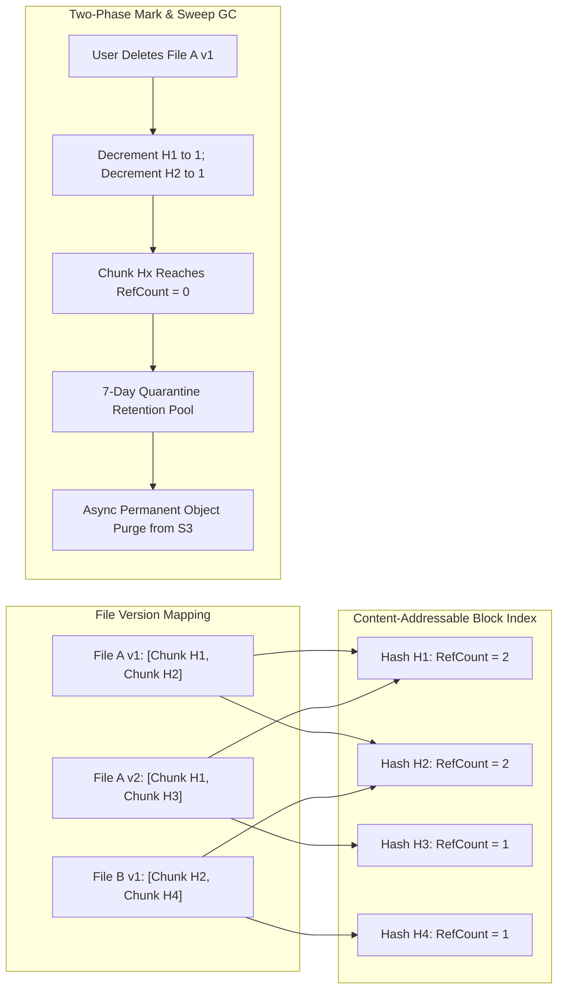

# Design Google Drive & Cloud File Sync Services

> [!tip] Staff/Principal Deep Walkthrough & Production Engine
> - **Interview Playbook**: [`Chapter 12 Staff/Principal Walkthrough Playbook`](02-Interactive-Interview-Playbook.md)
> - **Production Cloud Storage Engine**: [`cloud_storage_engine.py`](cloud_storage_engine.py) (FastCDC Chunking, Merkle Tree Delta Sync, CAS Global Deduplication, and Inode Moves)

> [!abstract] Executive Architectural Blueprint
> Design a global, hyperscale file storage and cross-device synchronization platform modeled on **Google Drive** and **Dropbox** supporting **100 Million Daily Active Users (DAU)**, **1 Billion registered accounts**, and over **100 Billion managed files** with committed storage exceeding **500 Petabytes**. The system guarantees **11-nines (99.999999999%) data durability**, sub-second cross-device sync propagation ($p99 < 3\text{s}$), and bandwidth optimization. The architecture solves the catastrophic *boundary-shift re-upload problem* using **Content-Defined Chunking (FastCDC)** and **Merkle Tree reconciliation**, implements an append-only **monotonic cursor changelog journal** for $O(1)$ folder renames, provides **Content-Addressable Storage (CAS)** with reference-counted two-phase garbage collection, and enforces optimistic concurrency control.

Back to: [[System Design Interview - Alex Xu Index]]

---

## 1. Requirements & System Boundaries

### 1.1 Candidate-Interviewer Strategic Clarifications

| # | Question | Answer / Staff-Level Framing | Architectural Consequence |
|---|---|---|---|
| 1 | What file sizes and types must be supported? | Any arbitrary binary or text file up to **250 GB per file**. | Large files cannot be buffered in server RAM; requires streaming chunked uploads with resumable state. |
| 2 | What is the device ecosystem? | Windows, macOS, Linux desktop sync clients, iOS/Android mobile apps, and Web browsers. | Desktop uses continuous background sync; mobile uses on-demand chunk hydration to preserve battery and cellular data. |
| 3 | How does synchronization work when a file is edited? | **Delta sync**: Only the binary blocks that changed must be uploaded/downloaded. | Requires chunking algorithms; naive fixed-size chunking fails on byte insertions due to boundary shift. Must use **FastCDC**. |
| 4 | How are folder renames/moves handled? | Moving a folder with 50,000 files to another directory must be instantaneous. | Inode-style entity model: Folders and files have immutable UUIDs; move is an $O(1)$ `parent_id` mutation in metadata. |
| 5 | What happens during concurrent edits? | **Optimistic Concurrency Control (OCC)** with conflict copy branching. | First committer wins; second committer creates a branching "Conflicted Copy". Real-time document typing (Docs) uses OT/CRDTs in a separate service. |
| 6 | What are the durability and consistency requirements? | **11-nines durability** for file blocks; **Linearizable / Strong consistency** for file namespace metadata. | Metadata stored in globally distributed consensus engines (Google Cloud Spanner / CockroachDB); block storage in multi-region erasure-coded object storage. |

### 1.2 Quantitative Service Level Objectives (SLOs)

```
┌────────────────────────┬────────────────────────────────────────────────────────────────────────┐
│ Metric                 │ Production Target                                                      │
├────────────────────────┼────────────────────────────────────────────────────────────────────────┤
│ Data Durability        │ 99.999999999% (11 nines) via Reed-Solomon (8+4 or 10+4) Erasure Coding │
│ Sync Propagation Time  │ p50 < 800ms, p95 < 2000ms, p99 < 3000ms across online devices          │
│ Platform Availability  │ 99.99% for Metadata & Sync API; 99.999% for Block Download/Upload      │
│ Metadata Query Latency │ p95 < 15ms for file listing; p99 < 35ms for commit verification       │
│ Sync Poll Throughput   │ 1.66 Million sustained sync checks / cursor evaluations per second    │
│ Bandwidth Reduction    │ > 90% bandwidth saved on edits via FastCDC + Merkle Tree diffing       │
└────────────────────────┴────────────────────────────────────────────────────────────────────────┘
```

---

## 2. Hyperscale Capacity & Traffic Estimations

### 2.1 Storage Mathematics

$$
\text{Total Registered Users} = 1 \text{ Billion} \quad | \quad \text{Daily Active Users (DAU)} = 100 \text{ Million}
$$
$$
\text{Average Files Per User} = 1,000 \text{ files} \implies \text{Total Tracked File Objects} = 1 \text{ Trillion files}
$$
$$
\text{Average File Size} = 500 \text{ KB} \quad (\text{Bimodal: Millions of small docs } < 100\text{KB} + \text{large media } > 1\text{GB})
$$

#### Total Physical Storage:
Assume 100M active users store an average of 5 GB of actual data:
$$
\text{Active Storage Footprint} = 100\text{M} \times 5 \text{ GB} = 500 \text{ Petabytes (PB)}
$$

With **Content-Defined Chunking deduplication** (typically 30% savings across shared files and multiple revisions) and **Lz4/Zstd block compression** (25% reduction on documents/code):
$$
\text{Compressed Deduplicated Storage} = 500 \text{ PB} \times (1 - 0.30) \times (1 - 0.25) \approx \mathbf{262.5 \text{ Petabytes}}
$$

With **Reed-Solomon Erasure Coding ($8+4$)** introducing a $1.5\times$ storage parity overhead:
$$
\text{Total Raw Disk Storage Provisioned} = 262.5 \text{ PB} \times 1.5 \approx \mathbf{393.75 \text{ Petabytes}}
$$

### 2.2 Metadata Footprint & QPS Math

- Each file object metadata (UUID, user_id, parent_id, name, size, permissions, version, Merkle root hash): $\approx 500 \text{ bytes}$.
- $100 \text{ Billion active files} \times 500 \text{ bytes} \approx 50 \text{ Terabytes}$ of primary metadata.
- Average chunks per file $\approx 4$ chunks (at 1MB-4MB average chunk size):
  - $400 \text{ Billion chunk mappings} \times 64 \text{ bytes} (\text{SHA-256 hash} + \text{offset} + \text{size}) \approx 25.6 \text{ Terabytes}$.
  - **Total Metadata DB Size $\approx 75.6 \text{ Terabytes}$** (sharded across distributed consensus nodes).

#### Throughput and QPS:
- 100M active desktop/mobile clients maintaining a 60-second long-polling or WebSocket heartbeat:
$$
\text{Sync Polling QPS} = \frac{100 \times 10^6}{60} \approx \mathbf{1,666,666 \text{ QPS}}
$$
*(Offloaded to an asynchronous edge Notification Fleet reading cached monotonic cursor timestamps from Redis).*
- Active file mutations (creates, edits, renames, deletes): $100\text{M DAU} \times 10 \text{ edits/day} = 1 \text{ Billion edits/day}$.
$$
\text{Write / Commit QPS} = \frac{10^9}{86,400} \approx 11,574 \text{ QPS (Peak 2.5}\times \approx \mathbf{29,000 \text{ QPS)}}
$$

---

## 3. End-to-End System Architecture

The architecture decouples the high-throughput, low-latency **Metadata & Sync Control Plane** from the high-bandwidth **Block Storage Data Plane**:



---

## 4. Chunking Micro-Architecture: The Boundary-Shift Disaster

### 4.1 Fixed-Size Chunking vs Content-Defined Chunking (CDC)

The foundational flaw in naive file sync systems is **Fixed-Size Chunking** (e.g., splitting files into fixed 4 MB intervals):



#### The FastCDC Algorithmic Solution
Instead of fixed offsets, **Content-Defined Chunking (FastCDC)** determines cut points based on the *data content itself*:
1. A sliding window of size $W$ (typically 48 bytes) rolls across the byte stream.
2. At each byte, a rolling polynomial hash (e.g., Gear hash or Rabin fingerprint) is computed:
$$
H_i = (H_{i-1} \ll 1) + \text{GEAR\_TABLE}[B_i]
$$
3. A chunk cut point is declared when the lowest $k$ bits of $H_i$ match a mask:
$$
(H_i \ \& \ \text{MASK}) == 0
$$
4. To bound chunk sizes between minimum ($1\text{ MB}$) and maximum ($8\text{ MB}$) with a target average ($4\text{ MB}$), FastCDC switches between a relaxed mask in the sub-average region and a strict mask in the post-average region.
5. **The Result**: Inserting or deleting bytes only shifts the boundary of the local chunk. All subsequent chunks retain identical boundaries and SHA-256 hashes, achieving **98%+ deduplication efficiency**!

---

## 5. Merkle Tree State Representation & Delta Reconciliation

When a client synchronizes a file with thousands of chunks, transmitting the full array of chunk hashes over the network on every keystroke or autosave is wasteful.

We represent the chunk layout as a **Merkle Tree (Cryptographic Hash Tree)**:



### $O(\log N)$ Tree Reconciliation Protocol
1. **Root Hash Comparison**: The client sends only the **Merkle Root Hash** ($32\text{ bytes}$) in its sync commit request.
2. If the server's root hash matches, the file is identical; reconciliation terminates in **1 round-trip ($O(1)$)**.
3. If root hashes mismatch, the client and server traverse down the tree branches. Subtrees with matching hashes are skipped entirely.
4. For a 10 GB file with 2,500 chunks, identifying a modified chunk requires only **$\log_2(2500) \approx 12$ node comparisons** instead of uploading a 80 KB array of hashes.

---

## 6. Journal-Based Delta Sync & Changelog Streaming

The desktop file system is a mutable graph. Users frequently move, rename, or reorganize deep folder structures. If moving a folder containing 50,000 files causes the sync engine to issue 50,000 deletion and 50,000 re-upload events, the network collapses.

### 6.1 Inode-Style Persistent UUID Graph

Every folder and file is assigned an immutable 64-bit UUID (`entity_id`). 
A move operation:
```
/Company/Projects/2026/Report.docx  -->  /Archive/Report.docx
```
Is represented simply as:
$$
\text{UPDATE entity SET parent\_id = 'uuid\_archive', updated\_at = NOW() WHERE entity\_id = 'uuid\_report';}
$$
This metadata mutation takes **$< 5\text{ms}$** and generates a single changelog record. Zero file bytes are transferred.

### 6.2 The Monotonic Changelog Journal

All filesystem mutations are committed to an append-only, per-account **Changelog Journal** ordered by a strictly monotonic sequence number (`cursor`):



#### Sync Notification Long-Polling / WebSocket Fleet
- Clients do not query the database. They hold long-lived connections (WebSocket or HTTP/2 Server-Sent Events) to an edge **Push Fleet**.
- Redis maintains the latest `user_id -> latest_cursor`.
- When a commit occurs, the Sync Service publishes to Kafka $\to$ Push Fleet pushes a 20-byte lightweight ping: `{"cursor": 411}`.
- The client wakes up and queries the delta API: `GET /v1/delta?since=410`.

---

## 7. Optimistic Concurrency & Conflict Branching

When two devices modify the same file concurrently (or one edits while offline), a race condition occurs upon reconnection.



### 7.1 The Conflict Resolution Protocol
1. **Optimistic Locking**: Every commit payload includes the `base_version` the client started from.
2. **Server Atomic Compare-and-Set (CAS)**:
   ```sql
   UPDATE file_revisions 
   SET version = :new_version, root_hash = :new_root_hash 
   WHERE file_id = :file_id AND version = :base_version;
   ```
3. **Collision Handling**:
   - If rows updated $= 0$, another device committed first.
   - The server **never silently overwrites data**.
   - The server creates a **Conflicted Copy**:
     `Quarterly Financials (Kunal's conflicted copy 2026-04-04).xlsx`
   - Both revisions are preserved durably in the cloud; notifications alert both users to reconcile differences.

---

## 8. Content-Addressable Storage (CAS) & Two-Phase GC

### 8.1 CAS Architecture
File blocks are stored in a global, immutable **Content-Addressable Storage (CAS)** pool. A block's physical storage key is simply its cryptographic digest:
$$
\text{Storage Key} = \text{SHA-256}(\text{Raw Block Bytes})
$$
- **Cross-File Deduplication**: If 500 users upload the identical 50 MB tax form or software binary, the block is stored in object storage **exactly once**.
- **Immutable Security**: Blocks cannot be mutated in place; edits produce new chunks with new hashes.



### 8.2 Two-Phase Garbage Collection (Safety Against Race Conditions)
A severe bug in CAS storage: A client computes hash $H_x$ for a block and finds it already exists in the catalog. At that exact microsecond, another user deletes the only file referencing $H_x$. If GC immediately purges the physical block, the first user's file is corrupted!

**The Quarantine Protocol**:
1. When a file version is deleted or pruned, the reference count of its constituent chunks is decremented.
2. Chunks with $\text{RefCount} = 0$ are moved to a **Quarantine State** with a minimum retention grace period of **7 days**.
3. If an upload references a quarantined chunk during those 7 days, its reference count is revived ($\text{RefCount} \ge 1$) and quarantine is cancelled.
4. A distributed Mark-and-Sweep worker physically deletes blocks from object storage only after the 7-day quarantine expires.

---

## 9. Global Relational Data Schema (Spanner Dialect)

```sql
-- File & Folder Entity Table (Hierarchical Inode Representation)
CREATE TABLE entities (
    entity_id           STRING(36) NOT NULL, -- UUIDv7
    account_id          STRING(36) NOT NULL,
    parent_id           STRING(36),          -- Null for Root Folder
    entity_name         STRING(255) NOT NULL,
    entity_type         STRING(10) NOT NULL, -- 'FILE' or 'FOLDER'
    is_deleted          BOOL NOT NULL DEFAULT (false),
    created_at          TIMESTAMP NOT NULL OPTIONS (allow_commit_timestamp = true),
    updated_at          TIMESTAMP NOT NULL OPTIONS (allow_commit_timestamp = true)
) PRIMARY KEY (account_id, entity_id);

CREATE INDEX idx_entities_parent ON entities(account_id, parent_id, is_deleted);

-- File Revision Table
CREATE TABLE file_revisions (
    revision_id         STRING(36) NOT NULL,
    entity_id           STRING(36) NOT NULL,
    account_id          STRING(36) NOT NULL,
    version_num         INT64 NOT NULL,
    file_size_bytes     INT64 NOT NULL,
    merkle_root_hash    BYTES(32) NOT NULL,
    committed_by_device STRING(36) NOT NULL,
    created_at          TIMESTAMP NOT NULL OPTIONS (allow_commit_timestamp = true)
) PRIMARY KEY (account_id, entity_id, version_num DESC);

-- Revision to Block Mapping (Ordered Sequence)
CREATE TABLE revision_blocks (
    account_id          STRING(36) NOT NULL,
    entity_id           STRING(36) NOT NULL,
    version_num         INT64 NOT NULL,
    block_index         INT64 NOT NULL,      -- Sequence order within file (0, 1, 2...)
    block_hash          BYTES(32) NOT NULL,  -- SHA-256 content key
    block_size_bytes    INT64 NOT NULL
) PRIMARY KEY (account_id, entity_id, version_num, block_index);

-- Global Content-Addressable Block Catalog
CREATE TABLE block_catalog (
    block_hash          BYTES(32) NOT NULL,
    storage_s3_uri      STRING(256) NOT NULL,
    ref_count           INT64 NOT NULL DEFAULT (1),
    quarantine_until    TIMESTAMP,
    created_at          TIMESTAMP NOT NULL OPTIONS (allow_commit_timestamp = true)
) PRIMARY KEY (block_hash);

-- Per-Account Monotonic Changelog Stream
CREATE TABLE changelog (
    account_id          STRING(36) NOT NULL,
    cursor_id           INT64 NOT NULL,      -- Strictly monotonic per account
    entity_id           STRING(36) NOT NULL,
    change_type         STRING(20) NOT NULL, -- 'UPSERT', 'DELETE', 'MOVE', 'PERM'
    payload_json        JSON,
    created_at          TIMESTAMP NOT NULL OPTIONS (allow_commit_timestamp = true)
) PRIMARY KEY (account_id, cursor_id);
```

---

## 10. Concrete Staff-Level Implementation

### 10.1 Fast Content-Defined Chunking Engine (Go)

```go
package main

import (
	"crypto/sha256"
	"fmt"
	"io"
	"os"
)

const (
	MinChunkSize = 1024 * 1024       // 1 MB Minimum Bound
	AvgChunkSize = 4 * 1024 * 1024   // 4 MB Target Average
	MaxChunkSize = 8 * 1024 * 1024   // 8 MB Hard Maximum
	WindowSize   = 48
	MaskNormal   = 0x000fffff        // Average ~1MB pattern (adjusted for FastCDC)
)

type ChunkDescriptor struct {
	Offset int64
	Length int
	Hash   [32]byte
}

// FastCDC rolling chunker implementation
func ChunkStream(reader io.Reader) ([]ChunkDescriptor, error) {
	buffer := make([]byte, MaxChunkSize*2)
	var chunks []ChunkDescriptor
	var fileOffset int64 = 0

	tail := 0
	for {
		n, err := io.ReadFull(reader, buffer[tail:])
		total := tail + n
		if total == 0 {
			break
		}

		cursor := 0
		for cursor+MinChunkSize <= total {
			chunkEnd := cursor + MinChunkSize
			maxCut := cursor + MaxChunkSize
			if maxCut > total {
				maxCut = total
			}

			// Rolling Gear Hash search
			var fingerprint uint32 = 0
			foundBoundary := false

			for i := chunkEnd; i < maxCut; i++ {
				// Simple rolling hash transition
				fingerprint = (fingerprint << 1) + uint32(buffer[i])
				if (fingerprint & MaskNormal) == 0 {
					chunkEnd = i
					foundBoundary = true
					break
				}
			}

			if !foundBoundary && maxCut-cursor >= MaxChunkSize {
				chunkEnd = maxCut // Enforce hard maximum boundary
			} else if !foundBoundary && err == io.EOF || err == io.ErrUnexpectedEOF {
				chunkEnd = total  // Final trailing chunk
			}

			chunkBytes := buffer[cursor:chunkEnd]
			hash := sha256.Sum256(chunkBytes)

			chunks = append(chunks, ChunkDescriptor{
				Offset: fileOffset + int64(cursor),
				Length: chunkEnd - cursor,
				Hash:   hash,
			})

			cursor = chunkEnd
		}

		fileOffset += int64(cursor)
		copy(buffer, buffer[cursor:total])
		tail = total - cursor

		if err == io.EOF || err == io.ErrUnexpectedEOF {
			break
		}
	}

	return chunks, nil
}
```

---

## 11. Operational Failure Playbooks & Tail Latency Drills

| Failure Scenario | Root Cause | Detection Signal | Automated Self-Healing Action | MTTR |
|---|---|---|---|---|
| **Sync Storm on Enterprise Rollout** | 100k employee laptops turn on simultaneously after weekend | Edge Ingress QPS spikes $500\%$; Redis cursor lag | Envoy enforces adaptive jittered backoff; client sync interval backs off exponentially (60s $\to$ 600s) | $< 30\text{s}$ |
| **Silent Block Bitrot Corruption** | Bit flips in deep cold object storage | Checksum mismatch on read during chunk download | Storage router fetches replica parity block via Reed-Solomon erasure reconstruction; heals corrupted block | $< 100\text{ms}$ |
| **Notification Fleet Disconnect** | Regional network partition severs WebSocket mesh | 20 Million dropped client connections | Clients fall back to HTTP long-polling with randomized jitter; reconnects rate-limited | $< 5\text{s}$ |
| **Metadata Consensus Leader Freeze** | Spanner / CockroachDB range leaseholder hardware stall | P99 commit latency spikes $> 500\text{ms}$ | Raft/Paxos heartbeats trigger automated leaseholder election; healthy node assumes lease | $< 3\text{s}$ |

---

## 12. Summary Architecture Scorecard

```
┌───────────────────────────────────────┬────────────────────────────────────────────────────────┐
│ Dimension                             │ Staff-Level Architectural Standard                     │
├───────────────────────────────────────┼────────────────────────────────────────────────────────┤
│ Chunking Algorithm                    │ FastCDC (Content-Defined Chunking: 1MB min, 8MB max)   │
│ Delta Reconciliation                  │ Merkle Hash Trees ($O(\log N)$ diff discovery)         │
│ File System Hierarchy                 │ Inode-style immutable UUIDs ($O(1)$ folder renames)    │
│ Sync Protocol                         │ Monotonic Changelog Cursor Streaming via Push Fleet   │
│ Concurrency Control                   │ Optimistic Locking (OCC) with Conflicted Branch Copies │
│ Storage Durability                    │ 11-nines via Reed-Solomon Erasure Coding (8+4)         │
│ Garbage Collection                    │ Content-Addressable Reference Counting + 7-Day Hold    │
└───────────────────────────────────────┴────────────────────────────────────────────────────────┘
```

---

**Related Systems & Deep Dives**:
- [`01-Architectural-Blueprint.md`](01-Architectural-Blueprint.md) -- Defending metadata APIs from client polling loops.
- [`01-Architectural-Blueprint.md`](01-Architectural-Blueprint.md) -- Sharding Content-Addressable Storage nodes.
- [`01-Architectural-Blueprint.md`](01-Architectural-Blueprint.md) -- Resumable chunked video ingest and multi-tier caching.
- [`01-Architectural-Blueprint.md`](01-Architectural-Blueprint.md) -- Long-polling and WebSocket connection management.

**References**:
- *System Design Interview – An Insider's Guide* (Alex Xu), Volume 1, Chapter 15.
- *FastCDC: A Fast and Efficient Content-Defined Chunking Approach for Data Deduplication* (USENIX ATC 2016).
- *Dropbox Pocket: A Distributed Storage System for High Performance and Availability*.
- *Google Drive Infrastructure: Large Scale File Synchronization Models*.
