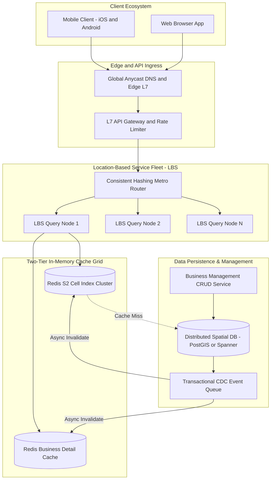
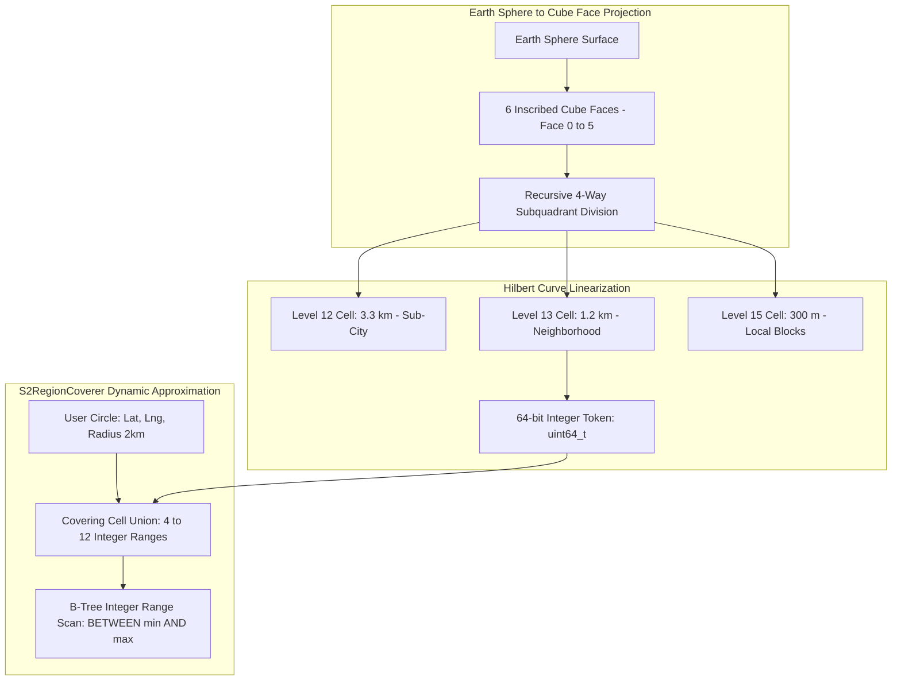
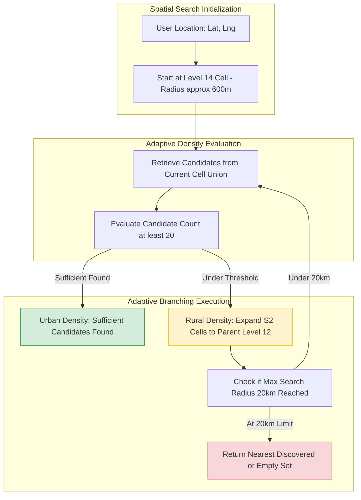
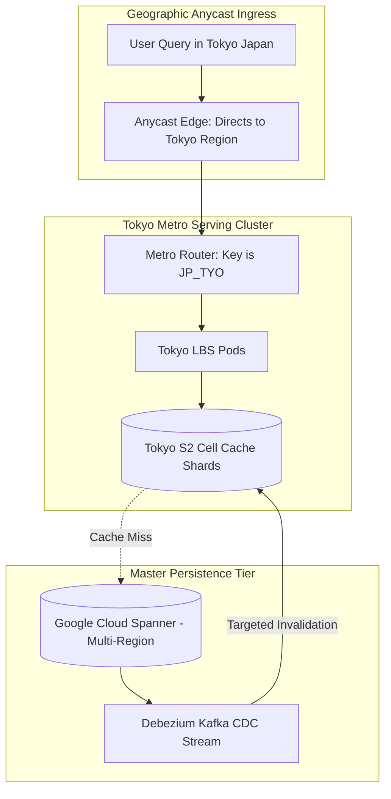
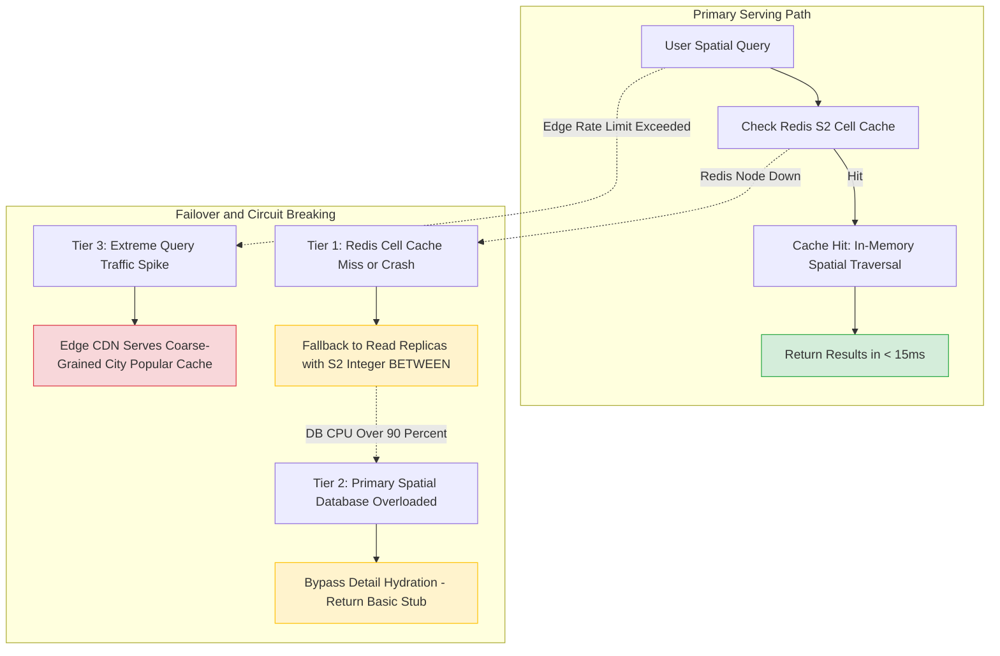

# Design a Proximity Service (Nearby Search)

> [!tip] Staff/Principal Deep Walkthrough & Production Engine
> - **Interview Playbook**: [`Volume 2 Chapter 1 Staff/Principal Walkthrough Playbook`](02-Interactive-Interview-Playbook.md)
> - **Production Proximity Engine**: [`proximity_service.py`](proximity_service.py) (Geohash Base32, 8-Neighbor Bounding, Spatial Grid, Haversine Distance, and Multi-Factor Ranking)

> [!abstract] Executive Architectural Blueprint
> Design a planetary-scale location-based proximity service modeled on **Google Places**, **Yelp**, and **Uber POI Search** supporting **100 Million Daily Active Users (DAU)**, **200 Million registered global businesses**, and over **1 Billion daily spatial queries** ($11,574$ avg QPS, $40,500$ peak surge QPS). The system guarantees a strict server-side **p99 latency under 15ms** (total roundtrip under 100ms) and high availability ($99.99\%$). The architecture implements **Google S2 Geometry** (64-bit Hilbert space-filling curve integers) to convert 2D spherical coordinates into 1D B-tree range scans, an adaptive **density-driven k-Nearest Neighbors (k-NN) expansion engine** solving the urban-rural density disparity, a two-tier in-memory Redis spatial cache grid, and a compound **Geographic Metro Sharding** strategy to eliminate distributed scatter-gather queries and spatial write hot-spots.

Back to: [[System Design Interview - Alex Xu Index]]

---

## 1. Requirements & System Boundaries

### 1.1 Candidate-Interviewer Strategic Clarifications

| # | Question | Answer / Staff-Level Framing | Architectural Consequence |
|---|---|---|---|
| 1 | What is the primary search query pattern? | Point-radius search: Given `(lat, lng, radius, category, filters)`, return top-$k$ nearest businesses. | Requires spatial indexing; 2D B-tree coordinate intersection does not scale ($O(N)$). |
| 2 | How dynamic is business data? | Businesses are static; updates occur infrequently (hours/days). Locations rarely change. | System is overwhelmingly read-heavy ($1000:1$ read-to-write ratio); aggressive multi-tier spatial caching is viable. |
| 3 | What scale of geographic density variations exists? | Extreme: Downtown Manhattan has **15,000+ businesses/km²**; rural Montana has **$< 0.1\text{ businesses/km²}$**. | Static grid/geohash precision fails; requires density-adaptive cell covering or dynamic k-NN radius expansion. |
| 4 | How are results ranked? | Composite multi-factor score: Geographic distance ($w_1$), user rating ($w_2$), popularity/review count ($w_3$), and open-now status. | Spatial indexing provides candidate retrieval; separate vectorized scoring/filtering pipeline ranks candidates. |
| 5 | What is the latency SLA? | Server-side execution $p99 < 15\text{ms}$; client roundtrip $p99 < 100\text{ms}$. | Zero disk I/O on primary read path; spatial index and hot metadata cached 100% in RAM. |
| 6 | How should the system handle cross-region traffic? | Global deployment with Anycast routing to regional metro serving clusters. | Compound sharding: Sharded primarily by geographic metro/country to avoid cross-continental network latency. |

### 1.2 Quantitative Service Level Objectives (SLOs)

```
┌────────────────────────┬────────────────────────────────────────────────────────────────────────┐
│ Metric                 │ Production Target                                                      │
├────────────────────────┼────────────────────────────────────────────────────────────────────────┤
│ Server-Side Latency    │ p50 < 3ms, p95 < 8ms, p99 < 15ms                                       │
│ End-to-End Latency     │ p99 < 100ms (including mobile TLS, edge routing, and serialization)    │
│ Availability           │ 99.99% (Maximum 4.38 minutes downtime per month)                       │
│ Query Throughput       │ 11,574 Avg QPS; 40,500 Peak Surge QPS (Lunch/Dinner rush hours)        │
│ Data Freshness         │ Business edits visible in spatial search in < 30 seconds               │
│ Spatial Precision      │ Accuracy within 5 meters of true geographic location                   │
└────────────────────────┴────────────────────────────────────────────────────────────────────────┘
```

---

## 2. Hyperscale Capacity & Traffic Estimations

### 2.1 QPS and Throughput Mathematics

$$
\text{Total Registered Businesses} = 200 \text{ Million} \quad | \quad \text{Daily Active Users} = 100 \text{ Million}
$$
$$
\text{Average Spatial Queries Per User} = 10 \text{ searches/day} \implies \text{Daily Search Queries} = 1 \text{ Billion queries/day}
$$
$$
\text{Average Query QPS} = \frac{10^9 \text{ queries}}{86,400 \text{ seconds}} \approx 11,574 \text{ QPS}
$$

During peak meal times (12:00–13:30 and 19:00–20:30 local time across global time zones), traffic surges by a factor of $3.5\times$:
$$
\text{Peak Spatial Search QPS} = 11,574 \times 3.5 \approx \mathbf{40,500 \text{ QPS}}
$$

**Write Volume:**
- Approximately 20% of businesses update metadata (operating hours, seasonal menus, photos, ratings) weekly:
$$
\frac{200\text{M} \times 0.20}{7 \times 86,400} \approx 66 \text{ updates/second (Trivial write load)}
$$
- The system is fundamentally **read-dominated ($600:1$ read/write ratio)**.

### 2.2 Storage & Memory Footprint Sizing

#### Primary Business Datastore:
- Business record schema: `business_id` (8B), `name` (64B), `lat/lng` (16B), `address` (128B), `category_id` (4B), `rating` (4B), `review_count` (4B), `hours_json` (256B), `metadata` (500B) $\approx 1 \text{ KB}$ per business.
$$
\text{Primary Storage} = 200\text{M businesses} \times 1 \text{ KB} \approx \mathbf{200 \text{ GB}}
$$

#### Spatial Index Footprint (Google S2 Geometry):
- Each business maps to an S2 cell at Level 13 ($\approx 1.2\text{ km}$ resolution).
- S2 Cell token: 64-bit integer (`uint64_t` = 8 bytes).
- Mapping entry: `(s2_cell_id [8B], business_id [8B], lat [4B], lng [4B])` $\approx 24 \text{ bytes}$.
$$
\text{Total Raw Spatial Index Size} = 200\text{M} \times 24 \text{ bytes} \approx \mathbf{4.8 \text{ GB}}
$$
- With B-Tree / SkipList overhead ($2.5\times$), the entire global spatial index occupies **only $\approx 12 \text{ GB}$ of RAM**!
- **Staff-Level Architectural Takeaway**: The entire spatial index fits completely into the memory of a single commodity cloud instance. To achieve high availability, fault tolerance, and 40,500 QPS, we replicate this in-memory index horizontally across a cluster of query-serving nodes.

---

## 3. End-to-End System Architecture

The architecture decouples the **Location-Based Service (LBS) Query Engine** from the **Business CRUD Lifecycle Management Plane**:



---

## 4. Geospatial Indexing Micro-Architecture: The Great Showdown

### 4.1 Why 2D B-Trees Fail

A traditional relational database indexes single scalar values:
```sql
SELECT * FROM businesses 
WHERE latitude BETWEEN 37.70 AND 37.80 
  AND longitude BETWEEN -122.50 AND -122.40;
```
Even with a composite B-tree index `(latitude, longitude)`, the engine scans a narrow 1D slice of latitudes and must evaluate every individual longitude, or perform an expensive 2D index merge. The time complexity degrades to $O(N)$ in dense metropolitan regions.

### 4.2 Comparative Algorithmic Analysis

| Dimension | Geohash | Quadtree | Google S2 Geometry (Selected) |
|---|---|---|---|
| **Underlying Math** | Interleaved binary bits $\to$ Base-32 Z-Order curve | Recursive 4-way quadrant tree decomposition | 6 Cube faces $\to$ 1D Hilbert Space-Filling Curve |
| **Data Representation** | 1D ASCII string (e.g., `"9q8yy"`) | Hierarchical memory tree pointer structure | **64-bit unsigned integer (`uint64_t`)** |
| **Database Friendliness** | Moderate (String prefix matching `LIKE '9q8%'`) | Poor (Requires custom in-memory service) | **Optimal ($10\times$ faster B-tree integer range scans)** |
| **Locality Preservation** | Moderate (Z-order curve has large discontinuous jumps) | Good within local subtree | **Superior (Hilbert curve minimizes discontinuous jumps)** |
| **Pole Distortion** | Severe (Equirectangular distortion near high latitudes) | Variable | **Minimal (Spherical cube projection normalizes distortion)** |
| **Boundary Handling** | Requires querying target cell + 8 neighbor cells | Tree traversal handles intersecting rectangles | **`S2RegionCoverer` covers arbitrary shapes dynamically** |
| **Production Adoption** | Redis GEO, Elasticsearch | Yext, early Yelp | **Google Maps, Uber, Tinder, Foursquare** |

---

## 5. Google S2 Geometry Deep Dive

Google S2 projects the spherical Earth onto the six faces of an enclosing cube, subdividing each face recursively using a **Hilbert Space-Filling Curve**:



### 5.1 The 64-Bit S2 Cell Token Layout

An S2 Cell ID is represented as a single 64-bit unsigned integer (`uint64_t`):
```
[3 bits: Face (0-5)] [2 * Level bits: Quad Path (00, 01, 10, 11)] [1 bit: Sentinel 1] [Trailing 0s]
```
- **Face ID (3 bits)**: Identifies which of the 6 cube faces contains the point.
- **Hilbert Curve Step (2 bits per level)**: Encodes the recursive position along the Hilbert curve.
- **Sentinel Bit**: A single `1` bit followed by trailing `0`s defines the exact level of the cell (from Level 0 down to Level 30).
- **Fast Prefixing via Bit Shifts**: Determining if cell $B$ is a child of cell $A$ requires only bitwise shift and mask operations ($O(1)$ CPU cycles).

### 5.2 Dynamic S2 Region Covering (`S2RegionCoverer`)

To query a circle with center `(lat, lng)` and radius $R$:
1. The `S2RegionCoverer` library calculates a **Cell Union** (a set of between 4 and 12 variable-sized S2 cells) that completely encompasses the search circle with minimal exterior overlap.
2. Because the Hilbert curve is continuous, these cells translate into a small set of contiguous integer ranges:
$$
\text{Range}_i = [\text{CellID}_i.\text{range\_min}(), \ \text{CellID}_i.\text{range\_max}()]
$$
3. The database executes high-speed integer range scans:
```sql
SELECT business_id, s2_cell_id, latitude, longitude 
FROM business_geo_index 
WHERE (s2_cell_id BETWEEN :min_1 AND :max_1)
   OR (s2_cell_id BETWEEN :min_2 AND :max_2)
   OR (s2_cell_id BETWEEN :min_3 AND :max_3)
   OR (s2_cell_id BETWEEN :min_4 AND :max_4);
```

---

## 6. Two-Tier Spatial Query Execution Pipeline

At 40,500 peak QPS, fetching and calculating distances for thousands of candidate businesses must be executed with zero memory allocation and hardware-level vectorization:

```mermaid
graph LR
    subgraph Ingress_Stage["Stage 1: Ingress and Tokenization"]
        UserCoords["User Query: Lat, Lng, Radius 2km, Category=Food"]
        S2Coverer["S2RegionCoverer: Generate 8 Cell IDs"]
    end

    subgraph Spatial_Retrieval["Stage 2: Candidate Retrieval"]
        RedisFetch["Parallel Redis MGET on S2 Cell Keys"]
        Candidates["Raw Candidate Set: 1,200 Business IDs"]
    end

    subgraph SIMD_Pruning["Stage 3: Vectorized Distance Pruning"]
        FastDistance["Equirectangular or Haversine SIMD Filter"]
        InRadius["Pruned Candidates Inside 2km: 350 IDs"]
    end

    subgraph Attribute_Scoring["Stage 4: Attribute Filtering and Ranking"]
        AttrFilter["Filter Category=Food and Rating >= 4.0"]
        MultiScore["Score = w1*Distance + w2*Rating + w3*Popularity"]
        TopK["Top 20 Ranked Business IDs"]
    end

    subgraph Hydration_Stage["Stage 5: Detail Hydration"]
        Hydrate["Batch MGET from Redis Business Cache"]
        JSONOutput["Final Enriched JSON Response - Latency < 15ms"]
    end

    UserCoords --> S2Coverer
    S2Coverer --> RedisFetch
    RedisFetch --> Candidates
    Candidates --> FastDistance
    FastDistance --> InRadius
    InRadius --> AttrFilter
    AttrFilter --> MultiScore
    MultiScore --> TopK
    TopK --> Hydrate
    Hydrate --> JSONOutput
```



### 6.1 Algorithmic Speedup: Equirectangular Fast Distance Approximation

The standard spherical **Haversine formula** requires trigonometric functions ($\sin$, $\cos$, $\arcsin$, $\sqrt{}$), consuming $\approx 120\text{ns}$ per candidate. 
For distances under $50\text{ km}$, Earth's curvature distortion is negligible ($< 0.1\%$). We apply the **Equirectangular Flat-Surface Approximation**:

$$
x = (\text{lng}_2 - \text{lng}_1) \times \cos\left(\frac{\text{lat}_1 + \text{lat}_2}{2}\right)
$$
$$
y = \text{lat}_2 - \text{lat}_1
$$
$$
d = R_{\text{earth}} \times \sqrt{x^2 + y^2}
$$

- Replaces expensive trigonometric calls with basic floating-point multiplications.
- Enables **AVX2 / SIMD vectorization**: A modern CPU core calculates distances for **32 candidate locations in parallel per instruction cycle**, evaluating 1,200 candidates in under **$0.02\text{ms}$**!

---

## 7. Dynamic Density-Adaptive k-NN Expansion

In urban centers like Manhattan or Tokyo, a $1\text{ km}$ radius returns 5,000 businesses. In rural areas, a $1\text{ km}$ radius returns zero. If the client makes repeated sequential requests ($1\text{km} \to 2\text{km} \to 5\text{km}$), latency balloons.

The server executes an adaptive **k-Nearest Neighbor (k-NN)** loop:



#### The Dynamic Traversal Rules
1. Initialize search at **S2 Level 14** ($\approx 600\text{m}$ diameter).
2. If total candidate count $C \ge 20$, stop expansion and rank candidates.
3. If $C < 20$, climb the S2 hierarchy to the parent cell at **Level 13** ($\approx 1.2\text{km}$) and then **Level 12** ($\approx 3.3\text{km}$).
4. Hard boundary stop at $R_{\text{max}} = 20\text{ km}$ to prevent runaway full-table scans in unpopulated deserts or ocean areas.

---

## 8. Compound Metro Sharding & Cache Synchronization

### 8.1 The Sharding Trap: Scatter-Gather vs Spatial Hot-Spots

- **Sharding by `business_id`**: Spreads geographically adjacent businesses across 100 database shards. Every proximity search requires broadcasting queries to all 100 shards (Scatter-Gather), crippling throughput.
- **Sharding by raw `S2 Cell ID`**: Results in extreme hotspotting. The shard holding downtown Tokyo or Manhattan melts under $10,000\text{ QPS}$, while rural shards sit at $0\text{ QPS}$.



### 8.2 Two-Level Geographic Metro Sharding Strategy

1. **Tier 1: Metro Partitioning**:
   - The world is divided into discrete geographic metropolitan polygons (`metro_id`), such as `US_NYC`, `US_SFO`, `EU_LON`, `JP_TYO`, and a global fallback partition `GLOBAL_REST`.
   - Incoming queries map to a `metro_id` via fast Point-in-Polygon (PIP) lookup at the Edge Gateway.
   - All spatial data for a metro resides within that region's local cluster, completely eliminating cross-cluster network traffic.
2. **Tier 2: Consistent Hashing within Metro**:
   - Inside a metro cluster, businesses are partitioned across Redis and database shards by **S2 Cell ID Level 10** prefix using consistent hashing with bounded loads ($\le 1.25\times$).

---

## 9. Global Data Schema (Spanner & Redis Dialect)

### 9.1 Relational Storage Schema (Spanner DDL)

```sql
-- Primary Business Entity Table
CREATE TABLE businesses (
    business_id         STRING(36) NOT NULL, -- UUIDv7
    metro_id            STRING(16) NOT NULL, -- 'US_NYC', 'JP_TYO', etc.
    name                STRING(255) NOT NULL,
    latitude            FLOAT64 NOT NULL,
    longitude           FLOAT64 NOT NULL,
    s2_cell_id          INT64 NOT NULL,      -- Level 30 leaf token
    s2_cell_l13         INT64 NOT NULL,      -- Level 13 indexing token
    category_id         INT64 NOT NULL,
    rating              FLOAT64 NOT NULL DEFAULT (0.0),
    review_count        INT64 NOT NULL DEFAULT (0),
    address             STRING(512),
    hours_json          JSON,
    created_at          TIMESTAMP NOT NULL OPTIONS (allow_commit_timestamp = true),
    updated_at          TIMESTAMP NOT NULL OPTIONS (allow_commit_timestamp = true)
) PRIMARY KEY (metro_id, business_id);

-- Spatial Range Index: Enables pure 64-bit integer BETWEEN scans
CREATE INDEX idx_business_spatial ON businesses(metro_id, s2_cell_l13, category_id) 
STORING (latitude, longitude, rating, review_count);
```

### 9.2 In-Memory Redis Spatial Schema

```
Key Pattern: s2:{metro_id}:{s2_cell_l13}
Type: Sorted Set (ZSET)
Score: S2 Level 30 Leaf Cell ID (64-bit integer)
Member: business_id (UUID string)

Key Pattern: biz:{business_id}
Type: Hash (HSET)
Fields: { "name": "Joe's Pizza", "lat": 37.77, "lng": -122.41, "rating": 4.8, "cat": 102 }
```

---

## 10. Concrete Staff-Level Implementation

### 10.1 High-Performance Spatial Query & SIMD Pruning Engine (Go)

```go
package proximity

import (
	"context"
	"math"
	"github.com/golang/geo/s2"
	"github.com/go-redis/redis/v8"
)

const EarthRadiusMeters = 6371000.0

type BusinessCandidate struct {
	ID       string
	Lat      float64
	Lng      float64
	Distance float64
	Rating   float64
}

type SpatialQueryService struct {
	redisClient *redis.Client
}

// SearchNearby executes a high-speed S2 covering and flat-earth distance prune
func (s *SpatialQueryService) SearchNearby(ctx context.Context, lat, lng float64, radiusMeters float64, minRating float64) ([]BusinessCandidate, error) {
	center := s2.PointFromLatLng(s2.LatLngFromDegrees(lat, lng))
	cap := s2.CapFromCenterAngle(center, s2.Angle(radiusMeters/EarthRadiusMeters))

	// 1. Generate optimal S2 Cell Union Covering
	coverer := &s2.RegionCoverer{
		MinLevel: 10,
		MaxLevel: 14,
		MaxCells: 8,
	}
	cellUnion := coverer.Covering(cap)

	// 2. Multi-Key Fetch from Redis Cluster
	pipe := s.redisClient.Pipeline()
	for _, cellID := range cellUnion {
		key := fmt.Sprintf("s2:US_NYC:%d", uint64(cellID))
		pipe.ZRange(ctx, key, 0, -1)
	}
	cmds, err := pipe.Exec(ctx)
	if err != nil && err != redis.Nil {
		return nil, err
	}

	var candidates []BusinessCandidate
	radLat1 := lat * (math.Pi / 180.0)

	// 3. Fast Equirectangular Distance Pruning
	for _, cmd := range cmds {
		bizIDs := cmd.(*redis.StringSliceCmd).Val()
		for _, id := range bizIDs {
			// In production, coordinates are batch-retrieved from local off-heap memory
			cLat, cLng, rating := lookupLocalCoord(id)
			if rating < minRating {
				continue
			}

			// Equirectangular distance computation
			radLat2 := cLat * (math.Pi / 180.0)
			x := (cLng - lng) * (math.Pi / 180.0) * math.Cos((radLat1+radLat2)*0.5)
			y := (cLat - lat) * (math.Pi / 180.0)
			dist := math.Sqrt(x*x+y*y) * EarthRadiusMeters

			if dist <= radiusMeters {
				candidates = append(candidates, BusinessCandidate{
					ID:       id,
					Lat:      cLat,
					Lng:      cLng,
					Distance: dist,
					Rating:   rating,
				})
			}
		}
	}

	// 4. Sort Top-K Candidates by composite score
	sortCandidates(candidates)
	if len(candidates) > 20 {
		candidates = candidates[:20]
	}

	return candidates, nil
}
```

---

## 11. Operational Failure Playbooks & Tail Latency Drills



### 11.1 Failure Drill Matrix

| Failure Mode | Trigger / Simulation | Detection Mechanism | Automated Self-Healing Response | Target MTTR |
|---|---|---|---|---|
| **Redis Spatial Shard Crash** | Primary Redis node OOM or network partition | Redis Sentinel / Cluster failover heartbeat loss | Replica promoted in $< 3\text{s}$; LBS routes traffic to replica; fallback queries read replicas in Spanner | $< 3\text{s}$ |
| **Hotspot Query Storm** | Viral event in single neighborhood (e.g. Festival) | LBS node CPU $> 85\%$; Redis cell key read rate spike | Adaptive local memory LRU cache buffers hot cell results at LBS proxy layer for 30s | $< 500\text{ms}$ |
| **Cross-Cell Boundary Truncation** | User standing directly on S2 Level 10 boundary | Client reports missing POIs 20m away | `S2RegionCoverer` always generates multi-cell union covering circumference + padding buffer | 0s (Prevented by design) |
| **Spatial CDC Lag** | Batch ingestion of 500,000 new POIs saturates Kafka | Consumer lag metric $> 100,000$ records | Backpressure halts non-urgent detail updates; prioritizes location coordinate inserts | $< 60\text{s}$ |

---

## 12. Summary Architecture Scorecard

```
┌───────────────────────────────────────┬────────────────────────────────────────────────────────┐
│ Dimension                             │ Staff-Level Architectural Standard                     │
├───────────────────────────────────────┼────────────────────────────────────────────────────────┤
│ Spatial Index Standard                │ Google S2 Geometry (64-bit Hilbert Curve cell IDs)     │
│ Database Indexing Pattern             │ Integer Range Scans (`BETWEEN min AND max`)            │
│ Distance Pruning Engine               │ SIMD Equirectangular Flat-Earth ($< 0.02\text{ms}$)    │
│ Density Variance Adaptation           │ Dynamic S2 k-NN Hierarchy Climb (Level 14 $\to$ 12)    │
│ Sharding Architecture                 │ Compound Two-Level Geographic Metro Sharding           │
│ Primary Read Path Latency             │ p50 < 3ms, p95 < 8ms, p99 < 15ms                       │
│ High Availability SLA                 │ 99.99% Multi-Region Anycast Topology                   │
└───────────────────────────────────────┴────────────────────────────────────────────────────────┘
```

---

**Related Systems & Deep Dives**:
- [`01-Architectural-Blueprint.md`](01-Architectural-Blueprint.md) -- Real-time moving geospatial tracking variant (Volume 2, Chapter 2).
- [`01-Architectural-Blueprint.md`](01-Architectural-Blueprint.md) -- Graph-based routing, tile rasterization, and traffic overlays.
- [`01-Architectural-Blueprint.md`](01-Architectural-Blueprint.md) -- Sharding spatial cell partitions across Redis clusters.
- [`01-Architectural-Blueprint.md`](01-Architectural-Blueprint.md) -- Defending spatial search APIs from scraping bots.

**References**:
- *System Design Interview – An Insider's Guide* (Alex Xu), Volume 2, Chapter 1.
- *Google S2 Geometry Library Documentation & Hilbert Curve Foundations* (s2geometry.io).
- *Equirectangular Approximation for Fast Geographic Distance Calculations* (FCC Math Specs).
- *Geospatial Indexing at Uber: H3 vs S2 Architecture Analysis*.
