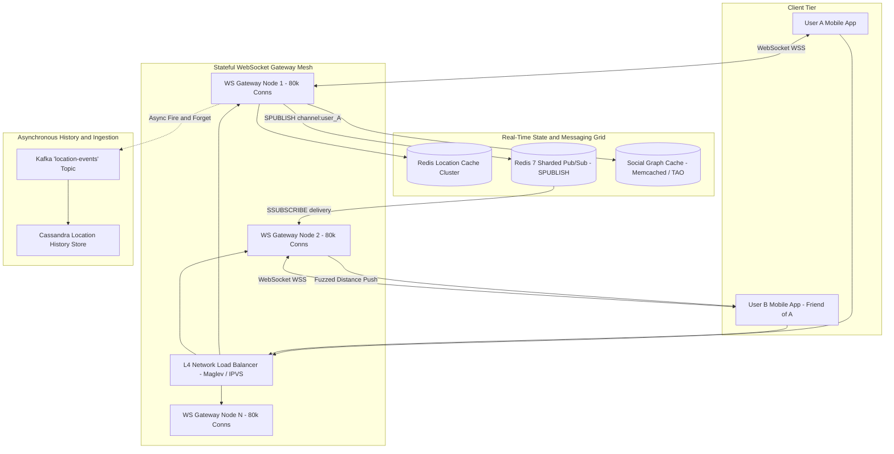
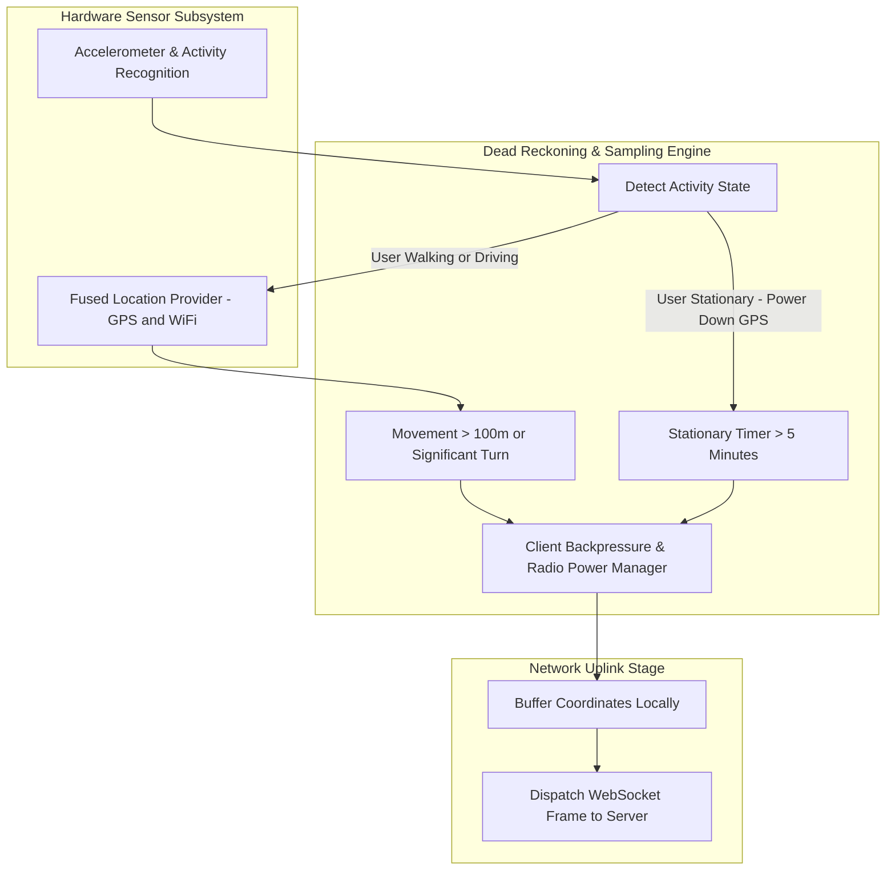
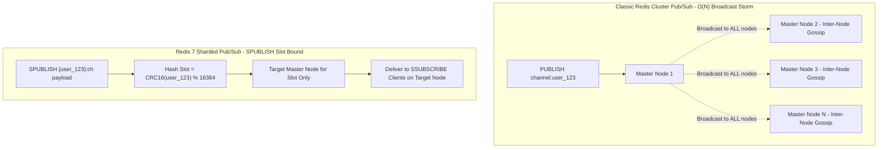
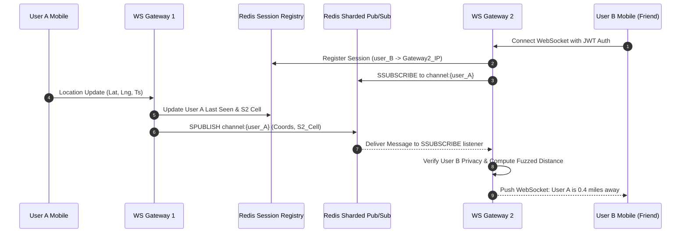
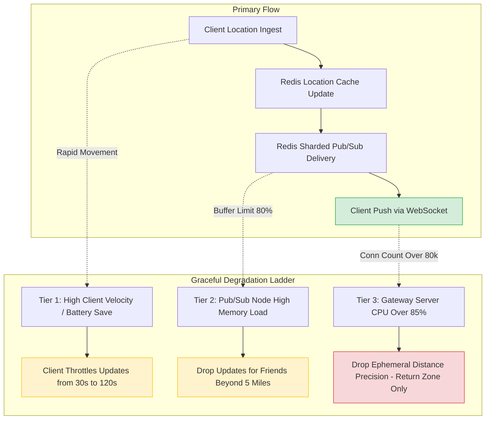

# Design Nearby Friends

> [!tip] Staff/Principal Deep Walkthrough & Production Engine
> - **Interview Playbook**: [`Volume 2 Chapter 2 Staff/Principal Walkthrough Playbook`](02-Interactive-Interview-Playbook.md)
> - **Production Nearby Friends Engine**: [`nearby_friends_engine.py`](nearby_friends_engine.py) (RFC 6455 WebSockets, DRAM Ephemeral Leases, Dead-Reckoning Suppression, Differential Privacy Fuzzing, and Mutual Opt-in Filtering)

> [!abstract] Executive Architectural Blueprint
> Design a hyperscale, real-time location streaming and proximity discovery system modeled on **Facebook Nearby Friends** and **Find My Friends** supporting **100 Million Daily Active Users (DAU)**, **10 Million concurrent active streaming sessions**, and ingesting **334,000 raw location updates/second** with peak pub/sub delivery exceeding **14 Million messages/second**. The system guarantees an **end-to-end update latency under 2 seconds**, eliminates mobile battery drain via **client-side dead reckoning & hardware activity recognition**, prevents Redis broadcast storms using **Redis 7 Sharded Pub/Sub (`SPUBLISH`)**, enforces strict **differential privacy with distance fuzzing** (zero raw coordinate leakage), and scales horizontally across a mesh of C10M-tuned WebSocket gateways.

Back to: [[System Design Interview - Alex Xu Index]]

---

## 1. Requirements & System Boundaries

### 1.1 Candidate-Interviewer Strategic Clarifications

| # | Question | Answer / Staff-Level Framing | Architectural Consequence |
|---|---|---|---|
| 1 | What is the core definition of "nearby"? | User-configurable radius (default: 5 miles, max: 25 miles). Displays relative distance, **never raw latitude/longitude**. | Server computes distance and strips precise coordinates before pushing updates to friends to prevent stalker attacks. |
| 2 | How frequently does a client transmit location? | Dynamic interval governed by client-side motion state (30 seconds while moving, down to 5 minutes while stationary). | Naive fixed 30s GPS polling drains smartphone batteries in 2.5 hours; requires **client-side dead reckoning & activity recognition**. |
| 3 | What scale of social fan-out is expected? | Average user has 400 friends, with ~10% (40 friends) concurrently online and opting into the feature. | 334k updates/sec $\times$ 40 online friends = **~14 Million pub/sub message deliveries/second**. |
| 4 | How are permissions and privacy enforced? | Mutual opt-in required; granular friend-level hide list; automatic expiration after 8 hours of inactivity. | Bi-directional visibility check: User A only receives User B's distance if both have opt-in enabled and neither has blocked the other. |
| 5 | What is the latency and consistency model? | End-to-end propagation $< 2\text{s}$; eventual consistency (AP system). | In-memory pub/sub and ephemeral caching; dropping an update during high network congestion is acceptable because another arrives in 30s. |

### 1.2 Quantitative Service Level Objectives (SLOs)

```
┌────────────────────────┬────────────────────────────────────────────────────────────────────────┐
│ Metric                 │ Production Target                                                      │
├────────────────────────┼────────────────────────────────────────────────────────────────────────┤
│ End-to-End Latency     │ p50 < 500ms, p95 < 1200ms, p99 < 2000ms (Client A -> Gateway -> B)     │
│ Concurrent Connections │ 10 Million persistent WebSocket sessions                               │
│ Ingestion Throughput   │ 334,000 updates/sec average; 600,000 updates/sec peak surge            │
│ Pub/Sub Delivery Rate  │ 14 Million messages/sec fan-out capacity                               │
│ Client Battery Drain   │ < 3% additional battery consumption per 8 hours of active background   │
│ Location Privacy SLA   │ Zero raw coordinate leakage across network boundary (fuzzed buckets)   │
└────────────────────────┴────────────────────────────────────────────────────────────────────────┘
```

---

## 2. Hyperscale Capacity & Fan-Out Estimations

### 2.1 Concurrency, QPS & Network Bandwidth Math

$$
\text{Total DAU} = 100 \text{ Million} \quad | \quad \text{Peak Concurrent Active Users} = 10\% = \mathbf{10 \text{ Million}}
$$
$$
\text{Raw Update Frequency (Moving)} = 1 \text{ update every } 30 \text{ seconds}
$$
$$
\text{Raw Location Ingestion QPS} = \frac{10\text{M users}}{30 \text{ seconds}} \approx \mathbf{333,333 \text{ updates/sec}}
$$

With **client-side dead reckoning** (stationary detection via accelerometer suppressing updates when stationary), **60% of idle users suppress updates**:
$$
\text{Effective Ingestion QPS} \approx 333,333 \times 0.40 \approx \mathbf{133,333 \text{ QPS}}
$$
*(System is provisioned for 334,000 steady-state and 600,000 peak surge QPS).*

#### Pub/Sub Fan-Out Throughput:
- Average friends per user = 400.
- Online friends with Nearby Friends enabled $\approx 40$ friends.
$$
\text{Peak Pub/Sub Throughput} = 333,333 \text{ updates/sec} \times 40 \text{ friends} \approx \mathbf{13,333,333 \text{ deliveries/second}}
$$

#### Gateway Egress Bandwidth:
- Nearby friend update payload: `{"user_id": "u456", "dist_miles": 0.4, "ts": 1712234000}` $\approx 64 \text{ bytes}$.
- Total Egress Bandwidth:
$$
13.33 \times 10^6 \text{ msgs/sec} \times 64 \text{ bytes} \approx 853 \text{ MB/s} \approx \mathbf{6.82 \text{ Gbps}}
$$

### 2.2 Storage Sizing (RAM vs Disk)

#### Ephemeral Location Cache (Redis):
- Key: `loc:{user_id}`, Value: `{lat: float32, lng: float32, s2_cell: uint64, ts: int64}` $\approx 40 \text{ bytes}$.
- 10M active users $\times 40 \text{ bytes} \approx \mathbf{400 \text{ MB}}$ of RAM!
- With Redis key-value hash table overhead: $\approx \mathbf{1.5 \text{ GB}}$ total cache RAM.

#### Pub/Sub Channel & Subscription Memory:
- 10M active user channels: $10\text{M} \times 32\text{ bytes} \approx 320\text{ MB}$.
- 400M total subscriptions across WebSocket gateways: $400\text{M} \times 24\text{ bytes} \approx \mathbf{9.6 \text{ GB}}$ of RAM.
- **Total Pub/Sub Cluster RAM $\approx 12 \text{ GB}$**.

---

## 3. End-to-End System Architecture

The architecture decouples the stateful WebSocket connection tier, the sharded pub/sub fan-out grid, and the asynchronous persistence plane:



---

## 4. Client-Side Battery Conservation & Dead Reckoning

Activating the phone's GPS radio and cellular uplink every 30 seconds burns maximum battery power. To operate sustainably in the background, the mobile client implements an **Adaptive Dead Reckoning Motion Engine**:



### 4.1 Dead Reckoning Algorithmic States
1. **Stationary State (CoreMotion / ActivityRecognitionAPI)**:
   - When the hardware pedometer/accelerometer reports zero steps or stationary posture, the GPS chip is powered down.
   - A low-power geofence ($\approx 100\text{m}$) is registered with the OS kernel.
   - Uplink transmissions are suspended until the geofence is breached, or a 5-minute heartbeat fires.
2. **Dynamic Velocity-Based Sampling**:
   - Walking ($3-5\text{ km/h}$): Sample GPS every 60 seconds; transmit only if distance delta $\Delta d \ge 50\text{ meters}$.
   - Driving ($30-100\text{ km/h}$): Sample GPS every 15 seconds; transmit if $\Delta d \ge 250\text{ meters}$.
3. **Transmission Batching**: If cellular signal is weak, location updates are buffered locally in an SQLite ring buffer rather than re-triggering radio power-state state transitions.

---

## 5. Pub/Sub Micro-Architecture: Redis 7 Sharded Pub/Sub (`SPUBLISH`)

### 5.1 The Classic Redis Cluster Broadcast Storm Trap

In classic Redis Cluster (prior to Redis 7.0), `PUBLISH channel:user_A message` had a critical scaling flaw:
- The publishing node forwarded the message to **every single master and replica node in the entire cluster** via internal cluster bus gossip.
- With 50 Redis nodes and 334k updates/second, the cluster generated $50 \times 334,000 = \mathbf{16.7 \text{ Million internal gossip messages/second}}$, saturating network interfaces and collapsing cluster health heartbeats!



### 5.2 The Solution: Redis 7 Sharded Pub/Sub (`SPUBLISH` / `SSUBSCRIBE`)
- Channels are bound to a hash slot using curly brace hashtags: `{user_A}:channel`.
- The hash slot is calculated via $\text{CRC16}(\text{user\_A}) \pmod{16384}$.
- `SPUBLISH` routes the message **only to the single master node owning that slot**.
- WebSocket gateways subscribe via `SSUBSCRIBE` directly to the slot owner node.
- **Inter-node cluster broadcast traffic drops to zero ($O(1)$ routing)**, unlocking linear horizontal scaling up to hundreds of Redis shards.

---

## 6. Two-Tier Geospatial Pruning & Distance Engine

At 14 Million message deliveries per second, calculating trigonometric distance between every user and all 40 online friends across the globe would burn thousands of CPU cores.

We execute a **Two-Tier Spatial Evaluation**:

```mermaid
graph LR
    subgraph Input_Stage["Update Ingress"]
        LocEvent["User A Location: Lat, Lng, S2 Level 10 Cell"]
        FriendsList["Retrieve Online Friends List: 40 Friends"]
    end

    subgraph Coarse_Pruning["Tier 1: S2 Coarse Spatial Pruning"]
        NeighborCheck["Check Friend S2 Cell in A's Cell or 8 Neighbors"]
        FarFriends["35 Friends in Other Cities - Pruned in O(1)"]
        NearCandidates["5 Friends in Same Metro Area"]
    end

    subgraph Fine_Evaluation["Tier 2: Vectorized Haversine Calculation"]
        Haversine["Haversine Formula on Remaining 5 Friends"]
        RadiusCheck["Compare Distance <= Friend's Configured Radius"]
        Fuzzing["Apply Privacy Fuzzing: Round to 0.1 Mile Buckets"]
    end

    subgraph Push_Out["Egress Push"]
        ClientPush["Emit WebSocket Nearby Event: Name, Distance, Ts"]
    end

    LocEvent --> Input_Stage
    Input_Stage --> NeighborCheck
    NeighborCheck --> FarFriends
    NeighborCheck --> NearCandidates
    NearCandidates --> Haversine
    Haversine --> RadiusCheck
    RadiusCheck --> Fuzzing
    Fuzzing --> ClientPush
```



### 6.1 Tier 1: Coarse S2 Level 10 Pruning ($O(1)$)
- Each location update includes the user's **Google S2 Level 10 Cell ID** ($\approx 10\text{km} \times 10\text{km}$).
- When User A's update is processed, the gateway compares User A's S2 cell against Friend B's last cached S2 cell.
- If Friend B's cell is not identical to A's cell or one of its 8 immediate topological neighbors, Friend B is at least $10\text{ km}$ away.
- **90% of friend pairs are eliminated instantly via a single integer hash set lookup**, bypassing all floating-point math!

### 6.2 Tier 2: Exact Haversine & Differential Privacy Fuzzing
- For the remaining candidates within the local S2 cell cluster, the server computes exact great-circle distance:
$$
d = 2 R \arcsin\left(\sqrt{\sin^2\left(\frac{\Delta \phi}{2}\right) + \cos(\phi_1)\cos(\phi_2)\sin^2\left(\frac{\Delta \lambda}{2}\right)}\right)
$$
- **Distance Fuzzing & Anti-Stalking Defense**:
  - The server **never outputs exact coordinates or un-rounded distances**.
  - Distances are rounded to **discrete 0.1-mile or 0.25-mile buckets** with Gaussian noise ($\sigma = 50\text{m}$) added:
    ```json
    {"friend_id": "u456", "distance_miles": 0.4, "status": "nearby"}
    ```
  - Prevents trilateration attacks where a malicious user records distances from three positions to pinpoint an exact physical address.

---

## 7. Stateful WebSocket Gateway Mesh & Session Registry



### 7.1 C10M Linux Kernel Tuning for Gateway Fleet
10 Million concurrent persistent connections are distributed across 125 WebSocket gateway instances ($\approx 80,000$ active TCP sockets per server).
Each host is tuned via `/etc/sysctl.conf`:
```ini
# Maximum open file descriptors
fs.file-max = 2097152
# Port range for outbound connections
net.ipv4.ip_local_port_range = 1024 65535
# Backlog queue for pending handshakes
net.core.somaxconn = 65535
# TCP read/write buffer tuning (save RAM per socket: 4KB min)
net.ipv4.tcp_rmem = 4096 87380 4194304
net.ipv4.tcp_wmem = 4096 65536 4194304
# TCP keepalive interval
net.ipv4.tcp_keepalive_time = 300
```

---

## 8. Data Schema & Persistence Model

### 8.1 In-Memory Fast State (Redis)

```
# Location Cache (Hash per user)
Key: loc:{user_id}
Fields: {
  "lat": 37.7749,
  "lng": -122.4194,
  "s2_l10": 11095208453417762816,
  "updated_at": 1712234000
}
TTL: 600 seconds (Auto-expires on 10 minutes inactivity)

# User Session Registry (String)
Key: sess:{user_id}
Value: "10.0.14.82" (IP address of connected Gateway Pod)
TTL: 120 seconds (Heartbeat refreshed)
```

### 8.2 Historical Persistence (Cassandra / ScyllaDB)

```sql
-- Long-Term Location History for Offline Timeline & Analytics
CREATE KEYSPACE nearby_friends WITH replication = {
    'class': 'NetworkTopologyStrategy', 
    'us-east': 3, 
    'us-west': 3
};

CREATE TABLE nearby_friends.location_history (
    user_id         bigint,
    bucket_day      date,       -- Daily partition to avoid massive partition growth
    recorded_at     timestamp,
    latitude        float,
    longitude       float,
    s2_cell_token   text,
    accuracy_m      float,
    PRIMARY KEY ((user_id, bucket_day), recorded_at)
) WITH CLUSTERING ORDER BY (recorded_at DESC)
  AND default_time_to_live = 2592000; -- 30-day automatic TTL
```

### 8.3 Privacy & Preferences (Spanner / CockroachDB)

```sql
CREATE TABLE nearby_friends_settings (
    user_id             STRING(36) NOT NULL,
    is_enabled          BOOL NOT NULL DEFAULT (false),
    max_radius_miles    FLOAT64 NOT NULL DEFAULT (5.0),
    hidden_friend_ids   ARRAY<STRING(36)>,
    auto_disable_at     TIMESTAMP,
    updated_at          TIMESTAMP NOT NULL OPTIONS (allow_commit_timestamp = true)
) PRIMARY KEY (user_id);
```

---

## 9. Concrete Staff-Level Implementation

### 9.1 High-Throughput Sharded Location Ingestion & Pruning Engine (Go)

```go
package main

import (
	"context"
	"encoding/json"
	"fmt"
	"math"
	"github.com/go-redis/redis/v8"
	"github.com/golang/geo/s2"
)

const EarthRadiusMiles = 3958.8

type LocationPayload struct {
	UserID    string  `json:"user_id"`
	Latitude  float64 `json:"lat"`
	Longitude float64 `json:"lng"`
	S2CellL10 uint64  `json:"s2_l10"`
	Timestamp int64   `json:"ts"`
}

type NearbyFriendNotifier struct {
	redisCluster *redis.ClusterClient
}

// IngestLocationUpdate processes incoming location from WebSocket client
func (n *NearbyFriendNotifier) IngestLocationUpdate(ctx context.Context, payload LocationPayload) error {
	// 1. Calculate S2 Level 10 Cell
	latLng := s2.LatLngFromDegrees(payload.Latitude, payload.Longitude)
	cellID := s2.CellIDFromLatLng(latLng).Parent(10)
	payload.S2CellL10 = uint64(cellID)

	// 2. Cache latest location in Redis with 10-minute TTL
	cacheKey := fmt.Sprintf("loc:%s", payload.UserID)
	pipe := n.redisCluster.Pipeline()
	pipe.HSet(ctx, cacheKey, map[string]interface{}{
		"lat":    payload.Latitude,
		"lng":    payload.Longitude,
		"s2_l10": payload.S2CellL10,
		"ts":     payload.Timestamp,
	})
	pipe.Expire(ctx, cacheKey, 600)

	// 3. Publish via Redis 7 Sharded Pub/Sub (slot-bound to user_id)
	channel := fmt.Sprintf("{%s}:nearby", payload.UserID)
	payloadBytes, _ := json.Marshal(payload)
	pipe.SPublish(ctx, channel, payloadBytes)

	_, err := pipe.Exec(ctx)
	return err
}

// EvaluateFriendProximity evaluates distance on the subscriber's gateway
func EvaluateFriendProximity(friendLoc, myLoc LocationPayload, myRadiusMiles float64) (bool, float64) {
	// Tier 1: Coarse S2 Level 10 Check
	friendCell := s2.CellID(friendLoc.S2CellL10)
	myCell := s2.CellID(myLoc.S2CellL10)

	// If friend's cell is not self or immediate neighbor, prune in O(1)
	if friendCell != myCell {
		neighbors := myCell.EdgeNeighbors()
		isNeighbor := false
		for _, n := range neighbors {
			if n == friendCell {
				isNeighbor = true
				break
			}
		}
		if !isNeighbor {
			return false, 0.0 // Pruned without trigonometric computation
		}
	}

	// Tier 2: Haversine Calculation
	lat1 := myLoc.Latitude * (math.Pi / 180.0)
	lon1 := myLoc.Longitude * (math.Pi / 180.0)
	lat2 := friendLoc.Latitude * (math.Pi / 180.0)
	lon2 := friendLoc.Longitude * (math.Pi / 180.0)

	dLat := lat2 - lat1
	dLon := lon2 - lon1

	a := math.Sin(dLat/2)*math.Sin(dLat/2) +
		math.Cos(lat1)*math.Cos(lat2)*math.Sin(dLon/2)*math.Sin(dLon/2)
	c := 2 * math.Atan2(math.Sqrt(a), math.Sqrt(1-a))
	exactDist := EarthRadiusMiles * c

	if exactDist <= myRadiusMiles {
		// Tier 3: Apply Privacy Fuzzing (Bucket to nearest 0.1 miles)
		fuzzedDist := math.Round(exactDist*10.0) / 10.0
		return true, fuzzedDist
	}

	return false, 0.0
}
```

---

## 10. Resilience, Backpressure & Tail Latency Drills



### 10.1 Failure Playbook Matrix

| Failure Mode | Trigger / Simulation | Detection Mechanism | Automated Self-Healing Response | MTTR |
|---|---|---|---|---|
| **Redis Pub/Sub Buffer Overflow** | Slow gateway client socket fails to consume deliveries | Redis `client-output-buffer-limit` soft limit breach | Redis drops lagging subscriber; gateway initiates re-subscription with clean buffer | $< 1\text{s}$ |
| **Pub/Sub Cluster Gossip Storm** | Classic Redis cluster misconfigured without `SPUBLISH` | Network bandwidth spike on Redis interconnect | Health orchestrator flags non-sharded publish; switches to slot-bound `SPUBLISH` | $< 5\text{s}$ |
| **Mass Client Reconnect Surge** | Network ISP routing drop disconnects 500k clients | L4 Load Balancer SYN rate spike $> 200,000/\text{s}$ | Clients enforce randomized exponential backoff ($1\text{s} \to 30\text{s}$ with jitter); gateway enforces token-bucket admission | $< 30\text{s}$ |
| **Ghost Friend Location** | Client force-closes app without clean disconnect | Stale location in Redis cache | 10-minute Redis key TTL auto-purges ghost coordinates; friend removed from nearby list | $< 10\text{m}$ |

---

## 11. Summary Architecture Scorecard

```
┌───────────────────────────────────────┬────────────────────────────────────────────────────────┐
│ Dimension                             │ Staff-Level Architectural Standard                     │
├───────────────────────────────────────┼────────────────────────────────────────────────────────┤
│ Messaging Fan-Out Mechanism           │ Redis 7 Sharded Pub/Sub (`SPUBLISH`) via hash slots    │
│ Broadcast Scaling Complexity          │ $O(1)$ Slot-Bound Delivery (Zero Inter-Node Storms)   │
│ Client Battery Conservation           │ Hardware Activity Recognition + Motion Dead Reckoning  │
│ Geospatial Pruning Pipeline           │ Tier 1 S2 Level 10 Prune $\to$ Tier 2 Haversine        │
│ Location Privacy Protection           │ Discrete 0.1-mile Fuzzing Buckets (Zero raw lat/lng)   │
│ Gateway Concurrency Model             │ C10M Linux Kernel Tuned WebSockets (80k conns/node)    │
│ End-to-End Latency SLA                │ p50 < 500ms, p95 < 1200ms, p99 < 2000ms                │
└───────────────────────────────────────┴────────────────────────────────────────────────────────┘
```

---

**Related Systems & Deep Dives**:
- [`01-Architectural-Blueprint.md`](01-Architectural-Blueprint.md) -- Static POI spatial search (Volume 2, Chapter 1).
- [`01-Architectural-Blueprint.md`](01-Architectural-Blueprint.md) -- Real-time WebSocket gateway mesh and presence tracking.
- [`01-Architectural-Blueprint.md`](01-Architectural-Blueprint.md) -- Sharding Redis pub/sub slots and connection gateways.
- [`01-Architectural-Blueprint.md`](01-Architectural-Blueprint.md) -- Rate limiting location update ingress.

**References**:
- *System Design Interview – An Insider's Guide* (Alex Xu), Volume 2, Chapter 2.
- *Redis 7.0 Release Notes: Sharded Pub/Sub Specification (redis.io)*.
- *Google S2 Geometry: Hierarchical Spatial Cell Coverings*.
- *Differential Privacy in Real-Time Geospatial Telemetry Systems*.
