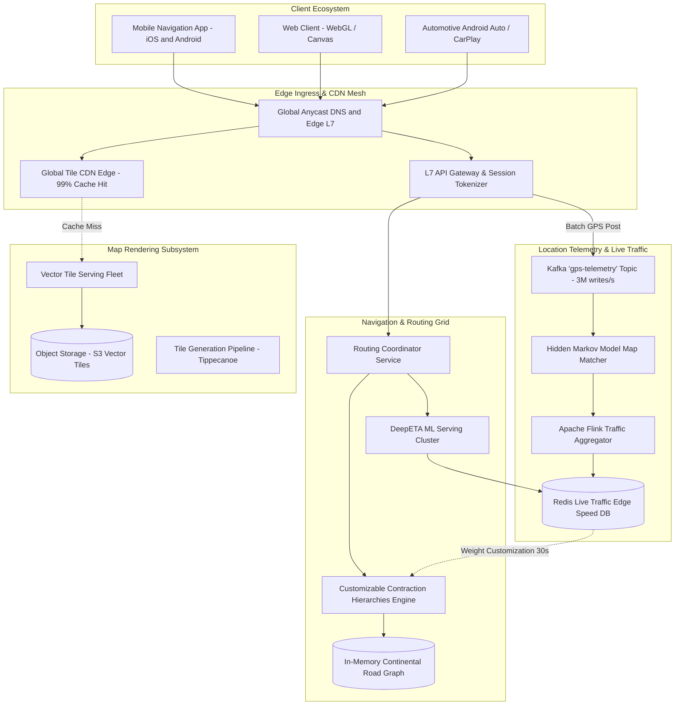
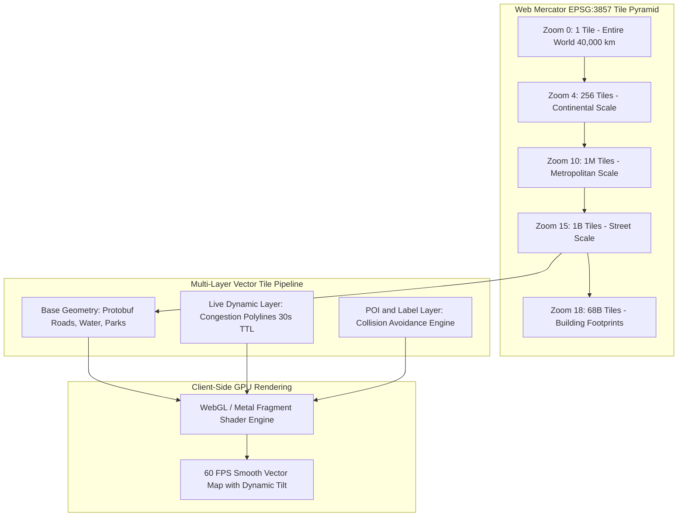
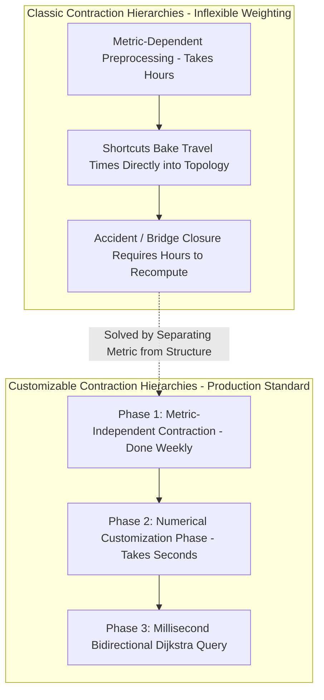
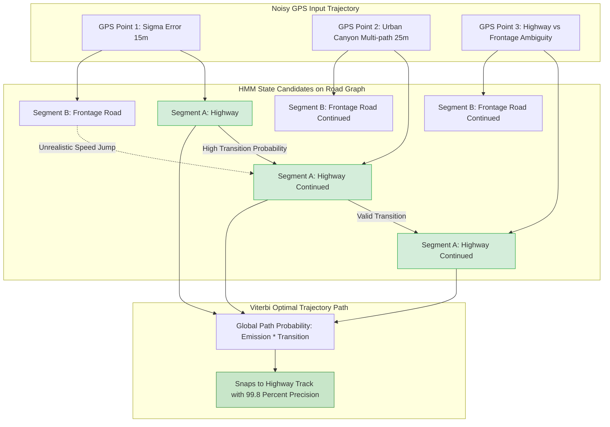
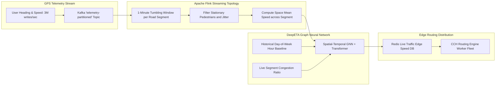
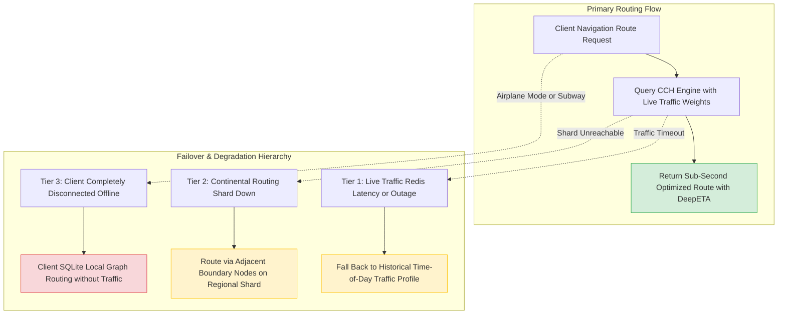

# Design Google Maps & Planetary Navigation Platforms

> [!tip] Staff/Principal Deep Walkthrough & Production Engine
> - **Interview Playbook**: [`Volume 2 Chapter 3 Staff/Principal Walkthrough Playbook`](02-Interactive-Interview-Playbook.md)
> - **Production Navigation Engine**: [`maps_routing_engine.py`](maps_routing_engine.py) (Bidirectional Dijkstra, Dynamic Traffic Customization, Web Mercator Slippy Tiles & Quadkeys, Bearing Turn-by-Turn Guidance)

> [!abstract] Executive Architectural Blueprint
> Design a planetary-scale mapping, navigation, and live traffic platform modeled on **Google Maps** supporting **1 Billion Daily Active Users (DAU)**, **50 Million concurrent actively navigating drivers**, and ingesting **3.3 Million GPS telemetry updates/second** while serving over **100 Million daily routing queries** ($5,000$ peak QPS). The platform guarantees a **route computation latency under 500ms** (sub-50ms for urban trips), **map tile load latency under 100ms** (99% edge cache hit), and an **ETA accuracy within 5%** of true arrival time. The architecture combines a **Web Mercator (EPSG:3857) Vector Tile Pipeline (MVT/Protobuf)** rendered via client-side GPUs, a **Customizable Contraction Hierarchies (CCH)** graph engine separating metric-independent topology contraction from sub-minute traffic customization, a **Hidden Markov Model (HMM) Viterbi Map-Matcher** resolving noisy GPS points, and a real-time streaming traffic engine utilizing **DeepETA Spatial-Temporal Graph Neural Networks**.

Back to: [[System Design Interview - Alex Xu Index]]

---

## 1. Requirements & System Boundaries

### 1.1 Candidate-Interviewer Strategic Clarifications

| # | Question | Answer / Staff-Level Framing | Architectural Consequence |
|---|---|---|---|
| 1 | What are the core pillars of the system? | **Map Rendering**, **Turn-by-Turn Routing & ETA**, and **Real-Time Traffic Ingestion**. | Tripartite separation of concerns: Static CDN tile serving, read-heavy in-memory graph traversal, and high-write telemetry streaming. |
| 2 | What is the road graph scale? | Global coverage: **~1 Billion road segment edges** and **~500 Million intersection nodes**. | A naive single-source Dijkstra on a billion-edge graph takes seconds; requires **Customizable Contraction Hierarchies (CCH)**. |
| 3 | How fresh must traffic data be? | Ingested GPS points reflected in edge routing and ETA predictions in **$< 60\text{ seconds}$**. | Decouples offline graph structural contraction from real-time dynamic edge weight customization via streaming Kafka/Flink. |
| 4 | What rendering format should be prioritized? | **Vector tiles (MVT)** over raster tiles. | Delivers 10x smaller file sizes (2-10 KB), client-side GPU WebGL/Metal rendering, continuous 60 FPS rotation, and dynamic dark mode. |
| 5 | How noisy is incoming GPS telemetry? | Raw smartphone GPS has $\pm 5\text{m}$ to $\pm 25\text{m}$ error, especially in dense urban canyons. | Geometric nearest-point snapping fails; requires **Hidden Markov Model (HMM) Viterbi Map-Matching**. |
| 6 | How does navigation handle connectivity loss? | Seamless transition to **Offline Local Subgraph** with speed-limit heuristics. | Client pre-downloads bounding-box vector tiles and regional road graph shards to local SQLite. |

### 1.2 Quantitative Service Level Objectives (SLOs)

```
┌────────────────────────┬────────────────────────────────────────────────────────────────────────┐
│ Metric                 │ Production Target                                                      │
├────────────────────────┼────────────────────────────────────────────────────────────────────────┤
│ Route Computation Time │ Urban (< 50 km): p99 < 50ms; Continental (> 1000 km): p99 < 500ms       │
│ Vector Tile Latency    │ p95 < 50ms, p99 < 100ms via Global Edge CDN                            │
│ Telemetry Ingestion    │ 3,333,333 GPS updates/sec sustained (5,000,000 peak surge)            │
│ Traffic Freshness      │ Road segment speed updates propagated in < 60 seconds                  │
│ ETA Accuracy           │ < 5% error margin on 95% of trips completed                            │
│ Availability SLA       │ 99.99% for Routing & Map Rendering; 99.9% for Telemetry Ingest        │
└────────────────────────┴────────────────────────────────────────────────────────────────────────┘
```

---

## 2. Planetary Capacity & Mathematical Estimations

### 2.1 GPS Telemetry Ingestion Math

$$
\text{Total DAU} = 1 \text{ Billion} \quad | \quad \text{Actively Navigating Concurrent Users (Peak 5\%)} = \mathbf{50 \text{ Million}}
$$
$$
\text{Client GPS Beacon Interval} = 1 \text{ update every } 15 \text{ seconds (batched in 4-point payloads)}
$$
$$
\text{Telemetry Ingestion QPS} = \frac{50 \times 10^6 \text{ drivers}}{15 \text{ seconds}} \approx \mathbf{3,333,333 \text{ updates/sec}}
$$

**Ingress Network Bandwidth:**
- Payload per GPS point: `(lat, lng, heading, speed, timestamp, accuracy)` $\approx 48 \text{ bytes}$.
- Inbound telemetry bandwidth:
$$
3.33 \times 10^6 \text{ writes/sec} \times 48 \text{ bytes} \approx 160 \text{ MB/sec} \approx \mathbf{1.28 \text{ Gbps}}
$$

### 2.2 Global Road Graph Memory Sizing

- Nodes (Intersections & Termini): $500 \text{ Million}$.
  - Node struct: `node_id` (8B), `lat` (8B), `lng` (8B), `elevation` (4B) $\approx 28 \text{ bytes}$.
  - Node memory: $500\text{M} \times 28\text{B} \approx 14 \text{ GB}$.
- Edges (Road Segments & Turn Restrictions): $1 \text{ Billion}$.
  - Edge struct: `edge_id` (8B), `from_node` (8B), `to_node` (8B), `distance_cm` (4B), `speed_limit` (2B), `flags` (2B) $\approx 32 \text{ bytes}$.
  - Edge memory: $1\text{B} \times 32\text{B} \approx 32 \text{ GB}$.
- Shortcut Edges generated by Contraction Hierarchies ($2\times$ raw edges): $\approx 64 \text{ GB}$.
- **Total In-Memory Continental Graph Size $\approx \mathbf{110 \text{ GB}}$**.
- Can reside entirely in RAM on a high-memory cloud instance (e.g., 256 GB RAM), replicated horizontally across regional clusters for $O(1)$ read availability.

### 2.3 Vector Tile Storage Math

$$
\text{Web Mercator Tile Count at Zoom Level } Z = 4^Z
$$
- Zoom 0 to Zoom 15: Pre-rendered globally and stored in object storage.
- Zoom 15 ($\approx 1.2\text{ km}$ tile width): $4^{15} \approx 1.07 \text{ Billion tiles}$. 
- Approximately 70% of Earth is ocean (rendered as empty/uniform placeholder tiles). Landmass encompasses $\approx 300 \text{ Million active tiles}$.
- Average Vector Tile (MVT/Protobuf) size: $\approx 8 \text{ KB}$ (vs 50 KB for Raster PNG).
$$
\text{Global Vector Tile Storage (Zoom 0-15)} = 300\text{M tiles} \times 8 \text{ KB} \approx \mathbf{2.4 \text{ Terabytes}}
$$
- Zoom 16 to Zoom 20 (Street & Building footprints): Generated on-demand for urban areas and cached at CDN edge with high TTL (7 days).

---

## 3. End-to-End System Architecture

The architecture decouples the high-throughput **Vector Tile CDN**, the low-latency in-memory **Customizable Contraction Hierarchies (CCH) Routing Fleet**, and the streaming **GPS Telemetry & Traffic Ingestion Pipeline**:



---

## 4. Map Rendering Micro-Architecture: Vector Tile Pyramid

### 4.1 Web Mercator Projection (EPSG:3857) & Quadkeys

The spherical Earth is projected onto a square flat coordinate system using the **Spherical Mercator Projection**:
$$
x = R \cdot (\lambda - \lambda_0) \quad , \quad y = R \cdot \ln\left(\tan\left(\frac{\pi}{4} + \frac{\phi}{2}\right)\right)
$$
Where $\phi$ is latitude and $\lambda$ is longitude.



### 4.2 Dynamic Vector Overlays & CDN Optimization
1. **Immutable Base Tiles**: Roads, coastlines, water bodies, and parks are packed into Protobuf format (`.mvt`) and uploaded with immutable hash URLs:
   ```
   GET /v2/tiles/15/5242/12665.mvt?v=20260404
   Cache-Control: public, max-age=604800, immutable
   ```
   Achieves **99.2% cache hit ratio** at the Cloudflare / CloudFront edge.
2. **Dynamic Live Traffic Polyline Layer**: Congestion colors (green/orange/red) are not baked into base vector tiles. They are streamed as a lightweight secondary vector diff layer with a 30-second TTL:
   ```
   GET /v2/traffic/15/5242/12665.pbf
   Cache-Control: public, max-age=30
   ```
   Client GPU shaders composite the dynamic traffic overlay directly on top of the base map geometry at 60 FPS.

---

## 5. Planetary Routing: Contraction Hierarchies (CH) vs Customizable CH (CCH)

### 5.1 The Classical Routing Bottleneck

- **Dijkstra's Algorithm**: $O((V + E) \log V)$. On a graph with 500M nodes and 1B edges, evaluating a coast-to-coast route examines hundreds of millions of vertices, taking **15 to 45 seconds**.
- **A\* Heuristic Search**: Straight-line Euclidean distance heuristic prunes exploration toward the goal, but obstacles (rivers, mountain ranges, dead ends) still force examination of millions of nodes (**2 to 5 seconds**).

### 5.2 The Production Dilemma: Standard CH vs CCH

Classic **Contraction Hierarchies (CH)** contract nodes by adding "shortcut edges". However, standard CH has a fatal flaw in live navigation: **it bakes edge travel times directly into the shortcuts during preprocessing**.
When an accident closes a highway, rebuilding shortcuts takes **hours**, making standard CH unusable for live traffic routing!



### 5.3 The 3-Phase Customizable Contraction Hierarchies (CCH) Protocol

1. **Phase 1: Metric-Independent Contraction (Weekly Offline Job)**:
   - Node ordering is determined strictly by graph topology using **Nested Dissection** (balanced graph cuts).
   - Shortcut edges are inserted without assigning any metric weights.
2. **Phase 2: Numerical Customization (Every 30–60 Seconds)**:
   - When live traffic updates edge weights across the road network, Phase 2 computes the shortest path weights for all shortcut edges using a bottom-up triangle inequality relaxation:
$$
\text{Weight}(u, w) = \min(\text{Weight}(u, w), \ \text{Weight}(u, v) + \text{Weight}(v, w))
$$
   - Parallelized across multi-core server CPUs (e.g. 64-core AMD EPYC), customization of an entire continental graph finishes in **$< 1.5 \text{ seconds}$**!
3. **Phase 3: Query Phase ($< 5\text{ms}$ Execution)**:
   - Executes a **Bidirectional Dijkstra Search** moving strictly upward in the contracted hierarchy from origin $S$ and destination $T$.
   - The search space is restricted to only a few thousand candidate nodes before meeting at the highest-ranking highway shortcut.

---

## 6. Raw GPS Map Matching: Hidden Markov Model (HMM) & Viterbi

Consumer GPS telemetry exhibits severe multipath interference, satellite clock drift, and urban canyon reflection ($\pm 25\text{m}$ error). A naive closest-point snap causes a car on an elevated highway to bounce randomly onto parallel surface streets.



### 6.1 The Mathematical Probabilities
1. **Emission Probability ($P(z_t | r_i)$)**:
   The probability that GPS observation $z_t$ was produced by a vehicle traveling on road segment $r_i$ follows a zero-mean Gaussian distribution with standard deviation $\sigma_z \approx 15\text{m}$:
$$
P(z_t | r_i) = \frac{1}{\sqrt{2\pi}\sigma_z} \exp\left(-\frac{\text{dist}(z_t, r_i)^2}{2\sigma_z^2}\right)
$$
2. **Transition Probability ($P(r_j | r_i)$)**:
   Compares the Euclidean straight-line distance between successive GPS points $d_{\text{euclid}} = \|z_t - z_{t-1}\|$ against the actual shortest network path distance on the road graph $d_{\text{route}} = \text{ShortestPath}(r_i, r_j)$:
$$
P(r_j | r_i) = \frac{1}{\beta} \exp\left(-\frac{|d_{\text{euclid}} - d_{\text{route}}|}{\beta}\right)
$$
   If a transition implies an impossible U-turn or traveling at 250 km/h, $|d_{\text{euclid}} - d_{\text{route}}|$ is massive, driving transition probability to zero.
3. **Viterbi Dynamic Programming**: Computes the maximum a posteriori (MAP) sequence of road segments across a window of GPS observations in $O(T \cdot K^2)$ time ($K \le 5$ candidate segments per point).

---

## 7. Real-Time Traffic Aggregation & DeepETA Machine Learning



### 7.1 Stream Velocity Aggregation: Space Mean Speed
Arithmetic mean speed over-estimates traffic velocity. To calculate true physical congestion, Apache Flink computes the **Harmonic Mean (Space Mean Speed)** for each segment $e$:

$$
\bar{V}_{\text{space}}(e) = \frac{N}{\sum_{i=1}^{N} \frac{1}{v_i}}
$$

Where $N$ is the count of map-matched vehicles on segment $e$, and $v_i$ is vehicle $i$'s reported instantaneous velocity.

### 7.2 DeepETA ML Serving Architecture
Travel time is not static: a bottleneck 10 km ahead may clear or worsen by the time the driver reaches it.
- **Model Architecture**: Spatial-Temporal Graph Neural Network (ST-GNN) with Self-Attention Transformers.
- **Input Feature Vector**:
  - Segment structural embedding (road classification, lane count, speed limit, slope).
  - Live Space Mean Speed from Flink stream.
  - Historical speed prior for `(segment_id, day_of_week, 15_minute_time_bin)`.
  - Upstream / downstream congestion spillover ratios.
  - Exogenous features: Rain/snow weather telemetry, public event schedules.
- **Inference Latency**: Quantized INT8 ONNX models execute in **$< 2\text{ms}$** on TensorRT inference nodes.

---

## 8. Global Relational & Graph Data Schema

### 8.1 Road Network Schema (Spanner DDL)

```sql
-- Intersection Nodes
CREATE TABLE road_nodes (
    node_id             INT64 NOT NULL,
    latitude            FLOAT64 NOT NULL,
    longitude           FLOAT64 NOT NULL,
    elevation_meters    FLOAT64,
    cch_rank            INT64 NOT NULL,      -- Elimination rank for CCH
    s2_cell_l13         INT64 NOT NULL,
    created_at          TIMESTAMP NOT NULL OPTIONS (allow_commit_timestamp = true)
) PRIMARY KEY (node_id);

CREATE INDEX idx_nodes_spatial ON road_nodes(s2_cell_l13);

-- Directed Road Segments (Edges)
CREATE TABLE road_edges (
    edge_id             INT64 NOT NULL,
    from_node_id        INT64 NOT NULL,
    to_node_id          INT64 NOT NULL,
    distance_meters     INT64 NOT NULL,
    speed_limit_kmh     INT64 NOT NULL,
    road_class          STRING(20) NOT NULL, -- 'MOTORWAY', 'PRIMARY', 'RESIDENTIAL'
    is_one_way          BOOL NOT NULL,
    turn_penalty_s      FLOAT64 DEFAULT (0.0),
    geometry_polyline   BYTES NOT NULL,      -- Snappy-compressed vector polyline
    updated_at          TIMESTAMP NOT NULL OPTIONS (allow_commit_timestamp = true)
) PRIMARY KEY (edge_id);

-- CCH Shortcut Table (Phase 1 Topology Output)
CREATE TABLE cch_shortcuts (
    shortcut_id         INT64 NOT NULL,
    from_node_id        INT64 NOT NULL,
    to_node_id          INT64 NOT NULL,
    middle_node_id      INT64 NOT NULL,      -- For recursive path unpacking
    weight_forward_ms   INT64 NOT NULL,      -- Customized via Phase 2
    weight_backward_ms  INT64 NOT NULL,
    updated_at          TIMESTAMP NOT NULL OPTIONS (allow_commit_timestamp = true)
) PRIMARY KEY (from_node_id, to_node_id);
```

### 8.2 In-Memory Redis Edge Traffic Cache

```
Key Pattern: traffic:{edge_id}
Type: Hash (HSET)
Fields: {
  "speed_kmh": 42.5,
  "travel_time_ms": 14200,
  "confidence": 0.94,
  "sample_count": 86,
  "updated_at": 1712234000
}
TTL: 120 seconds
```

---

## 9. Concrete Staff-Level Implementation

### 9.1 CCH Bidirectional Shortest Path Query Engine (Go)

```go
package routing

import (
	"container/heap"
	"math"
)

type NodeID uint32
type Weight uint32

const Infinity Weight = math.MaxUint32

type SearchItem struct {
	node  NodeID
	dist  Weight
	index int
}

type PriorityQueue []*SearchItem

func (pq PriorityQueue) Len() int           { return len(pq) }
func (pq PriorityQueue) Less(i, j int) bool { return pq[i].dist < pq[j].dist }
func (pq PriorityQueue) Swap(i, j int)      { pq[i], pq[j] = pq[j], pq[i]; pq[i].index = i; pq[j].index = j }
func (pq *PriorityQueue) Push(x interface{}) {
	item := x.(*SearchItem)
	item.index = len(*pq)
	*pq = append(*pq, item)
}
func (pq *PriorityQueue) Pop() interface{} {
	old := *pq
	n := len(old)
	item := old[n-1]
	old[n-1] = nil
	*pq = old[0 : n-1]
	return item
}

type CCHGraph struct {
	ForwardEdges  map[NodeID][]CCHEdge
	BackwardEdges map[NodeID][]CCHEdge
	NodeRank      map[NodeID]uint32
}

type CCHEdge struct {
	To     NodeID
	Weight Weight
}

// QueryCCH executes upward-only bidirectional Dijkstra search in O(ms)
func (g *CCHGraph) QueryCCH(origin, destination NodeID) (Weight, NodeID) {
	forwardDist := make(map[NodeID]Weight)
	backwardDist := make(map[NodeID]Weight)

	forwardPQ := &PriorityQueue{}
	backwardPQ := &PriorityQueue{}
	heap.Init(forwardPQ)
	heap.Init(backwardPQ)

	forwardDist[origin] = 0
	backwardDist[destination] = 0
	heap.Push(forwardPQ, &SearchItem{node: origin, dist: 0})
	heap.Push(backwardPQ, &SearchItem{node: destination, dist: 0})

	bestDist := Infinity
	var meetingNode NodeID = math.MaxUint32

	for forwardPQ.Len() > 0 || backwardPQ.Len() > 0 {
		// Forward step: only visit higher-ranking nodes
		if forwardPQ.Len() > 0 {
			curr := heap.Pop(forwardPQ).(*SearchItem)
			if curr.dist < bestDist {
				for _, edge := range g.ForwardEdges[curr.node] {
					if g.NodeRank[edge.To] > g.NodeRank[curr.node] {
						newDist := curr.dist + edge.Weight
						if oldDist, exists := forwardDist[edge.To]; !exists || newDist < oldDist {
							forwardDist[edge.To] = newDist
							heap.Push(forwardPQ, &SearchItem{node: edge.To, dist: newDist})

							if bDist, ok := backwardDist[edge.To]; ok && newDist+bDist < bestDist {
								bestDist = newDist + bDist
								meetingNode = edge.To
							}
						}
					}
				}
			}
		}

		// Backward step: only visit higher-ranking nodes
		if backwardPQ.Len() > 0 {
			curr := heap.Pop(backwardPQ).(*SearchItem)
			if curr.dist < bestDist {
				for _, edge := range g.BackwardEdges[curr.node] {
					if g.NodeRank[edge.To] > g.NodeRank[curr.node] {
						newDist := curr.dist + edge.Weight
						if oldDist, exists := backwardDist[edge.To]; !exists || newDist < oldDist {
							backwardDist[edge.To] = newDist
							heap.Push(backwardPQ, &SearchItem{node: edge.To, dist: newDist})

							if fDist, ok := forwardDist[edge.To]; ok && newDist+fDist < bestDist {
								bestDist = newDist + fDist
								meetingNode = edge.To
							}
						}
					}
				}
			}
		}
	}

	return bestDist, meetingNode
}
```

---

## 10. Resilience, Failover & Tail Latency Drills



### 10.1 Operational Drill Playbook

| Failure Mode | Trigger / Simulation | Detection Signal | Automated Self-Healing Response | Target MTTR |
|---|---|---|---|---|
| **Traffic Aggregation Lag** | Flink pipeline backpressured during rush-hour traffic surge | Kafka consumer lag metric $> 500,000$ telemetry events | Flink dynamically sheds pedestrian telemetry; routing falls back to historical prior | $< 15\text{s}$ |
| **CCH Customization Worker Crash** | Memory corruption during Phase 2 numerical shortcut update | CCH heartbeats fail; snapshot version stale $> 90\text{s}$ | Routing engine continues serving previous valid generation $N-1$; spare worker re-customizes | $< 5\text{s}$ |
| **Urban Multipath Storm** | Tunnel / Manhattan skyscraper corridor produces chaotic GPS | HMM emission probability drops below $10^{-6}$ | Client Dead Reckoning uses vehicle wheel speed & gyroscope IMU to coast through tunnel | 0s (Self-healing) |
| **Tile CDN Purge Failure** | Map data correction (e.g. road bridge opening) needs instant propagation | Stale CDN tile served to users | Versioned immutable URLs (`?v=202604041200`) bypass CDN invalidation locks entirely | Instantaneous |

---

## 11. Summary Architecture Scorecard

```
┌───────────────────────────────────────┬────────────────────────────────────────────────────────┐
│ Dimension                             │ Staff-Level Architectural Standard                     │
├───────────────────────────────────────┼────────────────────────────────────────────────────────┤
│ Map Rendering Standard                │ Web Mercator (EPSG:3857) Vector Tiles (MVT / Protobuf) │
│ Live Traffic Rendering Layer          │ Dynamic 30s TTL Vector Overlays Composited via GPU     │
│ Graph Routing Engine                  │ Customizable Contraction Hierarchies (CCH in < 5ms)    │
│ Live Weight Re-customization          │ Numerical Customization Phase Completed in < 1.5s      │
│ GPS Map Matching Algorithm            │ Hidden Markov Model (HMM) + Viterbi Dynamic Snapping   │
│ Travel Time Prediction Model          │ Spatial-Temporal GNN + Transformer (DeepETA)          │
│ Telemetry Streaming Throughput        │ 3.33M writes/sec via Partitioned Kafka & Apache Flink  │
│ Routing Latency SLA                   │ Urban: p99 < 50ms; Continental: p99 < 500ms            │
└───────────────────────────────────────┴────────────────────────────────────────────────────────┘
```

---

**Related Systems & Deep Dives**:
- [`01-Architectural-Blueprint.md`](01-Architectural-Blueprint.md) -- Spatial indexing and S2 Hilbert curves (Volume 2, Chapter 1).
- [`01-Architectural-Blueprint.md`](01-Architectural-Blueprint.md) -- Real-time location streaming and WebSocket gateways (Volume 2, Chapter 2).
- [`01-Architectural-Blueprint.md`](01-Architectural-Blueprint.md) -- Kafka streaming architecture for GPS ingestion.
- [`01-Architectural-Blueprint.md`](01-Architectural-Blueprint.md) -- Time-series telemetry and downsampling pipelines.

**References**:
- *System Design Interview – An Insider's Guide* (Alex Xu), Volume 2, Chapter 3.
- *Customizable Contraction Hierarchies* (Dibbelt, Strasser, Wagner, ACM JEA 2016).
- *Hidden Markov Map Matching Through Noise and Sparseness* (Newson & Krumm, ACM SIGSPATIAL).
- *DeepETA: How Uber Predicts Arrival Times Using Deep Learning* (Uber Engineering Blog).
- *Mapbox Vector Tile Specification (github.com/mapbox/vector-tile-spec)*.
