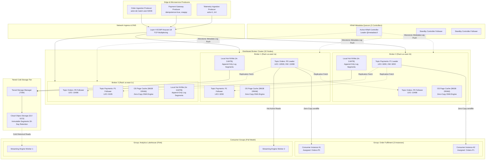
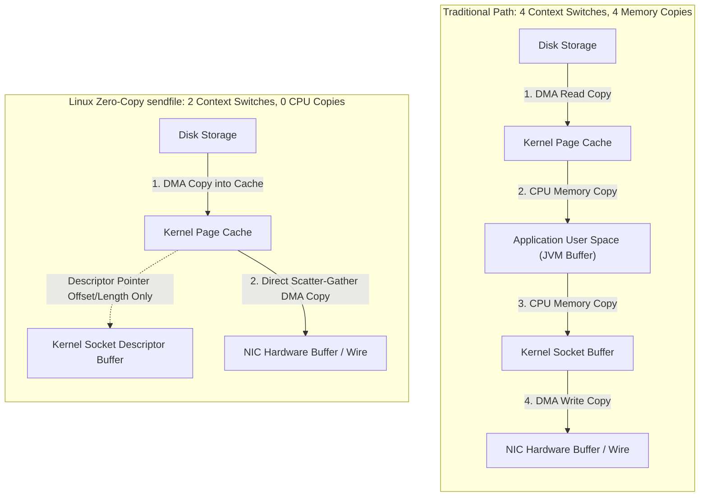
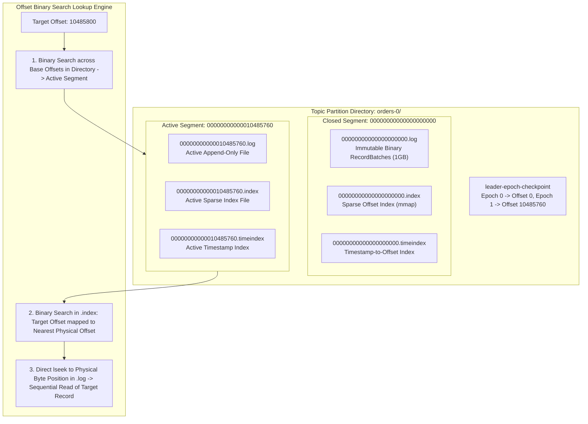
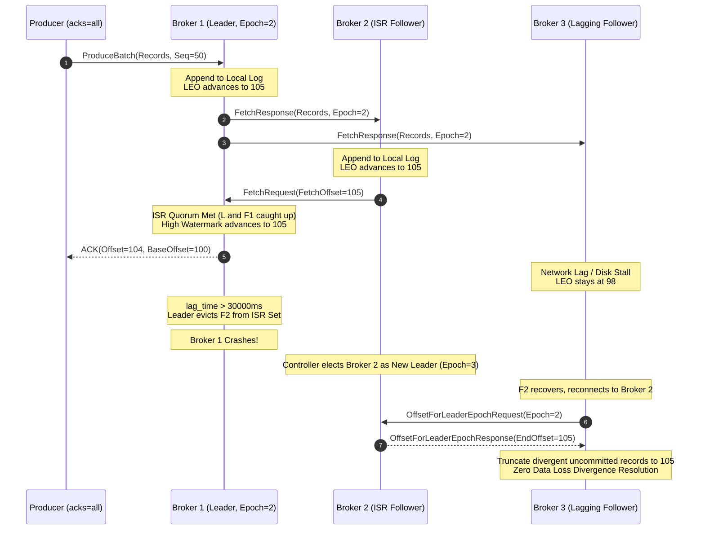
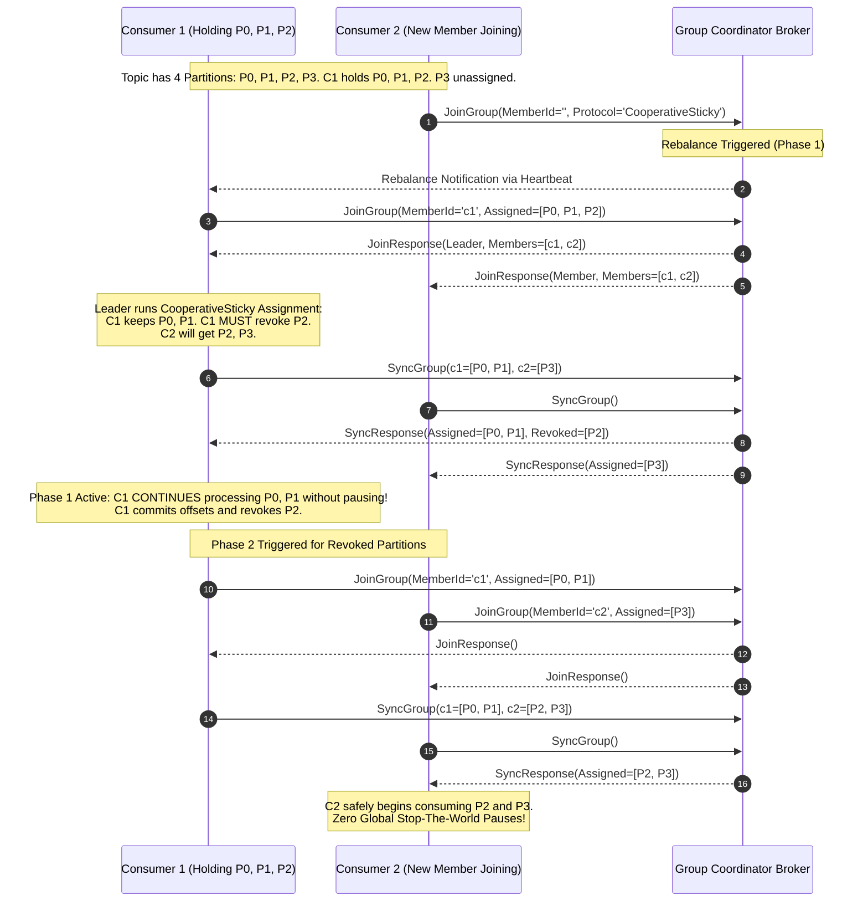
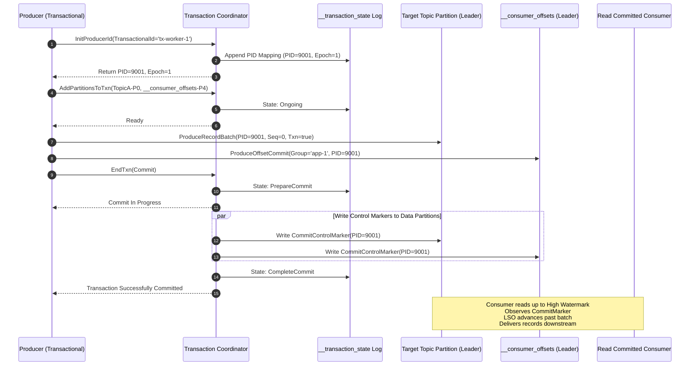

# Design a Distributed Message Queue

> [!tip] Staff/Principal Deep Walkthrough & Production Engine
> - **Interview Playbook**: [`Volume 2 Chapter 4 Staff/Principal Walkthrough Playbook`](02-Interactive-Interview-Playbook.md)
> - **Production Commit Log Engine**: [`distributed_queue_engine.py`](distributed_queue_engine.py) (Binary Log Framing, CRC32 Bit-Rot Shield, Sparse Indexing, In-Sync Replicas, High Watermark, and Consumer Group Rebalancing)

> [!abstract] Executive Problem Statement
> Design an enterprise-grade, hyperscale **Distributed Message Queue / Event Streaming Platform** (Kafka/Pulsar-class) capable of handling **100 Billion events per day** (over **4 Million msgs/sec peak write throughput**, **16+ GB/sec peak egress fan-out**), delivering sub-10ms append latencies, strict per-partition linear ordering, fault-tolerant replication with zero data loss ($RPO = 0$), and exactly-once processing semantics (EOS) across distributed producers, brokers, and consumer groups.

---

## 1. Executive Architectural Blueprint & Paradigmatic Matrix

A modern distributed message queue is fundamentally an **immutable, append-only, distributed commit log**. To understand its architecture, one must distinguish between traditional message queuing, log-centric event streaming, and decoupled compute-storage streaming.



### Paradigmatic Disambiguation Matrix

| Architectural Dimension | Traditional Message Broker (RabbitMQ / ActiveMQ) | Partitioned Log Streaming (Apache Kafka) | Decoupled Compute-Storage (Apache Pulsar) | Cloud-Managed Broker (AWS SQS / Kinesis) |
| :--- | :--- | :--- | :--- | :--- |
| **Core Storage Abstraction** | Ephemeral RAM queues with transient disk spill | Append-only partitioned commit logs on local NVMe | Decoupled stateless brokers + BookKeeper Bookies | Multi-tenant managed virtual partitions |
| **Consumption Model** | **Push-based** (broker pushes to consumer socket) | **Pull-based** (consumer requests offset range) | **Pull or Push** via client-side cursors | **Pull** (SQS) or **Pull/Enhanced Fan-out** (Kinesis) |
| **Backpressure Control** | Broker blocks producers when RAM limits breach | Natural client-side backpressure (pull rate) | Credit-based flow control | Throttling exceptions (`ProvisionedThroughputExceeded`) |
| **Message Deletion & Replay** | Destructive read (message deleted upon ACK) | Non-destructive (retention by time/size, seek offset) | Non-destructive (cursor tracking, tiered offload) | Destructive read upon visibility timeout deletion |
| **Ordering Guarantees** | Total queue order, breaks under concurrent workers | **Strict total order per partition** | Total order per partition or key-shared | Best-effort (standard) or strict FIFO (300 msg/s cap) |
| **Throughput Boundary** | $50\text{K} - 100\text{K}\text{ msgs/sec}$ (Erlang mailbox bound) | **$1\text{M} - 10\text{M}+\text{ msgs/sec}$** (Sequential I/O + Page Cache) | $1\text{M} - 5\text{M}\text{ msgs/sec}$ (Network bound) | Managed scale limits / partition limits |
| **Metadata Consensus** | Mnesia cluster replication | **KRaft (Raft quorum)** (formerly ZooKeeper) | Apache ZooKeeper + BookKeeper metadata | Internal Paxos / Dynamo consensus |

### Core Philosophical Tenets
1. **Append-Only Sequential Log**: Disk sequential write performance ($> 600\text{ MB/s}$ on HDD, $> 3.5\text{ GB/s}$ on NVMe) rivals random DRAM access. Appending to a file eliminates B-Tree re-balancing, random disk seeks, and write stalls.
2. **Kernel Page Cache Symbiosis**: Bypassing JVM heap for message caching eliminates garbage collection (GC) stop-the-world pauses, object header memory bloat ($24\text{ bytes}$ per object), and duplicate caching.
3. **Zero-Copy Network I/O**: Leveraging Linux `sendfile()` allows network data transfer directly from the OS Page Cache to the NIC ring buffer via DMA scatter-gather, bypassing user-space memory entirely.
4. **Decoupled Monotonic Partitions**: Horizontal scaling achieved by sharding a logical topic into independent, immutable partitions. Total ordering is guaranteed per-partition; horizontal scaling is achieved by increasing partition counts.

---

## 2. Hyperscale Scale & Capacity Math (Re-baselined)

### Operational Parameters
- **Daily Ingestion Volume**: $100\text{ Billion messages/day}$.
- **Average Payload Size**: $1\text{ KB}$ per uncompressed message.
- **Peak-to-Average Traffic Factor**: $3.5\times$.
- **Downstream Fan-Out**: $4$ independent consumer groups (Order Fulfilment, Analytics Lakehouse, Fraud ML, Audit Indexer).
- **Durability SLA**: Replication Factor $RF = 3$, `min.insync.replicas = 2`, `acks = all`.
- **Retention SLA**: Hot NVMe tier: $3\text{ days}$; Cold S3 tier: $30\text{ days}$.

---

### Ingestion & Egress Throughput Derivations

$$\text{Average Ingress Rate} = \frac{100 \times 10^9 \text{ messages}}{86,400 \text{ seconds}} \approx 1,157,407 \text{ msgs/sec} \approx 1.16 \text{M msgs/sec}$$

$$\text{Peak Ingress Rate} = 1.157\text{M} \times 3.5 \approx 4,050,000 \text{ msgs/sec} \approx 4.05 \text{M msgs/sec}$$

#### Ingress Bandwidth
$$\text{Average Ingress Bandwidth} = 1.157\text{M msgs/sec} \times 1 \text{ KB} = 1.16 \text{ GB/sec} = 9.28 \text{ Gbps}$$

$$\text{Peak Ingress Bandwidth} = 4.05\text{M msgs/sec} \times 1 \text{ KB} = 4.05 \text{ GB/sec} = 32.4 \text{ Gbps}$$

#### Inter-Broker Replication Bandwidth (RF = 3)
For each byte received by a partition leader, two follower replicas must fetch the data over the cluster private fabric:
$$\text{Peak Follower Replication Bandwidth} = 4.05 \text{ GB/sec} \times (3 - 1) = 8.10 \text{ GB/sec} = 64.8 \text{ Gbps}$$

#### Consumer Egress Bandwidth (Fan-Out = 4)
With 4 active consumer groups tailing the log in real-time:
$$\text{Peak Consumer Egress} = 4.05 \text{ GB/sec} \times 4 = 16.20 \text{ GB/sec} = 129.6 \text{ Gbps}$$

#### Total Aggregate Cluster Network Throughput (Peak)
$$\text{Total Network I/O} = \text{Client Ingress} + \text{Replication Ingress} + \text{Replication Egress} + \text{Consumer Egress}$$
$$\text{Total Network I/O} = 4.05 + 8.10 + 8.10 + 16.20 = 36.45 \text{ GB/sec} = 291.6 \text{ Gbps}$$

---

### Storage Capacity Calculations

#### Data Compression Sizing
Assuming high-efficiency dictionary-trained compression (Zstandard or LZ4) yielding a realistic **$2.5:1$ compression ratio** ($60\%$ reduction):
$$\text{Compressed Daily Ingress} = \frac{100 \text{ TB}}{2.5} = 40 \text{ TB/day}$$

#### Hot Storage Sizing (Local NVMe Tier, 3 Days, RF = 3)
$$\text{Raw Hot Storage} = 40 \text{ TB/day} \times 3 \text{ days} \times 3 \text{ (RF)} = 360 \text{ TB}$$
With a $25\%$ safety headroom buffer for compaction overhead, segment index files, and write amplification:
$$\text{Target Hot Storage Provisioning} = 360 \text{ TB} \times 1.25 = 450 \text{ TB NVMe}$$

#### Cold Storage Sizing (Object Storage S3/GCS Tier, 30 Days)
Tiered storage offloads closed segments to object storage. Because cloud object stores provide internal 11 9s durability across availability zones, only a single compressed replica is retained in the cold tier:
$$\text{Cold S3 Storage} = 40 \text{ TB/day} \times 30 \text{ days} = 1.2 \text{ PB}$$

---

### Hardware, Partition & Broker Cluster Provisioning

#### Partition Boundary Math
A single modern NVMe-backed partition can sustain up to $10\text{ MB/sec}$ write throughput and $30\text{ MB/sec}$ read throughput without lock contention or index thrashing:
$$\text{Minimum Partitions for Peak Ingress} = \frac{4,050 \text{ MB/sec}}{10 \text{ MB/sec}} = 405 \text{ partitions}$$
To support fine-grained consumer parallelism across 4 consumer groups (some running up to 500 parallel consumer threads in Apache Flink), we baseline **$1,024$ partitions** for the high-throughput ingestion topics.

#### Broker Node Topology (32 Brokers)
We provision a cluster of **32 broker nodes** deployed across 3 Availability Zones (11 in AZ-1, 11 in AZ-2, 10 in AZ-3):
- **Network Load per Broker**:
  $$\text{Per-Broker Peak Ingress} = \frac{4.05 \text{ GB/sec} + 8.10 \text{ GB/sec}}{32} \approx 380 \text{ MB/sec} = 3.04 \text{ Gbps}$$
  $$\text{Per-Broker Peak Egress} = \frac{8.10 \text{ GB/sec} + 16.20 \text{ GB/sec}}{32} \approx 760 \text{ MB/sec} = 6.08 \text{ Gbps}$$
  Each broker requires a **25 GbE NIC** (dual-bonded 25GbE recommended), ensuring peak utilization stays below $40\%$ of network line rate.
- **Local NVMe per Broker**:
  $$\text{Per-Broker NVMe} = \frac{450 \text{ TB}}{32} \approx 14.06 \text{ TB}$$
  Provisioned as **4 $\times$ 3.84 TB Enterprise NVMe U.2 SSDs** configured in JBOD (Just a Bunch of Disks) across multiple Kafka log directories (`log.dirs`), delivering over $12\text{ GB/s}$ sustained sequential write capability.
- **Memory & DRAM Provisioning**:
  Each broker provisions **128 GB ECC DDR5 RAM**:
  - **32 GB JVM Heap**: Run with modern G1GC or ZGC; small enough to ensure GC pause times $< 5\text{ms}$.
  - **96 GB OS Page Cache**: Caches hot uncommitted writes and tailing consumer reads, ensuring $> 98\%$ of read requests hit DRAM zero-copy paths rather than reading physical NVMe NAND cells.

---

## 3. Storage & Kernel Micro-Architecture

### The Linux OS Page Cache & JVM Heap Bypass
Traditional Java message systems store active messages as POJOs (Plain Old Java Objects) in the JVM Heap. This creates severe architectural limitations:
1. **Memory Overhead**: An 8-byte string in Java requires up to 24 bytes of object header and padding metadata, tripling memory usage.
2. **Stop-The-World (STW) Pauses**: Scanning hundreds of gigabytes of heap memory degrades garbage collector performance, inducing latency spikes up to several seconds.
3. **Double Buffering**: When writing to the network, the JVM must copy heap memory to native OS socket buffers, duplicating data in memory.

Kafka stores all messages in **OS Page Cache** using the exact same binary format on disk as sent over the network wire.



#### Kernel Flush & Dirty Page Tunables
Kafka relies on the OS kernel's background page flush daemons (`kswapd` and `pdflush`/`flush-xfs`) to asynchronously persist dirty pages to disk:
- `vm.dirty_background_ratio = 5`: Kernel begins background flushing when dirty pages reach 5% of physical memory.
- `vm.dirty_ratio = 10`: Active writes block only if dirty pages exceed 10% of physical memory, preventing I/O stalls.
- Kafka bypasses explicit `fsync()` on individual messages. Durability is achieved via **distributed memory replication across multiple physical machines (In-Sync Replicas)**, which is significantly faster than blocking on disk synchronous write cycles.

---

### Hardware-Sympathetic Zero-Copy Network I/O
When a consumer issues a `FetchRequest`, the broker retrieves data from disk segments and transmits it across the TCP connection.

#### Traditional User-Space Transfer Pipeline (4 Copies, 4 Context Switches)
1. `read()` syscall: Kernel issues DMA read from disk into Kernel Page Cache. (Context switch 1: User $\to$ Kernel; Copy 1: Disk $\to$ Page Cache).
2. Data copied via CPU from Page Cache to User-Space JVM byte buffer. (Context switch 2: Kernel $\to$ User; Copy 2: Page Cache $\to$ JVM).
3. `write()` syscall: JVM calls socket send, CPU copies data to Kernel Socket Buffer. (Context switch 3: User $\to$ Kernel; Copy 3: JVM $\to$ Socket Buffer).
4. Kernel issues DMA transfer from Socket Buffer to Network Interface Card (NIC). (Context switch 4: Kernel $\to$ User; Copy 4: Socket Buffer $\to$ NIC wire).

#### Zero-Copy `sendfile()` Pipeline with Scatter-Gather DMA (0 CPU Copies, 2 Context Switches)
```c
// Kafka Java FileChannel.transferTo() compiles directly to Linux sendfile64()
ssize_t sendfile(int out_fd, int in_fd, off_t *offset, size_t count);
```
1. `sendfile()` syscall initiates transfer. (Context switch 1: User $\to$ Kernel).
2. DMA engine reads data from disk directly into the Kernel Page Cache (Copy 1: Disk $\to$ Page Cache via DMA).
3. **No data is copied to the socket buffer**. Instead, a tiny socket buffer descriptor containing only the memory address and length is attached to the socket buffer.
4. The NIC DMA engine uses **Scatter-Gather DMA** to read data directly from the Kernel Page Cache and send it over the wire (Copy 2: Page Cache $\to$ NIC via DMA).
5. Syscall returns. (Context switch 2: Kernel $\to$ User).

**Net Staff Impact**: CPU utilization drops by over $65\%$, and network egress achieves maximum theoretical PCI-Express and NIC line rate saturation.

---

### Log Segment Storage Micro-Structure & Binary Layout

Every topic partition is implemented as a physical directory on disk containing multiple **Log Segments**:



#### On-Disk File Artifacts per Segment
- `.log`: Binary data file containing contiguous `RecordBatch` streams. Default max segment size is $1\text{ GB}$ (`segment.bytes = 1073741824`).
- `.index`: Sparse memory-mapped (`mmap`) offset-to-physical-byte index file. Entries are written every $4\text{ KB}$ of log data (`index.interval.bytes = 4096`).
  - Index Entry Structure: **8 bytes total** = 4 bytes Relative Offset (`Offset - BaseOffset`) + 4 bytes Physical File Position (`PositionInLog`).
- `.timeindex`: Sparse timestamp-to-offset index file. Entries contain: **12 bytes total** = 8 bytes Unix Timestamp + 4 bytes Relative Offset.
- `leader-epoch-checkpoint`: Checkpoint file recording the starting offset for every `LeaderEpoch` assigned to this partition.

#### Binary Wire & Storage Format: Kafka RecordBatch V2
Each log segment contains a sequence of variable-length `RecordBatch` structures:

```
+-------------------------------------------------------------------------+
|                        RecordBatch Header (61 Bytes)                    |
+-------------------------------------------------------------------------+
| BaseOffset (8B)           : Starting 64-bit log offset                  |
| BatchLength (4B)          : Total length of batch in bytes              |
| PartitionLeaderEpoch (4B) : Monotonic leader epoch counter              |
| Magic (1B)                : Message format version (Current: 2)         |
| CRC32C (4B)               : Castagnoli CRC checksum covering payload    |
| Attributes (2B)           : Bit 0-2: Compression (0:None,1:GZIP,2:Snappy|
|                             3:LZ4, 4:Zstandard)                         |
|                             Bit 3: Timestamp Type (CreateTime / LogTime)|
|                             Bit 4: IsTransactional (1: True, 0: False)  |
|                             Bit 5: IsControlBatch (Commit/Abort marker) |
| LastOffsetDelta (4B)      : Offset of last record minus BaseOffset      |
| FirstTimestamp (8B)       : Milliseconds timestamp of first record      |
| MaxTimestamp (8B)         : Maximum timestamp in this batch             |
| ProducerId (8B)           : Unique 64-bit Producer ID (PID)             |
| ProducerEpoch (2B)        : Monotonic Producer Epoch for zombie fencing |
| BaseSequence (4B)         : Sequence number of first record in batch    |
| RecordsCount (4B)         : Number of individual records in batch       |
+-------------------------------------------------------------------------+
|                           Records Array Payload                         |
+-------------------------------------------------------------------------+
| Record Length (varint)    : Varint-encoded byte length                  |
| Attributes (1B)           : Unused (reserved)                           |
| TimestampDelta (varlong)  : Timestamp minus FirstTimestamp              |
| OffsetDelta (varint)      : Offset minus BaseOffset                     |
| KeyLength (varint)        : Byte length of Key (-1 if null)             |
| Key Payload               : Raw key bytes                               |
| ValueLength (varint)      : Byte length of Value (-1 if null)           |
| Value Payload             : Raw payload bytes                           |
| HeadersCount (varint)     : Number of metadata headers                  |
| Headers Array             : Header Key-Value byte pairs                 |
+-------------------------------------------------------------------------+
```

---

### Log Compaction Micro-Architecture
For stateful change-data-capture (CDC) topics (e.g., database changelogs or key-value caches), Kafka provides **Log Compaction** (`cleanup.policy = compact`).

1. **Clean vs Dirty Segments**:
   - The head of the log is the **Dirty Log** (new writes not yet cleaned).
   - The tail of the log is the **Clean Log** (previously deduplicated).
   - Cleaning is triggered when dirty log ratio exceeds `min.cleanable.dirty.ratio = 0.5`.
2. **Skimpy Offset Map**:
   - Compaction threads build an in-memory hash table called the **Skimpy Offset Map**.
   - Built using open-addressing with linear probing. It stores a 16-byte MD5 hash of the message key and maps it to the latest 8-byte offset: **24 bytes per entry**.
   - A $1\text{ GB}$ map can index over 40 Million distinct record keys.
3. **Deduplication Pass**:
   - The cleaner reads dirty segments, compares each record key against the offset map. If the record's offset is older than the map entry, it is discarded.
4. **Tombstones & Garbage Collection**:
   - Deleting a key writes a message with a non-null key and a **null payload** (a Tombstone).
   - Tombstones are retained across compaction cycles for `delete.retention.ms = 86400000` (24 hours) to guarantee downstream consumers observe the deletion event before the tombstone is purged.

---

## 4. Distributed Replication, Consensus & Metadata Dynamics

### High Watermark (HW) vs Log End Offset (LEO)
Replication operates via a leader-follower pulling mechanism:



- **Log End Offset (LEO)**: The offset of the next record to be written to a replica's local log.
- **High Watermark (HW)**: The minimum LEO across all replicas in the In-Sync Replica (ISR) set:
  $$HW = \min_{r \in ISR} (LEO_r)$$
- **Visibility Invariant**: Consumers are strictly restricted to reading records up to the High Watermark ($Offset < HW$). Any record beyond the HW is uncommitted and could be lost if the leader crashes.

---

### The Log Truncation Divergence Bug & Leader Epoch Resolution
In early versions of Kafka (pre-KIP-101), followers truncated their logs to their local High Watermark upon recovery from a crash. This introduced a silent data loss bug:

1. Follower $B$ fetches record at offset 100 from Leader $A$, appends to disk ($LEO = 101$), but $A$ crashes before updating its HW or sending ACK to $B$.
2. Node $B$ crashes and restarts. Under the old protocol, $B$ observed $HW = 100$, so it truncated offset 100 from its log.
3. When $B$ becomes the new leader, record 100 was permanently lost, or written over by a completely different message.

#### The Leader Epoch Solution
Kafka tracks partition lineage via a **`LeaderEpoch`** integer counter incremented on every leader election:
1. Every record batch embeds the current `LeaderEpoch`.
2. Brokers maintain a `leader-epoch-checkpoint` file: mapping `LeaderEpoch -> StartOffset`.
3. When a recovering follower rejoins the cluster, **it does not truncate to its local HW**. Instead, it sends an `OffsetForLeaderEpochRequest(current_epoch)` to the new leader.
4. The leader inspects its epoch checkpoint and returns the highest offset written under that epoch. The follower truncates only records that genuinely diverge from the leader's history, eliminating data loss and replica divergence.

---

### KRaft: Event-Driven Controller Quorum vs ZooKeeper
Legacy Kafka relied on an external Apache ZooKeeper ensemble for broker heartbeats, partition states, and leader election. ZooKeeper suffered from three fundamental bottlenecks:
1. **Watch Storms**: When a broker crashed, ZooKeeper pushed watch updates to all brokers, causing an $O(N \times P)$ network and CPU storm.
2. **Metadata Scale Ceiling**: ZooKeeper clusters stalled when partition counts exceeded $\approx 200,000$ partitions.
3. **Slow Failover Latencies**: Electing a new controller required scanning and rebuilding the entire partition tree from ZooKeeper, taking up to 60 seconds of complete cluster stalls.

#### KRaft (Kafka Raft Consensus)
Starting in Kafka 3.3+, ZooKeeper is replaced by **KRaft**:
- A dedicated 3- or 5-node quorum of Controller brokers runs the **Raft consensus algorithm** natively within Kafka.
- Metadata is stored as an internal, append-only, replicated topic partition: `@metadata:0`.
- State transitions are modeled as an **event-sourced log** (e.g., `RegisterBrokerRecord`, `PartitionChangeRecord`).
- Brokers maintain an in-memory cached copy of metadata and subscribe to `@metadata:0` using standard Fetch requests.
- **Failover**: New KRaft leader controller takes over in $< 100\text{ms}$ with zero metadata re-fetch latency, scaling clusters to **over 10 Million partitions**.

---

## 5. Producer & Consumer Protocol Mechanics

### Producer Internal Micro-Architecture
The Kafka producer client implements a high-throughput, non-blocking pipeline:

```
[Producer Thread]
       │
       ▼
[Serializers & Interceptors]
       │
       ▼
[Partitioner: murmur2(key) % N or UniformStickyPartitioner]
       │
       ▼
[RecordAccumulator: ConcurrentHashMap<TopicPartition, Deque<ProducerBatch>>]
   ├── BufferPool (Allocates direct ByteBuffers from 64MB fixed pool)
   ├── batch.size = 65536 (64 KB batch buffer)
   └── linger.ms = 10 (Wait up to 10ms for batch to fill)
       │
       ▼ (Drained by background daemon)
[Sender I/O Thread]
       │
       ▼
[NIO Selector NetworkClient -> Sockets multiplexed to Brokers]
```

- **RecordAccumulator**: Batches records into `ProducerBatch` chunks.
- **BufferPool**: Prevents memory thrashing by pre-allocating off-heap direct byte buffers (`ByteBuffer.allocateDirect`). When client produce rate exceeds network capacity, the buffer pool exhausts and `send()` blocks for up to `max.block.ms = 60000`.
- **Uniform Sticky Partitioner**: For messages without a key, the partitioner sticks to a single partition until `batch.size` is filled, maximizing batching compression efficiency before moving to the next partition in a round-robin cycle.

---

### Consumer Group Protocol & Cooperative Sticky Rebalancing
A Consumer Group allows multiple worker instances to divide topic partitions among themselves. Partition assignment is managed by the **Group Coordinator** broker (the leader of the `__consumer_offsets` partition corresponding to `hash(group_id) % 50`).

#### Eager Rebalancing (Stop-The-World Antipattern)
1. Any membership change (pod restart, auto-scaling) triggered an eager rebalance.
2. Every consumer revoked all assigned partitions and stopped consumption.
3. Entire processing pipeline stalled for the duration of the rebalance (often 30–60 seconds).

#### Cooperative Sticky Rebalancing (Production Standard)
The modern protocol replaces stop-the-world rebalancing with a **two-phase, non-blocking incremental reassignment**:



---

## 6. Exactly-Once Semantics (EOS) & Transaction Coordinator

Achieving true Exactly-Once Semantics (EOS) across distributed systems requires solving three distinct problems:
1. **Idempotent Single-Partition Writes** (eliminating duplicate retries).
2. **Multi-Partition Atomic Transactions** (all-or-nothing writes across multiple topics).
3. **Atomic Consume-Transform-Produce Loops** (committing consumer offsets and producing result records in a single atomic transaction).



### The Idempotent Producer Protocol
Configuring `enable.idempotence = true` guarantees single-partition deduplication:
- Producer receives an opaque 64-bit `ProducerId` (PID) and a 16-bit `ProducerEpoch` via `InitProducerIdRequest`.
- For every partition, the producer maintains a monotonically incrementing 32-bit `SequenceNumber` ($0, 1, 2, \dots$).
- The partition leader caches the last 5 sequence numbers per PID in memory.
- When record arrives:
  - If $Seq_{new} == Seq_{last} + 1$: Message accepted, sequence cached.
  - If $Seq_{new} \le Seq_{last}$: Duplicate message detected (caused by producer retry on lost ACK). Leader silently drops payload and returns original successful ACK.
  - If $Seq_{new} > Seq_{last} + 1$: Indicates missing intermediate messages. Leader rejects with `OutOfOrderSequenceException`.

---

### The 2-Phase Commit Transaction Coordinator Protocol
For multi-partition atomic operations, Kafka introduces a **Transaction Coordinator** broker (which manages the internal compacted log `__transaction_state`):

1. **Step 1: Init Transactions**: Producer registers its stable `transactional.id`. Coordinator allocates a PID and increments `ProducerEpoch`, immediately fencing out any zombie producer instances sharing the same ID.
2. **Step 2: Add Partitions to Transaction**: Before producing to any partition, the producer registers the partition with the coordinator. The coordinator appends state `Ongoing` to `__transaction_state`.
3. **Step 3: Produce Data**: Messages are written to target topic partitions and offsets are sent to `__consumer_offsets`. Messages are tagged with `isTransactional = true`.
4. **Step 4: Two-Phase Commit**:
   - **Phase 1 (Prepare)**: Producer calls `commitTransaction()`. Coordinator writes `PrepareCommit` to `__transaction_state`. Once this record is flushed, the transaction is guaranteed to commit.
   - **Phase 2 (Commit Markers)**: Coordinator concurrently writes physical **Transaction Marker records** (`COMMIT` or `ABORT`) directly to each topic partition log involved in the transaction.
   - **Phase 3 (Complete)**: Coordinator writes `CompleteCommit` to `__transaction_state` and returns success to the client.

#### Last Stable Offset (LSO) & Read-Committed Consumers
Downstream consumers configured with `isolation.level = read_committed` do not read uncommitted records:
- The partition maintains a **Last Stable Offset (LSO)**: the offset of the earliest uncommitted transaction.
- Consumers read records up to the LSO. If uncommitted transaction records are encountered, consumer polling pauses until a Commit or Abort marker is written, preventing dirty reads of aborted data.

---

## 7. Production Failure Modes, Resiliency & Disaster Recovery

### Architectural Failure Matrix

| Failure Mode | Root Cause | Blast Radius | Staff Mitigation Architecture |
| :--- | :--- | :--- | :--- |
| **Zombie Producer Split-Brain** | GC pause or network partition causes producer to be presumed dead; new producer spawned while old still writes | Corrupted logs, duplicate transactional batches | **Producer Epoch Fencing**: Coordinator increments `ProducerEpoch`. Brokers reject any request with an older epoch via `ProducerFencedException`. |
| **Page Cache Thrashing (Cold Reads)** | Lagging batch consumer or backfill query reads 3-day-old logs, forcing kernel to evict hot write pages from RAM | P99 Produce latency degrades from $5\text{ms}$ to $> 200\text{ms}$ | **Tiered Storage (KIP-405)**: Offload segments older than 12 hours to S3. Cold reads bypass broker page cache using separate async thread pools. |
| **ISR Flapping & Stragglers** | Degraded NVMe disk latency or noisy-neighbor network packet drops on a follower | Frequent ISR shrink/expand events, produce write stalls | Decouple replication lag metric. Enforce `replica.lag.time.max.ms = 30000`. Eject follower if it cannot keep up; throttle replication fetch rate. |
| **Consumer Heartbeat Desynchronization** | Long processing duration inside user consumer record processing loop | Consumer evicted from group; continuous rebalance storm | Decouple processing threads. Heartbeat sent via dedicated background thread. Set `max.poll.interval.ms` to $300,000\text{ms}$ and scale via thread pool. |
| **Poison Pill Message** | Malformed byte payload crashes consumer deserializer on every retry | Partition processing completely blocked indefinitely | **Multi-Tiered Non-Blocking DLQ**: Move poison message to `topic-retry-10s` $\to$ `topic-retry-60s` $\to$ `topic-dlq`. Commit offset on main topic immediately. |

---

### Non-Blocking Dead Letter Queue (DLQ) Architecture
To prevent poison pill messages from stalling a partition, production systems deploy non-blocking retry topics:

```
[Main Topic: orders]
       │
   (Fails Processing)
       ▼
[Retry Topic 1: orders-retry-10s] ──(Fails 3x)──► [Retry Topic 2: orders-retry-60s]
       │                                                 │
       │ (Succeeds)                                      │ (Fails 3x)
       ▼                                                 ▼
[Ack & Complete]                                   [Dead Letter Topic: orders-dlq]
                                                         │
                                                         ▼
                                                   [Alerting & Manual Replay UI]
```

---

## 8. Schema & Control Plane Storage Design

While message payloads are opaque byte arrays, internal cluster state is structured in KRaft metadata and offset logs:

### Consumer Group Offsets Schema (`__consumer_offsets`)
```sql
-- Logical representation of record stored in internal __consumer_offsets topic
CREATE TABLE consumer_group_offset (
    group_id            VARCHAR(255) NOT NULL,
    topic_name          VARCHAR(255) NOT NULL,
    partition_id        INT NOT NULL,
    committed_offset    BIGINT NOT NULL,
    leader_epoch        INT NOT NULL,
    metadata            VARCHAR(1024),
    commit_timestamp    BIGINT NOT NULL,
    expire_timestamp    BIGINT,
    PRIMARY KEY (group_id, topic_name, partition_id)
);
```

### KRaft Metadata Quorum Record Schema (`@metadata:0`)
```sql
-- Logical representation of KRaft metadata change event records
CREATE TABLE kraft_partition_record (
    partition_id        INT NOT NULL,
    topic_id            UUID NOT NULL,
    replicas            INT[] NOT NULL,       -- Array of broker IDs
    isr                 INT[] NOT NULL,       -- Current In-Sync Replica broker IDs
    removing_replicas   INT[],
    adding_replicas     INT[],
    leader              INT NOT NULL,         -- Active partition leader broker ID
    leader_epoch        INT NOT NULL,         -- Monotonically incrementing election epoch
    partition_epoch     INT NOT NULL,         -- Incremented on any replica reassignment
    PRIMARY KEY (topic_id, partition_id)
);
```

---

## 9. Staff-Level Interview Defense & Verification Guide

### Hard Questions & Battle-Tested Answers

#### Q1: Why can't Kafka compress messages on the broker side when using Zero-Copy?
> **Staff Answer**: In Zero-Copy transfers via `sendfile()`, data travels directly from the OS Page Cache to the NIC ring buffer via DMA controllers. The CPU never touches the data bytes in user space. If the broker attempted to compress, re-compress, or decompress messages, it would have to copy the data into user-space JVM memory, perform CPU-intensive compression, and write it back to socket buffers. This would destroy Zero-Copy semantics and choke the broker's CPU. Therefore, **compression must be performed end-to-end by the producer client**, and decompression performed by the consumer client. The broker treats compressed batches as opaque byte streams.

#### Q2: What happens if `min.insync.replicas = 2`, `replication.factor = 3`, and 2 brokers crash?
> **Staff Answer**: With 2 out of 3 brokers dead, $|ISR| = 1$ (only the remaining leader is in-sync). 
> - **Writes**: Because `min.insync.replicas = 2` and `acks = all`, any incoming produce request will be rejected with a `NotEnoughReplicasException`. The partition preserves strict consistency and refuses writes rather than risking data loss.
> - **Reads**: Downstream consumers can continue to read already committed data up to the High Watermark from the surviving leader.
> - **Recovery**: Once one of the fallen replicas restarts, catches up to the leader's log, and re-enters the ISR ($|ISR| \ge 2$), write traffic automatically resumes without manual intervention.

#### Q3: How does Kafka prevent split-brain among KRaft controllers?
> **Staff Answer**: KRaft relies on the standard Raft majority quorum rule. A cluster of $2F + 1$ controllers can tolerate $F$ failures. To elect a leader or commit any metadata record to `@metadata:0`, a candidate must receive acknowledgments from a strict majority quorum:
> $$\text{Quorum Size} = \left\lfloor \frac{N}{2} \right\rfloor + 1$$
> In a 3-controller cluster, a quorum requires $\lfloor 3/2 \rfloor + 1 = 2$ nodes. If a network partition isolates 1 controller from the other 2, the isolated controller cannot win an election or commit records because it cannot achieve a majority. Epoch fencing prevents stale controllers from serving outdated metadata.

#### Q4: Why is partition scaling one-way (you can add partitions, but cannot remove them)?
> **Staff Answer**: Partitions are immutable, append-only disk files ordered by monotonically increasing offsets. Shrinking partition count from $N$ to $M$ ($M < N$) would require re-hashing and merging physical log segments from $N - M$ partitions into the remaining partitions. Because offsets must be strictly contiguous integers ($0, 1, 2, \dots$), interleaving two independent logs would require re-writing all offsets, invalidating all committed offsets stored by downstream consumers (`__consumer_offsets`), breaking consumer offset tracking, and destroying log immutability. Hence, partition shrinking is fundamentally unsupported.

---

## 10. Operational Runbook & Production Checklist

### Recommended Broker `server.properties`
```properties
# Durability & Consensus
unclean.leader.election.enable=false
auto.create.topics.enable=false
controlled.shutdown.enable=true

# KRaft Quorum Configuration
process.roles=broker
node.id=1
controller.quorum.voters=100@kraft1:9093,101@kraft2:9093,102@kraft3:9093

# Network & Socket Buffers
num.network.threads=16
num.io.threads=32
socket.send.buffer.bytes=1048576
socket.receive.buffer.bytes=1048576
socket.request.max.bytes=104857600

# Log Flush & Segment Configuration
log.segment.bytes=1073741824
log.index.interval.bytes=4096
log.retention.hours=72
log.cleaner.enable=true
log.cleaner.threads=4
log.cleaner.min.cleanable.ratio=0.5

# Tiered Storage (S3 Offload)
remote.log.storage.system.enable=true
remote.log.manager.class.name=org.apache.kafka.server.log.remote.storage.RemoteLogManager
```

### Recommended Producer Client Configuration
```properties
acks=all
enable.idempotence=true
max.in.flight.requests.per.connection=5
retries=2147483647
retry.backoff.ms=100
compression.type=lz4
batch.size=65536
linger.ms=10
buffer.memory=67108864
max.block.ms=60000
```

### Recommended Consumer Client Configuration
```properties
enable.auto.commit=false
partition.assignment.strategy=org.apache.kafka.clients.consumer.CooperativeStickyAssignor
max.poll.interval.ms=300000
session.timeout.ms=45000
heartbeat.interval.ms=10000
max.poll.records=1000
fetch.min.bytes=1048576
fetch.max.wait.ms=500
isolation.level=read_committed
```

---

## Related Topics
- [[Raft Consensus Algorithm]] - The consensus protocol powering modern KRaft controllers.
- [[Write-Ahead Log]] - The fundamental storage engine architecture for zero-random-write throughput.
- [`01-Architectural-Blueprint.md`](01-Architectural-Blueprint.md) - Large-scale consumer tier handling high fan-out delivery.
- [`01-Architectural-Blueprint.md`](01-Architectural-Blueprint.md) - Enforcing multi-tenant quota limits on message ingress and egress.
- [`01-Architectural-Blueprint.md`](01-Architectural-Blueprint.md) - Comparing quorum linearizability with ISR consensus.
