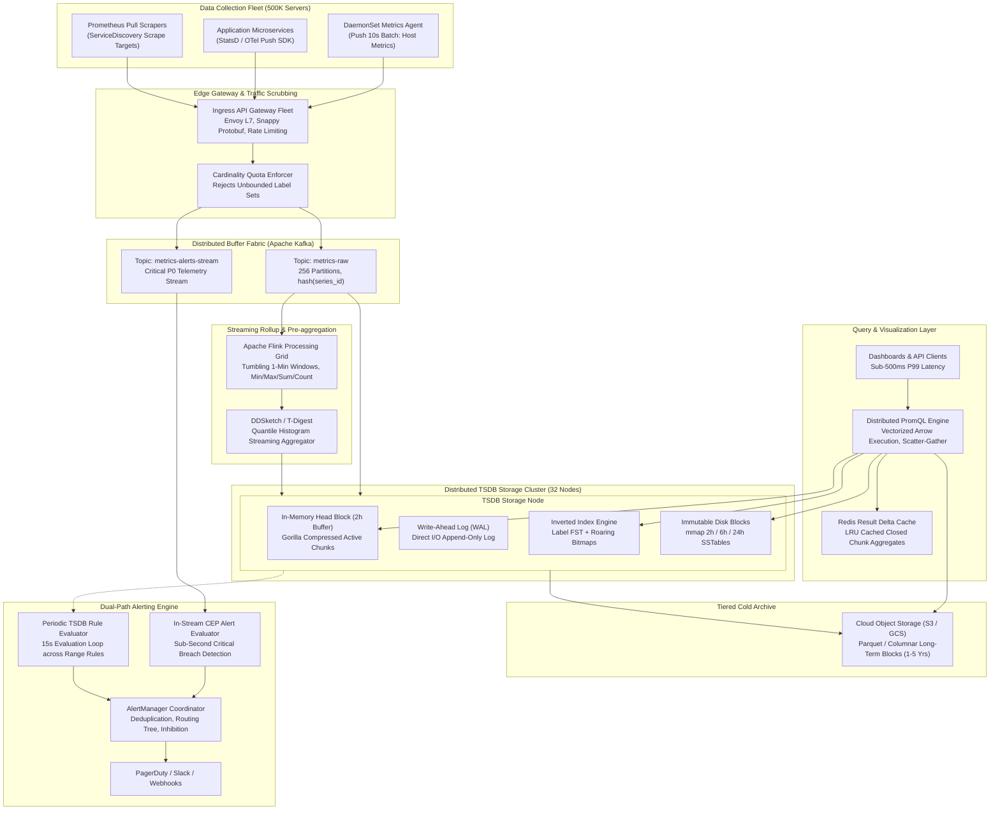
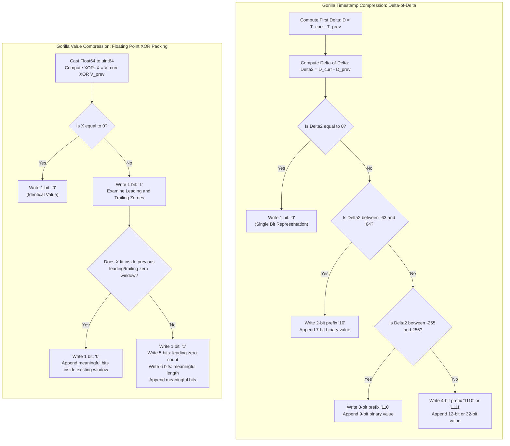
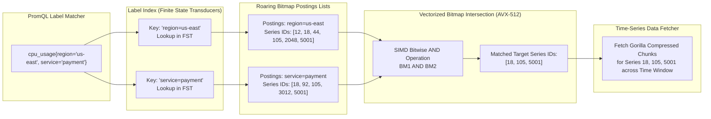
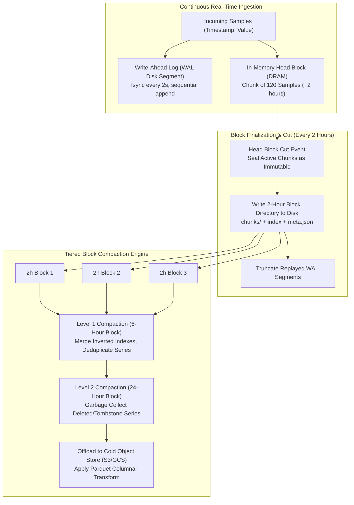
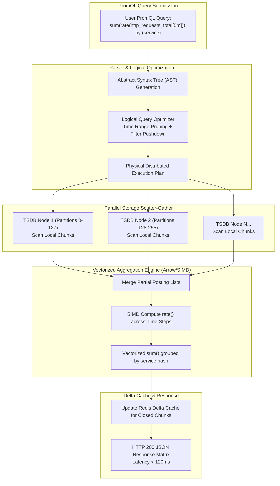
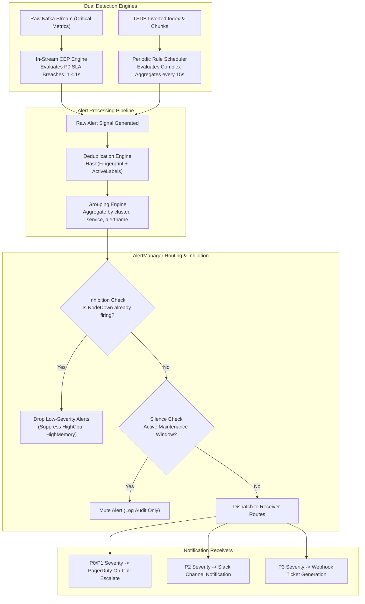

# Design Metrics Monitoring

> [!tip] Staff/Principal Deep Walkthrough & Production Engine
> - **Interview Playbook**: [`Volume 2 Chapter 5 Staff/Principal Walkthrough Playbook`](02-Interactive-Interview-Playbook.md)
> - **Production TSDB Engine**: [`tsdb_metrics_engine.py`](tsdb_metrics_engine.py) (Facebook Gorilla XOR Float64, Delta-of-Delta Timestamps, Inverted Tag Index, Write-Ahead Log, PromQL Range Queries, and Continuous Alerting)

> [!abstract] Executive Problem Statement
> Design an enterprise-grade, hyperscale **Metrics Monitoring and Observability Platform** (Datadog/M3/VictoriaMetrics/Prometheus class) capable of ingesting **50 Million data points per second** ($3\text{ Billion samples/minute}$) across **500 Million active time-series**, delivering sub-500ms dashboard queries across years of historical data, and executing sub-15s distributed alerting with zero alert drops and automated storm suppression.

---

## 1. Executive Architectural Blueprint & Paradigmatic Matrix

Modern infrastructure observability requires ingesting massive volumes of append-only numeric time-series data while serving real-time operational dashboards and critical alerting rules. The system decouples the **Index Path** (label search and postings lists) from the **Data Path** (compressed timestamp-value chunks).



### Paradigmatic Disambiguation Matrix

| Architectural Dimension | Prometheus (Native TSDB) | Uber M3DB | VictoriaMetrics | Thanos / Cortex | ClickHouse (OLAP TSDB) |
| :--- | :--- | :--- | :--- | :--- | :--- |
| **Primary Architecture** | Single-node pull engine with 2h head blocks | Clustered, distributed, quorum-based TSDB | Clustered shared-nothing with decoupled select/storage | Multi-tenant Prometheus sidecar / remote-write | Columnar relational analytical database |
| **Storage Engine** | Local WORM blocks with Gorilla-like chunks | Custom M3 TSZ compressed chunks + inverted index | MergeTree-derived TSDB with custom ZSTD encoding | Object Storage (S3/GCS) + in-memory cache | MergeTree engine family with LZ4/ZSTD |
| **High Cardinality** | Degrades above $10\text{M}$ active series (OOM risk) | Handles $100\text{M}+$ series via distributed index | Handles $100\text{M}+$ series with low memory footprint | Limited by underlying compactor/store-gateway | Exceptional; indexes Billions of unique rows |
| **Data Retention** | Short-term local disk ($15 - 30\text{ days}$) | Configurable multi-tier retention rules | Native long-term retention on NVMe/HDD/S3 | Long-term via cloud object store blocks | Infinite via partitioned TTL expressions |
| **Query Engine** | Native PromQL (single-node execution) | M3QL / PromQL via distributed coordinators | MetricsQL (superset of PromQL, vectorized) | Distributed PromQL scatter-gather engine | Full SQL with Vectorized SIMD execution |
| **Best Fit** | Kubernetes cluster-local scraping | Hyperscale metrics with strict SLAs | Cost-effective, high-throughput drop-in replacement | Long-term aggregation over multiple Prometheus pods | Complex multi-dimensional analytics & logs |

### Core Philosophical Tenets
1. **Decoupled Index and Data Paths**: Label search and series identification are handled via an in-memory **Inverted Index (FST + Roaring Bitmaps)**, while numeric metrics are stored in contiguous, append-only **Gorilla-compressed chunks**.
2. **Streaming Pre-Aggregation & Rollups**: Long-term queries scanning months of raw data choke I/O. Pre-aggregating raw 10-second data into 1-minute and 1-hour statistical rollups ($Min, Max, Sum, Count, Last$) and quantile sketches (DDSketch) collapses historical scan volumes by $98\%$.
3. **Hardware-Sympathetic Gorilla Compression**: Consecutive timestamps are compressed using **Delta-of-Delta** bit packing ($1.37\text{ bits/sample}$), and float64 values are compressed using **XOR bit-shifting** ($1.37\text{ bytes/sample}$ overall), allowing 2 hours of hot writes to reside entirely in DRAM.
4. **Dual-Path Alerting Pipeline**: Low-latency threshold alerts (e.g., node outage, error spike) are evaluated **in-stream** on the raw message bus with sub-second latency, while complex analytical range queries are evaluated asynchronously by the TSDB rule engine.

---

## 2. Hyperscale Scale & Capacity Math (Re-baselined)

### Operational Parameters
- **Global Server Fleet**: $500,000\text{ nodes}$ (bare-metal, VMs, and Kubernetes pods).
- **Metric Density**: $1,000\text{ metric series/node}$ (host, container cgroups, JVM/runtime, and app endpoints).
- **Total Active Time-Series**: $500,000 \times 1,000 = 500,000,000\text{ unique series}$ ($500\text{ Million}$).
- **Reporting Interval**: $10\text{ seconds}$ uniform cadence.
- **Traffic Spikes**: $2.5\times$ peak-to-average factor.

---

### Ingestion Throughput & Bandwidth Math

$$\text{Average Ingestion Rate} = \frac{500,000,000 \text{ series}}{10 \text{ seconds}} = 50,000,000 \text{ samples/sec} \quad (50\text{M data points/sec})$$

$$\text{Peak Ingestion Rate} = 50\text{M} \times 2.5 = 125,000,000 \text{ samples/sec} \quad (125\text{M data points/sec})$$

#### Ingress Network Bandwidth
Using Snappy-compressed Protocol Buffers (`WriteRequest` batching 1,000 samples per HTTP POST), the wire footprint averages $\approx 16\text{ bytes per sample}$:
$$\text{Average Ingress Bandwidth} = 50\text{M samples/sec} \times 16 \text{ bytes} = 800 \text{ MB/sec} = 6.4 \text{ Gbps}$$
$$\text{Peak Ingress Bandwidth} = 125\text{M samples/sec} \times 16 \text{ bytes} = 2,000 \text{ MB/sec} = 16.0 \text{ Gbps}$$

---

### Compression & Storage Capacity Math

#### Gorilla TSZ Compression Performance
Uncompressed, each sample consists of an 8-byte uint64 timestamp and an 8-byte float64 value ($16\text{ bytes total}$). Gorilla compression achieves an average of **$1.37\text{ bytes per sample}$** ($11.7\times$ compression factor):
$$\text{Storage Ingestion Rate} = 50\text{M samples/sec} \times 1.37 \text{ bytes} \approx 68.5 \text{ MB/sec} = 5.92 \text{ TB/day}$$

#### Multi-Tier Retention & Rollup Sizing
1. **Hot Tier (Raw 10s Resolution, 7 Days Retention)**:
   $$\text{Hot Raw Storage} = 5.92 \text{ TB/day} \times 7 \text{ days} = 41.44 \text{ TB NVMe}$$
2. **Warm Tier (1-Minute Downsampled Rollup, 30 Days Retention)**:
   - 10-second data downsampled to 1-minute reduces sample frequency by $6\times$.
   - Each rollup window stores 5 pre-computed metrics: $Min, Max, Sum, Count, Last$.
   - Effective volume factor: $\frac{5}{6} = 83.3\%$ of raw volume.
   - Compressed size: $5.92 \times 0.833 \approx 4.93 \text{ TB/day}$.
   $$\text{Warm Rollup Storage} = 4.93 \text{ TB/day} \times 30 \text{ days} = 147.9 \text{ TB SSD}$$
3. **Cold Tier (1-Hour Downsampled Rollup, 1 Year Retention)**:
   - Downsampled from 10-second raw to 1-hour ($360\times$ sample reduction).
   - Storing 5 pre-computed metrics yields $\frac{5}{360} \approx 1.39\%$ of raw volume:
   $$\text{Cold Daily Volume} = 5.92 \text{ TB/day} \times 0.0139 \approx 82.3 \text{ GB/day}$$
   $$\text{Cold Rollup Storage (1 Year)} = 82.3 \text{ GB/day} \times 365 \text{ days} = 30.04 \text{ TB S3/GCS}$$
4. **Archive Tier (1-Hour Rollup, 5 Years Total)**:
   $$\text{Archive Storage} = 82.3 \text{ GB/day} \times (5 \times 365) \approx 150 \text{ TB S3}$$

**Total Provisioned Storage**: $\approx 190\text{ TB}$ Local NVMe/SSD + $\approx 180\text{ TB}$ Cloud Object Storage.

---

### Inverted Index & DRAM Sizing

#### Inverted Index Footprint (500M Active Series)
- In-memory series metadata (Series ID, label string pointers, and Roaring Bitmap postings nodes) requires $\approx 100\text{ bytes per series}$:
  $$\text{Index Memory} = 500\text{M series} \times 100 \text{ bytes} \approx 50 \text{ GB DRAM}$$

#### 2-Hour Head Block Buffer (DRAM Working Set)
The TSDB holds 2 hours of unsealed Gorilla chunks in DRAM before cutting immutable disk blocks:
$$\text{Head Chunk Samples} = 50\text{M samples/sec} \times 7,200 \text{ seconds} = 360 \text{ Billion samples}$$
$$\text{Head Chunk DRAM} = 360\text{B samples} \times 1.37 \text{ bytes} \approx 493.2 \text{ GB DRAM}$$

#### Cluster Node Sizing (32 TSDB Storage Nodes)
- **Series per Node**: $500\text{M} / 32 \approx 15.625\text{ Million series/node}$.
- **RAM per Node**: $\frac{50\text{ GB Index} + 493.2\text{ GB Chunks}}{32} \approx 17.0\text{ GB working set}$.
  - Provisioning **64 GB to 128 GB ECC DDR5 RAM per node** leaves ample headroom for query working sets and OS Page Cache.
- **NVMe per Node**: $\frac{190\text{ TB}}{32} \approx 5.94\text{ TB}$ usable NVMe.
  - Provisioned as **2 $\times$ 3.84 TB Enterprise NVMe SSDs in RAID-0/JBOD**.

---

## 3. Storage & Kernel Micro-Architecture

### Gorilla Encoding Bit-Level Micro-Architecture

Facebook’s Gorilla paper (2015) forms the mathematical foundation of modern time-series compression by combining two distinct bit-level algorithms:



#### 1. Timestamp Compression: Delta-of-Delta Encoding
Timestamps for metrics arriving on fixed schedules exhibit nearly constant first deltas ($D_i = T_i - T_{i-1} \approx 10\text{s}$). The **delta-of-delta** ($D^2_i = D_i - D_{i-1}$) is frequently zero:

$$D_i = T_i - T_{i-1}, \quad D^2_i = D_i - D_{i-1}$$

| Value of Delta-of-Delta ($D^2$) | Control Bit Prefix | Data Bits Stored | Total Bits | Probability in Production |
| :--- | :--- | :--- | :--- | :--- |
| $D^2 = 0$ | `'0'` | $0$ | **$1\text{ bit}$** | $\approx 96\%$ |
| $-63 \le D^2 \le 64$ | `'10'` | $7\text{ bits}$ | **$9\text{ bits}$** | $\approx 2.5\%$ |
| $-255 \le D^2 \le 256$ | `'110'` | $9\text{ bits}$ | **$12\text{ bits}$** | $\approx 1.0\%$ |
| $-2047 \le D^2 \le 2048$ | `'1110'` | $12\text{ bits}$ | **$16\text{ bits}$** | $\approx 0.4\%$ |
| Overflow (arbitrary delta) | `'1111'` | $32\text{ bits}$ | **$36\text{ bits}$** | $\approx 0.1\%$ |

*Result: Average timestamp compression is $1.37\text{ bits per sample}$, down from 64 bits.*

---

#### 2. Value Compression: IEEE 754 Floating Point XOR Packing
Most metric values change minimally between consecutive readings (e.g., CPU fluctuates between $74.20$ and $74.25$). When two IEEE 754 float64 values are XORed together, the result exhibits substantial runs of leading and trailing zeroes:

```
Let V_prev = 74.20  -> IEEE 754: 0x40528CCCCCCCCCCD
Let V_curr = 74.25  -> IEEE 754: 0x4052900000000000
XOR Result (X)      ->           0x00001CCCCCCCCCCD
Leading Zeroes: 19 bits
Trailing Zeroes: 0 bits
Meaningful Bits: 45 bits
```

**Encoding Algorithm:**
1. Compute $X = V_{curr} \oplus V_{prev}$.
2. If $X == 0$: Write a single bit `'0'` (Value unchanged).
3. If $X \ne 0$: Write bit `'1'`.
   - **Case A (Reusing Zero Window)**: If the count of leading zeroes and trailing zeroes in $X$ is greater than or equal to the previous sample's window:
     - Write control bit `'0'`.
     - Write only the meaningful bits within the existing window size.
   - **Case B (New Zero Window)**:
     - Write control bit `'1'`.
     - Write $5\text{ bits}$: count of leading zeroes ($0 - 31$).
     - Write $6\text{ bits}$: length of meaningful bits ($1 - 64$).
     - Write the meaningful bits.

*Result: Over $50\%$ of XORs in production hit Case A or $X=0$, bringing average float64 storage down to $\approx 9.5\text{ bits per value}$ ($1.19\text{ bytes}$).*

---

### Inverted Index & Roaring Bitmap Query Execution

To query `cpu_usage{region="us-east", service="payment"}` among $500\text{M}$ series, the TSDB must identify the matching Series IDs in sub-millisecond time.



#### Roaring Bitmap Structural Hierarchy
A postings list is an ordered list of 32-bit Series IDs. Traditional integer arrays waste memory; naive bitsets consume 60MB per series even if empty. **Roaring Bitmaps** divide the 32-bit integer space into $2^{16} = 65,536$ chunks:
- **ArrayContainer ($< 4,096\text{ IDs}$)**: Stored as a sorted array of 16-bit unsigned integers. Memory: $2 \times N\text{ bytes}$.
- **BitmapContainer ($\ge 4,096\text{ IDs}$)**: Converted to a fixed $8\text{ KB}$ bitset ($1,024 \times 64\text{-bit words}$) representing 65,536 bits.
- **RunContainer (Contiguous Ranges)**: Encoded as pairs of `[start, length]`. Ideal for batch allocations.

**SIMD Accelerated Intersection**:
When evaluating multi-label queries (`L1 AND L2 AND L3`), the query engine utilizes **AVX-512 instructions (`_mm512_and_si512`)** to intersect two 8KB BitmapContainers in only **16 CPU cycles**, processing over **$40\text{ GB/sec}$ of postings data per core**.

---

### TSDB Head Block Lifecycle & Block Compaction Hierarchy

Prometheus TSDB and M3 organize storage into time-bucketed blocks:



#### The 2-Hour Block Anatomy
Every 2 hours, the in-memory Head Block is cut and persisted to disk as an immutable block directory:
```
/data/tsdb/01HXYZ1234567890ABCDEF/
├── meta.json         # Block metadata (ULID, minTime, maxTime, stats, compaction level)
├── tombstones        # Series deletion markers (interval set)
├── chunks/           # Immutable Gorilla-compressed data chunks
│   ├── 000001        # Contiguous chunk files (up to 512MB each)
├── index             # Memory-mapped binary inverted index (TOC, Symbols, Postings, Offsets)
```

#### Tiered Compaction Pyramid
As blocks age, background compactor threads merge small blocks into larger contiguous blocks:
1. **Level 1 Compaction**: Merges three 2-hour blocks into one **6-hour block**. Compactor resolves overlapping out-of-order writes and unifies the symbol table.
2. **Level 2 Compaction**: Merges four 6-hour blocks into one **24-hour block**. Purges tombstoned series and rewrites postings lists sequentially.
3. **Cold Object Store Offload**: 24-hour blocks are uploaded to cloud object storage (S3/GCS) and deleted from local NVMe after the 7-day retention threshold.

---

## 4. Streaming Rollup & Pre-Aggregation Pipeline

### The Historical Query Bottleneck
Executing a 90-day dashboard query over raw 10-second data across 10,000 servers requires scanning:
$$\text{Data Points Scanned} = 10,000 \text{ series} \times \left( \frac{90 \times 86,400}{10} \right) = 7,776,000,000 \text{ samples} \quad (7.77\text{B points})$$
Even at $50\text{M samples/sec}$ read throughput, the query stalls for $> 150\text{ seconds}$ and exhausts gigabytes of memory.

### The Streaming Rollup Architecture (Apache Flink)
A dedicated Flink streaming cluster tails `metrics-raw` in Kafka, computing tumbling-window rollups in memory:

```
[Raw Metrics Stream (10s)] 
         │
         ▼
[Flink Tumbling Window: 1 Minute]
   ├── Min, Max, Sum, Count, Last
   └── DDSketch (Quantile Histograms: p50, p90, p99)
         │
         ├──► Write to TSDB Warm Tier (30-day retention)
         │
         ▼
[Flink Tumbling Window: 1 Hour]
   ├── Min, Max, Sum, Count, Last
   └── DDSketch Merge
         │
         └──► Write to TSDB Cold Tier (1-year retention)
```

#### Mathematically Correct Aggregation with DDSketch
> [!warning] The "Average-of-Averages" Antipattern
> Storing only the average value in downsampled records makes subsequent aggregations mathematically invalid. A 1-hour window with 1,000 requests cannot be averaged with a window of 10 requests without weighting by count.

To preserve mathematical fidelity:
1. **Statistical Rollup Tuple**: Every rollup entry preserves:
   $$\text{Rollup} = \langle \min(x), \, \max(x), \, \sum x, \, N, \, x_{\text{last}} \rangle$$
   Any wider time window or multi-series aggregation computes:
   $$\text{True Average} = \frac{\sum_{i} \text{Sum}_i}{\sum_{i} N_i}$$
2. **Quantile Preservation via DDSketch**:
   - For latency histograms, raw percentiles cannot be averaged.
   - Flink maintains an in-memory **DDSketch** (a logarithmic-bucket histogram sketch).
   - DDSketch provides a **guaranteed relative error $\epsilon \le 1\%$** across arbitrary unions and time windows, requiring only $3.2\text{ KB}$ per series.

---

## 5. Vectorized PromQL Query Execution Engine

### Query Execution DAG



### Query Execution Optimizations
1. **Time-Range Block Pruning**:
   - Query requests `[T_start, T_end]`. The coordinator compares timestamps against `meta.json` ranges for each block, instantly discarding $95\%$ of on-disk directories without touching disk blocks.
2. **Vectorized SIMD Processing**:
   - Rather than iterating sample-by-sample through an interpreted AST loop, data points are unpacked into contiguous **Apache Arrow columnar arrays**.
   - Functions like `rate()` and `increase()` execute via SIMD vector subtraction on 8 float64 values simultaneously.
3. **Delta Result Caching**:
   - Dashboard users constantly refresh queries for `[now - 1h, now]`.
   - The query service caches the results for closed, immutable 2-hour blocks in Redis.
   - On refresh, the engine retrieves $80\%$ of the historical vector from Redis cache and only queries the live in-memory Head Block for the most recent unsealed samples, cutting TSDB CPU consumption by $70\%$.

---

## 6. Dual-Path Alerting Engine & AlertManager Micro-Architecture

Observability alerts are mission-critical: a single missed or delayed alert during a cascading outage can lead to prolonged downtime.



### Dual Detection Architecture
1. **Sub-Second Fast-Path (Flink In-Stream CEP)**:
   - For stateless, single-metric threshold violations (`service_status == 0`, `disk_free < 5%`).
   - Evaluated directly on the Kafka `metrics-alerts-stream` in Flink with zero TSDB query round-trips. Latency: $< 1.5\text{ seconds}$ end-to-end.
2. **Periodic Scheduled Path (PromQL Alert Scheduler)**:
   - For multi-dimensional, aggregated time-range rules (`sum(rate(errors[5m])) / sum(rate(requests[5m])) > 0.05`).
   - Evaluated every $15\text{ seconds}$ against the TSDB.
   - **Jittered Hash-Ring Scheduling**: Alert rules are distributed across a consistent hash ring with deterministic microsecond offsets to prevent thundering herd CPU spikes at minute boundaries.

---

### Alert Lifecycle State Machine
```
[Inactive] ──(Threshold Breached)──► [Pending]
   ▲                                     │
   │ (Condition Clears                   │ (Condition Sustained
   │  before 'for' duration)             │  for 'for' duration, e.g. 5m)
   │                                     ▼
[Resolved] ◄──(Metric Normalizes)── [Firing]
```

### AlertManager Storm Suppression Algorithms
During a major data center power failure, thousands of alerts fire simultaneously. Without intelligent aggregation, on-call engineers suffer from acute alert fatigue:
1. **Fingerprint Deduplication**:
   $$\text{Fingerprint} = \text{MurmurHash3}(\text{alertname} + \text{sorted}(\text{identifying\_labels}))$$
   Repeated firing cycles for the same fingerprint update existing active alerts rather than sending redundant pages.
2. **Dynamic Grouping**:
   - Rules specify `group_by: ['cluster', 'service']`.
   - AlertManager holds incoming alerts for `group_wait = 30s` to batch 500 individual container failures into a single cohesive notification: *"500 pods failing in cluster us-east-1"*.
3. **Inhibition Rules (Directed Acyclic Suppression Graph)**:
   - Suppresses lower-severity symptoms when the upstream root cause is already acknowledged.
   - Rule definition:
     ```yaml
     inhibit_rules:
       - source_match:
           alertname: 'NodeNetworkDown'
         target_match:
           severity: 'warning'
         equal: ['node', 'datacenter']
     ```
     If `NodeNetworkDown` fires, all `ContainerConnectionTimeout` and `HighDiskIOLatency` alerts for that node are immediately muted.

---

## 7. Cardinality Explosion & Multi-Tenant Isolation

### The High-Cardinality Threat
A single engineer deploying code that adds `user_id` or `uuid` as a metric label causes a catastrophic **Cardinality Explosion**:
$$500,000 \text{ requests/sec} \implies 500,000 \text{ new unique time-series every second}$$
The TSDB Inverted Index exhausts physical DRAM in minutes, inducing out-of-memory kernel panics and cluster-wide crash loops.

### Defense-in-Depth Cardinality Shield

```
[Ingress HTTP Post] 
         │
         ▼
[Enforce Label Whitelist & Schema Policy]
   ├── Max Labels per Metric: 30
   ├── Max Label Key Length: 64 bytes
   └── Max Label Value Length: 256 bytes
         │
         ▼
[Sliding-Window HyperLogLog Cardinality Tracker]
   ├── Track distinct series per metric name
   └── If SeriesCount(Metric) > 100,000:
         │
         ├──► ACTION: Drop offending high-cardinality label (relabel to "dropped")
         ├──► ACTION: Quarantine metric to Dead-Letter Topic
         └──► ACTION: Trigger Prometheus Alert to Service Owner
```

---

## 8. Schema & Storage Data Structures

### Inverted Index TOC Binary File Layout (`index`)
The memory-mapped index file uses a fixed binary table-of-contents layout:

```
+-------------------------------------------------------------------------+
|                        TSDB Index File Layout                           |
+-------------------------------------------------------------------------+
| Magic Number (4B)       : 0xBAAA7EE5                                    |
| Version (1B)            : 0x02                                          |
+-------------------------------------------------------------------------+
| Symbol Table Section    : Length-prefixed deduplicated strings          |
|                           (e.g., "cpu_usage", "us-east-1", "production")|
+-------------------------------------------------------------------------+
| Postings Lists Section  : Roaring Bitmap bitstreams for each label pair |
|                           Key: SymbolID_Name + SymbolID_Value           |
|                           Value: Roaring Bitmap of uint32 Series IDs    |
+-------------------------------------------------------------------------+
| Postings Offset Table   : Hash table mapping Symbol pairs to file offset|
+-------------------------------------------------------------------------+
| Series Records Section  : Series ID -> Label Symbol Array + Chunk Meta  |
|                           Chunk Reference: MinTime, MaxTime, FileOffset |
+-------------------------------------------------------------------------+
| Table of Contents (TOC) : 64-bit pointers to each section above         |
+-------------------------------------------------------------------------+
```

---

## 9. Staff-Level Interview Defense & Battle-Tested Q&A

### Hard Questions & Battle-Tested Answers

#### Q1: Why not use a standard relational DB (PostgreSQL) or general NoSQL (Cassandra) for metrics?
> **Staff Answer**: Relational DBs use B-Trees, which suffer from random I/O write amplification and page splits under 50M writes/second. They store rows uncompressed ($50-100\text{ bytes per point}$ vs Gorilla’s $1.37\text{ bytes}$), inflating our storage bill by $50\times$. Cassandra handles high append throughput but lacks time-series-sympathetic compression (delta-of-delta) and requires full table scans or secondary index lookups for multi-dimensional label intersections, resulting in high latency for ad-hoc aggregations.

#### Q2: What are the exact failure modes when a TSDB node crashes during ingestion?
> **Staff Answer**:
> 1. **Data in DRAM (Head Block)**: Protected by the sequential append-only Write-Ahead Log (WAL). The WAL records incoming samples before acknowledging the write.
> 2. **Node Recovery**: On reboot, the node replays the WAL from the last checkpoint to reconstruct the in-memory Gorilla chunks and postings lists.
> 3. **Kafka Safety Net**: Ingestion is buffered in Kafka with 7-day retention. If a node suffers catastrophic SSD loss, a replacement node is provisioned and resumes consuming from the failed node's Kafka partition offset, rebuilding state without missing a single sample ($RPO = 0$).

#### Q3: How do you handle clock skew and late-arriving samples in TSDB blocks?
> **Staff Answer**: All agents run NTP synchronization; samples with future timestamps $> 15\text{ minutes}$ are rejected at ingress. Samples arriving within the current 2-hour Head Block window are appended directly to the open Gorilla chunks using out-of-order linked lists. Samples arriving older than 2 hours (after the block has been cut and sealed to disk) bypass the immutable block and are appended to a dedicated **Out-of-Order (OOO) Head Buffer**. When the next compaction cycle executes, the compactor merges the OOO block into the historical block, re-sorting samples and re-compressing timestamps seamlessly.

#### Q4: Why is Gorilla compression incompatible with random out-of-order writes?
> **Staff Answer**: Gorilla compression is a **stateful bitstream**. Each sample’s timestamp is bit-packed relative to the previous sample's delta ($D^2 = (T_i - T_{i-1}) - (T_{i-1} - T_{i-2})$), and each value is XORed with the preceding value ($V_i \oplus V_{i-1}$). Inserting an out-of-order sample at time $T_{k}$ ($T_{i-1} < T_k < T_i$) invalidates all subsequent bit offsets, leading zeroes counts, and deltas for the remainder of the chunk. Therefore, Gorilla chunks must be strictly monotonically appended in time order. Out-of-order writes must be buffered in a separate array and merged during block compaction.

---

## 10. Operational Runbook & Production Checklist

### Recommended TSDB Storage Node Kernel Parameters (`/etc/sysctl.conf`)
```ini
# Memory Virtualization & Page Cache
vm.max_map_count = 1048576               # Prevent mmap exhaustion on thousands of block files
vm.dirty_background_ratio = 5            # Asynchronous flush dirty pages early
vm.dirty_ratio = 10                       # Cap dirty pages to avoid synchronous write stalls
vm.swappiness = 1                         # Avoid swapping TSDB in-memory chunks to swap

# Network Tuning for High-Throughput HTTP Ingestion
net.core.somaxconn = 65535
net.ipv4.tcp_max_syn_backlog = 65535
net.ipv4.tcp_rmem = 4096 87380 16777216  # 16MB TCP read buffer
net.ipv4.tcp_wmem = 4096 65536 16777216  # 16MB TCP write buffer
net.core.netdev_max_backlog = 250000
```

### Production Alert Rules Deployment Checklist
- [ ] Every alert must specify a non-zero `for:` duration (minimum `2m` to `5m`) to prevent transient metric spikes from triggering false alarms.
- [ ] All high-severity (`P0`/`P1`) alerts must have an automated **Inhibition Rule** mapped to their root cause.
- [ ] Every alert must define actionable runbook links in its annotations (`runbook_url`).
- [ ] High-cardinality label variables (e.g. `{{ $labels.user_id }}`) are strictly banned from alert titles to prevent notification channel rate-limiting.

---

## Related Topics
- [`01-Architectural-Blueprint.md`](01-Architectural-Blueprint.md) - The Kafka ingestion backbone buffering raw metric streams.
- [`01-Architectural-Blueprint.md`](01-Architectural-Blueprint.md) - High-throughput alert dispatching infrastructure.
- [`01-Architectural-Blueprint.md`](01-Architectural-Blueprint.md) - Edge ingress shielding and cardinality quota enforcement.
- [`01-Architectural-Blueprint.md`](01-Architectural-Blueprint.md) - Sharding time-series streams evenly across TSDB nodes.
- [`01-Architectural-Blueprint.md`](01-Architectural-Blueprint.md) - Metadata indexing and schema storage architectures.
