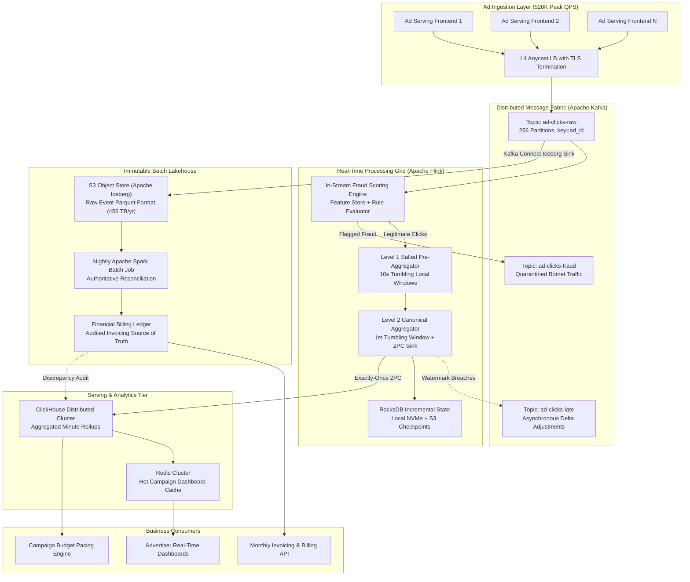
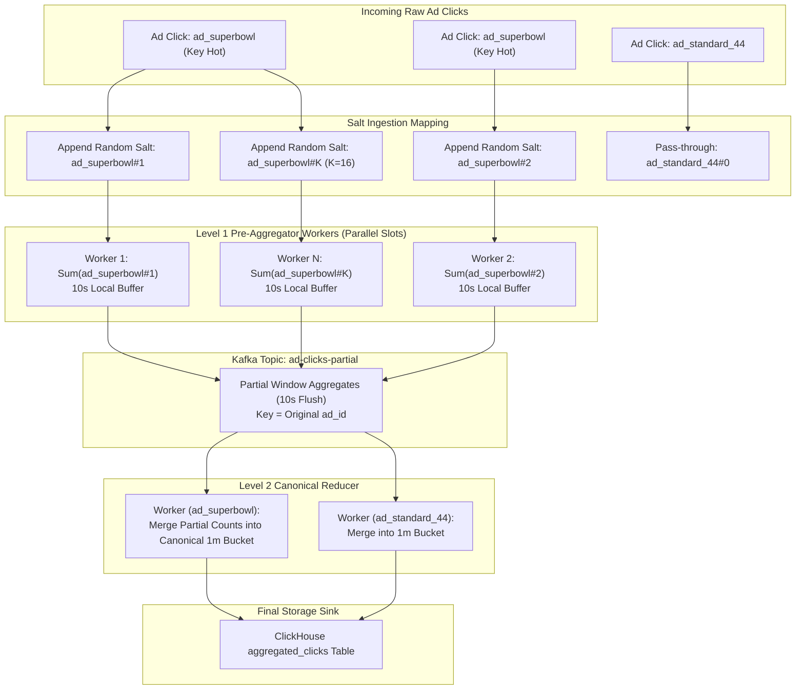
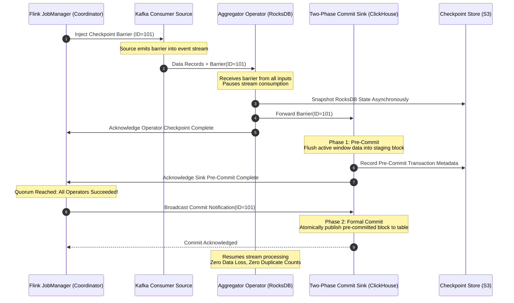
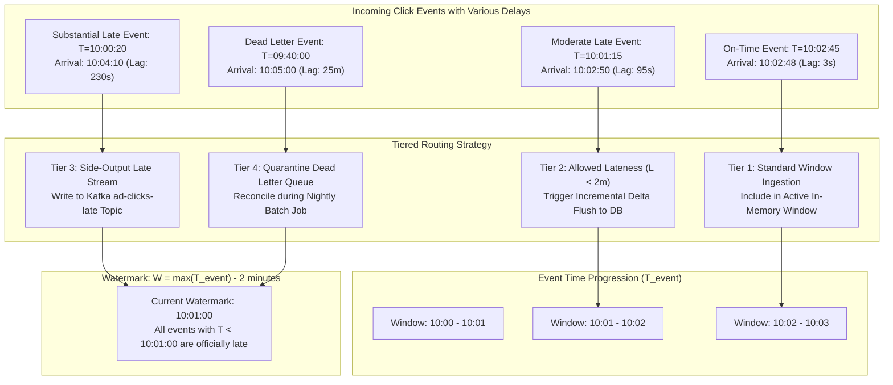
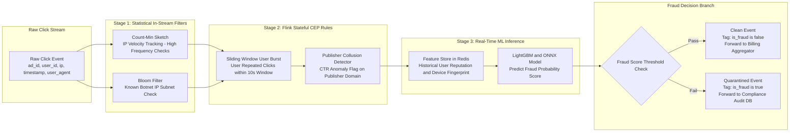
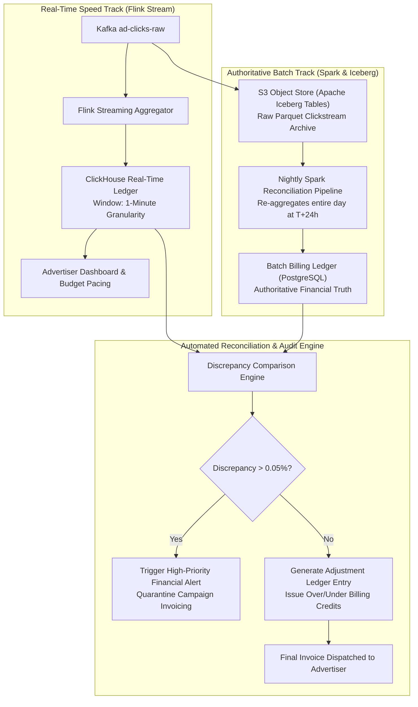

# Design Ad Click Event Aggregation

> [!tip] Staff/Principal Deep Walkthrough & Production Engine
> - **Interview Playbook**: [`Volume 2 Chapter 6 Staff/Principal Walkthrough Playbook`](02-Interactive-Interview-Playbook.md)
> - **Production Stream Aggregator Engine**: [`ad_aggregation_engine.py`](ad_aggregation_engine.py) (Event-Time Tumbling Windows, Watermark Progression, In-Stream Fraud Detection, Key Salting Hotspot Mitigation, and Idempotent 2PC OLAP Sink)

> [!abstract] Executive Problem Statement
> Design an enterprise-grade, hyperscale **Ad Click Event Aggregation and Real-Time Analytics Platform** (Google Ads / Meta Ads class) capable of ingesting **10 Billion ad click events per day** (over **520,000 clicks/sec peak throughput**), aggregating multi-dimensional metrics across millions of campaigns with sub-3-second latency, executing in-stream click fraud filtering, and guaranteeing financial-grade **Exactly-Once Semantics (EOS)** with automated nightly ledger reconciliation.

---

## 1. Executive Architectural Blueprint & Paradigmatic Matrix

An ad click aggregation platform operates under dual constraints: **real-time responsiveness** for advertiser budget pacing and dashboards, and **absolute financial accuracy** for monthly billing. The architecture combines a low-latency streaming pipeline with an authoritative, immutable batch lakehouse.



### Paradigmatic Disambiguation Matrix

| Architectural Dimension | Traditional Lambda Architecture | Pure Kappa Architecture (Streaming Only) | Delta / Iceberg Unified Architecture | Our Staff-Level Production Design |
| :--- | :--- | :--- | :--- | :--- |
| **Pipeline Topology** | Distinct codebases for Speed (Storm/Flink) and Batch (MapReduce/Spark) | Single streaming pipeline (Flink/Kafka Streams) for both real-time and replay | Unified streaming read/write directly against ACID lakehouse tables | **Decoupled Dual-Ledger Hybrid**: Flink stream for pacing/dashboards + Spark on Iceberg for billing truth |
| **Source of Truth** | Batch layer rewrites speed layer every 24 hours | Kafka log retained indefinitely (or compact log) | Iceberg/Delta log with snapshot isolation | **S3 Apache Iceberg Raw Clicks Table** (Immutable audit ledger) |
| **Late Data Handling** | Naturally reconciled during daily batch re-run | Complex watermark watermarking & streaming updates | Append commits with time-travel queries | **3-Tier Watermark System**: In-window update $\to$ Side-output topic $\to$ Nightly batch clawback |
| **Failure Recovery** | Re-run batch job from HDFS/S3 logs | Replay Kafka from earliest available offset | Re-read table snapshot metadata | RocksDB incremental checkpoints + S3 Iceberg historical backfill |
| **Financial Billing SLA** | High confidence; slow invoice generation | Risky; streaming bugs or state corruption pollute billing | High confidence; higher query latency for real-time pacing | **Billing-grade correctness**: Zero duplicate billing via Two-Phase Commit sinks |

### Core Philosophical Tenets
1. **Financial Invariance Principle**: Real-time aggregation powers **operational decisions** (dashboard metrics, campaign budget pacing, auto-bidding adjustments), where a $0.01\%$ transient latency skew is acceptable. Invoicing and advertiser billing are governed by the **authoritative batch reconciliation ledger**, where $RPO = 0$ and financial accuracy must be exact ($0.00\%$ discrepancy).
2. **Scatter-Gather Salt Sharding**: Single-key partition bottlenecks (viral Super Bowl ads or breaking flash sales) overwhelm standard streaming partitions. Salting hot keys with random suffixes ($Key = ad\_id + "\#" + rand(1..K)$) distributes the load across parallel workers before local pre-aggregation.
3. **Event-Time Bounded Watermarks**: Network lag and mobile offline buffering mean click events frequently arrive out of chronological order. Processing strictly by **Event Time** ($T_{\text{event}}$) using bounded out-of-orderness watermarks ensures mathematical correctness independent of network transport latency.
4. **End-to-End Exactly-Once Processing (EOS)**: Combining Kafka idempotent producers (`acks=all`), Flink Chandy-Lamport state checkpointing, and **Two-Phase Commit (2PC) sinks** guarantees that no click is double-counted or dropped during cluster rebalances or node failures.

---

## 2. Hyperscale Scale & Capacity Math (Re-baselined)

### Operational Parameters
- **Daily Ingestion Volume**: $10\text{ Billion ad clicks/day}$ (Meta/Google global scale).
- **Average Payload Size**: $500\text{ bytes}$ uncompressed (ad ID, campaign ID, advertiser ID, user fingerprint, IP, geo, device metadata, bid cost in microcents, fraud markers).
- **Peak-to-Average Traffic Factor**: $4.5\times$ (driven by major global events, sporting finals, and holiday shopping peaks).
- **Active Advertising Universe**: $10\text{ Million active ad campaigns}$ across $2\text{ Million advertisers}$.
- **Downstream Real-Time Latency SLA**: Aggregated counts published to OLAP and dashboards in $< 3\text{ seconds}$ from physical user tap.

---

### Ingestion Throughput & Bandwidth Math

$$\text{Average Ingress QPS} = \frac{10 \times 10^9 \text{ clicks}}{86,400 \text{ seconds}} \approx 115,740 \text{ clicks/sec} \approx 116\text{K clicks/sec}$$

$$\text{Peak Ingress QPS} = 115,740 \times 4.5 \approx 520,830 \text{ clicks/sec} \approx 520\text{K clicks/sec}$$

#### Ingress Network Bandwidth
$$\text{Average Ingress Bandwidth} = 116\text{K clicks/sec} \times 500 \text{ bytes} = 58 \text{ MB/sec} = 464 \text{ Mbps}$$
$$\text{Peak Ingress Bandwidth} = 520\text{K clicks/sec} \times 500 \text{ bytes} = 260 \text{ MB/sec} = 2.08 \text{ Gbps}$$

---

### Storage Capacity Calculations

#### 1. Raw Clickstream Lakehouse (Cold S3 Tier, 100% Retention)
Raw clicks are ingested into Kafka and streamed via Kafka Connect directly to S3 in **Apache Iceberg Parquet format** with Zstandard compression ($4:1$ compression ratio):
$$\text{Uncompressed Raw Volume} = 10 \times 10^9 \times 500 \text{ bytes} = 5 \text{ TB/day}$$
$$\text{Compressed Raw Volume} = \frac{5 \text{ TB}}{4} = 1.25 \text{ TB/day} \implies 456.25 \text{ TB/year}$$

#### 2. Real-Time Aggregated OLAP Storage (ClickHouse Hot Tier, 90 Days)
- Aggregation granularities: 1-minute tumbling windows grouped by `(ad_id, minute_timestamp, country_code, device_type)`.
- Most ads have sparse clicks; on average, $150\text{ Million distinct rollup rows}$ are produced daily.
- ClickHouse columnar storage with LZ4/DoubleDelta compression requires $\approx 60\text{ bytes per aggregated row}$:
  $$\text{Aggregated Daily Storage} = 150\text{M rows} \times 60 \text{ bytes} \approx 9 \text{ GB/day}$$
  $$\text{90-Day Hot OLAP Storage} = 9 \text{ GB/day} \times 90 \text{ days} = 810 \text{ GB SSD}$$

---

### Compute & Stream Processing Grid Provisioning

#### Kafka Ingestion Fabric (16 Brokers)
- **Partitions**: Provision **256 partitions** for `ad-clicks-raw` sharded by `murmur3(ad_id)`.
- **Throughput per Partition**:
  $$\text{Peak Rate per Partition} = \frac{520,000 \text{ msgs/sec}}{256} \approx 2,031 \text{ msgs/sec} \quad (1.01 \text{ MB/sec})$$
  Well within Kafka’s single-partition throughput envelope ($> 10\text{ MB/sec}$).
- **Cluster Sizing**: 16 broker nodes across 3 Availability Zones with Replication Factor $RF = 3$ and `min.insync.replicas = 2`.

#### Apache Flink Stream Processing Grid (64 TaskManagers)
- **Task Slots**: 64 TaskManager nodes $\times$ 8 vCPU slots = **512 task slots**.
- **State Backend**: **Embedded RocksDB** on local NVMe SSDs.
  - Active in-memory state: $10\text{M campaigns} \times 5\text{ active tumbling windows} \times 128\text{ bytes} \approx 6.4\text{ GB}$.
  - RocksDB off-heap cache and MemTables require $16\text{ GB RAM per TaskManager}$.
  - Checkpoint size per node: $< 500\text{ MB}$, flushing asynchronously to S3 every $30\text{ seconds}$.

---

## 3. Storage & Kernel Micro-Architecture

### Two-Tier Salted Pre-Aggregation for Viral Hot Ads

Standard partition hashing ($Hash(ad\_id) \pmod N$) produces severe processing hot spots when high-profile ads (e.g., Super Bowl campaigns, celebrity brand launches) generate tens of thousands of clicks per second. A single Flink worker assigned that partition experiences CPU saturation, backpressure, and memory exhaustion.



#### Salt Sharding Algorithm
1. **Dynamic Hot Key Detection**:
   - The ingestion proxy tracks key frequency using an in-memory **Space-Saving Heavy Hitters** sketch.
   - Any `ad_id` exceeding $5,000\text{ clicks/sec}$ is dynamically flagged as "HOT".
2. **Salt Injection**:
   - For standard keys: $Key = ad\_id$.
   - For hot keys: $Key = ad\_id + "\#" + \text{random}(1, K)$ (where $K = 16$).
3. **Level 1 Pre-Aggregation (10-second Tumbling Window)**:
   - Clicks are distributed uniformly across 16 different Flink worker task slots.
   - Each worker tallies counts locally in an in-memory window, reducing event rate by up to $16\times$.
4. **Level 2 Canonical Reduction**:
   - Every 10 seconds, Level 1 workers emit partial aggregates to an internal shuffle stage keyed strictly by the un-salted `ad_id`.
   - The Level 2 worker sums the 16 partial counts and flushes the definitive 1-minute rollup to ClickHouse.

---

### Flink Chandy-Lamport Checkpointing & Two-Phase Commit Sink

To guarantee that advertiser accounts are never charged twice and that click counts are never lost during worker failures, the pipeline implements the **Chandy-Lamport distributed snapshotting algorithm** coupled with a **Two-Phase Commit (2PC) Sink**:



#### Protocol Phases
1. **Barrier Injection**:
   - JobManager periodically injects a numbered **Checkpoint Barrier** into Kafka source channels.
   - Barriers flow inline with application data records without stopping stream flow.
2. **State Snapshotting**:
   - When an operator receives Barrier $N$ from all input channels, it pauses processing on those channels, takes an asynchronous copy-on-write snapshot of its RocksDB state, uploads the delta to S3, and forwards the barrier downstream.
3. **Two-Phase Commit Sink**:
   - **Phase 1 (Pre-Commit)**: The sink operator opens a transaction in the target database (e.g., writing a temporary partition in ClickHouse or staging block in PostgreSQL). It writes the window aggregates and persists the transaction ID in the checkpoint state.
   - **Phase 2 (Commit)**: Once JobManager confirms that *all* operators across the entire DAG have successfully checkpointed, it broadcasts a formal `Commit` command. The sink marks the staged data as committed and visible to queries.
   - **Failure Recovery**: If any node crashes before the commit notification, the transaction is aborted via `abort()` and rolled back. The cluster restores the last verified checkpoint from S3 and replays Kafka offsets, achieving true **end-to-end exactly-once semantics**.

---

## 4. Watermark Dynamics & Late Event Handling

### Event Time vs Processing Time vs Ingestion Time
- **Event Time ($T_{\text{event}}$)**: The physical instant the user clicked the ad on their device (recorded in UTC).
- **Ingestion Time ($T_{\text{ingest}}$)**: The timestamp when Kafka receives and appends the message.
- **Processing Time ($T_{\text{proc}}$)**: The local system clock of the Flink TaskManager evaluating the record.

Because mobile devices experience intermittent connectivity (e.g., subway rides, cellular handoffs), clicks may arrive seconds, minutes, or hours after occurring. Aggregations **must strictly bin events by Event Time**.



#### Watermark Definition
A Bounded-Out-Of-Orderness Watermark generator emits monotonic watermarks:
$$W(t) = \max_{e \in \text{Observed}} (e.T_{\text{event}}) - \Delta_{\text{allowed\_lateness}}$$
Where $\Delta_{\text{allowed\_lateness}} = 2\text{ minutes}$. When $W(t) \ge T_{\text{window\_end}}$, the 1-minute window closes and emits its initial aggregation to ClickHouse.

#### Three-Tier Late Event Handling Strategy
1. **Tier 1: On-Time Events ($T_{\text{event}} \ge W(t)$)**:
   - Appended directly to the in-memory window state. Flushed when the watermark crosses the window boundary.
2. **Tier 2: Allowed Lateness Window ($W(t) - 2\text{m} \le T_{\text{event}} < W(t)$)**:
   - Handled via Flink `allowedLateness(Time.minutes(2))`.
   - The window state is retained in RocksDB. When a late event arrives, the operator re-evaluates the aggregate and issues an **incremental upsert delta** (`click_count = click_count + 1`) to ClickHouse.
3. **Tier 3: Side-Output Stream ($T_{\text{event}} < W(t) - 2\text{m}$)**:
   - The window has been evicted from RocksDB state.
   - The record is emitted to a Flink **Side Output Tag** and published to the Kafka topic `ad-clicks-late`. A downstream async worker updates the historical OLAP table.
4. **Tier 4: Extreme Outliers ($> 15\text{ minutes late}$)**:
   - Dropped from the real-time speed track and written to S3 DLQ.
   - Automatically ingested and aggregated by the **Nightly Spark Batch Reconciliation Job**.

---

## 5. In-Stream Click Fraud Detection Pipeline

Click fraud (botnets, competitor click-spamming, publisher click-farms) accounts for $15\% - 30\%$ of all raw clicks across global ad networks. Billing advertisers for fraudulent clicks results in severe trust erosion and regulatory clawbacks.



### Multi-Stage Fraud Evaluation Architecture
1. **Stage 1: Statistical In-Stream Scrubbing**:
   - **Bloom Filter**: Checks client IP against a distributed in-memory Bloom filter of known datacenter proxies (AWS/GCP egress IPs, Tor exit nodes). Lookups take $< 100\text{ns}$.
   - **Count-Min Sketch**: Tracks IP click velocity in real-time. If an IP generates $> 50\text{ clicks/minute}$ across any set of ads, subsequent clicks are marked as velocity-abusive.
2. **Stage 2: Stateful Complex Event Processing (CEP)**:
   - Detects burst patterns using Flink CEP sliding windows: *Same `user_id` or `device_fingerprint` clicking the same `ad_id` more than 3 times within 10 seconds*.
   - Publisher CTR anomalies: If a publisher domain exhibits a Click-Through Rate (CTR) $> 30\%$ with average dwell time $< 500\text{ms}$, the traffic is flagged as publisher collusion.
3. **Stage 3: Real-Time ML Inference**:
   - For ambiguous events, the pipeline fetches historical behavior features from a low-latency **Redis Feature Store** (user account age, historical conversion rate, mouse movement telemetry entropy).
   - An embedded **ONNX / LightGBM model** scores the event in $< 2\text{ms}$.
   - If $P(\text{fraud}) > 0.85$: The event is tagged with `is_fraud = true` and routed to the quarantine topic `ad-clicks-fraud`. Fraudulent clicks are **excluded from billing aggregations**, but retained in compliance storage for advertiser transparency reports.

---

## 6. Dual-Ledger Financial Reconciliation Engine



### Why Streaming Alone Cannot Serve as Financial Truth
1. **Network Partitions & Offline Mobile Clients**: Clicks occurring at 23:59 on day 1 may arrive at 00:15 on day 2. A real-time stream that closes the daily billing window at midnight misses these clicks or attributes them to the wrong billing cycle.
2. **Post-Hoc Fraud Clawbacks**: Sophisticated botnets are often identified hours or days after the event via external fraud intelligence feeds. The system must retroactively invalidate fraudulent clicks and credit advertiser balances.
3. **Operational Failures**: A temporary Flink crash or database connection drop might drop records from the real-time cache.

### The Nightly Reconciliation Protocol
- Every night at $T+24\text{ hours}$, an **Apache Spark batch job** reads the raw click records from S3 Iceberg tables for the previous calendar day.
- Spark re-runs the full aggregation, joins against the updated global fraud database, and writes to `batch_billing_ledger`.
- The **Reconciliation Engine** executes an automated diff:
  $$\Delta = \frac{|Count_{\text{realtime}} - Count_{\text{batch}}|}{Count_{\text{batch}}}$$
  - If $\Delta \le 0.05\%$: The discrepancy is considered normal network jitter. The batch ledger automatically posts a micro-adjustment credit/debit to the advertiser account balance.
  - If $\Delta > 0.05\%$: A high-priority P1 alert is paged to the data engineering team, and automated invoice dispatch for that campaign is held pending audit.

---

## 7. Schema & OLAP Storage Design

### Raw Clickstream Protocol Buffers Definition (`click.proto`)
```protobuf
syntax = "proto3";
package ads.telemetry;

message ClickEvent {
    string event_id = 1;              // UUIDv7 unique event ID
    string ad_id = 2;                 // Target Ad Identifier
    string campaign_id = 3;           // Parent Campaign ID
    string advertiser_id = 4;         // Billing Advertiser ID
    int64 event_timestamp_ms = 5;     // Client Click Event Time (UTC ms)
    int64 ingest_timestamp_ms = 6;    // Kafka Ingestion Time (UTC ms)
    
    // User & Device Dimensions
    string user_id = 7;               // Hashed User Fingerprint
    string ip_address = 8;            // IPv4 or IPv6 string
    string country_code = 9;          // ISO 2-letter country code
    string device_type = 10;          // mobile, desktop, tablet, ctv
    string os = 11;                   // iOS, Android, Windows, macOS
    string user_agent = 12;
    
    // Financial & Quality Attributes
    int64 bid_price_microcents = 13;  // Cost in 1/1,000,000 cent ($0.01 = 10,000 microcents)
    bool is_fraud = 14;               // In-stream fraud classifier tag
    string fraud_reason = 15;         // Reason code (e.g., IP_VELOCITY_BREACH)
}
```

---

### ClickHouse Distributed Real-Time Aggregated Schema
ClickHouse serves as the low-latency OLAP database for real-time advertiser dashboards:

```sql
-- Local table on each ClickHouse shard
CREATE TABLE ad_clicks_aggregated_local (
    ad_id               String,
    window_start        DateTime,
    country_code        LowCardinality(String),
    device_type         LowCardinality(String),
    click_count         UInt64,
    gross_spend_microcents UInt64,
    fraud_click_count   UInt64,
    updated_at          DateTime DEFAULT now()
) ENGINE = SummingMergeTree((click_count, gross_spend_microcents, fraud_click_count))
PARTITION BY toYYYYMM(window_start)
PRIMARY KEY (ad_id, window_start)
ORDER BY (ad_id, window_start, country_code, device_type)
SETTINGS index_granularity = 8192;

-- Distributed view for multi-node query scatter-gather
CREATE TABLE ad_clicks_aggregated_distributed ON CLUSTER ad_cluster AS ad_clicks_aggregated_local
ENGINE = Distributed(ad_cluster, default, ad_clicks_aggregated_local, cityHash64(ad_id));
```

> [!tip] SummingMergeTree Efficiency
> ClickHouse’s `SummingMergeTree` engine automatically sums numeric columns (`click_count`, `gross_spend_microcents`) in the background across rows sharing the same primary key. Late-arriving delta records from Flink are simply appended; ClickHouse merges them automatically during background compactions, eliminating expensive read-modify-write cycles.

---

## 8. Staff-Level Interview Defense & Hard Q&A

### Hard Questions & Battle-Tested Answers

#### Q1: Why not use a database like Cassandra or MongoDB directly without ClickHouse?
> **Staff Answer**: Cassandra handles fast key-value point writes, but computing multi-dimensional range aggregations (e.g., *"give me total clicks for campaign $C$ in the US on mobile devices across the last 3 hours"*) requires full partition scans or client-side joins across millions of rows, leading to high latency. MongoDB suffers from high B-Tree lock contention and uncompressed JSON bloat. **ClickHouse is a vectorized columnar OLAP engine**: its SIMD execution engines scan hundreds of millions of rows per second per CPU core, while `SummingMergeTree` eliminates read-modify-write locks by aggregating row deltas asynchronously on disk.

#### Q2: What happens if a Flink worker crashes midway through a 1-minute window?
> **Staff Answer**: The failure is handled transparently via Flink's **Chandy-Lamport checkpointing mechanism**:
> 1. In-memory window counters are backed by an embedded RocksDB instance that continuously persists state to local NVMe SSDs.
> 2. Every 30 seconds, Flink uploads an incremental checkpoint of RocksDB state and active Kafka offsets to S3.
> 3. When a worker crashes, the Flink JobManager restarts the task on an available TaskManager, rehydrates state from the latest S3 checkpoint, and replays Kafka offsets from that exact checkpoint boundary.
> 4. Because the ClickHouse sink implements Two-Phase Commit (2PC), any partial uncommitted transactions from the failed worker are discarded via `abort()`, preventing double counts and ensuring strict exactly-once semantics ($RPO = 0$).

#### Q3: Why is salting the key necessary if Kafka already partitions by `hash(ad_id)`?
> **Staff Answer**: That is precisely the root cause of the problem! Standard Kafka partitioning guarantees that all clicks for `ad_id = superbowl_ad` map to **a single Kafka partition and a single Flink worker thread**. If that ad receives 50,000 clicks/second, that single worker core chokes, triggering Kafka consumer lag and upstream backpressure across the entire cluster. By appending a randomized salt ($Key = ad\_id + "\#" + rand(1..16)$), we forcefully fan out the single logical key across 16 different Kafka partitions and 16 parallel Flink worker cores. Each worker aggregates locally for 10 seconds before a secondary stage merges the 16 partial counts, eliminating the CPU bottleneck entirely.

#### Q4: How do you handle credit clawbacks if click fraud is identified 48 hours later?
> **Staff Answer**: We never mutate closed real-time aggregation tables directly. Instead, our system follows an **immutable accounting ledger model**:
> 1. When the fraud detection team flags a retrospective botnet, an automated Spark job queries the raw S3 Iceberg table for all click IDs matching the fraudulent signatures.
> 2. Spark computes the exact financial overcharge per advertiser.
> 3. The billing service posts an **Adjustment Ledger Entry** (`TRANSACTION_TYPE = CREDIT_ADJUSTMENT`) to the advertiser's billing account in the PostgreSQL billing database.
> 4. When the monthly invoice is generated, the invoice renders: `Total Clicks Charged - Fraud Clawback Credits = Net Payable Amount`, maintaining complete auditability for financial and tax compliance.

---

## 9. Operational Runbook & Production Checklist

### Recommended Flink Cluster `flink-conf.yaml`
```yaml
# Execution & Memory
jobmanager.memory.process.size: 16384m
taskmanager.memory.process.size: 32768m
taskmanager.numberOfTaskSlots: 8
parallelism.default: 256

# Checkpointing & Fault Tolerance
state.backend: rocksdb
state.backend.incremental: true
state.checkpoints.dir: s3://ad-analytics-checkpoints/flink/
execution.checkpointing.interval: 30000
execution.checkpointing.timeout: 60000
execution.checkpointing.min-pause: 10000
execution.checkpointing.max-concurrent-checkpoints: 1
execution.checkpointing.mode: EXACTLY_ONCE

# RocksDB Tuning for High-Throughput NVMe
state.backend.rocksdb.block.cache-size: 8192m
state.backend.rocksdb.writebuffer.size: 1024m
state.backend.rocksdb.thread.num: 8
```

### Production Health Metrics & Alert Thresholds
| Metric Name | Warning Threshold | Critical Threshold | Action Plan |
| :--- | :--- | :--- | :--- |
| `flink_taskmanager_job_latency_source_to_sink` | $> 5,000\text{ms}$ | $> 15,000\text{ms}$ | Check for hot-key partition skew; increase salting factor $K$. |
| `kafka_consumer_lag_records` | $> 500,000$ | $> 2,000,000$ | Trigger Flink Reactive Mode auto-scaling; provision TaskManagers. |
| `reconciliation_discrepancy_ratio` | $> 0.01\%$ | $> 0.05\%$ | Page on-call financial engineer; pause automated invoice generation. |
| `clickhouse_insert_latency_p99` | $> 1,000\text{ms}$ | $> 3,000\text{ms}$ | Check disk I/O wait on ClickHouse storage nodes; verify `SummingMergeTree` parts count. |

---

## Related Topics
- [`01-Architectural-Blueprint.md`](01-Architectural-Blueprint.md) - The high-throughput Kafka ingestion fabric.
- [`01-Architectural-Blueprint.md`](01-Architectural-Blueprint.md) - Time-series TSDB architectures and downsampling strategies.
- [`01-Architectural-Blueprint.md`](01-Architectural-Blueprint.md) - Edge ingress shielding and API protection.
- [`01-Architectural-Blueprint.md`](01-Architectural-Blueprint.md) - Data sharding and key distribution principles.
- [`01-Architectural-Blueprint.md`](01-Architectural-Blueprint.md) - Snowflake 64-bit UUID generation for click tracking.
