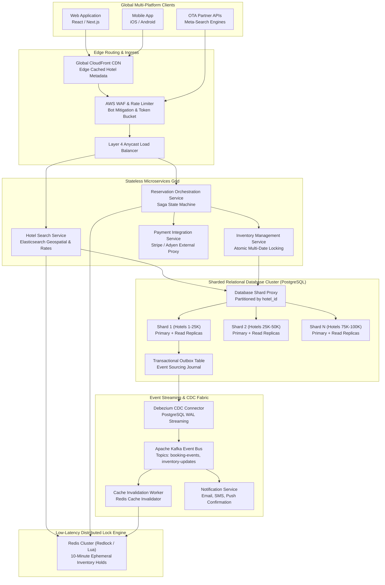
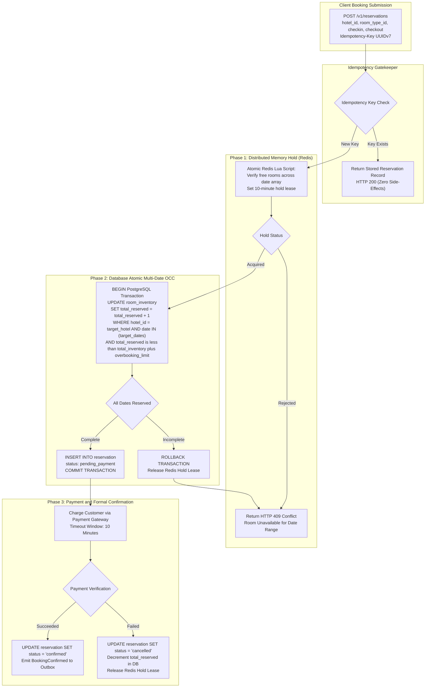
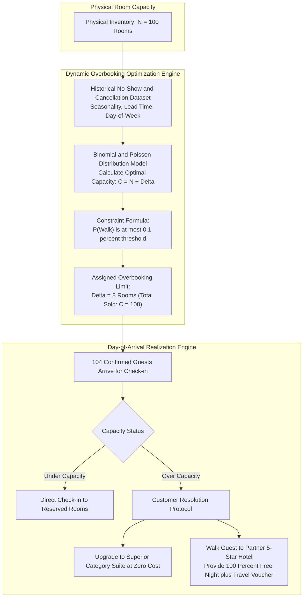
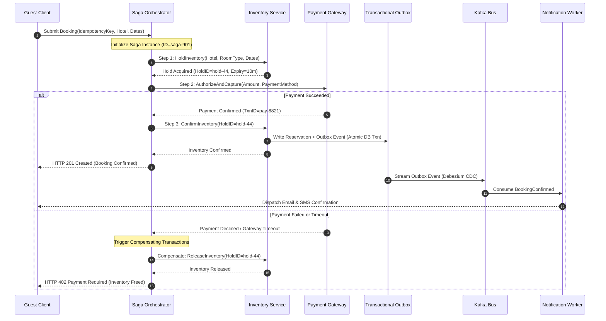
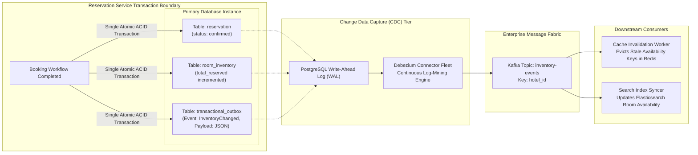
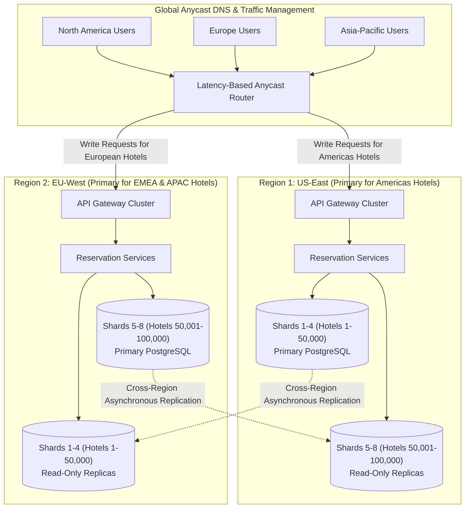

# Design a Hotel Reservation System

> [!tip] Staff/Principal Deep Walkthrough & Production Engine
> - **Interview Playbook**: [`Volume 2 Chapter 7 Staff/Principal Walkthrough Playbook`](02-Interactive-Interview-Playbook.md)
> - **Production Reservation Engine**: [`hotel_reservation_engine.py`](hotel_reservation_engine.py) (Multi-Date Atomic Inventory Ledger, Deadlock-Free Sorted Locking, Ephemeral 10-Minute Cart Holds, Saga Orchestration, and Dynamic Overbooking)

> [!abstract] Executive Problem Statement
> Design an enterprise-grade, hyperscale **Hotel Reservation and Online Travel Agency (OTA) Platform** (Booking.com / Expedia class) supporting **100,000 partner hotels** and **20 Million rooms worldwide**, processing **2.5 Million room-night bookings per day**, handling **50,000 search QPS** and localized **5,000 flash-sale booking TPS**, guaranteeing zero double-bookings ($RPO = 0$, strict multi-date serializability), and operating a mathematically optimized dynamic overbooking engine.

---

## 1. Executive Architectural Blueprint & Paradigmatic Matrix

A hotel reservation platform is characterized by an extreme asymmetry between **read-heavy browsing** (searching across locations, dates, and amenities) and **write-critical transactions** (reserving room inventory across multi-day calendar spans). The architecture decouples the high-throughput search tier from the strictly serializable booking and inventory engine.



### Paradigmatic Disambiguation Matrix

| Architectural Dimension | Two-Phase Commit (2PC / XA) | Orchestrated Saga Pattern | Choreographed Saga Pattern | Pure Event Sourcing | Our Staff-Level Production Design |
| :--- | :--- | :--- | :--- | :--- | :--- |
| **Transaction Boundary** | Distributed synchronous locks across all services | Centralized state machine coordinates calls & compensations | Event-driven pub/sub; services react to local domain events | Append-only event store; state projected from stream | **Two-Tier Hybrid**: Redis Ephemeral Hold + Orchestrated Saga with Transactional Outbox |
| **Lock Duration** | Holds DB locks across network hops & payment gateway | Zero DB locks during payment; ephemeral Redis lease | Zero DB locks; high cognitive overhead for rollbacks | No pessimistic locks; conflict resolution on event append | **10-minute Redis lease**, single-shard ACID DB transaction upon confirmation |
| **External Payment Integration** | Catastrophic anti-pattern (locks held for 2-5s) | Clean integration; compensations trigger refund API | Complex; requires multiple intermediate event topics | External side-effects isolated to command handlers | **Decoupled**: Payment is executed outside the database transaction window |
| **Blast Radius of Node Failure** | Coordinator crash freezes locks on all participants | Orchestrator reloads saga state from DB and resumes | Risk of cyclic dependency or stranded transactions | Replay event log to rebuild state | **Isolated**: Sharded by `hotel_id`; failures restricted to a single shard |
| **Scalability Limit** | $< 100\text{ TPS}$ (limited by distributed lock contention) | $> 10,000\text{ TPS}$ (stateless workers + DB sharding) | $> 50,000\text{ TPS}$ (pure async streaming) | $> 20,000\text{ TPS}$ (append-only disk speed) | **$50,000\text{ Search QPS}$, $5,000\text{ Local Flash TPS}$** |

### Core Philosophical Tenets
1. **Zero Double-Booking Invariant**: Inventory is strictly guarded by **multi-date atomic conditional updates** in a relational engine. A reservation can never succeed if even a single calendar date within the booking range lacks available inventory.
2. **Two-Tier Concurrency Architecture**: Flash sales (e.g., New Year's Eve in Times Square) cause thousands of concurrent users to contend for 10 rooms. Pure database Optimistic Concurrency Control (OCC) collapses under retry storms ($O(N^2)$ thrashing). We introduce **Tier 1 Distributed Memory Token Holds (Redis Lua)** to filter contention before falling through to **Tier 2 Sharded PostgreSQL ACID commits**.
3. **Inventory Count Abstraction**: Systems that track individual physical room IDs during booking suffer from massive row contention and booking friction. Customers book a **Room Type** (e.g., "Deluxe Ocean Suite"); physical room allocation is deferred until guest check-in.
4. **Asynchronous Cache Invalidation via Transactional Outbox**: The primary database transaction writes to both `reservation` and `transactional_outbox` atomically. Debezium mines PostgreSQL WAL logs to stream inventory events to Kafka, guaranteeing cache invalidation and search index sync without dual-write race conditions.

---

## 2. Hyperscale Scale & Capacity Math (Re-baselined)

### Operational Parameters
- **Global Inventory Scale**: $100,000\text{ partner hotels}$ across 190 countries, comprising **$20\text{ Million physical rooms}$**.
- **Daily Booking Volume**: **$2.5\text{ Million room-nights booked per day}$**.
- **Average Length of Stay (LoS)**: $3\text{ nights}$ (implying $\approx 833,333\text{ reservation checkouts/day}$).
- **Search-to-Booking Ratio**: $300:1$ (users inspect dozens of hotels, room categories, and calendar dates before converting).

---

### Traffic Profile & Throughput Math

#### Booking Throughput (Writes)
$$\text{Average Booking TPS} = \frac{833,333 \text{ reservations}}{86,400 \text{ seconds}} \approx 9.65 \text{ bookings/sec}$$
$$\text{Average Room-Night Update TPS} = \frac{2,500,000 \text{ room-nights}}{86,400 \text{ seconds}} \approx 28.93 \text{ updates/sec} \approx 30 \text{ TPS}$$
$$\text{Peak Booking Throughput (Global)} = 30 \times 10 = 300 \text{ TPS}$$
$$\text{Localized Flash-Sale Peak} = 5,000 \text{ TPS} \quad (\text{Targeted contention on a single property})$$

#### Search Throughput (Reads)
$$\text{Average Search QPS} = 30 \text{ bookings/sec} \times 300 = 9,000 \text{ searches/sec}$$
$$\text{Peak Search QPS} = 9,000 \times 5 = 45,000 - 50,000 \text{ searches/sec}$$

---

### Storage Capacity Calculations

#### 1. Room Inventory Table Sizing (2-Year Rolling Horizon)
- $100,000\text{ hotels} \times 10\text{ room types per hotel} = 1,000,000\text{ unique room types}$.
- Rolling booking calendar: $730\text{ days}$ ($2\text{ years}$ into the future).
- Total active inventory rows:
  $$\text{Inventory Rows} = 1,000,000 \text{ room types} \times 730 \text{ days} = 730,000,000 \text{ rows} \quad (730\text{M rows})$$
- Row payload: `(hotel_id, room_type_id, date, total_inventory, total_reserved, overbooking_limit, version)` $\approx 60\text{ bytes per row}$:
  $$\text{Inventory Table Size} = 730\text{M rows} \times 60 \text{ bytes} \approx 43.8 \text{ GB}$$
  *Critical Staff Insight: 43.8 GB is remarkably compact! The entire global 2-year inventory for 100,000 hotels fits entirely in the DRAM of a single modern server, and scales easily across 8 database shards ($< 6\text{ GB per shard}$).*

#### 2. Reservation History Table Sizing (5-Year Retention)
- $833,333\text{ reservations/day} \times 365\text{ days} = 304.1\text{ Million reservations/year}$.
- Row payload: JSON metadata, guest ID, hotel ID, dates, billing tokens $\approx 500\text{ bytes per row}$:
  $$\text{Annual Reservation Storage} = 304.1\text{M} \times 500 \text{ bytes} \approx 152 \text{ GB/year}$$
  $$\text{5-Year Reservation Storage} = 152 \text{ GB} \times 5 = 760 \text{ GB}$$

---

### Sharding & Cluster Provisioning

#### Database Sharding Strategy: Partition by `hotel_id`
A reservation transaction spans multiple dates, but **never spans multiple hotels**. Sharding by `hash(hotel_id)` guarantees that every inventory lock, room-night update, and reservation record executes within a single database shard.

- **Topology**: Provision **8 PostgreSQL Shards** (each running a Primary + 2 Read Replicas across 3 AZs).
- **Per-Shard Load**:
  - $12,500\text{ hotels per shard}$.
  - $91.25\text{ Million inventory rows per shard}$ ($5.47\text{ GB DRAM footprint}$).
  - Peak write load: $300\text{ TPS} / 8 \approx 38\text{ TPS per shard}$ (nominal); localized flash sales absorb up to $5,000\text{ TPS}$ on a single shard.

---

## 3. Storage & Kernel Micro-Architecture

### Multi-Date Atomic Inventory Reservation State Machine



---

### Two-Tier Concurrency Control: Mitigating Flash Sales

When a viral flash sale launches, thousands of users attempt to book the last available room simultaneously.

#### The Failure of Pure Optimistic Concurrency Control (OCC)
In a pure OCC scheme, 1,000 transactions read `version = 5`. Only one transaction successfully commits `version = 6`; the remaining 999 transactions fail, retry, read `version = 6`, and collide again. Under high contention, OCC generates $O(N^2)$ aborts, thrashing CPU and saturating database connection pools.

#### The Two-Tier Solution
1. **Tier 1: In-Memory Token Lease (Redis Lua Script)**:
   - Available room inventory is cached in Redis hashes: `hotel:{id}:inventory:{room_type}:{date}`.
   - An atomic Lua script checks availability across all requested dates:
     ```lua
     -- Keys: list of date keys; ARGV[1]: required rooms
     for i, key in ipairs(KEYS) do
         local avail = tonumber(redis.call('HGET', key, 'available') or 0)
         if avail < tonumber(ARGV[1]) then
             return 0 -- Insufficient inventory on date
         end
     end
     for i, key in ipairs(KEYS) do
         redis.call('HINCRBY', key, 'available', -tonumber(ARGV[1]))
     end
     return 1 -- Hold lease acquired
     ```
   - If the script returns `0`, the request is rejected at the API gateway in $< 2\text{ms}$ without touching the PostgreSQL database.
   - A 10-minute TTL is attached to the temporary hold token.
2. **Tier 2: Relational Multi-Date Atomic OCC (PostgreSQL)**:
   - Only the single client that acquired the Redis token lease proceeds to PostgreSQL.
   - The reservation service executes an atomic multi-date update:
     ```sql
     UPDATE room_inventory
     SET total_reserved = total_reserved + 1,
         version = version + 1
     WHERE hotel_id = 1042
       AND room_type_id = 88
       AND date IN ('2026-06-01', '2026-06-02', '2026-06-03')
       AND total_reserved < (total_inventory + overbooking_limit);
     ```
   - **The Atomic Multi-Row Guarantee**: The application inspects `rows_affected`. If `rows_affected == date_count` (3 in this case), the entire stay is secured. If `rows_affected < date_count`, a rollback is triggered, releasing partial holds immediately.

---

## 4. Dynamic Overbooking Probabilistic Buffer Model

Hotels treat room inventory as a strictly perishable asset: a room unsold on Tuesday night produces zero revenue forever. Because cancellations, early departures, and no-shows occur predictably, hotels intentionally sell more rooms than physically exist.



### The Statistical Binomial Overbooking Formulation
Let:
- $N$: Total physical rooms of a given type (e.g., $100\text{ rooms}$).
- $C$: Total reservations accepted ($C = N + \Delta$, where $\Delta$ is the overbooking buffer).
- $p$: Probability that a confirmed guest actually arrives to check in ($1 - p$ is the cancellation + no-show rate, typically $10\% - 15\% \implies p \approx 0.88$).

The number of arrivals $K$ follows a **Binomial Distribution**:
$$P(K = k) = \binom{C}{k} p^k (1 - p)^{C - k}$$

The probability of **walking a guest** (i.e. more guests show up than physical rooms exist) is:
$$P(\text{Walk}) = P(K > N) = \sum_{k = N + 1}^{C} \binom{C}{k} p^k (1 - p)^{C - k}$$

#### The Revenue Management Optimization Function
The optimal overbooking buffer $\Delta^*$ maximizes expected net profit while capping walk risk below a strict SLA threshold:
$$\max_{\Delta} \left[ (\text{Revenue per Room} \times \mathbb{E}[\min(K, N)]) - (\text{Walk Penalty Cost} \times \mathbb{E}[\max(0, K - N)]) \right]$$
$$\text{Subject to: } P(\text{Walk}) \le 0.001 \quad (0.1\% \text{ maximum risk of walk})$$

*Example Production Realization*: For $N = 100$ and $p = 0.88$, setting $C = 108$ ($\Delta = 8$) yields an expected arrival count of $108 \times 0.88 = 95.04$ guests, with a walk probability $P(K > 100) \approx 0.08\%$. The hotel captures $8$ additional room-nights of revenue with negligible operational risk.

---

## 5. Distributed Saga Orchestration & Transactional Outbox

### Distributed Saga Orchestration Sequence with Compensations

The booking workflow spans multiple service boundaries: Reservation Service, Inventory Service, and external Payment Gateways (Stripe/Adyen). We deploy an **Orchestration-based Saga** to manage distributed state transitions without locking database resources across network boundaries:



---

### Transactional Outbox Pattern & CDC Cache Invalidation

Updating the database and then directly publishing an event to Kafka is an anti-pattern prone to dual-write failures (e.g., DB commits, but the app crashes before calling Kafka, leaving caches stale). We enforce the **Transactional Outbox Pattern**:



#### Protocol Guarantees
1. `reservation`, `room_inventory`, and `transactional_outbox` rows are updated within a **single local ACID transaction**.
2. Debezium tails the PostgreSQL Write-Ahead Log (WAL), publishing the outbox events to Kafka with strict per-hotel ordering.
3. Cache invalidators consume Kafka events and evict stale keys in Redis in $< 20\text{ms}$.
4. If Kafka is temporarily down, PostgreSQL WAL retains the change records indefinitely ($RPO = 0$).

---

## 6. Multi-Region Active-Active Sharding Topology



### Partition Ownership Model
Hotel inventory writes cannot tolerate cross-ocean consensus latencies ($> 150\text{ms}$ round-trip for synchronous multi-region 2PC).
- **Home Region Ownership**: Each hotel is assigned an authoritative home region based on physical geography:
  - Shards 1–4 (Hotels in the Americas): Primary in `us-east-1`.
  - Shards 5–8 (Hotels in EMEA & APAC): Primary in `eu-west-1`.
- **Global Search Reads**: European users searching for hotels in New York query the local European read-replica of Shards 1–4, achieving sub-20ms search responses.
- **Booking Writes Routed to Home Shard**: When a European user clicks "Book" for a New York hotel, Route53 and the API Gateway route the reservation write request to `us-east-1`, where the primary database executes the atomic inventory reservation locally in $< 5\text{ms}$.

---

## 7. Database Schema & Data Models

### Complete Relational DDL (PostgreSQL)

```sql
-- 1. Hotels Table
CREATE TABLE hotels (
    hotel_id            BIGINT PRIMARY KEY,
    name                VARCHAR(255) NOT NULL,
    address             VARCHAR(512) NOT NULL,
    city                VARCHAR(128) NOT NULL,
    country_code        CHAR(2) NOT NULL,
    latitude            NUMERIC(9,6) NOT NULL,
    longitude           NUMERIC(9,6) NOT NULL,
    star_rating         SMALLINT CHECK (star_rating BETWEEN 1 AND 5),
    timezone            VARCHAR(64) NOT NULL, -- e.g., 'America/New_York'
    created_at          TIMESTAMPTZ DEFAULT NOW(),
    updated_at          TIMESTAMPTZ DEFAULT NOW()
);

-- 2. Room Types Table
CREATE TABLE room_types (
    room_type_id        BIGINT PRIMARY KEY,
    hotel_id            BIGINT NOT NULL REFERENCES hotels(hotel_id),
    name                VARCHAR(128) NOT NULL, -- e.g., 'Deluxe Ocean Suite'
    base_capacity       SMALLINT NOT NULL DEFAULT 2,
    max_capacity        SMALLINT NOT NULL DEFAULT 4,
    amenities_mask      BIGINT NOT NULL DEFAULT 0, -- Bitmask for WiFi, Pool, etc.
    base_price_cents    INTEGER NOT NULL,
    created_at          TIMESTAMPTZ DEFAULT NOW()
);

-- 3. Room Inventory (Atomic Calendar Table)
CREATE TABLE room_inventory (
    inventory_id        BIGSERIAL PRIMARY KEY,
    hotel_id            BIGINT NOT NULL,
    room_type_id        BIGINT NOT NULL REFERENCES room_types(room_type_id),
    date                DATE NOT NULL,
    total_inventory     INTEGER NOT NULL,
    total_reserved      INTEGER NOT NULL DEFAULT 0,
    overbooking_limit   INTEGER NOT NULL DEFAULT 0,
    version             INTEGER NOT NULL DEFAULT 0,
    CONSTRAINT uq_hotel_room_date UNIQUE (hotel_id, room_type_id, date),
    CONSTRAINT chk_capacity CHECK (total_reserved <= total_inventory + overbooking_limit)
);

-- Index for multi-date reservation range scans
CREATE INDEX idx_inventory_lookup 
ON room_inventory (hotel_id, room_type_id, date) 
INCLUDE (total_inventory, total_reserved, overbooking_limit, version);

-- 4. Reservations Table
CREATE TABLE reservations (
    reservation_id      VARCHAR(36) PRIMARY KEY, -- UUIDv7
    idempotency_key     VARCHAR(64) NOT NULL UNIQUE,
    hotel_id            BIGINT NOT NULL,
    room_type_id        BIGINT NOT NULL,
    guest_id            BIGINT NOT NULL,
    check_in_date       DATE NOT NULL,
    check_out_date      DATE NOT NULL,
    status              VARCHAR(32) NOT NULL, -- 'pending_payment', 'confirmed', 'cancelled', 'checked_in'
    total_amount_cents  INTEGER NOT NULL,
    currency            CHAR(3) NOT NULL DEFAULT 'USD',
    hold_expires_at     TIMESTAMPTZ,
    created_at          TIMESTAMPTZ DEFAULT NOW(),
    updated_at          TIMESTAMPTZ DEFAULT NOW()
);

-- 5. Transactional Outbox Table
CREATE TABLE transactional_outbox (
    event_id            BIGSERIAL PRIMARY KEY,
    aggregate_type      VARCHAR(64) NOT NULL,
    aggregate_id        VARCHAR(64) NOT NULL,
    event_type          VARCHAR(64) NOT NULL,
    payload             JSONB NOT NULL,
    created_at          TIMESTAMPTZ DEFAULT NOW()
);
```

---

## 8. Staff-Level Interview Defense & Hard Q&A

### Hard Questions & Battle-Tested Answers

#### Q1: Why not hold database locks during payment processing to guarantee the room stays reserved?
> **Staff Answer**: Holding database locks across external third-party network calls (like Stripe or Adyen) is one of the most dangerous anti-patterns in distributed systems. Payment gateways typically exhibit p99 latencies of $2 - 5\text{ seconds}$. If 50 users hold row locks on a database for 5 seconds each, all available connection pool slots (e.g. PgBouncer limit of 100 connections) exhaust instantly. Subsequent reads and writes stall, inducing complete system collapse. Instead, we use a **two-phase reservation hold**: the database transaction completes in $< 5\text{ms}$ by marking the reservation as `pending_payment` with an expiration timestamp (`hold_expires_at = now() + 10m`). If payment fails or times out, an asynchronous worker or compensating transaction releases the inventory.

#### Q2: What happens if the network drops while calling the payment gateway? Did the charge succeed?
> **Staff Answer**: This is the classic distributed two-army problem. When a timeout occurs, the payment status is indeterminate. The Saga Orchestrator must **never assume failure and cancel inventory immediately**, as the customer may have already been charged.
> 1. The orchestrator queries the payment gateway's status endpoint using the unique client-side `Idempotency-Key`.
> 2. If the payment gateway confirms the charge succeeded, the saga transitions to `ConfirmInventory`.
> 3. If the payment gateway has no record of the charge, the saga safely marks the payment failed and releases the inventory.
> 4. If the payment gateway is unreachable, the reservation remains in `pending_payment` until an exponential backoff reconciliation job settles the state.

#### Q3: Why store dates as `DATE` instead of `TIMESTAMP WITH TIME ZONE`?
> **Staff Answer**: Hotel check-in and check-out dates are **calendar concepts bound to the hotel's local physical geography**, not point-in-time UTC instants. A guest books a stay for "June 1 to June 4" at the Grand Hotel in Tokyo. Storing this as UTC timestamps causes disastrous off-by-one errors when queried by users in California (UTC-7) or London (UTC+0), where UTC conversion may shift the date to May 31. By storing the date as an immutable ISO-8601 calendar `DATE` (`2026-06-01`), inventory allocation remains completely immune to daylight saving shifts and client time-zone conversions.

#### Q4: How do you prevent inventory leaks if a server crashes after acquiring a Redis hold?
> **Staff Answer**: Redis holds are acquired via Lua scripts that attach an explicit **10-minute Time-To-Live (TTL)** to the hold lease key. If the application server crashes immediately after acquiring the lease, the Redis key expires automatically after 10 minutes. A background cleanup job periodically compares active Redis hold keys against confirmed reservations in PostgreSQL, reclaiming any stranded inventory counts.

---

## 9. Operational Runbook & Production Checklist

### Production Failover & Re-balancing Procedures
1. **Shard Failover**: Managed via **Patroni and etcd**. If a primary PostgreSQL node fails, Patroni promotes the replica with the lowest replication lag in $< 10\text{ seconds}$. PgBouncer pauses incoming write connections and redirects traffic to the new primary with zero connection drops.
2. **Flash-Sale Pre-Warming**:
   - For anticipated high-contention events, invoke `POST /admin/hotels/{id}/prewarm`.
   - Pre-populates Redis inventory keys and provisions dedicated token buckets at the WAF layer.
   - Restricts single-user booking rate to 1 request per 10 seconds via sliding-window rate limiters.

### Production Health Monitoring Metrics
| Metric Name | Warning Threshold | Critical Threshold | Action Plan |
| :--- | :--- | :--- | :--- |
| `inventory_lock_contention_wait_ms` | $> 50\text{ms}$ | $> 200\text{ms}$ | High contention detected; verify Tier 1 Redis hold is active. |
| `saga_compensation_failure_rate` | $> 0.05\%$ | $> 0.2\%$ | Compensating transaction failed; quarantine saga for manual reconciliation. |
| `redis_hold_lease_timeout_ratio` | $> 5\%$ | $> 12\%$ | High abandonment rate or payment gateway latency spike. |
| `overbooking_walk_ratio` | $> 0.05\%$ | $> 0.1\%$ | Walk risk SLA breached; recalibrate Binomial overbooking buffer $\Delta$. |

---

## Related Topics
- [`01-Architectural-Blueprint.md`](01-Architectural-Blueprint.md) - Edge WAF token buckets protecting booking APIs.
- [`01-Architectural-Blueprint.md`](01-Architectural-Blueprint.md) - Idempotent payment gateway integration patterns.
- [`01-Architectural-Blueprint.md`](01-Architectural-Blueprint.md) - Multi-channel booking confirmations via Kafka.
- [`01-Architectural-Blueprint.md`](01-Architectural-Blueprint.md) - Snowflake 64-bit UUIDv7 for reservation IDs.
- [`01-Architectural-Blueprint.md`](01-Architectural-Blueprint.md) - Partitioning hotel shards across distributed nodes.
