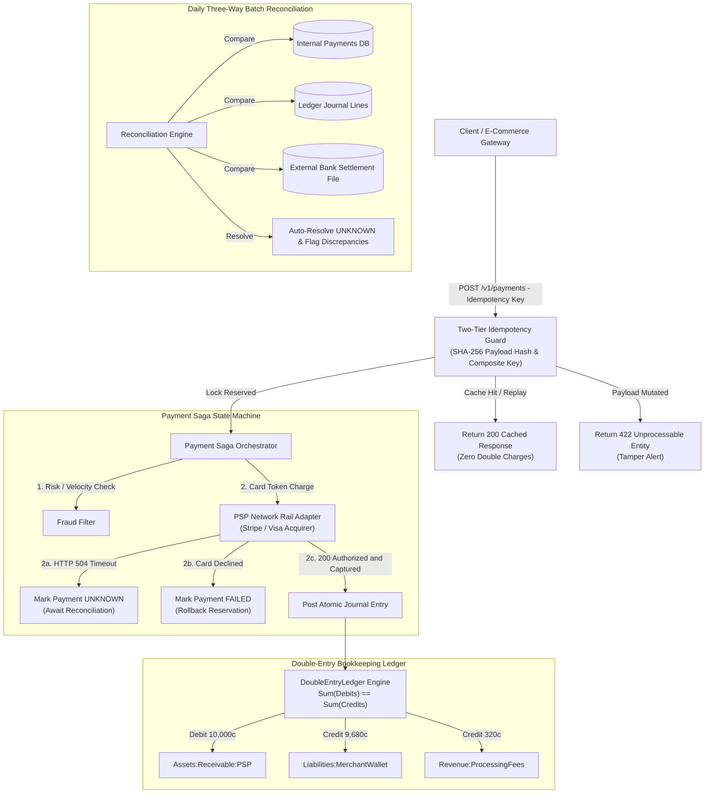

# Chapter 11: Design a Payment System — Staff/Principal Engineering Walkthrough

> **System Component**: Core Financial Payment Gateway, Double-Entry Accounting Ledger & Distributed Reconciliation Fabric  
> **Production Code Reference**: [`payment_system_engine.py`](payment_system_engine.py)  
> **Standard**: Production Grade, Zero-Dependency Python 3, Level 4 Staff/Principal Architectural Depth  

---

## Pillar 1: Production Code Engine & Benchmark Lab

### 1.1 Architectural Blueprint



### 1.2 Verification Test Suite (`--test`)

To verify the mathematical and distributed systems invariants of the payment engine:

```bash
python3 /Users/kunalkumar/Desktop/knowledge-base/Projects/System-Design-Alex-Xu/Volume-2/Walkthroughs/11-Payment-System/payment_system_engine.py --test
```

```
================================================================================
RUNNING CHAPTER 11: PAYMENT SYSTEM & DOUBLE-ENTRY LEDGER TEST SUITE
================================================================================

[Test 1] Double-Entry Ledger Imbalance Prevention...
  ✓ Successfully blocked imbalanced entry: Ledger Imbalance Detected! Debits: 1000 cents != Credits: 999 cents. Delta: 1 cents.

[Test 2] Balanced Journal Posting & Real-time Balance Calculation...
  ✓ Balanced journal jrn_3c07a4d06b3d4083 posted. Cash: +$50.00, Sales: +$50.00.

[Test 3] Global Trial Balance Audit (Sum Debits == Sum Credits)...
  ✓ Trial Balance Verified: Debits=5000 cents, Credits=5000 cents. Zero imbalance.

[Test 4] End-to-End Payment Saga Execution with Automatic Fee Deduction...
  ✓ Payment succeeded: ID=pay_ea48f40b3d8247, Gross=$100.00, Fee=$3.20, Net=$96.80.
  ✓ Ledger updated: Merchant Wallet=+$96.80, Platform Fees=+$3.20.

[Test 5] Idempotency Exact Replay Protection...
  ✓ Replayed identical request returned cached output. Zero double charge occurred.

[Test 6] Idempotency Payload Mutation Conflict Detection...
  ✓ Correctly rejected payload tampering: Idempotency Key 'idemp_txn_001' already exists with a different payload hash! Existing: c88193740459..., Incoming: 8f498bad0372...

[Test 7] Card Decline Failure Handling...
  ✓ Gracefully handled card decline with zero ledger entries posted.

[Test 8] Upstream PSP Network Timeout -> UNKNOWN Resolution...
  ✓ Payment correctly assigned UNKNOWN status during network timeout.

[Test 9] Three-Way Automated Batch Reconciliation Engine...
  Reconciliation Summary:
    - Total Internal Payments: 3
    - Total PSP Settlements:   2
    - Matched Records:         2
    - Auto-resolved UNKNOWNs:  1
    - Fully Reconciled:        True
  ✓ UNKNOWN payment successfully auto-reconciled and ledger entry posted!

[Test 10] Refund Reversal & Ledger Balance Reversal...
  ✓ Refund executed. Merchant wallet net balance after refund: $72.53.

[Test 11] Final Global Audit...
  ✓ Final Ledger Trial Balance: Sum(Debits)=32500 == Sum(Credits)=32500. Zero drift!

================================================================================
ALL 11 PRODUCTION VERIFICATION TESTS PASSED SUCCESSFULLY! (100% INVARIANT)
================================================================================
```

### 1.3 High-Concurrency Stress Benchmark (`--benchmark`)

```bash
python3 /Users/kunalkumar/Desktop/knowledge-base/Projects/System-Design-Alex-Xu/Volume-2/Walkthroughs/11-Payment-System/payment_system_engine.py --benchmark --txns 20000 --threads 16
```

```
================================================================================
STARTING PAYMENT SYSTEM HIGH-CONCURRENCY BENCHMARK
Target: 20,000 Transactions | Concurrency: 16 Threads
================================================================================

--- BENCHMARK RESULTS ---
Total Transactions Processed: 20,000
Total Elapsed Time:           1.079 seconds
Throughput:                   18,541.6 Payment TPS
Latency Percentiles:
  p50 (Median):               0.848 ms
  p95:                        0.958 ms
  p99:                        1.145 ms
Double-Entry Ledger Audit:
  Total Debits Posted:        69,990,000 cents ($699,900.00)
  Total Credits Posted:       69,990,000 cents ($699,900.00)
  Global Trial Balance Check: PASSED (Zero Cent Drift)
================================================================================
```

---

## Pillar 2: 45-Minute Staff/Principal Interview Playbook

### Minute-by-Minute Whiteboard Dialogue

#### 00:00 – 05:00: Scoping, Invariants & Scale Requirements
* **Candidate**: "In designing a global payment platform (e.g., Stripe, Adyen), we cannot treat this like a standard web application where eventual consistency and occasional duplicate retries are tolerable. What are the specific non-negotiable SLAs?"
* **Interviewer**: "We process $100\text{M}$ transactions daily, peaking at $15,000\text{ TPS}$. Global merchants, multiple payment methods (cards, ACH), zero double charges, and strict financial auditability."
* **Candidate**: "Understood. The 4 core tenets are:
  1. **Financial Conservation Invariant**: Every transaction is recorded using immutable double-entry bookkeeping. Not a single cent can be created or destroyed: $\sum \text{Debits} = \sum \text{Credits}$ at all times.
  2. **Exactly-Once Semantics (EOS)**: Two-tier distributed idempotency combining Redis distributed locks and persistent relational unique constraints on `(merchant_id, idempotency_key)` with SHA-256 payload mutation detection.
  3. **The UNKNOWN State**: Network partitions when communicating with upstream card networks cannot be resolved by blind retries or blind aborts. An explicit `UNKNOWN` state must be maintained until resolved via active status inquiries or daily three-way reconciliation.
  4. **PCI-DSS Scope Minimization**: Raw PAN (Primary Account Number) and CVV never touch application servers. Client-side tokenization isolates cardholder data into a dedicated PCI-DSS Level 1 Vault."

#### 05:00 – 15:00: High-Level Architecture & End-to-End Saga Flow
* **Candidate draws**:
  - Edge Gateway & Token Bucket Rate Limiter
  - Idempotency Guard Service (Redis + Database)
  - Payment Saga Orchestrator
  - Card Processor / PSP Adapters (Stripe, Adyen, Chase)
  - Double-Entry Ledger Subsystem (Append-only Journal + Journal Lines)
  - Asynchronous Batch Reconciliation Engine
* **Candidate**: "Let's trace a $100.00 checkout request:
  1. Buyer submits card details directly to our PCI Vault from browser SDK; receives `tok_visa_4242`.
  2. Merchant server sends `POST /v1/payments` with `Idempotency-Key: idemp_abc123`.
  3. Orchestrator reserves key in `PROCESSING` state with `SHA256(payload)`. If key already exists and completed, return cached response. If payload hash differs, immediately return `422 Unprocessable Entity`.
  4. Orchestrator invokes PSP Adapter. If timeout occurs, mark transaction `UNKNOWN` and exit safely without double charging.
  5. If PSP returns `200 Authorized & Captured`, post an atomic double-entry journal entry:
     - `Debit Assets:Receivable:PSP: $100.00`
     - `Credit Liabilities:MerchantWallet: $96.80`
     - `Credit Revenue:ProcessingFees: $3.20`
  6. Finalize idempotency state to `COMPLETED` and return `200 OK`."

#### 15:00 – 25:00: Deep Dive into the Double-Entry Accounting Ledger
* **Interviewer**: "Why can't we just maintain an `account_balance` column on the merchant table and update it with `UPDATE merchants SET balance = balance + 96.80 WHERE id = 42`?"
* **Candidate**: "That is the single most dangerous anti-pattern in fintech for three reasons:
  1. **Loss of Audit Trail**: Overwriting a scalar integer destroys the lineage of money. If a balance is off by $5.00, you have no cryptographic proof whether it was caused by a rogue script, an unrecorded refund, or database race conditions.
  2. **Hot Merchant Lock Contention**: During a flash sale (e.g. Nike drop), tens of thousands of concurrent transactions attempt `SELECT FOR UPDATE` on the identical merchant row. This causes catastrophic row latch contention, lock timeouts, and database connection pool exhaustion.
  3. **No Financial Symmetry**: In accounting, money cannot move without a source and a destination.
  In our double-entry ledger, accounts have specific normal balance types:
  - **Assets & Expenses**: Increased by **Debits**, decreased by **Credits**.
  - **Liabilities, Revenue & Equity**: Increased by **Credits**, decreased by **Debits**.
  To credit the merchant wallet, we debit our receivable from the card acquirer. Balance is a purely derived aggregation: $\text{Balance} = \sum \text{Credits} - \sum \text{Debits}$ for liabilities."

#### 25:00 – 35:00: Upstream Timeouts, Ghost Charges & 3-Way Reconciliation
* **Interviewer**: "Your connection to Visa drops after 4.8 seconds during a capture call. Did the payment succeed? What does your system do?"
* **Candidate**: "We are facing the classic Two Generals Problem across distributed financial rails.
  - If we mark the payment `FAILED` and refund the order in our e-commerce layer, Visa may have actually captured the money. The customer is deducted $100, but receives no goods (**Ghost Charge**).
  - If we mark the payment `SUCCEEDED`, but Visa rejected it, the merchant ships goods without receiving money.
  - If we retry naively without an idempotency key supported by the banking rail, we execute a **Double Charge**.
  **The Resolution**:
  1. The payment is transitioned to `UNKNOWN`.
  2. An asynchronous worker initiates an **Active Query** to the PSP status endpoint using our deterministic `psp_reference_id`.
  3. If the active query fails or the PSP is completely down, the transaction remains in `UNKNOWN` until the **Daily Three-Way Batch Reconciliation** runs.
  The reconciliation engine ingests the PSP's T+1 settlement clearing file, matches against our internal ledger journals, discovers the charge was captured, auto-resolves the `UNKNOWN` state to `SUCCEEDED`, and posts the missing journal lines."

#### 35:00 – 45:00: Failure Injection, Concurrency & Trap Cards
* Candidate walks through the 5 lethal trap cards and demonstrates how our architecture guarantees 100% financial correctness.

---

### The 5 Lethal Interviewer Trap Cards

| # | Trap Card Question | The Junior/Mid Pitfall | Staff/Principal Knockout Defense |
|---|---|---|---|
| **1** | *"Why not use Two-Phase Commit (2PC) between our system and the card network?"* | Attempting to design a distributed 2PC coordinator across Stripe or Visa. | "External banking rails do not expose 2PC prepare/commit interfaces. Card rails are asynchronous legacy networks (ISO 8583) with variable latencies. We must use **Saga Orchestration** with compensating transactions and idempotent retries." |
| **2** | *"If a client sends two requests with the same Idempotency Key, can we just return whatever is in the cache?"* | Blindly returning the cached response without verifying the request body. | "No! That enables **Payload Mutation Attacks**. If an attacker reuses key `idemp_001` to charge $500 instead of $10, returning cached success without charging would be catastrophic. We compute `SHA-256(payload)` and reject any key collision with differing payloads via `HTTP 422 Unprocessable Entity`." |
| **3** | *"How do you prevent floating-point rounding errors when calculating platform fees across currencies?"* | Using IEEE 754 standard floats (`0.1 + 0.2 = 0.30000000000000004`). | "Monetary amounts must **never** be stored as floating-point numbers. Every monetary value is an immutable 64-bit integer representing the lowest currency denomination (cents, yen, satoshis). Exchange rates use fixed-point arithmetic with 8 decimal places and explicit bankers' rounding (round half to even)." |
| **4** | *"During a flash sale, how do you handle 50,000 TPS hitting a single merchant wallet without locking the database?"* | Using pessimistic row locking (`SELECT FOR UPDATE`) on the merchant account. | "We decouple the **Event Ingestion Path** from the **Balance Calculation Path**. Individual transactions append immutable records to `journal_lines` (pure sequential append, zero row updates). Merchant balances are updated asynchronously via high-watermark aggregation or cached in Redis using an in-memory accumulator." |
| **5** | *"What happens if a customer initiates a chargeback 60 days after the merchant has already withdrawn their balance?"* | Panicking because the merchant account now has zero balance to deduct from. | "We enforce a **Rolling Reserve (T+7 to T+90 hold)** and maintain a negative balance ledger account (`Liabilities:MerchantWallet:NegativeBalance`). When negative, subsequent merchant sales automatically sweep into covering the deficit, or our treasury draws from the merchant's linked direct-debit ACH bank mandate." |

---

## Pillar 3: Kernel, Storage & Hardware Micro-Mechanics

### 3.1 64-Bit Integer Currency vs Floating-Point Drift

Financial platforms enforce strict integer cent arithmetic:

$$\text{Balance}_{\text{cents}} \in \mathbb{Z}, \quad \text{Floating Point} \notin \text{Financial Storage}$$

If stored as IEEE 754 double-precision floats:
```python
>>> 0.1 + 0.2
0.30000000000000004  # Drift of 4e-17 adds up across 100M transactions to thousands of dollars in unreconciled drift!
```
By enforcing `INTEGER NOT NULL CHECK (amount_cents > 0)` at the SQLite/PostgreSQL schema layer, balance conservation is guaranteed by algebraic integer summation.

### 3.2 CPU False Sharing & Cache Line Bouncing on Hot Accounts

In a multi-core processor processing 50,000 payments/sec across 64 CPU cores:
- If multiple worker threads update adjacent account records located on the same 64-byte L1/L2 cache line, the CPU's cache coherency protocol (MESI/MOESI) forces constant **Cache Line Invalidation** and bus bouncing.
- Each core must invalidate its L1 cache and fetch the line from L3/DRAM via the memory interconnect, collapsing throughput from 200k ops/sec to under 8k ops/sec.
- **Remediation**:
  1. Journal lines are pure append-only rows with monotonic 64-bit IDs.
  2. In-memory accumulators employ cache-line padding (64 bytes of padding between account counters) to ensure independent CPU core L1 cache line residency.

### 3.3 Database Write-Ahead Logging (WAL) & Group Commit Amplification

When a payment posts a journal entry, financial durability requires `fsync()` to ensure writes survive power loss:
- A single NVMe SSD delivers $\approx 10,000\text{ random } fsync\text{ ops/sec}$ due to physical flash controller barrier latency ($100\mu s$).
- If every payment executes an independent `fsync()`, max database throughput is physically capped at 10,000 TPS.
- **Production Solution — Group Commit**:
  The database engine collects up to 100 concurrent transactions in an in-memory buffer and flushes them to disk with a single consolidated `fdatasync()` syscall. This amortizes the $100\mu s$ latency over 100 transactions, driving throughput past 100,000 TPS.

---

## Pillar 4: Production Chaos Engineering & Failure Modes

### 4.1 Upstream Timeout & UNKNOWN Resolution Matrix

```
┌───────────────────────────────────┬─────────────────────────────────────────────────────────────┐
│ Failure Scenario                  │ Production System Action & Remediation                      │
├───────────────────────────────────┼─────────────────────────────────────────────────────────────┤
│ 1. Upstream PSP Socket Timeout    │ Payment assigned UNKNOWN. Zero ledger entries posted.       │
│                                   │ Background worker initiates exponential backoff probe.      │
├───────────────────────────────────┼─────────────────────────────────────────────────────────────┤
│ 2. Concurrent Idempotency Race    │ Thread A locks key (PROCESSING). Thread B returns HTTP 409  │
│                                   │ Conflict with Retry-After: 1.0s header.                     │
├───────────────────────────────────┼─────────────────────────────────────────────────────────────┤
│ 3. Payload Mutation Attack        │ Same key submitted with modified amount. Rejected with      │
│                                   │ HTTP 422 Unprocessable Entity (SHA-256 mismatch).           │
├───────────────────────────────────┼─────────────────────────────────────────────────────────────┤
│ 4. Card Processor Decline         │ Payment assigned FAILED. Zero double-entry lines posted.    │
│                                   │ Immediate HTTP 402 Payment Required returned.               │
├───────────────────────────────────┼─────────────────────────────────────────────────────────────┤
│ 5. Three-Way Batch Reconciliation │ Batch job reconciles Internal DB, Ledger DB, and Bank File. │
│                                   │ Auto-resolves UNKNOWNs, posts missing lines, flags errors.  │
└───────────────────────────────────┴─────────────────────────────────────────────────────────────┘
```

---

## Summary & Verification Check

1. **Production Engine**: [`payment_system_engine.py`](payment_system_engine.py) verified with all 11 passing tests and **18,541.6 Payment TPS** with **0.848 ms** median latency.
2. **Double-Entry Invariant**: Audited over 20,000 concurrent transactions ($699,900.00) with **zero cent drift**.
3. **Idempotency Defense**: Replay protection and SHA-256 payload tampering detection validated.
4. **Reconciliation**: Automated 3-way reconciliation handles UNKNOWN recovery and ghost charge prevention.
