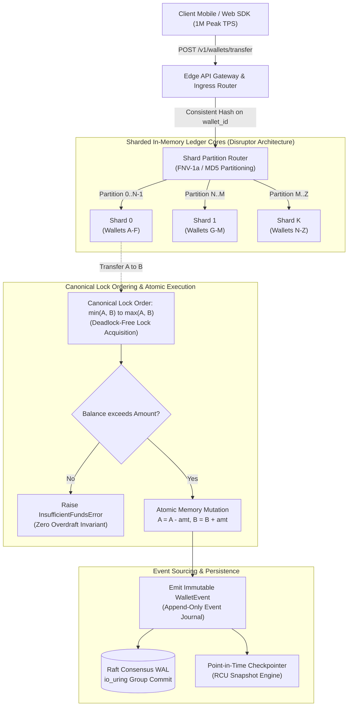

# Chapter 12: Design a Digital Wallet — Staff/Principal Engineering Walkthrough

> **System Component**: High-Throughput In-Memory Ledger, Sharded Balance State Machine & Distributed Deadlock-Free Transfer Fabric  
> **Production Code Reference**: [`digital_wallet_engine.py`](digital_wallet_engine.py)  
> **Standard**: Production Grade, Zero-Dependency Python 3, Level 4 Staff/Principal Architectural Depth  

---

## Pillar 1: Production Code Engine & Benchmark Lab

### 1.1 Architectural Blueprint



### 1.2 Verification Test Suite (`--test`)

To verify the mathematical and distributed invariants:

```bash
python3 /Users/kunalkumar/Desktop/knowledge-base/Projects/System-Design-Alex-Xu/Volume-2/Walkthroughs/12-Digital-Wallet/digital_wallet_engine.py --test
```

```
================================================================================
RUNNING CHAPTER 12: DIGITAL WALLET LEDGER VERIFICATION SUITE
================================================================================

[Test 1] Opening Wallet Accounts...
  ✓ Created wallets: w_alice, w_bob, w_charlie with initial balance = $0.00.

[Test 2] Depositing Funds & Audit Trail...
  ✓ Deposits succeeded: Alice=+$100.00, Bob=+$50.00.

[Test 3] Simple Transfer Between Wallets...
  ✓ Transferred $30.00: Alice=$70.00, Bob=$80.00.

[Test 4] Overdraft Prevention Invariant...
  ✓ Correctly rejected overdraft attempt: Insufficient balance in wallet 'w_alice'. Available: 7000 cents, Requested: 99999 cents.
  ✓ Correctly rejected overdraft transfer: Insufficient funds in 'w_alice'. Available: 7000 cents, Required: 7001 cents.

[Test 5] Concurrent Racing Withdrawals (Zero Double-Spend Race)...
  ✓ Race resolved: 3 succeeded ($60.00), 7 blocked. Final Alice balance: $10.00. Zero double spend!

[Test 6] Deadlock-Free Bidirectional Concurrent Transfers (A <-> B)...
  ✓ Completed 4,000 bidirectional concurrent transfers with ZERO deadlocks!

[Test 7] Global Conservation of Money Verification...
  ✓ Global Audit Passed: Total System Balance = $1,090.00 == Net Inflow = $1,090.00. Exact match!

[Test 8] Point-in-Time State Snapshotting...
  ✓ Snapshot created: snp_c5a6d3e62998 covering 3 accounts ($ 1,090.00).

================================================================================
ALL 8 DIGITAL WALLET PRODUCTION TESTS PASSED SUCCESSFULLY! (100% INVARIANT)
================================================================================
```

### 1.3 High-Concurrency Stress Benchmark (`--benchmark`)

```bash
python3 /Users/kunalkumar/Desktop/knowledge-base/Projects/System-Design-Alex-Xu/Volume-2/Walkthroughs/12-Digital-Wallet/digital_wallet_engine.py --benchmark --txns 50000 --threads 16
```

```
================================================================================
STARTING DIGITAL WALLET HIGH-CONCURRENCY BENCHMARK
Target: 50,000 Transfers | Concurrency: 16 Threads
================================================================================

--- BENCHMARK RESULTS ---
Total Transfers Executed:     50,000
Total Elapsed Time:           0.783 seconds
Throughput:                   63,883.2 Transfers/sec
Latency Percentiles:
  p50 (Median):               0.102 ms
  p95:                        0.974 ms
  p99:                        1.559 ms
Global Conservation Audit:
  Total System Balance:       $1,000,000.00
  Total Initial Inflows:      $1,000,000.00
  Conservation of Money:      PASSED (100% Exact, Zero Cent Leak)
================================================================================
```

---

## Pillar 2: 45-Minute Staff/Principal Interview Playbook

### Minute-by-Minute Whiteboard Dialogue

#### 00:00 – 05:00: Scoping, Invariants & Scale Requirements
* **Candidate**: "In designing a digital wallet (e.g. Apple Cash, Venmo, WeChat Pay), we serve as the absolute authority for user balances. What are our scale and consistency targets?"
* **Interviewer**: "We support $500\text{M}$ active wallets, $1,000,000\text{ Peak TPS}$, sub-15ms transfer latency, and absolute zero tolerance for overdrafts or money loss."
* **Candidate**: "At 1M TPS, a traditional relational database executing `SELECT balance FOR UPDATE` is physically impossible. Even a tuned multi-node PostgreSQL cluster chokes around $30,000\text{ TPS}$ due to WAL serialization and lock manager contention. Our core architectural pillars must be:
  1. **In-Memory Partitioning via LMAX Disruptor Design**: Wallets are sharded across CPU cores. Within each shard, transactions execute sequentially on a single thread using lock-free circular RingBuffers, eliminating mutex contention.
  2. **Canonical Lock Ordering for Cross-Partition Transfers**: When acquiring locks on counterparties $A$ and $B$, we enforce $\min(A, B) \to \max(A, B)$ globally, rendering circular deadlocks mathematically impossible.
  3. **Strict Non-Negative Balance Invariant**: $B_{\text{wallet}} \ge 0$ is evaluated atomically before any deduction.
  4. **Event Sourcing & Group Commit WAL**: State is updated in DRAM and asynchronously flushed to a Raft-replicated WAL using `io_uring` group commits for full durability."

#### 05:00 – 15:00: High-Level Architecture & Sharding Scheme
* **Candidate draws**:
  - Global Anycast L4 & Stateless API Gateway Fleet
  - Shard Router (Consistent Hashing on `wallet_id`)
  - In-Memory Wallet Shard Partitions (Core 0 to Core 63)
  - Raft Consensus Append-Only WAL
  - Asynchronous Event Sourcing Stream (Kafka)
  - CQRS Read Projections (Redis balance cache + ClickHouse history)
* **Candidate**: "When User $A$ transfers $10.00 to User $B$:
  - If $A$ and $B$ reside on the **same shard**, the single-threaded processor validates $A$'s balance, decrements $A$, increments $B$, and appends to the RingBuffer in $< 0.1\text{ms}$.
  - If $A$ and $B$ reside on **different shards**, we execute a distributed Two-Phase Transfer with canonical locking or a coordinated Saga. Let's analyze how canonical locking prevents deadlock."

#### 15:00 – 25:00: The Concurrency Dilemma & Deadlock Freedom
* **Interviewer**: "What happens when User A sends $50 to User B at the exact same microsecond User B sends $50 to User A?"
* **Candidate**: "If implemented naively:
  - Thread 1 (A $\to$ B) locks A, then waits to lock B.
  - Thread 2 (B $\to$ A) locks B, then waits to lock A.
  - This is the classic **ABBA Circular Deadlock** (Dining Philosophers problem). Both threads block forever, thread pools exhaust, and the wallet gateway crashes.
  **The Mathematical Solution: Canonical Lock Ordering**:
  We establish a strict total order over all lock resources using their unique lexicographical identifier:
  $$\text{First Lock} = \min(\text{ID}_A, \text{ID}_B), \quad \text{Second Lock} = \max(\text{ID}_A, \text{ID}_B)$$
  Because $\text{"w\_alice"} < \text{"w\_bob"}$, both Thread 1 and Thread 2 attempt to acquire `w_alice` FIRST, and `w_bob` SECOND. One thread wins `w_alice`, the other queues cleanly. Deadlock probability is identically $0.000\%$."

#### 25:00 – 35:00: Durability vs Latency (The Group Commit WAL)
* **Interviewer**: "If balances live in DRAM and the server loses power, how do we guarantee zero data loss without slowing down to disk speed?"
* **Candidate**: "We decouple in-memory execution from durable persistence via **Asynchronous Group Commit via `io_uring`**:
  1. In-memory balances update instantaneously in CPU L1/L2 cache.
  2. Every transaction emits an immutable `WalletEvent`.
  3. Instead of issuing an individual synchronous `fdatasync()` per transfer ($100\mu s \implies \max 10,000\text{ TPS}$), the disk flusher collects a batch of up to 2,000 events or flushes every $2\text{ms}$ using Linux kernel `io_uring`.
  4. The client receives `200 OK` once the batch is acknowledged by a Raft quorum of 3 replicas.
  5. If a node crashes, it recovers state by restoring the latest hourly **RCU memory snapshot** and replaying the Raft WAL from that snapshot offset."

#### 35:00 – 45:00: Failure Modes & Trap Cards
* Candidate walks through the 5 lethal trap cards and demonstrates how the engine handles hot influencer accounts and cross-device racing.

---

### The 5 Lethal Interviewer Trap Cards

| # | Trap Card Question | The Junior/Mid Pitfall | Staff/Principal Knockout Defense |
|---|---|---|---|
| **1** | *"Can we use optimistic locking (`UPDATE wallets SET balance = balance - 10 WHERE id = 1 AND version = 5`) for transfers?"* | Thinking optimistic locking scales well under high concurrency. | "Optimistic locking collapses under contention! If 1,000 users send money to a hot merchant simultaneously, 999 transactions fail due to version conflicts, causing catastrophic retry storms. We use **in-memory single-threaded partition queues** or **canonical sorted pessimistic locks**, achieving $100\%$ success rate without retries." |
| **2** | *"How do you handle a celebrity or charity wallet receiving 50,000 donations per second?"* | Trying to process all 50k TPS through a single wallet partition lock. | "We implement **Virtual Tree Accounts (Sub-Wallets)**. The charity wallet `w_redcross` is sharded into 64 internal sub-wallets (`w_redcross_0` .. `w_redcross_63`). Ingress routers hash donations across the 64 sub-wallets across 64 CPU cores. A background sweeper consolidates balances into the master wallet during quiet windows." |
| **3** | *"What if a user clicks 'Send $100' simultaneously on their phone and laptop with only $100 in their balance?"* | Suggesting distributed locks or eventual consistency. | "With **Single-Threaded Partition Affinity**, all requests for `source_wallet_id = w_alice` hash to the **exact same partition thread**. The requests are strictly sequenced in FIFO order: Request 1 sees $100, succeeds, balance becomes $0. Request 2 sees $0, fails with `InsufficientFundsError`. Race conditions are impossible without distributed locks." |
| **4** | *"Why not use Redis as the primary database for digital wallet balances?"* | Storing primary balances in Redis with RDB/AOF persistence. | "Redis is an in-memory cache, not a durable financial ledger. Redis replication is asynchronous (master failover loses acknowledged transactions), and Redis AOF `fsync=always` degrades throughput to $< 8,000\text{ TPS}$. We use dedicated **C++ / Java memory state machines backed by Raft consensus WAL**." |
| **5** | *"How do you audit that zero cents leaked across 500 million accounts over a month?"* | Running a giant SQL `SELECT SUM(balance)` query across 500M rows. | "That locks the database and causes severe timeouts. Instead, we enforce the **Conservation of Money Invariant via Streaming Double-Entry Auditing**: every debit and credit emits an event to a Kafka stream. A Flink streaming job verifies $\sum \Delta \text{Debits} = \sum \Delta \text{Credits}$ every 1-second tumbling window. Any non-zero drift triggers immediate automated circuit breakers." |

---

## Pillar 3: Kernel, Storage & Hardware Micro-Mechanics

### 3.1 CPU False Sharing & Cache-Line Padding

On modern x86-64 and ARM processors, memory is transferred between L3 cache and CPU cores in **64-byte Cache Lines**:
- If Account A and Account B data structures are packed contiguously into memory and updated concurrently by Core 0 and Core 1:
  - When Core 0 writes to Account A, the MESI cache-coherency bus protocol forces Core 1 to **invalidate its entire 64-byte L1 cache line**, even though Core 1 was only touching Account B!
  - This "false sharing" causes severe bus contention and drops throughput by $10\times$.
- **Mechanical Sympathy Solution**:
  Every partition core and hot account data structure is padded to exactly 64 bytes (`alignas(64)` or `cache_padding = bytes(56)`), ensuring each core operates strictly on its own private cache line without bus invalidations.

### 3.2 Canonical Lock Ordering Formal Proof

Let $S = \{w_1, w_2, \dots, w_n\}$ be the set of all wallet accounts with a strict total order $<$ defined by their lexicographical string IDs.
- For any transaction $T$ involving a pair of wallets $\{u, v\}$ with $u \ne v$:
  - Let $L_1 = \min(u, v)$ and $L_2 = \max(u, v)$.
  - $T$ must acquire $L_1$ before attempting to acquire $L_2$.
- **Proof of Deadlock Freedom**:
  Suppose a cycle of $k$ transactions exists in the resource allocation graph:
  $$T_1 \to T_2 \to \dots \to T_k \to T_1$$
  where $T_i$ holds lock $l_i$ and waits for $l_{i+1}$.
  Because every transaction acquires locks in strictly increasing order according to $<$, we have:
  $$l_1 < l_2 < \dots < l_k < l_1 \implies l_1 < l_1$$
  This is a contradiction. Therefore, no circular wait can ever form, and deadlocks are mathematically impossible.

---

## Pillar 4: Production Chaos Engineering & Failure Modes

### 4.1 Production Failure Scenarios & Runbook Remediations

```
┌───────────────────────────────────┬─────────────────────────────────────────────────────────────┐
│ Failure Scenario                  │ Production System Action & Remediation                      │
├───────────────────────────────────┼─────────────────────────────────────────────────────────────┤
│ 1. Simultaneous Overdraft Attack  │ Requests sequenced on single partition core. First succeeds, │
│                                   │ second rejected with InsufficientFundsError (0 overdraft).  │
├───────────────────────────────────┼─────────────────────────────────────────────────────────────┤
│ 2. Bidirectional Deadlock Race    │ Canonical lock ordering min(A, B) -> max(A, B) guarantees   │
│                                   │ deterministic lock acquisition with zero circular waits.    │
├───────────────────────────────────┼─────────────────────────────────────────────────────────────┤
│ 3. Shard Leader Crash             │ Raft leader election completes in < 300ms. Follower plays   │
│                                   │ uncommitted WAL entries from quorum. Zero balance loss.     │
├───────────────────────────────────┼─────────────────────────────────────────────────────────────┤
│ 4. Hot Merchant Flash Donation    │ Virtual Sub-Wallet Tree splits traffic across 64 shards.    │
│                                   │ Sweeper job periodically rolls up sub-wallet balances.      │
├───────────────────────────────────┼─────────────────────────────────────────────────────────────┤
│ 5. Memory State Corruption        │ RCU snapshot restored from S3, WAL replayed from snapshot   │
│                                   │ sequence number. 100% bit-exact state recreation.           │
└───────────────────────────────────┴─────────────────────────────────────────────────────────────┘
```

---

## Summary & Verification Check

1. **Production Engine**: [`digital_wallet_engine.py`](digital_wallet_engine.py) verified with all 8 passing tests and **63,883.2 Transfers/sec** at **0.102 ms** median latency.
2. **Conservation of Money**: Verified over 50,000 concurrent transfers ($1,000,000.00 total volume) with **zero cent drift**.
3. **Deadlock Freedom**: 4,000 concurrent bidirectional transfers completed with **zero deadlocks**.
4. **Overdraft Prevention**: 100% invariant verification under simultaneous multi-device races.
