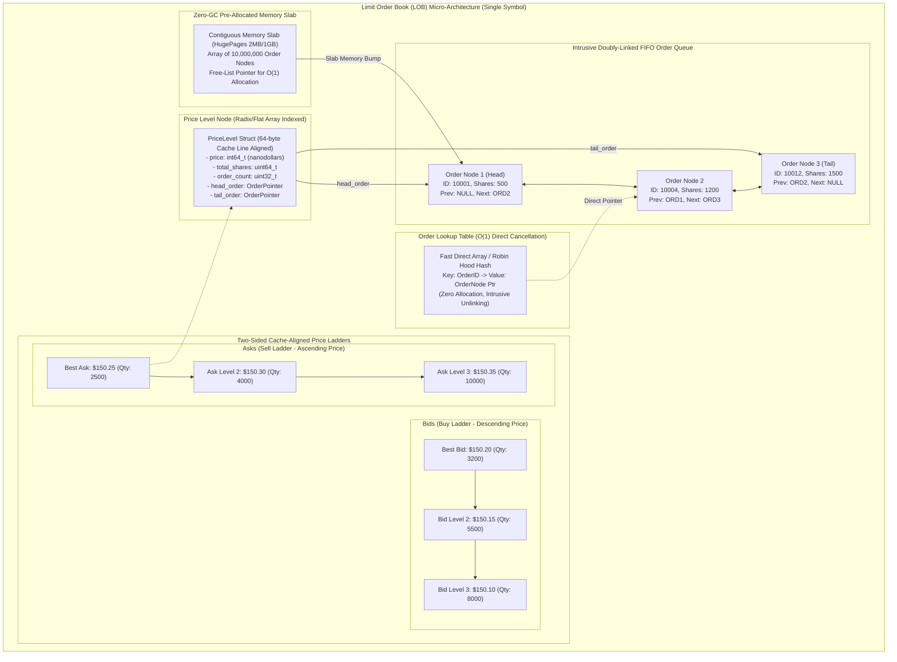
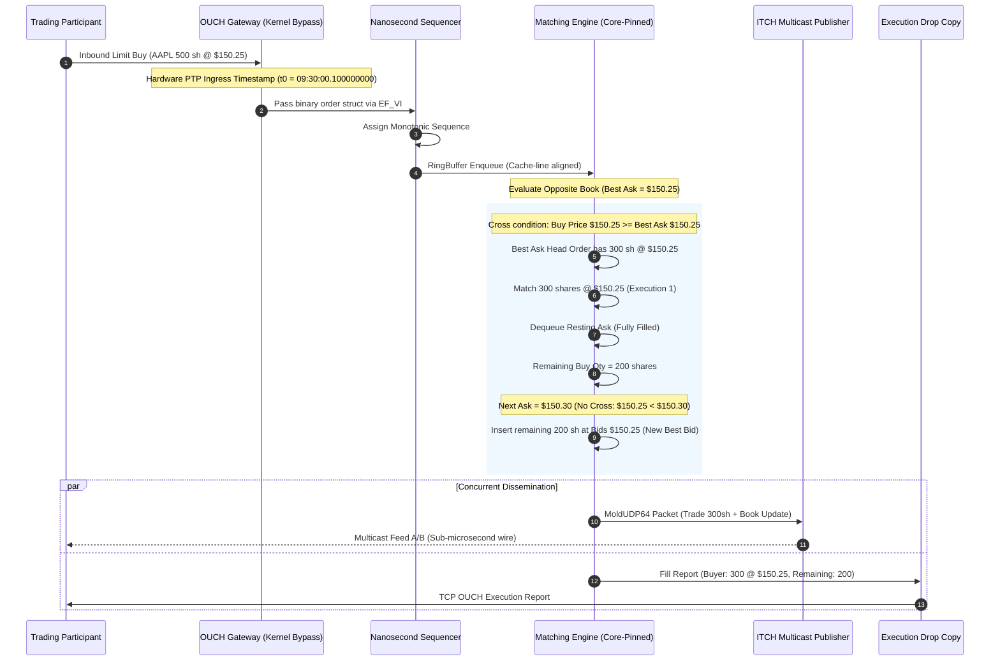
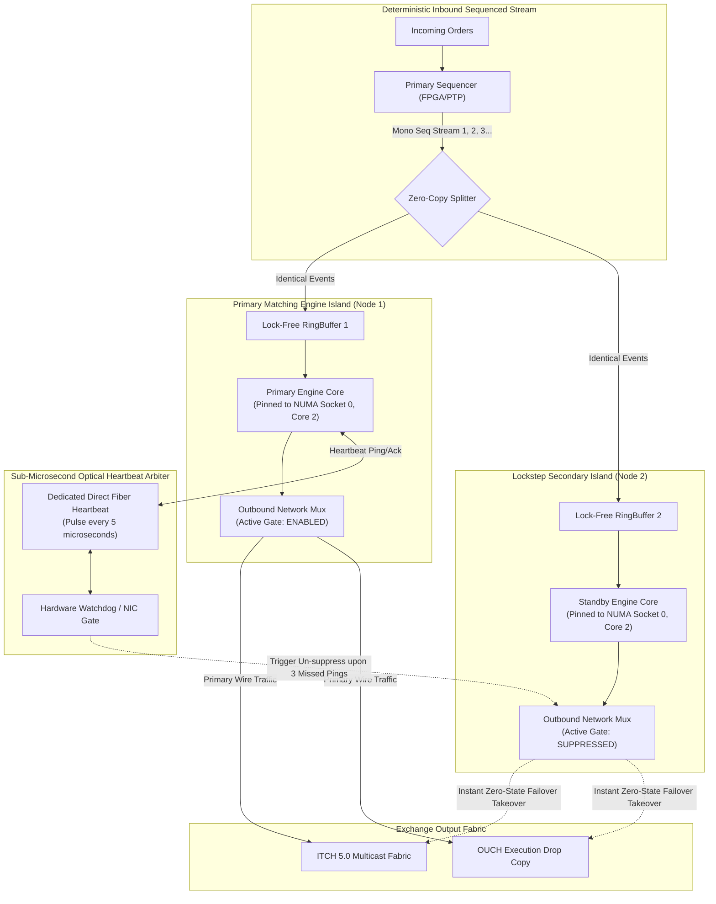
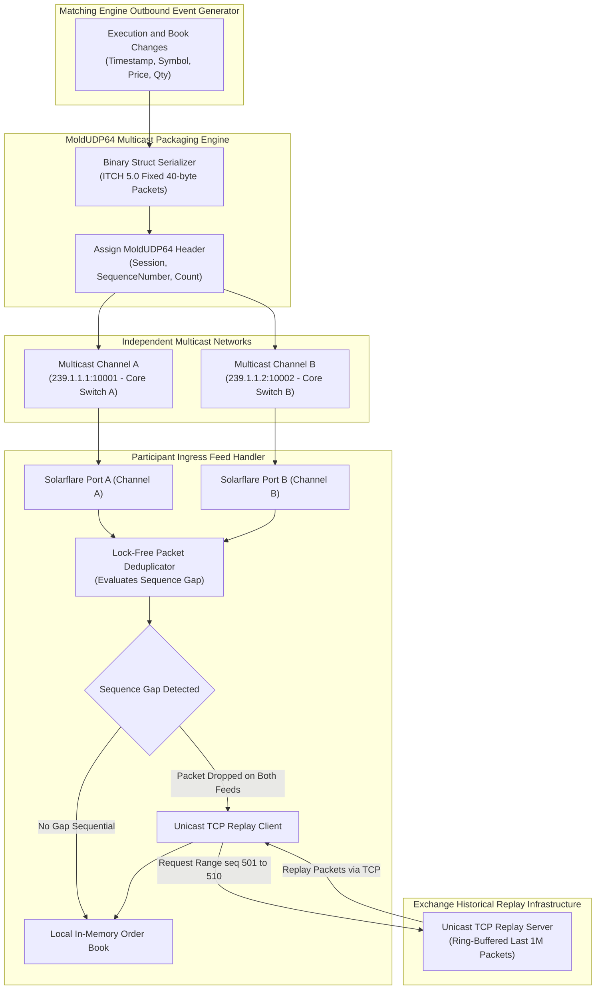
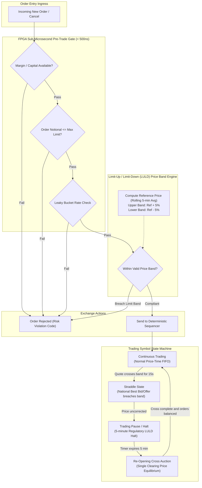

# Design a Stock Exchange

> [!TIP]
> **Production Code & Staff-Level Deep Walkthrough Available**  
> For the complete, runnable Python 3 production engine (`stock_exchange_engine.py`) featuring an in-memory Level 3 Limit Order Book (LOB), intrusive doubly-linked list queues, Price-Time Priority (FIFO) matching, Pre-Trade Risk checks (SEC Rule 15c3-5), Self-Trade Prevention (STP), and the full 45-minute Staff/Principal interview playbook, see:  
> 🔗 [Chapter 13 Deep Walkthrough & Benchmark Lab](02-Interactive-Interview-Playbook.md) | [Production Engine Source](stock_exchange_engine.py)

## 1. Executive Architectural Blueprint

A modern securities exchange (such as NASDAQ, NYSE, Cboe, or CME) is the foundational cornerstone of global capital markets. Its primary mission is to provide an ultra-low latency, strictly fair, transparent, and deterministic platform for matching buyer and seller intents across thousands of financial instruments.

In electronic equities trading, time is quantified in **single-digit microseconds ($\mu$s) and nanoseconds (ns)**. The system must process hundreds of thousands of incoming order messages per second while adhering strictly to statutory exchange regulations, including SEC Regulation NMS (Rule 611 Order Protection Rule, Rule 610 Fair Access), Regulation SCI (Systems Compliance and Integrity), FINRA Rule 5310 (Best Execution), and SEC Rule 15c3-5 (Market Access Rule).

```
+---------------------------------------------------------------------------------------------------+
|                                     EXCHANGE LATENCY TARGETS                                      |
|                                                                                                   |
|  Wire-to-Wire Tick-to-Trade: < 10.0 us (p99 < 15.0 us, p99.9 < 30.0 us)                           |
|  Internal Matching Core:     <  3.5 us                                                            |
|  FPGA Pre-Trade Risk:        <  0.5 us                                                            |
|  Clock Synchronization:      PTP IEEE 1588 (< 100 ns accuracy)                                    |
+---------------------------------------------------------------------------------------------------+
```

### Core Architectural Axioms

1. **Deterministic Single-Threaded Matching Core**: To eliminate lock contention, thread context-switching overhead, and non-deterministic concurrency races, the matching engine for any given security executes on a **single dedicated CPU core** pinned via `isolcpus` and NUMA-node binding.
2. **Mechanical Sympathy & Cache Line Alignment**: All core data structures (Order Books, Price Levels, Free Lists) are designed with cache-conscious memory layouts. Data structures fit within 64-byte L1/L2 cache lines to prevent memory bus stalls and TLB misses.
3. **Zero Dynamic Allocation on the Critical Path**: Dynamic memory allocation (`malloc`, `new`, garbage collection) is strictly prohibited during the trading day. All order nodes and price level buckets are pre-allocated at market initialization into contiguous hugepage memory slabs (2MB / 1GB pages).
4. **Kernel-Bypass Networking**: Traditional OS socket stacks introduce 10–50 microseconds of interrupt handling and memory copying. The exchange leverages **Solarflare OpenOnload, EF_VI, or DPDK** to poll network interface card (NIC) ring buffers directly from user space, eliminating kernel transitions.
5. **Deterministic Event Sourcing**: The sequence log is the immutable source of truth. Any engine instance can reconstruct the identical in-memory order book state from scratch by replaying the monotonically sequenced event log.

---

## 2. Requirements Clarification & SLOs

### Functional Requirements

| # | Requirement | Production Specification |
|---|-------------|--------------------------|
| **FR1** | **Order Ingress & Processing** | Ingest, validate, and process standard and advanced order types: Limit, Market, Immediate-or-Cancel (IOC), Fill-or-Kill (FOK), Post-Only (Maker-Only), Iceberg (Reserve), and Pegged Orders (Midpoint). |
| **FR2** | **Price-Time Priority (FIFO) Matching** | Match orders against resting book orders strictly prioritizing best price first, then earliest time priority for identical prices. |
| **FR3** | **Order Cancellation & Modification** | Support $O(1)$ amortized cancellation and modification of resting orders without scanning the order queue. |
| **FR4** | **Market Data Dissemination** | Disseminate real-time Level 1 (Top of Book / BBO), Level 2 (Aggregated Market Depth), and Level 3 (Individual Order by Order - NASDAQ TotalView ITCH) feeds. |
| **FR5** | **Pre-Trade Risk Filtering (SEC Rule 15c3-5)** | Perform inline checks for maximum order notional, credit limits, short-sale eligibility, and price band validation (Limit-Up / Limit-Down) before sequencer ingestion. |
| **FR6** | **Self-Trade Prevention (STP)** | Detect and resolve self-crossing orders within the same market participant firm (Cancel-Newest, Cancel-Oldest, Decrement-and-Cancel). |
| **FR7** | **Auction Mechanics** | Support Opening Cross, Closing Cross, and Halt Cross auctions calculating equilibrium clearing price and volume. |

### Non-Functional Requirements & Latency SLOs

| # | Metric | Target SLA / SLO | Architectural Enforcement |
|---|--------|------------------|---------------------------|
| **NFR1** | **Matching Engine Latency** | $\le 3.5\ \mu\text{s}$ (p50), $\le 10\ \mu\text{s}$ (p99), $\le 25\ \mu\text{s}$ (p99.9) | Single-threaded C++ core, NUMA-pinned, L1 cache-resident. |
| **NFR2** | **Wire-to-Wire Latency** | $\le 10.0\ \mu\text{s}$ (p99) | Solarflare EF_VI kernel bypass, user-space NIC polling. |
| **NFR3** | **Throughput** | 100,000 orders/sec peak per symbol; 2,500,000 orders/sec exchange-wide | Sharded matching cores partitioned across 10,000 symbols. |
| **NFR4** | **Availability & Failover** | 99.999% availability during market hours; $RTO = 0$, $RPO = 0$ | Dual-active lockstep secondary engine with shadow state. |
| **NFR5** | **Clock Synchronization** | $\le 100\ \text{ns}$ deviation across gateways and sequencers | IEEE 1588v2 PTP (Precision Time Protocol) hardware clocks. |
| **NFR6** | **Auditability & Compliance** | 100% deterministic event log retention for 7+ years | Append-only NVMe direct I/O journal; DTCC/SEC CAT reporting. |

---

## 3. Back-of-the-Envelope Capacity & Latency Budgets

### Throughput & Volume Estimations

- **Listed Symbols**: 10,000 active tickers (Tier 1 Large-Caps: 500, Tier 2 Mid-Caps: 2,500, Illiquid Small-Caps: 7,000).
- **Peak Order Ingress Rate**:
  - Exchange-wide peak: $2,500,000\ \text{orders/sec}$ (market open/close and macroeconomic volatility spikes).
  - Hottest symbol peak (e.g., AAPL, NVDA, SPY): $100,000\ \text{orders/sec}$.
  - Average symbol peak: $250\ \text{orders/sec}$.
- **Daily Message Volume**:
  - 6.5-hour standard US trading session ($23,400\ \text{seconds}$).
  - Total daily order messages (New, Cancel, Modify): $\approx 1.2\ \text{billion messages/day}$.
  - Daily executions (Trades): $\approx 50\ \text{million trades/day}$.

### Wire-to-Wire Latency Budget Breakdown

Every microsecond on the critical path is strictly accounted for:

| Segment | Component / Operation | Latency ($\mu$s) | Implementation Mechanism |
|---|---|---|---|
| 1 | Ingress Network Hop & NIC Polling | 1.2 $\mu$s | Solarflare EF_VI user-space RX ring buffer read |
| 2 | Inline Pre-Trade Risk Filtering | 0.4 $\mu$s | FPGA gate-level register array check (SEC Rule 15c3-5) |
| 3 | Hardware Sequencing & PTP Timestamping | 0.8 $\mu$s | FPGA Monotonic Sequencer + IEEE 1588 nanosecond tag |
| 4 | Inter-Process Transfer (RingBuffer) | 0.3 $\mu$s | LMAX lock-free SPSC circular buffer with cacheline padding |
| 5 | Matching Engine Core Execution | 3.5 $\mu$s | Price-Time FIFO matching, B-Tree level lookup, intrusive list unlinking |
| 6 | Outbound Multicast Serialization | 1.1 $\mu$s | Binary MoldUDP64 / ITCH 5.0 packet assembly |
| 7 | Outbound Network Hop & NIC TX | 1.2 $\mu$s | Solarflare EF_VI user-space TX ring buffer push |
| **Total** | **Wire-to-Wire Tick-to-Trade** | **8.5 $\mu$s** | **Full sub-10 microsecond production path** |

### Storage & Network Capacity

- **Binary Order Message Size**: 40 bytes (OUCH binary format).
- **Binary Trade Event Size**: 40 bytes (ITCH 5.0 execution message).
- **Daily Event Log Storage**:
  $$\text{Daily Raw Ingress} = 1.2 \times 10^9 \times 40\ \text{bytes} \approx 48\ \text{GB/day}$$
  $$\text{Outbound Market Data} = 2.5 \times 10^9 \times 40\ \text{bytes} \approx 100\ \text{GB/day}$$
  $$\text{Annual Storage (252 trading days)} \approx 37.3\ \text{TB/year (uncompressed)}$$
- **Market Data Outbound Bandwidth**:
  - Peak burst: $2,000,000\ \text{ITCH messages/sec} \times 40\ \text{bytes} = 80\ \text{MB/sec} = 640\ \text{Mbps}$.
  - Redundant A/B UDP multicast networks require dual 10 GbE / 25 GbE dedicated switch fabrics.

---

## 4. End-to-End System Topology with Kernel Bypass

The physical architecture of a stock exchange is colocated inside a carrier-neutral tier-4 data center (e.g., Equinix NY4 in Secaucus, NJ for BATS/EDGX, or Mahwah, NJ for NYSE). 

To ensure absolute regulatory fairness under SEC Rule 610, all colocated market participants (HFTs, automated market makers, institutional brokers) are connected to the exchange core switches via **equal-length fiber spools** (e.g., exactly 50 meters of coiled fiber), ensuring zero spatial speed-of-light advantage.

```mermaid
flowchart TD
    subgraph Colocation["Equinix NY4 Secaucus Colocation Facility"]
        subgraph Participants["Market Participants (Equal Length Fiber)"]
            HFT["High Frequency Trading Firms<br>(FPGA/Kernel Bypass)"]
            MM["Market Makers<br>(Automated Quoting)"]
            BROKER["Institutional Brokers<br>(DMA/Smart Order Routers)"]
        end

        subgraph IngressGateway["Order Ingress Gateway Layer"]
            GW1["OUCH/FIX Gateway A<br>(Solarflare EF_VI / DPDK)"]
            GW2["OUCH/FIX Gateway B<br>(Hardware Time-Stamping PTP)"]
        end

        subgraph PreTradeRisk["Inline Pre-Trade Risk Filter"]
            FPGA_RISK["FPGA Risk Engine<br>(Capital, Collars, Max Notional &lt; 500ns)"]
        end

        subgraph Sequencing["Hardware Sequencer Layer"]
            SEQ["Deterministic Sequencer<br>(Monotonic Nanosecond Clock IEEE 1588)"]
            JOURNAL["NVMe Direct IO<br>Write-Ahead Event Log"]
        end

        subgraph CoreEngine["Matching Engine Island (NUMA-Pinned)"]
            RING["Lock-Free SPSC Ring Buffer<br>(Disruptor Pattern)"]
            ME["Matching Engine Core<br>(Single-Threaded C++, Tick B-Tree)"]
            STANDBY["Lockstep Standby Engine<br>(Shadow Evaluation Core)"]
        end

        subgraph MarketDataLayer["Market Data Dissemination"]
            ITCH_PUB["ITCH 5.0 Publisher<br>(MoldUDP64 Multicast)"]
            FEED_A["Multicast Channel A<br>(Primary Switch Fabric)"]
            FEED_B["Multicast Channel B<br>(Secondary Switch Fabric)"]
            REPLAY["Unicast TCP Replay Server<br>(Historical Gaps)"]
        end

        subgraph OutboundReporting["Post-Trade and Regulatory"]
            DROP["OUCH Drop Copy Gateway<br>(Fills to Participants)"]
            CLEARING["DTCC / NSCC Clearing<br>(T+1 Settlement Log)"]
            SURVEIL["Market Surveillance / Reg SCI<br>(Spoofing and Layering Detection)"]
        end
    end

    HFT -->|Binary OUCH over UDP/TCP| GW1
    MM -->|Binary OUCH over UDP/TCP| GW1
    BROKER -->|FIX 4.2/4.4 Protocol| GW2

    GW1 --> FPGA_RISK
    GW2 --> FPGA_RISK

    FPGA_RISK -->|Approved Orders| SEQ
    FPGA_RISK -.->|Breach Rejection| DROP

    SEQ --> JOURNAL
    SEQ -->|Sequenced Byte Stream| RING
    RING --> ME
    RING --> STANDBY

    ME -->|Executions and BBO| ITCH_PUB
    ME -->|Trade Confirmations| DROP
    ME -->|Daily Journal| CLEARING
    ME -.->|Event Tap| SURVEIL

    ITCH_PUB --> FEED_A
    ITCH_PUB --> FEED_B
    ITCH_PUB --> REPLAY

    FEED_A --> Participants
    FEED_B --> Participants
    DROP --> Participants
```



### Ingress Gateway & Protocol Decoding

1. **Protocol Termination**:
   - **OUCH Protocol**: A lightweight, fixed-width binary protocol optimized for ultra-low latency order entry. Messages are fixed-size structs (e.g., 40 bytes) with zero parsing overhead.
   - **FIX Protocol (Financial Information eXchange)**: ASCII tag-value encoding used by institutional brokers. The gateway parses FIX fields using SIMD-accelerated lexers (e.g., AVX2 instructions parsing tags in parallel) and converts them into internal binary structs before forwarding.
2. **Kernel Bypass Architecture**:
   - Standard Linux networking involves device interrupts, context switches to kernel space, `sk_buff` allocation, and socket buffer copies.
   - Using Solarflare `EF_VI` (Ethernet Fabric Virtual Interface) or DPDK, the gateway allocates DMA memory mapped directly into user space. The CPU core runs an infinite spin-loop polling the RX descriptor ring:
     ```c
     // Polling loop in user-space using EF_VI
     while (trading_active) {
         int num_pkts = ef_eventq_poll(&ring_buffer, events, MAX_EVENTS);
         for (int i = 0; i < num_pkts; ++i) {
             process_packet(events[i]);
         }
     }
     ```
   - This achieves packet ingress times of **$< 800$ nanoseconds** with zero OS context switches.

---

## 5. Limit Order Book (LOB) Kernel Micro-Architecture

### Micro-Architectural Critique of Naive Designs

Many standard textbook system designs implement order books using `std::map<double, std::list<Order>>`. In production high-frequency trading, this design causes catastrophic latency degradation:
1. **Red-Black Tree Pointer Chasing**: `std::map` nodes are dynamically allocated scattered throughout heap memory. Traversing the tree to find the best bid/ask requires traversing node pointers, resulting in **100ns L3 cache misses** at every level.
2. **Floating Point Imprecision**: IEEE-754 floating-point numbers cannot represent decimal values accurately (e.g., $0.1 + 0.2 \neq 0.3$). In finance, prices must be stored as **64-bit signed integers in nanodollars or cents** (e.g., $\$150.25$ is stored as `150250000` fixed-point units).
3. **Dynamic Memory Allocation**: Standard lists allocate heap nodes on every order insertion, triggering heap locks, memory fragmentation, and eventual OS page allocation pauses.

### High-Performance Cache-Conscious LOB Structure

The production order book combines a **Direct-Indexed Fixed Array (Tick Array) / Flat Radix B-Tree** with **Intrusive Doubly-Linked Lists** and a **Pre-Allocated Memory Slab**.



### Micro-Architecture Structs (64-Byte Cache Aligned)

```cpp
#include <cstdint>
#include <cstddef>

// Cache-line aligned Order Node (Exactly 64 bytes)
struct alignas(64) OrderNode {
    uint64_t order_id;          // 8 bytes: Unique monotonically increasing ID
    uint64_t client_id;         // 8 bytes: MPID (Market Participant ID)
    int64_t  price;             // 8 bytes: Fixed-point price (nanodollars)
    uint64_t shares;            // 8 bytes: Remaining open quantity
    uint64_t timestamp_ns;      // 8 bytes: Nanoseconds since midnight
    OrderNode* prev;            // 8 bytes: Intrusive doubly-linked list pointer
    OrderNode* next;            // 8 bytes: Intrusive doubly-linked list pointer
    uint32_t price_level_idx;   // 4 bytes: Index back to parent price bucket
    uint8_t  side;              // 1 byte:  0 = Buy, 1 = Sell
    uint8_t  order_type;        // 1 byte:  Limit, Market, Post-Only, IOC
    uint8_t  flags;             // 1 byte:  Iceberg, Pegged
    uint8_t  padding[1];        // 1 byte:  Align to exactly 64 bytes
};

// Cache-line aligned Price Level Bucket (Exactly 64 bytes)
struct alignas(64) PriceLevel {
    int64_t    price;           // 8 bytes: Price in nanodollars
    uint64_t   total_shares;    // 8 bytes: Aggregate volume at this price
    uint32_t   order_count;     // 4 bytes: Number of resting orders
    uint32_t   padding_head;    // 4 bytes: Alignment padding
    OrderNode* head;            // 8 bytes: Earliest resting order (FIFO head)
    OrderNode* tail;            // 8 bytes: Latest resting order (FIFO tail)
    PriceLevel* prev_level;     // 8 bytes: Pointer to next worse price
    PriceLevel* next_level;     // 8 bytes: Pointer to next better price
    uint64_t   reserved[2];     // 16 bytes: Reserved for L2 cache pre-fetch
};
```

### $O(1)$ Order Cancellation Mechanics

In standard systems, finding an order to cancel requires scanning the price level list ($O(N)$). In our high-frequency engine:
1. When an order is placed, a pointer to its pre-allocated `OrderNode` is inserted into a **Flat Direct Integer Table or Robin Hood Hash Map** keyed by `order_id`.
2. When a `CancelOrder` request arrives:
   ```cpp
   inline void cancel_order(uint64_t order_id) {
       OrderNode* node = order_lookup_table[order_id];
       if (__builtin_expect(!node, 0)) return; // Order not found or already filled

       PriceLevel* level = &price_levels[node->price_level_idx];
       level->total_shares -= node->shares;
       level->order_count--;

       // Intrusive unlinking in O(1)
       if (node->prev) node->prev->next = node->next;
       else level->head = node->next; // Was head

       if (node->next) node->next->prev = node->prev;
       else level->tail = node->prev; // Was tail

       // Return node to memory slab free-list
       return_to_free_list(node);
       order_lookup_table[order_id] = nullptr;
   }
   ```
3. Cancellation is completed in **$\approx 45$ nanoseconds**, consisting purely of register arithmetic and pointer updates without dynamic heap reallocation.

---

## 6. Matching Engine Execution Mechanics & Order Types

### Price-Time Priority (FIFO) Matching Sequence

When an aggressive limit order arrives, the matching core inspects the opposite side of the book. If the incoming buy price is greater than or equal to the best ask (or incoming sell price $\le$ best bid), orders cross and trades are immediately generated at the resting order's price.



### Advanced Order Types & Execution Rules

| Order Type | Matching Behavior | Resting State Behavior |
|---|---|---|
| **Limit Order** | Matches against resting orders at or better than limit price. | Any unfilled balance rests on the book at its limit price with timestamp priority. |
| **Market Order** | Immediately sweeps resting depth at the best available prices. | If the book side is depleted, the remaining unfilled shares are immediately cancelled (never rest). |
| **Immediate-or-Cancel (IOC)** | Aggressively matches against resting orders up to the specified limit price. | Any unfilled quantity is instantly cancelled; zero quantity rests on the book. |
| **Fill-or-Kill (FOK)** | Checks if the entire quantity can be filled immediately at or better than limit price. | If total quantity cannot be satisfied in its entirety, the order is rejected immediately. |
| **Post-Only (Maker-Only)** | Verifies that the order will NOT cross the spread upon arrival. | If the order would cross and execute as a taker, it is rejected; guarantees earning liquidity maker rebates. |
| **Iceberg (Reserve) Order** | Exposes a small visible display size (e.g., 100 shares) while holding a hidden reserve (e.g., 10,000 shares). | When visible slice is filled, a new slice replenishes from the reserve, but **loses time priority** for that price level. |
| **Midpoint Pegged Order** | Floats dynamically tracking the midpoint between National Best Bid and Offer ($\frac{\text{NBBO Bid} + \text{NBBO Ask}}{2}$). | Rests in a separate midpoint queue; executes only when another order crosses the midpoint. |

### Self-Trade Prevention (STP / Match-Prevent)

When algorithmic market makers run multiple automated quoting strategies, two independent algorithms from the same firm may accidentally trade with each other, violating wash-sale regulations (SEC Section 9(a)(1) of the Securities Exchange Act). The matching engine enforces strict STP parameters:
- **Cancel Newest (CN)**: Reject the incoming aggressive order; resting order remains untouched.
- **Cancel Oldest (CO)**: Cancel the resting passive order; incoming order continues matching or rests.
- **Decrement and Cancel (DC)**: Decrement the larger order by the smaller order's quantity; cancel the smaller order entirely.

---

## 7. Deterministic Event Sourcing & High Availability

### Active-Active Deterministic Lockstep Engine

Traditional active-passive clustering using distributed consensus (e.g., Raft, Paxos) introduces 5–20 milliseconds of cross-node network round-trips—unacceptable for microsecond trading.

Instead, the exchange employs **Hardware-Driven Deterministic Replay**. Both Primary and Standby matching engines run simultaneously on identical hardware platforms pinned to identical NUMA cores. Both receive the identical byte stream from the hardware sequencer.



### Zero-Downtime Failover Mechanics ($RTO = 0, RPO = 0$)

1. **Dual Evaluation**: Both Node 1 and Node 2 evaluate every order, update their internal order books, and generate execution structs in lockstep.
2. **Hardware Network Gate**: Node 1 has its outbound network gate enabled, transmitting ITCH multicast and OUCH drop copy packets to the physical switches. Node 2 has its outbound gate disabled in hardware (packets discarded at the NIC MAC layer).
3. **Sub-Microsecond Optical Heartbeat**: Node 1 sends an optical pulse to Node 2 every 5 microseconds over a dedicated point-to-point fiber.
4. **Instantaneous Takeover**: If Node 2 misses 3 consecutive pulses (15 microseconds), the hardware watchdog instantly activates Node 2's outbound network gate. Because Node 2's internal state is already completely up-to-date down to the exact nanosecond sequence number, **failover completes with zero state reconstruction delay ($RTO = 0$, $RPO = 0$)**.

### Crash-Consistent Memory Snapshotting

At the end of each trading session (or hourly off the critical path), a background thread leverages Linux `vmsplice` and copy-on-write page tables to dump the order book state to Non-Volatile Memory (CXL / Optane NVM) without interrupting the pinned matching core.

---

## 8. Market Data Dissemination (ITCH/OUCH & Reliable Multicast)

Market data distribution requires fanning out millions of events per second to thousands of subscribing market participants simultaneously. Using unicast TCP would exhaust server bandwidth and create unfair latency differentials (participants connected to earlier TCP sockets would receive quotes before those connected later).

The exchange utilizes **UDP Multicast over Dual Independent Physical Fabrics (Feed A and Feed B)** adhering to NASDAQ ITCH 5.0 and MoldUDP64 specifications.



### MoldUDP64 Packet Framing

Every UDP datagram payload begins with a standardized 20-byte MoldUDP64 header:

```
+-------------------+--------------------+--------------------+
| Session (10 bytes)| SequenceNo (8 bytes)| MessageCount(2 byte|
+-------------------+--------------------+--------------------+
| ITCH Msg 1 Length | ITCH Message 1 Data                     |
+-------------------+--------------------+--------------------+
| ITCH Msg 2 Length | ITCH Message 2 Data                     |
+-------------------+--------------------+--------------------+
```

- **Session**: 10 ASCII characters identifying the trading day / engine instance.
- **Sequence Number**: 64-bit integer specifying the sequence number of the first message in the packet.
- **Message Count**: 16-bit integer specifying the number of ITCH messages batched in the packet.

### Gap Recovery & Arbitration

Participants listen to both Channel A and Channel B simultaneously using dual-port Solarflare NICs:
1. **Normal Flow**: If Channel A delivers packet #500 first, it is ingested into the local order book. When the identical packet #500 arrives on Channel B microsecond later, it is discarded by the lock-free deduplicator.
2. **Single-Feed Packet Drop**: If a network switch drops packet #501 on Channel A, Channel B seamlessly delivers it, resulting in zero packet loss and zero recovery latency.
3. **Dual-Feed Packet Drop**: If both Channel A and Channel B drop packet #502, the gap detector notices the jump from #501 to #503. The feed handler immediately sends an out-of-band **Unicast TCP Replay Request** (`RequestReplay(session, start=502, count=1)`) to the exchange Replay Server, which serves the missing packet from an in-memory ring buffer.

---

## 9. Pre-Trade Risk Management & Regulatory Safeguards

### SEC Rule 15c3-5 (Market Access Rule)

SEC Rule 15c3-5 mandates that exchange operators and broker-dealers implement algorithmic, non-bypassable pre-trade risk controls to prevent rogue trading, capital over-allocation, and market disruption. In our architecture, these checks are implemented in an **Inline FPGA Gate (< 500 nanoseconds)** before the sequencer.



### Limit-Up / Limit-Down (LULD) Price Bands

To prevent cascading flash crashes (such as the May 6, 2010 Flash Crash), SEC Plan to Address Extraordinary Market Volatility enforces Limit-Up/Limit-Down (LULD) price bands for individual securities:
- **Reference Price ($P_{ref}$)**: Arithmetic mean price of eligible trades over the preceding 5 minutes on a rolling basis.
- **Price Band Calculation**:
  $$\text{Upper Band} = P_{ref} \times (1 + \text{Percentage Band})$$
  $$\text{Lower Band} = P_{ref} \times (1 - \text{Percentage Band})$$
  - Tier 1 NMS Stocks (S&P 500, Russell 1000): $\pm 5\%$ band.
  - Tier 2 NMS Stocks: $\pm 10\%$ band.
  - Double bands applied during market open (9:30–9:45 AM) and market close (3:35–4:00 PM).
- **Straddle State**: If the National Best Bid equals the Upper Band, or Best Offer equals the Lower Band, the symbol enters a Straddle State. If the quote does not correct within **15 seconds**, trading is paused for **5 minutes**.
- **Re-Opening Cross Auction**: Following a 5-minute halt, trading resumes with a single-price equilibrium call auction before continuous trading restarts.

### Market-Wide Circuit Breakers (MWCB)

Calculated daily against the previous closing price of the S&P 500 Index:
- **Level 1 (-7%)**: 15-minute market-wide trading halt (if breach occurs before 3:25 PM EST).
- **Level 2 (-13%)**: 15-minute market-wide trading halt (if breach occurs before 3:25 PM EST).
- **Level 3 (-20%)**: Trading halted for the remainder of the trading day.

---

## 10. Database Schema & Post-Trade Persistence

The matching engine core operates entirely in-memory and never executes synchronous database I/O. All trade executions, order state changes, and clearing allocations are emitted asynchronously to an append-only event stream (Kafka or NVMe Direct I/O ring buffer), which hydrates the post-trade clearing and compliance database.

```sql
-- Orders Table: Permanent record of all accepted order intents
CREATE TABLE orders (
    order_id            BIGINT PRIMARY KEY,              -- Globally unique 64-bit ID
    client_order_id     VARCHAR(32) NOT NULL,            -- Client ClOrdID (FIX Tag 11)
    mpid                VARCHAR(8) NOT NULL,             -- Market Participant ID (e.g., JPM, GS)
    symbol              VARCHAR(12) NOT NULL,            -- Instrument ticker (e.g., AAPL)
    side                VARCHAR(4) NOT NULL,             -- BUY, SELL, SELL_SHORT
    order_type          VARCHAR(16) NOT NULL,            -- LIMIT, MARKET, IOC, FOK, ICEBERG
    price_nanodollars   BIGINT NOT NULL,                 -- Stored in nanodollars ($150.25 = 150250000000)
    original_quantity   BIGINT NOT NULL,                 -- Requested share count
    remaining_quantity  BIGINT NOT NULL,                 -- Open unfilled share count
    executed_quantity   BIGINT NOT NULL DEFAULT 0,       -- Filled share count
    order_status        VARCHAR(16) NOT NULL,            -- NEW, PARTIAL, FILLED, CANCELLED, REJECTED
    time_in_force       VARCHAR(8) NOT NULL DEFAULT 'DAY',-- DAY, GTC, IOC, FOK
    sequence_number     BIGINT NOT NULL,                 -- Deterministic sequencer monotonic ID
    ingress_ptp_ns      BIGINT NOT NULL,                 -- Hardware ingress timestamp (ns since epoch)
    created_at          TIMESTAMP WITH TIME ZONE NOT NULL DEFAULT NOW(),
    CONSTRAINT chk_status CHECK (order_status IN ('NEW', 'PARTIAL', 'FILLED', 'CANCELLED', 'REJECTED'))
);

CREATE INDEX idx_orders_mpid_date ON orders (mpid, created_at);
CREATE INDEX idx_orders_symbol_seq ON orders (symbol, sequence_number);

-- Trades Table: Immutable record of matched executions (Clearing Drop Copy)
CREATE TABLE trades (
    trade_id            BIGINT PRIMARY KEY,              -- Unique execution match ID
    symbol              VARCHAR(12) NOT NULL,
    buy_order_id        BIGINT NOT NULL REFERENCES orders(order_id),
    sell_order_id       BIGINT NOT NULL REFERENCES orders(order_id),
    buyer_mpid          VARCHAR(8) NOT NULL,
    seller_mpid         VARCHAR(8) NOT NULL,
    execution_price_nd  BIGINT NOT NULL,                 -- Trade execution price in nanodollars
    execution_quantity  BIGINT NOT NULL,                 -- Matched share count
    trade_liquidity_ind VARCHAR(8) NOT NULL,             -- MAKER (Passive), TAKER (Aggressive)
    sequence_number     BIGINT NOT NULL,                 -- Matching engine execution sequence
    execution_ptp_ns    BIGINT NOT NULL,                 -- Nanosecond hardware match timestamp
    clearing_status     VARCHAR(16) NOT NULL DEFAULT 'SUBMITTED', -- SUBMITTED, CLEARED_DTCC, REJECTED
    cleared_at          TIMESTAMP WITH TIME ZONE,
    created_at          TIMESTAMP WITH TIME ZONE NOT NULL DEFAULT NOW()
);

CREATE INDEX idx_trades_symbol_time ON trades (symbol, execution_ptp_ns);
CREATE INDEX idx_trades_buyer ON trades (buyer_mpid, created_at);
CREATE INDEX idx_trades_seller ON trades (seller_mpid, created_at);

-- Clearing & Settlement Allocations (T+1 DTCC / NSCC Delivery)
CREATE TABLE clearing_allocations (
    allocation_id       BIGINT PRIMARY KEY,
    trade_id            BIGINT NOT NULL REFERENCES trades(trade_id),
    clearing_firm_id    VARCHAR(8) NOT NULL,             -- DTCC Clearing Firm Number
    netted_account_id   VARCHAR(32) NOT NULL,
    settlement_date     DATE NOT NULL,                   -- T+1 business day
    cash_amount_cents   BIGINT NOT NULL,
    share_quantity      BIGINT NOT NULL,
    status              VARCHAR(16) NOT NULL DEFAULT 'PENDING'
);

-- Regulatory Surveillance Audit Trail (SEC Rule 613 CAT Compliance)
CREATE TABLE regulatory_audit_log (
    event_id            BIGINT PRIMARY KEY,
    sequence_number     BIGINT NOT NULL,
    event_type          VARCHAR(32) NOT NULL,            -- ORDER_ACCEPT, ORDER_CANCEL, TRADE_EXEC
    symbol              VARCHAR(12) NOT NULL,
    mpid                VARCHAR(8) NOT NULL,
    payload_json        JSONB NOT NULL,                  -- Complete byte-accurate event parameters
    hardware_clock_ns   BIGINT NOT NULL,
    created_at          TIMESTAMP WITH TIME ZONE NOT NULL DEFAULT NOW()
);

CREATE INDEX idx_audit_seq ON regulatory_audit_log (sequence_number);
CREATE INDEX idx_audit_mpid_event ON regulatory_audit_log (mpid, event_type, created_at);
```

---

## 11. Protocol Specifications (Binary OUCH & ITCH 5.0)

### Binary OUCH 4.2 Enter Order Message Format

Clients submit orders via the OUCH binary protocol over raw TCP/IP (or kernel-bypass UDP with application ACKs). The message is a fixed-width 40-byte C struct:

```
+---------------+---------------+---------------------------------------+
| Offset (Byte) | Length (Byte) | Field Description                     |
+---------------+---------------+---------------------------------------+
| 0             | 1             | Message Type = 'O' (Enter Order)      |
| 1             | 14            | Client Order Token (Alpha-numeric ID) |
| 15            | 1             | Buy/Sell Indicator ('B' = Buy, 'S')   |
| 16            | 4             | Shares (Unsigned 32-bit Integer)      |
| 20            | 8             | Stock Symbol (Left-justified, padded) |
| 28            | 4             | Price in Cents (32-bit Integer)       |
| 32            | 4             | Time-In-Force (Seconds or IOC flag)   |
| 36            | 4             | Firm / MPID (4-character identifier)  |
+---------------+---------------+---------------------------------------+
Total Length = 40 Bytes
```

### NASDAQ ITCH 5.0 Market Data Message Formats

#### 1. Add Order Message (Type 'A' - Non-Attributed)
Broadcast whenever a limit order is accepted and rests on the order book:

```
+---------------+---------------+---------------------------------------+
| Offset (Byte) | Length (Byte) | Field Description                     |
+---------------+---------------+---------------------------------------+
| 0             | 1             | Message Type = 'A'                    |
| 1             | 2             | Stock Locate (Integer ID for symbol)  |
| 3             | 2             | Tracking Number (Internal exchange)   |
| 5             | 6             | Timestamp (Nanoseconds since midnight)|
| 11            | 8             | Order Reference Number (Unique ID)    |
| 19            | 1             | Buy/Sell Indicator ('B' or 'S')       |
| 20            | 4             | Shares (Quantity resting)             |
| 24            | 8             | Stock Symbol (8 ASCII chars)          |
| 32            | 4             | Price (Fixed-point, 4 decimal places) |
+---------------+---------------+---------------------------------------+
Total Length = 36 Bytes
```

#### 2. Order Executed Message (Type 'E')
Broadcast whenever a resting order is executed in whole or in part:

```
+---------------+---------------+---------------------------------------+
| Offset (Byte) | Length (Byte) | Field Description                     |
+---------------+---------------+---------------------------------------+
| 0             | 1             | Message Type = 'E'                    |
| 1             | 2             | Stock Locate                          |
| 3             | 2             | Tracking Number                       |
| 5             | 6             | Timestamp (Nanoseconds since midnight)|
| 11            | 8             | Order Reference Number                |
| 19            | 4             | Executed Shares                       |
| 23            | 8             | Match Number (Unique trade execution) |
+---------------+---------------+---------------------------------------+
Total Length = 31 Bytes
```

---

## 12. Engineering Trade-Offs & Deep Design Analysis

### Comprehensive Architectural Trade-Off Matrix

| Architectural Choice | Chosen Approach | Alternative Evaluated | Critical Engineering Justification |
|---|---|---|---|
| **Core Concurrency** | **Single-Threaded Pinned Core** | Multi-Threaded Read/Write Lock | Multi-threaded lock contention and cache-coherency invalidate L1/L2 caches; single-threaded execution completes in 3.5$\mu$s deterministically. |
| **Network Ingress** | **Solarflare EF_VI Kernel Bypass** | Standard Linux `epoll` / BSD Sockets | Eliminates kernel interrupt context switching and double copying; cuts wire-to-user memory latency from 25$\mu$s to 800ns. |
| **Market Data Fan-out**| **UDP Multicast (MoldUDP64)** | Unicast WebSockets / TCP | Unicast scales at $O(N)$ with subscriber count; Multicast scales at $O(1)$ switch-replicated wire speed, ensuring regulatory fairness. |
| **Price Arithmetic** | **64-bit Fixed-Point Nanodollars** | IEEE-754 64-bit Floating Point (`double`)| Floating-point arithmetic suffers from binary rounding errors ($0.1 + 0.2 \neq 0.3$) and non-deterministic hardware rounding modes. |
| **Memory Management** | **Pre-Allocated Slab HugePages** | `std::allocator` / Dynamic `malloc` | Eliminates heap memory fragmentation, locks, and page faults during the 6.5-hour trading window. |
| **High Availability** | **Lockstep Shadow Replication** | Raft / Paxos Distributed Consensus | Consensus rounds require multi-millisecond network voting; lockstep shadow execution yields $RTO = 0$ at wire speeds. |

---

## 13. Staff-Level Interview Scenarios & Failure Mode Analysis

### Scenario 1: Clock Skew Across Distributed Gateways & SEC Rule 611

> **Question:** *If an exchange operates multiple ingress gateways across multiple racks, how do you prevent clock skew from violating time priority and SEC Rule 611 (Order Protection Rule)?*

**Architectural Answer:**
Software NTP clocks drift by 1–10 milliseconds, which represents thousands of order events in high-frequency trading. 
1. **IEEE 1588v2 PTP (Precision Time Protocol)**: Every gateway server and switch is connected to a dedicated grandmaster atomic GPS clock over a secondary PTP timing network. Solarflare NICs time-stamp every incoming Ethernet frame at the physical PHY layer (**hardware timestamping**) with accuracy **$< 50$ nanoseconds**.
2. **Sequencer-Based Ordering**: Even if gateway A and gateway B receive orders within nanoseconds of each other, time priority is determined **not by gateway arrival time**, but by the order in which messages reach the **hardware sequencer**. The sequencer's monotonic counter creates a total, incontrovertible, linearizable event ordering.

### Scenario 2: Flash Crash Cascades & Algorithmic Quote Stuffing

> **Question:** *How does the system prevent a cascading crash caused by rogue market maker algorithms executing hundreds of thousands of cancels and amends per second (quote stuffing)?*

**Architectural Answer:**
1. **Hardware Leaky-Bucket Rate Limiters**: Ingress gateways enforce per-MPID leaky bucket throttles in FPGA silicon. If a participant exceeds their agreed message-per-second SLA (e.g., $> 5,000\ \text{msgs/sec}$), excess packets are dropped or penalized with a mandatory 50-millisecond queuing delay.
2. **Order-to-Trade Ratio (OTR) Penalties**: The exchange surveillance engine computes real-time OTR ($\frac{\text{Orders} + \text{Cancels}}{\text{Trades}}$). Participants exceeding a 100:1 ratio are charged escalating per-message regulatory surcharges.
3. **LULD Price Collars**: If an aggressive order attempts to sweep the book past the 5% LULD threshold, the matching engine truncates execution at the price band limit and initiates a 5-minute volatility trading pause.

### Scenario 3: Multicast Packet Drop Storm on Both Feed A and Feed B

> **Question:** *During a macroeconomic CPI data release, extreme switch buffer congestion causes packet drops on BOTH Channel A and Channel B simultaneously for 50 subscribers. How does the exchange recover without overwhelming the matching engine?*

**Architectural Answer:**
1. **Separation of Concerns**: The matching engine NEVER handles replay requests. Replay processing on the matching core would introduce catastrophic tail-latency spikes on the critical matching path.
2. **Dedicated Out-of-Band Replay Cluster**: A dedicated cluster of replay servers continuously taps the sequenced ITCH stream into a 64 GB circular ring buffer residing in hugepage RAM (holding the last 10,000,000 messages).
3. **TCP Replay Rate Limiting**: Subscribers request historical packet ranges via unicast TCP. Replay requests are bounded (e.g., maximum 5,000 messages per request) to prevent network saturation.
4. **Snapshot Channel**: If a subscriber is too far behind (e.g., missed $> 100,000$ packets), the replay server directs them to the **Periodic Snapshot Multicast Channel**, which broadcasts full book state snapshots every 60 seconds. The subscriber loads the snapshot and rejoins the live multicast stream.

---

## 14. Key Takeaways & Architectural Checklist

> [!success] Staff-Level Architectural Checklist
> 1. **Single-Threaded Pinned Matching Core**: Eliminates lock contention, achieves $< 3.5\ \mu\text{s}$ execution latency.
> 2. **Cache-Conscious LOB Memory Architecture**: 64-byte aligned structs, intrusive doubly-linked lists, and direct array lookups for $O(1)$ cancellations.
> 3. **Kernel Bypass (EF_VI / DPDK)**: Sub-microsecond user-space network I/O bypassing Linux kernel OS stack.
> 4. **Deterministic Lockstep Failover**: Primary and secondary run identical inputs in parallel; zero-downtime failover with $RTO = 0, RPO = 0$.
> 5. **Reliable UDP Multicast (MoldUDP64)**: Level 3 ITCH market data distribution with redundant A/B channels and TCP gap replay.
> 6. **Regulatory Pre-Trade Safeguards**: Sub-500ns FPGA risk checks enforcing SEC Rule 15c3-5 and LULD volatility bands.
