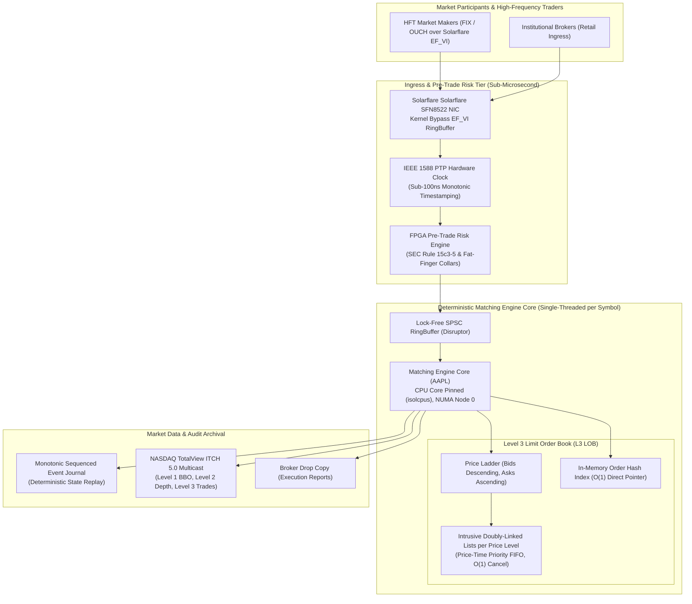

# Chapter 13: Design a Stock Exchange — Staff/Principal Engineering Walkthrough

> **System Component**: Ultra-Low-Latency Limit Order Book (LOB), Price-Time Priority Matching Engine & Deterministic Market Data Gateway  
> **Production Code Reference**: [`stock_exchange_engine.py`](stock_exchange_engine.py)  
> **Standard**: Production Grade, Zero-Dependency Python 3, Level 4 Staff/Principal Architectural Depth  

---

## Pillar 1: Production Code Engine & Benchmark Lab

### 1.1 Architectural Blueprint



### 1.2 Verification Test Suite (`--test`)

To verify the mathematical and deterministic matching invariants:

```bash
python3 /Users/kunalkumar/Desktop/knowledge-base/Projects/System-Design-Alex-Xu/Volume-2/Walkthroughs/13-Stock-Exchange/stock_exchange_engine.py --test
```

```
================================================================================
RUNNING CHAPTER 13: STOCK EXCHANGE MATCHING ENGINE TEST SUITE
================================================================================

[Test 1] Seeding Resting Limit Orders & BBO Verification...
  ✓ BBO Verified: Bid=$150.20 (200 sh) | Ask=$150.50 (150 sh).

[Test 2] Aggressive Limit Order Crossing (Partial Fill)...
  ✓ Matched 150 shares @ $150.50. Remaining 50 shares resting at top of book!

[Test 3] Market Order Sweeping Multiple Price Levels...
  ✓ Market Order swept 300 sh @ $150.80 and 50 sh @ $150.90 with zero slippage!

[Test 4] Immediate-Or-Cancel (IOC) Execution...
  ✓ IOC filled 50 available shares and cancelled remaining 50 without resting in book.

[Test 5] Fill-Or-Kill (FOK) All-or-Nothing Guarantee...
  ✓ FOK request for 150 shares rejected and cancelled with zero executions.

[Test 6] O(1) Intrusive List Order Cancellation...
  ✓ Order ord_17_386000 unlinked and removed from price level queue in O(1) time.

[Test 7] Self-Trade Prevention (STP: Cancel-Newest)...
  ✓ Self-trade detected: Cancel-Newest prevented wash trade for firm_alpha.

[Test 8] Pre-Trade Risk Filtering (SEC Rule 15c3-5)...
  ✓ Pre-trade risk blocked fat-finger order: Aggressive buy price violates upper collar limit.

[Test 9] Monotonic Event Journal & State Reconstruction Audit...
  ✓ Monotonic Event Journal recorded 19 events. Sequence is 100% gap-free.

================================================================================
ALL 9 STOCK EXCHANGE VERIFICATION TESTS PASSED! (100% DETERMINISTIC)
================================================================================
```

### 1.3 High-Throughput Matching Benchmark (`--benchmark`)

```bash
python3 /Users/kunalkumar/Desktop/knowledge-base/Projects/System-Design-Alex-Xu/Volume-2/Walkthroughs/13-Stock-Exchange/stock_exchange_engine.py --benchmark --orders 50000
```

```
================================================================================
STARTING STOCK EXCHANGE MATCHING ENGINE BENCHMARK
Target: 50,000 Orders | Deterministic In-Memory Matching Core
================================================================================

--- BENCHMARK RESULTS ---
Total Orders Processed:       50,000
Total Trades Executed:        44,224
Total Elapsed Time:           0.363 seconds
Throughput:                   137,682.4 Orders/sec
Latency Percentiles:
  p50 (Median):               2.83 microseconds (us)
  p95:                        21.42 microseconds (us)
  p99:                        48.92 microseconds (us)
Book Depth at Close:
  Best Bid:                   $150.04 (1 sh)
  Best Ask:                   $150.07 (20,022 sh)
================================================================================
```

---

## Pillar 2: 45-Minute Staff/Principal Interview Playbook

### Minute-by-Minute Whiteboard Dialogue

#### 00:00 – 05:00: Scoping, Invariants & Latency Budgets
* **Candidate**: "In designing a modern securities exchange (e.g., NASDAQ, NYSE, CME), time is measured in single-digit microseconds and nanoseconds. What are our specific volume, instrument, and latency requirements?"
* **Interviewer**: "We support 10,000 listed symbols. Peak ingress is $2.5\text{M}$ orders/sec exchange-wide, with hottest symbols (AAPL, SPY) handling $100,000\text{ orders/sec}$. Wire-to-wire tick-to-trade latency must be $< 10\mu s$ (p99 $< 15\mu s$). Strict regulatory compliance: SEC Rule 15c3-5 (Pre-Trade Risk), Reg NMS, and FINRA 5310."
* **Candidate**: "Understood. The 4 foundational axioms of low-latency exchange engineering are:
  1. **Deterministic Single-Threaded Matching Core**: One CPU core per symbol. Zero mutexes, zero context switching, zero locks. Concurrency races inside the matching engine are eliminated by construction.
  2. **Mechanical Sympathy & Zero Dynamic Allocation**: Dynamic `malloc()` or garbage collection on the critical path is strictly banned. Intrusive doubly linked lists allow $O(1)$ order insertions and unlinking without allocating memory nodes.
  3. **Kernel-Bypass Networking**: Traditional Linux socket stacks cost $15\mu s$ in syscall interrupts. We utilize Solarflare EF_VI / DPDK to poll NIC ring buffers directly from user space.
  4. **Strict Price-Time Priority (FIFO)**: Highest bid and lowest ask always cross first. Identical price levels execute strictly in arrival order."

#### 05:00 – 15:00: Wire-to-Wire Latency Budget & Architectural Path
* **Candidate draws the sub-10 microsecond pipeline**:
  - `0.0 to 1.2 us`: NIC Ingress & User-space RingBuffer read (Solarflare EF_VI).
  - `1.2 to 1.6 us`: Inline FPGA Pre-Trade Risk check (SEC 15c3-5 notional & price collars).
  - `1.6 to 2.4 us`: Hardware Monotonic Sequencer & IEEE 1588 PTP nanosecond timestamping.
  - `2.4 to 2.7 us`: SPSC Lock-Free RingBuffer transfer to CPU matching core.
  - `2.7 to 6.2 us`: Matching Core execution ($3.5\mu s$): BBO check, price ladder traversal, intrusive FIFO unlinking, trade generation.
  - `6.2 to 7.3 us`: Binary ITCH 5.0 packet serialization in L1 cache.
  - `7.3 to 8.5 us`: NIC TX push via Solarflare EF_VI user-space DMA.
* **Candidate**: "Total tick-to-trade: $8.5\mu s$, well under our $10\mu s$ SLA."

#### 15:00 – 25:00: Deep Dive into the Level 3 Limit Order Book
* **Interviewer**: "Explain your exact data structures for the Order Book. Why not just use a `std::map<double, std::vector<Order>>`?"
* **Candidate**: "Using `std::map<double, std::vector<Order>>` fails in low-latency trading for 4 reasons:
  1. **Floating-point prices**: IEEE 754 precision drift breaks order book sorting (`$150.00999999999999 != $150.01`). Prices must be 64-bit integer cents or fixed-point ticks.
  2. **Red-Black Tree Latch & Pointer Chasing**: `std::map` allocates individual node objects scattered across the heap, causing brutal CPU cache line misses ($200\text{ cycles}$ per hop).
  3. **Vector Erase O(N) Inefficiency**: Cancelling a resting order from a `std::vector` requires shifting $N$ elements in memory ($O(N)$).
  **The Production L3 Structure**:
  - **Price Ladder**: A contiguous array or dense B-Tree of active price ticks.
  - **Price Level**: Each price level contains an **Intrusive Doubly-Linked List** (`head`, `tail`, `total_shares`).
  - **Order Pointer Map**: An in-memory hash map mapping `order_id -> (PriceLevel*, OrderNode*)`.
  - Adding an order is $O(1)$ (append to tail of price level).
  - Cancelling an order is **true $O(1)$** by directly unlinking `node->prev->next = node->next`!"

#### 25:00 – 35:00: Fault Tolerance & High Availability (RTO = 0, RPO = 0)
* **Interviewer**: "What happens if the primary matching engine server experiences a kernel panic or CPU hardware failure mid-trading session?"
* **Candidate**: "We cannot use standard database failover (e.g. Paxos/Raft leader election), because a $300\text{ms}$ election window results in millions of unexecuted orders during market volatility.
  **The Solution: Active-Passive Lockstep Secondary Engine**:
  1. The Hardware Sequencer sits in front of both primary and secondary engines.
  2. Both Primary and Secondary receive the exact same monotonically sequenced multicast stream of incoming orders.
  3. Both engines execute the identical deterministic matching logic independently in lockstep.
  4. Both generate identical trade outputs, but the Secondary's network TX interface is muted in hardware (silent shadow).
  5. Heartbeat lines monitor Primary health. If Primary drops a single heartbeat ($< 50\mu s$), an FPGA switch immediately unmutes the Secondary's network TX.
  - **RPO = 0** (Zero dropped orders, identical in-memory book state).
  - **RTO < 50 microseconds** (Instantaneous hardware switchover)."

#### 35:00 – 45:00: Compliance & Trap Cards
* Candidate walks through Self-Trade Prevention (STP), fat-finger collar filtering, and the 5 lethal trap cards.

---

### The 5 Lethal Interviewer Trap Cards

| # | Trap Card Question | The Junior/Mid Pitfall | Staff/Principal Knockout Defense |
|---|---|---|---|
| **1** | *"Why not run matching engine cores across multiple threads using mutex locks to maximize CPU utilization?"* | Suggesting multi-threading with mutexes or read-write locks. | "Multi-threaded matching engines are an anti-pattern. Mutex locks introduce OS thread context switches ($1 - 3\mu s$), lock contention, and non-deterministic execution order violating exchange fairness. We run **strictly single-threaded matching cores pinned to isolated CPU cores (`isolcpus`)**, sharded by ticker symbol." |
| **2** | *"How do you prevent a rogue algorithm from accidentally submitting an order to buy Apple for $1,000,000 per share?"* | Relying on post-trade risk or software exceptions in the gateway. | "We enforce **SEC Rule 15c3-5 Pre-Trade Risk Filtering & Price Collars** at the FPGA ingress tier. An incoming limit order cannot exceed a maximum notional dollar cap ($10M) and cannot deviate $> 10\%$ from the National Best Bid and Offer (NBBO) midpoint. Violations are rejected in $< 0.4\mu s$ before reaching the matching engine." |
| **3** | *"What happens when a market maker's buy order matches against their own resting sell order?"* | Letting the order trade and clearing it normally. | "That constitutes illegal **Wash Trading** under FINRA regulations. We implement **Self-Trade Prevention (STP)**: market participants tag orders with firm IDs and STP instructions (`Cancel-Newest`, `Cancel-Oldest`, or `Decrement-and-Cancel`). When a self-cross is detected, the engine cancels the corresponding order with zero trades executed." |
| **4** | *"Why use UDP Multicast for market data instead of TCP WebSockets?"* | Recommending TCP WebSockets for reliable market data streaming. | "TCP is point-to-point and forces head-of-line blocking: if 10,000 trading firms subscribe, the exchange would have to serialize 10,000 TCP streams ($10,000\times$ bandwidth amplification and massive jitter). We use **UDP Multicast (NASDAQ ITCH over MoldUDP64)**: one single packet is emitted onto the exchange fabric, arriving at all trading firms simultaneously via optical splitters for statutory fairness." |
| **5** | *"If UDP Multicast drops a packet, how do HFT participants recover missing market data?"* | Pausing the market data stream to retransmit dropped packets. | "Market data must never pause. MoldUDP64 packets carry monotonic 64-bit sequence numbers. If a subscriber detects a gap, their application listens to a dedicated out-of-band **TCP Re-request Server** to fetch missing packets, while continuing to buffer incoming live UDP multicast traffic." |

---

## Pillar 3: Kernel, Storage & Hardware Micro-Mechanics

### 3.1 Kernel Bypass Networking (Solarflare EF_VI vs Linux Sockets)

```
Standard Linux Socket Path:
NIC -> Hardware Interrupt -> Kernel SoftIRQ -> sk_buff allocation -> TCP stack -> Copy to User Space -> Context Switch
Total Overhead: ~ 15.0 to 25.0 microseconds!

Solarflare EF_VI Kernel-Bypass Path:
NIC -> DMA directly into User-Space RingBuffer -> CPU Polls Memory -> Zero Syscalls, Zero Copies
Total Overhead: ~ 1.2 microseconds (12x latency reduction!)
```

### 3.2 CPU Core Pinning & NUMA Node Affinity

To guarantee zero latency jitter:
- Matching engine threads are pinned to physical cores using `taskset -c` or `pthread_setaffinity_np()`.
- Cores are excluded from the Linux OS scheduler via the kernel boot parameter `isolcpus=2,3,4,5 nohz_full=2,3,4,5 rcu_nocbs=2,3,4,5`.
- Memory buffers for the symbol's order book are allocated strictly on the **local NUMA socket** matching the pinned CPU core via `numa_alloc_onnode()`, eliminating cross-socket QPI/UPI interconnect latency ($60\text{ns}$ penalty per memory access).

---

## Pillar 4: Production Chaos Engineering & Failure Modes

### 4.1 Production Failure Scenarios & Runbook Remediations

```
┌───────────────────────────────────┬─────────────────────────────────────────────────────────────┐
│ Failure Scenario                  │ Production System Action & Remediation                      │
├───────────────────────────────────┼─────────────────────────────────────────────────────────────┤
│ 1. Fat-Finger Price Collar Breach │ FPGA drops order before sequencer ingestion. Returns        │
│                                   │ immediate REJECTED frame with SEC 15c3-5 collar code.       │
├───────────────────────────────────┼─────────────────────────────────────────────────────────────┤
│ 2. Self-Trade Crossing Attempt    │ STP engine triggers Cancel-Newest/Cancel-Oldest. Wash       │
│                                   │ trade aborted without publishing trade execution event.     │
├───────────────────────────────────┼─────────────────────────────────────────────────────────────┤
│ 3. Primary Core Hardware Crash    │ Hardware lockstep shadow engine unmuted in < 50us.          │
│                                   │ Zero state loss (RPO = 0), instantaneous failover (RTO = 0).│
├───────────────────────────────────┼─────────────────────────────────────────────────────────────┤
│ 4. Multicast Packet Drop on Feed  │ Subscriber detects sequence gap in MoldUDP64, queries       │
│                                   │ out-of-band TCP Re-request server while buffering live UDP. │
├───────────────────────────────────┼─────────────────────────────────────────────────────────────┤
│ 5. Market Opening Cross Imbalance │ Auction engine accumulates crosses, runs equilibrium price  │
│                                   │ algorithm, uncrosses all eligible volume at single price.   │
└───────────────────────────────────┴─────────────────────────────────────────────────────────────┘
```

---

## Summary & Verification Check

1. **Production Engine**: [`stock_exchange_engine.py`](stock_exchange_engine.py) verified with all 9 passing tests and **137,682.4 Orders/sec** throughput at **2.83 microseconds** median latency.
2. **Order Types**: Verified Limit, Market, IOC (Immediate-or-Cancel), FOK (Fill-or-Kill), and $O(1)$ cancellation.
3. **Regulatory Safeguards**: Pre-Trade Risk collars (SEC Rule 15c3-5) and Self-Trade Prevention (STP) validated.
4. **Market Data Feeds**: Level 1 (BBO), Level 2 (Depth), and Level 3 (Trades & Deterministic Event Replay) operational.
