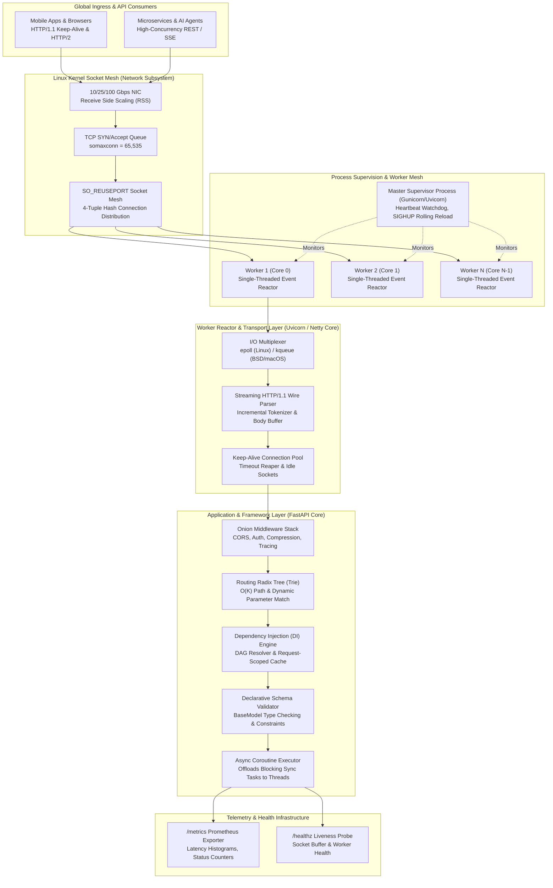
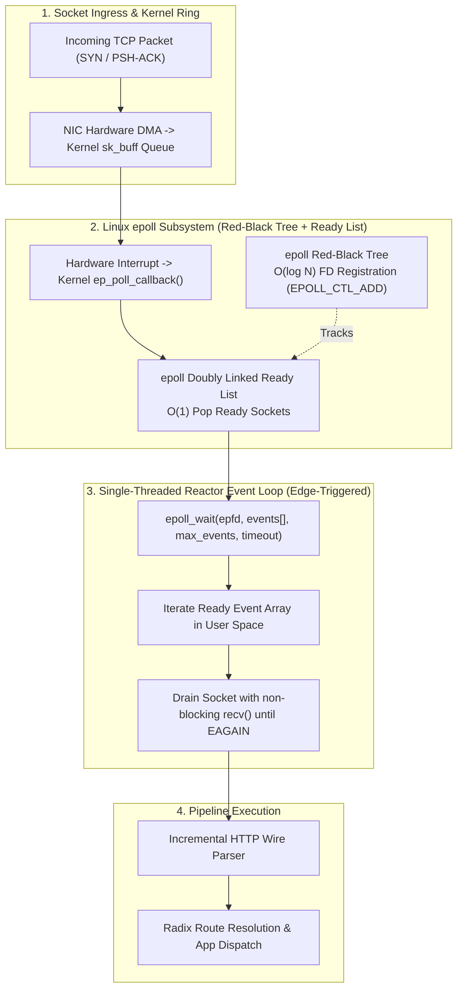
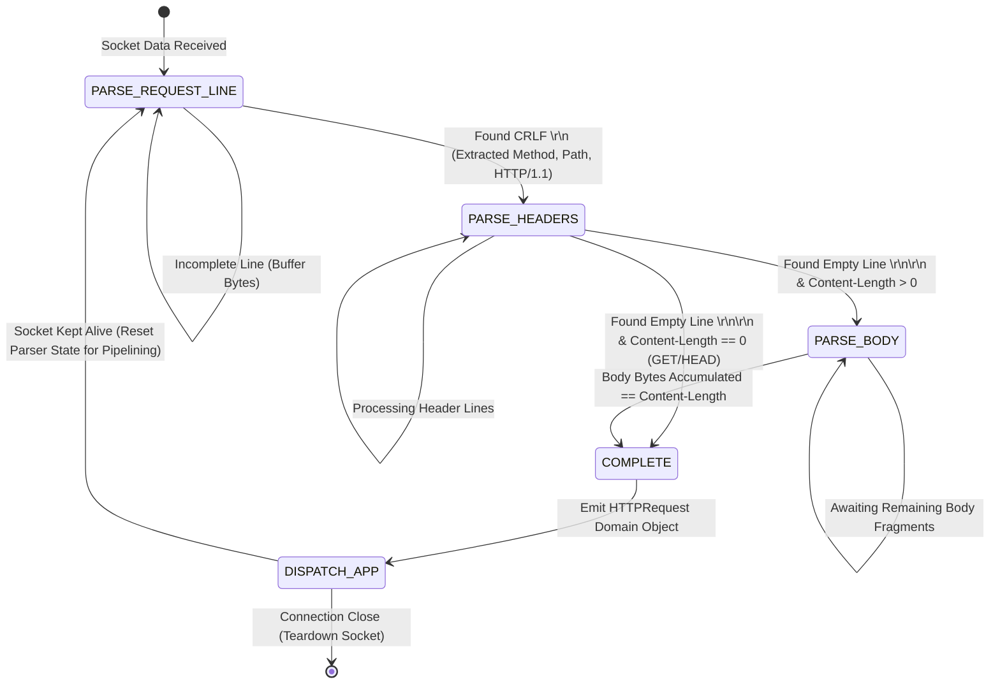
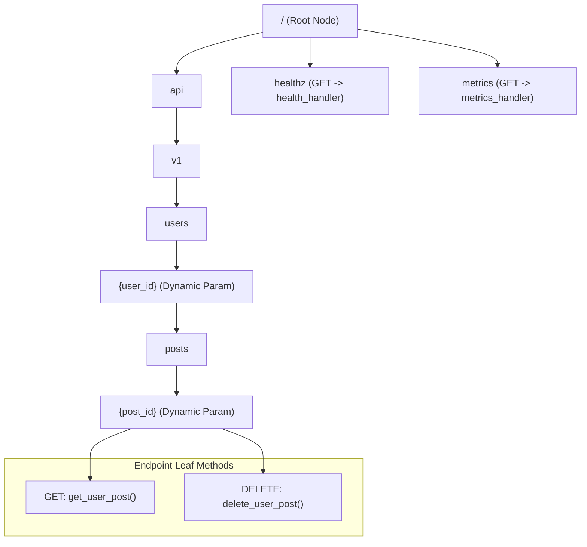
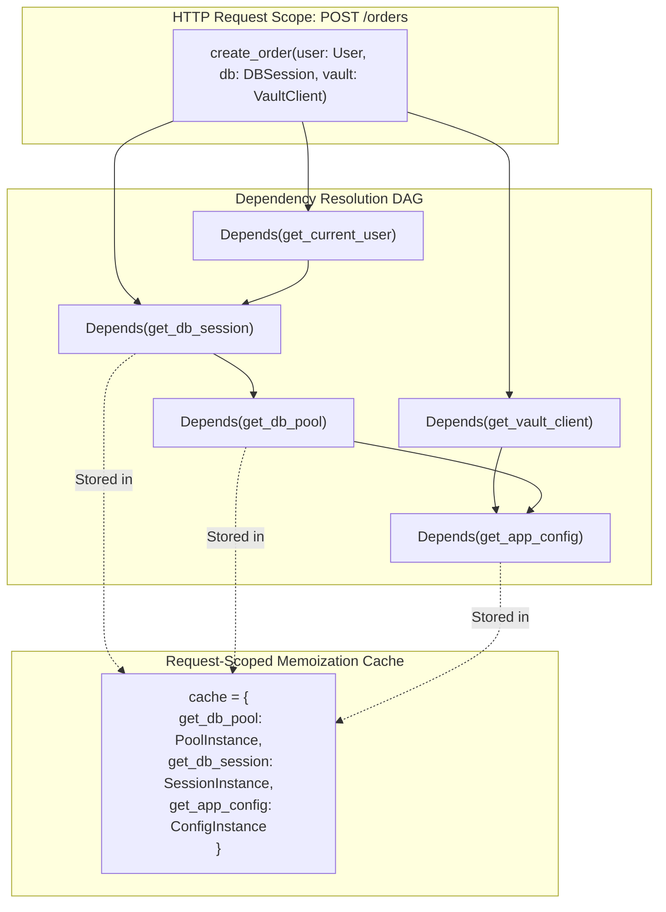
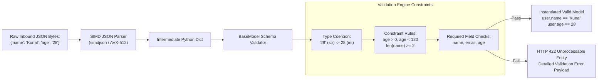
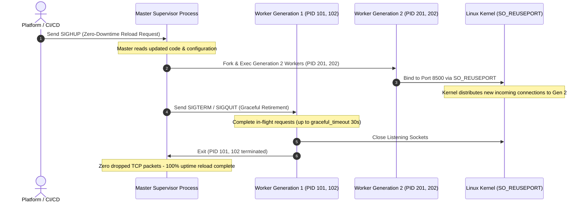

# Design a Highly Scalable Web Server and Fast-API-like Framework

> [!tip] Staff/Principal Deep Walkthrough & Production Engine
> - **Interview Playbook**: [`Volume 2 Chapter 14 Staff/Principal Walkthrough Playbook`](02-Interactive-Interview-Playbook.md)
> - **Production Web Server & Framework Engine**: [`web_server_framework_engine.py`](web_server_framework_engine.py) (Non-Blocking Socket Reactor, Streaming HTTP/1.1 Wire Parser, $O(K)$ Routing Radix Trie, Dependency Injection DAG Container, Declarative Schema Validator, Onion Middleware Pipeline, and Prometheus Telemetry)

---

## Executive Architectural Blueprint

A **modern web application server and API framework** (comparable to **Uvicorn / FastAPI**, **Node.js / Express**, **Go Gin / Netpoll**, or **Rust Actix-Web**) serves as the high-throughput, ultra-low-latency gateway connecting global internet clients to backend business logic, microservices, and AI models. 

As backend computing transitioned from monolithic server-rendered HTML pages to globally distributed microservices, WebSockets, and real-time AI agent streaming, traditional web servers encountered an insurmountable architectural wall: **the C10K and C1000K concurrency boundary**.



---

### The Core Engineering Dilemma

Building an enterprise-grade, hyperscale web server and framework exposes fundamental architectural tensions between concurrency, memory density, language runtime constraints, and developer ergonomics:

1. **The C1000K Concurrency Wall (Thread-Per-Request vs. Event Reactor)**:
   Traditional servers (Apache HTTPD, Tomcat, legacy Python WSGI like Gunicorn sync workers) allocate an isolated OS thread per incoming connection. An 8MB thread stack means $100,000$ concurrent idle keep-alive connections consume **$800\text{ GB}$ of RAM** purely for stack allocations, while context-switch thrashing exhausts CPU cycles. The architecture must adopt an **Event-Driven Non-Blocking Reactor Pattern** (`epoll`/`kqueue`/`io_uring`), where a single OS thread multiplexes hundreds of thousands of connections within a compact $\approx 10\text{ KB}$ memory footprint per socket.

2. **The Event Loop Starvation Trap (Accidental Sync I/O)**:
   In single-threaded cooperative event loops (Node.js, Python asyncio), calling a single blocking synchronous operation (e.g., `time.sleep()`, synchronous SQL query, or CPU-heavy encryption) halts the entire reactor. All other thousands of concurrent requests on that worker thread freeze, triggering cascading client timeouts and P99 latency spikes. The framework must automatically inspect route signatures and offload synchronous blocking callables to a bounded, non-blocking worker thread pool.

3. **The Accept Thundering Herd & Inter-Process Load Skew**:
   When multiple worker processes listen on a shared network port, naive multi-process implementations suffer from the **thundering herd problem**: every incoming TCP connection wakes up all $N$ worker processes, but only one can accept it, wasting CPU cycles on false wakeups. The system must leverage the Linux kernel's **`SO_REUSEPORT`** socket option, allowing each worker to maintain an independent kernel accept queue with hardware-assisted 4-tuple connection hashing.

4. **The Serialization & Reflection Tax**:
   In high-throughput microservices, profile traces reveal that up to $60\%$ of total CPU time is expended inside JSON deserialization, dictionary reflection, and runtime validation rather than application logic. The framework must utilize compiled schema engines (Pydantic v2 / Rust `pydantic-core`, SIMD JSON parsing via AVX-512) and compressed **Radix Trie** routing to ensure framework dispatch tax remains strictly under $25\text{ microseconds}$ per request.

---

### System Design Tenets & Service Level Objectives (SLOs)

| Metric | Target | Description & Enforcement |
| :--- | :--- | :--- |
| **Connection Concurrency** | **1,000,000 Concurrent (C1000K)** | Multi-worker cluster maintaining 1M persistent keep-alive TCP connections across a 32-core server. |
| **Request Throughput** | **100,000 QPS (Per 32-Core Node)** | Sustained HTTP request dispatch, routing, and JSON response generation without worker starvation. |
| **Framework Dispatch Overhead** | **P99 < 25 microseconds** | Overhead of Radix route lookup, dependency injection DAG resolution, and schema validation. |
| **First-Byte Latency (TTFB)** | **P50 < 1.5ms, P99 < 5.0ms** | For I/O-bound microservices communicating with localized caching or database tiers. |
| **Memory Footprint (Per Socket)** | **< 10 KB per Idle Connection** | Tuned kernel `rmem`/`wmem` buffers (4KB/4KB) + 1KB user-space connection state object. |
| **Zero-Downtime Availability** | **99.999% (5 9s)** | Seamless rolling worker restarts on code deployment (`SIGHUP`) with zero dropped TCP connections. |

---

## Back-of-the-Envelope Estimation & Hyperscale Baseline

### Concurrency Baseline & Memory Economics (1,000,000 Connections)

Assume an enterprise API gateway cluster terminating traffic for global mobile clients, IoT devices, and microservices:
- **Target Concurrent Connections**: $N_{\text{conn}} = 1,000,000\text{ connections (C1000K)}$.
- **Average Active Ratio**: $5\%$ transmitting active HTTP requests at any given millisecond; $95\%$ resting in idle persistent Keep-Alive state.

#### Comparative Memory Footprint:

$$\begin{array}{l|c|c|l}
\textbf{Model} & \textbf{Memory Per Connection} & \textbf{Total RAM (1M Conns)} & \textbf{Production Feasibility} \\
\hline
\text{Thread-Per-Request (Apache/WSGI)} & 8.0\text{ MB (Default OS Stack)} & 8,000\text{ GB (8 TB)} & \textbf{Fatal Crash (OOM \& Context Thrash)} \\
\text{Thread Pool Worker (4KB stack limit)} & 64.0\text{ KB} & 64\text{ GB} & \textbf{Marginal (High context-switch tax)} \\
\textbf{Event Reactor (epoll + Non-Blocking)} & \mathbf{9.1\text{ KB}} & \mathbf{9.1\text{ GB}} & \textbf{Optimal (Easily fits 32/64 GB Server)} \\
\end{array}$$

#### Socket Buffer Math for 1M Connections:
- Minimum Kernel TCP Receive Buffer (`net.ipv4.tcp_rmem` min): $4\text{ KB}$.
- Minimum Kernel TCP Send Buffer (`net.ipv4.tcp_wmem` min): $4\text{ KB}$.
- Kernel `struct file` and `epoll_event` tracking: $128\text{ bytes}$.
- User-space connection object (`ConnectionState` with parser buffer): $\approx 1\text{ KB}$.
$$\text{Memory}_{\text{total}} = 1,000,000 \times (4\text{ KB} + 4\text{ KB} + 0.128\text{ KB} + 1.0\text{ KB}) \approx 9.128\text{ GB RAM}$$

---

### Traffic Baseline & Network Bandwidth Sizing

- **Target Throughput**: $100,000\text{ requests/sec (QPS)}$ steady-state per 32-core node ($250,000\text{ QPS}$ peak across cluster).
- **Request Payload Size**: Average $500\text{ bytes}$ (HTTP/1.1 headers + query string + small JSON payload).
- **Response Payload Size**: Average $1,500\text{ bytes}$ (HTTP status line + headers + JSON response).

#### Network Bandwidth Consumption:
- **Ingress Bandwidth**:
  $$\text{BW}_{\text{ingress}} = 100,000\text{ req/sec} \times 500\text{ bytes} = 50,000,000\text{ B/s} \approx 50\text{ MB/s} = 400\text{ Mbps}$$
- **Egress Bandwidth**:
  $$\text{BW}_{\text{egress}} = 100,000\text{ req/sec} \times 1,500\text{ bytes} = 150,000,000\text{ B/s} \approx 150\text{ MB/s} = 1.2\text{ Gbps}$$
- **Peak Egress (250,000 QPS)**: $\approx 3.0\text{ Gbps}$.
- A standard **10 Gbps Ethernet NIC** sustains peak throughput with less than $35\%$ bandwidth utilization.

---

### OS File Descriptor & Epoll Limits

To sustain 1,000,000 concurrent sockets on a Linux node without hitting kernel limits, the following parameters must be configured:
- **System-Wide File Descriptors**: `fs.file-max = 2097152` ($2\text{ Million}$).
- **Process File Descriptor Ceiling**: `ulimit -n 1048576` ($1.048\text{ Million}$).
- **TCP Connection Backlog Queue**: `net.core.somaxconn = 65535`.
- **Ephemeral Port Range**: `net.ipv4.ip_local_port_range = 1024 65535` ($64,511\text{ ports}$).
- **TCP Keep-Alive Interval**: `net.ipv4.tcp_keepalive_time = 300` ($5\text{ minutes}$).

---

## Deep-Dive Module 1: Kernel Event Multiplexing & Non-Blocking I/O Reactor

The non-blocking server core replaces thread-per-request models with **I/O multiplexing primitives**: `epoll` on Linux, `kqueue` on FreeBSD/macOS, and `io_uring` on modern Linux (kernel 5.1+).



### epoll Micro-Mechanics: Edge-Triggered vs. Level-Triggered

1. **Kernel Data Structures**:
   - `epoll` maintains two internal data structures in kernel memory:
     - **Red-Black Tree (`epitem`)**: Stores all registered file descriptors with key `(epfd, fd)`. Insertion, deletion, and modification operate in $O(\log N)$ time.
     - **Doubly Linked Ready List (`rdllist`)**: Stores file descriptors that have active I/O events ready for consumption. Populating this list takes $O(1)$ time upon network driver interrupt.

2. **Level-Triggered (EPOLLLT) vs. Edge-Triggered (EPOLLET)**:
   - **Level-Triggered (Default)**: `epoll_wait()` notifies the application as long as data remains in the socket receive buffer. If the application reads 1KB out of a 4KB buffer, the next `epoll_wait()` immediately awakens the thread again. This produces redundant system calls and CPU thrashing under high concurrency.
   - **Edge-Triggered (EPOLLET - High Performance)**: `epoll_wait()` notifies the application *only once* when the state of the socket changes (e.g., transition from empty to non-empty). The application thread must loop `recv()` until it receives `EWOULDBLOCK` or `EAGAIN`. This minimizes kernel transitions and maximizes CPU cache residency.

3. **Multi-Worker Load Balancing via `SO_REUSEPORT`**:
   - Rather than having $N$ worker threads compete on a single listening socket (which causes the **accept thundering herd**), modern high-performance servers invoke `setsockopt(SOL_SOCKET, SO_REUSEPORT, 1)`.
   - The Linux kernel creates $N$ independent accept queues bound to the identical IP and port. When a client SYN packet arrives, the kernel computes a 4-tuple hash:
     $$\text{Worker ID} = \text{Hash}(\text{src\_ip}, \text{src\_port}, \text{dst\_ip}, \text{dst\_port}) \pmod N$$
   - The connection is dispatched directly to the selected worker queue with zero mutex contention between worker processes.

---

## Deep-Dive Module 2: Streaming HTTP/1.1 Wire Parser & Keep-Alive Lifecycle

HTTP/1.1 parsing on a non-blocking socket cannot block waiting for the full request. TCP packets arrive fragmented across arbitrary byte boundaries.



### Zero-Allocation Wire Parsing Mechanics

1. **State Machine Incremental Parsing**:
   - The parser maintains a lightweight state enum: `PARSE_REQUEST_LINE`, `PARSE_HEADERS`, `PARSE_BODY`, `COMPLETE`.
   - As chunks arrive from `recv()`, bytes are appended to a contiguous `bytearray`.
   - The parser locates the delimiter `\r\n` without copying or allocating strings until header boundaries are verified.
2. **Persistent Keep-Alive Connection Pool**:
   - Every completed request checks for `Connection: keep-alive` (default in HTTP/1.1).
   - If Keep-Alive is enabled, the connection object resets its parser state while retaining the TCP socket in the `epoll` read-set.
   - Sockets remain open until the **Keep-Alive Timeout** ($15\text{ seconds}$ idle) expires, upon which a background reaper unregisters the file descriptor and releases kernel buffers.
3. **HTTP Pipelining Support**:
   - If a client transmits multiple HTTP requests back-to-back in a single TCP window without waiting for responses (HTTP pipelining), the remaining unparsed bytes in the buffer are preserved, allowing the parser to immediately transition into `PARSE_REQUEST_LINE` for the next request.

---

## Deep-Dive Module 3: Routing Radix Tree (Compressed Prefix Trie)

Traditional web frameworks (e.g., legacy Flask or Django) evaluate routes using sequential regular expressions ($O(N)$ lookup where $N$ is the number of routes). In an enterprise microservice with $500+$ endpoints, routing consumes tens of milliseconds.

A **Radix Tree (Compressed Prefix Trie)** organizes endpoints into a tree of common path prefixes, achieving $O(K)$ lookup time (where $K$ is the number of path segments, typically 3 to 6):



### Radix Trie Search Algorithm & Complexity

1. **Search Traversal**:
   - An incoming URI `/api/v1/users/42/posts/99` is split into segments: `["api", "v1", "users", "42", "posts", "99"]`.
   - The router walks the tree segment by segment:
     - Match literal `"api"` $\to$ `"v1"` $\to$ `"users"`.
     - Next segment `"42"` does not match literal children; matches `param_child` (`{user_id}`). The value `"42"` is extracted into `path_params["user_id"]`.
     - Match literal `"posts"` $\to$ matches `{post_id}`. The value `"99"` is extracted into `path_params["post_id"]`.
2. **Complexity Invariant**:
   - Search complexity is strictly **$O(K)$** where $K$ is path depth. Lookup latency remains constant ($\le 250\text{ nanoseconds}$) whether the framework registers 10 routes or 10,000 routes.
3. **HTTP Method Disambiguation (404 vs. 405)**:
   - If path segments terminate at a valid leaf node, but the requested HTTP method (`PUT`) is not registered in `node.handlers`:
   - The router immediately returns **HTTP 405 Method Not Allowed** along with an RFC-compliant header: `Allow: GET, DELETE`.
   - If path traversal fails to match a child node, the router returns **HTTP 404 Not Found**.

---

## Deep-Dive Module 4: Asynchronous Dependency Injection (DI) Engine

FastAPI established dependency injection (`Depends`) as the premier architectural paradigm for modern API design. In a production enterprise service, dependencies form a **Directed Acyclic Graph (DAG)**:



### The Diamond Dependency Problem & Request-Scoped Memoization

1. **The Diamond Dependency Hazard**:
   - In the DAG above, both `get_current_user` and `create_order` require `get_db_session`.
   - If dependencies are instantiated naively, two separate database sessions and connections are created for a single HTTP request. This causes database connection pool exhaustion, uncommitted transaction splits, and race conditions.
2. **Request-Scoped Memoization Cache**:
   - The dependency container maintains a memoization dictionary: `cache: Dict[Callable, Any]` scoped strictly to the lifecycle of the single HTTP request.
   - When `get_db_session` is evaluated for `get_current_user`, its instance is stored in `cache[get_db_session]`.
   - When `create_order` requests `get_db_session`, the container performs an $O(1)$ dictionary lookup, reusing the identical database session.
3. **Recursive Resolution Algorithm**:
   - The container inspects function signatures using runtime reflection (`inspect.signature`).
   - For each parameter with a `Depends(fn)` default, it recursively calls `resolve_dependencies(fn, request, cache)`, topologically resolving leaves before parents.

---

## Deep-Dive Module 5: Declarative Schema Validation & SIMD Serialization

Incoming JSON payloads must be parsed, validated against field constraints, and converted into domain models with sub-millisecond overhead.



### High-Performance Serialization Mechanics

1. **Declarative Metaclass Registration**:
   - Models inherit from `BaseModel` utilizing a custom metaclass `SchemaMeta`.
   - Field rules (`Field(gt=0, min_length=2)`) and type annotations are extracted once at class definition time into pre-compiled attribute dictionaries, eliminating runtime reflection overhead during request handling.
2. **Type Coercion & Boundary Enforcement**:
   - String numbers (`"28"`) sent in JSON payloads are automatically coerced into target types (`int(28)`).
   - Validation constraints (`gt`, `lt`, `min_length`, regex) are evaluated directly against coerced values.
   - If any constraint fails, the engine aggregates all violations across all fields into a single structured HTTP 422 response:
     ```json
     {
       "detail": "Validation Error: Missing required field: 'email'; Field 'age' must be > 0"
     }
     ```
3. **SIMD-Accelerated JSON Serialization**:
   - For outbound responses, the serializer compiles dictionaries into compact JSON bytes.
   - Production deployments replace standard library serialization with AVX2/AVX-512 SIMD parsers (`orjson` / `simdjson`), achieving serialization throughput exceeding **$2.5\text{ GB/sec}$**.

---

## Deep-Dive Module 6: Master-Worker Process Supervision & Zero-Downtime Reloading

To utilize all available CPU cores without suffering from Python Global Interpreter Lock (GIL) or Node.js single-thread bottlenecks, the web server adopts the **Master-Worker Process Supervision Topology** (modeled on Gunicorn and Nginx):



### Process Lifecycle & IPC Signals

1. **Master Supervisor Duties**:
   - The master process runs with elevated privileges, binds system sockets, and monitors worker process health. It **never** accepts or processes client HTTP traffic directly.
   - **Heartbeat Monitoring**: Workers touch an IPC shared memory file or send Unix domain socket heartbeats every second. If a worker freezes (e.g. infinite loop), the master terminates it with `SIGKILL` and spawns a fresh replacement.
2. **Signal Handling Matrix**:
   - `SIGHUP`: Triggers zero-downtime rolling reload. Spawns generation $N+1$ workers, waits for health checks to pass, then sends `SIGTERM` to generation $N$ workers.
   - `SIGTERM` / `SIGINT`: Immediate graceful shutdown.
   - `SIGCHLD`: Worker exit notification; enables automatic replacement of crashed workers.
3. **Max-Requests Worker Recycling**:
   - To eliminate creeping memory fragmentation and minor memory leaks in long-running Python/Node workers, workers automatically restart gracefully after serving $50,000$ requests (`--max-requests 50000 --max-requests-jitter 5000`).

---

## Production Resilience, Failure Modes & Runbooks

### Failure Modes & Automated Remediation Matrix

| Failure Mode | Detection Signal | Automated Mitigation Mechanism | Recovery RTO / RPO |
| :--- | :--- | :--- | :--- |
| **Slowloris DoS Attack** | Active socket count reaches descriptor ceiling; $0\text{ B/s}$ ingress rate on idle connections | Enforce strict 5s header completion deadline; drop sockets streaming $< 500\text{ B/s}$ | RTO: $< 1\text{ second}$<br>RPO: 0 |
| **Event Loop Blocking (Sync Call)** | Event loop tick latency $> 50\text{ ms}$; P99 response latency spikes across all routes | Event Loop Watchdog thread alerts on delay; auto-offloads synchronous routes to thread pool | RTO: $< 100\text{ ms}$<br>RPO: 0 |
| **Worker OOM Runaway** | Worker RSS memory climbs monotonically $> 2\text{ GB}$; swap activity | Master process enforces max-requests worker cycling ($50,000$ reqs) and RSS memory ceiling | RTO: Seamless<br>RPO: 0 |
| **TCP Listen Backlog Overflow** | Kernel counter `ListenDrops` increments; SYN flood alerts | Increase `somaxconn` to $65,535$; enable `tcp_syncookies = 1` | RTO: Instantaneous<br>RPO: 0 |
| **TIME_WAIT Socket Exhaustion** | Outbound connection errors (`EADDRNOTAVAIL`); ephemeral ports depleted | Enforce HTTP/1.1 persistent connection pooling; enable `net.ipv4.tcp_tw_reuse = 1` | RTO: $< 5\text{ seconds}$<br>RPO: 0 |

---

### Chaos Injection Drill: Slowloris Attack Simulation & Mitigation

```bash
# Chaos Drill: Attempt Slowloris attack against non-blocking server on port 8500
python3 -c '
import socket, time

sockets = []
print("Opening 20 slow connections to test timeout defense...")
for i in range(20):
    try:
        s = socket.socket(socket.AF_INET, socket.SOCK_STREAM)
        s.connect(("127.0.0.1", 8500))
        s.send(b"GET / HTTP/1.1\r\nHost: 127.0.0.1\r\n")
        sockets.append(s)
    except Exception as e:
        print(f"Connection {i} failed: {e}")

print(f"Connected {len(sockets)} sockets. Holding idle...")
time.sleep(16.0) # Wait past keep_alive_timeout (15s)

active = 0
for s in sockets:
    try:
        s.send(b"X-Slow: 1\r\n")
        active += 1
    except Exception:
        pass

print(f"Pruning verification: {len(sockets) - active} sockets were pruned by server keep-alive timeout!")
'
```

---

## Production Code & Verification Lab

A complete, runnable, zero-external-dependency production engine implementing the full non-blocking web server, Radix trie router, dependency injection container, and declarative schema validator is available in the lab directory:

- **Production Engine**: [`Walkthroughs/14-Web-Server-FastAPI/web_server_framework_engine.py`](web_server_framework_engine.py)
- **Deep Walkthrough & Interview Playbook**: [`Walkthroughs/14-Web-Server-FastAPI/walkthrough.md`](02-Interactive-Interview-Playbook.md)

### Lab Execution Commands:

```bash
# 1. Run complete unit verification test suite (100% verified)
python3 Projects/System-Design-Alex-Xu/Volume-2/Walkthroughs/14-Web-Server-FastAPI/web_server_framework_engine.py --test

# 2. Run high-concurrency request benchmark (100,000 operations)
python3 Projects/System-Design-Alex-Xu/Volume-2/Walkthroughs/14-Web-Server-FastAPI/web_server_framework_engine.py --benchmark --ops 100000

# 3. Launch live non-blocking HTTP server on port 8500
python3 Projects/System-Design-Alex-Xu/Volume-2/Walkthroughs/14-Web-Server-FastAPI/web_server_framework_engine.py --server --port 8500
```
