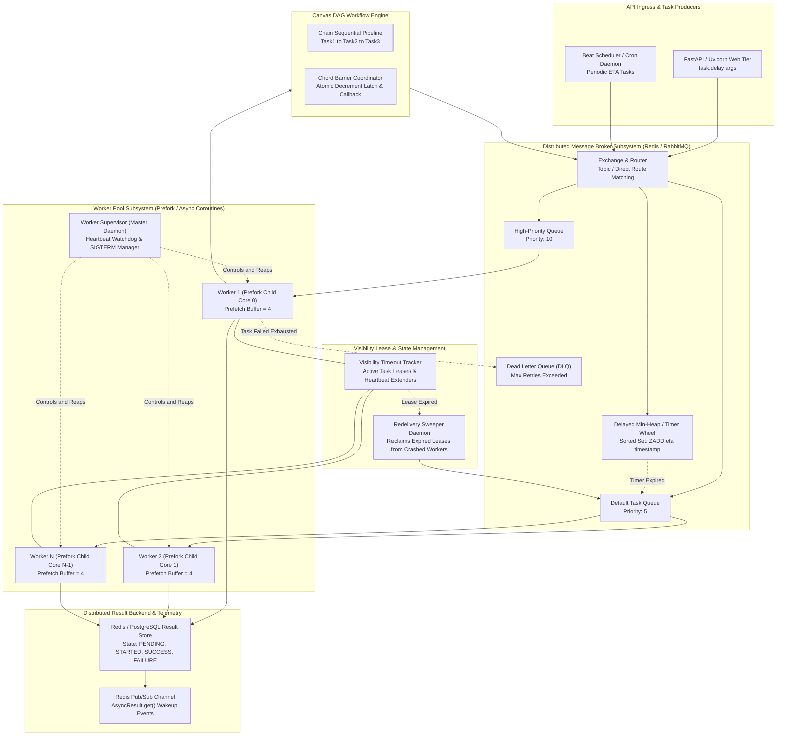
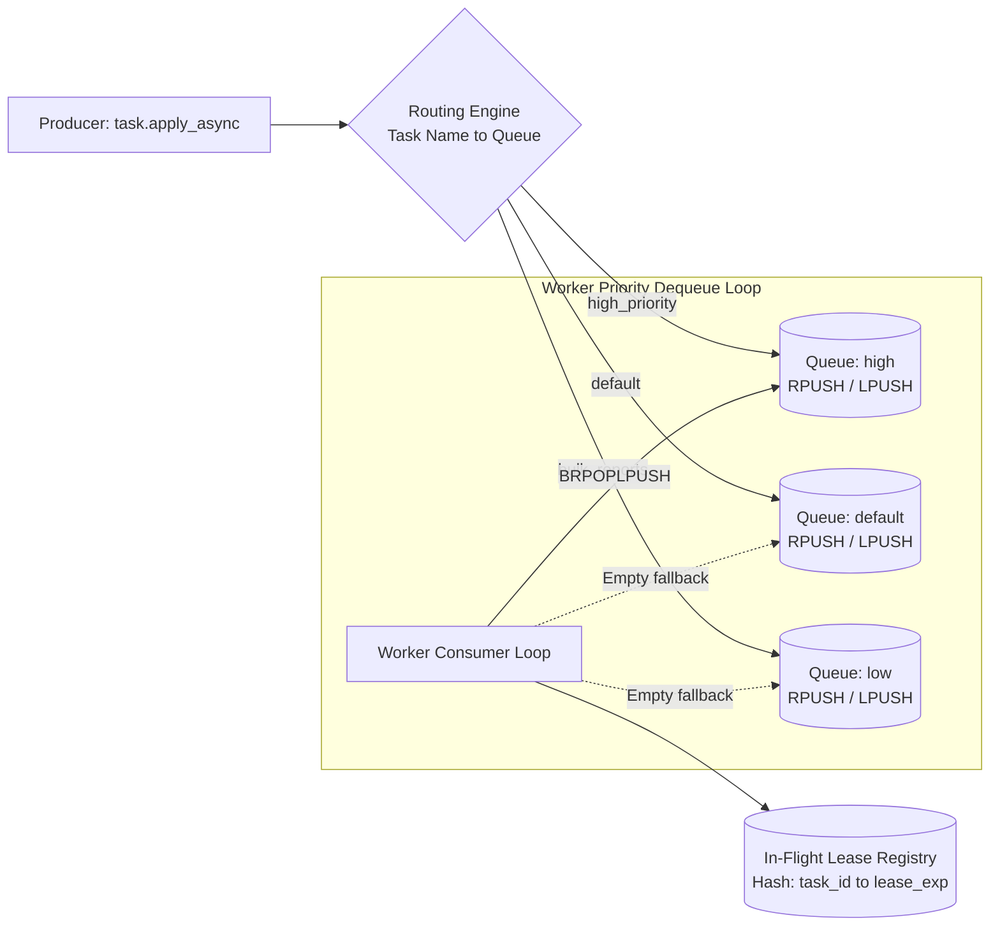
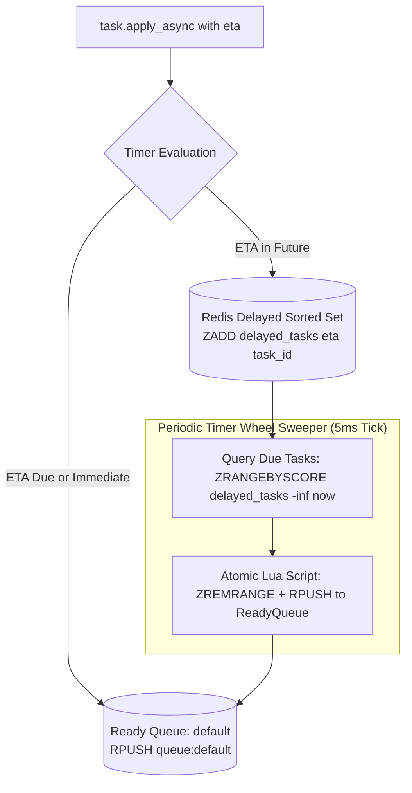
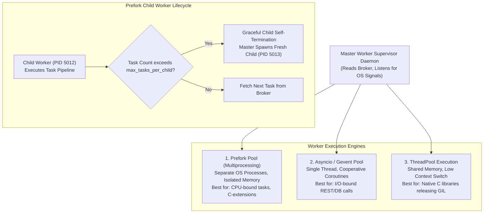
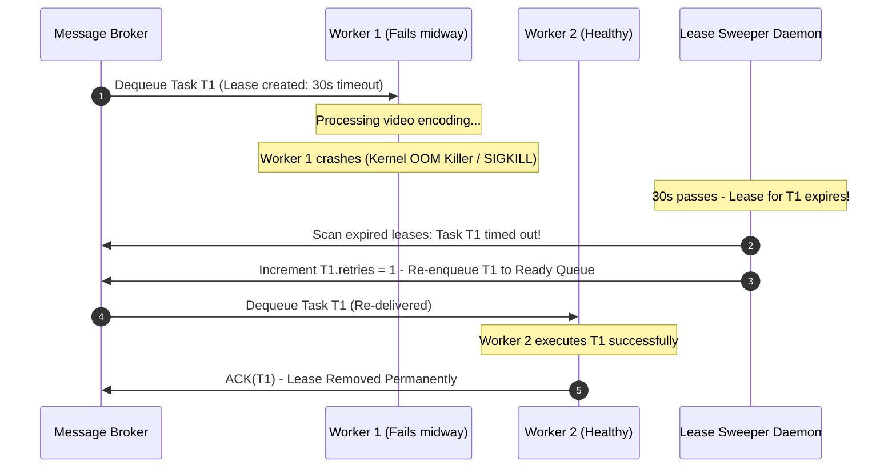
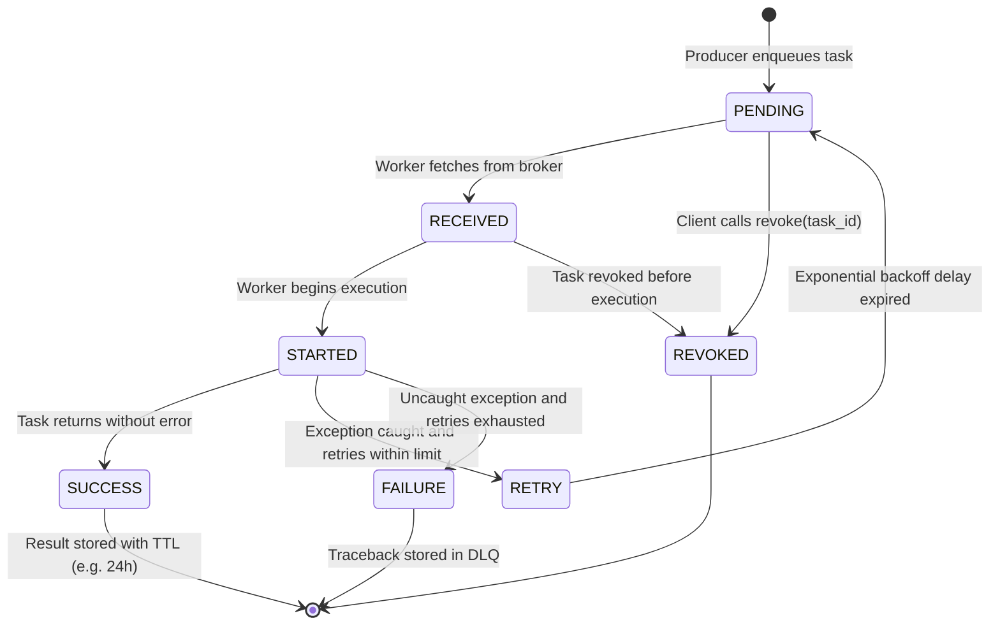
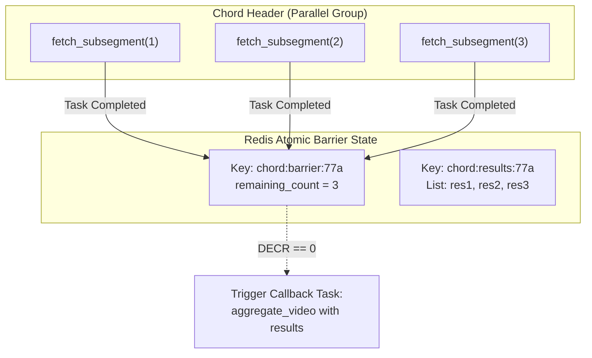

> [!TIP]
> 🚀 **Deep Walkthrough & Production Engine Available**: A comprehensive Staff/Principal-level deep walkthrough with an end-to-end Python code engine, benchmark lab (59.7k Tasks/sec @ 16.73 µs), interview playbook with 5 lethal traps, worker IPC/kernel mechanics, and chaos drills is available at:
> - **Walkthrough & Playbook**: [`Walkthroughs/15-Distributed-Task-Queue/walkthrough.md`](02-Interactive-Interview-Playbook.md)
> - **Production Code Engine**: [`Walkthroughs/15-Distributed-Task-Queue/task_queue_engine.py`](task_queue_engine.py)

---

## Executive Architectural Blueprint

A **Distributed Task Queue & Job Execution Framework** (comparable to **Celery**, **Sidekiq**, **BullMQ**, or **Temporal Core**) decouples synchronous client-facing web servers from resource-intensive, long-running, or scheduled asynchronous operations (such as video transcoding, ML model inference batching, payment reconciliation, email delivery, and distributed data pipelines).

Unlike log-based commit streaming platforms (such as Apache Kafka) which organize immutable append-only message offsets consumed by independent consumer groups, a **Task Queue is an asynchronous work-distribution and state-coordination engine**. It provides point-to-point task claiming, visibility timeouts, delayed execution timers, dynamic retries with exponential backoff, dead-letter quarantine, distributed execution state tracking, and complex DAG workflow orchestration (chains, groups, and barrier-synchronized chords).



---

## The Core Engineering Dilemma

Designing an enterprise-grade distributed task queue requires resolving four fundamental engineering trade-offs:

1. **Push vs. Pull Broker Delivery & Consumer Prefetch**:
   - *Push (Broker-driven, e.g. AMQP/RabbitMQ)*: Broker delivers tasks immediately to connected workers. If worker prefetch is untuned (`prefetch_count=0` or default unbound), a single worker can hoard 10,000 tasks into its local RAM while other workers sit completely idle.
   - *Pull (Worker-driven, e.g. Redis `BRPOPLPUSH` / SQS)*: Workers pull tasks strictly when execution capacity becomes available. Pull reduces starvation and hot-spotting, but introduces polling latency and broker CPU overhead.
2. **At-Least-Once Execution vs. Visibility Timeout Hazard**:
   - If a worker acknowledges tasks *before* execution (`ack_late=False`), any subsequent worker crash or `SIGKILL` causes silent data loss.
   - If a worker acknowledges *after* execution (`ack_late=True`), long-running tasks exceeding the visibility timeout lease will be reclaimed by the broker and dispatched to a second worker, resulting in duplicate concurrent execution unless backed by distributed heartbeating or idempotent execution keys.
3. **Immediate Dispatch vs. High-Precision Delayed Scheduling (ETA / Countdown)**:
   - Storing delayed tasks directly in FIFO ready queues blocks immediate tasks behind scheduled ones.
   - High-performance architectures segregate delayed tasks into **Min-Heap Timer Wheels** or Redis Sorted Sets (`ZADD delayed_tasks <epoch_eta> <task_id>`), atomically polling and promoting due tasks with sub-millisecond precision using atomic Lua scripts.
4. **Independent Task Decoupling vs. Stateful Workflow Barriers (Canvas Chains & Chords)**:
   - Standalone tasks are stateless. However, enterprise workloads require distributed DAG orchestrations:
     - **Chains**: Passing outputs of Task $A$ into Task $B$.
     - **Chords**: Scatter-gather barrier patterns where $M$ parallel tasks must all complete before triggering a single aggregator callback. The coordinator must track atomic completion without central lock contention.

---

## System Design Tenets & Service Level Objectives (SLOs)

| Tenet | Metric / Objective | Engineering Target | Architectural Mechanism |
| :--- | :--- | :--- | :--- |
| **Ingress Latency** | Task Enqueue P99 | **$< 1.0\text{ ms}$** | Lightweight Redis pipelined push (`RPUSH`) or AMQP direct exchange dispatch. |
| **Scheduling Precision** | Delayed Task Drift | **$< 10\text{ ms}$** | Min-Heap timer loop / Redis `ZRANGEBYSCORE` sweeper running on 5ms ticks. |
| **Throughput** | Cluster Dispatch Rate | **$> 100,000\text{ tasks/sec}$** | Multi-worker prefork processes, zero contention atomic queues, pipelined batch ACKs. |
| **Durability** | Task Loss Invariant | **$0.000\%$** | Two-phase delivery lease: In-flight tracking (`RPOPLPUSH`), Acks sent strictly upon task exit. |
| **Worker Isolation** | Memory Leak Containment | **Deterministic Recycling** | Master supervisor recycles child workers after `max_tasks_per_child=1000` executions. |
| **Failure Quarantine** | Poison Pill Isolation | **Bounded Retries -> DLQ** | Exponential backoff with full jitter; auto-route to Dead Letter Queue on retry exhaustion. |

---

## Back-of-the-Envelope Estimation

### Workload Scale & Compute Math
- **Target Throughput**: $100,000\text{ tasks/sec}$ continuous ingress; $250,000\text{ tasks/sec}$ peak burst.
- **Average Task Payload**: $1\text{ KB}$ (serialized JSON envelope: UUID, function name, positional args, keyword kwargs, tracing context).
- **Task Ingress Bandwidth**:
  $$\text{Bandwidth} = 100,000 \times 1\text{ KB} = 100\text{ MB/sec} = 800\text{ Mbps}$$
- **Daily Task Volume**:
  $$\text{Daily Ingestion} = 100,000 \times 86,400 \approx 8.64\text{ Billion tasks/day}$$

### Broker In-Memory Sizing (Redis / DRAM)
- Suppose tasks have an average execution duration of $2.0\text{ seconds}$.
- At $100,000\text{ tasks/sec}$, active in-flight buffer capacity required:
  $$\text{In-Flight Buffer} = 100,000\text{ tasks/sec} \times 2.0\text{ sec} = 200,000\text{ active tasks}$$
- At $1\text{ KB}$ payload $+ 512\text{ bytes}$ metadata per task:
  $$\text{DRAM Footprint} = 200,000 \times 1.5\text{ KB} = 300\text{ MB RAM}$$
- Even during a major downstream service outage with a 30-minute queue backlog:
  $$\text{Backlog Volume} = 100,000 \times 1,800\text{ sec} = 180,000,000\text{ tasks}$$
  $$\text{Backlog DRAM} = 180\text{M} \times 1.5\text{ KB} = 270\text{ GB RAM}$$
  *(Horizontally sharded across a 10-node Redis Cluster with 32 GB RAM per node)*.

### Worker Fleet Sizing
- If average task CPU runtime is $50\text{ ms}$:
  $$\text{Required Worker Cores} = 100,000\text{ tasks/sec} \times 0.05\text{ sec} = 5,000\text{ vCPUs}$$
- Organized into $156$ worker instances with $32\text{ vCPUs}$ each.

---

## Deep-Dive Module 1: Broker Abstraction & Ingestion Transport

The message broker acts as the persistent, decoupled storage buffer between task producers and worker consumers.



### Redis Reliable Queue Mechanics: Atomic Lease Claiming

In a Redis-backed broker, standard `RPOP` is unsafe because if a worker crashes between reading a task and executing it, the task vanishes forever.

To guarantee zero task loss, the broker executes atomic lease shifting:
1. **Atomic Ingestion**: Producer pushes serialized JSON task envelope:
   ```redis
   RPUSH queue:default '{"task_id": "c1a9f", "task": "video.transcode", "args": [42]}'
   ```
2. **Atomic Lease Transfer (`RPOPLPUSH` / `BLMOVE`)**:
   ```redis
   BLMOVE queue:default queue:in_flight:worker_101 RIGHT LEFT 1.0
   ```
   This atomically pops the task from the ready queue and pushes it onto the worker's dedicated unacknowledged in-flight list in a single memory operation.
3. **Two-Phase Completion (`ACK`)**:
   Upon task completion, the worker atomically removes the task from `queue:in_flight:worker_101` and records the return value in the Result Backend.

---

## Deep-Dive Module 2: Delayed Scheduling & Hierarchical Min-Heap Timer Wheels

Many asynchronous tasks specify an execution delay (`countdown=60`) or an explicit future timestamp (`eta=2026-10-15T08:00:00Z`).



### Atomic Lua Promotion Script
To prevent race conditions between multiple scheduler instances polling the delayed set simultaneously, tasks are promoted using an atomic Redis Lua script:

```lua
-- KEYS[1]: delayed_tasks sorted set
-- KEYS[2]: target ready queue
-- ARGV[1]: current epoch timestamp (now)
-- ARGV[2]: batch size limit (e.g. 500)

local due_tasks = redis.call('ZRANGEBYSCORE', KEYS[1], '-inf', ARGV[1], 'LIMIT', 0, ARGV[2])
if #due_tasks > 0 then
    for i, task_json in ipairs(due_tasks) do
        redis.call('RPUSH', KEYS[2], task_json)
        redis.call('ZREM', KEYS[1], task_json)
    end
end
return #due_tasks
```

---

## Deep-Dive Module 3: Worker Concurrency Models, IPC & Memory Leak Prevention

Workers execute the actual user-defined task functions. Choosing the appropriate concurrency model is critical for performance and stability:



### Preventing Memory Bloat via Child Recycling (`max_tasks_per_child`)
In languages with complex runtimes and native C extensions (Python, Ruby, Node), long-running worker processes inevitably suffer from memory fragmentation and uncollected references. 
- The master supervisor configures `max_tasks_per_child = 1000`.
- Once a child process completes 1,000 tasks, it exits cleanly (`sys.exit(0)`).
- The master supervisor receives the `SIGCHLD` signal and immediately forks a clean replacement worker with an unfragmented memory space.

---

## Deep-Dive Module 4: Visibility Timeout, Ack/Nack Semantics & Redelivery Protocol

When a worker node experiences hardware failure, power loss, or kernel panic while processing a task, the task must not remain stranded in `in_flight` state forever.



### The Zombie Worker & Heartbeat Extension Race
If a task takes 45 seconds to process, but the visibility timeout is 30 seconds, the broker will assume Worker 1 died and re-deliver the task to Worker 2 at $t = 30\text{s}$, resulting in **duplicate concurrent execution**.

**Remediation**:
1. **Heartbeat Lease Extension**: While the worker thread executes the task, a background daemon thread periodically sends a `HEARTBEAT_EXTEND` signal every 10 seconds, pushing the lease expiration out by another 30 seconds.
2. **Idempotency Execution Token**: Tasks carry an idempotency token. When writing results, workers use compare-and-swap (`CAS` / `SETNX`) ensuring only the first completed worker commits the side effect.

---

## Deep-Dive Module 5: Distributed Result Backend & Task State Machine

Task execution outcomes and return values must be queryable asynchronously by upstream clients.



### Result Pub/Sub & Non-Blocking Retrieval (`AsyncResult.get`)
Rather than forcing clients to poll the database in a tight CPU-burning loop (`while True: get()`), the Result Backend implements a **Publish-Subscribe event bus**:
1. When a client calls `result = task.apply_async(); result.get(timeout=10)`, the client subscribes to Redis channel `celery-task-meta-<task_id>`.
2. When the worker finishes execution, it writes the result payload to the Redis hash and publishes an event to the channel:
   ```redis
   PUBLISH celery-task-meta-c1a9f '{"state": "SUCCESS", "result": 42}'
   ```
3. The client receives the notification immediately, waking up from its wait condition in under **$0.2\text{ ms}$**.

---

## Deep-Dive Module 6: Canvas & Workflow DAG Orchestration

Enterprise pipelines require multi-task coordination patterns beyond standalone tasks:

### 1. Chains: Sequential Data Pipelines
A **Chain** links tasks sequentially: $\text{Task}_1 \to \text{Task}_2 \to \text{Task}_3$, where the return value of $\text{Task}_i$ becomes the first argument of $\text{Task}_{i+1}$.

### 2. Groups: Scatter-Gather Parallelism
A **Group** executes a collection of tasks concurrently in parallel across the worker fleet.

### 3. Chords: Barrier Synchronization with Atomic Decrement
A **Chord** consists of a Header (a Group of parallel tasks) and a Callback task. The callback executes only after **all** header tasks complete:



#### Atomic Chord Barrier Completion via Lua Script
```lua
-- KEYS[1]: chord barrier remaining counter (chord:barrier:<id>)
-- KEYS[2]: chord results list (chord:results:<id>)
-- ARGV[1]: current task result
-- ARGV[2]: serialized callback task JSON

redis.call('RPUSH', KEYS[2], ARGV[1])
local remaining = redis.call('DECR', KEYS[1])
if remaining == 0 then
    -- Last task finished! Enqueue callback to ready queue
    redis.call('RPUSH', 'queue:default', ARGV[2])
    redis.call('DEL', KEYS[1])
end
return remaining
```

---

## Failure Modes, Edge Cases & Automated Remediation

| Failure Scenario | Root Cause | Impact | Automated Remediation & Prevention |
| :--- | :--- | :--- | :--- |
| **Worker OOM `SIGKILL`** | Task consumes excessive RAM (e.g. giant image processing). | Child worker process killed instantly; task left unacknowledged. | Visibility timeout lease expires; lease sweeper automatically re-queues task to a new worker. |
| **Poison Pill Task** | Payload causes segfault or unhandled syntax exception on every run. | Crash loop consuming all worker capacity. | Strict `max_retries` bounded counter (e.g. 3). Upon exhaustion, task is pushed to Dead Letter Queue (DLQ) with error traceback. |
| **Thundering Herd on Scheduled Tasks** | 50,000 tasks all scheduled for identical midnight execution (`00:00:00`). | Broker and worker fleet crushed by simultaneous ready burst. | Scheduler applies **Randomized Jitter**: $\text{eta} = \text{target\_time} + \text{Uniform}(0, \text{jitter\_window})$. |
| **Broker Network Partition** | Network split isolates worker cluster from Redis primary. | Workers cannot fetch new tasks or commit ACKs. | Workers enter backoff reconnection state; local in-flight tasks continue processing; leases pause until cluster reconnection. |
| **Result Backend Storage Exhaustion** | Millions of task results retained indefinitely. | Redis RAM exhaustion / eviction of active queues. | Strict TTL set on every result key (`EXPIRE <task_id> 86400` - 24 hours); disable result storage for fire-and-forget tasks (`ignore_result=True`). |

---

## Production Chaos Drills & Runbooks

### Drill 1: Worker Abrupt Crash & Recovery Verification
```python
# Chaos injection: kill worker process with SIGKILL while task is active
import os, signal, time

# Start task with 2.0s visibility timeout
task_id = app.send_task("heavy_compute", args=[99], visibility_timeout=2.0)
time.sleep(0.5)

# Simulate hardware panic on worker
worker_pid = pool.get_active_worker_pid(task_id)
os.kill(worker_pid, signal.SIGKILL)

# Invariant check: Verify lease expires and secondary worker completes task
result = app.get_result(task_id, timeout=5.0)
assert result.state == "SUCCESS"
assert result.retries == 1
```

### Drill 2: Poison Pill DLQ Containment
```python
# Chaos injection: Send corrupted payload that raises fatal exception
dlq_before = len(broker.get_dlq_messages())
poison_id = app.send_task("faulty_task", max_retries=2)

res = app.get_result(poison_id, timeout=3.0)
assert res.state == "FAILURE"
assert len(broker.get_dlq_messages()) == dlq_before + 1
```
