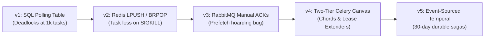

# Deep Explainability Guide: Distributed Task Queue & Asynchronous Job Scheduler

> **Companion Links**:
> - 🧭 Chapter Hub: [`README.md`](README.md)
> - 📐 Architectural Blueprint: [`01-Architectural-Blueprint.md`](01-Architectural-Blueprint.md)
> - 🎙️ Interactive Interview Playbook: [`02-Interactive-Interview-Playbook.md`](02-Interactive-Interview-Playbook.md)
> - 🧪 Production Python Engine: [`task_queue_engine.py`](task_queue_engine.py)

---

## 1. First-Principles Mental Model & Physical Analogy

To truly master asynchronous distributed task execution, you must understand it not as a software library (like Celery or BullMQ), but as a **physical manufacturing logistics pipeline obeying conservation of throughput**.

```
                   THE FREIGHT SORTING YARD ANALOGY
  Incoming Cargo
  (HTTP Requests)
       │
       ▼
  ┌───────────────┐
  │ Dispatch Dock │ ── (Returns instant Waybill ID to Client in < 5ms)
  └───────┬───────┘
          │ (Pushes Freight Manifest)
          ▼
  ┌─────────────────────────────────────────────────────────────┐
  │                 CENTRAL SWITCHING TRACK                     │
  │                    (Broker / Queue)                         │
  │  [Priority Track]  [Standard Track]  [Delayed Parking Track]│
  └───────┬───────────────────┬─────────────────────┬───────────┘
          │                   │                     │
          ▼                   ▼                     ▼
     Worker Bay 1        Worker Bay 2          Worker Bay 3
   (Heavy Video GPU)  (Invoice PDF CPU)      (Email Webhook I/O)
```

### 1.1 The Real-World Analogy: The Industrial Freight Rail Yard
Imagine a massive container port. If every cargo ship captain had to personally deliver their containers by hand to 500 retail stores across the country before being allowed to dock (Synchronous I/O):
- The port would suffer a total gridlock within 10 minutes. Ships would pile up in the harbor, running out of fuel and sinking (Connection Timeouts).
- Instead, the port operates an **Asynchronous Dispatch Yard**:
  1. The ship unloads its cargo at the container dock. The dockmaster stamps a receipt with a tracking number (Task ID) and sends the ship on its way in under 2 minutes ($< 5\text{ ms}$ HTTP response).
  2. The container is rolled onto a switching track (Message Broker).
  3. Containers are sorted by destination and priority: Urgent refrigerated food gets the Express Track; scrap metal waits on the bulk siding.
  4. Specialized locomotives (Worker Processes) hitch onto the railcars and pull them to their final destination.
  5. If a locomotive derails midway through a mountain pass (Worker Kernel Panic / OOM Kill), the central dispatcher notices the missed checkpoint deadline (Visibility Timeout), dispatches a recovery train, and pulls the container back to the yard for redelivery.

### 1.2 Why This Mental Model Prevents Design Mistakes
Grounding asynchronous architecture in freight logistics exposes several fatal traps:
1. **The In-Memory Cargo Loss Trap**: Storing freight orders on loose paper sticky notes on the foreman's desk (in-memory queues without disk persistence or consumer ACKs) means that if the power cuts out for 1 second, millions of dollars in cargo vanish without a trace.
2. **The Runaway Siding Gridlock (Unbounded Buffering)**: If trains break down, cargo keeps arriving at the docks. If the yard has no physical limit (unbounded queue), containers will spill into the streets, crushing neighboring buildings (Host Out-Of-Memory Kernel Panic). You must design **Backpressure, Flow Control, and Dead-Letter Sidings**.
3. **The Cargo Hoarding Disaster (Prefetch Multiplier)**: If Locomotive 1 arrives at the yard and is allowed to hitch 100 railcars to its engine all at once, and the first car turns out to weigh 500 tons, that single train is stuck crawling up a steep hill for 4 hours. Meanwhile, Locomotives 2, 3, and 4 sit completely empty with engines idling at 0% utilization!

---

## 2. Technology Showdown Matrix ("Why X and NOT Y?")

In Staff and Principal engineering interviews, interviewers expect you to justify your choice between lightweight broker-worker systems (Celery, Sidekiq, BullMQ) and heavyweight durable workflow orchestrators (Temporal, Cadence, AWS Step Functions).

```
┌──────────────────────────────────────────────────────────────────────────────────────────────────┐
│                                 TECHNOLOGY SHOWDOWN SCORECARD                                    │
├──────────────────────────┬──────────────────────────────┬────────────────────────────────────────┤
│ Technology Candidate     │ Core Strength                │ Fatal Flaw for Task Queues             │
├──────────────────────────┼──────────────────────────────┼────────────────────────────────────────┤
│ Celery + Redis           │ Ultra-low latency (< 1ms)    │ Memory exhaustion; brittle long jobs   │
│ Celery + RabbitMQ        │ Strict AMQP ACKs & routing   │ Awkward delayed queues via DLX hacks   │
│ Temporal / Cadence       │ Event-sourced 30-day sagas   │ Operational overhead & DB event append │
│ AWS SQS + Lambda         │ Serverless, zero ops         │ 15-minute execution hard cap           │
│ Apache Kafka             │ Petabyte event streaming     │ Head-of-line blocking on task failures │
│ Apache Airflow           │ Complex data warehouse DAGs  │ Minutes scheduler latency (Batch only) │
└──────────────────────────┴──────────────────────────────┴────────────────────────────────────────┘
```

### Detailed Multi-Dimensional Showdown

| Evaluation Dimension | Celery + RabbitMQ | Celery + Redis | Temporal (Event-Sourced) | AWS SQS + AWS Lambda | Apache Kafka | Apache Airflow |
|:---|:---|:---|:---|:---|:---|:---|
| **Primary Architectural Pattern** | Work-Queue (AMQP 0-9-1) | In-Memory List / Stream | Event-Sourced Orchestration | Serverless Queue & Compute | Append-Only Partitioned Log | Scheduled Batch Workflow |
| **P99 Enqueue Latency** | $2.0 - 5.0\text{ ms}$ (Disk fsync) | **$0.4 - 0.8\text{ ms}$ (In-Memory)** | $10 - 25\text{ ms}$ (DB Event Append)| $8 - 15\text{ ms}$ (HTTPS / SigV4) | **$1.0 - 2.0\text{ ms}$ (Zero-Copy DMA)**| $500 - 2,000\text{ ms}$ (DB ORM)|
| **Maximum Task Duration** | Hours (Worker holds lease) | Hours (Worker holds lease) | **Months (Durable Virtual State)**| **Hard Cap: 15 minutes** | Seconds to Minutes | Days (Batch execution) |
| **Worker Failure Handling** | Broker redelivers on ACK loss | Redelivers via visibility TTL | **Deterministic Replay from Log** | Redelivers via VisibilityTimeout| Offset rewind (All or None)| Step retry via Scheduler |
| **Delayed / Future Tasks** | Complex (Dead-Letter Exchanges)| Native (Redis ZSET Min-Heap) | **Native Durable Timers** | Native (`DelaySeconds` $\le 15\text{m}$)| Anti-pattern (Requires topics)| Native (Cron schedule) |
| **Individual Task ACK** | **Yes (Per-message ACK/NACK)**| Yes (Via Lua lease script) | **Yes (Per-activity completion)** | **Yes (DeleteMessage receipt)**| **NO! (Monotonic Partition Offset)**| No (Step status in SQL) |
| **Operational Complexity** | Moderate (Erlang clustering) | Low (Single/Cluster Redis) | High (Temporal Cluster + Cassandra)| **Zero (Fully managed cloud)** | High (ZooKeeper/KRaft + OS page)| High (Scheduler, Web, Celery) |
| **ARCHITECTURAL VERDICT** | **SOTA: Short/Med IO Tasks** | **SOTA: High-Rate Fast Tasks** | **SOTA: Multi-Day Business Sagas**| **GOOD: Low-Ops Serverless** | **REJECTED: Head-of-line blocking**| **REJECTED: Too slow for online**|

### The Staff-Level Technology Defense
- **Why NOT Apache Kafka for Task Queues?** This is one of the most common candidate mistakes in system design interviews. Kafka is an **Append-Only Distributed Commit Log**, not a work queue:
  - In Kafka, consumption is tracked via a single monotonic offset per partition. You **cannot acknowledge Task 5 while leaving Task 4 unacknowledged**.
  - If Task 4 encounters an error or takes 45 minutes to execute, the entire partition is blocked! Downstream tasks 5 through 500 are starved because the consumer offset cannot advance.
  - In a true task queue (RabbitMQ/Celery/SQS), tasks are **individually leased and acknowledged**. A 10-minute task does not block a 5-millisecond task right behind it.
- **When to choose Celery vs. Temporal?**
  - Use **Celery / BullMQ** when tasks are stateless, fast-to-medium duration ($< 30\text{ minutes}$), high throughput ($> 50,000\text{ tasks/sec}$), and failures are resolved by simple retries.
  - Use **Temporal** when the workflow is a complex, multi-step business saga (e.g. user onboarding: charge credit card $\to$ provision cloud VM $\to$ wait 3 days for email verification $\to$ notify Slack). If a worker crashes on Day 2, Temporal reconstructs the exact local variable state by deterministically replaying the event history log.

---

## 3. Mathematical Foundations & Sizing Intuitions

### 3.1 Worker Pool Auto-Scaling & Little's Law

To provision and dynamically auto-scale a distributed worker fleet without queue backlog explosions, we apply **Little's Law** from queueing theory:

$$L = \lambda \times W$$

Where:
- $L$ = Average number of tasks actively being processed in the system.
- $\lambda$ = Arrival rate of incoming tasks (Tasks per second).
- $W$ = Average execution time per task (Seconds).

#### Worked Example: Hyperscale Video & Invoice Processing
Suppose your platform handles:
- Peak Ingress Rate: $\lambda = 10,000\text{ tasks/second}$
- Mean Task Duration: $W = 1.5\text{ seconds}$
- Maximum Allowable Queue Delay SLA: $D_{\text{max}} \le 10\text{ seconds}$

1. **Steady-State Concurrency**:
   $$L = 10,000\text{ tasks/sec} \times 1.5\text{ sec} = 15,000\text{ concurrent tasks}$$
   You must maintain capacity to execute $15,000$ tasks simultaneously just to keep pace with real-time ingress.

2. **Worker Pod Calculations**:
   If each worker node is an 8-vCPU container running $C = 8$ concurrent worker threads:
   $$\text{Required Worker Pods} = \frac{L}{C} = \frac{15,000}{8} \approx 1,875\text{ worker pods}$$

3. **Queue Backlog Draining Equation**:
   If a downstream service outage causes the broker backlog to accumulate $B = 2,000,000\text{ tasks}$:
   To drain this backlog within $T_{\text{drain}} = 600\text{ seconds}$ (10 minutes) while ongoing traffic continues at $\lambda = 10,000\text{ tasks/sec}$:
   $$\text{Required Processing Capacity } \mu = \lambda + \frac{B}{T_{\text{drain}}} = 10,000 + \frac{2,000,000}{600} \approx 10,000 + 3,333 = 13,333\text{ tasks/sec}$$
   $$\text{Scaled Worker Pods} = \frac{13,333 \times 1.5}{8} \approx 2,500\text{ worker pods}$$

---

### 3.2 Delayed Task Scheduling: Min-Heap vs. Hashed Timer Wheel

When an application schedules 5 million tasks to execute at future timestamps:

#### Approach A: Redis Sorted Set (`ZSET`)
- State stored: `score = execution_timestamp`, `member = task_id`.
- Time complexity: Inserting a task into a sorted set takes $O(\log N)$ time.
- Polling dispatcher: Every $100\text{ ms}$, runs:
  ```lua
  local tasks = redis.call('ZRANGEBYSCORE', 'tasks:delayed', '-inf', ARGV[1], 'LIMIT', 0, 100)
  for _, task_id in ipairs(tasks) do
      redis.call('ZREM', 'tasks:delayed', task_id)
      redis.call('LPUSH', 'tasks:ready', task_id)
  end
  ```
- Bottleneck: For 5M keys, inserting requires balanced skiplist traversals. At 50,000 delayed enqueues/sec, Redis CPU hits 100%.

#### Approach B: Hierarchical Hashed Timer Wheel (Linux Kernel & Kafka Purgatory)
- Designed by Varghese & Lauck (1987).
- A circular array of $N$ slots, where each slot represents a time tick (e.g. 1 second).
- A current time pointer advances 1 slot per tick ($O(1)$ amortized).
- **Complexity**:
  - Task Enqueue: **$O(1)$** (Compute hash bucket `(timestamp / tick_size) % N`).
  - Task Trigger: **$O(1)$** (Directly drain the linked list at the current bucket pointer).
  - Memory: Massive reduction since no sorted tree/skiplist pointers are maintained.

---

### 3.3 Retry Backoff Calculus: Full Jitter vs. Equal Jitter

When a downstream third-party service (e.g., SendGrid, Stripe) throws HTTP 500 errors, retrying without jitter produces **thundering herd resonances**.

```
Standard Exponential Backoff:   t_wait = min(max_backoff, base * 2^(retry_count))
Full Jitter (AWS Best Practice): t_sleep = Uniform(0, t_wait)
Equal Jitter:                   t_sleep = (t_wait / 2) + Uniform(0, t_wait / 2)
```

```
[ RETRY COMPARISON UNDER 5,000 RETRYING WORKERS ]
No Jitter:       Spikes at 2s, 4s, 8s, 16s (Repeatedly knocks downstream service over)
Full Jitter:     Completely flattens the retry distribution across the entire time axis!
```

---

## 4. The Evolutionary Journey: From Naive to Hyperscale ("Zero-to-Hero")



### v1: Database Polling (`SELECT ... FOR UPDATE SKIP LOCKED`)
- **Design**: Tasks are rows in PostgreSQL:
  ```sql
  SELECT id, payload FROM tasks 
  WHERE status = 'PENDING' AND scheduled_at <= NOW() 
  ORDER BY priority DESC 
  FOR UPDATE SKIP LOCKED LIMIT 1;
  ```
- **Where it breaks**:
  - At 5,000 tasks/second, index scans cause severe lock contention and buffer pool thrashing.
  - PostgreSQL MVCC produces millions of dead tuples per hour, triggering aggressive autovacuum operations that consume 90% of disk I/O.
  - The database CPU spikes to 100%, taking down online web transactions.

### v2: Celery with Redis Lists (`LPUSH` / `BRPOP`)
- **Design**: Producers push JSON strings to Redis with `LPUSH`. Workers block on `BRPOP`.
- **Where it breaks**:
  - `BRPOP` is a destructive read: **the moment the task is popped from the list, it ceases to exist in Redis**.
  - If the worker process suffers an Out-Of-Memory (OOM) kill or hardware crash 5 milliseconds later, **the task is permanently lost**.
  - There is no visibility timeout, no acknowledgment mechanism, and no retry ledger.

### v3: RabbitMQ AMQP Broker with Prefetch & Manual ACKs
- **Design**: RabbitMQ holds tasks in an unacknowledged state until the worker sends `basic.ack`.
- **Where it breaks**:
  - **The Default Prefetch Hoarding Trap**: By default, RabbitMQ pushes up to `prefetch_multiplier = 4` tasks per worker thread. If 1,000 tasks arrive, Worker 1 grabs 50 tasks. If Task 1 takes 20 minutes, Tasks 2 through 50 sit trapped in Worker 1's local RAM while other workers sit completely idle with 0% CPU.
  - **Delayed Tasks Require Hacky Daisy-Chaining**: RabbitMQ lacks native delayed message scheduling. Engineers are forced to route messages through Dead-Letter Exchanges (DLX) with per-message TTLs, which suffer from head-of-line blocking if messages have varying expiration times.

### v4: Two-Tier Celery Canvas with Timer Wheels & Heartbeats (The Modern Work-Queue)
- **Architecture**:
  - `prefetch_count = 1` enforces fair work-stealing across the worker fleet.
  - In-flight tasks are guarded by **Active Visibility Heartbeat Leases**.
  - Delayed tasks are routed to a Redis Min-Heap Timer Wheel.
  - Complex workflow DAGs are coordinated via **Canvas Primitives**:
    - `Chain`: Sequential pipeline ($f(x) \to g(y) \to h(z)$).
    - `Group`: Parallel scatter across multiple workers.
    - `Chord`: Scatter-gather barrier synchronization that fires an atomic callback once all group tasks succeed.

### v5: Event-Sourced Durable Sagas (Temporal Architecture)
- **Architecture**:
  - Workflows are defined as code and compiled into deterministic state machines.
  - Every external interaction (API call, DB write) is encapsulated as an **Activity**.
  - State is recorded in an immutable, append-only **History Event Log**.
  - Workflows can pause and wait for 30 days for human approval without consuming any CPU or memory. If a host crashes, a replacement worker rebuilds the exact program call stack by replaying past events.

---

## 5. Micro-Mechanics & Kernel / Hardware Internals

### 5.1 Worker Process Concurrency: `fork()` vs. `spawn()` & Memory Bloat
In Python (Celery) and Ruby (Sidekiq Enterprise):
- The master process initializes database pools, imports libraries, and calls `fork()` to create worker processes.
- **Copy-On-Write (COW) Memory Hazard**:
  - Linux uses Copy-On-Write for child process pages.
  - However, the Python reference counting mechanism (`PyObject.ob_refcnt`) mutates memory on every object read!
  - As soon as a worker reads a global object, the Linux kernel marks the page as dirty and makes a physical copy of the 4KB memory page.
  - Within 30 minutes, 100% of the shared master memory is duplicated across all 32 worker processes, causing the host to run out of RAM!
- **Mitigation**:
  1. Enforce `max_tasks_per_child = 500`: The worker process terminates and restarts after 500 tasks, returning leaked memory to the OS.
  2. Use `gc.freeze()` before forking (Python 3.7+): Moves existing Python objects to an unmanaged permanent generation, preventing reference counts from modifying physical memory pages.

### 5.2 Zombie Worker Processes & Linux Signal Handling
When a worker task exceeds its time limit:
- Celery sends `SIGXCPU` / `SIGTERM` (Soft Time Limit) to allow graceful cleanup.
- If the task is stuck inside a native C extension (e.g. OpenCV, NumPy, or an unbuffered socket read), the Python interpreter **cannot execute signal handlers**!
- After a grace period (e.g. 10 seconds), the parent process sends `SIGKILL` (`kill -9`).
- **The Kernel Zombie Trap**: If the parent process crashes before calling `waitpid()` on the terminated child, the child remains in the OS process table as a `<defunct>` **Zombie Process**, consuming OS PID entries until the system cannot spawn new threads.

### 5.3 OOM Killer Priority (`oom_score_adj`)
Under heavy memory pressure, the Linux kernel invokes the Out-Of-Memory (OOM) Killer.
- By default, the kernel calculates an `oom_score` based on RAM percentage.
- Because worker processes consume large amounts of memory, the kernel may kill the **Broker (RabbitMQ / Redis)** instead of the offending worker!
- **Staff-Level OS Tuning**:
  ```bash
  # Protect the Message Broker from being killed
  echo -1000 > /proc/$(pgrep rabbitmq)/oom_score_adj
  
  # Allow worker processes to be targeted first
  echo 500 > /proc/$(pgrep celery_worker)/oom_score_adj
  ```

---

## 6. Production Incident Runbook & Chaos Scenarios

### 6.1 The 03:00 AM P1 Outage: "The Poison Pill Domino Cascade"

#### The Trigger
At 03:22 AM UTC, a partner system pushes 500 malformed JSON payloads containing unexpected Unicode characters. When a worker attempts to deserialize the payload, a native C library triggers a `Segmentation Fault` (Signal 11), instantly crashing the OS process before it can acknowledge or reject the task.

```
[ PagerDuty Alert: CRITICAL ] 
- Service: Async Worker Fleet
- Metric: Worker_Process_Exit_Rate > 80%
- Impact: Queue Backlog Spiking by 40,000 tasks/min; SLA Breached
```

```
                 THE POISON PILL DOMINO CASCADE
                 
  [ Poison Task arrives in Broker ]
           │
           ▼
    Worker 1 pulls Task ──► Crashes (SIGSEGV)
           │
           ▼ (Broker detects disconnect, redelivers)
    Worker 2 pulls Task ──► Crashes (SIGSEGV)
           │
           ▼ (Broker redelivers)
    Worker 3 pulls Task ──► Crashes (SIGSEGV)
           │
           ▼
  [ Entire Worker Fleet Wiped Out in 45 Seconds! ]
```

#### Step-by-Step Triage & Mitigation Sequence

##### Step 1: Confirm Poison Pill Characteristics via Broker CLI
The on-call engineer checks the unacknowledged task churn:
```bash
# Check RabbitMQ queue status and redelivery counts
rabbitmqctl list_queues name messages messages_unacknowledged consumers
# Output:
# orders_queue  48120   140   12 (Consumers dropping rapidly!)

# Inspect message headers for redelivery count
rabbitmqadmin get queue=orders_queue requeue=false count=1 | jq .
# Key observation: redelivered: true, delivery_tag: 42
```

##### Step 2: Quarantine the Poison Pill (Dead-Letter Diversion)
Execute emergency CLI intervention to divert poisoned payloads to the DLQ:
```bash
# Set dynamic routing policy routing failed tasks to quarantine DLQ
rabbitmqctl set_policy DLX_Poison ".*" \
  '{"dead-letter-exchange":"dlx.poison","dead-letter-routing-key":"poison"}' \
  --priority 10 --apply-to queues
```

##### Step 3: Implement Ingestion Boundary Sanitization
While the worker fleet auto-heals via Kubernetes pod restarts, deploy an immediate gateway validation rule:
```python
# Ingestion API Gateway Filter
def sanitize_task_payload(raw_bytes: bytes) -> dict:
    try:
        payload = json.loads(raw_bytes.decode('utf-8'))
        validate_schema(payload)
        return payload
    except Exception as exc:
        metrics.increment("task_ingest_rejected_invalid_json")
        # Route directly to S3 dead-letter bucket without hitting RabbitMQ
        quarantine_to_s3(raw_bytes, str(exc))
        raise InvalidPayloadException("Malformed JSON payload rejected at perimeter")
```

##### Step 4: Verify Fleet Recovery & Reprocessing
- Validate via Grafana that `worker_crash_total` drops to 0.
- Verify `queue_backlog_depth` begins declining at expected rate ($\mu \approx 12,000\text{ tasks/sec}$).
- Once steady state is restored, run an offline remediation script against the S3 quarantine bucket to patch the malformed fields and re-enqueue safely.

---

## 7. Interactive Socratic Pauses & Self-Quiz

> 🧠 **Pause & Ponder #1**: *If you have an asynchronous task that sends an email receipt to a customer, why does executing that task with `ack_late = True` guarantee that customers will occasionally receive duplicate emails? How do you prevent this?*
> 
> <details>
> <summary><b>Click for Staff-Level Solution</b></summary>
> 
> When `ack_late = True`, the worker only sends the `ACK` back to the broker **after** the task function has completely finished executing.
> - If the worker successfully calls the SendGrid API and sends the email, but a network blip or power failure occurs before the `ACK` packet reaches RabbitMQ:
> - RabbitMQ assumes the worker crashed and redelivers the task to Worker 2.
> - Worker 2 executes the function and sends a second email!
> 
> **Solution: Two-Tier Idempotency**:
> Every task message must carry a deterministic **Idempotency Key** (`hash(order_id, action)`). Before calling external APIs, the task checks an atomic distributed lock in Redis:
> ```lua
> -- Atomic Check-And-Set Idempotency Guard
> if redis.call('SET', KEYS[1], 'PROCESSING', 'NX', 'EX', 3600) then
>     return 1 -- Allowed to proceed
> else
>     return 0 -- Duplicate! Skip execution and ACK immediately
> end
> ```
> </details>

---

> 🧠 **Pause & Ponder #2**: *Why can a long-running task that executes for 30 minutes cause massive memory bloat in a Redis broker even if the queue backlog is completely empty?*
> 
> <details>
> <summary><b>Click for Staff-Level Solution</b></summary>
> 
> In Redis-backed task queues (like Celery), when a worker takes a task, the task is moved from the `ready` list to an `in-flight` Sorted Set or Hash to track its visibility timeout.
> - While the 30-minute task is running, the worker sends periodic heartbeat updates to extend the lease.
> - If the worker accumulates large intermediate return values or logs inside the task result dictionary (`task.backend`), Redis stores the entire state object.
> - More critically, if result persistence is configured with a long TTL (e.g. 24 hours), storing megabyte-sized results across millions of finished tasks will silently exhaust Redis RAM, even though `LLEN tasks:ready` shows 0!
> 
> **Rule of Thumb**: Never use Redis as a persistent Result Backend. Offload large task results to an S3 bucket and store only a lightweight pointer in the queue.
> </details>

---

## 8. Summary Checklist for Staff/Principal Interviews

When presenting Chapter 15 in an interview, ensure you cover these 6 core pillars:
- [ ] Explicitly contrast **Work Queues (RabbitMQ/Celery)** against **Append-Only Event Logs (Kafka)**, explaining why head-of-line blocking disqualifies Kafka for heterogeneous tasks.
- [ ] Propose **`prefetch_multiplier = 1`** and explain the fatal starvation that occurs under default prefetch settings.
- [ ] Explain the trade-off between **Early ACK (Data Loss)** and **Late ACK (Duplicate Execution)**, and solve duplicates with two-tier idempotency keys.
- [ ] Show the math of **Little's Law ($L = \lambda W$)** to size worker pools and calculate backlog draining rates.
- [ ] Walk through **Canvas Workflows** (`Chain`, `Group`, `Chord`) and explain how barrier synchronization is implemented atomically using atomic counters in Redis.
- [ ] Describe the **Poison Pill Crash Cascade** and show how dead-letter queue limits and ingestion boundary sanitization neutralize it.
