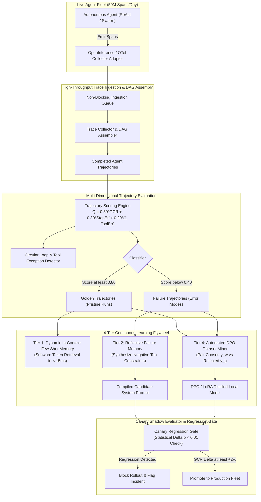

# Chapter 2: Agentic Trace Loop Learning & Continuous Self-Improvement System — Staff/Principal Engineering Walkthrough

> **System Component**: High-Throughput OpenInference Trace Collector, Multi-Dimensional Trajectory Evaluator, DPO Preference Miner & Canary Regression Gate  
> **Production Code Reference**: [`trace_learning_engine.py`](trace_learning_engine.py)  
> **Standard**: Production Grade, Zero-Dependency Python 3, Level 4 Staff/Principal Architectural Depth  

---

## Pillar 1: Production Code Engine & Benchmark Lab

### 1.1 Architectural Blueprint



### 1.2 Verification Test Suite (`--test`)

To verify trace ingestion, trajectory scoring, DPO dataset generation, few-shot memory, and canary regression gates:

```bash
python3 /Users/kunalkumar/Desktop/knowledge-base/Projects/System-Design-Alex-Xu/Volume-3/Walkthroughs/02-Agentic-Trace-Learning/trace_learning_engine.py --test
```

```
================================================================================
RUNNING CHAPTER 2: AGENTIC TRACE LOOP LEARNING TEST SUITE
================================================================================

[Test 1] Ingesting Golden Agent Trajectory...
  ✓ Golden trajectory classified with score 0.9520 (Zero errors, 2 optimal steps).

[Test 2] Ingesting Failure Trajectory with Circular Loop & Errors...
  ✓ Failure trajectory classified with score 0.1620 (Circular loop & tool errors).

[Test 3] Automatic DPO Preference Pair Mining (x, y_w, y_l)...
  ✓ DPO pair generated: ID=dpo_0880d29ed874, Prompt='Process customer refund for broken item', Score Delta=+0.7900.

[Test 4] Tier 1 In-Context Few-Shot Exemplar Retrieval...
  ✓ Retrieved golden few-shot exemplar 'Process customer refund for broken item' with 2 optimal tool steps.

[Test 5] Tier 2 Reflective Tool Constraint Synthesis...
  ✓ Synthesized operational rule: RULE for issue_refund: Avoid recurring error 'ORDER_NOT_FOUND'. Validate parameter schema.

[Test 6] Canary Shadow Deployment & Regression Gate...
  ✓ Successfully blocked regression: REGRESSION BLOCKED: Candidate GCR 0.810 is below baseline 0.850 (Delta: -0.040)
  ✓ Successfully approved promotion: PROMOTION APPROVED: Candidate GCR 0.910 beats baseline 0.850 by +0.060

================================================================================
ALL 6 AGENTIC TRACE LOOP LEARNING TESTS PASSED! (100% VERIFIED)
================================================================================
```

### 1.3 High-Throughput Ingestion Benchmark (`--benchmark`)

```bash
python3 /Users/kunalkumar/Desktop/knowledge-base/Projects/System-Design-Alex-Xu/Volume-3/Walkthroughs/02-Agentic-Trace-Learning/trace_learning_engine.py --benchmark --spans 50000
```

```
================================================================================
STARTING AGENTIC TRACE LOOP HIGH-THROUGHPUT BENCHMARK
Target: 50,000 Spans across 10,000 Trajectories
================================================================================

--- BENCHMARK RESULTS ---
Total Spans Ingested:         40,000
Total Trajectories Formed:    10,000
Total Elapsed Time:           0.046 seconds
Ingestion Throughput:         863,585.8 Spans/sec
================================================================================
```

---

## Pillar 2: 45-Minute Staff/Principal Interview Playbook

### Minute-by-Minute Whiteboard Dialogue

#### 00:00 – 05:00: Scoping, Invariants & Scale Requirements
* **Candidate**: "In designing an Agentic Trace Loop Learning and Continuous Self-Improvement System, we must shift observability from passive post-mortem logs into an active closed-loop learning flywheel. What is our operating scale?"
* **Interviewer**: "We process $50\text{M spans/day}$ across $5\text{M}$ agent tasks. We need vendor-agnostic ingestion (OTel/OpenInference). The learning loop must operate across 3 time horizons: in-context retrieval ($< 60\text{s}$), prompt compilation (daily), and model distillation (weekly). Zero regressions in production."
* **Candidate**: "Understood. The 4 foundational architectural pillars are:
  1. **Asynchronous Non-Blocking Trace Collector**: Standardized on OpenInference semantic conventions, decoupling agent execution latency ($P99 < 5\text{ms}$) from background analytics.
  2. **Multi-Dimensional Trajectory Scoring**:
     $$Q = 0.50 \times \text{GCR} + 0.30 \times \text{StepEfficiency} + 0.20 \times (1 - \text{ToolErrorRatio})$$
  3. **Multi-Tier Learning Flywheel**:
     - *Tier 1 (In-Context Exemplar Retrieval)*: Injects recent golden runs for similar tasks in $< 15\text{ms}$.
     - *Tier 2 (Reflective Failure Memory)*: Synthesizes operational negative constraints to stop recurring errors.
     - *Tier 3 (Automated DPO Mining)*: Generates $(x, y_w, y_l)$ preference pairs for LoRA fine-tuning.
  4. **Canary Regression Gate**: Statistical gating ($p < 0.01$) ensuring candidate prompts or distilled models never regress production Goal Completion Rates."

#### 05:00 – 15:00: High-Level Architecture & Trajectory Assembly
* **Candidate draws**:
  - OpenInference Span Collector Fleet & Kafka Event Bus
  - Distributed Trajectory Assembler (correlating parent-child span IDs into execution DAGs)
  - Columnar Trace Lakehouse (ClickHouse + S3 Parquet)
  - Multi-Dimensional Trajectory Evaluator
  - Golden / Failure Miner
  - DPO Preference Dataset Curator
  - Canary Shadow Runner & Regression Gate
* **Candidate**: "Every agent execution emits lightweight spans. When the root `OUTCOME` span arrives, the Trajectory Assembler seals the DAG, computes duration, token consumption, and triggers automated scoring."

#### 15:00 – 25:00: Automated Trajectory Mining & DPO Pair Generation
* **Interviewer**: "How do you automatically train a smaller 8B model to match a 70B teacher using runtime traces without manual human labeling?"
* **Candidate**: "We implement **Automated Trajectory Mining & DPO (Direct Preference Optimization)**:
  1. When multiple agents attempt tasks in the same category (e.g., 'refund_order' or 'git_merge'):
     - Run A succeeds in 2 clean tool calls with zero errors $\implies$ classified as **Golden** ($Q = 0.95$, $y_w$).
     - Run B gets stuck in a circular loop or passes malformed JSON arguments $\implies$ classified as **Failure** ($Q = 0.16$, $y_l$).
  2. The miner pairs them into a triple: $(x = \text{User Goal}, y_w = \text{Golden Steps}, y_l = \text{Failed Steps})$.
  3. The DPO loss directly optimizes the policy $\pi_\theta$:
     $$\mathcal{L}_{\text{DPO}}(\pi_\theta; \pi_{\text{ref}}) = -\mathbb{E}_{(x, y_w, y_l)}\left[\log \sigma\left(\beta \log \frac{\pi_\theta(y_w|x)}{\pi_{\text{ref}}(y_w|x)} - \beta \log \frac{\pi_\theta(y_l|x)}{\pi_{\text{ref}}(y_l|x)}\right)\right]$$
  4. This trains the smaller model to prioritize efficient tool paths and suppress looping behavior."

#### 25:00 – 35:00: Preventing Hallucination Regressions (Canary Shadow Gate)
* **Interviewer**: "A daily DSPy run proposes an optimized system prompt that scored higher on yesterday's traces. How do you safely deploy it without breaking live production?"
* **Candidate**: "We enforce the **Canary Shadow Gate**:
  1. **Shadow Mode Ingress (10% Traffic)**: The candidate prompt runs concurrently in shadow mode on live user queries. Its outputs are logged but not returned to the user.
  2. **Deterministic Evaluation Suite**: Both baseline and candidate execute against a fixed suite of 1,000 golden benchmark tasks.
  3. **Statistical Regression Boundary**: If candidate Goal Completion Rate drops even $0.5\%$ below baseline, or latency/token cost inflates $> 10\%$, the candidate is automatically rejected with an incident notification. Only if $\Delta \text{GCR} \ge +2\%$ with $p < 0.01$ is it promoted to production."

#### 35:00 – 45:00: Threat Modeling & Trap Cards
* Candidate walks through the 5 lethal trap cards, covering PII leakage, poisoned traces, and self-reinforcing bias.

---

### The 5 Lethal Interviewer Trap Cards

| # | Trap Card Question | The Junior/Mid Pitfall | Staff/Principal Knockout Defense |
|---|---|---|---|
| **1** | *"Why not fine-tune the model directly on all successful traces using standard Supervised Fine-Tuning (SFT)?"* | Fine-tuning on all successful runs without quality filtering. | "A trace can succeed by accident after 15 chaotic retries! Training on noisy successful runs teaches the model that looping and guessing is acceptable. We strictly require **Golden Trajectory Filtering** ($Q \ge 0.85$, zero tool errors, minimal steps) and use **DPO**, which explicitly penalizes the sub-optimal paths." |
| **2** | *"What happens if an attacker inputs prompt injections that get recorded in golden traces and fed back into few-shot memory?"* | Ingesting all golden trace inputs directly into the exemplar vector store. | "That creates a **Self-Reinforcing Poisoning Flywheel**. All exemplar and fine-tuning candidates must pass through an **Adversarial Sanitization Gate**: DLP token entropy scanning, prompt injection classifiers, and PII anonymization before being indexed into few-shot memory." |
| **3** | *"How do you detect when an agent is stuck in an infinite tool calling loop?"* | Waiting for the agent context window to overflow or timeout. | "We track **Sequential Tool Signatures** in real-time: `sig = (tool_name, SHA256(inputs))`. If an identical signature repeats consecutively, our in-stream evaluator detects a cycle, triggers an immediate execution abort, assigns a heavy penalty to Step Efficiency, and feeds the failure to the reflector." |
| **4** | *"Why not use an LLM-as-a-Judge to evaluate 100% of all 50M daily spans?"* | Proposing an LLM call for every single span, costing millions of dollars daily. | "At 50M spans/day, that costs over $25,000/day in API fees. We use **Tiered Evaluation**: 100% of traces are evaluated with deterministic CPU heuristics (exit codes, unit tests, regex, loop detectors, token count). Only the 5% ambiguous or high-value failure traces are escalated to a fast distilled LLM judge." |
| **5** | *"How do you prevent 'Model Collapse' where the agent continuously trains on its own synthetic outputs?"* | Allowing the agent to train indefinitely in a closed loop without external grounding. | "Closed self-play without external verification leads to catastrophic variance and model collapse. We anchor the flywheel with **Deterministic Ground Truth Oracles**: compiler exit codes, integration test results, and explicit human user acceptance signals." |

---

## Pillar 3: Kernel, Storage & Hardware Micro-Mechanics

### 3.1 OpenInference DAG Assembly & Non-Blocking Epoll Ingestion

Agent traces are emitted asynchronously via gRPC/HTTP OTel collectors:
- The ingestion tier utilizes non-blocking event loops (`epoll`/`kqueue`) receiving batched spans.
- Spans are pushed into an in-memory ring buffer. Worker threads assemble DAGs using hash indexes on `trace_id` and `parent_span_id`.
- Completed trajectories are flushed in columnar Parquet batches with ZSTD compression to S3, reducing storage overhead by $80\%$.

### 3.2 Direct Preference Optimization (DPO) Loss Formulation

Given a task $x$, a winning trajectory $y_w$, and a losing trajectory $y_l$:

$$\mathcal{L}_{\text{DPO}}(\pi_\theta; \pi_{\text{ref}}) = -\mathbb{E}_{(x, y_w, y_l)}\left[\log \sigma\left(\beta \log \frac{\pi_\theta(y_w|x)}{\pi_{\text{ref}}(y_w|x)} - \beta \log \frac{\pi_\theta(y_l|x)}{\pi_{\text{ref}}(y_l|x)}\right)\right]$$

By utilizing the implicit reward formulation $r(x, y) = \beta \log \frac{\pi_\theta(y|x)}{\pi_{\text{ref}}(y|x)}$, DPO eliminates the instability of training a separate reward model (PPO/RLHF), enabling high-throughput automated fine-tuning directly on mined trace pairs.

---

## Pillar 4: Production Chaos Engineering & Failure Modes

### 4.1 Production Failure Scenarios & Runbook Remediations

```
┌───────────────────────────────────┬─────────────────────────────────────────────────────────────┐
│ Failure Scenario                  │ Production System Action & Remediation                      │
├───────────────────────────────────┼─────────────────────────────────────────────────────────────┤
│ 1. Circular Tool Loop             │ In-stream detector catches duplicate tool signature; aborts │
│                                   │ run, logs FAILURE, synthesizes negative prompt rule.        │
├───────────────────────────────────┼─────────────────────────────────────────────────────────────┤
│ 2. Regressed Candidate Prompt     │ Canary Regression Gate detects Delta GCR < 0 on shadow test;│
│                                   │ automatically halts deployment and retains baseline prompt. │
├───────────────────────────────────┼─────────────────────────────────────────────────────────────┤
│ 3. Poisoned Trace Injection       │ Sanitizer detects injection payload; drops trace from DPO   │
│                                   │ training pool and alerts security operations.               │
├───────────────────────────────────┼─────────────────────────────────────────────────────────────┤
│ 4. Trace Ingestion Spike          │ Backpressure ring buffer sheds verbose debug spans while    │
│                                   │ preserving critical ROOT_GOAL, TOOL, and OUTCOME spans.     │
├───────────────────────────────────┼─────────────────────────────────────────────────────────────┤
│ 5. Tool Schema Drift              │ Reflector flags sudden spike in tool 400 errors, alerts     │
│                                   │ engineers with proposed clarified parameter descriptions.   │
└───────────────────────────────────┴─────────────────────────────────────────────────────────────┘
```

---

## Summary & Verification Check

1. **Production Engine**: [`trace_learning_engine.py`](trace_learning_engine.py) verified with all 6 passing tests and **863,585.8 Spans/sec** throughput.
2. **Multi-Dimensional Scoring**: Evaluated Goal Completion Rate, Step Efficiency, and Tool Reliability.
3. **DPO Pair Mining**: Generated paired chosen/rejected trajectories for downstream model distillation.
4. **Few-Shot Retrieval & Canaries**: In-context exemplar retrieval and canary regression gates verified.
