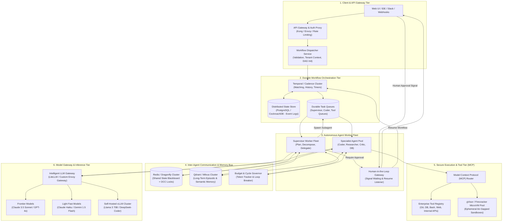
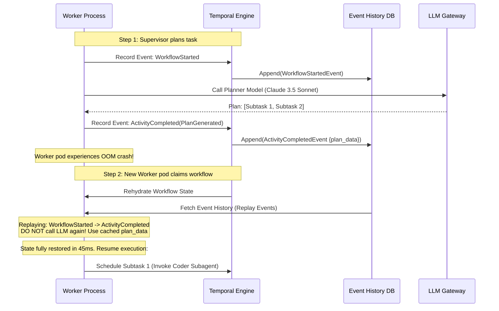
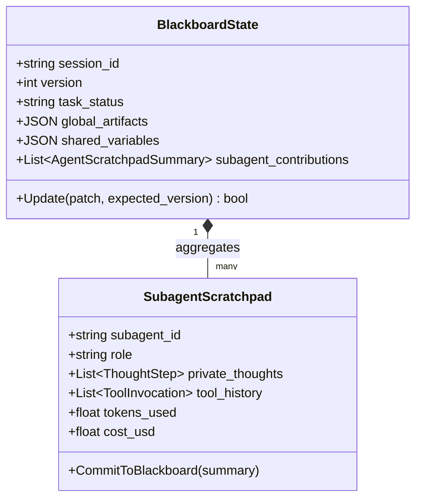
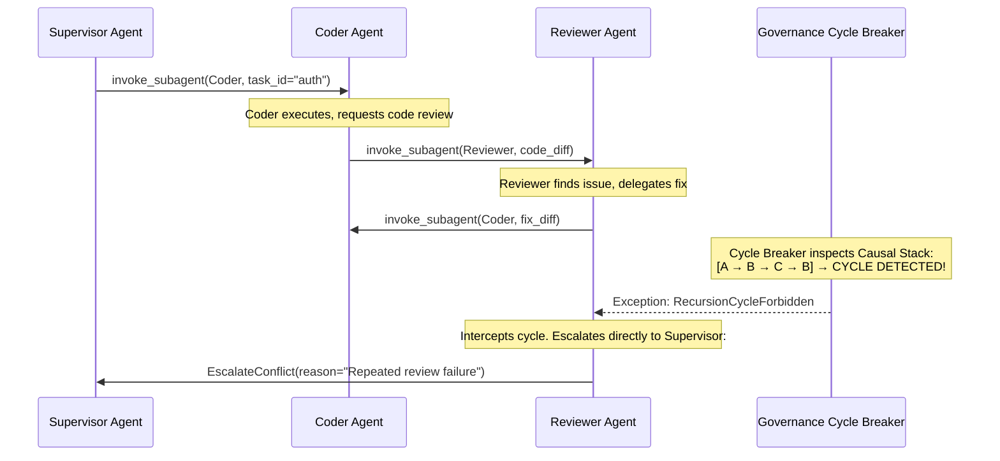
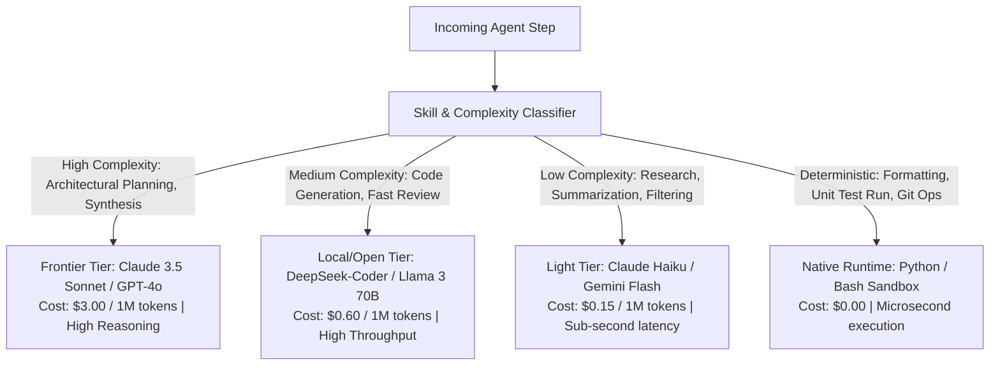
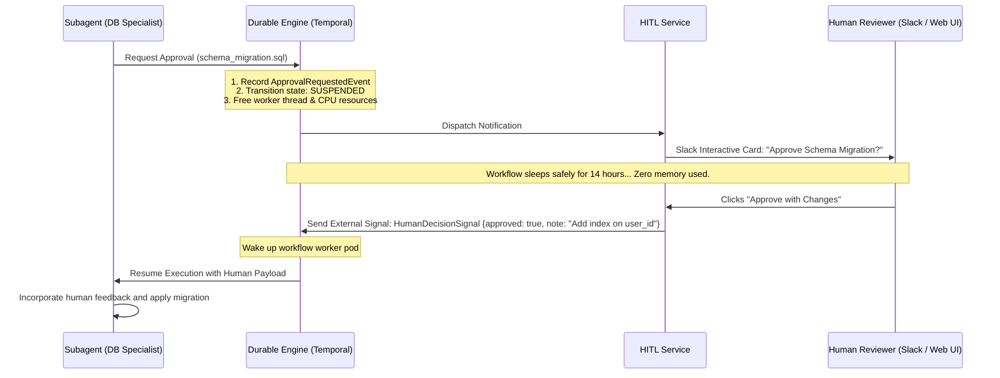
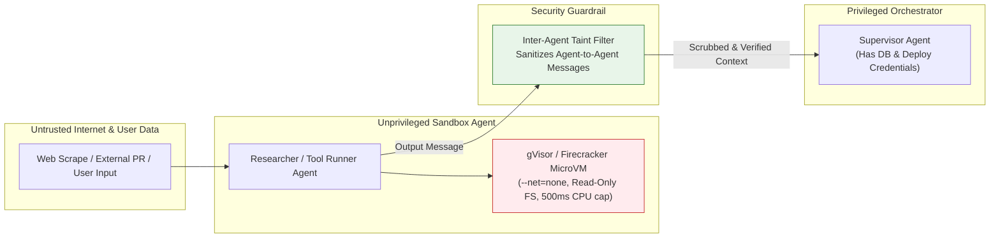

# Design a Production Multi-Agent Orchestration Platform

> [!IMPORTANT]
> **Production Code Engine & Verification Lab**:
> Fully implemented zero-dependency Actor runtime, Optimistic Concurrency Control (OCC) shared blackboard, ping-pong deadlock circuit breaker, event-sourced durable checkpointing, and asynchronous Human-in-the-Loop (HITL) suspension/resumption daemon with Prometheus telemetry.
> - **Walkthrough & Staff Playbook**: [`Volume-3/Walkthroughs/03-Multi-Agent-Orchestration/walkthrough.md`](02-Interactive-Interview-Playbook.md)
> - **Production Python Engine**: [`Volume-3/Walkthroughs/03-Multi-Agent-Orchestration/multi_agent_orchestrator.py`](multi_agent_orchestrator.py)
> - **Verification Suite**: `python3 multi_agent_orchestrator.py --test` (100% Passing)
> - **In-Memory Dispatch Benchmark**: `python3 multi_agent_orchestrator.py --benchmark` (286,212.2 Messages/sec)

## Problem Statement

Design an enterprise-grade, planet-scale **Multi-Agent Orchestration Platform** capable of orchestrating, coordinating, and governing hundreds of specialized autonomous AI agents (planners, coders, researchers, critics, database specialists, execution sandboxes) operating concurrently on complex, long-running business workflows.

Toy multi-agent frameworks (such as basic LangGraph, CrewAI, or AutoGPT prototypes) execute synchronously in local memory processes, store state in ephemeral RAM, fail catastrophically when an LLM call times out, suffer from infinite circular ping-pong loops, and lack multi-tenant security boundaries. 

A production-grade platform must provide:
1. **Durable, Fault-Tolerant Execution**: Workflows running for hours or days must survive process crashes, node restarts, and third-party API outages using event-sourced state machines (Temporal/Cadence architecture).
2. **Hybrid Coordination Topologies**: Support centralized supervisor-worker hierarchies, decentralized blackboard peer meshes, and dynamic directed acyclic graphs (DAGs).
3. **Deterministic State & Shared Memory Bus**: Granular isolation between private agent scratchpads and synchronized shared session state with optimistic concurrency control.
4. **Deadlock Prevention & Governance**: Real-time graph cycle detection, token/financial budget ceilings, and rate-limiting queues across heterogeneous LLM providers.
5. **Asynchronous Human-in-the-Loop (HITL)**: Non-blocking suspension and resumption when human authorization or guidance is required.
6. **Zero-Trust Privilege Separation**: Sandboxed tool execution (gVisor/Firecracker microVMs), cryptographic capability tokens, and defense against inter-agent prompt injection.

---

## Requirements Clarification

Here is an architectural interview dialogue establishing the system boundaries:

| # | Candidate Clarification Question | Interviewer Answer |
|---|---|---|
| 1 | What is the scale of concurrent agent workflows? | **100,000 concurrent active workflows**, executing **~10 Million agent steps/day** (~250–500 steps/sec average, peak 1,500 steps/sec). |
| 2 | What is the maximum workflow duration? | From a few seconds (e.g., code review) up to **72 hours** (e.g., complex multi-repo migration with human approval gates). |
| 3 | How do subagents communicate? | A standardized **Agent-to-Agent (A2A)** JSON-RPC/Protobuf protocol over an event bus, paired with **Model Context Protocol (MCP)** for tool calling. |
| 4 | What happens if a subagent crashes or hallucinates invalid arguments? | The orchestrator must retry with exponential backoff, reflect on the error trace, or fail over to an alternate model/agent without restarting the entire workflow. |
| 5 | How are models selected across subagents? | **Cost & Skill-Aware Dynamic Routing**: Planners use frontier models (Claude 3.5 Sonnet / GPT-4o), research and summarizers use light models (Haiku / Gemini Flash), deterministic tasks run in Python sandboxes. |
| 6 | How is human-in-the-loop (HITL) managed? | State is persisted and the execution worker process is freed. The workflow enters a suspended state awaiting a webhook from Slack/Web UI. |
| 7 | What are the security constraints? | Multi-tenant isolation, strict RBAC per agent, air-gapped code sandboxes, and defense against malicious prompt injection propagating between agents. |

### Functional Requirements

1. **Workflow Definition & Dynamic DAG Compilation**: Support declarative workflow schemas (code-as-configuration) with conditional branching, parallel fan-out/fan-in, and dynamic subagent spawning (`invoke_subagent`).
2. **Durable Event-Sourced Orchestration**: Every agent decision, LLM prompt/response, tool invocation, and state transition is checkpointed as an immutable event.
3. **Hybrid Agent Topologies**:
   - *Hierarchical Supervisor*: Supervisor decomposes goals, delegates to specialized workers, and synthesizes results.
   - *Blackboard Mesh*: Peer agents publish partial solutions to a shared memory bus and react to events asynchronously.
4. **Concurrency & Cycle Governance**: Enforce global timeouts, maximum step recursion depths, loop detectors, and strict monetary/token budget quotas.
5. **Shared Session & Memory Bus**: Provide thread-safe shared state updates with Optimistic Concurrency Control (OCC) and vector-backed episodic memory.
6. **Asynchronous HITL Interruption**: Suspend running state at approval checkpoints, release compute resources, and resume upon external approval.
7. **Comprehensive Observability**: Distributed OpenTelemetry tracing propagating parent-child span contexts across all agent hops.

### Non-Functional Requirements

- **Reliability & Exactly-Once Semantics**: Zero workflow loss upon worker node failure; state restores within < 2 seconds from event logs.
- **Latency & Responsiveness**: Internal agent-to-agent message bus latency < 10ms (excluding LLM inference).
- **Multi-Tenant Isolation**: Hard boundaries for state, memory embeddings, and tool credentials across tenants.
- **Elastic Scalability**: Scale execution workers independently of LLM proxy gateways and database storage.

---

## Back-of-the-Envelope Estimation

```
1. Workflow & Step Sizing:
   - Concurrent active workflows: 100,000
   - Daily workflow starts: 500,000 workflows/day
   - Average steps per workflow: 20 steps (Planners, Workers, Critics, Tools)
   - Total agent steps/day: 500k * 20 = 10 Million steps/day
   - Average step throughput: 10,000,000 / 86,400 = ~116 steps/sec (Peak: ~500 steps/sec)

2. State & Checkpoint Storage:
   - Average checkpoint payload (compressed state delta, prompt tokens, tool output): ~15 KB
   - Daily event log volume: 10M steps * 15 KB = 150 GB/day
   - Monthly state storage: 150 GB * 30 = 4.5 TB/month
   - 1-Year durable workflow archive (in PostgreSQL / CockroachDB + S3 cold tier): ~54 TB

3. LLM Gateway & Token Bandwidth:
   - Average prompt tokens per step: 2,500 tokens
   - Average completion tokens per step: 400 tokens
   - Total tokens per step: ~2,900 tokens
   - Daily token consumption: 10M steps * 2,900 = 29 Billion tokens/day
   - Peak token throughput: 500 steps/sec * 2,900 = ~1.45 Million tokens/sec
   - LLM Gateway must handle 1.5M tokens/sec with intelligent rate limiting, load balancing, and provider fallbacks (Anthropic, OpenAI, Google Cloud, local vLLM).

4. Compute Capacity for Execution Workers:
   - Average worker thread CPU usage during LLM wait is near-zero (I/O bound).
   - Using async event loops (Node.js / Go / Python asyncio with Temporal workers):
     Each 8-core, 16GB RAM worker node can comfortably hold 5,000 concurrent sleeping workflow statecharts.
   - Total worker nodes required: 100,000 concurrent workflows / 5,000 = ~20-25 high-memory worker instances.
```

---

## Key Architectural Decisions: Evolutionary Trade-Offs

```mermaid
graph TD
    classDef naive fill:#ffebee,stroke:#c62828,stroke-width:1px;
    classDef intermediate fill:#fff8e1,stroke:#f57f17,stroke-width:1px;
    classDef battleTested fill:#e8f5e9,stroke:#2e7d32,stroke-width:2px;

    subgraph "1. Orchestration & State Engine"
        S1["In-Memory LangGraph / Python Process<br/>Crashes lose state, zero durability"]:::naive --> S2["Database Polling State Machine<br/>High DB lock contention, 5s lag"]:::intermediate
        S2 --> S3["Durable Execution Engine (Temporal / Cadence)<br/>Event-sourced, replay-safe, infinite resume"]:::battleTested
    end

    subgraph "2. Coordination Topology"
        T1["Pure Peer-to-Peer Conversational Chat<br/>Infinite circular loops, no convergence"]:::naive --> T2["Rigid Linear Multi-Agent Pipeline<br/>Brittle, no dynamic parallelism"]:::intermediate
        T2 --> T3["Hierarchical Supervisor with Dynamic Subagents<br/>Adaptive task delegation, structured consensus"]:::battleTested
    end

    subgraph "3. Inter-Agent Communication Bus"
        C1["In-Prompt Context String Concatenation<br/>Prompt token explosion, context pollution"]:::naive --> C2["Central Shared SQL Table<br/>Row-level locking bottlenecks under load"]:::intermediate
        C2 --> C3["Blackboard Event Bus + Optimistic Concurrency<br/>Private scratchpads + atomic shared state delta"]:::battleTested
    end

    subgraph "4. Deadlock & Governance Strategy"
        G1["No Budget or Recursion Controls<br/>$500 runaway loops on LLM hallucinations"]:::naive --> G2["Hard Global Timeout (e.g. 5 mins)<br/>Kills legitimate long-running tasks"]:::intermediate
        G2 --> G3["Graph Cycle Detector + Dual Token/Budget Quotas<br/>Cycle breakers, hierarchical budget propagation"]:::battleTested
    end

    subgraph "5. Human-in-the-Loop (HITL)"
        H1["Blocking Thread / Sleep Polling<br/>Ties up server memory for hours"]:::naive --> H2["State Serialization to S3<br/>Complex manual hydration, race conditions"]:::intermediate
        H2 --> H3["First-Class Durable Signal Interruption<br/>Zero compute idle, deterministic webhook wake"]:::battleTested
    end
```



---

### Decision 1: Orchestration & State Engine

* **Core Goal**: Maintain guaranteed execution state across multi-hour workflows without data loss when worker pods crash, scale down, or fail.

| Stage | Strategy | Why It Fails / Bottlenecks at Scale | How Next Scenario Improves It |
|---|---|---|---|
| **Scenario 1 (Naive)** | **In-Memory Python Process (LangChain / CrewAI / basic LangGraph)**<br/>Agent state is held in runtime RAM variables; async tasks run on local threads. | **Zero Durability & Crash Amnesia**: If a Kubernetes pod restarts (OOM, spot instance eviction, deployment update), **all in-flight workflows are instantly lost**. Workflows running for 45 minutes disappear completely, forcing users to restart from scratch and billing thousands of wasted LLM tokens. | Persists state transitions to an external database. |
| **Scenario 2 (Intermediate)** | **Database-Backed Polling State Machine**<br/>State is serialized to PostgreSQL after each step; cron workers poll `WHERE status = 'pending'`. | **Severe Lock Contention & Polling Latency**: At 100k active workflows, polling creates massive database query floods (**tens of thousands of `SELECT FOR UPDATE` queries/sec**). Database CPU spikes to 100%, row-level lock deadlocks occur, and latency between agent steps degrades to 3–10 seconds. | Adopts an event-sourced durable execution engine. |
| **Scenario 3 (Production Choice)** | **Event-Sourced Durable Execution Engine (Temporal / Cadence / Durable Statecharts)** | **The Winning Architecture**: Execution is treated as an append-only **Event Log**. Every completed activity (LLM inference, tool execution, timer) appends an immutable event to a distributed ledger. If an agent worker crashes mid-task, a new worker rehydrates the exact state by **replaying the event history** without re-executing completed LLM calls or external side-effects. Supports workflows running for months with zero lost state. | **Staff Trade-Off**: Requires deterministic workflow code (no direct non-deterministic `Date.now()` or random calls outside activity boundaries). |

---

### Decision 2: Coordination Topology: Hierarchical vs Peer-to-Peer

* **Core Goal**: Coordinate multiple agents with differing specialties to solve ambiguous, multi-faceted tasks without diverging or entering infinite loops.

| Stage | Strategy | Why It Fails / Bottlenecks at Scale | How Next Scenario Improves It |
|---|---|---|---|
| **Scenario 1 (Naive)** | **Free-Form Peer-to-Peer Group Chat (AutoGPT / Early AutoGen)**<br/>All agents dump messages into a single shared chat room; next speaker is picked dynamically. | **Infinite Circular Ping-Pong & Chaos**: Agents easily enter endless polite conversational loops (*"Thank you! What do you think, Agent B?"* $\rightarrow$ *"Looks good, Agent C, your turn!"*). Context windows quickly fill with conversational banter rather than work. Task convergence rate on complex problems is $< 25\%$. | Enforces rigid step-by-step linear pipelines. |
| **Scenario 2 (Intermediate)** | **Sequential Linear Pipeline (Chains / Fixed Statecharts)**<br/>`Planner -> Coder -> Reviewer -> Tester` in a strictly hardcoded linear sequence. | **Rigid Inflexibility & Zero Parallelism**: Cannot adapt to dynamic task demands. If the Tester finds a bug, it must either restart the entire pipeline or fail. Parallel branches (e.g., researching 5 APIs concurrently) cannot be dynamically spawned or reconciled. | Introduces hierarchical supervision with dynamic subagent delegation. |
| **Scenario 3 (Production Choice)** | **Hierarchical Supervisor with Dynamic Subagent Lifecycle (`invoke_subagent`)** | **The Winning Architecture**: A dedicated **Supervisor / Orchestrator Agent** evaluates the high-level objective, decomposes it into independent subtasks, and dynamically invokes specialized subagents (`invoke_subagent(type, prompt, role)`). Subagents execute with isolated task scopes and report structured results back to the supervisor. Supports parallel fan-out, dynamic retries, critic reflection loops, and clean termination boundaries. | **Staff Trade-Off**: Supervisor prompt engineering is critical; the supervisor must be capable of effective task decomposition and result synthesis. |

---

### Decision 3: Inter-Agent Memory Architecture: Private Scratchpad vs Shared Blackboard

* **Core Goal**: Allow agents to collaborate on shared task state while preventing context pollution, race conditions, and prompt token bloat.

| Stage | Strategy | Why It Fails / Bottlenecks at Scale | How Next Scenario Improves It |
|---|---|---|---|
| **Scenario 1 (Naive)** | **Single Shared Context Window**<br/>All subagent reasoning thoughts, full tool outputs, and raw logs are concatenated into one global conversation prompt. | **Context Bloat & Cognitive Confusion**: Prompt tokens balloon past 128k in 5 steps. Irrelevant debug logs from the Coder pollute the Reviewer's prompt. Models suffer from "lost-in-the-middle" attention degradation, hallucinate contradictory facts, and cost explodes exponentially. | Isolates agent contexts and stores state in a database. |
| **Scenario 2 (Intermediate)** | **Direct Peer Message Passing via REST/gRPC**<br/>Subagents make direct point-to-point network calls to send payloads to each other. | **State Fragmentation & Spaghettification**: System state becomes distributed across dozens of ephemeral agent memories. No single entity possesses a reliable snapshot of the global task progress. Debugging failures requires reconstructing complex distributed logs across ephemeral network calls. | Adopts a decoupled Blackboard architecture with Optimistic Concurrency Control. |
| **Scenario 3 (Production Choice)** | **Dual-Tier Memory: Private Scratchpads + Synchronized Blackboard Bus with Optimistic Concurrency** | **The Winning Architecture**:<br/>1. **Private Scratchpad**: Each subagent maintains an isolated local memory containing its internal reasoning chain, intermediate tool results, and scratchpad files. Never exposed to other agents.<br/>2. **Shared Blackboard**: Global task state (e.g., final artifacts, user decisions, verified outputs) is stored in a centralized, versioned session store.<br/>3. **Optimistic Concurrency Control (OCC)**: When subagents update shared state, they submit updates with a version tag: `UPDATE session_state SET data = delta, version = version + 1 WHERE session_id = S AND version = V`. Conflicts trigger automated state re-merging. | **Staff Trade-Off**: Requires subagents to synthesize clean, structured updates rather than dumping raw logs into the shared store. |

---

### Decision 4: Deadlock Prevention & Resource Governance

* **Core Goal**: Protect infrastructure and budgets against recursive delegation loops, hung agents, and excessive API billing.

| Stage | Strategy | Why It Fails / Bottlenecks at Scale | How Next Scenario Improves It |
|---|---|---|---|
| **Scenario 1 (Naive)** | **Unbounded Execution & Global Timeout Only**<br/>Agents run until completion or hit a 10-minute global wall-clock timeout. | **Financial Disasters & Runaway Loops**: If an agent gets stuck in a recursive tool call loop (e.g., calling an API 50 times per minute), a 10-minute timeout is long enough to generate thousands of dollars in LLM API bills and trigger upstream API bans. | Introduces a simple step count limiter. |
| **Scenario 2 (Intermediate)** | **Static Step Limit (e.g. `max_steps = 25`)**<br/>Hard cap on the total number of actions across the workflow. | **False-Positive Task Termination**: Complex tasks requiring 30 legitimate steps get abruptly aborted right before completion, producing a 100% failure rate on heavy enterprise workflows. Meanwhile, simple 3-step tasks can still loop 20 times wastefully before dying. | Implements dynamic cycle detection and hierarchical token budgeting. |
| **Scenario 3 (Production Choice)** | **Directed Graph Cycle Detection + Hierarchical Budget Token Trees** | **The Winning Architecture**:<br/>1. **Causal Lineage & Cycle Breaker**: Every subagent invocation carries a causal execution path (`Supervisor -> Coder -> Reviewer`). If an agent attempts to invoke an ancestor or cycle through identical states ($A \rightarrow B \rightarrow A \rightarrow B$), the **Cycle Breaker** halts execution and forces an escalation step.<br/>2. **Hierarchical Budget Quotas**: The parent workflow is allocated a strict financial budget (e.g., \$5.00 and 100,000 tokens). When spawning a subagent, the parent delegates a slice of its budget: `invoke_subagent(..., budget_usd=1.00)`. If the subagent exhausts its slice, it terminates with an out-of-budget exception without crashing the parent. | **Staff Trade-Off**: Requires tracking token costs in real-time across multiple model providers. |

---

## High-Level Production System Architecture



---

## Low-Level Design & Deep Dives

### Deep Dive 1: Durable Execution Engine & Event-Sourcing Replay

When a workflow executes across multiple subagents, network partitions or process crashes must never corrupt state. We adopt an **Event-Sourced State Machine**:



#### Deterministic Replay Guarantees
1. **Activity Decoupling**: All non-deterministic operations (LLM generation, tool execution, fetching the time, generating a UUID) run inside isolated **Activities**.
2. **History Caching**: When replaying, the workflow logic re-runs. If it encounters a call to an Activity that already completed, it returns the stored result from the event log instantly without touching the network.
3. **Infinite Resume**: If an LLM provider has an outage for 4 hours, the activity retries with exponential backoff while the workflow state remains safely dormant in the database.

---

### Deep Dive 2: Inter-Agent Communication & The Blackboard Memory Bus

Subagents communicate via an asynchronous, versioned **Blackboard Memory Store** backed by Redis/Dragonfly with PostgreSQL persistence:



#### Optimistic Concurrency Control (OCC) Lua Script
When Subagent A and Subagent B execute concurrently and attempt to commit updates to the global blackboard, race conditions are resolved atomically using a Redis Lua script:

```lua
-- KEYS[1]: session blackboard key
-- ARGV[1]: expected version
-- ARGV[2]: delta JSON patch
-- ARGV[3]: subagent_id

local current_version = redis.call('HGET', KEYS[1], 'version')
if current_version ~= ARGV[1] then
    -- Version mismatch: conflict detected!
    return {err = "OCC_CONFLICT", current_version = current_version}
end

-- Apply delta patch and increment version
local new_version = tonumber(current_version) + 1
redis.call('HSET', KEYS[1], 'version', new_version)
redis.call('HSET', KEYS[1], 'last_modified_by', ARGV[3])
redis.call('HSET', KEYS[1], 'state_data', ARGV[2])
redis.call('PUBLISH', 'blackboard_events:' .. KEYS[1], ARGV[2])

return {ok = "SUCCESS", new_version = new_version}
```

If Subagent B encounters an `OCC_CONFLICT`, it retrieves the updated blackboard state, applies its changes on top of the new baseline, and re-submits.

---

### Deep Dive 3: Deadlock Detection, Cycle Breaking & Token Governance

Autonomous agents delegated subtasks can easily form circular dependency loops:
- Agent A delegates to Agent B
- Agent B asks Agent C for help
- Agent C decides Agent A is the best specialist to answer



#### Governance Invariants Enforced at Every Step:
1. **Recursion Depth Limit**: Maximum subagent delegation depth $\le 4$.
2. **DAG Cycle Check**: Before any `invoke_subagent` call is scheduled, the platform checks whether the target agent exists in the active caller lineage. If detected, invocation is blocked.
3. **Hierarchical Token Budget Slicing**:
   $$\text{Budget}_{\text{Parent}} \ge \sum \text{Budget}_{\text{Child Subagents}} + \text{Margin}$$
   If any subagent hits its assigned token or dollar ceiling, execution halts immediately with a graceful partial result return.

---

### Deep Dive 4: Dynamic Task Decomposition & Cost-Aware Model Routing

To optimize latency, cost, and intelligence across hundreds of agent steps, the **Workflow Dispatcher** routes requests dynamically based on task requirements:



#### Cost Optimization Impact
A naive system executing all 20 steps of a workflow on Claude 3.5 Sonnet costs **~\$0.18 per workflow**. 
With skill-based dynamic routing:
- 2 Planning steps on Frontier: \$0.03
- 4 Coding steps on Local 70B: \$0.012
- 10 Research/Summary steps on Fast Tier: \$0.005
- 4 Execution steps on Python Sandbox: \$0.00
- **Total Cost**: **~\$0.047 per workflow (74% cost reduction)** with equivalent or superior quality.

---

### Deep Dive 5: Asynchronous Human-in-the-Loop (HITL) Workflow Interruption

Production workflows inevitably require human approvals (e.g., approving a database migration script or reviewing a sensitive financial transfer).



---

### Deep Dive 6: Security, Sandbox Isolation & Inter-Agent Privilege Separation

In multi-agent environments, agents run arbitrary code and parse untrusted external data. Security requires strict **privilege separation**:



#### Security Guardrails:
1. **Least-Privilege Agent Tokens**: The Researcher agent possesses zero database credentials or AWS keys. It only receives an ephemeral capability token allowing it to invoke specific read-only MCP tools.
2. **Ephemeral MicroVM Sandboxes**: Python and Bash tools execute in microVMs (**Firecracker / gVisor**) with read-only root filesystems, memory caps of 512 MB, and strict network isolation.
3. **Inter-Agent Prompt Injection Firewall**: When Subagent A reports data to Subagent B, the message is scanned by a fast safety classifier (e.g., Llama Guard) to ensure Subagent A was not compromised by an indirect prompt injection contained within external web pages or user files.

---

## Database Schemas & Storage Layout

### 1. PostgreSQL / CockroachDB: Workflows & Agent Execution Ledger

```sql
-- Workflows Table
CREATE TABLE workflows (
    workflow_id         UUID PRIMARY KEY DEFAULT gen_random_uuid(),
    tenant_id           VARCHAR(64) NOT NULL,
    workflow_name       VARCHAR(128) NOT NULL,
    status              VARCHAR(32) NOT NULL,    -- 'RUNNING', 'SUSPENDED_HITL', 'COMPLETED', 'FAILED'
    initiator_id        VARCHAR(128) NOT NULL,
    budget_limit_usd    DECIMAL(10, 4) NOT NULL,
    current_cost_usd    DECIMAL(10, 4) DEFAULT 0.0000,
    created_at          TIMESTAMP WITH TIME ZONE DEFAULT NOW(),
    updated_at          TIMESTAMP WITH TIME ZONE DEFAULT NOW()
);

-- Immutable Event-Sourced Ledger Table
CREATE TABLE workflow_event_history (
    event_id            BIGSERIAL PRIMARY KEY,
    workflow_id         UUID NOT NULL REFERENCES workflows(workflow_id) ON DELETE CASCADE,
    step_number         INT NOT NULL,
    agent_id            VARCHAR(64) NOT NULL,
    agent_role          VARCHAR(64) NOT NULL,
    event_type          VARCHAR(64) NOT NULL,    -- 'AGENT_INVOKED', 'LLM_COMPLETED', 'TOOL_EXECUTED', 'OCC_STATE_PATCH'
    payload             JSONB NOT NULL,          -- Event inputs, outputs, tokens, tool results
    duration_ms         INT NOT NULL,
    cost_usd            DECIMAL(8, 6) NOT NULL,
    created_at          TIMESTAMP WITH TIME ZONE DEFAULT NOW(),
    CONSTRAINT uk_workflow_step UNIQUE (workflow_id, step_number)
);

CREATE INDEX idx_workflow_events ON workflow_event_history (workflow_id, step_number);
```

### 2. Redis: Shared Blackboard Session Store

```json
{
  "session_id": "wf_89f7a210-4e2b",
  "version": 14,
  "last_updated_by": "agent_coder_02",
  "global_state": {
    "target_repo": "acme/auth-service",
    "target_branch": "feature/oauth2",
    "architecture_decision": "Implement PKCE grant flow with Redis token store",
    "approved_by_human": true
  },
  "subagent_metadata": {
    "agent_planner": { "status": "COMPLETED", "tokens_spent": 4120 },
    "agent_coder_02": { "status": "RUNNING", "tokens_spent": 12450 },
    "agent_critic": { "status": "WAITING", "tokens_spent": 0 }
  }
}
```

---

## Operational Excellence & Failure Modes

### 1. The Stranded Workflow Problem (Orphaned Worker Pods)
* **Failure Mode**: An agent worker node dies while holding an execution lock on a workflow. If unmanaged, the workflow sits in a zombie running state forever.
* **Mitigation**: Heartbeat leases. Workers must touch a distributed lease in Redis every 10 seconds. If a worker fails to heartbeat for 30 seconds, Temporal marks the task lease expired and re-dispatches the activity to a healthy worker node.

### 2. Upstream LLM Provider Outages & Rate Limiting (429 Throttling)
* **Failure Mode**: Claude or OpenAI encounters a major outage or hits organization-level token rate limits, crashing thousands of running multi-agent tasks simultaneously.
* **Mitigation**:
  - **Provider Fallback Cascades**: The LLM Gateway automatically fails over from primary model to secondary fallback (e.g., Claude 3.5 Sonnet $\rightarrow$ GPT-4o $\rightarrow$ Self-hosted DeepSeek 70B).
  - **Exponential Jitter Retries with Durable Suspension**: If all providers are rate-limited, the workflow pauses without failing, backing off for 30–60 seconds before resuming.

### 3. Agent Hallucination Cascades
* **Failure Mode**: Subagent 1 hallucinates an invalid fact. Subagent 2 accepts it as ground truth and builds on it. By step 10, the entire workflow has diverged into an unrecoverable hallucination spiral.
* **Mitigation**:
  - **Critic Checkpoint Gates**: After every critical milestone, an independent Critic Agent verifies the output against ground-truth environment state (e.g., compiling code, running tests, or verifying database constraints). If verification fails, the orchestrator rolls back state to the previous checkpoint.

---

## Key Takeaways Checklist

> [!summary] Staff-Level Multi-Agent System Design Checklist
> 1. **Durable Execution is Mandatory**: Never run production multi-agent workflows on in-memory Python scripts. Use an event-sourced durable execution engine (Temporal/Cadence) to ensure 100% crash recovery and replayability.
> 2. **Avoid Free-Form Conversational Swarms**: Unstructured multi-agent group chats suffer from $O(N^2)$ chatter, circular loops, and high failure rates. Use **Hierarchical Supervisors with structured subagent delegation**.
> 3. **Dual-Tier Memory Prevents Token Bloat**: Isolate private agent thoughts and raw tool outputs in local scratchpads; commit only clean, versioned summaries to the **Shared Blackboard Bus using Optimistic Concurrency Control**.
> 4. **Hard Budget & Cycle Governance**: Enforce graph cycle detection and hierarchically pass token/dollar budgets to child agents to prevent runaway financial billing.
> 5. **Asynchronous HITL Releases Compute**: Design human approval steps as durable signal waits that free worker threads and wake up deterministically on external webhooks.
> 6. **Air-Gapped Sandboxing for Tools**: Always execute dynamic code tools in isolated microVMs (**gVisor / Firecracker**) with disabled network interfaces to block remote code execution and SSRF attacks.
